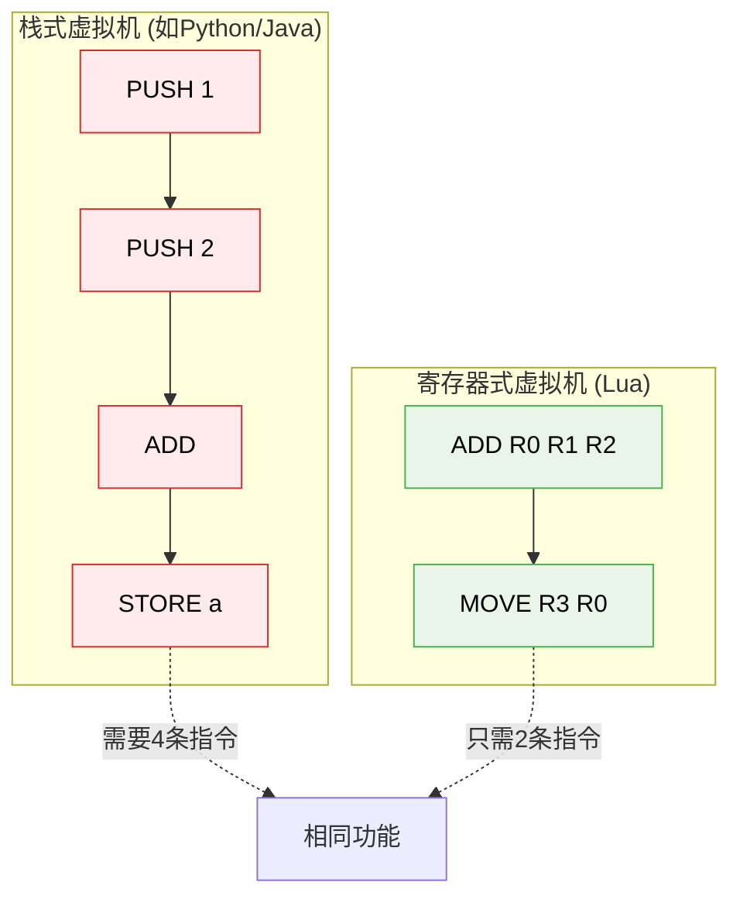
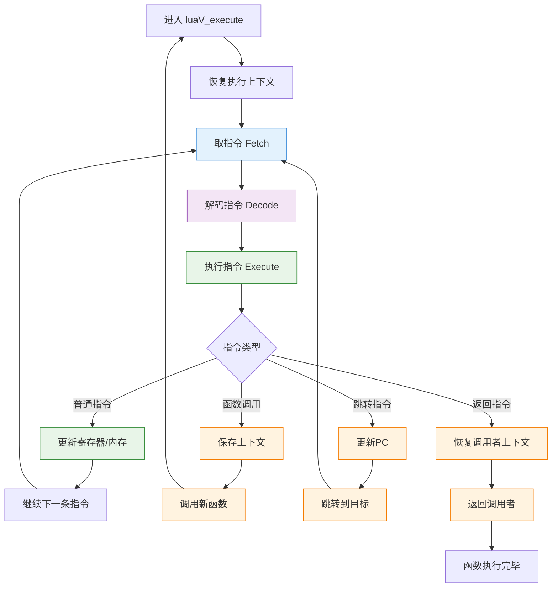

# 🚀 Lua 5.1.5 虚拟机执行引擎详解 (lvm.c)

> **学习目标**：深入理解Lua虚拟机的执行机制，掌握基于寄存器的虚拟机设计原理，理解字节码指令的解码和执行过程。

## 🎯 模块概述

Lua 虚拟机执行引擎 (lvm.c) 是整个 Lua 解释器的**核心心脏**，负责解释执行编译器生成的字节码指令。与传统的栈式虚拟机不同，Lua 采用**基于寄存器的虚拟机架构**，这种设计带来了显著的性能优势。

### 🏗️ 核心设计特点

1. **基于寄存器的架构**：减少指令数量，提高执行效率
2. **直接线程化技术**：优化指令分发机制
3. **统一的执行模型**：支持所有 Lua 语言特性
4. **高效的错误处理**：集成异常处理机制

## ⚙️ 虚拟机架构深度分析

### 🎛️ 寄存器式 vs 栈式对比



### 🔧 虚拟机状态结构

Lua 虚拟机的执行依赖于以下关键数据结构：

```c
// 虚拟机执行上下文
typedef struct lua_State {
    CommonHeader;
    lu_byte status;           // 执行状态
    StkId top;                // 栈顶指针
    StkId base;               // 当前函数栈基址
    global_State *l_G;        // 全局状态
    CallInfo *ci;             // 调用信息
    const Instruction *savedpc; // 当前程序计数器
    StkId stack_last;         // 栈的末尾
    StkId stack;              // 栈的开始
    CallInfo *end_ci;         // 调用栈末尾
    CallInfo *base_ci;        // 调用栈基址
    int stacksize;            // 栈大小
    int size_ci;              // 调用栈大小
    // ... 更多字段
} lua_State;
```

**关键字段解析**：
- **`top`**: 指向栈顶的下一个可用位置
- **`base`**: 当前函数的栈基址，所有局部变量和临时值都相对于此地址
- **`savedpc`**: 当前执行的指令地址，相当于程序计数器 (PC)
- **`ci`**: 当前调用信息，包含函数调用的上下文

## 📋 指令格式与编码

### 🎨 32位指令格式设计

Lua 使用精心设计的 32 位指令格式，在 `lopcodes.h` 中定义：

```c
// 指令字段大小定义
#define SIZE_C      9    // C 操作数 9 位
#define SIZE_B      9    // B 操作数 9 位  
#define SIZE_Bx     (SIZE_C + SIZE_B)  // Bx = 18 位
#define SIZE_A      8    // A 操作数 8 位
#define SIZE_OP     6    // 操作码 6 位

// 指令字段位置
#define POS_OP      0    // 操作码起始位置
#define POS_A       (POS_OP + SIZE_OP)      // A 字段位置
#define POS_C       (POS_A + SIZE_A)        // C 字段位置  
#define POS_B       (POS_C + SIZE_C)        // B 字段位置
#define POS_Bx      POS_C                   // Bx 字段位置
```

### 🔧 三种指令格式详解

```
Format 1: iABC - 三操作数格式
 31    23    15     7      0
 |     |     |     |      |
 [ B ][ C ][ A ][  OP   ]
 
Format 2: iABx - 大操作数格式  
 31          14     7      0
 |           |     |      |
 [     Bx    ][ A ][  OP  ]
 
Format 3: iAsBx - 有符号大操作数格式
 31          14     7      0  
 |           |     |      |
 [    sBx    ][ A ][  OP  ]
```

**字段含义**：
- **OP (6位)**：操作码，支持最多 64 种指令
- **A (8位)**：主目标寄存器，范围 0-255
- **B, C (9位)**：源操作数，可表示寄存器或常量索引
- **Bx (18位)**：大操作数，通常用于常量表索引
- **sBx (18位)**：有符号操作数，用于跳转偏移

### 🎯 指令类型分类

| 类型 | 格式 | 典型指令 | 用途说明 |
|------|------|----------|----------|
| **算术运算** | iABC | ADD, SUB, MUL | `R(A) = RK(B) op RK(C)` |
| **数据移动** | iABC | MOVE, LOADK | 寄存器间数据传输 |
| **控制流** | iAsBx | JMP, FORLOOP | 条件/无条件跳转 |
| **函数调用** | iABC | CALL, RETURN | 函数调用和返回 |
| **表操作** | iABC | GETTABLE, SETTABLE | 表的读写操作 |

## 🚀 核心执行函数：luaV_execute

### 📍 函数签名与核心逻辑

```c
void luaV_execute (lua_State *L, int nexeccalls) {
    LClosure *cl;          // 当前闭包
    StkId base;            // 栈基址
    TValue *k;             // 常量表
    const Instruction *pc; // 程序计数器
    
reentry:  /* 重入点 - 处理函数调用 */
    lua_assert(isLua(L->ci));
    pc = L->savedpc;       // 恢复程序计数器
    cl = &clvalue(L->ci->func)->l;  // 获取当前闭包
    base = L->base;        // 设置栈基址
    k = cl->p->k;          // 获取常量表

    /* 主执行循环 - 虚拟机的心脏 */
    for (;;) {
        const Instruction i = *pc++;  // 取指令 (Fetch)
        StkId ra = RA(i);            // 解析A操作数地址
        
        switch (GET_OPCODE(i)) {      // 指令分发 (Dispatch)
            case OP_MOVE: {
                setobjs2s(L, ra, RB(i));  // R(A) := R(B)
                continue;
            }
            
            case OP_LOADK: {
                setobj2s(L, ra, KBx(i));  // R(A) := Kst(Bx)  
                continue;
            }
            
            case OP_ADD: {
                arith_op(luai_numadd, TM_ADD);  // R(A) := RK(B) + RK(C)
                continue; 
            }
            
            // ... 更多指令实现
        }
    }
}
```

### 🔄 执行流程详解



### 🎮 关键宏定义解析

```c
// 操作数访问宏
#define RA(i)    (base+GETARG_A(i))           // 获取A寄存器地址
#define RB(i)    check_exp(getBMode(GET_OPCODE(i)) == OpArgR, base+GETARG_B(i))
#define RC(i)    check_exp(getCMode(GET_OPCODE(i)) == OpArgR, base+GETARG_C(i))
#define RKB(i)   check_exp(getBMode(GET_OPCODE(i)) == OpArgK, \
                    ISK(GETARG_B(i)) ? k+INDEXK(GETARG_B(i)) : base+GETARG_B(i))
#define RKC(i)   check_exp(getCMode(GET_OPCODE(i)) == OpArgK, \
                    ISK(GETARG_C(i)) ? k+INDEXK(GETARG_C(i)) : base+GETARG_C(i))
#define KBx(i)   check_exp(getBMode(GET_OPCODE(i)) == OpArgK, k+GETARG_Bx(i))

// 常量与寄存器区分
#define ISK(x)          ((x) & BITRK)         // 是否为常量索引
#define INDEXK(r)       ((int)(r) & ~BITRK)   // 获取常量索引
#define MAXINDEXRK      (BITRK - 1)           // 最大寄存器索引  
#define BITRK           (1 << (SIZE_B - 1))   // 常量标记位
```

**设计巧思**：
- **RK 操作数**：同时支持寄存器 (R) 和常量 (K)，通过最高位区分
- **地址计算**：基于 base 指针的相对寻址，支持函数调用栈
- **类型检查**：在调试模式下进行操作数类型验证
#define POS_A       (POS_OP + SIZE_OP)
#define POS_C       (POS_A + SIZE_A)
#define POS_B       (POS_C + SIZE_C)
#define POS_Bx      POS_C

/*
** 指令格式：
** iABC: A(8) | C(9) | B(9) | OP(6)
** iABx: A(8) | Bx(18) | OP(6)
** iAsBx: A(8) | sBx(signed 18) | OP(6)
*/
```

### 主执行循环

虚拟机的核心是 `luaV_execute` 函数：

```c
void luaV_execute (lua_State *L, int nexeccalls) {
  LClosure *cl;
  StkId base;
  TValue *k;
  const Instruction *pc;
 reentry:  /* entry point */
  lua_assert(isLua(L->ci));
  pc = L->savedpc;
  cl = &clvalue(L->ci->func)->l;
  base = L->base;
  k = cl->p->k;
  /* main loop of interpreter */
  for (;;) {
    const Instruction i = *pc++;
    StkId ra;
    if ((L->hookmask & (LUA_MASKLINE | LUA_MASKCOUNT)) &&
        (--L->hookcount == 0 || L->hookmask & LUA_MASKLINE)) {
      traceexec(L, pc);
      if (L->status == LUA_YIELD) {  /* did hook yield? */
        L->savedpc = pc - 1;
        return;
      }
      base = L->base;
    }
    /* warning!! several calls may realloc the stack and invalidate `ra' */
    ra = RA(i);
    lua_assert(base == L->base && L->base == L->ci->base);
    lua_assert(base <= L->top && L->top <= L->stack + L->stacksize);
    lua_assert(L->top == L->ci->top || luaG_checkopenop(i));
    switch (GET_OPCODE(i)) {
      case OP_MOVE: {
        setobjs2s(L, ra, RB(i));
        continue;
      }
      case OP_LOADK: {
        setobj2s(L, ra, KBx(i));
        continue;
      }
      /* ... 其他指令 */
    }
  }
}
```

## 核心指令详解

### 1. 数据移动指令

#### OP_MOVE A B
将栈位置 B 的值复制到位置 A。

```c
case OP_MOVE: {
  setobjs2s(L, ra, RB(i));
  break;
}
```

#### OP_LOADK A Bx
将常量 Bx 加载到寄存器 A。

```c
case OP_LOADK: {
  setobj2s(L, ra, KBx(i));
  break;
}
```

#### OP_LOADNIL A B
将 nil 加载到寄存器 A 到 A+B。

```c
case OP_LOADNIL: {
  TValue *rb = RB(i);
  do {
    setnilvalue(rb--);
  } while (rb >= ra);
  break;
}
```

### 2. 算术指令

#### OP_ADD A B C
执行加法：A = B + C

```c
case OP_ADD: {
  arith_op(luai_numadd, TM_ADD);
  break;
}

// 算术操作宏
#define arith_op(op,tm) { \
  TValue *rb = RKB(i); \
  TValue *rc = RKC(i); \
  if (ttisnumber(rb) && ttisnumber(rc)) { \
    lua_Number nb = nvalue(rb), nc = nvalue(rc); \
    setnvalue(ra, op(nb, nc)); \
  } \
  else \
    Protect(luaV_arith(L, ra, rb, rc, tm)); \
}
```

### 3. 比较指令

#### OP_EQ A B C
比较相等：if ((RK(B) == RK(C)) ~= A) then pc++

```c
case OP_EQ: {
  TValue *rb = RKB(i);
  TValue *rc = RKC(i);
  Protect(
    if (equalobj(L, rb, rc) != GETARG_A(i))
      dojump(L, pc, GETARG_sBx(*pc));
  )
  pc++;
  break;
}
```

### 4. 逻辑指令

#### OP_TEST A C
条件测试：if not (R(A) <=> C) then pc++

```c
case OP_TEST: {
  if (l_isfalse(ra) != GETARG_C(i))
    dojump(L, pc, GETARG_sBx(*pc));
  pc++;
  break;
}
```

### 5. 跳转指令

#### OP_JMP sBx
无条件跳转：pc += sBx

```c
case OP_JMP: {
  dojump(L, pc, GETARG_sBx(i));
  break;
}

// 跳转实现
#define dojump(L,pc,i)  {(pc) += (i); luai_threadyield(L);}
```

### 6. 表操作指令

#### OP_GETTABLE A B C
表索引：A = B[C]

```c
case OP_GETTABLE: {
  Protect(luaV_gettable(L, RB(i), RKC(i), ra));
  break;
}
```

#### OP_SETTABLE A B C
表设置：A[B] = C

```c
case OP_SETTABLE: {
  Protect(luaV_settable(L, ra, RKB(i), RKC(i)));
  break;
}
```

### 7. 函数调用指令

#### OP_CALL A B C
函数调用：A(B-1个参数)，返回C-1个结果

```c
case OP_CALL: {
  int b = GETARG_B(i);
  int nresults = GETARG_C(i) - 1;
  if (b != 0) L->top = ra+b;  // 设置参数数量
  L->savedpc = pc;
  switch (luaD_precall(L, ra, nresults)) {
    case PCRLUA: {
      nexeccalls++;
      goto reentry;  // 尾调用优化
    }
    case PCRC: {
      // C 函数调用已完成
      if (nresults >= 0) L->top = L->ci->top;
      base = L->base;
      break;
    }
    default: {
      return;  // 挂起的调用
    }
  }
  break;
}
```

#### OP_TAILCALL A B C
尾调用优化

```c
case OP_TAILCALL: {
  int b = GETARG_B(i);
  if (b != 0) L->top = ra+b;
  L->savedpc = pc;
  lua_assert(GETARG_C(i) - 1 == LUA_MULTRET);
  if (luaD_precall(L, ra, LUA_MULTRET) == PCRLUA) {
    // 尾调用：重用栈帧
    CallInfo *ci = L->ci - 1;  // 前一个调用信息
    CallInfo *lim = L->base_ci;
    StkId tb = ci->top;
    while (ci > lim && ci->tailcalls < LUAI_MAXTAILCALLS) {
      // 实现尾调用优化
      ci->tailcalls++;
    }
    goto reentry;
  }
  base = L->base;
  break;
}
```

### 8. 闭包和 Upvalue 指令

#### OP_GETUPVAL A B
获取 upvalue：A = UpValue[B]

```c
case OP_GETUPVAL: {
  int b = GETARG_B(i);
  setobj2s(L, ra, cl->upvals[b]->v);
  break;
}
```

#### OP_SETUPVAL A B
设置 upvalue：UpValue[B] = A

```c
case OP_SETUPVAL: {
  UpVal *uv = cl->upvals[GETARG_B(i)];
  setobj(L, uv->v, ra);
  luaC_barrier(L, uv, ra);
  break;
}
```

#### OP_CLOSURE A Bx
创建闭包：A = closure(KPROTO[Bx], UPVAL)

```c
case OP_CLOSURE: {
  Proto *p;
  Closure *ncl;
  int nup, j;
  p = cl->p->p[GETARG_Bx(i)];
  nup = p->nups;
  ncl = luaF_newLclosure(L, nup, cl->env);
  ncl->l.p = p;
  for (j=0; j<nup; j++, pc++) {
    if (GET_OPCODE(*pc) == OP_GETUPVAL)
      ncl->l.upvals[j] = cl->upvals[GETARG_B(*pc)];
    else {
      lua_assert(GET_OPCODE(*pc) == OP_MOVE);
      ncl->l.upvals[j] = luaF_findupval(L, base + GETARG_B(*pc));
    }
  }
  setclvalue(L, ra, ncl);
  Protect(luaC_checkGC(L));
  break;
}
```

## 辅助函数

### 1. 算术操作

```c
void luaV_arith (lua_State *L, StkId ra, const TValue *rb,
                               const TValue *rc, TMS op) {
  TValue tempb, tempc;
  const TValue *b, *c;
  if ((b = luaV_tonumber(rb, &tempb)) != NULL &&
      (c = luaV_tonumber(rc, &tempc)) != NULL) {
    lua_Number nb = nvalue(b), nc = nvalue(c);
    switch (op) {
      case TM_ADD: setnvalue(ra, luai_numadd(nb, nc)); break;
      case TM_SUB: setnvalue(ra, luai_numsub(nb, nc)); break;
      case TM_MUL: setnvalue(ra, luai_nummul(nb, nc)); break;
      case TM_DIV: setnvalue(ra, luai_numdiv(nb, nc)); break;
      case TM_MOD: setnvalue(ra, luai_nummod(nb, nc)); break;
      case TM_POW: setnvalue(ra, luai_numpow(nb, nc)); break;
      case TM_UNM: setnvalue(ra, luai_numunm(nb)); break;
      default: lua_assert(0); break;
    }
  }
  else if (!call_binTM(L, rb, rc, ra, op))
    luaG_aritherror(L, rb, rc);
}
```

### 2. 表操作

```c
void luaV_gettable (lua_State *L, const TValue *t, TValue *key, StkId val) {
  int loop;
  for (loop = 0; loop < MAXTAGLOOP; loop++) {
    const TValue *tm;
    if (ttistable(t)) {  // 是表？
      Table *h = hvalue(t);
      const TValue *res = luaH_get(h, key);  // 原始获取
      if (!ttisnil(res) ||  // 结果不是 nil？
          (tm = fasttm(L, h->metatable, TM_INDEX)) == NULL) { // 或没有 TM？
        setobj2s(L, val, res);
        return;
      }
      // 否则尝试元方法
    }
    else if (ttisnil(tm = luaT_gettmbyobj(L, t, TM_INDEX)))
      luaG_typeerror(L, t, "index");
    if (ttisfunction(tm)) {
      callTMres(L, tm, t, key, val);
      return;
    }
    t = tm;  // 否则重复访问 tm 
  }
  luaG_runerror(L, "loop in gettable");
}
```

### 3. 字符串连接

```c
void luaV_concat (lua_State *L, int total, int last) {
  do {
    StkId top = L->base + last + 1;
    int n = 2;  // 至少连接两个元素
    if (!(ttisstring(top-2) || ttisnumber(top-2)) || !tostring(L, top-1)) {
      if (!call_binTM(L, top-2, top-1, top-2, TM_CONCAT))
        luaG_concaterror(L, top-2, top-1);
    } else if (tsvalue(top-1)->len == 0)  // 第二个是空？
      (void)tostring(L, top - 2);  // 结果是第一个
    else {
      // 至少两个字符串；获取尽可能多的字符串
      size_t tl = tsvalue(top-1)->len;
      char *buffer;
      int i;
      // 收集总长度
      for (n = 1; n < total && tostring(L, top-n-1); n++) {
        size_t l = tsvalue(top-n-1)->len;
        if (l >= MAX_SIZET - tl) luaG_runerror(L, "string length overflow");
        tl += l;
      }
      buffer = luaZ_openspace(L, &G(L)->buff, tl);
      tl = 0;
      for (i=n; i>0; i--) {  // 复制所有字符串到缓冲区
        size_t l = tsvalue(top-i)->len;
        memcpy(buffer+tl, svalue(top-i), l);
        tl += l;
      }
      setsvalue2s(L, top-n, luaS_newlstr(L, buffer, tl));
    }
    total -= n-1;  // 得到 n 个字符串并创建了 1 个
    last -= n-1;
  } while (total > 1);  // 重复直到只有一个结果
}
```

## 性能优化

### 1. 指令分发

Lua 使用 switch 语句进行指令分发，现代编译器会优化为跳转表：

```c
switch (GET_OPCODE(i)) {
  case OP_MOVE: /* ... */ break;
  case OP_LOADK: /* ... */ break;
  // ...
}
```

### 2. 寄存器分配

Lua 的"寄存器"实际上是栈位置，通过宏进行快速访问：

```c
#define RA(i)   (base+GETARG_A(i))
#define RB(i)   check_exp(getBMode(GET_OPCODE(i)) == OpArgR, base+GETARG_B(i))
#define RC(i)   check_exp(getCMode(GET_OPCODE(i)) == OpArgR, base+GETARG_C(i))
#define RKB(i)  check_exp(getBMode(GET_OPCODE(i)) == OpArgK, \
                ISK(GETARG_B(i)) ? k+INDEXK(GETARG_B(i)) : base+GETARG_B(i))
#define RKC(i)  check_exp(getCMode(GET_OPCODE(i)) == OpArgK, \
                ISK(GETARG_C(i)) ? k+INDEXK(GETARG_C(i)) : base+GETARG_C(i))
```

### 3. 数字操作优化

数字操作在可能时直接在 C 级别执行：

```c
if (ttisnumber(rb) && ttisnumber(rc)) {
  lua_Number nb = nvalue(rb), nc = nvalue(rc);
  setnvalue(ra, luai_numadd(nb, nc));
}
```

### 4. 表访问优化

表访问首先尝试直接查找，失败后才调用元方法：

```c
if (ttistable(t)) {
  Table *h = hvalue(t);
  const TValue *res = luaH_get(h, key);
  if (!ttisnil(res) || /* 没有元方法 */) {
    setobj2s(L, val, res);
    return;
  }
}
```

## 调试支持

### 1. 行号信息

虚拟机在执行时跟踪行号信息：

```c
#define dojump(L,pc,i) {(pc) += (i); luai_threadyield(L);}

// 在调试模式下更新行号
if (L->hookmask & (LUA_MASKLINE | LUA_MASKCOUNT))
  luaG_traceexec(L, pc);
```

### 2. 钩子函数

在适当时候调用调试钩子：

```c
void luaG_traceexec (lua_State *L, const Instruction *pc) {
  lu_byte mask = L->hookmask;
  const Instruction *oldpc = L->savedpc;
  L->savedpc = pc;
  if (mask & LUA_MASKCOUNT) {
    if (L->hookcount == 0) {
      resethookcount(L);
      luaD_callhook(L, LUA_HOOKCOUNT, -1);
    }
  }
  if (mask & LUA_MASKLINE) {
    Proto *p = ci_func(L->ci)->l.p;
    int npc = pcRel(pc, p);
    int newline = getline(p, npc);
    if (npc == 0 ||  // 调用钩子
        pc <= oldpc ||  // 循环跳转？
        newline != getline(p, pcRel(oldpc, p)))  // 新行？
      luaD_callhook(L, LUA_HOOKLINE, newline);
  }
}
```

## 总结

Lua 虚拟机通过以下设计实现了高效执行：

1. **简洁的指令集**：精心设计的指令格式和操作
2. **基于栈的架构**：简化了代码生成和执行
3. **快速指令分发**：高效的 switch 语句分发
4. **内联优化**：常见操作的快速路径
5. **尾调用优化**：避免栈溢出的尾递归
6. **调试支持**：完整的调试钩子机制

虚拟机是 Lua 高性能的关键，其设计平衡了简洁性和效率，为 Lua 语言提供了稳固的执行基础。

---

*相关文档：[调用栈管理](wiki_call.md) | [函数系统](wiki_function.md) | [对象系统](wiki_object.md)*