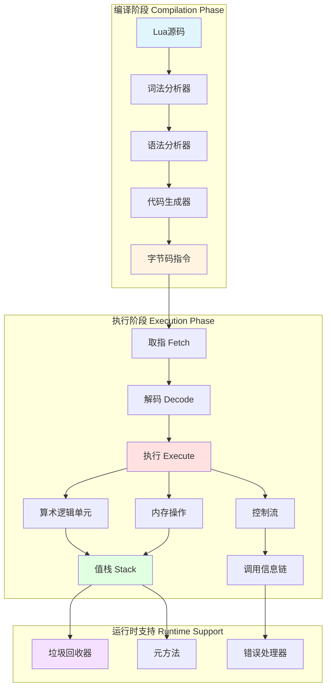
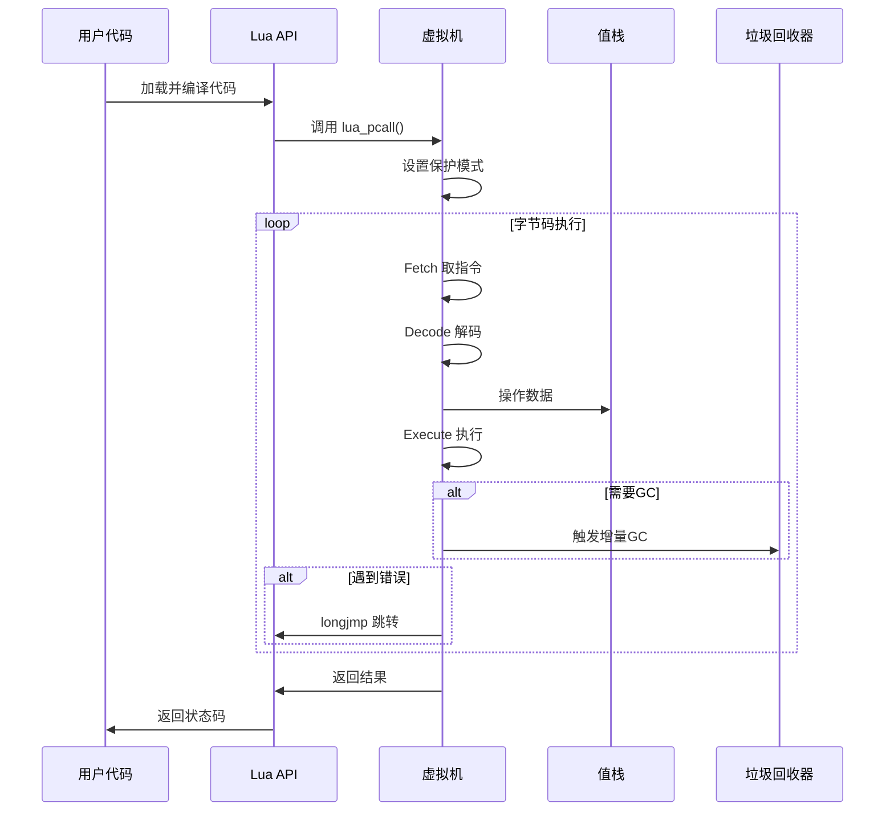
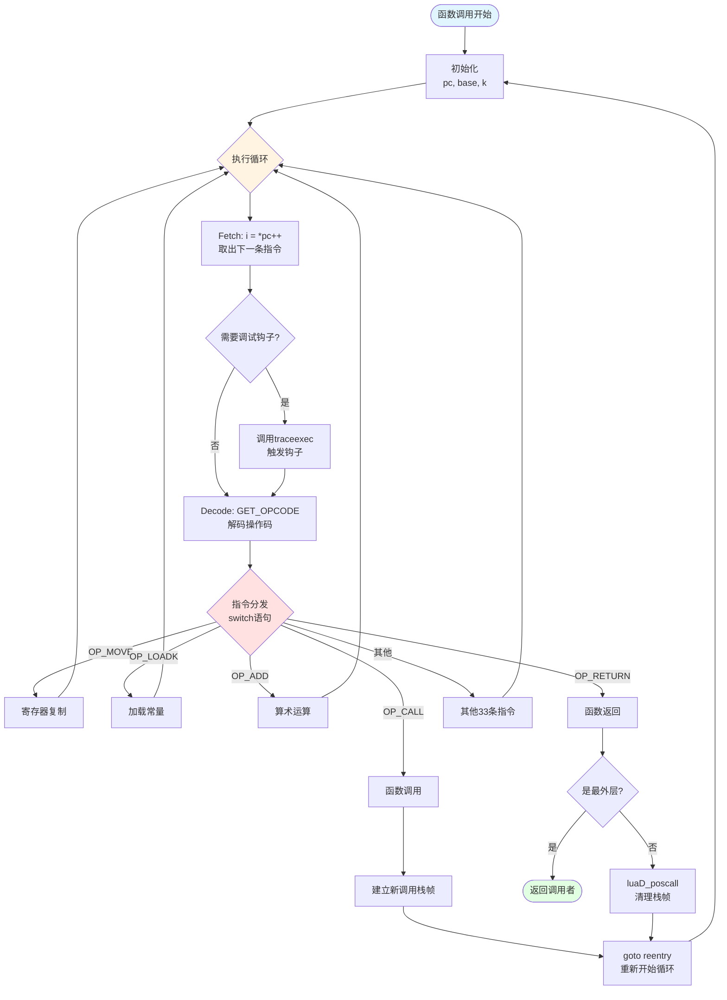
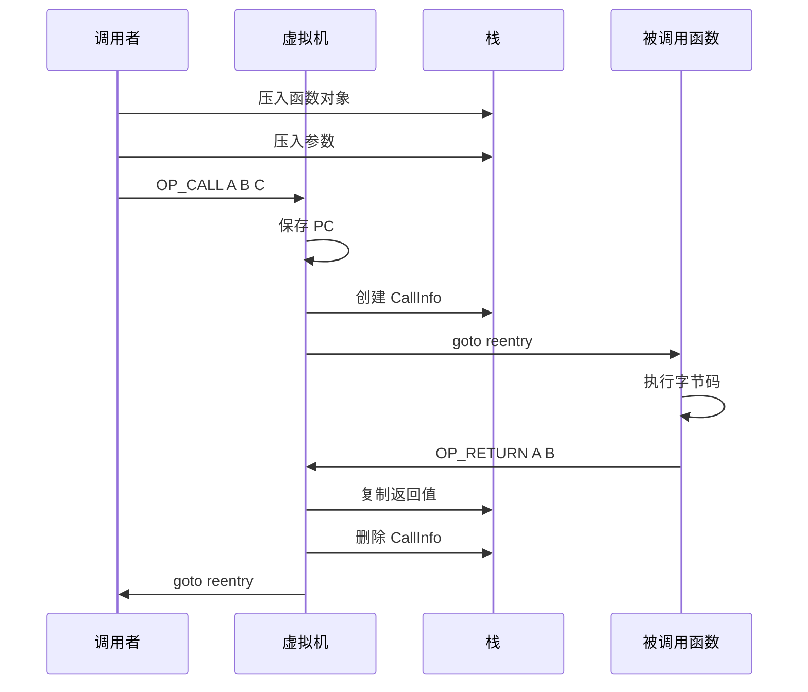
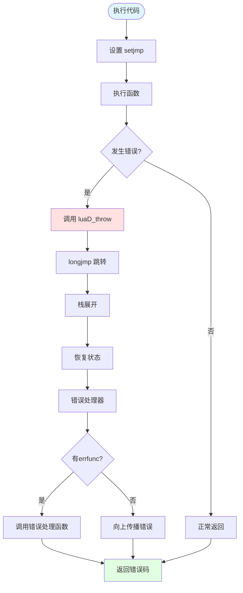

# 🖥️ 虚拟机模块完全指南

> **模块定位**：Lua 字节码解释执行的核心引擎 - 基于寄存器的高性能虚拟机实现

<details>
<summary><b>📋 快速导航</b></summary>

- [模块概述](#-模块概述)
- [虚拟机架构](#-虚拟机架构设计)
- [寄存器式设计](#-寄存器式虚拟机)
- [指令执行循环](#-指令执行循环)
- [函数调用机制](#-函数调用机制)
- [栈管理系统](#-栈管理系统)
- [错误处理](#-错误处理机制)
- [核心数据结构](#-核心数据结构)
- [性能优化技术](#-性能优化技术)
- [实战示例](#-实战示例)

</details>

---

## 📋 模块概述

### 核心职责

Lua 虚拟机（Virtual Machine, VM）是 Lua 解释器的**执行引擎核心**，负责解释执行编译器生成的字节码指令。它采用**基于寄存器的虚拟机架构**，这是 Lua 高性能的关键所在。

虚拟机的核心职责包括：

- **字节码解释执行**：取指、解码、执行的经典循环
- **栈和寄存器管理**：高效的数据存储和访问
- **函数调用控制**：Lua函数和C函数的统一调用
- **类型运算支持**：动态类型的算术和逻辑运算
- **元方法分发**：运算符重载和面向对象支持
- **错误处理和恢复**：异常捕获和栈展开

### 实现文件

<table>
<tr>
<th width="25%">文件</th>
<th width="35%">职责</th>
<th width="40%">关键函数</th>
</tr>

<tr>
<td><code>lvm.c/h</code></td>
<td>虚拟机执行引擎</td>
<td>
<code>luaV_execute()</code> - 字节码解释器<br/>
<code>luaV_tonumber()</code> - 类型转换<br/>
<code>luaV_concat()</code> - 字符串连接<br/>
<code>luaV_equalval()</code> - 值比较
</td>
</tr>

<tr>
<td><code>ldo.c/h</code></td>
<td>执行控制和调用管理</td>
<td>
<code>luaD_call()</code> - 函数调用<br/>
<code>luaD_pcall()</code> - 保护调用<br/>
<code>luaD_rawrunprotected()</code> - 保护执行<br/>
<code>luaD_growstack()</code> - 栈扩展
</td>
</tr>

<tr>
<td><code>lstate.c/h</code></td>
<td>虚拟机状态管理</td>
<td>
<code>lua_newstate()</code> - 创建状态<br/>
<code>lua_close()</code> - 销毁状态<br/>
<code>lua_newthread()</code> - 创建协程
</td>
</tr>

<tr>
<td><code>lopcodes.c/h</code></td>
<td>指令集定义</td>
<td>
38条指令的操作码定义<br/>
指令编码/解码宏<br/>
指令格式定义
</td>
</tr>
</table>

### 设计特点

| 特点 | 说明 | 优势 |
|------|------|------|
| 🎯 **寄存器式架构** | 指令直接操作虚拟寄存器 | 减少内存访问，指令数量少30-40% |
| 🚀 **紧凑指令集** | 仅38条指令，32位固定长度 | 解码快速，缓存友好 |
| 🔄 **统一调用约定** | Lua函数和C函数透明调用 | 简化FFI，提升互操作性 |
| 🛡️ **保护执行** | setjmp/longjmp异常机制 | 安全的错误处理，防止崩溃 |
| 📊 **栈式数据管理** | 统一的值栈存储 | 简化GC，高效内存管理 |
| ⚡ **尾调用优化** | 复用栈帧，避免栈溢出 | 支持函数式编程风格 |

---

## 🏗️ 虚拟机架构设计

### 整体架构图



### 虚拟机状态 (lua_State)

`lua_State` 是虚拟机执行的核心数据结构，包含了执行所需的所有状态信息：

```c
struct lua_State {
    CommonHeader;
    
    /* 栈管理 */
    StkId top;              // 栈顶指针
    StkId base;             // 当前函数的基址
    global_State *l_G;      // 全局状态
    CallInfo *ci;           // 当前调用信息
    const Instruction *savedpc;  // 当前执行指令
    StkId stack_last;       // 栈的最后位置
    StkId stack;            // 栈底
    
    /* 调用链管理 */
    CallInfo *end_ci;       // 调用信息链的末尾
    CallInfo *base_ci;      // 调用信息链的起始
    
    /* 错误处理 */
    int stacksize;          // 栈大小
    int size_ci;            // 调用信息链大小
    unsigned short nCcalls; // 嵌套C调用深度
    unsigned short baseCcalls; // 基础C调用深度
    lu_byte hookmask;       // 钩子掩码
    lu_byte allowhook;      // 是否允许钩子
    
    /* 钩子和调试 */
    lua_Hook hook;          // 调试钩子函数
    TValue l_gt;            // 全局表
    TValue env;             // 环境表
    
    /* GC相关 */
    GCObject *openupval;    // 打开的upvalue链表
    GCObject *gclist;       // GC链表
    
    /* 错误处理 */
    struct lua_longjmp *errorJmp;  // 错误跳转点
    ptrdiff_t errfunc;      // 错误处理函数
};
```

### 执行模型概览



---

## 🎯 寄存器式虚拟机

### 寄存器式 vs 栈式对比

Lua 采用**寄存器式虚拟机架构**，这是它相比Python、Java等栈式虚拟机性能优势的关键。

#### 架构对比示例

**示例代码**：`local a = b + c`

**栈式虚拟机（如Python、Java）**：
```
LOAD_LOCAL  b      ; 将b压入栈
LOAD_LOCAL  c      ; 将c压入栈
ADD                ; 弹出两个值，相加，结果压栈
STORE_LOCAL a      ; 弹出结果，存入a
总计：4条指令，6次栈操作
```

**寄存器式虚拟机（Lua）**：
```
ADD  R(a)  R(b)  R(c)   ; R(a) = R(b) + R(c)
总计：1条指令，0次栈操作
```

### 性能优势分析

<table>
<tr>
<th width="25%">性能指标</th>
<th width="35%">栈式虚拟机</th>
<th width="40%">寄存器式虚拟机</th>
</tr>

<tr>
<td><b>指令数量</b></td>
<td>多（需要频繁push/pop）</td>
<td>少30-40%（直接操作寄存器）</td>
</tr>

<tr>
<td><b>内存访问</b></td>
<td>频繁（每次操作都访问栈）</td>
<td>较少（寄存器在栈上连续）</td>
</tr>

<tr>
<td><b>指令密度</b></td>
<td>高（操作码小）</td>
<td>中（操作数多）</td>
</tr>

<tr>
<td><b>解码复杂度</b></td>
<td>简单</td>
<td>稍复杂（多种格式）</td>
</tr>

<tr>
<td><b>JIT友好度</b></td>
<td>中等</td>
<td>高（接近机器码）</td>
</tr>

<tr>
<td><b>缓存效率</b></td>
<td>中等</td>
<td>高（数据局部性好）</td>
</tr>
</table>

### 寄存器实现原理

**关键理解**：Lua的"寄存器"并非真实的CPU寄存器，而是**栈上的连续内存槽位**。

```c
// 寄存器访问宏定义
#define RA(i)   (base + GETARG_A(i))     // 寄存器A
#define RB(i)   check_exp(getBMode(GET_OPCODE(i)) == OpArgR, base + GETARG_B(i))
#define RC(i)   check_exp(getCMode(GET_OPCODE(i)) == OpArgR, base + GETARG_C(i))
#define RKB(i)  check_exp(getBMode(GET_OPCODE(i)) == OpArgK, \
                ISK(GETARG_B(i)) ? k + INDEXK(GETARG_B(i)) : base + GETARG_B(i))
#define RKC(i)  check_exp(getCMode(GET_OPCODE(i)) == OpArgK, \
                ISK(GETARG_C(i)) ? k + INDEXK(GETARG_C(i)) : base + GETARG_C(i))
```

**寄存器布局示意图**：

```
栈内存布局：
┌──────────────────┐ ← stack_last (栈末尾)
│                  │
│   可用空间       │
│                  │
├──────────────────┤ ← top (栈顶)
│   R(n-1)         │  \
│   R(n-2)         │   |
│      ...         │   |  当前函数的寄存器区域
│   R(2)           │   |  （函数参数和局部变量）
│   R(1)           │   |
│   R(0)           │  /
├──────────────────┤ ← base (当前函数基址)
│   前一个栈帧     │
│      ...         │
└──────────────────┘ ← stack (栈底)

每个函数调用都有自己的寄存器窗口：
- R(0) 到 R(n-1) 对应函数的参数和局部变量
- base 指针指向 R(0)
- 通过 base + index 访问寄存器
```

### 寄存器分配示例

**Lua代码**：
```lua
local function add(a, b)
    local c = a + b
    return c
end
```

**编译后的寄存器分配**：
```
函数参数和局部变量映射：
R(0) = a     (参数1)
R(1) = b     (参数2)
R(2) = c     (局部变量)

生成的字节码：
1  [2]  ADD      2 0 1    ; R(2) = R(0) + R(1)
2  [3]  RETURN   2 2      ; return R(2)
3  [3]  RETURN   0 1      ; return
```

---

## 🔄 指令执行循环

### 执行循环核心结构

虚拟机的核心是 `luaV_execute()` 函数中的指令执行循环，采用经典的 **Fetch-Decode-Execute** 模式：

```c
void luaV_execute (lua_State *L, int nexeccalls) {
    LClosure *cl;
    StkId base;
    TValue *k;
    const Instruction *pc;
    
reentry:  /* 重入点，用于函数调用后返回 */
    lua_assert(isLua(L->ci));
    pc = L->savedpc;
    cl = &clvalue(L->ci->func)->l;
    base = L->base;
    k = cl->p->k;  /* 常量表 */
    
    /* 主执行循环 */
    for (;;) {
        const Instruction i = *pc++;  /* ① Fetch 取指令 */
        StkId ra;
        
        if ((L->hookmask & (LUA_MASKLINE | LUA_MASKCOUNT)) &&
            (--L->hookcount == 0 || L->hookmask & LUA_MASKLINE)) {
            traceexec(L, pc);
        }
        
        ra = RA(i);  /* ② Decode 解码，获取寄存器A */
        
        lua_assert(base == L->base && L->base == L->ci->base);
        lua_assert(base <= L->top && L->top <= L->stack + L->stacksize);
        lua_assert(L->top == L->ci->top || luaG_checkopenop(i));
        
        /* ③ Execute 执行指令 */
        switch (GET_OPCODE(i)) {
            case OP_MOVE: {
                setobjs2s(L, ra, RB(i));
                continue;
            }
            case OP_LOADK: {
                setobj2s(L, ra, KBx(i));
                continue;
            }
            case OP_ADD: {
                arith_op(luai_numadd, TM_ADD);
                continue;
            }
            // ... 其他35条指令
        }
    }
}
```

### 执行流程图



### 指令格式与解码

**32位指令布局**：

```
iABC格式（最常用）:
┌─────────┬─────────┬─────────┬─────────┐
│ 31..26  │ 25..23  │ 22..14  │ 13..6   │
│ OpCode  │    C    │    B    │    A    │
│  (6位)  │  (9位)  │  (9位)  │  (8位)  │
└─────────┴─────────┴─────────┴─────────┘

iABx格式（大常量索引）:
┌─────────┬─────────────────────┬─────────┐
│ 31..26  │        23..14       │  13..6  │
│ OpCode  │         Bx          │    A    │
│  (6位)  │       (18位)        │  (8位)  │
└─────────┴─────────────────────┴─────────┘

iAsBx格式（带符号，用于跳转）:
┌─────────┬─────────────────────┬─────────┐
│ 31..26  │        23..14       │  13..6  │
│ OpCode  │        sBx          │    A    │
│  (6位)  │    (18位有符号)     │  (8位)  │
└─────────┴─────────────────────┴─────────┘
```

---

## 📞 函数调用机制

### CallInfo 调用栈

每次函数调用创建一个 `CallInfo` 节点：

```c
typedef struct CallInfo {
    StkId base;              /* 函数的栈基址 */
    StkId func;              /* 函数对象位置 */
    StkId top;               /* 调用的栈顶 */
    const Instruction *savedpc;  /* 程序计数器 */
    int nresults;            /* 返回值数量 */
    int tailcalls;           /* 尾调用次数 */
} CallInfo;
```

### 调用流程



### 尾调用优化

Lua 支持尾调用优化，复用栈帧：

```lua
-- 普通递归（会栈溢出）
function sum(n)
    if n == 0 then return 0
    else return n + sum(n - 1)  -- 不是尾调用
    end
end

-- 尾递归（不会栈溢出）
function sum_tail(n, acc)
    if n == 0 then return acc
    else return sum_tail(n - 1, acc + n)  -- 尾调用优化
    end
end
```

---

## 📚 栈管理系统

### 栈的设计与布局

Lua 使用一个统一的值栈 (`TValue` 数组) 来存储所有运行时数据。

```c
struct lua_State {
    StkId top;              // 栈顶指针（下一个可用位置）
    StkId base;             // 当前函数的基址指针
    StkId stack;            // 栈底指针
    StkId stack_last;       // 栈的最后可用位置
    int stacksize;          // 栈的总大小
    // ...
};
```

### 栈内存布局

```
高地址
┌──────────────────┐ ← stack_last (栈末尾，保留空间)
│                  │
│  可用空间        │  (动态扩展)
│                  │
├──────────────────┤ ← top (栈顶，下一个可用位置)
│ 局部变量 n       │ \
│ 局部变量 2       │  |
│ 局部变量 1       │  |  当前函数的
│ 参数 n           │  |  寄存器区域
│ 参数 2           │  |
│ 参数 1           │  |
│ 函数对象         │ /  ← ci->func
├──────────────────┤ ← base (当前函数基址)
│ 调用者的数据     │
│     ...          │
├──────────────────┤
│ 全局变量         │
│ 注册表           │
└──────────────────┘ ← stack (栈底)
低地址
```

### 栈操作API

```c
/* 栈增长检查 */
#define incr_top(L) \
    {if (L->top >= L->stack_last) luaD_growstack(L, 1); L->top++;}

/* 栈扩展 */
void luaD_growstack (lua_State *L, int n) {
    if (n <= L->stacksize)  /* 已足够大 */
        luaD_reallocstack(L, L->stacksize + EXTRA_STACK);
    else
        luaD_reallocstack(L, n + EXTRA_STACK);
}

/* 栈实际重新分配 */
static void luaD_reallocstack (lua_State *L, int newsize) {
    TValue *oldstack = L->stack;
    int realsize = newsize + 1 + EXTRA_STACK;
    
    lua_assert(newsize <= LUAI_MAXSTACK || newsize == ERRORSTACKSIZE);
    lua_assert(L->stack_last - L->stack == L->stacksize - EXTRA_STACK - 1);
    
    /* 重新分配栈内存 */
    luaM_reallocvector(L, L->stack, L->stacksize, realsize, TValue);
    L->stacksize = realsize;
    L->stack_last = L->stack + newsize;
    
    /* 修正栈指针 */
    correctstack(L, oldstack);
}
```

### 栈溢出保护

```c
/* 最大栈大小 */
#define LUAI_MAXSTACK   15000

/* C调用层数限制 */
#define LUAI_MAXCCALLS  200

/* 检查栈空间 */
void luaD_checkstack (lua_State *L, int n) {
    if (L->stack_last - L->top <= n)
        luaD_growstack(L, n);
    else
        condhardstacktests(luaD_reallocstack(L, L->stacksize - EXTRA_STACK - 1));
}
```

---

## 🛡️ 错误处理机制

### 异常机制

Lua 使用 **setjmp/longjmp** 实现异常处理。

```c
struct lua_longjmp {
    struct lua_longjmp *previous;  /* 前一个跳转点 */
    luai_jmpbuf b;                 /* 跳转缓冲区 */
    volatile int status;            /* 错误状态 */
};

/* 保护执行 */
#define luai_jmpbuf     jmp_buf

/* 错误跳转 */
l_noret luaD_throw (lua_State *L, int errcode) {
    if (L->errorJmp) {
        L->errorJmp->status = errcode;
        LUAI_THROW(L, L->errorJmp);  /* longjmp */
    }
    else {
        if (G(L)->panic)
            G(L)->panic(L);
        exit(EXIT_FAILURE);
    }
}
```

### 保护调用

```c
int luaD_pcall (lua_State *L, Pfunc func, void *u,
                ptrdiff_t old_top, ptrdiff_t ef) {
    unsigned short oldnCcalls = L->nCcalls;
    ptrdiff_t old_ci = saveci(L, L->ci);
    lu_byte old_allowhooks = L->allowhook;
    ptrdiff_t old_errfunc = L->errfunc;
    
    L->errfunc = ef;
    
    /* 设置错误跳转点 */
    struct lua_longjmp lj;
    lj.status = 0;
    lj.previous = L->errorJmp;
    L->errorJmp = &lj;
    
    LUAI_TRY(L, &lj,  /* setjmp */
        (*func)(L, u);
    );
    
    /* 恢复状态 */
    L->errorJmp = lj.previous;
    L->nCcalls = oldnCcalls;
    L->ci = restoreci(L, old_ci);
    L->base = L->ci->base;
    L->allowhook = old_allowhooks;
    L->errfunc = old_errfunc;
    
    return lj.status;
}
```

### 错误处理流程



---

## 💾 核心数据结构

### 指令定义

```c
/* 指令类型（32位） */
typedef lu_int32 Instruction;

/* 操作码枚举 */
typedef enum {
    OP_MOVE,      /* A B     R(A) := R(B) */
    OP_LOADK,     /* A Bx    R(A) := Kst(Bx) */
    OP_LOADBOOL,  /* A B C   R(A) := (Bool)B; if (C) pc++ */
    OP_LOADNIL,   /* A B     R(A) := ... := R(B) := nil */
    // ... 共38条指令
} OpCode;
```

### 函数原型

```c
typedef struct Proto {
    CommonHeader;
    TValue *k;              /* 常量表 */
    Instruction *code;      /* 字节码数组 */
    struct Proto **p;       /* 子函数原型 */
    int *lineinfo;          /* 行号信息 */
    struct LocVar *locvars; /* 局部变量信息 */
    TString **upvalues;     /* upvalue名称 */
    TString  *source;       /* 源文件名 */
    int sizeupvalues;       /* upvalue数量 */
    int sizek;              /* 常量数量 */
    int sizecode;           /* 指令数量 */
    int sizelineinfo;       /* 行号信息大小 */
    int sizep;              /* 子函数数量 */
    int sizelocvars;        /* 局部变量数量 */
    int linedefined;        /* 定义行号 */
    int lastlinedefined;    /* 结束行号 */
    GCObject *gclist;       /* GC链表 */
    lu_byte nups;           /* upvalue数量 */
    lu_byte numparams;      /* 参数数量 */
    lu_byte is_vararg;      /* 是否可变参数 */
    lu_byte maxstacksize;   /* 最大栈大小 */
} Proto;
```

### 闭包

```c
typedef struct LClosure {
    ClosureHeader;
    struct Proto *p;        /* 函数原型 */
    UpVal *upvals[1];       /* upvalue数组 */
} LClosure;

typedef struct CClosure {
    ClosureHeader;
    lua_CFunction f;        /* C函数指针 */
    TValue upvalue[1];      /* upvalue数组 */
} CClosure;
```

---

## ⚡ 性能优化技术

### 1. 指令分发优化

**Switch分发**（标准方式）：
```c
switch (GET_OPCODE(i)) {
    case OP_MOVE: ...; break;
    case OP_LOADK: ...; break;
    // ...
}
```

**直接跳转表**（可选优化）：
```c
static const void *dispatch_table[] = {
    &&L_OP_MOVE, &&L_OP_LOADK, // ...
};

goto *dispatch_table[GET_OPCODE(i)];

L_OP_MOVE:
    // 执行 MOVE
    i = *pc++;
    goto *dispatch_table[GET_OPCODE(i)];
```

### 2. 常量折叠

编译器在代码生成阶段进行常量计算：

```lua
-- 源码
local a = 10 + 20 * 3

-- 编译器优化
-- 计算 20 * 3 = 60
-- 计算 10 + 60 = 70
-- 生成字节码：
LOADK    0 -1    ; R(0) = 70
```

### 3. 寄存器复用

```lua
-- 源码
local a = 1
local b = 2
local c = 3

-- 寄存器分配
-- R(0) = 1  (a的生命周期结束后可复用)
-- R(1) = 2  (b的生命周期结束后可复用)
-- R(2) = 3
```

### 4. 类型特化

```c
/* 快速路径：整数加法 */
case OP_ADD: {
    TValue *rb = RKB(i);
    TValue *rc = RKC(i);
    if (ttisnumber(rb) && ttisnumber(rc)) {
        lua_Number nb = nvalue(rb), nc = nvalue(rc);
        setnvalue(ra, luai_numadd(nb, nc));  /* 快速路径 */
    }
    else {
        Protect(Arith(L, ra, rb, rc, TM_ADD));  /* 慢速路径（元方法） */
    }
    continue;
}
```

### 性能对比

| 优化技术 | 性能提升 | 复杂度 |
|---------|---------|--------|
| 寄存器式架构 | 30-40% | 中 |
| 直接跳转表 | 10-15% | 低 |
| 常量折叠 | 5-10% | 低 |
| 类型特化 | 20-30% | 中 |
| 尾调用优化 | 避免栈溢出 | 中 |

---

## 🔍 实战示例

### 示例1：简单计算器

**Lua代码**：
```lua
function calc(a, b)
    return a + b * 2
end
```

**字节码分析**：
```
main <calc.lua:0,0> (4 instructions at 0x...)
0+ params, 2 slots, 0 upvalues, 0 locals, 0 constants, 0 functions
    1   [1]   CLOSURE     0 0 ; 0x...
    2   [1]   SETTABUP    0 -1 0  ; _ENV "calc"
    3   [1]   RETURN      0 1
    4   [1]   RETURN      0 1

function <calc.lua:1,3> (5 instructions at 0x...)
2 params, 4 slots, 0 upvalues, 2 locals, 1 constant, 0 functions
    1   [2]   MUL         2 1 -1  ; R(2) = R(1) * k(1)=2
    2   [2]   ADD         2 0 2   ; R(2) = R(0) + R(2)
    3   [2]   RETURN      2 2     ; return R(2)
    4   [3]   RETURN      0 1     ; return
```

### 示例2：循环优化

**Lua代码**：
```lua
local sum = 0
for i = 1, 100 do
    sum = sum + i
end
```

**字节码**：
```
1   [1]   LOADK       0 -1    ; R(0) = 0
2   [2]   LOADK       1 -2    ; R(1) = 1
3   [2]   LOADK       2 -3    ; R(2) = 100
4   [2]   LOADK       3 -2    ; R(3) = 1
5   [2]   FORPREP     1 2     ; R(1) -= R(3), pc += 2
6   [3]   ADD         0 0 4   ; R(0) = R(0) + R(4)
7   [2]   FORLOOP     1 -2    ; R(1) += R(3), if R(1) <= R(2) then pc -= 2
8   [4]   RETURN      0 1
```

---

## 📖 相关文档

### 模块文档
- [📖 对象系统模块](../object/wiki_object.md) - 虚拟机操作的数据类型
- [📖 编译器模块](../compiler/wiki_compiler.md) - 生成虚拟机执行的字节码
- [📖 运行时模块](../runtime/wiki_runtime.md) - 运行时控制和错误处理
- [📖 垃圾回收模块](../gc/wiki_gc.md) - 内存管理和对象回收

### 技术文档
- [🎯 指令集详解](instruction_set.md) - Lua 38条指令完整参考
- [🔄 执行循环实现](execution_loop.md) - 主循环的实现细节
- [📝 寄存器管理](register_management.md) - 寄存器分配和栈管理
- [📞 函数调用机制](function_call.md) - 函数调用的完整流程

---

## 📚 学习资源

### 推荐阅读
- [The Implementation of Lua 5.0](http://www.lua.org/doc/jucs05.pdf) - 官方论文
- [A No-Frills Introduction to Lua 5.1 VM Instructions](http://luaforge.net/docman/83/98/ANoFrillsIntroToLua51VMInstructions.pdf)
- [Lua 5.1 参考手册](https://www.lua.org/manual/5.1/)

### 调试工具
```bash
# 查看字节码
luac -l script.lua

# 查看详细信息
luac -l -l script.lua

# 反汇编工具
luadec script.luac
```

---

## 🎯 总结

### 核心要点

1. **寄存器式架构**：相比栈式VM减少30-40%指令数量
2. **统一调用约定**：Lua函数和C函数透明调用
3. **保护执行机制**：基于setjmp/longjmp的异常处理
4. **紧凑指令集**：38条指令，32位固定长度
5. **尾调用优化**：支持函数式编程，避免栈溢出

### 设计权衡

| 设计选择 | 优势 | 代价 |
|---------|------|------|
| 寄存器式 | 性能高，指令少 | 指令编码复杂 |
| 固定长度指令 | 解码快速 | 指令密度低于变长 |
| 统一值栈 | 简化GC | 类型检查开销 |
| 动态类型 | 灵活性高 | 运行时开销 |
| setjmp/longjmp | 简单可靠 | 性能略低于异常表 |

### 性能建议

1. ✅ 使用局部变量而非全局变量
2. ✅ 避免频繁的表查找
3. ✅ 利用尾调用优化递归
4. ✅ 缓存函数引用
5. ✅ 使用整数而非浮点数（当可能时）

---

<div align="center">

**[⬆️ 返回顶部](#-虚拟机模块完全指南)** · **[📖 阅读总览文档](../wiki.md)**

---

*📅 最后更新*：2025-10-26  
*✍️ 文档版本*：v1.0 (基于 DeepWiki 生成)  
*🔖 基于 Lua 版本*：5.1.5

</div>
