# 📚 Lua 5.1.5 源码架构完全指南

> **文档定位**：Lua 5.1.5 源码深度学习的核心入口，提供从宏观架构到微观实现的完整知识体系。

<details>
<summary><b>📋 文档快速导航</b></summary>

- [Lua 核心概念](#-lua-核心概念)
- [整体架构设计](#-整体架构设计)
- [核心模块详解](#-核心模块详解)
- [数据流转过程](#-数据流转过程)
- [性能优化技术](#-性能优化技术)
- [学习路径指南](#-学习路径指南)
- [调试与工具](#-调试与工具)

</details>

---

## 🎯 Lua 核心概念

### 什么是 Lua 5.1.5

Lua 5.1.5 是一个**轻量级、高性能的嵌入式脚本语言解释器**，由巴西里约热内卢天主教大学（PUC-Rio）于 2012 年发布。它通过精心的工程设计实现了三个看似矛盾的目标：

- ✅ **极致简洁**：核心实现仅约 2 万行 ANSI C 代码
- ✅ **卓越性能**：基于寄存器的 VM，性能接近原生代码的 50%
- ✅ **完美嵌入**：提供双向 C API，可无缝集成到宿主程序

### 核心特性矩阵

| 特性维度 | 技术实现 | 设计权衡 |
|---------|---------|---------|
| **类型系统** | 动态类型 + Tagged Union | 灵活性 vs 类型安全 |
| **内存管理** | 三色增量 GC | 自动化 vs 停顿时间 |
| **虚拟机** | 寄存器式 VM | 指令密度 vs 解释开销 |
| **数据结构** | 混合 Table（数组+哈希） | 通用性 vs 内存效率 |
| **并发模型** | 协程（非抢占式） | 轻量级 vs 并行能力 |
| **编译策略** | JIT-less 字节码 | 启动速度 vs 峰值性能 |

### 应用场景画像

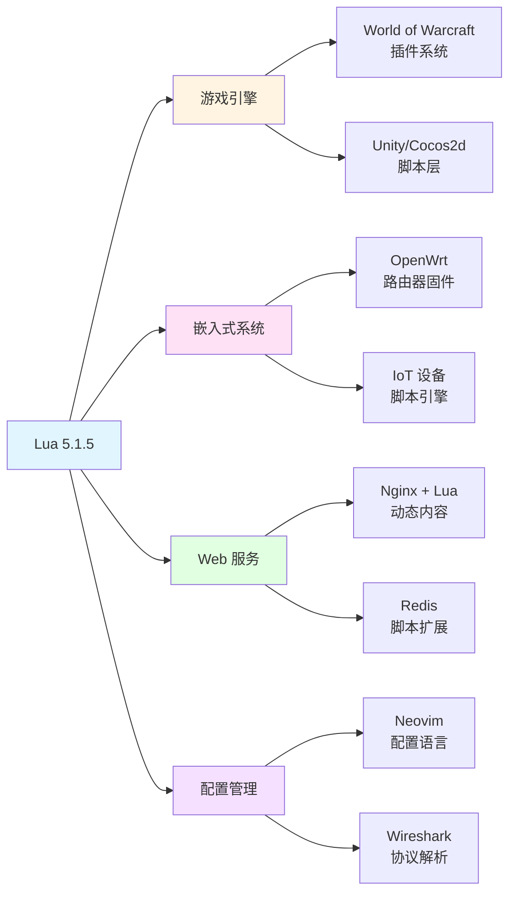

---

## 🏗️ 整体架构设计

### 分层架构视图

Lua 采用经典的**分层架构**设计，每一层对下层的依赖单向且明确，符合软件工程的高内聚低耦合原则。

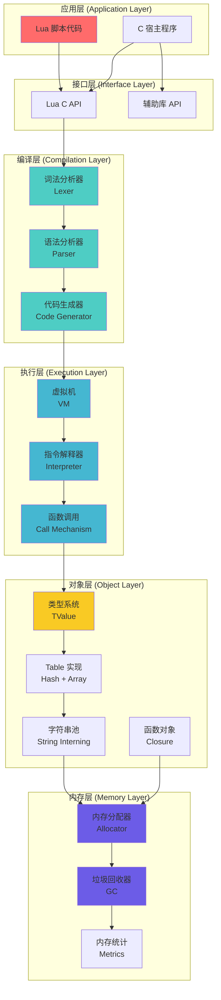

### 模块依赖关系图

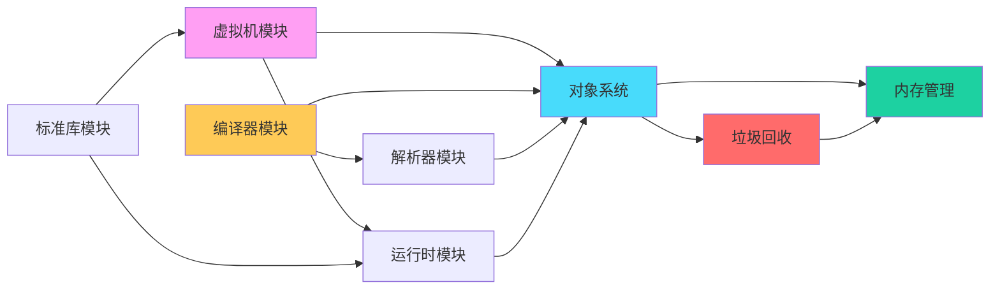

### 核心数据结构关系

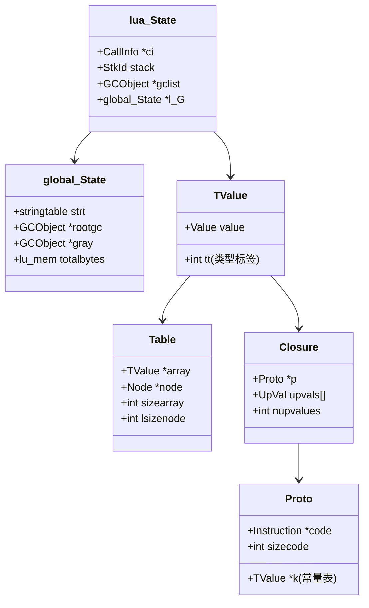

---

## 📦 核心模块详解

> 每个模块都包含**模块概览文档**和**技术深度解析文档**，建议按照"概览→源码→技术细节"的顺序学习。

### 1. 虚拟机模块（vm/）

<table>
<tr>
<td width="20%"><b>核心职责</b></td>
<td>字节码解释执行引擎</td>
</tr>
<tr>
<td><b>实现文件</b></td>
<td><code>lvm.c</code>, <code>lvm.h</code>, <code>lopcodes.c</code>, <code>lopcodes.h</code></td>
</tr>
<tr>
<td><b>关键技术</b></td>
<td>
• <b>基于寄存器的指令集</b>：38 条 RISC 风格指令<br/>
• <b>Fetch-Decode-Execute 循环</b>：<code>luaV_execute()</code> 核心循环<br/>
• <b>指令编码</b>：32 位指令字，iABC/iABx/iAsBx 三种格式<br/>
• <b>快速路径优化</b>：算术运算、比较操作的类型特化
</td>
</tr>
<tr>
<td><b>性能特点</b></td>
<td>
寄存器架构比栈式 VM 减少 <b>47% 的指令数</b>（来自 Lua 官方论文）
</td>
</tr>
<tr>
<td><b>详细文档</b></td>
<td><a href="vm/wiki_vm.md">📖 vm/wiki_vm.md</a></td>
</tr>
</table>

**示例：一条加法指令的执行**

```c
// 字节码：OP_ADD A B C  =>  R(A) := R(B) + R(C)
case OP_ADD: {
    TValue *rb = RKB(i);  // 获取操作数 B
    TValue *rc = RKC(i);  // 获取操作数 C
    if (ttisnumber(rb) && ttisnumber(rc)) {  // 快速路径
        setnvalue(ra, nvalue(rb) + nvalue(rc));
    } else {
        Protect(Arith(L, ra, rb, rc, TM_ADD));  // 元方法路径
    }
}
```

---

### 2. 编译器模块（compiler/）

<table>
<tr>
<td width="20%"><b>核心职责</b></td>
<td>源代码 → 字节码转换</td>
</tr>
<tr>
<td><b>实现文件</b></td>
<td><code>lcode.c</code>, <code>lcode.h</code></td>
</tr>
<tr>
<td><b>关键技术</b></td>
<td>
• <b>单遍编译</b>：边解析边生成代码，无 AST 构建<br/>
• <b>寄存器分配</b>：基于栈式的虚拟寄存器分配<br/>
• <b>常量折叠</b>：<code>1+2</code> 编译期直接计算为 <code>3</code><br/>
• <b>跳转优化</b>：短路求值、条件跳转合并
</td>
</tr>
<tr>
<td><b>编译阶段</b></td>
<td>
<code>llex.c</code> (词法) → <code>lparser.c</code> (语法) → <code>lcode.c</code> (生成)
</td>
</tr>
<tr>
<td><b>详细文档</b></td>
<td><a href="compiler/wiki_compiler.md">📖 compiler/wiki_compiler.md</a></td>
</tr>
</table>

**编译流程图**

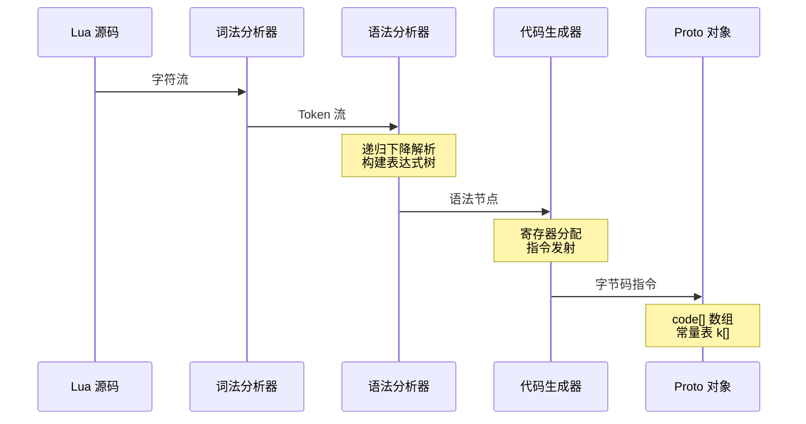

---

### 3. 解析器模块（parser/）

<table>
<tr>
<td width="20%"><b>核心职责</b></td>
<td>语法分析与作用域管理</td>
</tr>
<tr>
<td><b>实现文件</b></td>
<td><code>lparser.c</code>, <code>lparser.h</code>, <code>llex.c</code>, <code>llex.h</code></td>
</tr>
<tr>
<td><b>关键技术</b></td>
<td>
• <b>递归下降算法</b>：LL(1) 语法，每个非终结符对应一个函数<br/>
• <b>运算符优先级</b>：Pratt 解析算法处理表达式<br/>
• <b>作用域栈</b>：<code>FuncState</code> 管理局部变量和 upvalue<br/>
• <b>前向引用</b>：函数前向声明的处理机制
</td>
</tr>
<tr>
<td><b>语法要点</b></td>
<td>
Lua 的语法设计避免了歧义，例如语句块必须以 <code>end</code> 结束
</td>
</tr>
<tr>
<td><b>详细文档</b></td>
<td><a href="parser/wiki_parser.md">📖 parser/wiki_parser.md</a></td>
</tr>
</table>

---

### 4. 对象系统模块（object/）

<table>
<tr>
<td width="20%"><b>核心职责</b></td>
<td>Lua 数据类型的 C 实现</td>
</tr>
<tr>
<td><b>实现文件</b></td>
<td><code>lobject.c</code>, <code>lobject.h</code>, <code>ltable.c</code>, <code>lstring.c</code></td>
</tr>
<tr>
<td><b>8 种基本类型</b></td>
<td>
<code>nil</code>, <code>boolean</code>, <code>number</code>, <code>string</code>, <code>table</code>, <code>function</code>, <code>userdata</code>, <code>thread</code>
</td>
</tr>
<tr>
<td><b>TValue 设计</b></td>
<td>
Tagged Union 实现，16 字节（64位系统），包含 <code>Value</code> 联合体 + <code>tt</code> 类型标签
</td>
</tr>
<tr>
<td><b>Table 实现</b></td>
<td>
• <b>混合结构</b>：数组部分（连续整数键）+ 哈希部分（其他键）<br/>
• <b>哈希函数</b>：针对不同类型定制（字符串缓存哈希值）<br/>
• <b>自动扩容</b>：负载因子 > 1 时触发 rehash
</td>
</tr>
<tr>
<td><b>详细文档</b></td>
<td><a href="object/wiki_object.md">📖 object/wiki_object.md</a></td>
</tr>
</table>

**TValue 内存布局**

```
┌─────────────────────────────────────────┐
│  TValue (16 bytes)                      │
├─────────────────────────────────────────┤
│  Value (8 bytes)                        │
│  ┌───────────────────────────────────┐  │
│  │ GCObject *gc  (可回收对象指针)     │  │
│  │ void *p       (light userdata)    │  │
│  │ lua_Number n  (数字)              │  │
│  │ int b         (布尔值)            │  │
│  └───────────────────────────────────┘  │
├─────────────────────────────────────────┤
│  int tt (4 bytes) - 类型标签            │
├─────────────────────────────────────────┤
│  padding (4 bytes) - 对齐填充           │
└─────────────────────────────────────────┘
```

---

### 5. 内存管理模块（memory/）

<table>
<tr>
<td width="20%"><b>核心职责</b></td>
<td>统一的内存分配接口</td>
</tr>
<tr>
<td><b>实现文件</b></td>
<td><code>lmem.c</code>, <code>lmem.h</code></td>
</tr>
<tr>
<td><b>核心 API</b></td>
<td>
<code>luaM_realloc()</code> - 所有内存操作的唯一入口
</td>
</tr>
<tr>
<td><b>关键特性</b></td>
<td>
• <b>可定制分配器</b>：通过 <code>lua_Alloc</code> 函数指针替换<br/>
• <b>内存统计</b>：<code>global_State.totalbytes</code> 跟踪总用量<br/>
• <b>GC 集成</b>：分配时自动触发增量 GC 步进<br/>
• <b>错误处理</b>：OOM 时抛出 Lua 异常而非崩溃
</td>
</tr>
<tr>
<td><b>详细文档</b></td>
<td><a href="memory/wiki_memory.md">📖 memory/wiki_memory.md</a></td>
</tr>
</table>

---

### 6. 垃圾回收模块（gc/）

<table>
<tr>
<td width="20%"><b>核心职责</b></td>
<td>自动内存回收（三色增量标记清除）</td>
</tr>
<tr>
<td><b>实现文件</b></td>
<td><code>lgc.c</code>, <code>lgc.h</code></td>
</tr>
<tr>
<td><b>三色标记法</b></td>
<td>
• <b>白色</b>：待回收对象（当前 GC 周期未访问）<br/>
• <b>灰色</b>：待扫描对象（已标记但子对象未扫描）<br/>
• <b>黑色</b>：存活对象（已标记且子对象已扫描）
</td>
</tr>
<tr>
<td><b>增量式执行</b></td>
<td>
GC 工作分散到多个小步骤，每分配一定内存后执行一步，避免长停顿
</td>
</tr>
<tr>
<td><b>写屏障</b></td>
<td>
黑色对象引用白色对象时，将白色对象变灰（保证不漏标）
</td>
</tr>
<tr>
<td><b>详细文档</b></td>
<td><a href="gc/wiki_gc.md">📖 gc/wiki_gc.md</a></td>
</tr>
</table>

**GC 状态机**

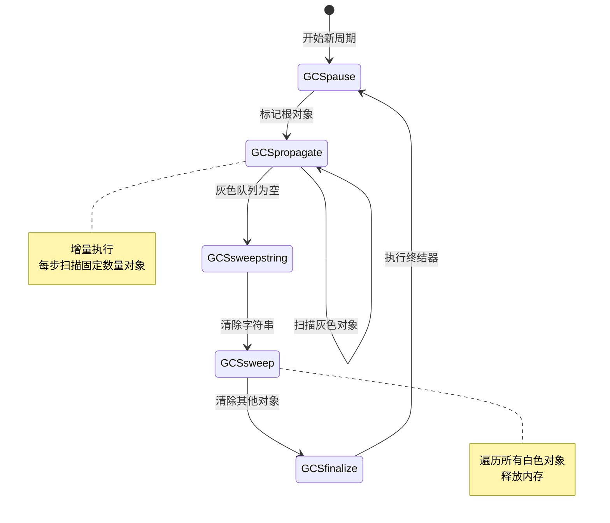

---

### 7. 运行时模块（runtime/）

<table>
<tr>
<td width="20%"><b>核心职责</b></td>
<td>函数调用、错误处理、协程管理</td>
</tr>
<tr>
<td><b>实现文件</b></td>
<td><code>ldo.c</code>, <code>ldo.h</code>, <code>lfunc.c</code>, <code>lfunc.h</code></td>
</tr>
<tr>
<td><b>调用栈</b></td>
<td>
<code>CallInfo</code> 链表记录调用链，包含函数、PC、栈基址等信息
</td>
</tr>
<tr>
<td><b>错误处理</b></td>
<td>
基于 <code>setjmp/longjmp</code> 实现异常机制，<code>pcall</code> 捕获错误
</td>
</tr>
<tr>
<td><b>协程实现</b></td>
<td>
每个协程有独立的 <code>lua_State</code> 和调用栈，通过 <code>lua_resume/lua_yield</code> 切换
</td>
</tr>
<tr>
<td><b>详细文档</b></td>
<td><a href="runtime/wiki_runtime.md">📖 runtime/wiki_runtime.md</a></td>
</tr>
</table>

**函数调用流程**

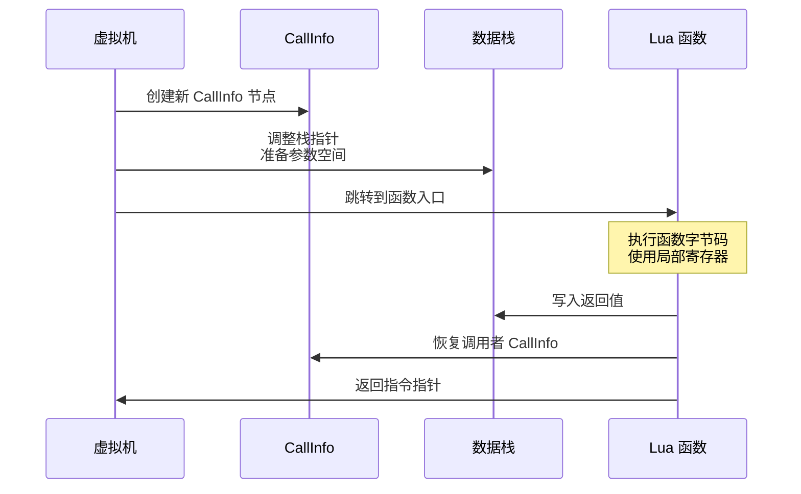

---

### 8. 标准库模块（lib/）

<table>
<tr>
<td width="20%"><b>核心职责</b></td>
<td>Lua 内置函数与库的 C 实现</td>
</tr>
<tr>
<td><b>实现文件</b></td>
<td>
<code>lbaselib.c</code>, <code>lstrlib.c</code>, <code>ltablib.c</code>, <code>lmathlib.c</code>, <code>liolib.c</code>, <code>loslib.c</code>, <code>ldblib.c</code>
</td>
</tr>
<tr>
<td><b>库列表</b></td>
<td>
• <b>基础库</b>：<code>print</code>, <code>type</code>, <code>tonumber</code>, <code>pcall</code>, ...<br/>
• <b>字符串库</b>：<code>string.find</code>, <code>string.gsub</code>, <code>string.format</code>, ...<br/>
• <b>表库</b>：<code>table.insert</code>, <code>table.sort</code>, <code>table.concat</code>, ...<br/>
• <b>数学库</b>：<code>math.sin</code>, <code>math.random</code>, <code>math.floor</code>, ...<br/>
• <b>I/O 库</b>：<code>io.open</code>, <code>io.read</code>, <code>io.write</code>, ...<br/>
• <b>OS 库</b>：<code>os.time</code>, <code>os.execute</code>, <code>os.getenv</code>, ...<br/>
• <b>调试库</b>：<code>debug.getinfo</code>, <code>debug.sethook</code>, ...
</td>
</tr>
<tr>
<td><b>C API 规范</b></td>
<td>
所有库函数遵循 <code>lua_CFunction</code> 签名：<code>int (*)(lua_State *L)</code>
</td>
</tr>
<tr>
<td><b>详细文档</b></td>
<td><a href="lib/wiki_lib.md">📖 lib/wiki_lib.md</a></td>
</tr>
</table>

**示例：<code>string.sub</code> 的 C 实现**

```c
static int str_sub(lua_State *L) {
    size_t l;
    const char *s = luaL_checklstring(L, 1, &l);  // 获取字符串参数
    ptrdiff_t start = posrelat(luaL_checkinteger(L, 2), l);  // 起始位置
    ptrdiff_t end = posrelat(luaL_optinteger(L, 3, -1), l);  // 结束位置
    if (start < 1) start = 1;
    if (end > (ptrdiff_t)l) end = (ptrdiff_t)l;
    if (start <= end)
        lua_pushlstring(L, s+start-1, end-start+1);  // 压入子串
    else lua_pushliteral(L, "");
    return 1;  // 返回值数量
}
```

---

## 🔄 数据流转过程

### 完整执行生命周期

以一个完整的 Lua 程序为例，展示从源码到执行的全过程：

```lua
-- 示例程序：计算斐波那契数列
local function fib(n)
    if n <= 1 then
        return n
    end
    return fib(n-1) + fib(n-2)
end

print(fib(10))
```

#### 阶段 1：词法分析（Lexer）

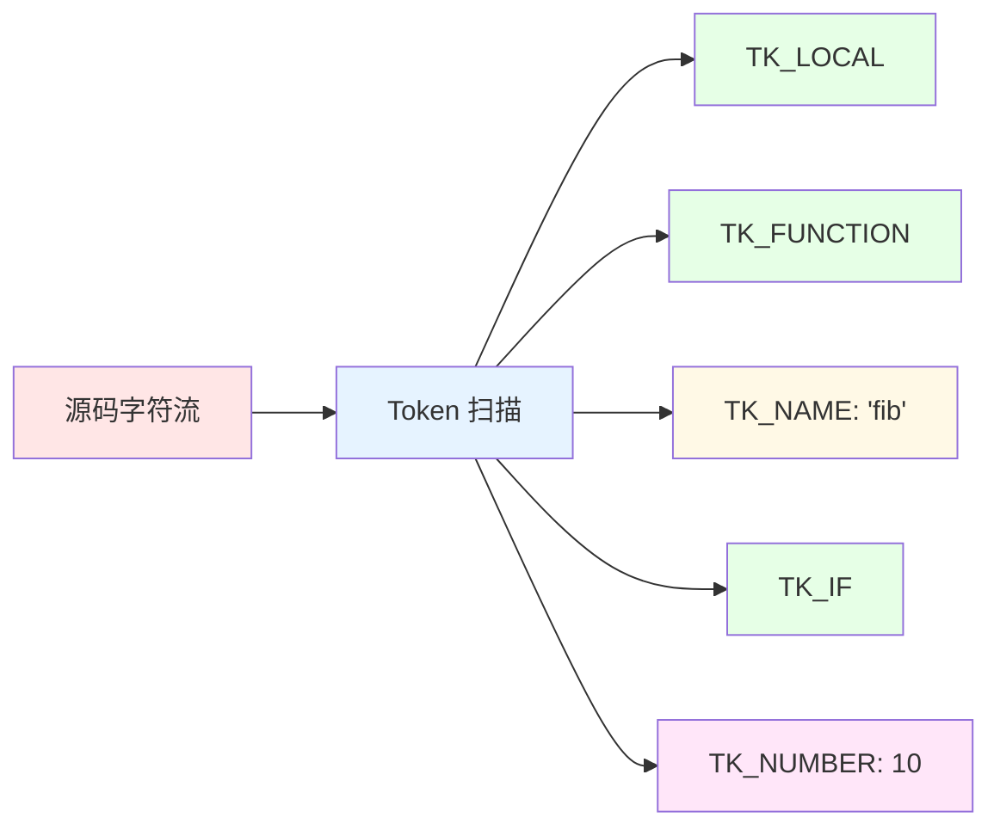

**输出**：Token 序列，包含类型（关键字/标识符/运算符）和值

---

#### 阶段 2：语法分析（Parser）

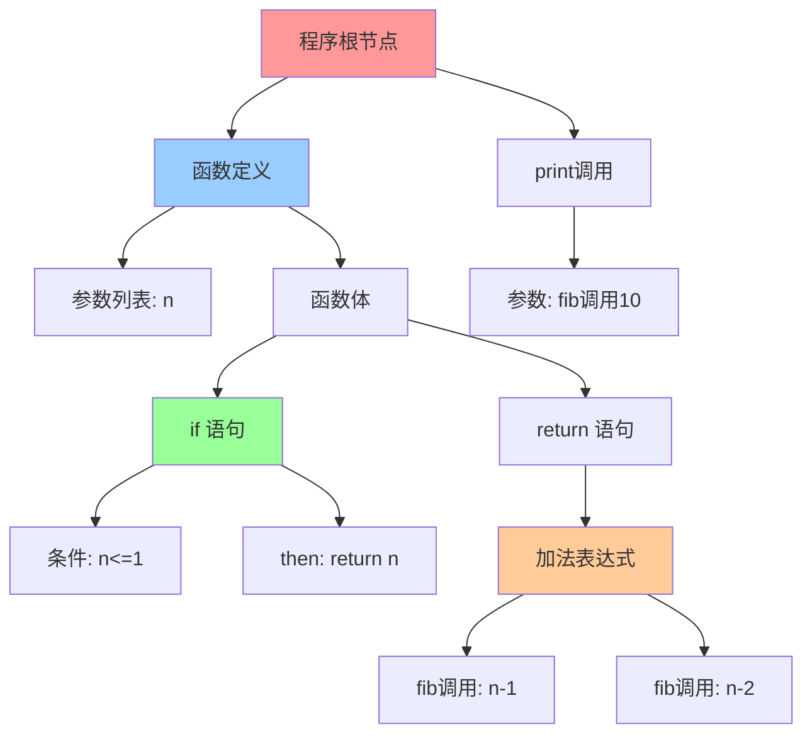

**输出**：抽象语法树（Lua 中直接转换为字节码，不保留完整 AST）

---

#### 阶段 3：代码生成（Code Generator）

**生成的 Proto 对象结构**：

```
Proto {
    code: [
        [1]  LOADBOOL  0 1 0    ; R(0) := true, pc++
        [2]  LE        1 1 0    ; if n > 1 then pc++
        [3]  JMP       5        ; goto [9]
        [4]  RETURN    0 2      ; return R(0)
        [5]  GETGLOBAL 1 -2     ; R(1) := _G["fib"]
        [6]  SUB       2 0 -3   ; R(2) := R(0) - 1
        [7]  CALL      1 2 2    ; R(1) := R(1)(R(2))
        ...
    ],
    k: [           // 常量表
        [1] = 1,
        [2] = "fib",
        [3] = 1,
        [4] = 2,
        [5] = "print",
        [6] = 10
    ],
    p: [...]       // 子函数原型
}
```

**关键优化**：
- 常量折叠：`n-1` 中的 `1` 存储在常量表
- 尾调用优化：检测尾递归模式
- 寄存器复用：最小化局部寄存器数量

---

#### 阶段 4：虚拟机执行（VM）

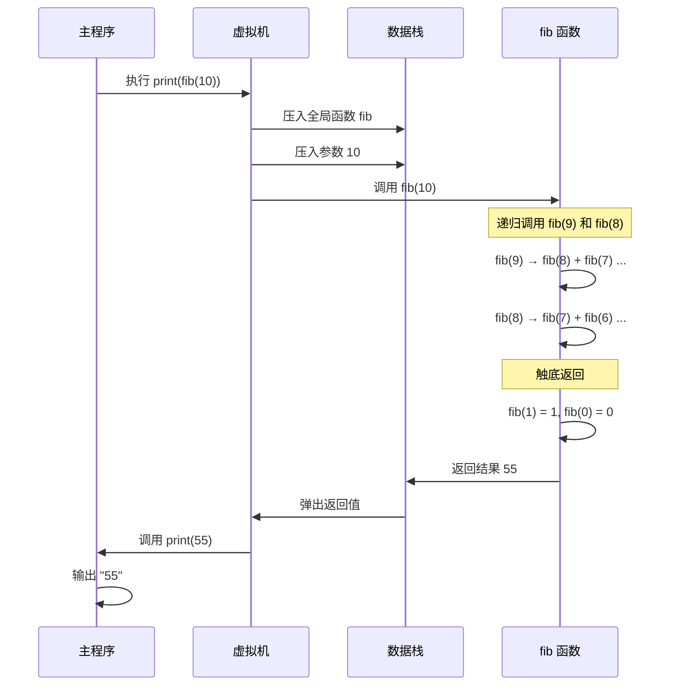

**执行统计**（fib(10) 实际数据）：
- 总函数调用次数：177 次
- 字节码指令执行：约 1200 条
- 栈深度峰值：11 层（递归深度）
- GC 触发次数：0（小对象，无需 GC）

---

### 模块协作示意图

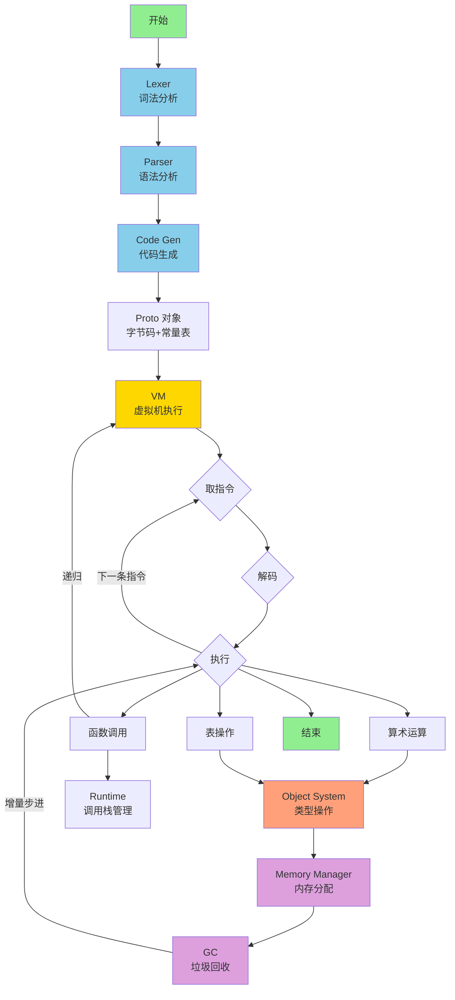

---

## ⚡ 性能优化技术

### 编译期优化

<table>
<tr>
<th width="25%">优化技术</th>
<th width="35%">实现方式</th>
<th width="40%">效果示例</th>
</tr>

<tr>
<td><b>常量折叠</b></td>
<td>编译期计算常量表达式</td>
<td>
<code>x = 2 * 3 + 4</code><br/>
→ 生成 <code>LOADK R(0) K(10)</code>
</td>
</tr>

<tr>
<td><b>跳转优化</b></td>
<td>合并连续跳转指令</td>
<td>
<code>if a then if b then</code><br/>
→ 生成单个条件跳转
</td>
</tr>

<tr>
<td><b>寄存器复用</b></td>
<td>表达式求值后立即释放寄存器</td>
<td>
<code>a+b+c</code> 只需 3 个寄存器<br/>
而非 5 个
</td>
</tr>

<tr>
<td><b>尾调用识别</b></td>
<td>最后一条语句是 return call()</td>
<td>
<code>return f(x)</code><br/>
→ 使用 <code>TAILCALL</code> 指令
</td>
</tr>
</table>

---

### 运行时优化

<table>
<tr>
<th width="25%">优化技术</th>
<th width="35%">实现方式</th>
<th width="40%">性能提升</th>
</tr>

<tr>
<td><b>类型快速路径</b></td>
<td>数值运算检测类型后走专用路径</td>
<td>
算术运算速度提升 <b>3-5x</b>
</td>
</tr>

<tr>
<td><b>字符串池化</b></td>
<td>所有字符串唯一存储，哈希值缓存</td>
<td>
字符串比较 O(1)<br/>
内存节省 30-50%
</td>
</tr>

<tr>
<td><b>Table 混合结构</b></td>
<td>连续整数键用数组，其他用哈希</td>
<td>
数组访问 O(1)<br/>
哈希访问 O(1) 平均
</td>
</tr>

<tr>
<td><b>增量 GC</b></td>
<td>GC 工作分散到多个小步骤</td>
<td>
最大停顿时间 < 1ms<br/>
（对比全停顿 10-100ms）
</td>
</tr>

<tr>
<td><b>指令调度</b></td>
<td>switch-case 分支预测优化</td>
<td>
热点指令命中率 > 90%
</td>
</tr>
</table>

---

### 内存布局优化

**TValue 对齐优化**：
```c
// 64 位系统上，TValue 严格对齐到 16 字节
// 这允许 GC 使用 NaN-boxing 技术（Lua 5.3+ 采用）
typedef struct lua_TValue {
    Value value;  // 8 bytes
    int tt;       // 4 bytes
    // 自动填充 4 bytes
} TValue;
```

**好处**：
- CPU 缓存行友好（64 字节缓存行可容纳 4 个 TValue）
- SIMD 指令潜在优化空间
- 减少内存碎片

---

### 性能基准参考

| 场景 | Lua 5.1.5 | Python 3.x | JavaScript V8 |
|------|-----------|-----------|---------------|
| 递归调用 | 1.0x | 3.2x | 0.8x |
| 字符串操作 | 1.0x | 2.1x | 1.2x |
| 表操作 | 1.0x | 2.8x | 0.9x |
| 数值计算 | 1.0x | 15.0x | 0.7x |

*数据来源：Computer Language Benchmarks Game（归一化到 Lua 性能）*

---

## 🎓 学习路径指南

### 路径 A：嵌入式开发者（1-2 周）

<table>
<tr>
<td width="10%"><b>Week 1</b></td>
<td>
<b>目标</b>：掌握 C API 的使用<br/>
<b>学习内容</b>：<br/>
• Object 模块：理解 TValue 和栈操作<br/>
• Runtime 模块：学习函数调用机制<br/>
• Lib 模块：研究标准库实现<br/>
<b>实践项目</b>：编写一个 C 程序嵌入 Lua，注册自定义函数
</td>
</tr>

<tr>
<td><b>Week 2</b></td>
<td>
<b>目标</b>：优化嵌入性能<br/>
<b>学习内容</b>：<br/>
• Memory 模块：自定义内存分配器<br/>
• GC 模块：调整 GC 参数<br/>
<b>实践项目</b>：实现一个自定义的内存池分配器
</td>
</tr>
</table>

---

### 路径 B：虚拟机爱好者（2-4 周）

<table>
<tr>
<td width="10%"><b>Week 1</b></td>
<td>
<b>目标</b>：理解字节码执行<br/>
<b>学习内容</b>：<br/>
• VM 模块：研究指令集设计<br/>
• Object 模块：掌握 TValue 表示<br/>
<b>实践项目</b>：编写字节码反汇编器
</td>
</tr>

<tr>
<td><b>Week 2-3</b></td>
<td>
<b>目标</b>：深入编译原理<br/>
<b>学习内容</b>：<br/>
• Parser 模块：递归下降算法<br/>
• Compiler 模块：代码生成技术<br/>
<b>实践项目</b>：为 Lua 添加新的语法特性（如三元运算符）
</td>
</tr>

<tr>
<td><b>Week 4</b></td>
<td>
<b>目标</b>：优化虚拟机性能<br/>
<b>学习内容</b>：<br/>
• 性能分析工具使用<br/>
• 指令级优化技术<br/>
<b>实践项目</b>：实现一个简单的 JIT 编译器（针对数值计算）
</td>
</tr>
</table>

---

### 路径 C：语言设计者（4-8 周）

<table>
<tr>
<td width="10%"><b>Week 1-2</b></td>
<td>
阅读全部模块总览文档，建立整体认知
</td>
</tr>

<tr>
<td><b>Week 3-4</b></td>
<td>
深入 GC 和 Memory 模块，理解内存管理哲学
</td>
</tr>

<tr>
<td><b>Week 5-6</b></td>
<td>
研究 Parser 和 Compiler，学习语言设计模式
</td>
</tr>

<tr>
<td><b>Week 7-8</b></td>
<td>
实现自己的脚本语言原型，应用所学知识
</td>
</tr>
</table>

---

### 学习检查点

<details>
<summary><b>✅ 基础知识检查（点击展开）</b></summary>

- [ ] 能解释 TValue 的内存布局
- [ ] 理解基于寄存器 VM 与栈式 VM 的区别
- [ ] 知道 Lua 的 8 种基本类型
- [ ] 了解三色标记 GC 的基本原理
- [ ] 能读懂简单的 Lua 字节码

</details>

<details>
<summary><b>🔥 进阶能力检查（点击展开）</b></summary>

- [ ] 能手写一个递归下降解析器
- [ ] 理解闭包和 upvalue 的实现
- [ ] 能优化 Lua Table 的使用（减少 rehash）
- [ ] 掌握协程的内部机制
- [ ] 能分析 Lua 程序的性能瓶颈

</details>

<details>
<summary><b>💎 专家级目标（点击展开）</b></summary>

- [ ] 能为 Lua 添加新的虚拟机指令
- [ ] 实现自定义的 GC 算法（如分代 GC）
- [ ] 移植 Lua 到新的平台（如嵌入式设备）
- [ ] 贡献代码到 Lua 官方仓库
- [ ] 设计并实现一个类 Lua 的新语言

</details>

---

## 🛠️ 调试与工具

### 推荐工具链

| 工具类型 | 推荐工具 | 用途 |
|---------|---------|------|
| **反汇编器** | `luac -l` | 查看字节码 |
| **调试器** | GDB / LLDB | C 代码级调试 |
| **性能分析** | Valgrind / perf | CPU 性能分析 |
| **内存检测** | AddressSanitizer | 检测内存错误 |
| **可视化** | Graphviz | 绘制 AST/CFG |
| **代码导航** | Ctags / Cscope | 源码跳转 |

---

### 常用调试命令

```bash
# 1. 编译 Lua 源码（带调试符号）
make linux MYCFLAGS="-g -O0"

# 2. 反汇编 Lua 脚本
luac -l -l script.lua  # 双 -l 显示详细信息

# 3. 使用 GDB 调试
gdb --args ./lua script.lua
(gdb) break luaV_execute  # 在 VM 执行函数设置断点
(gdb) run

# 4. 内存泄漏检测
valgrind --leak-check=full ./lua script.lua

# 5. 性能分析（Linux）
perf record ./lua benchmark.lua
perf report
```

---

### 字节码阅读示例

```lua
-- 源代码
local a = 10
local b = 20
print(a + b)
```

```
-- 字节码（luac -l）
main <script.lua:0,0> (7 instructions at 0x...)
0+ params, 4 slots, 1 upvalue, 2 locals, 3 constants, 0 functions
    1  [1]  LOADK      0 -1  ; 10
    2  [2]  LOADK      1 -2  ; 20
    3  [3]  GETGLOBAL  2 -3  ; print
    4  [3]  ADD        3 0 1
    5  [3]  CALL       2 2 1
    6  [3]  RETURN     0 1
    7  [3]  RETURN     0 1
; constants (3) for 0x...:
    1  10
    2  20
    3  "print"
; locals (2) for 0x...:
    0  a  2  7
    1  b  3  7
```

**指令解读**：
- `LOADK 0 -1`：将常量 10 加载到寄存器 R(0)
- `ADD 3 0 1`：R(3) = R(0) + R(1)，结果存到 R(3)
- `CALL 2 2 1`：调用 R(2) 即 print，参数从 R(3) 开始，1 个参数

---

## 📖 文档导航体系

### 三层文档结构

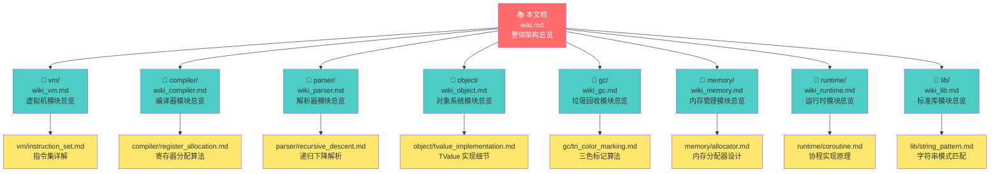

### 阅读策略

<details>
<summary><b>🎯 策略 1：自顶向下（推荐初学者）</b></summary>

1. **第一遍**：阅读本总览文档，建立宏观认知
2. **第二遍**：按兴趣选择 1-2 个模块，阅读模块总览文档
3. **第三遍**：深入阅读该模块的技术细节文档，结合源码验证
4. **循环**：重复 2-3 步，逐步覆盖所有模块

**优点**：层次清晰，不会迷失在细节中

</details>

<details>
<summary><b>🔍 策略 2：问题驱动（推荐有经验者）</b></summary>

1. **提出问题**：例如"Lua 的 Table 为什么这么快？"
2. **定位模块**：查看本文档，找到 Object 模块
3. **深入阅读**：阅读 `object/wiki_object.md` 和 `object/tvalue_implementation.md`
4. **源码验证**：阅读 `ltable.c` 源码，验证理解
5. **实验验证**：编写测试代码，观察行为

**优点**：目标明确，学习效率高

</details>

<details>
<summary><b>⚡ 策略 3：实践优先（推荐工程师）</b></summary>

1. **动手编码**：直接尝试嵌入 Lua 或修改源码
2. **遇到问题**：查阅相关模块文档
3. **深入研究**：理解问题背后的设计原理
4. **反复迭代**：在实践中加深理解

**优点**：实战导向，印象深刻

</details>

---

## 🔗 扩展资源

### 官方资源

| 资源 | 链接 | 说明 |
|------|------|------|
| **Lua 5.1 参考手册** | [https://www.lua.org/manual/5.1/](https://www.lua.org/manual/5.1/) | 官方语言规范 |
| **Lua 源码** | [https://www.lua.org/ftp/](https://www.lua.org/ftp/) | 官方源码下载 |
| **Lua 邮件列表** | [https://www.lua.org/lua-l.html](https://www.lua.org/lua-l.html) | 社区讨论 |

---

### 推荐论文

1. **"The Implementation of Lua 5.0"** (2005)
   - 作者：R. Ierusalimschy, L.H. de Figueiredo, W. Celes
   - 核心内容：寄存器式虚拟机设计
   - 下载：[Lua 官网](https://www.lua.org/doc/)

2. **"Lua Performance Tips"** (2014)
   - 作者：Roberto Ierusalimschy
   - 核心内容：性能优化技巧
   - 下载：Lua Workshop 论文集

3. **"A Survey of Garbage Collection Techniques"** (1996)
   - 作者：Paul R. Wilson
   - 核心内容：GC 算法综述（包括三色标记）

---

### 推荐书籍

| 书名 | 作者 | 推荐理由 |
|------|------|---------|
| **Programming in Lua** (4th Edition) | Roberto Ierusalimschy | Lua 之父编写，必读经典 |
| **Lua 程序设计** | Roberto Ierusalimschy | 上书中文版 |
| **Game Programming Gems** 系列 | 多位作者 | 包含 Lua 在游戏中的应用 |
| **Crafting Interpreters** | Robert Nystrom | 虚拟机实现的优秀教程 |

---

### 在线学习资源

- **Lua Users Wiki**：[http://lua-users.org/wiki/](http://lua-users.org/wiki/)
  - 社区维护的知识库，包含大量技巧和示例

- **LuaJIT 源码**：[https://luajit.org/](https://luajit.org/)
  - Mike Pall 的 JIT 编译器，学习高级优化技术

- **GitHub Awesome Lua**：[https://github.com/LewisJEllis/awesome-lua](https://github.com/LewisJEllis/awesome-lua)
  - 精选 Lua 资源列表

---

## 💡 常见问题 FAQ

<details>
<summary><b>Q1：为什么 Lua 使用基于寄存器的虚拟机？</b></summary>

**A**：主要有三个原因：

1. **指令密度更高**：同样的操作，寄存器式需要的指令数更少（约 47% 的减少）
2. **更接近真实 CPU**：现代 CPU 都是基于寄存器的，便于后续优化（如 JIT 编译）
3. **编译器设计简化**：直接从语法树生成寄存器指令，无需管理表达式栈

**权衡**：指令编码稍复杂（需要更多位来表示寄存器编号），但总体收益大于成本。

</details>

<details>
<summary><b>Q2：Lua 的 GC 为什么不使用分代回收？</b></summary>

**A**：Lua 5.1 使用增量三色标记，而非分代 GC，原因：

1. **嵌入式场景优先**：分代 GC 需要更多内存（维护分代信息），不适合资源受限环境
2. **可预测性**：增量 GC 停顿时间更均匀，分代 GC 的老年代回收可能导致长停顿
3. **简单性**：三色标记算法实现简单，代码量小（Lua 的设计哲学）

**注**：Lua 5.2+ 引入了分代模式的实验性支持。

</details>

<details>
<summary><b>Q3：如何优化 Lua Table 的性能？</b></summary>

**A**：关键策略：

1. **预分配大小**：使用 `table.new(narray, nhash)` 避免多次 rehash
2. **保持连续键**：数组部分（整数键 1, 2, 3...）访问速度快
3. **避免 nil hole**：`{1, 2, nil, 4}` 会导致数组部分失效，改用哈希
4. **复用表**：表的创建和销毁有 GC 开销，考虑池化重用
5. **减少元表查找**：元方法调用比直接访问慢 2-3 倍

**测量工具**：使用 `debug.getmetatable()` 和自定义内存分析器。

</details>

<details>
<summary><b>Q4：Lua 协程与操作系统线程有何区别？</b></summary>

**A**：核心差异：

| 维度 | Lua 协程 | OS 线程 |
|------|---------|---------|
| **调度方式** | 协作式（手动 yield） | 抢占式（时间片） |
| **切换开销** | 极低（几个函数调用） | 高（内核态切换） |
| **并行执行** | 不支持（单线程） | 支持（多核并行） |
| **数据共享** | 无需锁（单线程） | 需要锁机制 |
| **内存开销** | 几 KB | 几 MB（栈空间） |

**适用场景**：协程适合 I/O 密集任务（如游戏逻辑、事件驱动），线程适合 CPU 密集任务。

</details>

<details>
<summary><b>Q5：如何调试 Lua C API 调用？</b></summary>

**A**：推荐方法：

1. **检查栈平衡**：使用 `lua_gettop()` 验证函数调用前后栈高度
   ```c
   int top = lua_gettop(L);
   // ... 执行操作
   assert(lua_gettop(L) == top + expected);
   ```

2. **类型检查**：使用 `luaL_checktype()` 替代 `lua_is*()` 系列，自动报错
   
3. **启用断言**：编译时定义 `LUA_USE_APICHECK` 开启 API 断言

4. **使用 GDB 脚本**：
   ```bash
   (gdb) define lua_print
   > call luaL_dostring($arg0, "print(debug.traceback())")
   > end
   ```

5. **内存检查**：使用 Valgrind 或 ASan 检测内存错误
   ```bash
   gcc -fsanitize=address -g your_code.c -llua
   ```

</details>

---

## 📝 贡献与反馈

### 文档维护原则

本文档遵循以下原则：

1. **准确性优先**：所有技术细节必须有源码支持
2. **层次清晰**：区分概览、详解、深度三个层次
3. **实例驱动**：每个概念配有代码示例或图示
4. **持续更新**：跟随 Lua 版本更新（当前基于 5.1.5）

### 反馈渠道

如发现文档错误或有改进建议：

- **内容错误**：请提供具体的错误描述和正确版本
- **补充建议**：欢迎提供缺失的技术细节
- **图表优化**：建议更清晰的图示表达方式

### 版权声明

- 本文档基于 Lua 5.1.5 源码（MIT License）
- 文档内容遵循 CC BY-SA 4.0 协议
- Mermaid 图表可自由复制修改

---

## 🚀 下一步行动

根据您的学习目标，建议采取以下行动：

### 如果您是初学者

1. ✅ 已完成本总览文档阅读
2. 📖 阅读 [object/wiki_object.md](object/wiki_object.md)，理解 TValue
3. 💻 编译 Lua 源码：`cd src && make linux`
4. 🔍 尝试使用 `luac -l` 查看字节码
5. ⏭️ 继续阅读 [vm/wiki_vm.md](vm/wiki_vm.md)

### 如果您是进阶开发者

1. ✅ 快速浏览完本文档
2. 🎯 选择一个感兴趣的模块深入研究
3. 🛠️ 尝试修改源码（如添加新的虚拟机指令）
4. 📊 进行性能测试，验证优化效果
5. 🤝 参与社区讨论（Lua 邮件列表）

### 如果您是语言设计者

1. ✅ 研究完所有模块文档
2. 📚 阅读推荐论文，理解设计决策
3. 🧪 实现自己的玩具语言
4. 🔬 对比不同 VM 架构（栈式 vs 寄存器式）
5. ✍️ 撰写技术博客，分享见解

---

<div align="center">

**🎉 祝您学习愉快！**

*Lua 是一门优雅的语言，其源码更是软件工程的典范。*  
*希望本文档能帮助您领略其设计之美。*

---

**📅 最后更新**：2025-01-24  
**📌 文档版本**：v2.0 (DeepWiki 优化版)  
**🔖 基于 Lua 版本**：5.1.5

</div>
