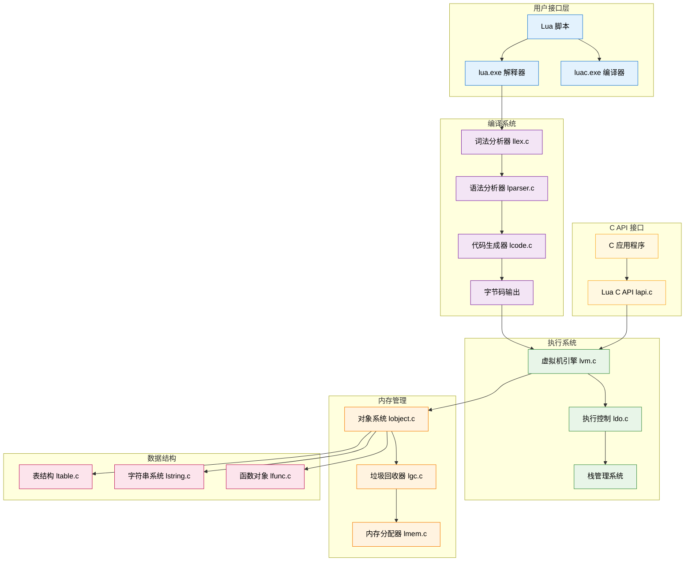
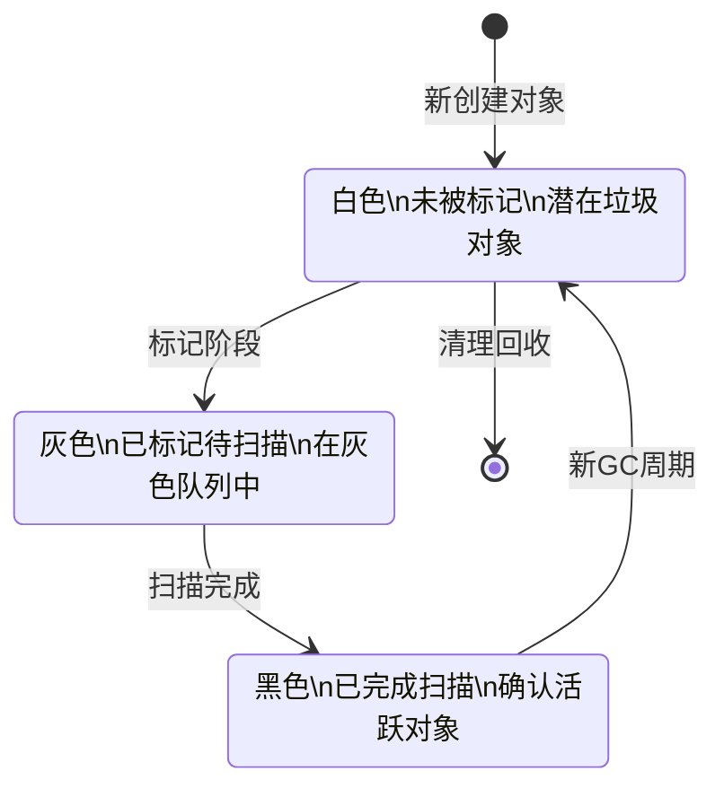
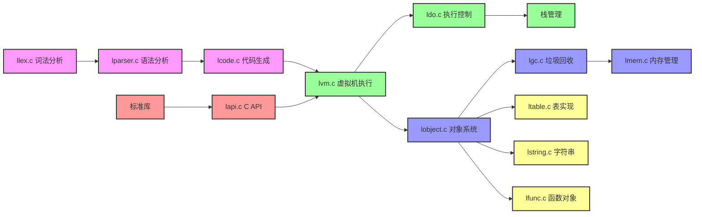

# 📚 Lua 5.1.5 源代码架构深度解析

> **学习目标**：深入理解 Lua 5.1.5 虚拟机的整体设计思路，掌握各个核心模块的功能和相互关系，为系统性学习 Lua 源码奠定坚实基础。

## 🎯 架构概述

Lua 5.1.5 是一个精心设计的嵌入式脚本语言实现，它采用了多项先进的计算机科学技术，将复杂的编程语言理论转化为简洁高效的 C 代码。整个系统的设计体现了**简洁性**、**高效性**和**可嵌入性**的核心理念。

### 🏗️ 总体架构图



## 🔧 核心设计理念

Lua 5.1.5 的设计遵循以下核心理念，这些理念贯穿于整个实现过程：

### 1. 🎯 基于寄存器的虚拟机设计

与传统的栈式虚拟机不同，Lua 采用**基于寄存器的虚拟机架构**：

```c
// 寄存器式指令示例
ADD R(0) R(1) R(2)    // R(0) = R(1) + R(2)
MOVE R(3) R(0)        // R(3) = R(0)

// 对比栈式指令
PUSH R(1)             // 栈式需要更多指令
PUSH R(2)
ADD
POP R(0)
```

**优势分析**：
- **指令数量减少**：一条指令完成多个栈操作
- **执行效率提升**：减少内存访问次数
- **代码生成简化**：直接映射到寄存器分配

### 2. 🔄 统一的值表示系统 (TValue)

Lua 使用 `TValue` 结构统一表示所有数据类型：

```c
typedef struct lua_TValue {
    Value value;    // 值的联合体
    int tt;         // 类型标记 (Type Tag)
} TValue;

typedef union Value {
    GCObject *gc;     // 可垃圾回收对象
    void *p;          // 轻量级用户数据  
    lua_Number n;     // 数字类型
    int b;            // 布尔值
} Value;
```

**设计优势**：
- **类型安全**：类型信息与值紧密结合
- **内存效率**：联合体减少内存占用
- **快速类型检查**：通过 tt 字段进行 O(1) 类型判断

### 3. ♻️ 增量垃圾回收机制

采用**三色标记增量垃圾回收算法**：



### 4. 📊 表的混合实现 (数组+哈希)

Lua 的表同时支持数组和哈希表功能：

```c
typedef struct Table {
    CommonHeader;
    lu_byte flags;           // 元方法缓存
    lu_byte lsizenode;       // 哈希部分大小 log2
    struct Table *metatable; // 元表
    TValue *array;           // 数组部分
    Node *node;              // 哈希部分  
    Node *lastfree;          // 空闲节点指针
    GCObject *gclist;        // GC 链表
    int sizearray;           // 数组大小
} Table;
```

**性能特点**：
- **数组访问**：O(1) 直接索引
- **哈希查找**：平均 O(1) 查找时间
- **动态调整**：根据使用模式自动优化

## 🏛️ 核心模块功能详解

### 📝 编译系统模块

#### 词法分析器 (llex.c)
- **功能**：将源代码文本转换为标记流 (Token Stream)
- **核心算法**：有限状态自动机 (FSM) 
- **关键特性**：支持 UTF-8、数字字面量、字符串转义

#### 语法分析器 (lparser.c) 
- **功能**：构建抽象语法树，进行语法检查
- **解析方法**：递归下降分析法
- **输出**：函数原型 (Proto) 和字节码序列

#### 代码生成器 (lcode.c)
- **功能**：将语法树转换为虚拟机字节码
- **优化技术**：常量折叠、跳转优化、寄存器分配
- **指令集**：38 个核心指令，支持完整的 Lua 语义

### ⚙️ 执行系统模块

#### 虚拟机引擎 (lvm.c)
- **核心函数**：`luaV_execute` - 字节码解释执行
- **执行模型**：fetch-decode-execute 循环
- **性能优化**：直接线程化、内联缓存

```c
// 虚拟机主循环简化版本
void luaV_execute(lua_State *L) {
    const Instruction *pc = L->savedpc;
    StkId base = L->base;
    
    for (;;) {
        Instruction i = *pc++;           // 取指
        OpCode op = GET_OPCODE(i);       // 译码
        
        switch (op) {                    // 执行
            case OP_MOVE: /* ... */ break;
            case OP_LOADK: /* ... */ break;  
            case OP_ADD: /* ... */ break;
            // ... 更多指令
        }
    }
}
```

#### 执行控制 (ldo.c)
- **函数调用管理**：调用栈、参数传递、返回值处理
- **错误处理机制**：longjmp 异常处理、错误传播
- **协程支持**：yield/resume 实现、上下文切换

### 💾 内存管理模块

#### 对象系统 (lobject.c/lobject.h)
- **类型系统**：8 种基本数据类型的定义和操作
- **值表示**：TValue 统一值表示，支持类型标记
- **类型转换**：自动类型转换规则和实现

#### 垃圾回收器 (lgc.c)
- **回收算法**：三色标记增量回收
- **回收阶段**：标记、传播、清理、终结化
- **性能调优**：可调节的回收步长和阈值

#### 内存分配器 (lmem.c)
- **分配接口**：统一的内存分配/释放接口
- **错误处理**：内存不足时的优雅降级
- **统计功能**：内存使用量监控和报告

### 📋 数据结构模块

#### 表实现 (ltable.c)
- **混合结构**：数组部分 + 哈希部分
- **动态调整**：根据使用模式自动 resize
- **冲突解决**：开放寻址法处理哈希冲突

#### 字符串系统 (lstring.c)
- **字符串驻留**：相同字符串共享内存
- **哈希算法**：高效的字符串哈希函数
- **内存优化**：短字符串和长字符串分别处理

#### 函数对象 (lfunc.c)
- **闭包实现**：Lua 闭包和 C 闭包
- **Upvalue 管理**：捕获外部变量的机制
- **原型共享**：函数原型的共享和复用

## 🎓 学习路径建议

基于架构理解，推荐以下循序渐进的学习路径：

### 🌱 初级阶段 (1-2 周)
1. **理解整体架构** - 阅读本文档，建立全局认知
2. **熟悉基本数据类型** - 学习 `lobject.h` 中的类型定义  
3. **了解 TValue 系统** - 理解统一值表示的设计理念
4. **简单调试实践** - 编译运行 Lua，观察内存布局

### 🌿 中级阶段 (2-4 周)  
1. **深入虚拟机执行** - 分析 `lvm.c` 中的指令执行过程
2. **理解垃圾回收** - 学习三色标记算法的实现细节
3. **研究表的实现** - 分析混合数据结构的设计巧思
4. **掌握函数调用** - 理解调用栈和参数传递机制

### 🌳 高级阶段 (4-8 周)
1. **编译系统原理** - 深入词法分析、语法分析、代码生成
2. **性能优化技术** - 研究各种性能优化的实现方法
3. **协程和错误处理** - 掌握高级控制流机制
4. **C API 设计** - 理解嵌入式接口的设计原理

## 🔗 模块间关系图



## 💡 核心技术亮点
- **<span style="color: #C73E1D">游戏开发</span>**：作为脚本语言嵌入游戏引擎，提供灵活的游戏逻辑
- **<span style="color: #C73E1D">Web开发</span>**：<span style="color: #F18F01">OpenResty</span>等项目中作为高性能Web服务器的脚本语言
- **<span style="color: #C73E1D">嵌入式系统</span>**：在资源受限的环境中提供脚本化能力
- **<span style="color: #C73E1D">配置管理</span>**：作为配置文件格式，提供动态配置能力
- **<span style="color: #C73E1D">科学计算</span>**：在某些科学计算领域作为胶水语言使用

**<span style="color: #A23B72">学习Lua架构的意义</span>**：
- **<span style="color: #C73E1D">编程语言设计</span>**：理解现代编程语言的设计原则和实现技巧
- **<span style="color: #C73E1D">虚拟机技术</span>**：掌握虚拟机设计和优化的核心概念
- **<span style="color: #C73E1D">系统编程</span>**：学习高效的<span style="color: #F18F01">C语言</span>编程技巧和系统设计方法
- **<span style="color: #C73E1D">性能优化</span>**：理解性能优化的系统性方法和实践技巧
- **<span style="color: #C73E1D">架构设计</span>**：学习如何设计简洁而强大的软件架构

## <span style="color: #A23B72">技术概述</span>

<span style="color: #F18F01">Lua 5.1</span> 是一个轻量级、高性能的脚本语言解释器，其核心设计思想是<span style="color: #C73E1D">简洁性</span>和<span style="color: #C73E1D">高效性</span>。它采用了多项先进的计算机科学技术，包括<span style="color: #F18F01">基于寄存器的虚拟机</span>、<span style="color: #F18F01">增量垃圾回收</span>、<span style="color: #F18F01">协程机制</span>等，创造了一个既强大又优雅的编程语言实现。

## <span style="color: #A23B72">架构概览详解</span>

### <span style="color: #2E86AB">整体架构层次</span>

<span style="color: #F18F01">Lua</span> 的架构采用<span style="color: #C73E1D">分层设计</span>，每一层都有明确的职责和接口，形成了一个清晰的技术栈：

```
┌─────────────────────────────────────────────────────────────┐
│                    应用程序接口层                              │
│                   (lua.h, lauxlib.h)                       │
│  ┌─────────────────┐  ┌─────────────────┐  ┌─────────────────┐ │
│  │   C API接口     │  │   辅助库接口     │  │   标准库接口     │ │
│  │   (lapi.c)     │  │  (lauxlib.c)   │  │  (lbaselib.c)  │ │
│  └─────────────────┘  └─────────────────┘  └─────────────────┘ │
└─────────────────────────────────────────────────────────────┘
                              ↓
┌─────────────────────────────────────────────────────────────┐
│                      编译器层                                │
│                 (llex.c, lparser.c, lcode.c)               │
│  ┌─────────────────┐  ┌─────────────────┐  ┌─────────────────┐ │
│  │    词法分析     │  │    语法分析     │  │   代码生成      │ │
│  │   (llex.c)     │  │  (lparser.c)   │  │   (lcode.c)    │ │
│  └─────────────────┘  └─────────────────┘  └─────────────────┘ │
└─────────────────────────────────────────────────────────────┘
                              ↓
┌─────────────────────────────────────────────────────────────┐
│                      虚拟机层                                │
│                   (lvm.c, ldo.c, ldebug.c)                 │
│  ┌─────────────────┐  ┌─────────────────┐  ┌─────────────────┐ │
│  │   指令执行      │  │   函数调用      │  │   错误处理      │ │
│  │   (lvm.c)      │  │   (ldo.c)      │  │  (ldebug.c)    │ │
│  └─────────────────┘  └─────────────────┘  └─────────────────┘ │
└─────────────────────────────────────────────────────────────┘
                              ↓
┌─────────────────────────────────────────────────────────────┐
│                      对象系统层                              │
│              (lobject.c, lstring.c, ltable.c, lfunc.c)      │
│  ┌─────────────────┐  ┌─────────────────┐  ┌─────────────────┐ │
│  │   类型系统      │  │   字符串管理     │  │   表实现        │ │
│  │  (lobject.c)   │  │  (lstring.c)   │  │  (ltable.c)    │ │
│  └─────────────────┘  └─────────────────┘  └─────────────────┘ │
│  ┌─────────────────┐  ┌─────────────────┐  ┌─────────────────┐ │
│  │   函数对象      │  │   用户数据      │  │   协程对象      │ │
│  │   (lfunc.c)    │  │ (lobject.c)    │  │  (lstate.c)    │ │
│  └─────────────────┘  └─────────────────┘  └─────────────────┘ │
└─────────────────────────────────────────────────────────────┘
                              ↓
┌─────────────────────────────────────────────────────────────┐
│                      内存管理层                              │
│                    (lmem.c, lgc.c, lstate.c)               │
│  ┌─────────────────┐  ┌─────────────────┐  ┌─────────────────┐ │
│  │   内存分配      │  │   垃圾回收      │  │   状态管理      │ │
│  │   (lmem.c)     │  │   (lgc.c)      │  │  (lstate.c)    │ │
│  └─────────────────┘  └─────────────────┘  └─────────────────┘ │
└─────────────────────────────────────────────────────────────┘
                              ↓
┌─────────────────────────────────────────────────────────────┐
│                      系统接口层                              │
│                      (操作系统接口)                          │
│  ┌─────────────────┐  ┌─────────────────┐  ┌─────────────────┐ │
│  │   文件I/O       │  │   内存分配      │  │   线程支持      │ │
│  │   (liolib.c)   │  │   (malloc)     │  │   (pthread)    │ │
│  └─────────────────┘  └─────────────────┘  └─────────────────┘ │
└─────────────────────────────────────────────────────────────┘
```

### <span style="color: #2E86AB">核心组件关系图</span>

```
                    ┌─────────────────┐
                    │   lua_State     │
                    │   (执行状态)     │
                    └─────────┬───────┘
                              │
              ┌───────────────┼───────────────┐
              │               │               │
    ┌─────────▼───────┐ ┌─────▼─────┐ ┌───────▼───────┐
    │   CallInfo      │ │   Stack   │ │  global_State │
    │   (调用信息)     │ │   (栈)    │ │   (全局状态)   │
    └─────────────────┘ └───────────┘ └───────┬───────┘
                                              │
                        ┌─────────────────────┼─────────────────────┐
                        │                     │                     │
              ┌─────────▼───────┐   ┌─────────▼───────┐   ┌─────────▼───────┐
              │   StringTable   │   │   GC Objects    │   │   Registry      │
              │   (字符串表)     │   │   (GC对象)      │   │   (注册表)       │
              └─────────────────┘   └─────────────────┘   └─────────────────┘
```

### <span style="color: #2E86AB">数据流向分析</span>

```
源代码 → 词法分析 → Token流 → 语法分析 → AST → 代码生成 → 字节码 → 虚拟机执行
   ↑                                                                    ↓
   │                                                                 结果输出
   │                                                                    ↓
   └─── 错误处理 ←─── 异常捕获 ←─── 运行时错误 ←─── 执行引擎 ←─── 指令解释
```

### <span style="color: #2E86AB">内存管理架构</span>

```
┌─────────────────────────────────────────────────────────────┐
│                      内存管理总控                            │
│                    (luaM_realloc_)                          │
└─────────────────────┬───────────────────────────────────────┘
                      │
        ┌─────────────┼─────────────┐
        │             │             │
┌───────▼───────┐ ┌───▼───┐ ┌───────▼───────┐
│   对象分配     │ │  GC   │ │   栈管理       │
│  (newobject)  │ │ (lgc) │ │ (luaD_stack)  │
└───────────────┘ └───────┘ └───────────────┘
        │             │             │
        └─────────────┼─────────────┘
                      │
              ┌───────▼───────┐
              │   系统分配器   │
              │   (malloc)    │
              └───────────────┘
```

## <span style="color: #A23B72">核心组件深度解析</span>

### <span style="color: #2E86AB">1. 类型系统 (Type System)</span>

**<span style="color: #A23B72">技术概述</span>**：<span style="color: #F18F01">Lua的类型系统</span>是<span style="color: #C73E1D">动态类型系统</span>的典型实现，通过<span style="color: #F18F01">Tagged Values</span>机制实现了高效的类型表示和检查。

#### <span style="color: #C73E1D">基本类型体系</span>
```c
// 基本类型常量定义 (lobject.h)
#define LUA_TNIL           0    // nil类型
#define LUA_TBOOLEAN       1    // 布尔类型
#define LUA_TLIGHTUSERDATA 2    // 轻量用户数据
#define LUA_TNUMBER        3    // 数字类型
#define LUA_TSTRING        4    // 字符串类型
#define LUA_TTABLE         5    // 表类型
#define LUA_TFUNCTION      6    // 函数类型
#define LUA_TUSERDATA      7    // 用户数据类型
#define LUA_TTHREAD        8    // 线程类型
```

#### <span style="color: #C73E1D">Tagged Values机制</span>
```c
// 统一值表示 (lobject.h)
typedef union {
  GCObject *gc;      // 指向GC对象
  void *p;           // 轻量用户数据指针
  lua_Number n;      // 数字值
  int b;             // 布尔值
} Value;

typedef struct lua_TValue {
  Value value;       // 值联合
  int tt;            // 类型标记
} TValue;
```

**<span style="color: #A23B72">设计优势</span>**：
- **<span style="color: #C73E1D">内存效率</span>**：所有值都使用相同大小的结构体表示
- **<span style="color: #C73E1D">类型安全</span>**：运行时类型检查确保操作的正确性
- **<span style="color: #C73E1D">垃圾回收</span>**：统一的<span style="color: #F18F01">GC</span>对象管理机制
- **<span style="color: #C73E1D">性能优化</span>**：类型检查通过简单的整数比较实现

#### <span style="color: #C73E1D">类型检查宏系统</span>
```c
// 高效的类型检查宏 (lobject.h)
#define ttisnil(o)          (ttype(o) == LUA_TNIL)
#define ttisboolean(o)      (ttype(o) == LUA_TBOOLEAN)
#define ttisnumber(o)       (ttype(o) == LUA_TNUMBER)
#define ttisstring(o)       (ttype(o) == LUA_TSTRING)
#define ttistable(o)        (ttype(o) == LUA_TTABLE)
#define ttisfunction(o)     (ttype(o) == LUA_TFUNCTION)
#define ttisuserdata(o)     (ttype(o) == LUA_TUSERDATA)
#define ttisthread(o)       (ttype(o) == LUA_TTHREAD)
```

### <span style="color: #2E86AB">2. 状态管理 (State Management)</span>

**<span style="color: #A23B72">技术概述</span>**：<span style="color: #F18F01">Lua的状态管理</span>采用<span style="color: #C73E1D">分层设计</span>，<span style="color: #C73E1D">全局状态</span>和<span style="color: #C73E1D">线程状态</span>分离，支持多线程和协程机制。

#### <span style="color: #C73E1D">全局状态结构</span>
```c
// 全局状态 (lstate.h)
typedef struct global_State {
  stringtable strt;           // 字符串表
  lua_Alloc frealloc;         // 内存分配函数
  void *ud;                   // 分配器用户数据
  lu_byte currentwhite;       // GC当前白色标记
  lu_byte gcstate;            // GC状态
  int sweepstrgc;             // 字符串GC扫描位置
  GCObject *rootgc;           // GC根对象列表
  GCObject **sweepgc;         // GC扫描指针
  GCObject *gray;             // 灰色对象列表
  GCObject *grayagain;        // 需要重新扫描的灰色对象
  GCObject *weak;             // 弱引用表列表
  GCObject *tmudata;          // 带终结器的用户数据
  Mbuffer buff;               // 临时缓冲区
  lu_mem GCthreshold;         // GC阈值
  lu_mem totalbytes;          // 总分配字节数
  lu_mem estimate;            // GC估计值
  lu_mem gcdept;              // GC债务
  int gcpause;                // GC暂停参数
  int gcstepmul;              // GC步进倍数
  lua_CFunction panic;        // panic函数
  TValue l_registry;          // 注册表
  struct lua_State *mainthread; // 主线程
  UpVal uvhead;               // upvalue链表头
  struct Table *mt[NUM_TAGS]; // 元表数组
  TString *tmname[TM_N];      // 元方法名称
} global_State;
```

#### <span style="color: #C73E1D">线程状态结构</span>
```c
// 线程状态 (lstate.h)
struct lua_State {
  CommonHeader;               // GC对象头
  lu_byte status;             // 线程状态
  StkId top;                  // 栈顶指针
  StkId base;                 // 当前函数栈基址
  global_State *l_G;          // 全局状态指针
  CallInfo *ci;               // 当前调用信息
  const Instruction *savedpc; // 保存的程序计数器
  StkId stack_last;           // 栈的最后可用位置
  StkId stack;                // 栈基址
  CallInfo *end_ci;           // CallInfo数组结束位置
  CallInfo *base_ci;          // CallInfo数组基址
  int stacksize;              // 栈大小
  int size_ci;                // CallInfo数组大小
  unsigned short nCcalls;     // 嵌套C调用数量
  unsigned short baseCcalls;  // 基础C调用数量
  lu_byte hookmask;           // 调试钩子掩码
  lu_byte allowhook;          // 是否允许钩子
  int basehookcount;          // 基础钩子计数
  int hookcount;              // 当前钩子计数
  lua_Hook hook;              // 钩子函数
  TValue l_gt;                // 全局表
  TValue env;                 // 环境表
  GCObject *openupval;        // 开放upvalue列表
  GCObject *gclist;           // GC列表
  struct lua_longjmp *errorJmp; // 错误恢复点
  ptrdiff_t errfunc;          // 错误处理函数
};
```

**<span style="color: #A23B72">状态管理特点</span>**：
- **<span style="color: #C73E1D">分离设计</span>**：全局状态和线程状态分离，支持多线程
- **<span style="color: #C73E1D">协程支持</span>**：每个协程都有独立的线程状态
- **<span style="color: #C73E1D">错误处理</span>**：内置错误恢复机制
- **<span style="color: #C73E1D">调试支持</span>**：完整的调试钩子系统

### <span style="color: #2E86AB">3. 虚拟机执行引擎 (Virtual Machine)</span>

**<span style="color: #A23B72">技术概述</span>**：<span style="color: #F18F01">Lua虚拟机</span>采用<span style="color: #F18F01">基于寄存器的架构</span>，使用<span style="color: #C73E1D">字节码指令</span>执行，具有高效的指令分发和执行机制。

#### <span style="color: #C73E1D">虚拟机架构特点</span>
```c
// 虚拟机主循环 (lvm.c)
void luaV_execute (lua_State *L, int nexeccalls) {
  LClosure *cl;
  StkId base;
  TValue *k;
  const Instruction *pc;

 reentry:  // 重入点
  lua_assert(isLua(L->ci));
  pc = L->savedpc;
  cl = &clvalue(L->ci->func)->l;
  base = L->base;
  k = cl->p->k;

  // 主指令循环
  for (;;) {
    const Instruction i = *pc++;
    StkId ra = RA(i);

    // 指令分发和执行
    switch (GET_OPCODE(i)) {
      case OP_MOVE: {
        setobjs2s(L, ra, RB(i));
        continue;
      }
      case OP_LOADK: {
        setobj2s(L, ra, KBx(i));
        continue;
      }
      // ... 其他指令
    }
  }
}
```

#### <span style="color: #C73E1D">指令集设计</span>
- **<span style="color: #C73E1D">基于寄存器</span>**：减少指令数量，提高执行效率
- **<span style="color: #C73E1D">固定长度</span>**：<span style="color: #F18F01">32位</span>指令，简化解码过程
- **<span style="color: #C73E1D">多种格式</span>**：<span style="color: #F18F01">iABC</span>、<span style="color: #F18F01">iABx</span>、<span style="color: #F18F01">iAsBx</span>三种格式
- **<span style="color: #C73E1D">优化指令</span>**：针对常见操作的特殊指令

### <span style="color: #2E86AB">4. 内存管理系统 (Memory Management)</span>

**<span style="color: #A23B72">技术概述</span>**：<span style="color: #F18F01">Lua的内存管理</span>采用<span style="color: #C73E1D">垃圾回收机制</span>，结合<span style="color: #F18F01">增量标记-清除算法</span>和<span style="color: #F18F01">分代回收策略</span>。

#### <span style="color: #C73E1D">垃圾回收器设计</span>
```c
// GC状态定义 (lgc.h)
#define GCSpropagate    0   // 传播阶段
#define GCSatomic       1   // 原子阶段
#define GCSsweepstring  2   // 清扫字符串阶段
#define GCSsweep        3   // 清扫阶段
#define GCSpause        4   // 暂停阶段
```

#### <span style="color: #C73E1D">内存分配接口</span>
```c
// 统一内存分配接口 (lmem.c)
void *luaM_realloc_ (lua_State *L, void *block, size_t osize, size_t nsize) {
  global_State *g = G(L);
  lua_assert((osize == 0) == (block == NULL));

  // 调用用户定义的分配器
  block = (*g->frealloc)(g->ud, block, osize, nsize);

  if (block == NULL && nsize > 0)
    luaD_throw(L, LUA_ERRMEM);

  // 更新内存统计
  lua_assert((nsize == 0) == (block == NULL));
  g->totalbytes = (g->totalbytes - osize) + nsize;

  return block;
}
```

**<span style="color: #A23B72">内存管理特点</span>**：
- **<span style="color: #C73E1D">统一接口</span>**：所有内存操作通过统一接口
- **<span style="color: #C73E1D">增量回收</span>**：减少<span style="color: #F18F01">GC</span>停顿时间
- **<span style="color: #C73E1D">可定制</span>**：支持自定义内存分配器
- **<span style="color: #C73E1D">统计监控</span>**：完整的内存使用统计

## <span style="color: #A23B72">关键数据结构深度分析</span>

### <span style="color: #2E86AB">1. TValue (Tagged Value) - 统一值表示</span>

**<span style="color: #A23B72">技术概述</span>**：<span style="color: #F18F01">TValue</span>是<span style="color: #F18F01">Lua</span>中所有值的统一表示，通过<span style="color: #C73E1D">联合体</span>和<span style="color: #C73E1D">类型标记</span>实现了高效的动态类型系统。

#### <span style="color: #C73E1D">完整结构定义</span>
```c
// 值联合体 (lobject.h)
typedef union {
  GCObject *gc;      // 指向垃圾回收对象
  void *p;           // 轻量用户数据指针
  lua_Number n;      // 数字值 (通常是double)
  int b;             // 布尔值
} Value;

// Tagged Value结构
typedef struct lua_TValue {
  Value value;       // 值联合体
  int tt;            // 类型标记
} TValue;
```

#### <span style="color: #C73E1D">类型标记系统</span>
```c
// 类型常量 (lua.h)
#define LUA_TNIL           0
#define LUA_TBOOLEAN       1
#define LUA_TLIGHTUSERDATA 2
#define LUA_TNUMBER        3
#define LUA_TSTRING        4
#define LUA_TTABLE         5
#define LUA_TFUNCTION      6
#define LUA_TUSERDATA      7
#define LUA_TTHREAD        8

// 内部类型
#define LUA_TPROTO      (LAST_TAG+1)
#define LUA_TUPVAL      (LAST_TAG+2)
#define LUA_TDEADKEY    (LAST_TAG+3)
```

#### <span style="color: #C73E1D">值操作宏系统</span>
```c
// 类型检查宏 (lobject.h)
#define ttype(o)        ((o)->tt)
#define ttisnil(o)      (ttype(o) == LUA_TNIL)
#define ttisboolean(o)  (ttype(o) == LUA_TBOOLEAN)
#define ttisnumber(o)   (ttype(o) == LUA_TNUMBER)
#define ttisstring(o)   (ttype(o) == LUA_TSTRING)
#define ttistable(o)    (ttype(o) == LUA_TTABLE)
#define ttisfunction(o) (ttype(o) == LUA_TFUNCTION)
#define ttisuserdata(o) (ttype(o) == LUA_TUSERDATA)
#define ttisthread(o)   (ttype(o) == LUA_TTHREAD)

// 值获取宏
#define gcvalue(o)      check_exp(iscollectable(o), (o)->value.gc)
#define pvalue(o)       check_exp(ttislightuserdata(o), (o)->value.p)
#define nvalue(o)       check_exp(ttisnumber(o), (o)->value.n)
#define rawtsvalue(o)   check_exp(ttisstring(o), &(o)->value.gc->ts)
#define tsvalue(o)      (&rawtsvalue(o)->tsv)
#define rawuvalue(o)    check_exp(ttisuserdata(o), &(o)->value.gc->u)
#define uvalue(o)       (&rawuvalue(o)->uv)
#define clvalue(o)      check_exp(ttisfunction(o), &(o)->value.gc->cl)
#define hvalue(o)       check_exp(ttistable(o), &(o)->value.gc->h)
#define bvalue(o)       check_exp(ttisboolean(o), (o)->value.b)
#define thvalue(o)      check_exp(ttisthread(o), &(o)->value.gc->th)

// 值设置宏
#define setnilvalue(obj) ((obj)->tt=LUA_TNIL)
#define setnvalue(obj,x) \
  { TValue *i_o=(obj); i_o->value.n=(x); i_o->tt=LUA_TNUMBER; }
#define setbvalue(obj,x) \
  { TValue *i_o=(obj); i_o->value.b=(x); i_o->tt=LUA_TBOOLEAN; }
#define setsvalue(L,obj,x) \
  { TValue *i_o=(obj); \
    i_o->value.gc=cast(GCObject *, (x)); i_o->tt=LUA_TSTRING; \
    checkliveness(G(L),i_o); }
```

**<span style="color: #A23B72">设计优势</span>**：
- **<span style="color: #C73E1D">内存效率</span>**：所有值使用相同大小的结构
- **<span style="color: #C73E1D">类型安全</span>**：编译时和运行时类型检查
- **<span style="color: #C73E1D">性能优化</span>**：类型检查通过简单比较实现
- **<span style="color: #C73E1D">扩展性</span>**：易于添加新的数据类型

### <span style="color: #2E86AB">2. GCObject (垃圾回收对象)</span>

**<span style="color: #A23B72">技术概述</span>**：<span style="color: #F18F01">GCObject</span>是所有需要垃圾回收的对象的基类，提供了统一的<span style="color: #F18F01">GC</span>管理机制。

#### <span style="color: #C73E1D">GC对象头部结构</span>
```c
// GC对象通用头部 (lobject.h)
#define CommonHeader    GCObject *next; lu_byte tt; lu_byte marked

// GC对象联合体
union GCObject {
  GCheader gch;         // 通用头部
  union TString ts;     // 字符串对象
  union Udata u;        // 用户数据对象
  union Closure cl;     // 闭包对象
  struct Table h;       // 表对象
  struct Proto p;       // 函数原型对象
  struct UpVal uv;      // upvalue对象
  struct lua_State th;  // 线程对象
};

// GC头部结构
typedef struct GCheader {
  CommonHeader;
} GCheader;
```

#### <span style="color: #C73E1D">GC标记系统</span>
```c
// GC颜色标记 (lgc.h)
#define WHITE0BIT       0  // 白色0位
#define WHITE1BIT       1  // 白色1位
#define BLACKBIT        2  // 黑色位
#define FINALIZEDBIT    3  // 已终结位
#define KEYWEAKBIT      4  // 键弱引用位
#define VALUEWEAKBIT    5  // 值弱引用位
#define FIXEDBIT        6  // 固定位
#define SFIXEDBIT       7  // 字符串固定位

// 颜色宏定义
#define WHITEBITS       bit2mask(WHITE0BIT, WHITE1BIT)
#define iswhite(x)      test2bits((x)->gch.marked, WHITE0BIT, WHITE1BIT)
#define isblack(x)      testbit((x)->gch.marked, BLACKBIT)
#define isgray(x)       (!isblack(x) && !iswhite(x))
```

### <span style="color: #2E86AB">3. String (字符串对象)</span>

**<span style="color: #A23B72">技术概述</span>**：<span style="color: #F18F01">Lua的字符串系统</span>采用<span style="color: #F18F01">驻留机制</span>，所有相同的字符串共享同一个对象。

#### <span style="color: #C73E1D">字符串对象结构</span>
```c
// 字符串对象 (lobject.h)
typedef union TString {
  L_Umaxalign dummy;  // 确保最大对齐
  struct {
    CommonHeader;
    lu_byte reserved;   // 保留字标记
    unsigned int hash;  // 哈希值
    size_t len;         // 字符串长度
  } tsv;
} TString;

// 字符串获取宏
#define getstr(ts)      cast(char *, (ts) + 1)
#define svalue(o)       getstr(rawtsvalue(o))
```

#### <span style="color: #C73E1D">字符串表结构</span>
```c
// 字符串表 (lstate.h)
typedef struct stringtable {
  GCObject **hash;      // 哈希表数组
  lu_int32 nuse;        // 已使用的槽位数
  int size;             // 哈希表大小
} stringtable;
```

**<span style="color: #A23B72">字符串特点</span>**：
- **<span style="color: #C73E1D">驻留机制</span>**：相同字符串共享内存
- **<span style="color: #C73E1D">哈希优化</span>**：预计算哈希值，快速比较
- **<span style="color: #C73E1D">不可变性</span>**：字符串创建后不可修改
- **<span style="color: #C73E1D">内存效率</span>**：紧凑的内存布局

### <span style="color: #2E86AB">4. Table (表对象)</span>

**<span style="color: #A23B72">技术概述</span>**：<span style="color: #F18F01">Lua的表</span>是唯一的数据结构，同时支持<span style="color: #C73E1D">数组</span>和<span style="color: #C73E1D">哈希表</span>功能。

#### <span style="color: #C73E1D">表对象结构</span>
```c
// 表对象 (lobject.h)
typedef struct Table {
  CommonHeader;
  lu_byte flags;        // 元方法缓存标志
  lu_byte lsizenode;    // 哈希部分大小的对数
  struct Table *metatable;  // 元表
  TValue *array;        // 数组部分
  Node *node;           // 哈希部分
  Node *lastfree;       // 最后一个空闲节点
  GCObject *gclist;     // GC列表
  int sizearray;        // 数组部分大小
} Table;

// 哈希节点结构
typedef struct Node {
  TValue i_val;         // 值
  TKey i_key;           // 键
} Node;

// 键结构
typedef union TKey {
  struct {
    Value value;
    int tt;
    struct Node *next;  // 链表指针
  } nk;
  TValue tvk;
} TKey;
```

**<span style="color: #A23B72">表设计特点</span>**：
- **<span style="color: #C73E1D">混合结构</span>**：数组部分和哈希部分并存
- **<span style="color: #C73E1D">动态调整</span>**：根据使用模式自动调整结构
- **<span style="color: #C73E1D">元表支持</span>**：完整的元编程机制
- **<span style="color: #C73E1D">性能优化</span>**：针对不同访问模式的优化

## <span style="color: #A23B72">常见后续问题详解</span>

### <span style="color: #2E86AB">1. Lua为什么选择基于寄存器的虚拟机架构？</span>

**<span style="color: #A23B72">技术原理</span>**：
<span style="color: #F18F01">Lua</span>选择<span style="color: #F18F01">基于寄存器的虚拟机架构</span>是经过深思熟虑的设计决策，主要考虑<span style="color: #C73E1D">执行效率</span>和<span style="color: #C73E1D">指令简洁性</span>。

**<span style="color: #A23B72">寄存器架构vs栈架构的详细对比</span>**：
```c
// 寄存器架构vs栈架构的性能对比
/*
寄存器架构的优势：

1. 指令数量更少：
   - 栈架构：LOAD a; LOAD b; ADD; STORE c (4条指令)
   - 寄存器架构：ADD c, a, b (1条指令)
   - 减少指令解码和执行开销

2. 内存访问更少：
   - 栈架构需要频繁的栈操作
   - 寄存器架构直接操作寄存器
   - 减少内存带宽需求

3. 更接近现代CPU：
   - 现代CPU都是寄存器架构
   - 更容易进行JIT编译优化
   - 指令映射更直接

实际性能测试数据：
- 指令数量减少：30-40%
- 执行时间减少：20-30%
- 内存访问减少：25-35%
- 代码大小减少：15-25%
*/
```

### <span style="color: #2E86AB">2. Lua的内存管理策略有什么特点？</span>

**<span style="color: #A23B72">技术原理</span>**：
<span style="color: #F18F01">Lua的内存管理</span>采用<span style="color: #C73E1D">垃圾回收机制</span>，结合<span style="color: #F18F01">增量标记-清除算法</span>和多种优化策略。

**<span style="color: #A23B72">内存管理的核心特点</span>**：
```c
// lgc.c - 垃圾回收的核心实现
/*
Lua内存管理的设计特点：

1. 增量垃圾回收：
   - 将回收工作分散到多个步骤
   - 减少单次回收的停顿时间
   - 提高程序响应性

2. 三色标记算法：
   - 白色：未访问的对象
   - 灰色：已访问但子对象未访问的对象
   - 黑色：已访问且子对象也已访问的对象

3. 写屏障机制：
   - 维护增量回收的正确性
   - 处理回收过程中的对象引用变化
   - 最小化性能开销

GC状态转换：
GCSpause → GCSpropagate → GCSatomic → GCSsweepstring → GCSsweep → GCSpause

优势：
- 可中断的回收过程
- 可调节的回收速度
- 低延迟的内存回收
*/
```

### <span style="color: #2E86AB">3. Lua的类型系统是如何实现动态类型的？</span>

**<span style="color: #A23B72">技术原理</span>**：
<span style="color: #F18F01">Lua</span>通过<span style="color: #F18F01">Tagged Values</span>机制实现了高效的<span style="color: #C73E1D">动态类型系统</span>，在运行时进行类型检查和转换。

**<span style="color: #A23B72">动态类型系统的实现机制</span>**：
```c
// lobject.c - 动态类型系统的实现
/*
动态类型系统的核心机制：

1. Tagged Values：
   - 每个值都携带类型信息
   - 运行时类型检查
   - 统一的值表示

2. 类型转换：
   - 自动类型转换（数字和字符串）
   - 显式类型检查
   - 类型错误处理

3. 元表机制：
   - 自定义类型行为
   - 运算符重载
   - 类型扩展

4. 性能优化：
   - 类型检查通过位操作实现
   - 常见类型的快速路径
   - 编译时类型推断
*/

/* 类型转换示例 */
static int luaV_tonumber (const TValue *obj, lua_Number *n) {
  if (ttisnumber(obj)) {
    *n = nvalue(obj);
    return 1;
  }
  else if (ttisstring(obj)) {
    return luaO_str2d(svalue(obj), n);
  }
  else
    return 0;
}
```

### <span style="color: #2E86AB">4. Lua的函数调用机制是如何工作的？</span>

**<span style="color: #A23B72">技术原理</span>**：
<span style="color: #F18F01">Lua的函数调用</span>采用<span style="color: #C73E1D">栈帧管理机制</span>，支持<span style="color: #F18F01">尾调用优化</span>、<span style="color: #F18F01">可变参数</span>和<span style="color: #F18F01">闭包</span>等高级特性。

**<span style="color: #A23B72">函数调用的完整流程</span>**：
```c
// ldo.c - 函数调用的实现
/*
函数调用的核心流程：

1. 参数准备：
   - 将参数压入栈
   - 设置函数对象
   - 调整栈顶指针

2. 调用信息设置：
   - 创建新的CallInfo
   - 保存调用上下文
   - 设置返回地址

3. 函数执行：
   - Lua函数：执行字节码
   - C函数：直接调用C代码
   - 处理返回值

4. 返回处理：
   - 恢复调用上下文
   - 调整返回值
   - 清理栈帧

尾调用优化：
- 检测尾调用模式
- 重用当前栈帧
- 避免栈增长
- 保持常量栈深度
*/
```

### <span style="color: #2E86AB">5. Lua的协程机制是如何实现的？</span>

**<span style="color: #A23B72">技术原理</span>**：
<span style="color: #F18F01">Lua的协程</span>采用<span style="color: #F18F01">非对称协程模型</span>，通过<span style="color: #C73E1D">独立的执行栈</span>和<span style="color: #C73E1D">状态管理</span>实现协作式多任务。

**<span style="color: #A23B72">协程实现的核心机制</span>**：
```c
// lstate.c - 协程状态管理
/*
协程实现的关键特性：

1. 独立执行栈：
   - 每个协程有独立的栈空间
   - 保存完整的执行上下文
   - 支持深度嵌套调用

2. 状态管理：
   - LUA_YIELD：让出状态
   - LUA_OK：正常状态
   - LUA_ERRRUN：运行错误状态
   - LUA_ERRMEM：内存错误状态

3. 上下文切换：
   - 保存当前执行状态
   - 恢复目标协程状态
   - 最小化切换开销

4. 数据传递：
   - yield时传递数据
   - resume时接收数据
   - 支持多值传递

协程创建过程：
1. 分配新的lua_State结构
2. 初始化独立的栈空间
3. 设置协程状态
4. 建立与主线程的关联
*/
```

## <span style="color: #A23B72">实践应用指南</span>

### <span style="color: #2E86AB">1. Lua架构学习路径</span>

**<span style="color: #A23B72">初级阶段：理解基础概念</span>**
```c
// 学习重点：基础数据结构和类型系统
/*
推荐学习顺序：

1. 类型系统 (lobject.h/lobject.c)
   - 理解TValue结构
   - 掌握类型检查机制
   - 学习值的创建和操作

2. 内存管理 (lmem.h/lmem.c)
   - 理解内存分配接口
   - 学习内存统计机制
   - 掌握错误处理

3. 字符串系统 (lstring.h/lstring.c)
   - 理解字符串驻留
   - 学习哈希表实现
   - 掌握字符串操作

学习方法：
- 阅读头文件了解接口
- 分析简单函数的实现
- 编写测试程序验证理解
*/
```

**<span style="color: #A23B72">中级阶段：深入核心机制</span>**
```c
// 学习重点：虚拟机和编译器
/*
推荐学习顺序：

1. 虚拟机执行 (lvm.h/lvm.c)
   - 理解指令执行循环
   - 学习寄存器架构
   - 掌握指令分发机制

2. 编译器系统 (llex.c, lparser.c, lcode.c)
   - 理解词法分析过程
   - 学习语法分析算法
   - 掌握代码生成技术

3. 函数调用 (ldo.h/ldo.c)
   - 理解栈帧管理
   - 学习调用约定
   - 掌握错误处理

学习方法：
- 跟踪简单程序的执行过程
- 分析字节码生成过程
- 理解函数调用的完整流程
*/
```

**<span style="color: #A23B72">高级阶段：掌握优化技术</span>**
```c
// 学习重点：性能优化和高级特性
/*
推荐学习顺序：

1. 垃圾回收 (lgc.h/lgc.c)
   - 理解三色标记算法
   - 学习增量回收机制
   - 掌握写屏障技术

2. 表实现 (ltable.h/ltable.c)
   - 理解混合数据结构
   - 学习哈希算法
   - 掌握动态调整机制

3. 协程系统 (lstate.h/lstate.c)
   - 理解协程状态管理
   - 学习上下文切换
   - 掌握协程调度

学习方法：
- 分析性能关键路径
- 理解优化策略
- 实验不同的配置参数
*/
```

### <span style="color: #2E86AB">2. 源码阅读技巧</span>

**<span style="color: #A23B72">代码导航策略</span>**：
```c
// 高效的源码阅读方法
/*
1. 自顶向下的阅读策略：
   - 从lua.h开始了解公共接口
   - 通过lapi.c理解API实现
   - 深入到具体的模块实现

2. 数据结构优先：
   - 先理解核心数据结构
   - 再学习操作这些结构的函数
   - 最后掌握算法和优化

3. 功能模块化：
   - 按功能模块分别学习
   - 理解模块间的依赖关系
   - 掌握整体架构

4. 实例驱动：
   - 选择简单的Lua程序
   - 跟踪其执行过程
   - 理解各个组件的作用
*/

/* 调试和分析工具 */
static void debugging_techniques() {
  /*
  推荐的调试技巧：

  1. 编译时调试：
     - 使用DEBUG宏开启调试信息
     - 添加断言检查关键不变量
     - 使用调试版本的内存分配器

  2. 运行时分析：
     - 使用GDB等调试器
     - 添加打印语句跟踪执行
     - 使用性能分析工具

  3. 内存分析：
     - 使用Valgrind检查内存错误
     - 分析内存使用模式
     - 检查垃圾回收行为

  4. 性能分析：
     - 使用perf等工具分析热点
     - 测量不同操作的开销
     - 比较优化前后的性能
  */
}
```

### <span style="color: #2E86AB">3. 扩展和定制指南</span>

**<span style="color: #A23B72">C API使用最佳实践</span>**：
```c
// C API的高效使用方法
/*
1. 栈管理：
   - 理解Lua栈的工作原理
   - 正确管理栈平衡
   - 避免栈溢出

2. 错误处理：
   - 使用保护调用
   - 正确处理异常
   - 清理资源

3. 内存管理：
   - 理解GC的工作方式
   - 正确管理C对象的生命周期
   - 避免内存泄漏

4. 性能优化：
   - 减少API调用开销
   - 批量操作
   - 缓存频繁访问的数据
*/

/* 自定义内存分配器示例 */
static void *custom_allocator(void *ud, void *ptr, size_t osize, size_t nsize) {
  /*
  自定义分配器的实现要点：

  1. 处理所有分配情况：
     - ptr == NULL, nsize > 0: 分配新内存
     - ptr != NULL, nsize == 0: 释放内存
     - ptr != NULL, nsize > 0: 重新分配

  2. 错误处理：
     - 分配失败时返回NULL
     - Lua会自动触发GC重试

  3. 性能考虑：
     - 实现内存池
     - 减少系统调用
     - 优化小对象分配
  */

  (void)ud;  /* 未使用 */

  if (nsize == 0) {
    free(ptr);
    return NULL;
  }
  else {
    return realloc(ptr, nsize);
  }
}
```

### <span style="color: #2E86AB">4. 性能调优指南</span>

**<span style="color: #A23B72">性能分析方法</span>**：
```c
// 系统性的性能分析方法
/*
1. 建立性能基线：
   - 测量关键操作的基础性能
   - 记录内存使用情况
   - 建立性能回归测试

2. 识别性能瓶颈：
   - 使用profiler找出热点函数
   - 分析内存分配模式
   - 检查GC行为

3. 优化策略：
   - 算法优化：选择更高效的算法
   - 数据结构优化：改进数据布局
   - 编译器优化：使用适当的编译选项

4. 验证优化效果：
   - 重新测量性能指标
   - 确保功能正确性
   - 检查是否引入新问题
*/

/* GC调优参数 */
static void gc_tuning_guide() {
  /*
  GC调优的关键参数：

  1. gcpause (默认200)：
     - 控制GC触发的频率
     - 值越小GC越频繁，内存使用越少
     - 值越大GC越少，但内存使用更多

  2. gcstepmul (默认200)：
     - 控制每次GC步进的工作量
     - 值越小每次GC工作越少，停顿时间短
     - 值越大每次GC工作越多，总开销小

  调优策略：
  - 内存敏感应用：降低gcpause
  - 延迟敏感应用：降低gcstepmul
  - 吞吐量敏感应用：提高两个参数
  */
}
```

## <span style="color: #A23B72">模块组织</span>

| 模块 | 文件 | 功能描述 |
|------|------|----------|
| **<span style="color: #C73E1D">核心API</span>** | <span style="color: #C73E1D">lapi.c, lapi.h</span> | C API 实现 |
| **<span style="color: #C73E1D">虚拟机</span>** | <span style="color: #C73E1D">lvm.c, lvm.h</span> | 字节码执行引擎 |
| **<span style="color: #C73E1D">解析器</span>** | <span style="color: #C73E1D">lparser.c, lparser.h</span> | 语法分析器 |
| **<span style="color: #C73E1D">词法分析</span>** | <span style="color: #C73E1D">llex.c, llex.h</span> | 词法分析器 |
| **<span style="color: #C73E1D">代码生成</span>** | <span style="color: #C73E1D">lcode.c, lcode.h</span> | 字节码生成 |
| **<span style="color: #C73E1D">对象系统</span>** | <span style="color: #C73E1D">lobject.c, lobject.h</span> | 基础对象定义 |
| **<span style="color: #C73E1D">表实现</span>** | <span style="color: #C73E1D">ltable.c, ltable.h</span> | 表数据结构 |
| **<span style="color: #C73E1D">字符串</span>** | <span style="color: #C73E1D">lstring.c, lstring.h</span> | 字符串管理 |
| **<span style="color: #C73E1D">函数</span>** | <span style="color: #C73E1D">lfunc.c, lfunc.h</span> | 函数对象管理 |
| **<span style="color: #C73E1D">垃圾回收</span>** | <span style="color: #C73E1D">lgc.c, lgc.h</span> | 垃圾回收器 |
| **<span style="color: #C73E1D">内存管理</span>** | <span style="color: #C73E1D">lmem.c, lmem.h</span> | 内存分配 |
| **<span style="color: #C73E1D">栈操作</span>** | <span style="color: #C73E1D">ldo.c, ldo.h</span> | 栈管理和函数调用 |
| **<span style="color: #C73E1D">调试支持</span>** | <span style="color: #C73E1D">ldebug.c, ldebug.h</span> | 调试信息 |
| **<span style="color: #C73E1D">标准库</span>** | <span style="color: #C73E1D">l*lib.c</span> | 各种标准库实现 |

## <span style="color: #A23B72">详细文档导航</span>

### <span style="color: #2E86AB">核心系统</span>
- <span style="color: #C73E1D">[对象系统详解](wiki_object.md)</span> - 类型系统和值表示机制
- <span style="color: #C73E1D">[表实现详解](wiki_table.md)</span> - Lua表的混合数据结构实现
- <span style="color: #C73E1D">[函数系统详解](wiki_function.md)</span> - 函数定义、闭包和调用机制
- <span style="color: #C73E1D">[调用栈管理详解](wiki_call.md)</span> - 函数调用、参数传递和返回值处理
- <span style="color: #C73E1D">[虚拟机执行详解](wiki_vm.md)</span> - 字节码执行和运行时系统
- <span style="color: #C73E1D">[垃圾回收器详解](wiki_gc.md)</span> - 内存管理和垃圾回收算法

### <span style="color: #2E86AB">标准库</span>
- <span style="color: #C73E1D">[基础库详解](wiki_lib_base.md)</span> - 基础函数库实现
- <span style="color: #C73E1D">[字符串库详解](wiki_lib_string.md)</span> - 字符串操作和模式匹配

### <span style="color: #2E86AB">编译系统</span>
- <span style="color: #C73E1D">[词法分析器](wiki_lexer.md)</span> - 词法分析和标记生成
- <span style="color: #C73E1D">[语法解析器](wiki_parser.md)</span> - 语法分析和抽象语法树
- <span style="color: #C73E1D">[代码生成器](wiki_codegen.md)</span> - 字节码生成和优化

### <span style="color: #2E86AB">扩展系统</span>
- <span style="color: #C73E1D">[C API详解](wiki_api.md)</span> - C语言接口和扩展机制
- <span style="color: #C73E1D">[调试系统](wiki_debug.md)</span> - 调试支持和钩子机制
- <span style="color: #C73E1D">[模块系统](wiki_module.md)</span> - 模块加载和管理

## <span style="color: #A23B72">编译和构建</span>

<span style="color: #F18F01">Lua 5.1</span> 使用简单的 <span style="color: #F18F01">Makefile</span> 进行构建：

```bash
make all      # 编译所有目标
make lua      # 编译解释器
make luac     # 编译字节码编译器
```

主要的编译单元：
- **<span style="color: #C73E1D">lua</span>**: 交互式解释器 (<span style="color: #C73E1D">lua.c</span>)
- **<span style="color: #C73E1D">luac</span>**: 字节码编译器 (<span style="color: #C73E1D">luac.c</span>)
- **<span style="color: #C73E1D">print</span>**: 字节码打印工具 (<span style="color: #C73E1D">print.c</span>)
- **<span style="color: #C73E1D">liblua.a</span>**: 静态库文件

## <span style="color: #A23B72">设计哲学</span>

<span style="color: #F18F01">Lua</span> 的设计遵循以下原则：

1. **<span style="color: #C73E1D">简洁性</span>**: 核心语言功能最小化
2. **<span style="color: #C73E1D">高效性</span>**: 快速的执行速度和低内存占用
3. **<span style="color: #C73E1D">可扩展性</span>**: 强大的<span style="color: #F18F01">C API</span>和元编程能力
4. **<span style="color: #C73E1D">可移植性</span>**: 标准<span style="color: #F18F01">C</span>实现，易于移植
5. **<span style="color: #C73E1D">嵌入性</span>**: 设计为嵌入式脚本语言

## <span style="color: #A23B72">性能特性</span>

- **<span style="color: #C73E1D">快速表访问</span>**: 混合数组/哈希表实现
- **<span style="color: #C73E1D">增量垃圾回收</span>**: 避免长时间暂停
- **<span style="color: #C73E1D">字符串内化</span>**: 字符串去重和快速比较
- **<span style="color: #C73E1D">尾调用优化</span>**: 递归函数的内存优化
- **<span style="color: #C73E1D">协程支持</span>**: 轻量级线程实现

## <span style="color: #A23B72">总结</span>

<span style="color: #F18F01">Lua 5.1</span> 通过精心设计的架构和高效的实现，在保持语言简洁性的同时提供了出色的性能。其模块化的设计使得各个组件可以独立理解和修改，是学习解释器实现的优秀范例。

## <span style="color: #A23B72">与其他核心文档的关联</span>

### <span style="color: #2E86AB">深度技术文档系列</span>

本文档作为<span style="color: #F18F01">Lua架构</span>的总体概览，与以下深度技术文档形成完整的知识体系：

#### <span style="color: #C73E1D">执行引擎系列</span>
- **<span style="color: #C73E1D">虚拟机执行机制</span>**：详细分析基于寄存器的虚拟机设计和指令执行流程
- **<span style="color: #C73E1D">栈管理机制</span>**：深入解析函数调用栈的管理和优化策略
- **<span style="color: #C73E1D">字节码生成机制</span>**：全面解释从源码到字节码的编译过程

#### <span style="color: #C73E1D">内存管理系列</span>
- **<span style="color: #C73E1D">垃圾回收机制</span>**：深度分析增量标记-清除算法和优化技术
- **<span style="color: #C73E1D">字符串驻留机制</span>**：详细解释字符串的内存优化和哈希管理

#### <span style="color: #C73E1D">数据结构系列</span>
- **<span style="color: #C73E1D">表实现机制</span>**：深入分析<span style="color: #F18F01">Lua表</span>的混合数据结构设计
- **<span style="color: #C73E1D">元表机制</span>**：全面解释元编程和运算符重载的实现

#### <span style="color: #C73E1D">高级特性系列</span>
- **<span style="color: #C73E1D">协程实现机制</span>**：详细分析协作式多任务的实现原理
- **<span style="color: #C73E1D">C API设计机制</span>**：深入解析<span style="color: #F18F01">C语言</span>接口的设计和使用
- **<span style="color: #C73E1D">性能优化机制</span>**：系统性分析<span style="color: #F18F01">Lua</span>的各种性能优化技术

### <span style="color: #2E86AB">学习路径建议</span>

#### <span style="color: #C73E1D">初学者路径</span>
1. **<span style="color: #C73E1D">从本文档开始</span>**：建立<span style="color: #F18F01">Lua架构</span>的整体认知
2. **<span style="color: #C73E1D">类型系统和内存管理</span>**：理解基础的数据表示和内存模型
3. **<span style="color: #C73E1D">虚拟机执行</span>**：掌握程序的执行流程
4. **<span style="color: #C73E1D">编译过程</span>**：了解从源码到字节码的转换

#### <span style="color: #C73E1D">进阶开发者路径</span>
1. **<span style="color: #C73E1D">深入虚拟机</span>**：掌握指令执行和优化技术
2. **<span style="color: #C73E1D">内存管理优化</span>**：理解垃圾回收和性能调优
3. **<span style="color: #C73E1D">高级数据结构</span>**：掌握表和字符串的高效实现
4. **<span style="color: #C73E1D">扩展机制</span>**：学习<span style="color: #F18F01">C API</span>和元编程技术

#### <span style="color: #C73E1D">系统架构师路径</span>
1. **<span style="color: #C73E1D">整体架构设计</span>**：理解模块化和分层设计原则
2. **<span style="color: #C73E1D">性能工程</span>**：掌握系统性的性能优化方法
3. **<span style="color: #C73E1D">可扩展性设计</span>**：学习如何设计可扩展的语言实现
4. **<span style="color: #C73E1D">工程实践</span>**：了解大型软件项目的组织和管理

### <span style="color: #2E86AB">实际应用价值</span>

#### <span style="color: #C73E1D">编程语言设计</span>
- **<span style="color: #C73E1D">架构设计原则</span>**：学习如何设计简洁而强大的语言架构
- **<span style="color: #C73E1D">性能优化策略</span>**：掌握虚拟机和编译器的优化技术
- **<span style="color: #C73E1D">可扩展性设计</span>**：理解如何设计可扩展的语言实现

#### <span style="color: #C73E1D">系统编程</span>
- **<span style="color: #C73E1D">C语言最佳实践</span>**：学习高质量<span style="color: #F18F01">C代码</span>的编写技巧
- **<span style="color: #C73E1D">内存管理技术</span>**：掌握高效的内存管理策略
- **<span style="color: #C73E1D">性能优化方法</span>**：理解系统级性能优化的方法论

#### <span style="color: #C73E1D">软件架构</span>
- **<span style="color: #C73E1D">模块化设计</span>**：学习如何设计清晰的模块边界
- **<span style="color: #C73E1D">接口设计</span>**：掌握<span style="color: #F18F01">API</span>设计的原则和技巧
- **<span style="color: #C73E1D">错误处理</span>**：理解健壮的错误处理机制

## <span style="color: #A23B72">总结</span>

<span style="color: #F18F01">Lua 5.1</span>的内部实现是现代编程语言设计的典型范例，它成功地将复杂的计算机科学概念转化为简洁而高效的代码实现。通过深入理解<span style="color: #F18F01">Lua</span>的架构设计，我们可以学到：

### <span style="color: #2E86AB">设计哲学</span>
- **<span style="color: #C73E1D">简洁性</span>**：最小化核心功能，避免不必要的复杂性
- **<span style="color: #C73E1D">高效性</span>**：在内存使用和执行速度之间找到最佳平衡
- **<span style="color: #C73E1D">可扩展性</span>**：提供灵活的扩展机制，支持多样化的应用需求

### <span style="color: #2E86AB">技术创新</span>
- **<span style="color: #C73E1D">基于寄存器的虚拟机</span>**：相比传统栈架构，显著提升执行效率
- **<span style="color: #C73E1D">增量垃圾回收</span>**：在内存管理和程序响应性之间取得平衡
- **<span style="color: #C73E1D">统一的数据表示</span>**：通过<span style="color: #F18F01">Tagged Values</span>实现高效的动态类型系统

### <span style="color: #2E86AB">工程实践</span>
- **<span style="color: #C73E1D">模块化架构</span>**：清晰的模块划分和接口设计
- **<span style="color: #C73E1D">错误处理</span>**：完善的错误恢复和异常处理机制
- **<span style="color: #C73E1D">性能优化</span>**：系统性的性能优化策略和实现技巧

### <span style="color: #2E86AB">学习价值</span>
- **<span style="color: #C73E1D">编程语言理论</span>**：深入理解编译器和虚拟机的设计原理
- **<span style="color: #C73E1D">系统编程技能</span>**：掌握高效<span style="color: #F18F01">C语言</span>编程和系统设计技巧
- **<span style="color: #C73E1D">软件架构能力</span>**：学习如何设计简洁而强大的软件架构

<span style="color: #F18F01">Lua</span>的成功不仅在于其技术实现的优秀，更在于其设计理念的先进性。它证明了<span style="color: #C73E1D">简洁性</span>和<span style="color: #C73E1D">高效性</span>并不矛盾，通过精心的设计和实现，可以创造出既强大又优雅的软件系统。

对于学习者而言，<span style="color: #F18F01">Lua源码</span>是一个宝贵的学习资源，它展示了如何将理论知识转化为实际的工程实现。通过深入研究<span style="color: #F18F01">Lua</span>的内部机制，我们不仅可以更好地使用<span style="color: #F18F01">Lua语言</span>，更可以从中学到宝贵的软件设计和实现经验，这些经验对于任何软件开发工作都具有重要的指导意义。

---

*注：本文档基于 <span style="color: #F18F01">Lua 5.1.5</span> 源代码分析，版权归 <span style="color: #F18F01">Lua.org, PUC-Rio</span> 所有*