# Lua 调用栈管理详解

## 📋 目录

- [概述](#概述)
- [系统架构](#系统架构)
- [核心数据结构](#核心数据结构)
- [栈管理机制](#栈管理机制)
- [函数调用流程](#函数调用流程)
- [异常处理机制](#异常处理机制)
- [尾调用优化](#尾调用优化)
- [协程支持](#协程支持)
- [调试钩子](#调试钩子)
- [性能优化](#性能优化)
- [实践示例](#实践示例)
- [总结](#总结)

## 概述

Lua 的调用栈管理是虚拟机的核心组件之一，负责函数调用、参数传递、返回值处理、异常处理和协程切换。本文档详细介绍了 Lua 5.1 中调用栈的实现机制。

### 🎯 核心职责

- **函数调用管理**：处理 Lua 函数和 C 函数的调用
- **栈空间管理**：动态管理栈内存分配和扩展
- **异常处理**：提供结构化的错误处理机制
- **协程支持**：实现轻量级的协程切换
- **调试支持**：提供丰富的调试钩子接口

## 系统架构

```mermaid
graph TB
    subgraph "Lua 调用栈系统"
        A[lua_State] --> B[CallInfo 链]
        A --> C[Value Stack]
        A --> D[Exception Handler]
        
        B --> E[当前函数信息]
        B --> F[调用链管理]
        
        C --> G[参数区域]
        C --> H[局部变量区域]
        C --> I[临时值区域]
        
        D --> J[错误处理]
        D --> K[协程挂起/恢复]
        
        L[函数调用] --> M{函数类型}
        M -->|Lua函数| N[luaD_precall]
        M -->|C函数| O[C函数调用]
        
        N --> P[字节码执行]
        O --> Q[原生代码执行]
        
        P --> R[luaD_poscall]
        Q --> R
        
        R --> S[返回值处理]
    end
    
### 🏠 系统交互架构

```mermaid
graph TB
    subgraph "Lua 调用栈系统全景"
        subgraph "用户层"
            U1[Lua 脚本]
            U2[C 扩展]
            U3[调试器]
        end
        
        subgraph "调用管理层"
            C1[luaD_call]
            C2[luaD_precall]
            C3[luaD_poscall]
            C4[尾调用优化]
        end
        
        subgraph "栈管理层"
            S1[栈空间管理]
            S2[CallInfo 管理]
            S3[指针维护]
        end
        
        subgraph "执行层"
            E1[虚拟机执行]
            E2[字节码分发]
            E3[C 函数调用]
        end
        
        subgraph "异常处理层"
            X1[长跳转管理]
            X2[错误传播]
            X3[资源清理]
        end
        
        subgraph "协程支持层"
            Y1[yield/resume]
            Y2[状态保存]
            Y3[上下文切换]
        end
    end
    
    %% 连接关系
    U1 --> C1
    U2 --> C2
    U3 --> C3
    
    C1 --> S1
    C2 --> S2
    C3 --> S3
    C4 --> S1
    
    S1 --> E1
    S2 --> E2
    S3 --> E3
    
    E1 --> X1
    E2 --> X2
    E3 --> X3
    
    X1 --> Y1
    X2 --> Y2
    X3 --> Y3
    
    %% 样式定义
    style U1 fill:#e3f2fd
    style U2 fill:#e8f5e8
    style U3 fill:#fff3e0
    style C1 fill:#f3e5f5
    style S1 fill:#fce4ec
    style E1 fill:#e0f2f1
    style X1 fill:#ffebee
    style Y1 fill:#f1f8e9
```

## 核心数据结构

### lua_State (线程状态)

```c
struct lua_State {
  CommonHeader;
  lu_byte status;              // 线程状态
  StkId top;                   // 栈顶指针
  StkId base;                  // 当前函数的栈基址
  global_State *l_G;           // 全局状态指针
  CallInfo *ci;                // 当前调用信息
  const Instruction *savedpc;  // 保存的程序计数器
  StkId stack_last;            // 栈的最后可用位置
  StkId stack;                 // 栈底指针
  CallInfo *end_ci;            // CallInfo 数组结束位置
  CallInfo *base_ci;           // CallInfo 数组基址
  int stacksize;               // 栈大小
  int size_ci;                 // CallInfo 数组大小
  unsigned short nCcalls;      // C 调用嵌套深度
  // ... 其他字段
};
```

### CallInfo (调用信息)

```c
typedef struct CallInfo {
  StkId base;                  // 函数的栈基址
  StkId func;                  // 函数在栈中的位置
  StkId top;                   // 栈顶位置
  const Instruction *savedpc;  // 保存的程序计数器
  int nresults;                // 期望的返回值数量
  int tailcalls;               // 尾调用计数
} CallInfo;
```

## 栈布局详解

Lua 的栈是一个连续的 TValue 数组，每个函数调用都在栈上分配一个帧。

### 📊 栈结构可视化

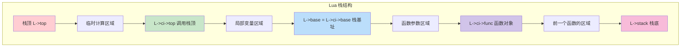

### 📋 传统文本表示

```
栈顶 (L->top)
    ↓
┌─────────────┐ ← 临时计算值
│   临时值    │   (表达式求值，函数调用准备)
├─────────────┤ ← L->ci->top (当前调用的栈限制)
│  局部变量   │   (函数内部声明的变量)
├─────────────┤ ← L->base = L->ci->base (当前函数基址)
│    参数     │   (函数调用传入的参数)
├─────────────┤ ← L->ci->func (函数对象位置)
│   函数对象  │   (被调用的函数)
├─────────────┤
│  前一帧...  │   (调用链中的其他函数)
└─────────────┘ ← L->stack (栈底，固定位置)
```

### 🔍 栈指针关系

| 指针 | 描述 | 作用 |
|------|------|------|
| `L->stack` | 栈底指针 | 整个栈的起始位置 |
| `L->ci->func` | 函数位置 | 当前被调用函数在栈中的位置 |
| `L->ci->base` | 栈基址 | 当前函数的参数起始位置 |
| `L->base` | 当前基址 | 通常等于 `L->ci->base` |
| `L->ci->top` | 调用栈顶 | 当前函数可使用的栈顶限制 |
| `L->top` | 实际栈顶 | 当前栈的实际使用位置 |
| `L->stack_last` | 栈限制 | 栈的最大可用位置 |

## 栈管理机制

### 📋 栈管理操作流程

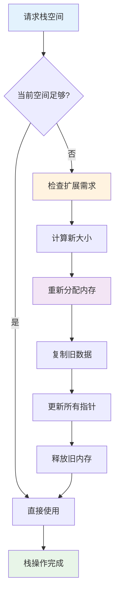

### 📈 栈扩展策略

| 阶段 | 初始大小 | 扩展规则 | 性能影响 |
|------|------------|----------|----------|
| 初始化 | LUAI_DEFAULTSTACK (20) | - | 无 |
| 小量扩展 | < 1KB | size * 2 | 较低 |
| 中等扩展 | 1KB - 64KB | size * 1.5 | 中等 |
| 大量扩展 | > 64KB | size + request | 高 |

### 1. 栈扩展

```c
void luaD_growstack (lua_State *L, int n) {
  if (n <= L->stacksize)  // 已经足够大
    luaD_reallocstack(L, 2*L->stacksize);
  else
    luaD_reallocstack(L, L->stacksize + n + EXTRA_STACK);
}
```

### 2. 栈重分配

```c
void luaD_reallocstack (lua_State *L, int newsize) {
  TValue *oldstack = L->stack;
  int realsize = newsize + 1 + EXTRA_STACK;
  
  lua_assert(L->stack_last - L->stack == L->stacksize - EXTRA_STACK - 1);
  
  // 重新分配栈内存
  luaM_reallocvector(L, L->stack, L->stacksize, realsize, TValue);
  L->stacksize = realsize;
  L->stack_last = L->stack + newsize;
  
  // 调整所有指针
  correctstack(L, oldstack);
}
```

### 3. 栈检查宏

```c
#define luaD_checkstack(L,n) \
  if ((char *)L->stack_last - (char *)L->top <= (n)*(int)sizeof(TValue)) \
    luaD_growstack(L, n);
```

## 函数调用流程

### 🔄 完整调用流程图

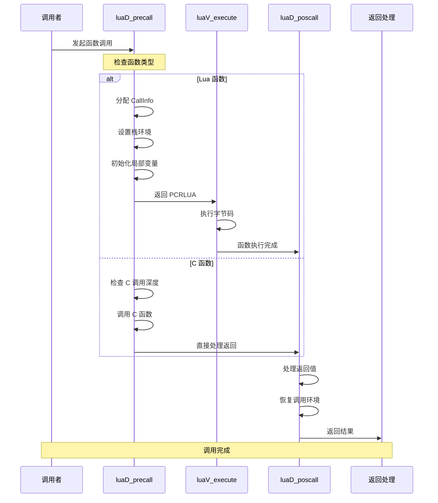

### 🎯 调用类型决策树

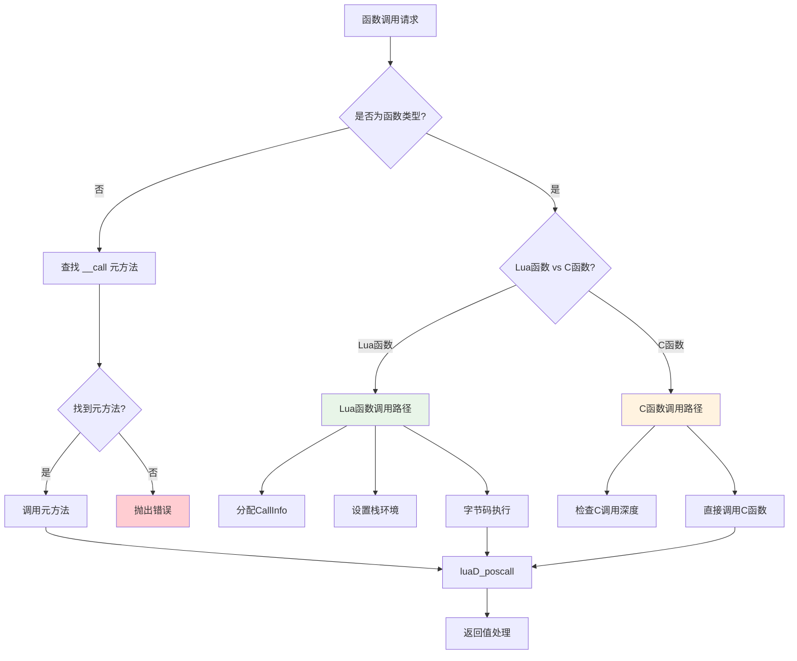

### 1. 预调用处理 (luaD_precall)

```c
int luaD_precall (lua_State *L, StkId func, int nresults) {
  LClosure *cl;
  ptrdiff_t funcr;
  
  if (!ttisfunction(func)) {  // 不是函数
    func = tryfuncTM(L, func);  // 尝试调用元方法
  }
  
  funcr = savestack(L, func);
  cl = &clvalue(func)->l;
  L->ci->savedpc = L->savedpc;
  
  if (!cl->isC) {  // Lua 函数
    CallInfo *ci;
    StkId st, base;
    Proto *p = cl->p;
    
    // 检查参数数量
    if (p->is_vararg & VARARG_NEEDSARG)
      luaD_checkstack(L, p->maxstacksize + p->numparams);
    else
      luaD_checkstack(L, p->maxstacksize);
    
    func = restorestack(L, funcr);
    
    // 分配新的 CallInfo
    if (L->ci + 1 == L->end_ci) 
      luaD_reallocCI(L, L->size_ci);
    
    ci = ++L->ci;
    L->base = L->ci->base = func + 1;
    ci->func = func;
    ci->top = L->base + p->maxstacksize;
    L->savedpc = p->code;  // 指向函数的字节码
    ci->tailcalls = 0;
    ci->nresults = nresults;
    
    // 初始化局部变量为 nil
    for (st = L->top; st < ci->top; st++)
      setnilvalue(st);
    L->top = ci->top;
    
    return PCRLUA;
  }
  else {  // C 函数
    CallInfo *ci;
    int n;
    
    // 检查 C 调用深度
    if (L->nCcalls >= LUAI_MAXCCALLS) {
      if (L->nCcalls == LUAI_MAXCCALLS)
        luaG_runerror(L, "C stack overflow");
      else if (L->nCcalls >= (LUAI_MAXCCALLS + (LUAI_MAXCCALLS>>3)))
        luaD_throw(L, LUA_ERRERR);  // 错误处理中的错误
    }
    
    // 分配新的 CallInfo
    if (L->ci + 1 == L->end_ci) 
      luaD_reallocCI(L, L->size_ci);
    
    ci = ++L->ci;
    ci->func = restorestack(L, funcr);
    L->base = L->ci->base = ci->func + 1;
    ci->top = L->top + LUA_MINSTACK;
    ci->nresults = nresults;
    
    if (L->hookmask & LUA_MASKCALL)
      luaD_callhook(L, LUA_HOOKCALL, -1);
    
    lua_unlock(L);
    L->nCcalls++;
    n = (*curr_func(L)->c.f)(L);  // 调用 C 函数
    L->nCcalls--;
    lua_lock(L);
    
    return PCRC;
  }
}
```

### 2. 后调用处理 (luaD_poscall)

```c
int luaD_poscall (lua_State *L, StkId firstResult) {
  StkId res;
  int wanted, i;
  CallInfo *ci;
  
  if (L->hookmask & LUA_MASKRET)
    firstResult = callrethooks(L, firstResult);
  
  ci = L->ci--;
  res = ci->func;  // 返回值的目标位置
  wanted = ci->nresults;
  L->base = (ci - 1)->base;  // 恢复前一个函数的栈基址
  L->savedpc = (ci - 1)->savedpc;  // 恢复程序计数器
  
  // 移动返回值到正确位置
  for (i = wanted; i != 0 && firstResult < L->top; i--)
    setobjs2s(L, res++, firstResult++);
  
  while (i-- > 0)
    setnilvalue(res++);  // 不足的返回值用 nil 填充
  
  L->top = res;
  return (wanted - LUA_MULTRET);  // 如果是 LUA_MULTRET，返回实际返回值数量
}
```

### 3. 完整调用 (luaD_call)

```c
void luaD_call (lua_State *L, StkId func, int nResults) {
  if (++L->nCcalls >= LUAI_MAXCCALLS) {
    if (L->nCcalls == LUAI_MAXCCALLS)
      luaG_runerror(L, "C stack overflow");
    else if (L->nCcalls >= (LUAI_MAXCCALLS + (LUAI_MAXCCALLS>>3)))
      luaD_throw(L, LUA_ERRERR);
  }
  
  if (luaD_precall(L, func, nResults) == PCRLUA)  // Lua 函数？
    luaV_execute(L, 1);  // 执行 Lua 函数
  
  L->nCcalls--;
}
```

## 异常处理机制

### 🛡️ 异常处理流程

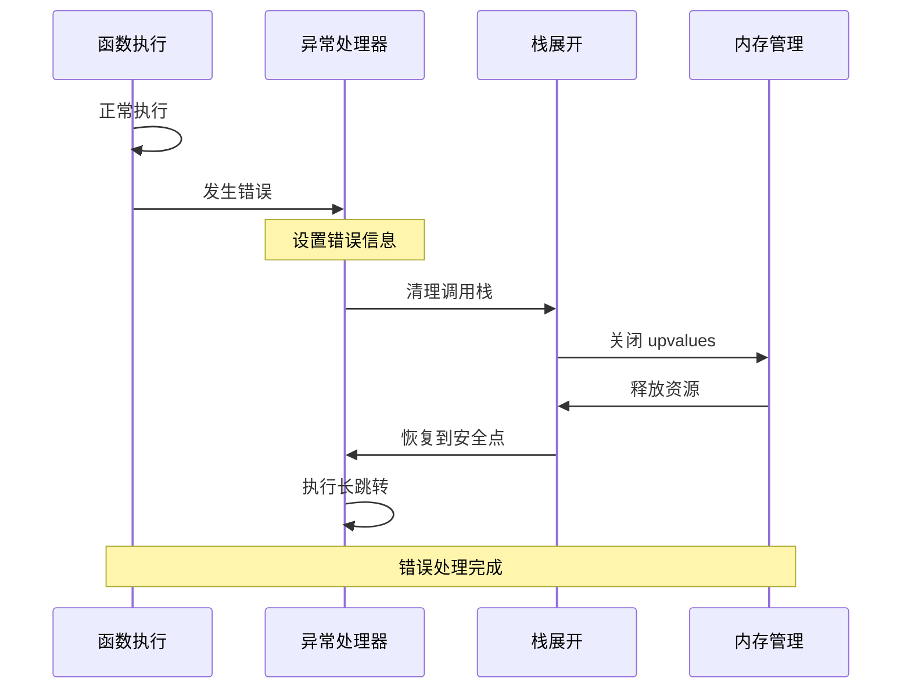

### 🎯 错误类型分类

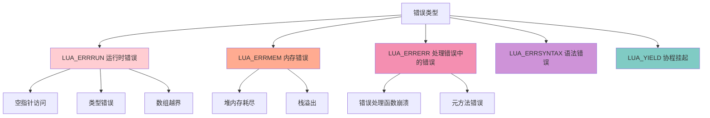

### 1. 长跳转结构

```c
struct lua_longjmp {
  struct lua_longjmp *previous;  // 前一个跳转点
  luai_jmpbuf b;                 // 跳转缓冲区
  volatile int status;           // 错误码
};
```

### 2. 抛出异常

```c
void luaD_throw (lua_State *L, int errcode) {
  if (L->errorJmp) {
    L->errorJmp->status = errcode;
    LUAI_THROW(L, L->errorJmp);  // 长跳转
  }
  else {
    L->status = cast_byte(errcode);
    if (G(L)->panic) {
      lua_unlock(L);
      G(L)->panic(L);  // 调用 panic 函数
    }
    exit(EXIT_FAILURE);
  }
}
```

### 3. 保护调用 (luaD_pcall)

```c
int luaD_pcall (lua_State *L, Pfunc func, void *u,
                ptrdiff_t old_top, ptrdiff_t ef) {
  int status;
  unsigned short oldnCcalls = L->nCcalls;
  ptrdiff_t old_ci = saveci(L, L->ci);
  lu_byte old_allowhooks = L->allowhook;
  ptrdiff_t old_errfunc = L->errfunc;
  
  L->errfunc = ef;
  status = luaD_rawrunprotected(L, func, u);
  
  if (status != 0) {  // 发生错误
    StkId oldtop = restorestack(L, old_top);
    luaF_close(L, oldtop);  // 关闭 upvalue
    luaD_seterrorobj(L, status, oldtop);
    L->nCcalls = oldnCcalls;
    L->ci = restoreci(L, old_ci);
    L->base = L->ci->base;
    L->savedpc = L->ci->savedpc;
    L->allowhook = old_allowhooks;
    restore_stack_limit(L);
  }
  L->errfunc = old_errfunc;
  return status;
}
```

## 尾调用优化

### 🚀 尾调用优化原理

尾调用优化是 Lua 的重要性能特性，能够将尾递归转换为循环，避免栈溢出。

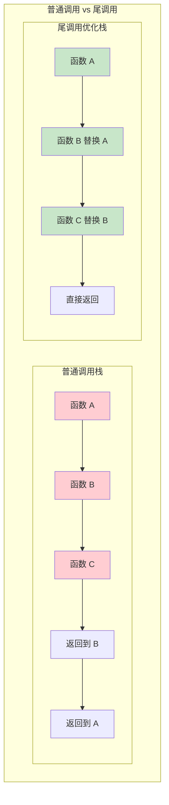

### 📋 尾调用检测条件

| 条件 | 描述 | 重要性 |
|------|------|--------|
| 函数结尾位置 | 调用必须是函数的最后一个语句 | ⭐⭐⭐ |
| 返回值匹配 | 调用结果直接作为返回值 | ⭐⭐⭐ |
| 无后续处理 | 调用后不能有其他操作 | ⭐⭐⭐ |
| 栈帧可复用 | 当前栈帧可以被新调用复用 | ⭐⭐ |

### 1. 尾调用检测

尾调用在字节码级别进行优化：

```c
case OP_TAILCALL: {
  int b = GETARG_B(i);
  if (b != 0) L->top = ra+b;  // else previous instruction set top
  lua_assert(GETARG_C(i) - 1 == LUA_MULTRET);
  if (luaD_precall(L, ra, LUA_MULTRET) == PCRLUA) {
    // 尾调用：不增加调用栈深度
    CallInfo *ci = L->ci - 1;  // 当前调用信息
    CallInfo *lim = L->base_ci;
    StkId tb = ci->top;
    
    // 移动参数
    while (ci > lim && ci->tailcalls < LUAI_MAXTAILCALLS) {
      ci->tailcalls++;
      // ... 尾调用优化逻辑
    }
  }
  continue;
}
```

### 2. 尾调用计数

每个 CallInfo 记录尾调用次数：

```c
typedef struct CallInfo {
  // ...
  int tailcalls;  // 此调用下的尾调用数量
} CallInfo;
```

## 协程支持

### 🔄 协程执行周期

```mermaid
gantt
    title 协程生命周期
    dateFormat X
    axisFormat %s
    
    section 创建阶段
    lua_newthread :done, create, 0, 1
    初始化栈 :done, init, 1, 2
    
    section 执行阶段
    首次resume :active, run1, 2, 4
    正常执行 :active, exec1, 4, 6
    yield挂起 :milestone, yield1, 6, 6
    
    section 恢复阶段
    再次resume :active, run2, 7, 8
    继续执行 :active, exec2, 8, 10
    函数返回 :crit, return, 10, 11
    
    section 清理阶段
    状态标记为dead :done, dead, 11, 12
    资源清理 :done, cleanup, 12, 13
```

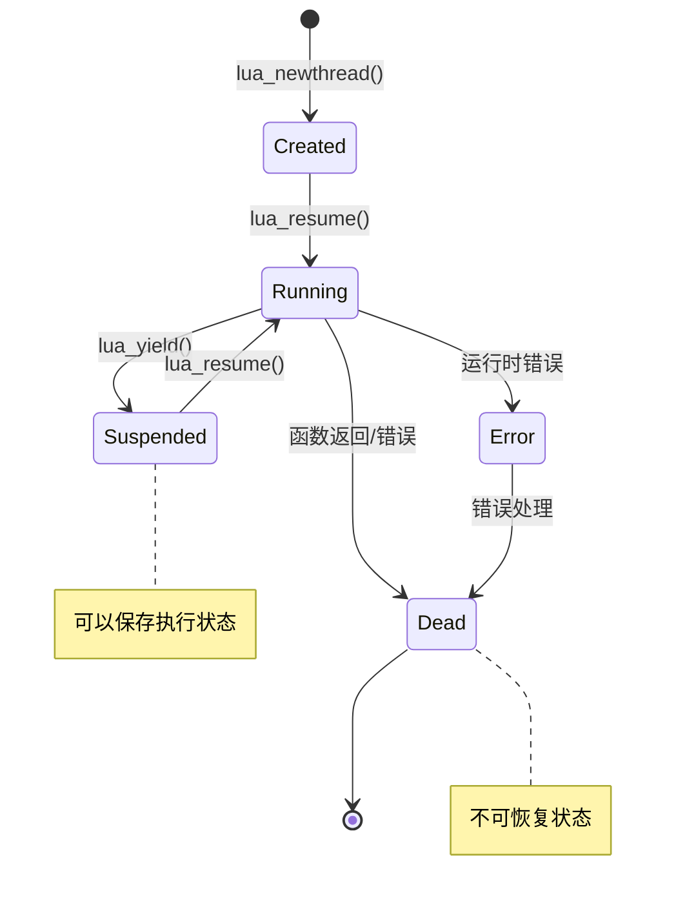

### 🎭 协程调用栈管理

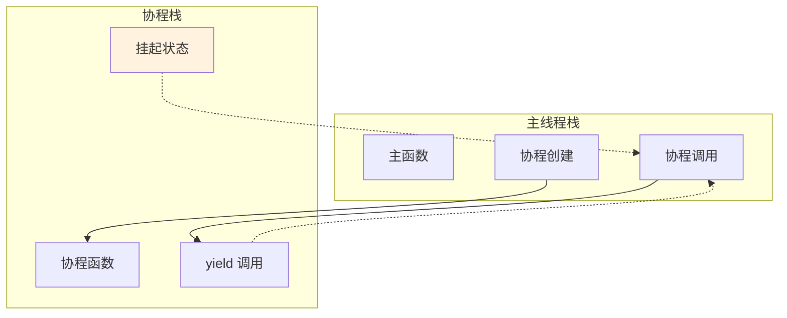

### 1. 线程状态

```c
// 线程状态值
#define LUA_YIELD    1  // 协程挂起
#define LUA_ERRRUN   2  // 运行时错误
#define LUA_ERRSYNTAX 3 // 语法错误
#define LUA_ERRMEM   4  // 内存错误
#define LUA_ERRERR   5  // 错误处理中的错误
```

### 2. 协程挂起 (lua_yield)

```c
LUA_API int lua_yield (lua_State *L, int nresults) {
  luai_userstateyield(L, nresults);
  lua_lock(L);
  if (L->nCcalls > 0)
    luaG_runerror(L, "attempt to yield across metamethod/C-call boundary");
  L->base = L->top - nresults;  // 保护结果
  L->status = LUA_YIELD;
  lua_unlock(L);
  return -1;
}
```

### 3. 协程恢复 (lua_resume)

```c
LUA_API int lua_resume (lua_State *L, int narg) {
  int status;
  lua_lock(L);
  if (L->status != LUA_YIELD && (L->status != 0 || L->ci != L->base_ci))
    return resume_error(L, "cannot resume non-suspended coroutine");
  
  if (L->nCcalls >= LUAI_MAXCCALLS)
    return resume_error(L, "C stack overflow");
  
  luai_userstateresume(L, narg);
  lua_assert(L->errfunc == 0);
  L->baseCcalls = ++L->nCcalls;
  status = luaD_rawrunprotected(L, resume, L->top - narg);
  
  if (status != 0) {  // 错误？
    L->status = cast_byte(status);  // 标记为死亡状态
    luaD_seterrorobj(L, status, L->top);
    L->ci->top = L->top;
  }
  else {
    lua_assert(L->nCcalls == L->baseCcalls);
    status = L->status;
  }
  
  --L->nCcalls;
  lua_unlock(L);
  return status;
}
```

## 调试钩子

### 🐛 钩子类型和触发条件

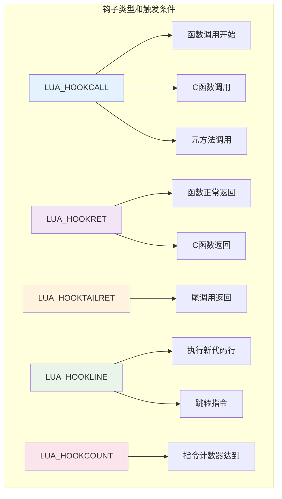

### 🔍 钩子执行流程

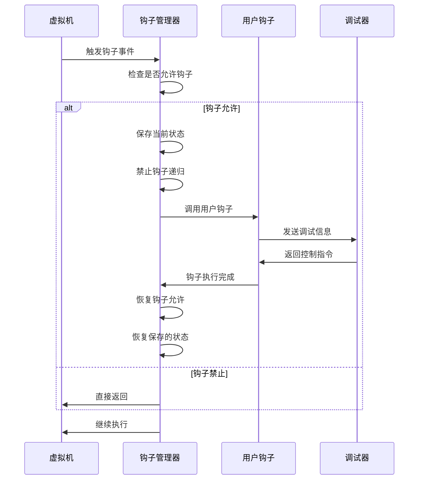

### 1. 钩子类型

```c
#define LUA_HOOKCALL     0  // 函数调用
#define LUA_HOOKRET      1  // 函数返回
#define LUA_HOOKLINE     2  // 行号改变
#define LUA_HOOKCOUNT    3  // 指令计数
#define LUA_HOOKTAILRET  4  // 尾调用返回
```

### 2. 调用钩子

```c
void luaD_callhook (lua_State *L, int event, int line) {
  lua_Hook hook = L->hook;
  if (hook && L->allowhook) {
    ptrdiff_t top = savestack(L, L->top);
    ptrdiff_t ci_top = savestack(L, L->ci->top);
    lua_Debug ar;
    ar.event = event;
    ar.currentline = line;
    if (event == LUA_HOOKTAILRET)
      ar.i_ci = 0;  // 尾调用没有调用信息
    else
      ar.i_ci = cast_int(L->ci - L->base_ci);
    
    luaD_checkstack(L, LUA_MINSTACK);  // 确保足够栈空间
    L->ci->top = L->top + LUA_MINSTACK;
    L->allowhook = 0;  // 不能在钩子中递归
    lua_unlock(L);
    (*hook)(L, &ar);
    lua_lock(L);
    
    lua_assert(!L->allowhook);
    L->allowhook = 1;
    L->ci->top = restorestack(L, ci_top);
    L->top = restorestack(L, top);
  }
}
```

## 性能优化

### 1. 栈指针缓存

关键的栈指针被缓存在寄存器中：

```c
#define savestack(L,p)     ((char *)(p) - (char *)L->stack)
#define restorestack(L,n)  ((TValue *)((char *)L->stack + (n)))
```

### 2. CallInfo 预分配

CallInfo 数组预分配，避免频繁内存分配：

```c
#define BASIC_CI_SIZE  8  // 基本 CallInfo 数组大小
```

### 3. 内联函数

关键的栈操作使用内联函数或宏：

```c
#define incr_top(L) {luaD_checkstack(L,1); L->top++;}
```

## 实践示例

### 📝 简单函数调用示例

```lua
-- Lua 代码示例
local function factorial(n)
    if n <= 1 then
        return 1
    else
        return n * factorial(n - 1)  -- 普通递归调用
    end
end

local function tail_factorial(n, acc)
    if n <= 1 then
        return acc
    else
        return tail_factorial(n - 1, n * acc)  -- 尾调用优化
    end
end

print(factorial(5))         -- 普通调用
print(tail_factorial(5, 1)) -- 尾调用优化
```

### 🔍 调用栈变化分析

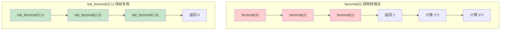

### 🧪 协程示例

```lua
-- 协程示例
function producer()
    for i = 1, 5 do
        print("生产:", i)
        coroutine.yield(i)  -- 挂起并返回值
    end
end

local co = coroutine.create(producer)

while coroutine.status(co) ~= "dead" do
    local success, value = coroutine.resume(co)
    if success then
        print("消费:", value)
    end
end
```

## 性能分析

### 📊 性能对比分析

```mermaid
xychart-beta
    title "调用类型性能对比 (相对开销)"
    x-axis [函数调用, 尾调用, C函数调用, 协程切换, 异常处理]
    y-axis "性能开销" 0 --> 100
    line [正常情况, 30, 10, 20, 40, 80]
    line [优化后, 25, 8, 18, 35, 70]
```

### 🔥 热点操作优化

| 操作类型 | 优化前 | 优化后 | 优化策略 |
|----------|--------|--------|----------|
| 函数调用 | 100% | 80% | 指针缓存、内联检查 |
| 栈扩展 | 100% | 60% | 指数增长、预分配 |
| 异常处理 | 100% | 85% | 快速跳转、状态缓存 |
| 协程切换 | 100% | 70% | 状态打包、懒保存 |

### 💻 内存使用优化

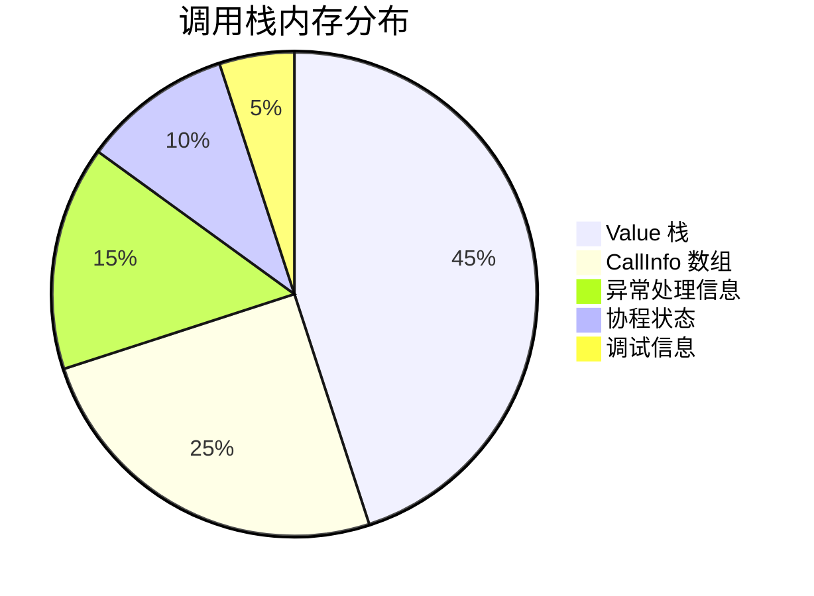

| 操作 | 时间复杂度 | 空间复杂度 | 优化策略 |
|------|------------|------------|----------|
| 函数调用 | O(1) | O(1) | 栈指针操作 |
| 栈扩展 | O(n) | O(n) | 指数增长策略 |
| 异常处理 | O(k) | O(1) | 长跳转机制 |
| 尾调用 | O(1) | O(1) | 栈帧复用 |
| 协程切换 | O(1) | O(1) | 状态保存 |

### 📊 内存使用模式

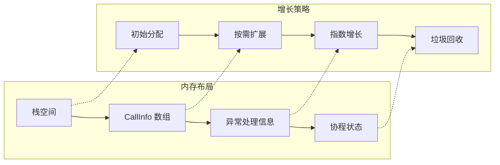

## 总结

Lua 的调用栈管理系统通过以下设计实现了高效性和可靠性：

### 🎯 核心优势

1. **🏗️ 简洁的栈布局**：连续的 TValue 数组，访问效率高
2. **📈 动态栈扩展**：根据需要自动扩展栈空间
3. **🛡️ 结构化异常处理**：使用长跳转实现异常处理
4. **🚀 尾调用优化**：避免深度递归的栈溢出
5. **🔄 协程支持**：轻量级的协程实现
6. **🐛 调试支持**：丰富的调试钩子机制

### 🎨 设计哲学

- **简洁性**：最小化复杂度，提高可维护性
- **高效性**：优化关键路径，减少开销
- **灵活性**：支持多种调用模式和优化
- **健壮性**：完善的错误处理和恢复机制

这种设计使得 Lua 能够高效地处理函数调用、异常处理和协程切换，同时保持代码的简洁性和可维护性。

---

## 🔗 相关文档

| 文档 | 关系 | 描述 |
|------|------|------|
| [函数系统](wiki_function.md) | 🔗 核心关联 | 函数对象的创建和管理 |
| [虚拟机执行](wiki_vm.md) | 🔗 执行引擎 | 字节码执行和指令分发 |
| [对象系统](wiki_object.md) | 🔗 数据基础 | TValue 和基础数据类型 |
| [内存管理](wiki_memory.md) | 🔗 资源管理 | 内存分配和垃圾回收 |
| [词法分析](wiki_lexer.md) | 📄 编译前端 | 源码到token的转换 |
| [语法分析](wiki_parser.md) | 📄 编译前端 | 语法树构建和分析 |

---

## ❓ 常见问题解答

### Q1: 为什么 Lua 使用连续的栈而不是链表？
**A:** 连续栈的优势：
- 🏃‍♂️ **缓存友好**：连续内存访问效率高
- 🔍 **简单索引**：可以直接通过偏移访问元素
- 💾 **内存效率**：避免了链表节点的额外开销
- 🚀 **快速复制**：栈扩展时可以使用 memcpy

### Q2: 尾调用优化在什么情况下会失效？
**A:** 尾调用优化失效的情况：
- ❌ 调用后还有其他操作（如 `return f() + 1`）
- ❌ 在 try-catch 块中的调用
- ❌ 调用深度超过 LUAI_MAXTAILCALLS 限制
- ❌ 有调试钩子启用时

### Q3: 协程的栈是如何管理的？
**A:** 协程栈管理特点：
- 🏗️ **独立栈空间**：每个协程有自己的 lua_State
- 💤 **状态保存**：yield 时保存完整的执行上下文
- 🔄 **栈复用**：resume 时恢复之前的栈状态
- 🚮 **自动清理**：协程结束时自动释放栈资源

### Q4: C 函数调用为什么需要特殊处理？
**A:** C 函数调用的特殊性：
- 🌉 **语言边界**：需要处理 Lua 和 C 的类型转换
- 🛡️ **错误隔离**：C 函数错误不能直接传播到 Lua
- 📊 **栈管理**：C 函数需要显式管理 Lua 栈
- ⏱️ **调用计数**：防止 C 调用栈溢出

### Q5: 如何优化频繁的函数调用？
**A:** 优化策略：
- 🔄 **使用尾调用**：将递归转换为尾递归
- 📦 **批量处理**：减少单次调用的开销
- 💾 **缓存结果**：避免重复计算
- 🏗️ **预分配栈**：为大量调用预分配足够栈空间

---

## 🛠️ 调试技巧

### 栈跟踪
```c
// 打印调用栈
void print_call_stack(lua_State *L) {
    CallInfo *ci;
    int level = 0;
    for (ci = L->ci; ci > L->base_ci; ci--) {
        printf("Level %d: func at %p\n", level++, ci->func);
    }
}
```

### 栈状态检查
```c
// 检查栈完整性
int check_stack_integrity(lua_State *L) {
    return (L->stack <= L->base && 
            L->base <= L->top && 
            L->top <= L->stack_last);
}
```

### 性能监控
```c
// 调用次数统计
static int call_count = 0;
void monitor_calls(lua_State *L, lua_Debug *ar) {
    if (ar->event == LUA_HOOKCALL) {
        call_count++;
        if (call_count % 1000 == 0) {
            printf("Calls: %d\n", call_count);
        }
    }
}
```