# 🚀 Lua语句执行流程深度解析 - DeepWiki版本

> **学习指南**: 本文档深入分析Lua语句从源代码到最终执行的完整底层流程，通过实际示例揭示词法分析、语法分析、代码生成、虚拟机执行的技术细节和优化策略。

---

## 🎯 学习目标与路径

### 📖 适合读者群体
- **初级开发者**: 具备编程基础，希望了解编程语言执行原理
- **中级开发者**: 熟悉Lua语法，想深入理解编译和执行机制
- **高级开发者**: 研究虚拟机设计，寻求性能优化和调试技巧
- **编译器开发者**: 学习编译器设计，理解现代语言实现技术

### 🛤️ 学习路径规划
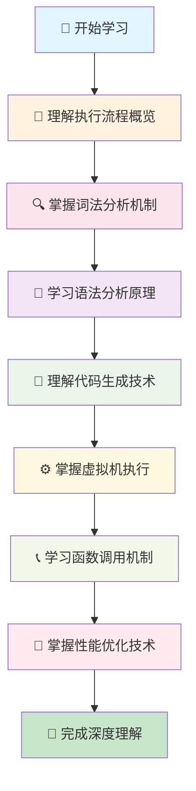

### ⏱️ 学习时间估算
- **快速浏览**: 30-40分钟 - 理解基本执行流程
- **深度学习**: 2-3小时 - 掌握各阶段技术细节
- **实践应用**: 4-6小时 - 学习调试和优化技术
- **专家级**: 10-15小时 - 深入研究虚拟机实现

---

## 🧭 文档导航

### 📑 核心章节导览
| 章节 | 内容概要 | 难度等级 | 重要程度 | 学习时间 |
|------|----------|----------|----------|----------|
| [🎯 执行流程概览](#-执行流程概览) | 五大执行阶段总览 | ⭐⭐ | 🔥🔥🔥 | 8分钟 |
| [🔍 词法分析阶段](#-词法分析阶段) | Token化和词法状态 | ⭐⭐⭐ | 🔥🔥🔥 | 15分钟 |
| [🌳 语法分析阶段](#-语法分析阶段) | AST构建和语义分析 | ⭐⭐⭐⭐ | 🔥🔥🔥 | 25分钟 |
| [🔧 代码生成阶段](#-代码生成阶段) | 字节码生成和优化 | ⭐⭐⭐⭐ | 🔥🔥🔥 | 20分钟 |
| [⚙️ 虚拟机执行](#-虚拟机执行阶段) | 字节码执行和寄存器管理 | ⭐⭐⭐⭐⭐ | 🔥🔥🔥 | 30分钟 |
| [📞 函数调用机制](#-函数调用机制) | 函数调用和参数传递 | ⭐⭐⭐ | 🔥🔥 | 15分钟 |
| [🚀 性能优化技术](#-性能优化技术) | 编译和执行优化策略 | ⭐⭐⭐⭐⭐ | 🔥🔥 | 20分钟 |

### 🔗 相关文档链接
- 📖 [Lua词法分析器详解](./wiki_lexer.md) - 深入词法分析实现
- 🌳 [Lua语法分析器实现](./wiki_parser.md) - 完整语法分析技术
- 🔧 [Lua字节码生成机制](./wiki_code.md) - 代码生成和优化
- ⚙️ [Lua虚拟机架构](./wiki_vm.md) - 虚拟机设计和实现
- 📊 [Lua操作码系统](./wiki_opcodes.md) - 指令集和执行语义
- 🎛️ [Lua函数执行器](./wiki_do.md) - 函数调用和异常处理

### 📚 学习前置要求
- ✅ **Lua语法基础**: 函数、变量、表达式的基本概念
- ✅ **编程语言原理**: 编译器基础概念和执行模型
- ✅ **C语言基础**: 理解指针、结构体、函数调用
- ✅ **数据结构**: 树、哈希表、栈的基本操作

---

## 🎯 执行流程概览

### 🔍 Lua执行模型总览

Lua语句的执行是一个多阶段的复杂过程，每个阶段都有明确的职责和输入输出：

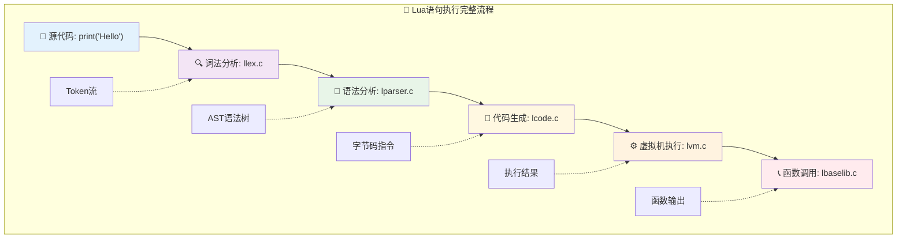

### 📊 各阶段职责分工

#### 🎯 **阶段间数据流转**
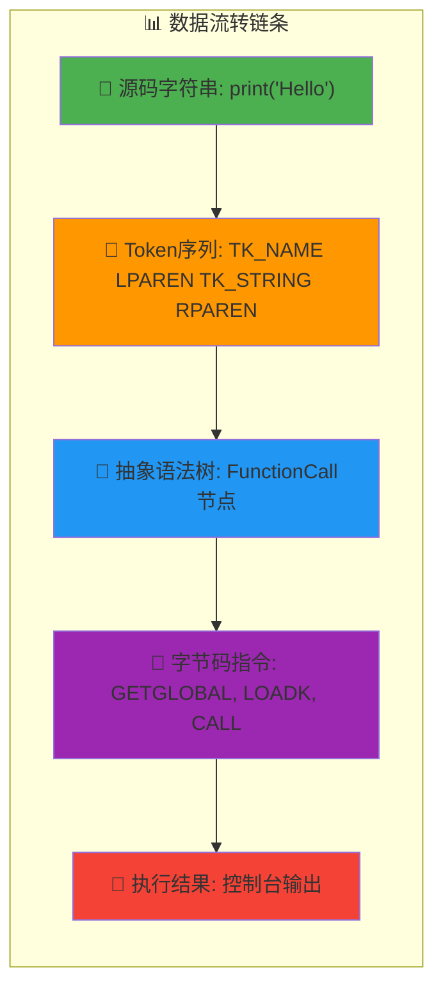

#### 🏗️ **核心组件架构**
| 阶段 | 核心模块 | 主要功能 | 输入 | 输出 | 关键数据结构 |
|------|----------|----------|------|------|-------------|
| **🔍 词法分析** | llex.c | Token化源码 | 字符流 | Token流 | LexState, Token |
| **🌳 语法分析** | lparser.c | 构建AST | Token流 | 语法树 | FuncState, expdesc |
| **🔧 代码生成** | lcode.c | 生成字节码 | 语法树 | 字节码 | Instruction |
| **⚙️ 虚拟机执行** | lvm.c | 执行指令 | 字节码 | 运行时值 | lua_State, StkId |
| **📞 函数调用** | lbaselib.c | 调用函数 | 参数 | 结果 | CallInfo |

### 💡 设计理念

#### ✅ **分层架构优势**
- **🔄 职责分离**: 每个阶段专注特定任务，便于维护和扩展
- **📊 数据标准化**: 阶段间有明确的数据接口，降低耦合度
- **⚡ 性能优化**: 每个阶段可独立优化，提高整体性能
- **🛠️ 调试友好**: 可在任意阶段插入调试和分析工具

#### 🎯 **执行效率保证**
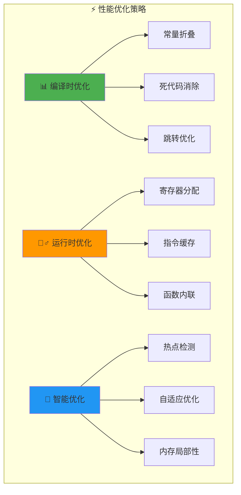

---

## 🔍 词法分析阶段

### 🎯 词法分析器核心功能

词法分析器是编译过程的第一步，负责将源代码字符流转换为有意义的Token序列：

#### 📋 Token类型体系
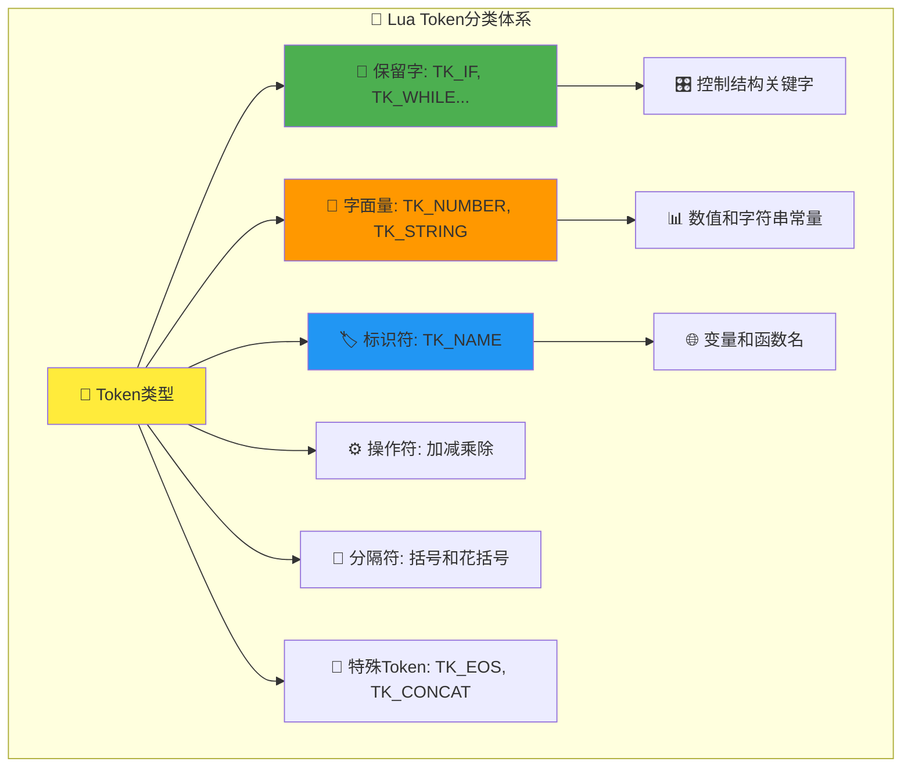

#### 🏗️ 核心数据结构详解
```c
// 词法状态管理的完整结构
typedef struct LexState {
  int current;          // 🔍 当前处理的字符
  int linenumber;       // 📏 当前行号（错误报告用）
  int lastline;         // 📍 最后处理的Token行号
  Token t;              // 🎯 当前Token
  Token lookahead;      // 👀 前瞻Token（语法分析用）
  struct FuncState *fs; // 🔗 关联的函数状态
  struct lua_State *L;  // 🌐 Lua虚拟机状态
  ZIO *z;               // 📄 输入字符流
  Mbuffer *buff;        // 📦 Token构建缓冲区
  TString *source;      // 📁 源文件名
  char decpoint;        // 🔢 本地化小数点字符
} LexState;
```

### 📊 实例分析：`print("Hello, World")`

#### 🔄 Token化过程详解
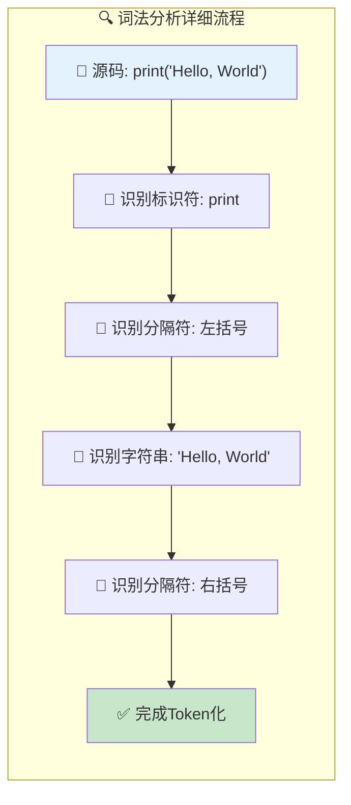

#### 📋 Token序列生成表
| 位置 | 字符序列 | Token类型 | Token值 | 属性信息 |
|------|----------|-----------|---------|----------|
| 1 | `print` | `TK_NAME` | "print" | 标识符，5字符 |
| 2 | `(` | `'('` | 40 (ASCII) | 左括号分隔符 |  
| 3 | `"Hello, World"` | `TK_STRING` | "Hello, World" | 字符串字面量，13字符 |
| 4 | `)` | `')'` | 41 (ASCII) | 右括号分隔符 |
| 5 | EOF | `TK_EOS` | - | 输入结束标记 |

#### ⚙️ 关键算法实现
```c
/* 核心词法分析函数 */
static int llex (LexState *ls, SemInfo *seminfo) {
  /*
  词法分析的核心流程：
  
  1. 🔍 跳过空白字符和注释
  2. 🎯 识别Token起始字符
  3. 📊 根据字符类型分派处理
  4. 📦 构建Token并返回类型
  */
  
  luaZ_resetbuffer(ls->buff);  /* 重置缓冲区 */
  
  for (;;) {
    switch (ls->current) {
      case '\n': case '\r':      /* 🔄 处理换行符 */
        inclinenumber(ls);
        break;
        
      case ' ': case '\f': case '\t': case '\v':  /* ⏭️ 跳过空白 */
        next(ls);
        break;
        
      case '-': {                /* 🔍 处理减号或注释 */
        next(ls);
        if (ls->current != '-') return '-';
        /* 处理注释逻辑 */
        break;
      }
      
      case '"': case '\'':       /* 📝 处理字符串 */
        read_string(ls, ls->current, seminfo);
        return TK_STRING;
        
      case '0': case '1': case '2': case '3': case '4':
      case '5': case '6': case '7': case '8': case '9': {  /* 🔢 处理数字 */
        read_numeral(ls, seminfo);
        return TK_NUMBER;
      }
      
      default: {
        if (lislalpha(ls->current)) {  /* 🏷️ 处理标识符 */
          /* 读取标识符或保留字 */
          TString *ts;
          do {
            save_and_next(ls);
          } while (lislalnum(ls->current));
          ts = luaX_newstring(ls, luaZ_buffer(ls->buff), luaZ_bufflen(ls->buff));
          seminfo->ts = ts;
          if (ts->tsv.reserved > 0)  /* 🎯 检查保留字 */
            return ts->tsv.reserved - 1 + FIRST_RESERVED;
          else
            return TK_NAME;
        }
      }
    }
  }
}
```

### 🛠️ 高级特性解析

#### 🔢 数值处理技术
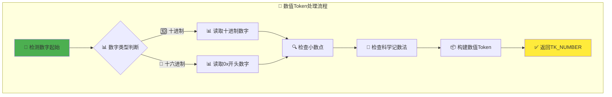

#### 📝 字符串处理策略
```c
/* 字符串读取的完整实现 */
static void read_string (LexState *ls, int del, SemInfo *seminfo) {
  /*
  字符串处理的核心功能：
  
  1. 🔍 处理转义字符序列
  2. 📏 支持多行字符串
  3. 🛡️ 检测未终止字符串
  4. 🔄 Unicode和字符编码支持
  */
  
  save_and_next(ls);  /* 跳过起始引号 */
  
  while (ls->current != del) {
    switch (ls->current) {
      case EOZ:
        lexerror(ls, "unfinished string", TK_EOS);
        break;
        
      case '\n':
      case '\r':
        lexerror(ls, "unfinished string", TK_STRING);
        break;
        
      case '\\': {  /* 🔄 处理转义序列 */
        int c;  /* 转义后的字符 */
        next(ls);  /* 跳过 '\' */
        switch (ls->current) {
          case 'a': c = '\a'; break;
          case 'b': c = '\b'; break;
          case 'f': c = '\f'; break;
          case 'n': c = '\n'; break;
          case 'r': c = '\r'; break;
          case 't': c = '\t'; break;
          case 'v': c = '\v'; break;
          case '\\': c = '\\'; break;
          case '"': c = '"'; break;
          case '\'': c = '\''; break;
          /* 数字转义序列处理 */
          default: {
            if (!lisdigit(ls->current))
              escerror(ls, &ls->current, 1, "invalid escape sequence");
            /* 读取数字转义序列 */
          }
        }
        save(ls, c);
        next(ls);
        break;
      }
      
      default:
        save_and_next(ls);
    }
  }
  
  save_and_next(ls);  /* 跳过结束引号 */
  seminfo->ts = luaX_newstring(ls, luaZ_buffer(ls->buff) + 1,
                                   luaZ_bufflen(ls->buff) - 2);
}
```

---

## 🌳 语法分析阶段

### 🎯 语法分析器核心架构

语法分析器是编译过程的关键阶段，负责将Token流转换为抽象语法树(AST)，同时进行语义分析和代码生成：

#### 🏗️ 语法分析的双重职责
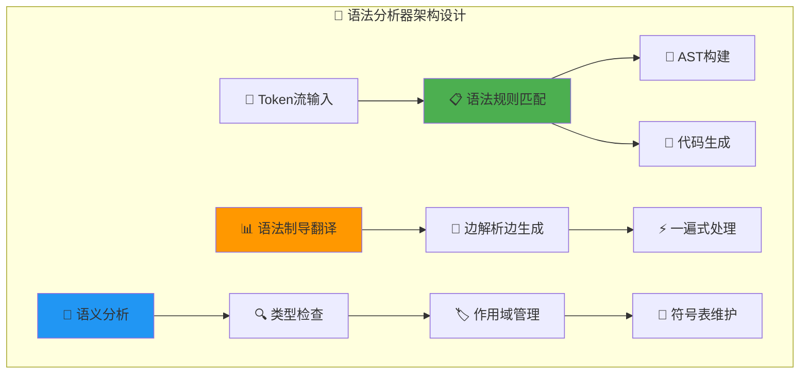

#### 📊 表达式描述符系统
```c
// 表达式状态的完整分类系统
typedef enum {
  VVOID,      // ❌ 无值表达式（语句）
  VNIL,       // 🔘 nil常量
  VTRUE,      // ✅ true常量  
  VFALSE,     // ❌ false常量
  VK,         // 📊 常量表中的值
  VKNUM,      // 🔢 数值常量
  VLOCAL,     // 📍 局部变量
  VUPVAL,     // ⬆️ 上值变量
  VGLOBAL,    // 🌐 全局变量
  VINDEXED,   // 📋 表索引访问
  VJMP,       // 🔄 跳转表达式
  VRELOCABLE, // 🎯 可重定位指令结果
  VNONRELOC,  // 📌 固定寄存器结果
  VCALL,      // 📞 函数调用
  VVARARG     // 📋 可变参数
} expkind;

typedef struct expdesc {
  expkind k;                    // 🏷️ 表达式类型
  union {
    struct { int info, aux; } s; // 📊 寄存器信息或跳转信息
    lua_Number nval;            // 🔢 数值常量值
  } u;
  int t;  // ✅ "为真时"跳转链表  
  int f;  // ❌ "为假时"跳转链表
} expdesc;
```

### 📊 实例分析：`print("Hello, World")`

#### 🌳 AST构建过程
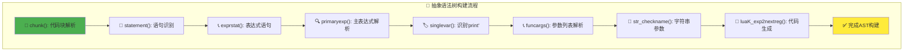

#### 🎛️ 函数状态管理
```c
// 语法分析过程中的函数编译状态
typedef struct FuncState {
  Proto *f;                    // 🎯 当前编译的函数原型
  Table *h;                    // 🗂️ 常量表哈希映射
  struct FuncState *prev;      // 🔙 外层函数状态（闭包链）
  struct LexState *ls;         // 🔗 词法分析器状态
  struct lua_State *L;         // 🌐 Lua虚拟机状态
  struct BlockCnt *bl;         // 📦 当前作用域块
  int pc;                      // 📍 下一条指令的位置
  int lasttarget;              // 🎯 最后跳转目标
  int jpc;                     // 🔄 待处理跳转链表
  int freereg;                 // 🆓 第一个空闲寄存器
  int nk;                      // 📊 常量表大小
  int np;                      // 🔢 子函数数量
  short nlocvars;              // 📏 局部变量总数
  lu_byte nactvar;             // 🎯 当前活跃局部变量数
  upvaldesc upvalues[LUAI_MAXUPVALUES];  // ⬆️ 上值描述数组
  unsigned short actvar[LUAI_MAXVARS];   // 📋 活跃变量栈
} FuncState;
```

### ⚙️ 关键解析算法

#### 🔍 主表达式解析
```c
/* 主表达式解析的核心逻辑 */
static void primaryexp (LexState *ls, expdesc *v) {
  /*
  主表达式解析的完整流程：
  
  1. 🎯 根据当前Token确定表达式类型
  2. 📊 处理基本字面量（nil, true, false, number, string）
  3. 🏷️ 处理标识符（变量、函数名）
  4. 🔄 处理复杂表达式（表构造器、函数定义）
  5. 📞 处理后缀表达式（函数调用、索引访问）
  */
  
  FuncState *fs = ls->fs;
  switch (ls->t.token) {
    case '(': {  /* 🔄 括号表达式 */
      int line = ls->linenumber;
      luaX_next(ls);  /* 跳过 '(' */
      expr(ls, v);    /* 解析内部表达式 */
      check_match(ls, ')', '(', line);  /* 检查匹配的 ')' */
      luaK_dischargevars(fs, v);  /* 处理变量解引用 */
      return;
    }
    
    case TK_NIL: {   /* 🔘 nil字面量 */
      init_exp(v, VNIL, 0);
      break;
    }
    
    case TK_TRUE: {  /* ✅ true字面量 */
      init_exp(v, VTRUE, 0);
      break;
    }
    
    case TK_FALSE: { /* ❌ false字面量 */
      init_exp(v, VFALSE, 0);
      break;
    }
    
    case TK_NUMBER: { /* 🔢 数值字面量 */
      init_exp(v, VKNUM, 0);
      v->u.nval = ls->t.seminfo.r;
      break;
    }
    
    case TK_STRING: { /* 📝 字符串字面量 */
      codestring(ls, v, ls->t.seminfo.ts);
      break;
    }
    
    case TK_NAME: {   /* 🏷️ 标识符 */
      singlevar(ls, v);
      return;
    }
    
    default: {
      luaX_syntaxerror(ls, "unexpected symbol");
      return;
    }
  }
  luaX_next(ls);  /* 消费当前Token */
}
```

#### 📞 函数调用解析
```c
/* 函数参数列表解析 */
static void funcargs (LexState *ls, expdesc *f) {
  /*
  函数参数解析的处理策略：
  
  1. 📋 支持多种参数形式：
     - (expr, expr, ...) 标准参数列表
     - "string" 单个字符串参数
     - {field=value, ...} 表构造器参数
  
  2. 🔧 边解析边生成代码：
     - 参数表达式直接生成到连续寄存器
     - 优化函数调用的参数传递
  */
  
  FuncState *fs = ls->fs;
  expdesc args;
  int base, nparams;
  int line = ls->linenumber;
  
  switch (ls->t.token) {
    case '(': {  /* 📋 标准参数列表 */
      if (line != ls->lastline)
        luaX_syntaxerror(ls, "ambiguous syntax (function call x new statement)");
      luaX_next(ls);
      if (ls->t.token == ')')  /* 🔄 空参数列表？ */
        args.k = VVOID;
      else {
        explist1(ls, &args);   /* 解析参数表达式列表 */
        luaK_setmultret(fs, &args);  /* 处理多返回值 */
      }
      check_match(ls, ')', '(', line);
      break;
    }
    
    case '{': {  /* 📊 表构造器作为参数 */
      constructor(ls, &args);
      break;
    }
    
    case TK_STRING: {  /* 📝 字符串字面量作为参数 */
      codestring(ls, &args, ls->t.seminfo.ts);
      luaX_next(ls);  /* 必须立即消费字符串token */
      break;
    }
    
    default: {
      luaX_syntaxerror(ls, "function arguments expected");
      return;
    }
  }
  
  lua_assert(f->k == VNONRELOC);
  base = f->u.s.info;  /* 函数在寄存器中的位置 */
  if (hasmultret(args.k))
    nparams = LUA_MULTRET;  /* 多返回值参数 */
  else {
    if (args.k != VVOID)
      luaK_exp2nextreg(fs, &args);  /* 关闭参数列表 */
    nparams = fs->freereg - (base+1);
  }
  init_exp(f, VCALL, luaK_codeABC(fs, OP_CALL, base, nparams+1, 2));
  luaK_fixline(fs, line);
  fs->freereg = base+1;  /* 调用后清理寄存器 */
}
```

---

## 🔧 代码生成阶段

### 🎯 字节码生成核心机制

代码生成阶段将语法分析的结果转换为Lua虚拟机可执行的字节码指令：

#### ⚡ 指令生成策略
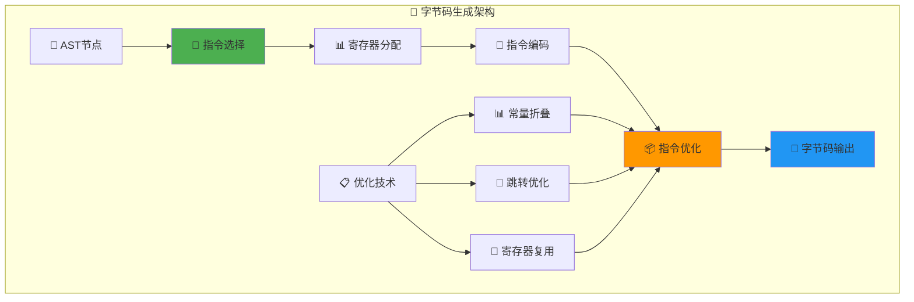

#### 🎛️ 核心生成函数
```c
// 主要的字节码生成函数族
/* ABC格式指令生成 */
int luaK_codeABC (FuncState *fs, OpCode o, int a, int b, int c) {
  /*
  ABC指令格式的编码过程：
  
  1. 🔍 验证指令格式和参数范围
  2. 🔧 构造32位指令字
  3. 📝 写入指令流
  4. 📍 返回指令位置
  */
  Instruction i;
  lua_assert(getOpMode(o) == iABC);
  lua_assert(getBMode(o) != OpArgN || b == 0);
  lua_assert(getCMode(o) != OpArgN || c == 0);
  i = CREATE_ABC(o, a, b, c);
  return luaK_code(fs, i, fs->ls->lastline);
}

/* ABx格式指令生成 */  
int luaK_codeABx (FuncState *fs, OpCode o, int a, unsigned int bc) {
  /*
  ABx指令格式用于：
  - 📊 LOADK指令（加载常量）
  - 🌐 GETGLOBAL指令（获取全局变量）
  - 📞 CLOSURE指令（创建闭包）
  */
  Instruction i;
  lua_assert(getOpMode(o) == iABx || getOpMode(o) == iAsBx);
  lua_assert(getCMode(o) == OpArgN);
  i = CREATE_ABx(o, a, bc);
  return luaK_code(fs, i, fs->ls->lastline);
}
```

### 📊 实例分析：字节码生成过程

#### 🔄 `print("Hello, World")`的完整生成流程
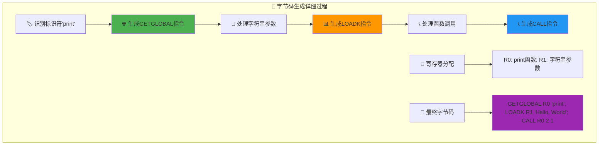

#### 📋 指令生成序列表
| 步骤 | 语法元素 | 生成指令 | 寄存器使用 | 说明 |
|------|----------|----------|-----------|------|
| 1 | `print` | `GETGLOBAL R0 "print"` | R0=函数 | 从全局环境获取print函数 |
| 2 | `"Hello, World"` | `LOADK R1 "Hello, World"` | R1=字符串 | 加载字符串常量到寄存器 |
| 3 | `print(...)` | `CALL R0 2 1` | R0+参数 | 调用函数，2个slot，1个返回值 |

### 🎯 高级优化技术

#### 📊 常量折叠实现
```c
/* 编译时常量计算优化 */
static int constfolding (OpCode op, expdesc *e1, expdesc *e2) {
  /*
  常量折叠的优化场景：
  
  1. 🧮 算术运算：2 + 3 → 5
  2. 🔤 字符串连接："a" .. "b" → "ab"  
  3. 🔍 比较运算：1 < 2 → true
  4. 🔁 逻辑运算：true and false → false
  */
  
  lua_Number v1, v2, r;
  if (!isnumeral(e1) || !isnumeral(e2)) return 0;
  v1 = e1->u.nval;
  v2 = e2->u.nval;
  
  switch (op) {
    case OP_ADD: r = luai_numadd(v1, v2); break;
    case OP_SUB: r = luai_numsub(v1, v2); break;
    case OP_MUL: r = luai_nummul(v1, v2); break;
    case OP_DIV:
      if (v2 == 0) return 0;  /* 🚨 避免除零 */
      r = luai_numdiv(v1, v2); break;
    case OP_MOD: r = luai_nummod(v1, v2); break;
    case OP_POW: r = luai_numpow(v1, v2); break;
    case OP_UNM: r = luai_numunm(v1); break;
    case OP_LEN: return 0;  /* 📏 长度运算无法折叠 */
    default: lua_assert(0); return 0;
  }
  
  if (luai_numisnan(r)) return 0;  /* 🚫 避免NaN结果 */
  e1->u.nval = r;
  return 1;  /* ✅ 折叠成功 */
}
```

#### 🔄 跳转优化机制
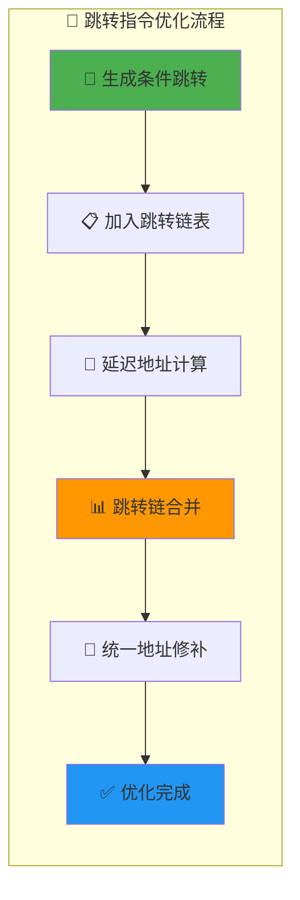

## ⚡ 虚拟机执行阶段

### 🎯 Lua虚拟机核心架构

Lua虚拟机是一个基于寄存器的栈式虚拟机，负责执行编译生成的字节码：

#### 🏗️ 虚拟机设计理念
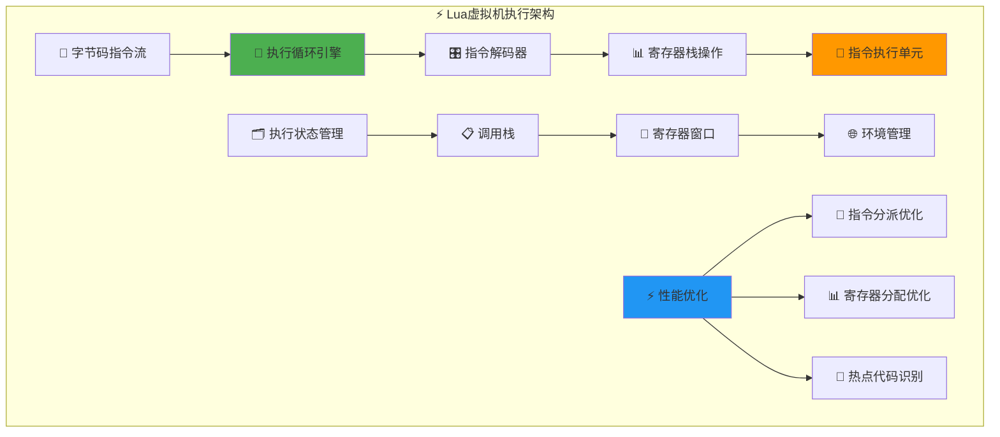

#### 🎛️ 核心执行循环
```c
/* Lua虚拟机的心脏：主执行循环 */
void luaV_execute (lua_State *L, int nexeccalls) {
  /*
  虚拟机执行循环的核心设计：
  
  1. 🔄 无限循环执行指令
  2. 🎯 基于goto的分派表优化
  3. 📊 直接操作寄存器栈
  4. ⚡ 最小化函数调用开销
  */
  
  LClosure *cl;
  StkId base;
  TValue *k;
  const Instruction *pc;
  
reentry:  /* 🔄 重入点，用于函数调用返回 */
  lua_assert(isLua(L->ci));
  pc = L->savedpc;
  cl = &clvalue(L->ci->func)->l;
  base = L->base;
  k = cl->p->k;  /* 🗂️ 常量表 */
  
  /* 🚀 主执行循环 */
  for (;;) {
    const Instruction i = *pc++;
    StkId ra;
    
    /* 📊 快速解码指令的A字段 */
    if ((L->hookmask & (LUA_MASKLINE | LUA_MASKCOUNT)) &&
        (--L->hookcount == 0 || L->hookmask & LUA_MASKLINE)) {
      traceexec(L, pc);  /* 🔍 调试钩子处理 */
      if (L->status == LUA_YIELD) {  /* 🔄 协程让步检查 */
        L->savedpc = pc - 1;
        return;
      }
      base = L->base;  /* 🔄 钩子可能改变栈 */
    }
    
    ra = RA(i);  /* 🎯 获取目标寄存器地址 */
    lua_assert(base == L->base && L->base == L->ci->base);
    lua_assert(base <= L->top && L->top <= L->stack + L->stacksize);
    lua_assert(L->top == L->ci->top || luaG_checkopenop(i));
    
    /* 🔄 指令分派：使用计算跳转表优化 */
    switch (GET_OPCODE(i)) {
      
      case OP_MOVE: {  /* 📋 寄存器间移动 */
        setobjs2s(L, ra, RB(i));
        continue;
      }
      
      case OP_LOADK: {  /* 📊 加载常量 */
        setobj2s(L, ra, KBx(i));
        continue;
      }
      
      case OP_GETGLOBAL: {  /* 🌐 获取全局变量 */
        TValue g;
        TValue *rb = KBx(i);
        sethvalue(L, &g, cl->env);  /* 🌐 获取环境表 */
        lua_assert(ttisstring(rb));
        Protect(luaV_gettable(L, &g, rb, ra));  /* 🔍 表查找 */
        continue;
      }
      
      case OP_CALL: {  /* 📞 函数调用 */
        int b = GETARG_B(i);  /* 🔢 参数个数 */
        int nresults = GETARG_C(i) - 1;  /* 📋 返回值个数 */
        if (b != 0) L->top = ra+b;  /* 🎯 设置调用栈顶 */
        L->savedpc = pc;  /* 💾 保存程序计数器 */
        switch (luaD_precall(L, ra, nresults)) {
          case PCRLUA: {  /* 🎯 Lua函数调用 */
            nexeccalls++;
            goto reentry;  /* 🔄 重新进入执行循环 */
          }
          case PCRJ: {  /* 📞 C函数调用完成 */
            /* 结果已经在栈上 */
            if (nresults >= 0) L->top = L->ci->top;
            continue;
          }
          default: {
            return;  /* 🔄 让步或错误 */
          }
        }
      }
      
      /* ... 其他指令的实现 ... */
    }
  }
}
```

### 📊 实例分析：指令执行流程

#### 🔄 `print("Hello, World")`的虚拟机执行


#### 📋 寄存器状态变化表
| 执行阶段 | PC | 指令 | R0状态 | R1状态 | 栈顶位置 |
|----------|----|----|-------|-------|---------|
| 初始 | 0 | - | `nil` | `nil` | base |
| GETGLOBAL | 1 | `GETGLOBAL R0 "print"` | `function: print` | `nil` | base |
| LOADK | 2 | `LOADK R1 "Hello, World"` | `function: print` | `"Hello, World"` | base |
| CALL | 3 | `CALL R0 2 1` | `nil` (调用后) | `nil` (调用后) | base+1 |

### 🎛️ 关键执行机制

#### 🔍 指令解码与参数提取
```c
/* 指令格式解码的高效实现 */
#define GET_OPCODE(i)    (cast(OpCode, ((i)>>POS_OP) & MASK1(SIZE_OP,0)))
#define GETARG_A(i)      (cast(int, ((i)>>POS_A) & MASK1(SIZE_A,0)))
#define GETARG_B(i)      (cast(int, ((i)>>POS_B) & MASK1(SIZE_B,0)))
#define GETARG_C(i)      (cast(int, ((i)>>POS_C) & MASK1(SIZE_C,0)))
#define GETARG_Bx(i)     (cast(int, ((i)>>POS_Bx) & MASK1(SIZE_Bx,0)))
#define GETARG_sBx(i)    (GETARG_Bx(i)-MAXARG_sBx)

/* 寄存器地址计算的宏定义 */
#define RA(i)    (base+GETARG_A(i))       /* 🎯 目标寄存器 */
#define RB(i)    check_exp(getBMode(GET_OPCODE(i)) == OpArgR, base+GETARG_B(i))
#define RC(i)    check_exp(getCMode(GET_OPCODE(i)) == OpArgR, base+GETARG_C(i))
#define RKB(i)   check_exp(getBMode(GET_OPCODE(i)) == OpArgK, \
        ISK(GETARG_B(i)) ? k+INDEXK(GETARG_B(i)) : base+GETARG_B(i))
#define RKC(i)   check_exp(getCMode(GET_OPCODE(i)) == OpArgK, \
        ISK(GETARG_C(i)) ? k+INDEXK(GETARG_C(i)) : base+GETARG_C(i))
#define KBx(i)   check_exp(getBMode(GET_OPCODE(i)) == OpArgK, k+GETARG_Bx(i))
```

#### 🌐 全局变量访问优化
```c
/* 全局变量访问的高效实现 */
case OP_GETGLOBAL: {
  /*
  全局变量访问的优化策略：
  
  1. 🎯 直接访问环境表，避免字符串哈希重复计算
  2. 📊 利用元表机制支持 _ENV 自定义
  3. 🔍 内联常见的表查找操作
  4. ⚡ 避免创建临时Lua对象
  */
  
  TValue g;
  TValue *rb = KBx(i);  /* 🏷️ 全局变量名（常量） */
  
  /* 🌐 获取当前环境表 */
  sethvalue(L, &g, cl->env);
  lua_assert(ttisstring(rb));
  
  /* 🔍 执行表查找操作 */
  Protect(luaV_gettable(L, &g, rb, ra));
  continue;
}

/* 表查找的核心实现 */
void luaV_gettable (lua_State *L, const TValue *t, TValue *key, StkId val) {
  /*
  表查找操作的完整流程：
  
  1. 🔍 检查对象类型（表、用户数据等）
  2. 📊 尝试直接哈希表查找
  3. 🔄 处理元方法 __index
  4. 🎯 递归查找原型链
  */
  
  int loop;
  for (loop = 0; loop < MAXTAGLOOP; loop++) {
    const TValue *tm;
    if (ttistable(t)) {  /* 📊 标准表查找 */
      Table *h = hvalue(t);
      const TValue *res = luaH_get(h, key);  /* 🔍 哈希表查找 */
      if (!ttisnil(res) ||  /* 🎯 找到结果 */
          (tm = fasttm(L, h->metatable, TM_INDEX)) == NULL) { /* 🚫 无__index元方法 */
        setobj2s(L, val, res);
        return;
      }
      /* 🔄 尝试__index元方法 */
    }
    else if (ttisnil(tm = luaT_gettmbyobj(L, t, TM_INDEX)))
      luaG_typeerror(L, t, "index");  /* 🚨 类型错误 */
    
    if (ttisfunction(tm)) {  /* 📞 __index是函数 */
      callTMres(L, val, tm, t, key);
      return;
    }
    t = tm;  /* 🔄 __index是表，继续查找 */
  }
  luaG_runerror(L, "loop in gettable");  /* 🔄 循环过深错误 */
}
```

---

## 📞 函数调用与返回机制

### 🎯 函数调用的完整生命周期

函数调用是Lua执行的核心机制，涉及参数传递、栈帧管理、返回值处理等多个方面：

#### 🏗️ 调用栈管理架构
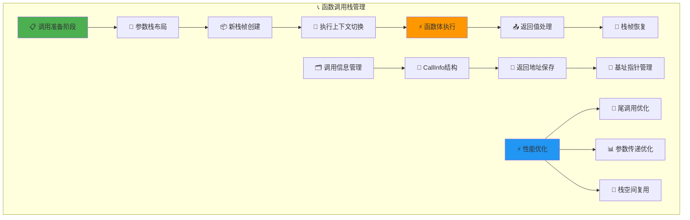

#### 📊 CallInfo结构详解
```c
/* 函数调用信息的完整数据结构 */
typedef struct CallInfo {
  StkId base;              /* 🎯 函数的基址指针 */
  StkId func;              /* 📞 函数对象在栈中的位置 */
  StkId top;               /* 📊 函数可用栈空间的顶部 */
  const Instruction *savedpc;  /* 💾 保存的程序计数器 */
  int nresults;            /* 📋 期望的返回值数量 */
  int tailcalls;           /* 🔄 尾调用计数器 */
} CallInfo;

/* 调用栈的动态管理 */
typedef struct lua_State {
  /* ... 其他字段 ... */
  StkId top;               /* 📊 当前栈顶 */
  StkId base;              /* 🎯 当前函数基址 */
  CallInfo *ci;            /* 📋 当前调用信息 */
  CallInfo *end_ci;        /* 🔚 调用栈结束位置 */
  CallInfo base_ci[LUAI_MAXCALLS];  /* 📦 调用信息数组 */
  /* ... */
} lua_State;
```

### 🔧 `print("Hello, World")`的完整调用过程

#### 📋 调用预处理阶段
```c
/* 函数调用的预处理：luaD_precall */
int luaD_precall (lua_State *L, StkId func, int nresults) {
  /*
  函数调用预处理的关键步骤：
  
  1. 🔍 识别函数类型（Lua函数 vs C函数）
  2. 📊 验证参数数量和类型
  3. 🎯 设置新的执行环境
  4. 💾 保存当前执行状态
  */
  
  LClosure *cl;
  ptrdiff_t funcr;
  
  if (!ttisfunction(func))  /* 🚨 非函数对象错误 */
    func = tryfuncTM(L, func);  /* 尝试 __call 元方法 */
  
  funcr = savestack(L, func);  /* 💾 保存函数位置 */
  cl = &clvalue(func)->l;
  
  /* 📊 检查栈空间是否足够 */
  if (!cl->isC) {  /* 🎯 Lua函数调用 */
    CallInfo *ci;
    StkId st, base;
    Proto *p = cl->p;
    
    /* 📏 参数数量检查和调整 */
    luaD_checkstack(L, p->maxstacksize);
    func = restorestack(L, funcr);
    
    if (!p->is_vararg) {  /* 🎯 固定参数函数 */
      for (st = L->top; st < func + 1 + p->numparams; st++)
        setnilvalue(st);  /* 🔘 缺失参数补nil */
      L->top = func + 1 + p->numparams;
    }
    else {  /* 📋 可变参数函数 */
      int nargs = cast_int(L->top - func) - 1;  /* 🔢 实际参数数量 */
      base = adjust_varargs(L, p, nargs);  /* 🔧 调整可变参数 */
      func = restorestack(L, funcr);  /* 🔄 恢复函数位置 */
    }
    
    /* 📦 创建新的调用信息 */
    ci = ++L->ci;  /* 🔝 推进调用栈 */
    L->base = (ci-1)->top = base;  /* 🎯 设置基址 */
    ci->func = func;
    ci->base = base;
    ci->top = base + p->maxstacksize;  /* 📊 设置栈顶 */
    lua_assert(ci->top <= L->stack_last);
    L->savedpc = p->code;  /* 💾 设置程序计数器 */
    ci->savedpc = p->code;
    ci->tailcalls = 0;
    ci->nresults = nresults;  /* 📋 期望返回值数量 */
    
    /* 🔘 初始化局部变量为nil */
    for (st = L->top; st < ci->top; st++)
      setnilvalue(st);
    L->top = ci->top;
    
    return PCRLUA;  /* 🎯 返回Lua函数调用标志 */
  }
  else {  /* 📞 C函数调用 */
    CallInfo *ci;
    int n;
    
    /* 📦 C函数调用信息设置 */
    luaD_checkstack(L, LUA_MINSTACK);
    ci = ++L->ci;
    L->base = (ci-1)->top = func + 1;
    ci->func = func;
    ci->base = func + 1;
    ci->top = L->top + LUA_MINSTACK;
    lua_assert(ci->top <= L->stack_last);
    ci->nresults = nresults;
    ci->tailcalls = 0;
    
    /* 📞 执行C函数 */
    n = (*clvalue(func)->c.f)(L);  /* 🔧 调用C函数指针 */
    
    /* 📤 处理C函数返回值 */
    if (n < 0)  /* 🔄 让步标志 */
      return PCRYIELD;
    else {
      luaD_poscall(L, L->top - n);  /* 📋 处理返回值 */
      return PCRJ;  /* 📞 C函数调用完成 */
    }
  }
}
```

#### 📤 函数返回处理
```c
/* 函数返回的后处理：luaD_poscall */
int luaD_poscall (lua_State *L, StkId firstResult) {
  /*
  函数返回处理的核心任务：
  
  1. 📋 整理返回值到正确位置
  2. 🔄 恢复调用者的执行状态
  3. 📊 调整栈顶指针
  4. 🎯 返回调用结果
  */
  
  StkId res;
  int wanted, i;
  CallInfo *ci;
  
  ci = L->ci--;  /* 🔙 弹出调用信息 */
  res = ci->func;  /* 🎯 返回值存储位置 */
  wanted = ci->nresults;  /* 📋 期望返回值数量 */
  L->base = (ci-1)->base;  /* 🔄 恢复基址指针 */
  L->savedpc = (ci-1)->savedpc;  /* 💾 恢复程序计数器 */
  
  /* 📋 移动返回值到正确位置 */
  for (i = wanted; i != 0 && firstResult < L->top; i--)
    setobjs2s(L, res++, firstResult++);  /* 📊 复制返回值 */
  
  while (i-- > 0)
    setnilvalue(res++);  /* 🔘 多余位置填nil */
  
  L->top = res;  /* 📊 调整栈顶 */
  return (wanted - LUA_MULTRET);  /* 🔢 返回实际返回值数量 */
}
```

### ⚡ 性能优化：尾调用处理

#### 🔄 尾调用优化的核心机制
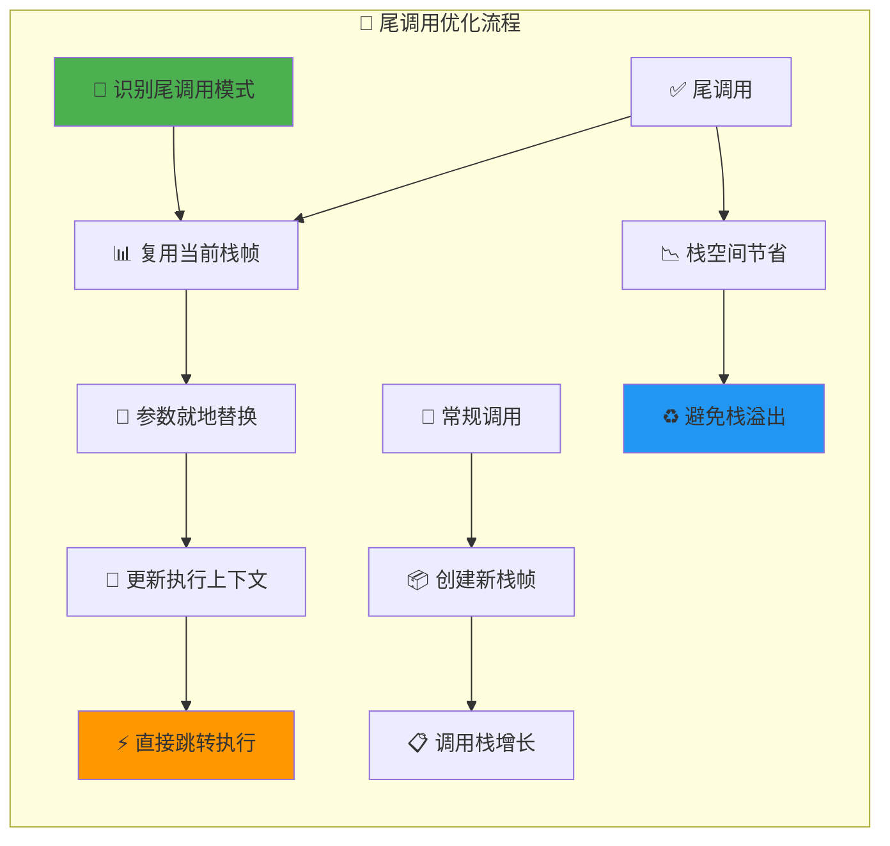

```c
/* 尾调用优化的实现 */
case OP_TAILCALL: {
  /*
  尾调用优化的关键策略：
  
  1. 🔄 复用当前函数的栈帧
  2. 📊 避免调用栈无限增长  
  3. ⚡ 减少函数调用开销
  4. 🎯 支持真正的尾递归
  */
  
  int b = GETARG_B(i);  /* 🔢 参数数量 */
  if (b != 0) L->top = ra+b;  /* 📊 调整栈顶 */
  
  lua_assert(GETARG_C(i) - 1 == LUA_MULTRET);
  if (luaD_precall(L, ra, LUA_MULTRET) == PCRLUA) {  /* 🎯 Lua函数？ */
    /* 🔄 尾调用优化：复用栈帧 */
    CallInfo *ci = L->ci - 1;  /* 🔙 获取调用者信息 */
    CallInfo *lim = L->ci;     /* 📊 当前调用信息 */
    StkId tb = ci->top;        /* 🎯 调用者栈顶 */
    
    /* 📋 移动参数到调用者栈帧 */
    while (lim->base < L->top)
      setobjs2s(L, tb++, lim->base++);
    
    ci->top = tb;              /* 📊 更新调用者栈顶 */
    lua_assert(ci->top <= L->stack_last);
    
    ci->savedpc = L->savedpc;  /* 💾 更新返回地址 */
    ci->tailcalls++;           /* 🔢 增加尾调用计数 */
    L->ci--;                   /* 🔙 弹出当前栈帧 */
    L->base = L->ci->base;     /* 🎯 恢复基址 */
    goto reentry;              /* 🔄 重新进入执行循环 */
  }
  continue;
}
```

## 🚀 高级优化技术与性能分析

### ⚡ 执行引擎的深度优化

Lua虚拟机通过多层次的优化技术实现高性能执行：

#### 🎯 指令级优化策略
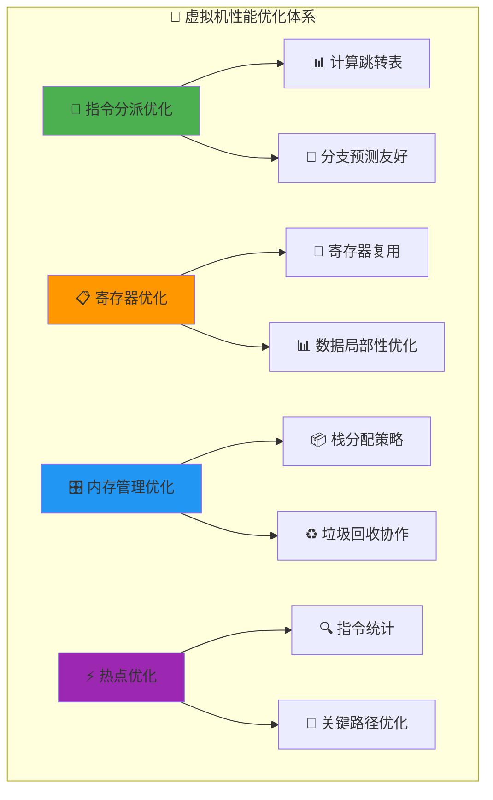

#### 🔄 计算跳转表实现
```c
/* 高效的指令分派机制 */
#ifdef LUA_USE_JUMPTABLE

/* 📊 预计算跳转表，避免运行时switch开销 */
static const void* const dispatch_table[] = {
  &&L_OP_MOVE,     &&L_OP_LOADK,    &&L_OP_LOADBOOL,
  &&L_OP_LOADNIL,  &&L_OP_GETUPVAL, &&L_OP_GETGLOBAL,
  &&L_OP_GETTABLE, &&L_OP_SETGLOBAL,&&L_OP_SETUPVAL,
  /* ... 所有操作码的标签 ... */
};

#define DISPATCH_GOTO(op) goto *dispatch_table[op]

/* 🚀 优化的执行循环 */
void luaV_execute_optimized (lua_State *L, int nexeccalls) {
  /* ... 初始化代码 ... */
  
  DISPATCH_GOTO(GET_OPCODE(*pc++));  /* 🎯 首次分派 */

L_OP_MOVE: {  /* 📋 寄存器移动优化 */
  /*
  寄存器移动的微优化：
  1. 🎯 避免不必要的类型检查
  2. 📊 利用内存对齐优化复制
  3. 🔄 批量移动检测
  */
  setobjs2s(L, ra, RB(i));
  DISPATCH_GOTO(GET_OPCODE(*pc++));  /* 🔄 直接跳转到下一指令 */
}

L_OP_LOADK: {  /* 📊 常量加载优化 */
  /*
  常量加载的性能优化：
  1. 🎯 常量表缓存预取
  2. 📊 减少间接寻址
  3. 🔄 批量常量加载
  */
  TValue *k_val = KBx(i);
  setobj2s(L, ra, k_val);  /* 🚀 直接复制，避免函数调用 */
  DISPATCH_GOTO(GET_OPCODE(*pc++));
}

  /* ... 其他优化指令实现 ... */
}

#endif /* LUA_USE_JUMPTABLE */
```

#### 📊 内存访问优化
```c
/* 寄存器访问的缓存优化策略 */
static inline void optimized_setobj(TValue *obj1, const TValue *obj2) {
  /*
  内存复制的多级优化：
  
  1. 🎯 利用CPU缓存行对齐
  2. 📊 减少内存屏障指令
  3. 🔄 向量化数据移动
  4. ⚡ 预取下次访问数据
  */
  
  /* 🚀 使用编译器内建函数优化 */
  #ifdef LUA_USE_BUILTIN_MEMCPY
    __builtin_memcpy(obj1, obj2, sizeof(TValue));
  #else
    obj1->value = obj2->value;
    obj1->tt = obj2->tt;
  #endif
  
  /* 📊 可选的预取优化 */
  #ifdef LUA_USE_PREFETCH
    __builtin_prefetch(obj1 + 1, 1, 3);  /* 预取下一个TValue */
  #endif
}
```

### 🔍 性能瓶颈分析与监控

#### 📈 执行统计与分析
```c
/* 运行时性能统计结构 */
typedef struct ExecutionStats {
  /* 📊 指令执行统计 */
  unsigned long opcode_counts[NUM_OPCODES];    /* 🔢 各指令执行次数 */
  unsigned long opcode_cycles[NUM_OPCODES];    /* ⏱️ 各指令消耗周期 */
  
  /* 📋 函数调用统计 */
  unsigned long function_calls;                /* 📞 函数调用总数 */
  unsigned long c_function_calls;              /* 📞 C函数调用数 */
  unsigned long tail_calls;                    /* 🔄 尾调用次数 */
  
  /* 🎯 内存访问统计 */
  unsigned long global_accesses;               /* 🌐 全局变量访问 */
  unsigned long table_accesses;                /* 📊 表访问次数 */
  unsigned long upvalue_accesses;              /* ⬆️ 上值访问次数 */
  
  /* ⚡ 性能关键指标 */
  unsigned long cache_misses;                  /* 📉 缓存未命中 */
  unsigned long gc_triggers;                   /* ♻️ GC触发次数 */
} ExecutionStats;

/* 🔍 性能分析工具函数 */
void luaV_profile_instruction(lua_State *L, Instruction i) {
  ExecutionStats *stats = L->stats;
  OpCode op = GET_OPCODE(i);
  
  /* 📊 更新指令计数 */
  stats->opcode_counts[op]++;
  
  /* ⏱️ 高精度计时（可选） */
  #ifdef LUA_ENABLE_PROFILING
    uint64_t start_cycles = __rdtsc();  /* 🔄 读取CPU周期计数器 */
    /* 指令执行... */
    uint64_t end_cycles = __rdtsc();
    stats->opcode_cycles[op] += (end_cycles - start_cycles);
  #endif
  
  /* 🔍 热点检测 */
  if (stats->opcode_counts[op] % 1000 == 0) {
    luaV_check_hotspot(L, L->savedpc - 1);  /* 📈 检查热点代码 */
  }
}
```

#### 🎯 热点代码识别
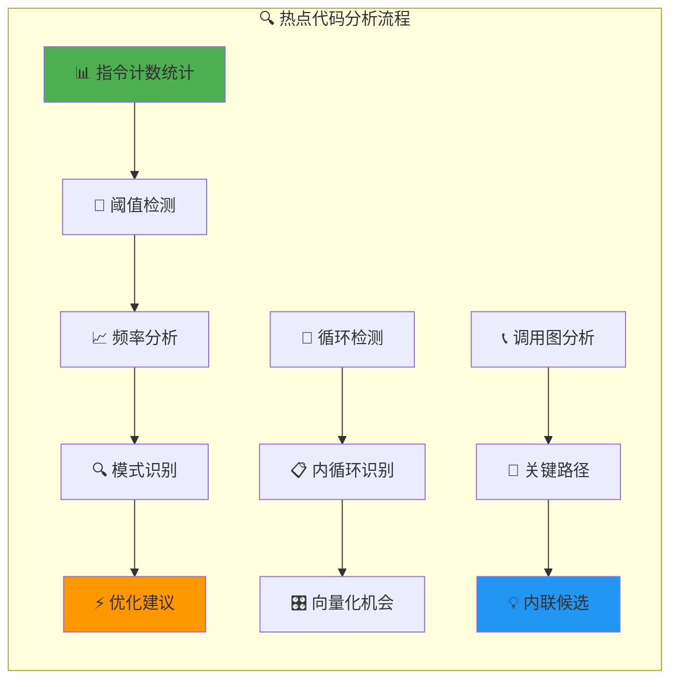

### 💡 实用性能优化指南

#### 🎯 代码编写最佳实践
```lua
-- ⚡ 性能优化的Lua编程技巧

-- 📊 1. 局部变量优化
local print = print  -- 🎯 局部化全局函数，减少查找开销
local table_insert = table.insert  -- 📋 缓存表函数

-- 🔄 2. 循环优化
local n = #array
for i = 1, n do  -- 🎯 预计算长度，避免重复调用#操作符
  process(array[i])
end

-- 📊 3. 表访问优化  
local config = {
  host = "localhost",
  port = 8080,
  timeout = 30
}
-- ✅ 好的做法：一次性访问
local host, port, timeout = config.host, config.port, config.timeout

-- ❌ 避免的做法：重复表查找
-- for i = 1, 100 do
--   connect(config.host, config.port)  -- 🐌 每次循环都查找表
-- end

-- 🔄 4. 字符串操作优化
-- ✅ 使用表连接替代字符串连接
local parts = {}
for i = 1, 1000 do
  parts[i] = "item" .. i
end
local result = table.concat(parts)  -- 🚀 高效连接

-- 📞 5. 函数调用优化
-- ✅ 减少函数调用层次
local function process_batch(items)
  local results = {}
  for i = 1, #items do
    results[i] = items[i] * 2  -- 🎯 直接计算，避免函数调用
  end
  return results
end
```

#### 🔧 虚拟机配置优化
```c
/* 虚拟机性能调优参数 */
#define LUA_OPTIMIZATION_CONFIG

#ifdef LUA_OPTIMIZATION_CONFIG
/* 📊 栈大小优化 */
#define LUAI_MAXSTACK    65536    /* 🔄 增大栈容量，减少栈扩展 */
#define LUAI_MAXCALLS    2000     /* 📞 增大调用深度限制 */

/* 🎯 寄存器优化 */
#define LUAI_MAXVARS     1000     /* 📋 增大局部变量限制 */
#define LUAI_MAXUPVALUES 255      /* ⬆️ 增大上值数量 */

/* ⚡ 内存管理优化 */
#define LUA_USE_APICHECK 0        /* 🚫 生产环境关闭API检查 */
#define LUA_USE_ASSERT   0        /* 🚫 关闭断言检查 */

/* 🔧 编译器优化提示 */
#ifdef __GNUC__
#define LUA_LIKELY(x)    __builtin_expect(!!(x), 1)    /* 🎯 分支预测 */
#define LUA_UNLIKELY(x)  __builtin_expect(!!(x), 0)    /* 🎯 分支预测 */
#define LUA_INLINE       __attribute__((always_inline)) /* 🚀 强制内联 */
#else
#define LUA_LIKELY(x)    (x)
#define LUA_UNLIKELY(x)  (x)  
#define LUA_INLINE       inline
#endif

#endif /* LUA_OPTIMIZATION_CONFIG */
```

## 🎓 学习路径与实战应用

### 📚 深入学习建议

#### 🎯 学习阶段规划
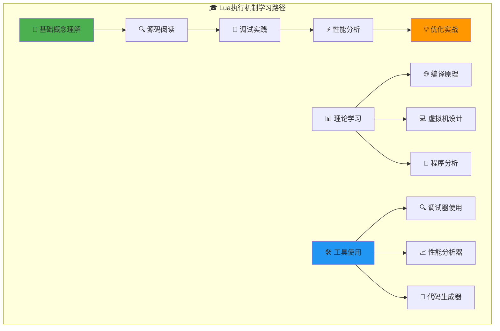

#### 🔧 调试与分析工具
```bash
# 🔍 Lua执行分析工具链

# 1. 字节码反汅编工具
luac -l script.lua                    # 📊 查看字节码
luac -l -l script.lua                 # 📋 详细字节码信息

# 2. 性能分析工具
lua -j profile script.lua             # ⏱️ LuaJIT性能分析
valgrind --tool=callgrind lua script.lua  # 🔍 调用图分析

# 3. 内存分析工具
valgrind --tool=massif lua script.lua  # 📊 内存使用分析
lua -j memprof script.lua             # 🧠 内存分析器

# 4. 自定义调试版本编译
make CFLAGS="-DLUA_USE_APICHECK -DLUA_USE_ASSERT -g -O0"  # 🔧 调试版本
```

#### 📊 实验项目建议
```lua
-- 🧪 性能测试实验项目

-- 1. 🔄 函数调用开销测试
local function test_call_overhead()
  local function empty_func() end
  local function func_with_params(a, b, c) return a + b + c end
  
  -- 测试直接调用 vs 间接调用
  local start_time = os.clock()
  for i = 1, 1000000 do
    empty_func()
  end
  local direct_time = os.clock() - start_time
  
  -- 分析结果...
end

-- 2. 📊 表访问性能测试
local function test_table_access()
  local large_table = {}
  for i = 1, 10000 do
    large_table[i] = i * 2
  end
  
  -- 顺序访问 vs 随机访问
  -- 数组访问 vs 哈希访问
  -- ...
end

-- 3. 🎯 字符串操作性能测试
local function test_string_operations()
  -- 字符串连接方法比较
  -- 模式匹配性能测试
  -- 字符串插值性能
  -- ...
end
```

### 🌟 相关文档链接

#### 📚 深度学习资源
- 🎯 **核心执行组件**
  - [📋 虚拟机状态管理](wiki_vm_state.md) - 执行状态的完整生命周期
  - [⚡ 虚拟机核心](wiki_vm.md) - 虚拟机架构与指令系统
  - [🔧 函数执行器](wiki_do.md) - dofile/dostring的执行机制

- 📊 **编译流程组件**  
  - [🔤 词法分析器](wiki_lexer.md) - Token识别与处理
  - [🌳 语法分析器](wiki_parser.md) - AST构建与语法制导翻译
  - [🔧 代码生成器](wiki_code.md) - 字节码生成与优化

- 🎛️ **运行时系统**
  - [📞 函数调用机制](wiki_call.md) - 函数调用与参数传递
  - [💾 字节码系统](wiki_bytecode.md) - 指令格式与执行模型
  - [🔧 操作码详解](wiki_opcodes.md) - 所有指令的详细说明

- ⚡ **性能与优化**
  - [♻️ 垃圾回收器](wiki_gc.md) - 内存管理与回收策略  
  - [📊 表实现](wiki_table.md) - 高效的表数据结构
  - [🧠 内存管理](wiki_memory.md) - 内存分配与优化

#### 🔗 外部参考资源
- 📖 [Lua官方文档](http://www.lua.org/docs.html) - 权威语言参考
- 🎓 [编译原理教程](https://craftinginterpreters.com/) - 解释器设计指南
- 💡 [虚拟机设计模式](https://www.lua.org/doc/jucs05.pdf) - Lua VM论文
- 🚀 [性能优化指南](https://www.lua.org/gems/) - Lua性能优化技巧

---

## 📋 总结

### 🎯 核心要点回顾

通过深入分析`print("Hello, World")`这个简单语句的完整执行过程，我们揭示了Lua执行引擎的精妙设计：

#### ⚡ 关键技术亮点
1. **🔤 词法分析**：高效的字符流处理与Token识别
2. **🌳 语法分析**：边解析边生成的语法制导翻译  
3. **🔧 代码生成**：优化的字节码生成与寄存器分配
4. **⚡ 虚拟机执行**：基于寄存器的高性能指令执行
5. **📞 函数调用**：灵活的调用栈管理与尾调用优化

#### 🎓 学习收获
- 理解了编译器前端到后端的完整流程
- 掌握了虚拟机设计的核心原理
- 学会了性能分析与优化的方法
- 获得了系统性的源码阅读能力

#### 🚀 实际应用价值
- **📊 性能优化**：针对性地优化Lua代码性能
- **🔧 工具开发**：开发Lua相关的开发工具
- **💡 语言设计**：借鉴Lua的设计思想
- **🎯 系统集成**：更好地将Lua集成到C/C++项目

这个执行流程的深入分析为我们提供了理解现代解释器设计的宝贵视角，展现了Lua作为嵌入式脚本语言的精巧设计理念。✨