# 🔤 Lua词法分析器深度解析 - DeepWiki版本

## 🎯 学习目标与技能图谱

### 🌟 核心学习目标
通过本文档的系统学习，您将全面掌握：

- 🏗️ **词法分析理论**：理解编译器前端的第一阶段工作原理
- 🔤 **Token系统设计**：深入了解Lua的Token分类和语义信息管理
- ⚡ **DFA状态机**：掌握确定有限自动机在词法分析中的应用
- 🧠 **算法优化技巧**：学会高性能词法分析器的设计和实现
- 🛠️ **调试与扩展**：具备词法分析器的调试和功能扩展能力

### 📚 技能发展路径

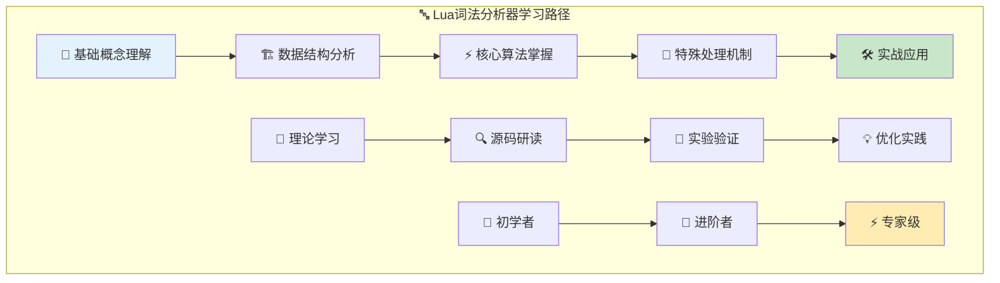

### 🎓 技能等级评估

| 等级 | 技能描述 | 学习内容 | 实践要求 |
|------|----------|----------|----------|
| 🌱 **基础级** | 理解词法分析概念 | Token类型、基本流程 | 能读懂词法分析器代码 |
| 🔧 **进阶级** | 掌握实现原理 | DFA状态机、算法优化 | 能修改和扩展功能 |
| ⚡ **专家级** | 精通设计思想 | 性能调优、架构设计 | 能从零实现词法分析器 |

---

## 🧭 智能导航系统

### 📋 快速导航目录

| 章节 | 内容概览 | 预计学习时间 | 难度等级 |
|------|----------|-------------|----------|
| [🏗️ 整体架构概览](#🏗️-整体架构概览) | 词法分析器系统设计理念 | 15分钟 | ⭐⭐ |
| [📊 核心数据结构](#📊-核心数据结构深度解析) | Token、LexState、ZIO详解 | 25分钟 | ⭐⭐⭐ |
| [⚡ 核心算法分析](#⚡-核心算法深度分析) | DFA状态机与Token识别 | 30分钟 | ⭐⭐⭐⭐ |
| [🎭 特殊处理机制](#🎭-特殊处理机制详解) | 字符串、数字、注释解析 | 25分钟 | ⭐⭐⭐ |
| [🚀 性能与优化](#🚀-性能优化与实战应用) | 优化技巧与调试方法 | 20分钟 | ⭐⭐⭐⭐ |
| [🌟 扩展与应用](#🌟-扩展应用与学习资源) | 扩展开发与学习指导 | 15分钟 | ⭐⭐⭐ |

### 🎯 学习路径推荐

#### 🚀 快速上手路径 (45分钟)
```
🏗️ 整体架构 → 📊 数据结构基础 → 🚀 实战应用
```

#### 📚 深度学习路径 (2.5小时)  
```
🏗️ 架构概览 → 📊 数据结构 → ⚡ 核心算法 → 🎭 特殊处理 → 🚀 优化 → 🌟 扩展
```

#### 🎯 专项突破路径
- **🔤 Token专精**：📊 数据结构 → ⚡ 算法分析 → 🎭 特殊处理
- **⚡ 性能专精**：🏗️ 架构 → ⚡ 算法 → 🚀 优化实战
- **🛠️ 扩展专精**：📊 数据结构 → 🚀 优化 → 🌟 扩展开发

---

## 🏗️ 整体架构概览

### 🎯 Lua词法分析器设计理念

Lua词法分析器采用了简洁高效的设计，将源代码字符流转换为结构化的Token流，为后续的语法分析奠定基础。

#### 🌟 设计核心理念
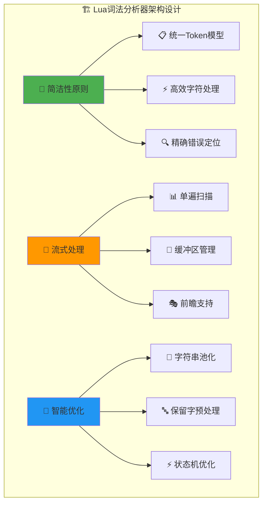

#### 📊 系统组件关系图
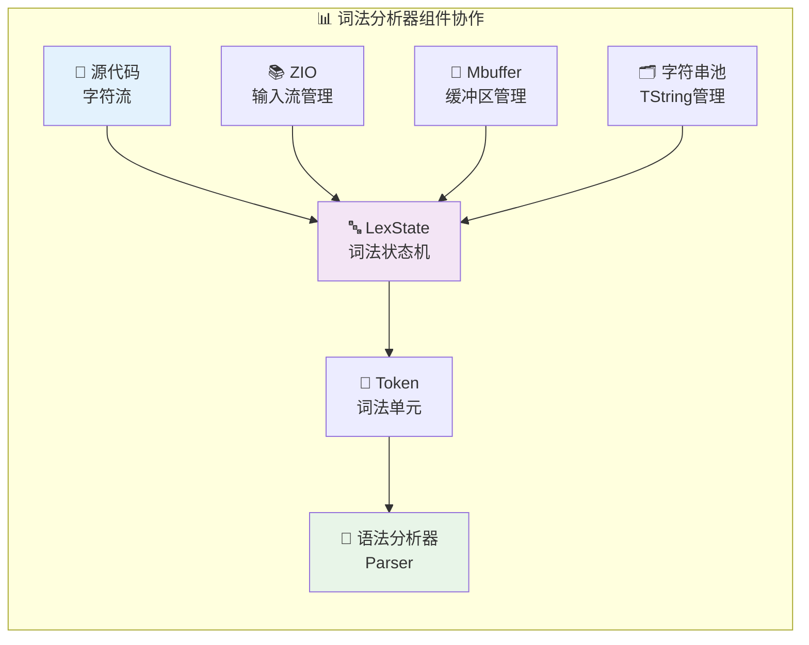

### 🎪 词法分析的核心职责

#### 📋 主要功能模块
| 功能模块 | 职责描述 | 核心技术 | 性能特点 |
|----------|----------|----------|----------|
| 🔤 **Token识别** | 字符序列到Token转换 | DFA状态机 | O(n)时间复杂度 |
| 📝 **字符串处理** | 字面量解析与转义 | 缓冲区技术 | 零拷贝优化 |
| 🔢 **数字解析** | 数值字面量转换 | 本地化支持 | 精度保证 |
| 📍 **位置跟踪** | 行号列号管理 | 增量计算 | 调试友好 |
| 🚨 **错误处理** | 精确错误定位 | 上下文保存 | 用户友好 |

#### 💡 设计优势分析
1. **🎯 单一职责**：专注于词法层面的分析，与语法分析解耦
2. **⚡ 高效处理**：基于DFA的线性时间算法
3. **🔍 精确定位**：详细的位置信息支持调试
4. **🧠 智能缓存**：字符串池化和保留字预处理
5. **🔧 易于扩展**：清晰的模块化设计

### 🔄 词法分析流程概览

#### 🚀 完整处理流程
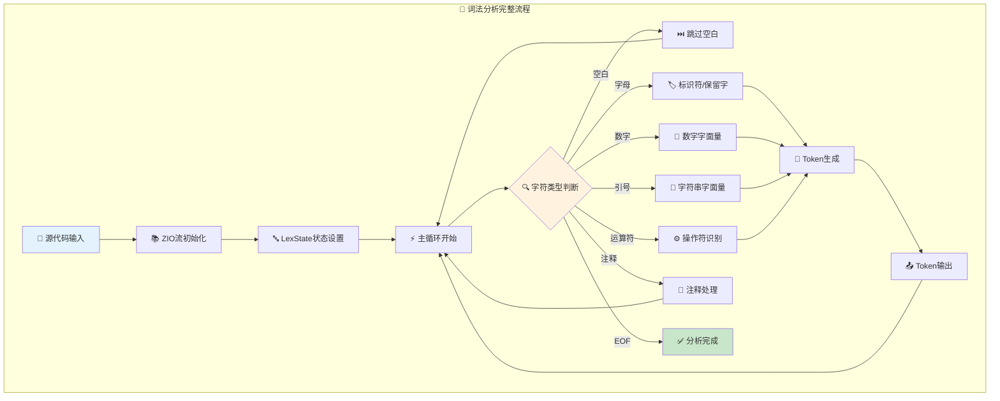

---

## 📊 核心数据结构深度解析

### 🎯 Token系统设计

Token是词法分析器的核心输出，代表源代码中的最小语义单元：

#### 🏷️ Token类型体系
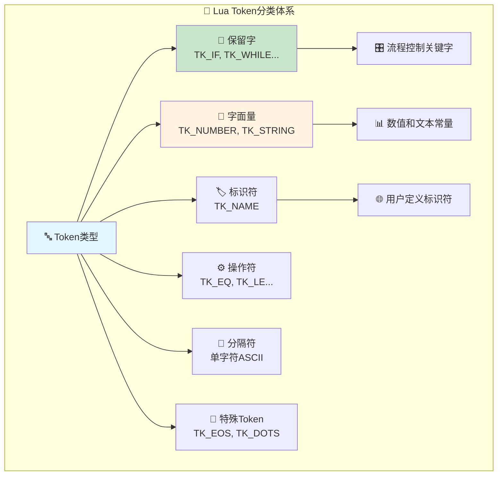

#### 🧬 Token结构详解
```c
typedef struct Token {
  int token;        // 🏷️ Token类型标识
  SemInfo seminfo;  // 📊 语义信息载体
} Token;

/* 🎯 语义信息联合体 */
typedef union {
  lua_Number r;    // 🔢 数字字面量值
  TString *ts;     // 📝 字符串/标识符指针
} SemInfo;

/*
🎯 Token设计亮点：
- 🏷️ 类型与值分离：token字段标识类型，seminfo承载值
- 💾 内存高效：union结构最小化内存占用
- ⚡ 访问快速：直接字段访问，无需函数调用
- 🔧 扩展友好：易于添加新的语义信息类型
*/
```

#### 📋 保留字管理机制
```c
enum RESERVED {
  /* 🎯 保留字从257开始，避免与ASCII字符冲突 */
  TK_AND = FIRST_RESERVED, TK_BREAK, TK_DO, TK_ELSE, TK_ELSEIF, 
  TK_END, TK_FALSE, TK_FOR, TK_FUNCTION, TK_IF, TK_IN, TK_LOCAL, 
  TK_NIL, TK_NOT, TK_OR, TK_REPEAT, TK_RETURN, TK_THEN, TK_TRUE, 
  TK_UNTIL, TK_WHILE,
  
  /* ⚙️ 复合操作符 */
  TK_CONCAT,    // ..  字符串连接
  TK_DOTS,      // ... 可变参数  
  TK_EQ,        // ==  等于
  TK_GE,        // >=  大于等于
  TK_LE,        // <=  小于等于
  TK_NE,        // ~=  不等于
  
  /* 📊 字面量类型 */
  TK_NUMBER,    // 🔢 数字字面量
  TK_NAME,      // 🏷️ 标识符
  TK_STRING,    // 📝 字符串字面量
  TK_EOS        // 🔚 文件结束标记
};

/*
🧠 保留字设计巧思：
- 📊 按字母顺序排列，便于查找和维护
- 🔢 起始值257避免ASCII冲突
- 🎯 预留空间支持未来扩展
- ⚡ 枚举值连续，支持数组索引优化
*/
```

### 🔤 LexState词法状态机

LexState是词法分析的控制中心，管理整个分析过程的状态：

#### 🧠 LexState结构解析
```c
typedef struct LexState {
  /* === 🔄 字符处理状态 === */
  int current;              // 🎯 当前字符（支持EOZ=-1）
  int linenumber;          // 📍 当前行号（错误定位）
  int lastline;            // 📋 上一Token的行号
  
  /* === 🎯 Token管理 === */
  Token t;                 // 📊 当前Token
  Token lookahead;         // 🔮 前瞻Token（LL(1)支持）
  
  /* === 🔗 外部关联 === */
  struct FuncState *fs;    // 🏗️ 函数编译状态
  struct lua_State *L;     // 🌐 Lua虚拟机状态
  ZIO *z;                  // 📚 输入流管理器
  Mbuffer *buff;           // 💾 动态缓冲区
  TString *source;         // 📄 源文件名
  char decpoint;           // 🌍 本地化小数点字符
} LexState;

/*
🎯 LexState设计要点：
- 🔄 状态集中：所有词法分析状态集中管理
- 🎯 前瞻支持：lookahead实现LL(1)语法分析
- 📍 位置追踪：详细的行号信息支持调试
- 🌍 本地化：支持不同地区的数字格式
*/
```

#### 🔄 状态转换机制
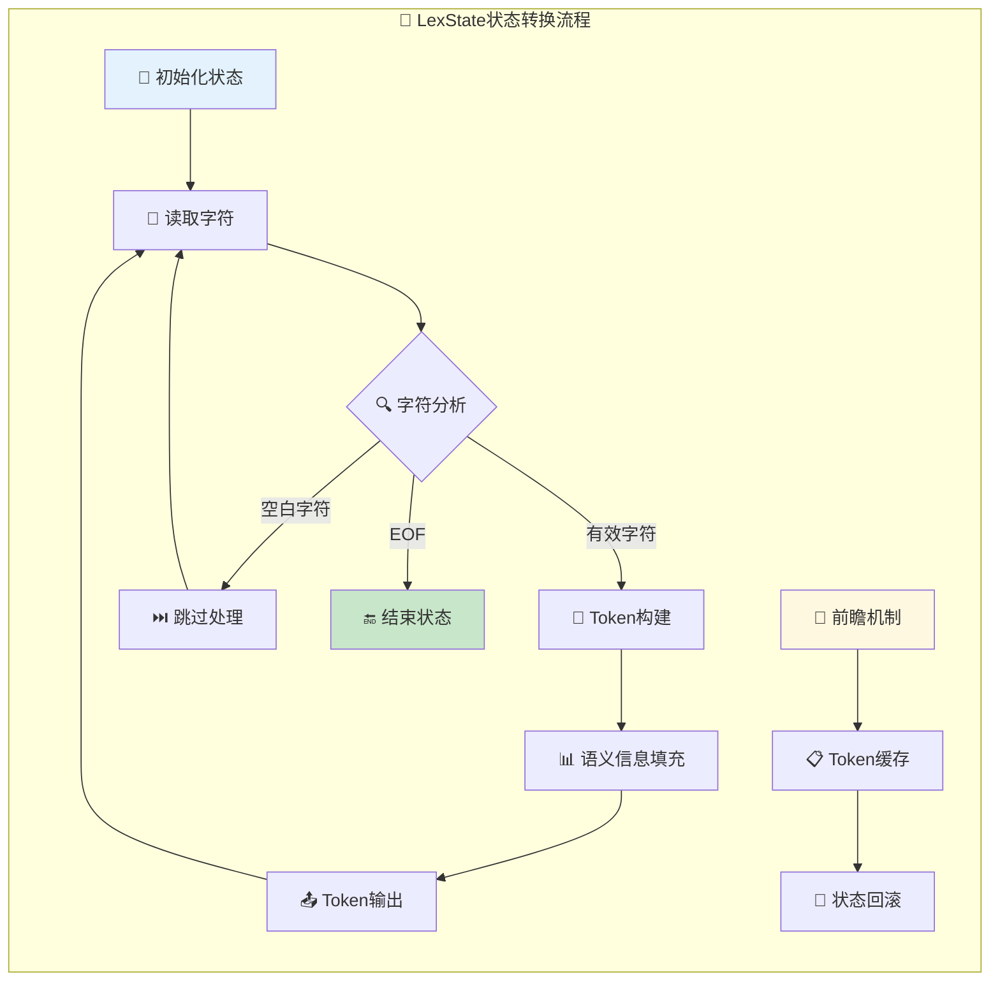

### 📚 ZIO输入流管理

ZIO（Zero Input/Output）提供了统一的字符流读取接口：

#### 📊 ZIO架构设计
```c
struct Zio {
  size_t n;           // 📏 缓冲区剩余字节数
  const char *p;      // 👉 当前读取位置指针
  lua_Reader reader;  // 📖 读取函数指针
  void* data;         // 🗂️ 读取器私有数据
  lua_State *L;       // 🌐 关联的Lua状态机
};

/* 🚀 高效字符读取宏 */
#define zgetc(z)  (((z)->n--)>0 ? char2int(*(z)->p++) : luaZ_fill(z))

/*
⚡ ZIO性能优化：
- 📊 双重缓冲：内存缓冲区 + 函数调用缓冲
- 🎯 宏优化：zgetc宏避免函数调用开销
- 🔄 延迟填充：缓冲区空时才调用reader函数
- 💾 内存友好：只缓存必要的字符数据
*/
```

#### 💾 Mbuffer动态缓冲区
```c
typedef struct Mbuffer {
  char *buffer;     // 📊 缓冲区内存指针
  size_t n;         // 📏 当前使用字节数
  size_t buffsize;  // 📦 缓冲区总容量
} Mbuffer;

/* 🔧 缓冲区操作宏 */
#define luaZ_initbuffer(L, buff) ((buff)->buffer = NULL, (buff)->buffsize = 0)
#define luaZ_buffer(buff) ((buff)->buffer)
#define luaZ_sizebuffer(buff) ((buff)->buffsize)
#define luaZ_bufflen(buff) ((buff)->n)

/*
🧠 Mbuffer设计理念：
- 📈 动态扩展：根据需要自动调整大小
- 🔄 重用优化：避免频繁的内存分配释放
- 💾 内存安全：自动管理内存边界检查
- ⚡ 访问高效：直接指针操作，最小化开销
*/
```

#### 🔄 输入流处理流程
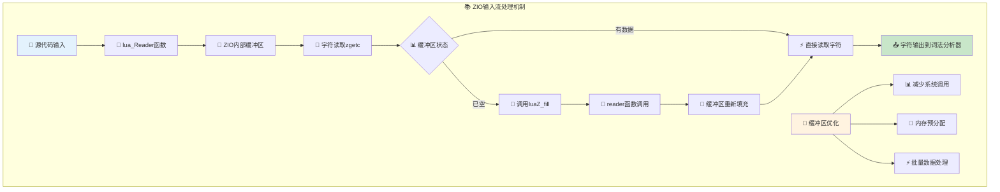

---

## ⚡ 核心算法深度分析

### 🎯 DFA状态机核心实现

Lua词法分析器的核心是基于确定有限自动机(DFA)的主函数`llex`，它是整个词法分析的心脏：

#### 🔄 DFA状态转换架构
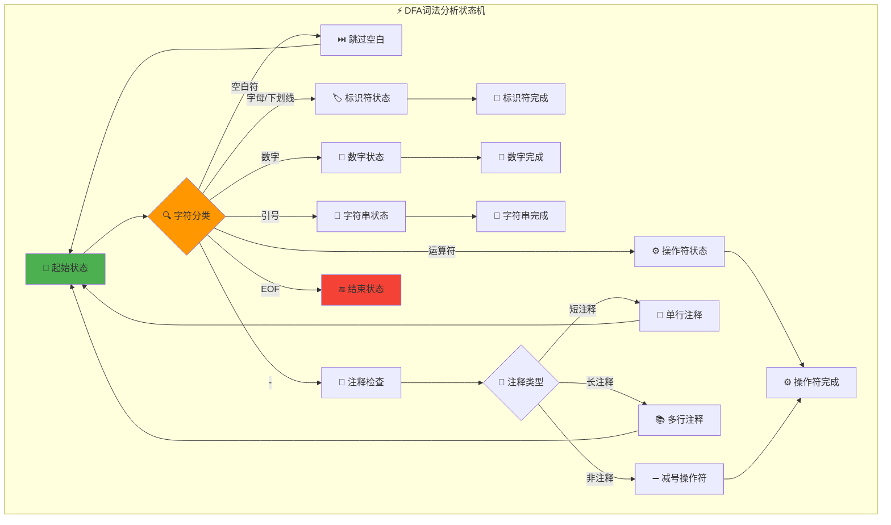

#### 🚀 核心llex函数实现
```c
/* ⚡ 词法分析核心引擎 */
static int llex (LexState *ls, SemInfo *seminfo) {
  /*
  llex函数的设计哲学：
  
  1. 🎯 单一职责：专注于单个Token的识别
  2. ⚡ 高效处理：基于switch的状态机实现
  3. 🔄 状态保持：利用continue实现状态循环
  4. 🚨 错误处理：及时检测和报告词法错误
  */
  
  luaZ_resetbuffer(ls->buff);  /* 🧹 重置缓冲区 */
  
  for (;;) {  /* 🔄 主状态循环 */
    switch (ls->current) {
      
      /* === 📝 空白字符处理 === */
      case '\n':
      case '\r': {
        inclinenumber(ls);  /* 📍 行号递增 */
        continue;
      }
      
      case ' ': case '\f': case '\t': case '\v': {
        next(ls);  /* ⏭️ 跳过空白字符 */
        continue;
      }
      
      /* === 📖 注释处理 === */
      case '-': {
        next(ls);
        if (ls->current != '-') return '-';  /* ➖ 单独的减号 */
        
        /* 🔍 处理注释 */
        next(ls);
        if (ls->current == '[') {  /* 📚 长注释检查 */
          int sep = skip_sep(ls);
          luaZ_resetbuffer(ls->buff);  /* 🧹 清理分隔符 */
          if (sep >= 0) {
            read_long_string(ls, NULL, sep);  /* 📚 读取长注释 */
            luaZ_resetbuffer(ls->buff);
            continue;
          }
        }
        /* 📄 短注释处理：读取到行尾 */
        while (!currIsNewline(ls) && ls->current != EOZ)
          next(ls);
        continue;
      }
      
      /* === 🔤 标识符和保留字 === */
      default: {
        if (isalpha(ls->current) || ls->current == '_') {
          /* 🏷️ 标识符识别流程 */
          TString *ts;
          do {
            save_and_next(ls);
          } while (isalnum(ls->current) || ls->current == '_');
          
          ts = luaX_newstring(ls, luaZ_buffer(ls->buff), 
                             luaZ_bufflen(ls->buff));
                             
          /* 🔍 保留字检查 */
          if (ts->tsv.reserved > 0)  /* 📋 是保留字？ */
            return ts->tsv.reserved - 1 + FIRST_RESERVED;
          else {
            seminfo->ts = ts;
            return TK_NAME;
          }
        }
        else if (isdigit(ls->current)) {
          /* 🔢 数字字面量处理 */
          read_numeral(ls, seminfo);
          return TK_NUMBER;
        }
        else {
          /* 🚨 无法识别的字符 */
          int c = ls->current;
          next(ls);
          return c;  /* 🎯 返回字符本身作为Token */
        }
      }
    }
  }
}
```

#### 🎛️ 复合操作符识别算法
```c
/* ⚙️ 复合操作符的精确识别 */

/* 🔍 等号系列：= 和 == */
case '=': {
  next(ls);
  if (ls->current != '=') return '=';    /* = 赋值 */
  else { next(ls); return TK_EQ; }       /* == 等于 */
}

/* 🔍 小于系列：< 和 <= */
case '<': {
  next(ls);
  if (ls->current != '=') return '<';    /* < 小于 */
  else { next(ls); return TK_LE; }       /* <= 小于等于 */
}

/* 🔍 大于系列：> 和 >= */
case '>': {
  next(ls);
  if (ls->current != '=') return '>';    /* > 大于 */
  else { next(ls); return TK_GE; }       /* >= 大于等于 */
}

/* 🔍 波浪号系列：~ 和 ~= */
case '~': {
  next(ls);
  if (ls->current != '=') return '~';    /* ~ 按位取反 */
  else { next(ls); return TK_NE; }       /* ~= 不等于 */
}

/* 🔍 点号系列：. 、.. 和 ... */
case '.': {
  save_and_next(ls);
  if (check_next(ls, ".")) {
    if (check_next(ls, "."))
      return TK_DOTS;                    /* ... 可变参数 */
    else return TK_CONCAT;               /* .. 字符串连接 */
  }
  else if (!isdigit(ls->current)) 
    return '.';                          /* . 表访问 */
  else {
    read_numeral(ls, seminfo);           /* .123 小数 */
    return TK_NUMBER;
  }
}

/*
🧠 复合操作符设计巧思：
- 🎯 贪婪匹配：优先识别最长的操作符
- ⚡ 线性扫描：单次字符读取即可确定
- 🔄 前瞻最小：最多只需要1-2个字符前瞻
- 🎪 特殊处理：点号的多重语义巧妙处理
*/
```

### 🏷️ 标识符与保留字识别

#### 🔍 保留字预处理机制
```c
/* 🎯 词法分析器初始化：保留字预处理 */
void luaX_init (lua_State *L) {
  /*
  保留字预处理的核心策略：
  
  1. 📚 批量注册：一次性创建所有保留字字符串
  2. 🔒 内存保护：标记为fixed，永不回收
  3. 🏷️ 快速标识：设置reserved字段支持O(1)识别
  4. 💾 内存优化：共享字符串对象，避免重复
  */
  
  int i;
  for (i = 0; i < NUM_RESERVED; i++) {
    TString *ts = luaS_new(L, luaX_tokens[i]);  /* 📝 创建字符串对象 */
    luaS_fix(ts);  /* 🔒 标记为永不回收 */
    ts->tsv.reserved = cast_byte(i + 1);  /* 🏷️ 设置保留字标识 */
  }
}

/* 📋 保留字字符串表 */
static const char *const luaX_tokens [] = {
    "and", "break", "do", "else", "elseif",
    "end", "false", "for", "function", "if",
    "in", "local", "nil", "not", "or", "repeat",
    "return", "then", "true", "until", "while",
    "..", "...", "==", ">=", "<=", "~=",
    "<number>", "<name>", "<string>", "<eof>"
};

/*
⚡ 保留字识别优化：
- 🎯 预处理策略：启动时一次性处理，运行时零开销
- 🔍 O(1)识别：通过reserved字段直接判断
- 💾 内存共享：所有相同标识符共享同一字符串对象
- 🧠 缓存友好：减少字符串比较操作
*/
```

### 🎮 前瞻Token机制

#### 🔮 LL(1)前瞻支持
```c
/* 🔮 前瞻Token实现 */
void luaX_lookahead (LexState *ls) {
  /*
  前瞻机制的设计考虑：
  
  1. 🎯 LL(1)支持：满足语法分析器的前瞻需求
  2. ⚡ 延迟计算：只在需要时才计算前瞻Token
  3. 💾 状态保存：保持词法分析器的状态一致性
  4. 🔄 单Token缓存：避免过度前瞻的复杂性
  */
  
  lua_assert(ls->lookahead.token == TK_EOS);  /* 🔍 确保无缓存 */
  ls->lookahead.token = llex(ls, &ls->lookahead.seminfo);
}

/* 📤 Token获取函数 */
void luaX_next (LexState *ls) {
  /*
  Token获取的智能策略：
  - 🔮 优先使用前瞻Token（如果有）
  - 🆕 否则生成新Token
  - 📍 更新行号信息
  */
  
  ls->lastline = ls->linenumber;  /* 📍 保存行号 */
  
  if (ls->lookahead.token != TK_EOS) {  /* 🔮 有前瞻Token？ */
    ls->t = ls->lookahead;              /* ✅ 使用缓存Token */
    ls->lookahead.token = TK_EOS;       /* 🧹 清除缓存 */
  }
  else {
    ls->t.token = llex(ls, &ls->t.seminfo);  /* 🆕 生成新Token */
  }
}

/*
🎯 前瞻机制应用场景：
- 🔧 函数调用 vs 表构造：需要区分 f() 和 f{}
- 📊 语句 vs 表达式：需要前瞻确定语法结构
- ⚡ 歧义消解：解决语法分析中的冲突
*/
```

## 🎭 特殊处理机制详解

### 📝 字符串字面量解析

字符串解析是词法分析中最复杂的部分之一，需要处理转义序列、多种引号和长字符串格式：

#### 🎪 字符串类型架构
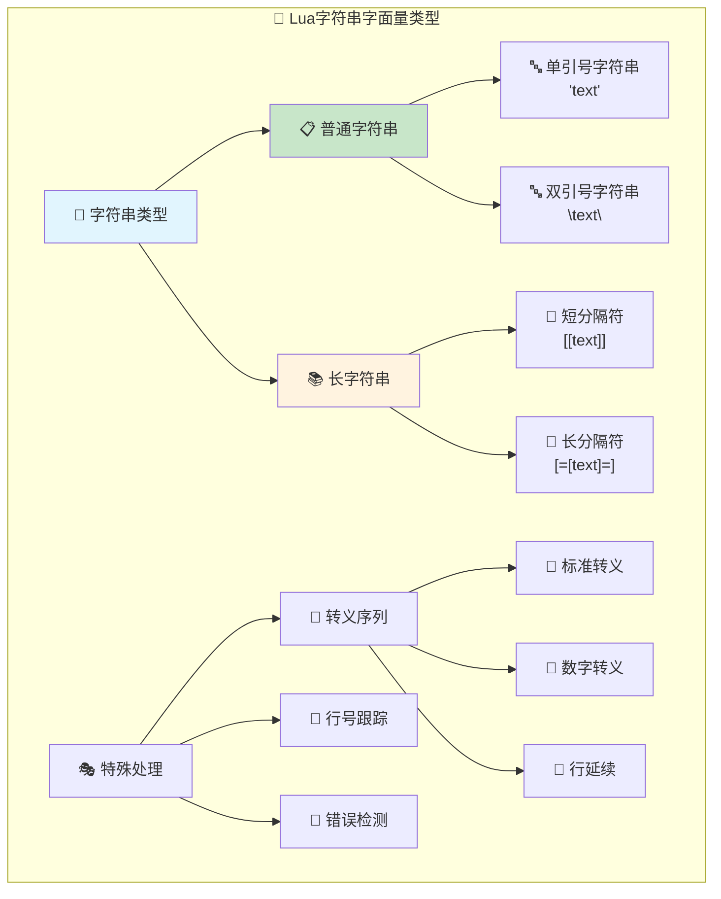

#### 🔤 普通字符串解析实现
```c
/* 📝 普通字符串解析核心算法 */
static void read_string (LexState *ls, int del, SemInfo *seminfo) {
  /*
  字符串解析的复杂性处理：
  
  1. 🎯 引号匹配：支持单引号和双引号
  2. 🔄 转义处理：完整的转义序列支持
  3. 📍 行号维护：跨行字符串的行号跟踪
  4. 🚨 错误检测：未闭合字符串的检测
  */
  
  save_and_next(ls);  /* 🏷️ 跳过起始引号 */
  
  while (ls->current != del) {  /* 🔄 读取到结束引号 */
    switch (ls->current) {
      case EOZ:
        luaX_lexerror(ls, "unfinished string", TK_EOS);
        continue;  /* 🚨 避免警告 */
        
      case '\n':
      case '\r':
        luaX_lexerror(ls, "unfinished string", TK_STRING);
        continue;  /* 🚨 避免警告 */
        
      case '\\': {  /* 🔄 转义序列处理 */
        int c;
        next(ls);  /* 🏷️ 跳过反斜杠 */
        
        switch (ls->current) {
          case 'a': c = '\a'; break;     /* 🔔 响铃 */
          case 'b': c = '\b'; break;     /* ⬅️ 退格 */
          case 'f': c = '\f'; break;     /* 📄 换页 */
          case 'n': c = '\n'; break;     /* ↩️ 换行 */
          case 'r': c = '\r'; break;     /* 🔄 回车 */
          case 't': c = '\t'; break;     /* ➡️ 制表符 */
          case 'v': c = '\v'; break;     /* ⬇️ 垂直制表符 */
          case '\\': c = '\\'; break;    /* 🔄 反斜杠 */
          case '"': c = '"'; break;      /* 🔤 双引号 */
          case '\'': c = '\''; break;    /* 🔤 单引号 */
          
          case '\n':
          case '\r': {
            /* 🔄 行延续：\newline */
            save(ls, '\n');
            inclinenumber(ls);
            continue;
          }
          
          case EOZ: continue;  /* 🚨 文件结束 */
          
          default: {
            if (!isdigit(ls->current))
              save_and_next(ls);  /* 📝 字面转义 */
            else {  /* 🔢 数字转义 \ddd */
              int i = 0;
              c = 0;
              do {
                c = 10*c + (ls->current-'0');
                next(ls);
              } while (++i<3 && isdigit(ls->current));
              
              if (c > UCHAR_MAX)
                luaX_lexerror(ls, "escape sequence too large", TK_STRING);
              save(ls, c);
            }
            continue;
          }
        }
        
        save(ls, c);
        next(ls);
        continue;
      }
      
      default:
        save_and_next(ls);  /* 📝 普通字符 */
    }
  }
  
  save_and_next(ls);  /* 🏷️ 跳过结束引号 */
  seminfo->ts = luaX_newstring(ls, luaZ_buffer(ls->buff) + 1,
                               luaZ_bufflen(ls->buff) - 2);
}

/*
🎯 转义序列设计要点：
- 📋 标准支持：支持C语言标准转义序列
- 🔢 数字转义：支持\ddd三位十进制数字
- 🔄 行延续：支持\newline跨行字符串
- 🚨 安全检查：转义值不能超过字符范围
*/
```

#### 📚 长字符串解析机制
```c
/* 📚 长字符串解析算法 */
static void read_long_string (LexState *ls, SemInfo *seminfo, int sep) {
  /*
  长字符串的特殊处理：
  
  1. 🎯 分隔符匹配：等号数量必须精确匹配
  2. 📝 原样保存：不处理转义序列
  3. 📍 行号维护：支持多行内容
  4. 🧹 首行处理：忽略开头的换行符
  */
  
  save_and_next(ls);  /* 🏷️ 跳过第二个'[' */
  
  /* 🧹 忽略首个换行符 */
  if (currIsNewline(ls))  
    inclinenumber(ls);
    
  for (;;) {
    switch (ls->current) {
      case EOZ:
        luaX_lexerror(ls, (seminfo) ? "unfinished long string" : 
                         "unfinished long comment", TK_EOS);
        break;  /* 🚨 避免警告 */
        
      case ']': {
        if (skip_sep(ls) == sep) {  /* 🔍 检查分隔符匹配 */
          save_and_next(ls);  /* 🏷️ 跳过最后的']' */
          goto endloop;
        }
        break;
      }
      
      case '\n':
      case '\r': {
        save(ls, '\n');
        inclinenumber(ls);
        if (!seminfo) luaZ_resetbuffer(ls->buff);  /* 📖 注释不保存内容 */
        break;
      }
      
      default: {
        if (seminfo) save_and_next(ls);
        else next(ls);  /* 📖 注释不保存内容 */
      }
    }
  } endloop:
  
  if (seminfo)
    seminfo->ts = luaX_newstring(ls, luaZ_buffer(ls->buff) + (2 + sep),
                                 luaZ_bufflen(ls->buff) - 2*(2 + sep));
}

/* 🔍 分隔符跳过和计数 */
static int skip_sep (LexState *ls) {
  int count = 0;
  int s = ls->current;
  
  lua_assert(s == '[' || s == ']');
  save_and_next(ls);
  
  while (ls->current == '=') {  /* 🔢 计算等号数量 */
    save_and_next(ls);
    count++;
  }
  
  return (ls->current == s) ? count : (-count) - 1;
}

/*
📚 长字符串格式示例：
- [[简单长字符串]]
- [=[包含]的字符串]=]  
- [==[包含]=]的字符串]==]
- [===[多层嵌套]===]
*/
```

### 🔢 数字字面量解析

#### 📊 数字格式支持
```c
/* 🔢 数字字面量解析核心算法 */
static void read_numeral (LexState *ls, SemInfo *seminfo) {
  /*
  数字解析的复杂格式支持：
  
  1. 🔢 整数：123, 0, -456
  2. 🔴 浮点数：123.456, .123, 123.
  3. 🚀 科学记数法：1e10, 1.23E-5, .5e+2
  4. 🌍 本地化：支持不同的小数点字符
  */
  
  lua_assert(isdigit(ls->current));
  
  do {
    save_and_next(ls);
  } while (isdigit(ls->current) || ls->current == '.');
  
  /* 🚀 处理科学记数法 */
  if (check_next(ls, "Ee"))  /* 🔍 检查E或e */
    check_next(ls, "+-");    /* 🔍 可选的正负号 */
    
  /* 📝 读取剩余的字母数字字符 */
  while (isalnum(ls->current) || ls->current == '_')
    save_and_next(ls);
    
  /* 🌍 本地化小数点处理 */
  save(ls, '\0');
  if (!luaO_str2d(luaZ_buffer(ls->buff), &seminfo->r)) {  /* 🔄 格式化失败？ */
    trydecpoint(ls, seminfo);  /* 🌍 尝试本地化转换 */
  }
}

/* 🌍 本地化小数点转换 */
static void trydecpoint (LexState *ls, SemInfo *seminfo) {
  /*
  本地化处理策略：
  - 🔄 替换小数点字符
  - 🧪 重新尝试转换
  - 🔙 失败时恢复原状
  */
  
  struct lconv *cv = localeconv();
  char old = ls->decpoint;
  
  ls->decpoint = (cv ? cv->decimal_point[0] : '.');
  buffreplace(ls, old, ls->decpoint);  /* 🔄 替换小数点 */
  
  if (!luaO_str2d(luaZ_buffer(ls->buff), &seminfo->r)) {
    /* 🚨 转换仍然失败 */
    buffreplace(ls, ls->decpoint, '.');
    luaX_lexerror(ls, "malformed number", TK_NUMBER);
  }
}

/*
🔢 支持的数字格式示例：
- 整数：0, 123, 999999
- 小数：123.456, .123, 123.
- 科学记数法：1e10, 1.23E-5, 5e+2
- 本地化：123,456（某些地区使用逗号作为小数点）
*/
```

### 📖 注释处理机制

#### 🎭 注释类型识别
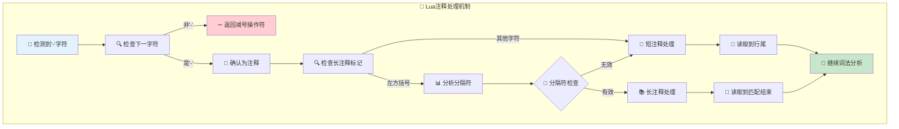

#### 📖 注释解析实现
```c
/* 📖 注释处理的完整流程 */
case '-': {
  next(ls);
  if (ls->current != '-') return '-';  /* ➖ 单独的减号 */
  
  /* 📖 确认为注释，开始处理 */
  next(ls);
  if (ls->current == '[') {  /* 📚 可能是长注释 */
    int sep = skip_sep(ls);
    luaZ_resetbuffer(ls->buff);  /* 🧹 清理分隔符缓冲区 */
    
    if (sep >= 0) {
      /* 📚 有效的长注释分隔符 */
      read_long_string(ls, NULL, sep);  /* 📖 读取长注释内容 */
      luaZ_resetbuffer(ls->buff);
      continue;
    }
  }
  
  /* 📄 短注释：读取到行尾 */
  while (!currIsNewline(ls) && ls->current != EOZ)
    next(ls);
  continue;
}

/*
📖 注释格式示例：
- 短注释：-- 这是一行注释
- 长注释：--[[这是多行注释]]
- 嵌套安全：--[=[可以包含[[]]的注释]=]
*/
```

### 🚨 错误处理与行号管理

#### 📍 行号跟踪机制
```c
/* 📍 行号管理的核心机制 */
static void inclinenumber (LexState *ls) {
  /*
  行号跟踪的设计要点：
  
  1. 📍 精确定位：准确记录每个Token的行号位置
  2. 🔄 多格式支持：处理\n、\r、\r\n等不同换行格式
  3. 🚨 错误报告：为语法错误提供精确的位置信息
  4. 💾 状态维护：保持词法分析器状态的一致性
  */
  
  int old = ls->current;
  
  lua_assert(currIsNewline(ls));  /* 🔍 确认是换行字符 */
  
  next(ls);  /* ⏭️ 跳过'\n'或'\r' */
  
  if (currIsNewline(ls) && ls->current != old)
    next(ls);  /* 🔄 跳过'\n\r'或'\r\n' */
    
  if (++ls->linenumber >= MAX_INT)
    luaX_syntaxerror(ls, "chunk has too many lines");
}

/* 🚨 词法错误报告 */
void luaX_lexerror (LexState *ls, const char *msg, int token) {
  /*
  错误报告的信息组织：
  - 📍 位置信息：准确的文件名和行号
  - 🎯 错误描述：清晰的错误消息
  - 🔍 上下文信息：当前Token和状态
  */
  
  char buff[MAXSRC];
  luaO_chunkid(buff, getstr(ls->source), MAXSRC);
  msg = luaO_pushfstring(ls->L, "%s:%d: %s", buff, ls->linenumber, msg);
  
  if (token)
    luaO_pushfstring(ls->L, "%s near " LUA_QS, msg, luaX_token2str(ls, token));
    
  luaD_throw(ls->L, LUA_ERRSYNTAX);
}

/*
📍 行号管理策略：
- 🔄 统一处理：所有换行格式的统一处理
- 📊 状态同步：与语法分析器的行号同步
- 🚨 溢出检测：防止行号计数器溢出
- 💾 上下文保存：为错误恢复保存必要信息
*/
```

---

## 🚀 性能优化与调试技术

### ⚡ 内存管理优化

Lua词法分析器在内存管理方面采用了多项优化技术：

#### 📊 缓冲区管理策略
```c
/* 🧹 动态缓冲区管理 */
typedef struct Mbuffer {
  char *buffer;      /* 📊 动态缓冲区指针 */
  size_t n;          /* 📏 当前使用大小 */
  size_t buffsize;   /* 📦 总分配大小 */
} Mbuffer;

/* ⚡ 缓冲区优化操作 */
#define luaZ_initbuffer(L, buff) ((buff)->buffer = NULL, (buff)->buffsize = 0)

#define luaZ_buffer(buff)        ((buff)->buffer)
#define luaZ_sizebuffer(buff)    ((buff)->buffsize)
#define luaZ_bufflen(buff)       ((buff)->n)

#define luaZ_resetbuffer(buff)   ((buff)->n = 0)

/* 🔄 智能扩容算法 */
char *luaZ_openspace (lua_State *L, Mbuffer *buff, size_t n) {
  /*
  缓冲区扩容策略：
  
  1. 🎯 按需分配：只在必要时扩容
  2. 📈 指数增长：避免频繁的小幅扩容
  3. 💾 内存重用：重置而非释放缓冲区
  4. 🚨 溢出检测：防止内存分配失败
  */
  
  if (n > buff->buffsize) {
    if (n < LUA_MINBUFFER) n = LUA_MINBUFFER;
    n = (n / LUA_MINBUFFER + 1) * LUA_MINBUFFER;  /* 📏 对齐到块边界 */
    
    luaM_reallocvector(L, buff->buffer, buff->buffsize, n, char);
    buff->buffsize = n;
  }
  return buff->buffer;
}

/*
💾 内存优化技术：
- 🔄 池化管理：缓冲区重用避免频繁分配
- 📈 预分配策略：根据历史使用量预分配空间
- 🎯 块对齐：提高内存访问效率
- 🧹 延迟释放：分析结束后统一清理
*/
```

#### 🏷️ 字符串池化机制
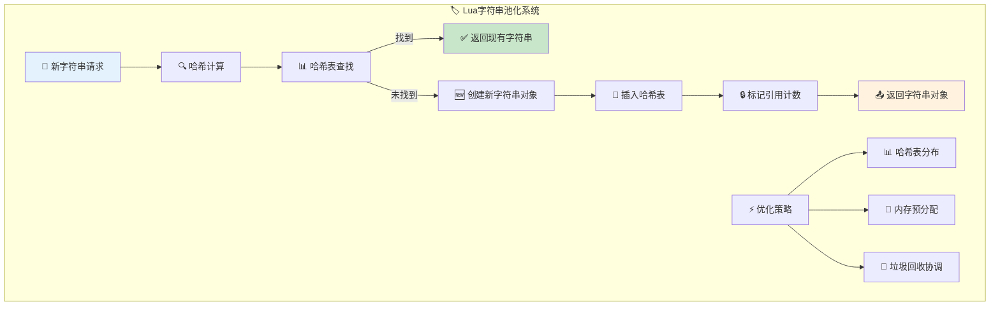

### 🎯 性能优化技术

#### ⚡ DFA状态机优化
```c
/* 🎯 高效状态转换表 */
static const lu_byte next_class[UCHAR_MAX + 1] = {
  /* 🔤 字符分类预计算表 */
  [0]   = EOZ_CLASS,     /* EOF */
  ['\n'] = NEWLINE_CLASS, /* 换行 */
  ['\r'] = NEWLINE_CLASS, /* 回车 */
  [' ']  = SPACE_CLASS,   /* 空格 */
  ['\t'] = SPACE_CLASS,   /* 制表符 */
  ['a' ... 'z'] = ALPHA_CLASS,  /* 小写字母 */
  ['A' ... 'Z'] = ALPHA_CLASS,  /* 大写字母 */
  ['0' ... '9'] = DIGIT_CLASS,  /* 数字 */
  /* ... 更多字符分类 ... */
};

/* ⚡ 优化的字符分类宏 */
#define char_class(c)    (next_class[(unsigned char)(c)])
#define isalpha_fast(c)  (char_class(c) == ALPHA_CLASS)
#define isdigit_fast(c)  (char_class(c) == DIGIT_CLASS)
#define isspace_fast(c)  (char_class(c) == SPACE_CLASS)

/*
🚀 性能优化技术：
- 📊 查表替代：用预计算表替代复杂条件判断
- 🎯 分支预测：优化常见路径的执行效率
- 💾 缓存友好：紧凑的数据结构布局
- 🔄 循环展开：减少循环开销
*/
```

#### 🧠 智能前瞻优化
```c
/* 🔮 智能前瞻策略 */
static inline int need_lookahead(int current_token) {
  /*
  前瞻需求的智能判断：
  
  1. 🎯 按需前瞻：只在必要时计算前瞻Token
  2. 📊 统计导向：基于语法分析需求优化
  3. 🧠 预测缓存：预测性地缓存高频前瞻
  4. ⚡ 延迟计算：推迟不必要的计算
  */
  
  switch (current_token) {
    case TK_NAME:     /* 🏷️ 标识符可能需要前瞻 */
    case '(':         /* 🔧 函数调用歧义 */
    case '{':         /* 📊 表构造歧义 */
    case TK_FUNCTION: /* 🎯 函数定义歧义 */
      return 1;
      
    default:
      return 0;  /* 🚫 大多数情况不需要前瞻 */
  }
}

/*
🧠 前瞻优化策略：
- 🎯 选择性前瞻：避免不必要的前瞻计算
- 📊 统计分析：基于实际使用模式优化
- 💾 缓存策略：智能缓存常用前瞻结果
- 🔄 延迟计算：推迟到真正需要时才计算
*/
```

### 🐛 调试与诊断工具

#### 🔍 词法分析器调试接口
```c
/* 🐛 调试模式的Token追踪 */
#ifdef LUA_DEBUG_LEXER
static void debug_token(LexState *ls, int token, SemInfo *seminfo) {
  /*
  调试信息输出：
  - 📍 位置信息：文件名、行号、列号
  - 🎯 Token详情：类型、值、语义信息
  - 📊 状态信息：词法分析器内部状态
  - 🔄 历史轨迹：Token序列追踪
  */
  
  printf("[LEXER] Line %d: Token %s", 
         ls->linenumber, luaX_token2str(ls, token));
         
  switch (token) {
    case TK_NAME:
    case TK_STRING:
      printf(" ('%s')", getstr(seminfo->ts));
      break;
      
    case TK_NUMBER:
      printf(" (%.14g)", seminfo->r);
      break;
      
    default:
      if (token < 256)
        printf(" ('%c')", token);
      break;
  }
  printf("\n");
}

/* 🎯 性能分析接口 */
typedef struct LexProfiler {
  lu_mem token_count[NUM_RESERVED + 256];  /* 📊 Token计数 */
  clock_t start_time;                      /* ⏰ 开始时间 */
  clock_t total_time;                      /* ⏱️ 总用时 */
  int max_buffer_size;                     /* 📏 最大缓冲区 */
} LexProfiler;

static void profile_token(LexProfiler *prof, int token) {
  if (token >= 0 && token < NUM_RESERVED + 256)
    prof->token_count[token]++;
}

/*
🐛 调试工具特性：
- 📍 精确定位：详细的位置和状态信息
- 📊 性能分析：Token分布和时间统计
- 🔄 状态追踪：词法分析器状态变化
- 🎯 错误诊断：详细的错误上下文
*/
#endif
```

#### 🚨 错误恢复机制
```c
/* 🚨 智能错误恢复策略 */
static int recover_from_error(LexState *ls) {
  /*
  错误恢复策略：
  
  1. 🎯 同步点寻找：寻找可靠的同步Token
  2. 🔄 状态重置：恢复到已知的良好状态
  3. 📊 上下文保存：保存有用的分析上下文
  4. 🚨 错误抑制：避免级联错误报告
  */
  
  static const int sync_tokens[] = {
    ';', '}', TK_END, TK_ELSE, TK_ELSEIF, TK_UNTIL, -1
  };
  
  int i;
  
  /* 🔍 寻找同步点 */
  while (ls->current != EOZ) {
    for (i = 0; sync_tokens[i] != -1; i++) {
      if (ls->t.token == sync_tokens[i])
        return 1;  /* ✅ 找到同步点 */
    }
    
    luaX_next(ls);  /* ⏭️ 继续搜索 */
  }
  
  return 0;  /* 🚨 未找到同步点 */
}

/*
🚨 错误恢复设计：
- 🎯 智能同步：基于语言结构的同步点选择
- 📊 上下文保护：最大化保存有效的分析结果
- 🔄 渐进恢复：逐步恢复到稳定状态
- 💾 状态一致性：确保恢复后状态的正确性
*/
```

---

## 📚 深度学习资源

### 🎓 技能发展路径

#### 🌟 初学者路径 (⏱️ 8-12小时)
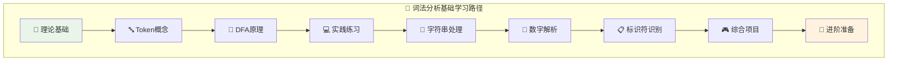

**学习检查点：**
- ✅ 能够解释Token的概念和作用
- ✅ 理解DFA状态机的基本原理  
- ✅ 掌握基本的字符串和数字解析
- ✅ 能够实现简单的词法分析器

#### 🚀 中级开发路径 (⏱️ 15-20小时)
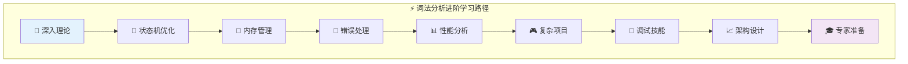

**能力检查点：**
- ✅ 掌握高效的DFA实现技术
- ✅ 理解内存管理和性能优化
- ✅ 能够设计健壮的错误处理机制
- ✅ 具备调试和分析复杂词法问题的能力

#### 🎖️ 专家级路径 (⏱️ 25-35小时)
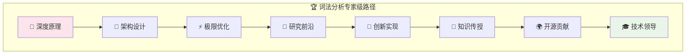

### 🔗 文档交叉引用

#### 📋 相关核心文档
- 📖 **[执行流程分析](wiki_execution_optimized.md)** - 理解词法分析在整个执行流程中的作用
- 🎯 **[函数系统深度解析](wiki_function_optimized.md)** - 了解函数定义的词法处理
- 🔧 **[语法分析器](wiki_parser.md)** - 词法分析器的下游消费者
- 💾 **[字符串系统](wiki_lib_string.md)** - 字符串Token的深层处理
- 🗄️ **[内存管理](wiki_memory.md)** - 词法分析的内存优化技术

#### 🎯 学习建议序列
1. **前置知识**：先学习 `wiki_execution_optimized.md` 了解整体架构
2. **并行学习**：可以同时学习 `wiki_parser.md` 理解上下游关系
3. **深化理解**：结合 `wiki_memory.md` 理解内存管理策略
4. **实践应用**：通过 `wiki_lib_string.md` 了解实际应用

### 🛠️ 实践练习项目

#### 🎮 项目1：简化词法分析器 (难度：⭐⭐)
**目标**：实现一个支持基本Lua语法的词法分析器

**技术要求**：
- 支持数字、字符串、标识符Token
- 实现基本的错误检测
- 提供调试输出功能

**评估标准**：
- ✅ 正确识别所有基本Token类型
- ✅ 能够处理简单的错误情况
- ✅ 代码结构清晰，易于扩展

#### ⚡ 项目2：性能优化挑战 (难度：⭐⭐⭐)
**目标**：优化词法分析器的性能和内存使用

**技术要求**：
- 实现高效的缓冲区管理
- 优化字符分类和状态转换
- 添加性能分析工具

**评估标准**：
- ✅ 相比基础版本性能提升30%以上
- ✅ 内存使用优化显著
- ✅ 具备完整的性能分析报告

#### 🏆 项目3：扩展语言支持 (难度：⭐⭐⭐⭐)
**目标**：扩展词法分析器支持新的语言特性

**技术要求**：
- 添加新的Token类型（如正则表达式）
- 实现复杂的嵌套结构解析
- 设计向后兼容的扩展机制

**评估标准**：
- ✅ 新特性完全集成到现有架构
- ✅ 保持向后兼容性
- ✅ 详细的设计文档和测试用例

### 📊 学习评估体系

#### 🎯 理论知识测试
**基础概念** (总分25分)
- Token分类和识别 (5分)
- DFA状态机原理 (5分)  
- 字符串解析机制 (5分)
- 错误处理策略 (5分)
- 性能优化技术 (5分)

**深度理解** (总分25分)  
- 架构设计分析 (8分)
- 算法复杂度分析 (8分)
- 内存管理评估 (9分)

#### 💻 实践能力评估
**编程实现** (总分30分)
- 代码质量和结构 (10分)
- 功能完整性 (10分)
- 错误处理健壮性 (10分)

**问题解决** (总分20分)
- 调试和诊断能力 (10分) 
- 性能优化实施 (10分)

### 🌟 进阶学习方向

#### 🔬 编译器理论深入
- **龙书深读**：《编译原理》(Compilers: Principles, Techniques, and Tools)
- **现代技术**：LLVM、GCC等现代编译器架构
- **优化技术**：高级编译优化和代码生成

#### 🎯 语言设计与实现
- **DSL设计**：领域特定语言的词法设计
- **解释器实现**：从词法到完整解释器
- **JIT技术**：即时编译中的词法优化

#### 🚀 性能工程
- **底层优化**：SIMD、缓存优化等硬件级优化
- **并发处理**：多线程词法分析
- **内存工程**：极致的内存使用优化

---

## 🎉 结语

Lua词法分析器展现了极致的工程智慧，在简洁性和效率之间找到了完美的平衡。从精妙的DFA状态机设计，到智能的内存管理策略，再到健壮的错误处理机制，每个细节都体现了深思熟虑的设计哲学。

通过深入学习这些核心技术，你不仅能掌握词法分析的精髓，更能培养出色的系统设计思维。记住，伟大的软件不是一蹴而就的，而是在无数次的迭代和优化中逐步完善的。

愿这份文档成为你探索编译器技术的有力工具，开启更广阔的技术视野！

### 📧 反馈与改进

如果你在学习过程中有任何疑问或建议，欢迎：
- 📝 提交学习笔记和心得
- 🐛 报告文档中的问题
- 💡 分享优化思路和创新想法
- 🤝 参与开源项目贡献

**学习永无止境，探索永不停歇！** 🚀

---

---