# 📚 Lua基础库深度解析 - DeepWiki版本

## 🎯 学习目标与技能图谱

### 🌟 核心学习目标
通过本文档的系统学习，您将全面掌握：

- 🏗️ **基础库设计理念**：理解Lua核心功能的整体架构和设计思想
- 🔧 **核心函数实现**：深入掌握类型转换、错误处理、输出调试等关键函数
- 🎯 **元编程机制**：精通元表操作、环境管理、原始操作等高级特性
- ⚡ **性能优化技巧**：学会垃圾回收控制和性能调优方法
- 🛠️ **实战应用能力**：具备在实际项目中灵活运用基础库的能力

### 📚 技能发展路径

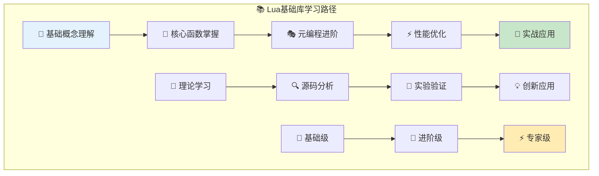

### 🎓 技能等级评估

| 等级 | 技能描述 | 学习内容 | 实践要求 |
|------|----------|----------|----------|
| 🌱 **基础级** | 熟悉基础库函数用法 | 常用函数、基本概念 | 能正确使用基础库函数 |
| 🔧 **进阶级** | 理解函数实现原理 | 内部机制、设计思想 | 能分析和扩展功能 |
| ⚡ **专家级** | 精通元编程和优化 | 高级特性、性能调优 | 能设计复杂的元编程系统 |

---

## 🧭 智能导航系统

### 📋 快速导航目录

| 章节 | 内容概览 | 预计学习时间 | 难度等级 |
|------|----------|-------------|----------|
| [🏗️ 整体架构设计](#🏗️-整体架构设计) | 基础库设计理念与组织结构 | 20分钟 | ⭐⭐ |
| [🔧 核心函数分析](#🔧-核心函数深度分析) | 类型转换、输出、错误处理函数 | 35分钟 | ⭐⭐⭐ |
| [🎭 元编程机制](#🎭-元编程机制深度解析) | 元表、环境、原始操作详解 | 40分钟 | ⭐⭐⭐⭐ |
| [⚡ 性能与优化](#⚡-性能优化与高级应用) | 垃圾回收控制与性能调优 | 25分钟 | ⭐⭐⭐⭐ |
| [🌟 实战应用](#🌟-实战应用与扩展开发) | 实际项目应用与扩展技巧 | 20分钟 | ⭐⭐⭐ |

### 🎯 学习路径推荐

#### 🚀 快速上手路径 (40分钟)
```
🏗️ 整体架构 → 🔧 核心函数基础 → 🌟 实战应用
```

#### 📚 深度学习路径 (2.5小时)  
```
🏗️ 架构设计 → 🔧 核心函数 → 🎭 元编程 → ⚡ 性能优化 → 🌟 实战应用
```

#### 🎯 专项突破路径
- **🔧 函数实现专精**：🏗️ 架构 → 🔧 核心函数 → ⚡ 性能优化
- **🎭 元编程专精**：🏗️ 架构 → 🎭 元编程 → 🌟 实战应用
- **⚡ 性能专精**：🔧 核心函数 → ⚡ 性能优化 → 🌟 实战应用

---

## 🏗️ 整体架构设计

### 🎯 Lua基础库设计理念

Lua基础库(lbaselib.c)是Lua语言的核心基础设施，它体现了Lua"简洁而强大"的设计哲学。

#### 🌟 设计核心原则
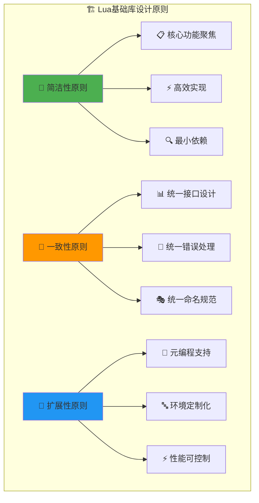

#### 📊 功能模块架构图
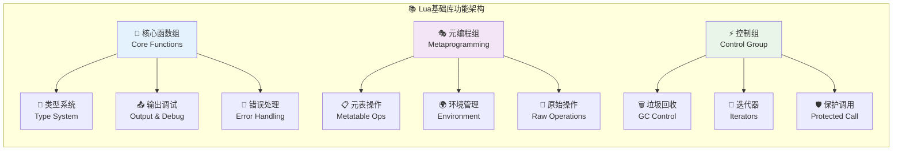

### 🎪 基础库的核心职责

#### 📋 主要功能域
| 功能域 | 核心职责 | 关键函数 | 设计特点 |
|--------|----------|----------|----------|
| 🔧 **类型操作** | 类型转换与检查 | `type`, `tonumber`, `tostring` | 类型安全，性能优先 |
| 📤 **输出调试** | 调试信息输出 | `print` | 简洁易用，格式化输出 |
| 🚨 **错误处理** | 异常处理机制 | `error`, `assert`, `pcall`, `xpcall` | 层次化错误，保护执行 |
| 🎭 **元编程** | 反射和元操作 | `getmetatable`, `setmetatable`, `rawget` | 强大灵活，安全可控 |
| 🌍 **环境控制** | 执行环境管理 | `getfenv`, `setfenv` | 动态环境，安全隔离 |
| ⚡ **性能控制** | 资源管理优化 | `collectgarbage` | 精确控制，性能可调 |

#### 💡 设计优势分析
1. **🎯 职责明确**：每个函数都有清晰定义的单一职责
2. **⚡ 性能优化**：核心路径高度优化，最小化开销
3. **🔧 易于扩展**：模块化设计支持功能扩展
4. **🛡️ 错误友好**：完善的错误处理和调试支持
5. **🎭 元编程强大**：提供丰富的反射和元操作能力

### 🔄 基础库初始化流程

#### 🚀 完整初始化过程
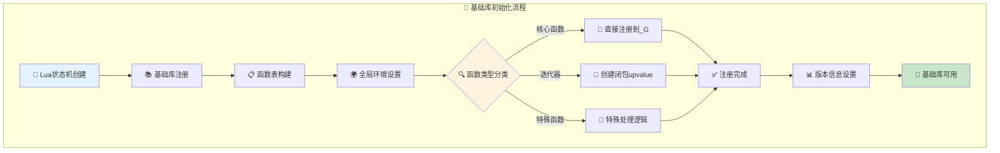

#### 🏗️ 函数注册机制详解
```c
/* 🎯 基础库函数注册表 */
static const luaL_Reg base_funcs[] = {
  /*
  注册表设计要点：
  
  1. 📋 静态表结构：编译时确定，运行时高效
  2. 🎯 函数指针映射：直接指向C函数实现
  3. 🔤 字符串键名：与Lua中的函数名保持一致
  4. 🔚 NULL终结符：标记数组结束
  */
  
  {"assert", luaB_assert},           // 🛡️ 断言检查
  {"collectgarbage", luaB_collectgarbage}, // 🗑️ 垃圾回收控制
  {"error", luaB_error},             // 🚨 错误抛出
  {"getmetatable", luaB_getmetatable}, // 📋 获取元表
  {"next", luaB_next},               // 🔁 表遍历
  {"pairs", luaB_pairs},             // 🔄 键值对迭代
  {"pcall", luaB_pcall},             // 🛡️ 保护调用
  {"print", luaB_print},             // 📤 输出打印
  {"rawget", luaB_rawget},           // 🔄 原始获取
  {"setmetatable", luaB_setmetatable}, // 📝 设置元表
  {"tonumber", luaB_tonumber},       // 🔢 数字转换
  {"tostring", luaB_tostring},       // 📝 字符串转换
  {"type", luaB_type},               // 🏷️ 类型检查
  {"xpcall", luaB_xpcall},           // 🛡️ 扩展保护调用
  {NULL, NULL}                       // 🔚 结束标记
};

/* 📚 基础库开放函数 */
LUAMOD_API int luaopen_base (lua_State *L) {
  /*
  初始化流程：
  
  1. 🌍 获取全局环境表
  2. 📋 批量注册所有函数
  3. 📊 设置版本信息
  4. ✅ 返回注册成功
  */
  
  lua_pushvalue(L, LUA_GLOBALSINDEX);      // 🌍 推入全局表
  luaL_register(L, "_G", base_funcs);      // 📋 注册函数到_G
  lua_pushliteral(L, LUA_VERSION);         // 📊 推入版本字符串
  lua_setglobal(L, "_VERSION");            // 🏷️ 设置_VERSION全局变量
  return 1;                                // ✅ 返回全局表
}

/*
🎯 初始化设计亮点：
- 📊 批量注册：一次性注册所有函数，高效简洁
- 🌍 全局可用：函数直接注册到全局环境，无需require
- 📋 版本跟踪：自动设置版本信息，便于兼容性检查
- 💾 内存友好：静态表结构，无需动态分配内存
*/
```

## 🔧 核心函数深度分析

### 🎯 函数分类体系

Lua基础库的函数可以按照功能和使用场景进行系统化分类：

#### 📊 功能分类架构
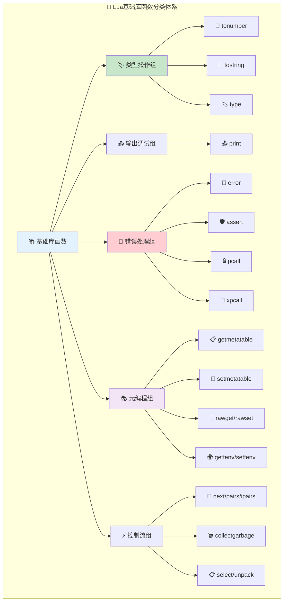

#### 🎪 使用频率与重要性分析
| 函数组 | 使用频率 | 重要等级 | 学习优先级 | 典型应用场景 |
|--------|----------|----------|------------|-------------|
| 🏷️ **类型操作** | ⭐⭐⭐⭐⭐ | 🔥 必需 | 1 | 数据验证、类型转换、调试输出 |
| 📤 **输出调试** | ⭐⭐⭐⭐⭐ | 🔥 必需 | 1 | 调试、日志记录、用户交互 |
| 🚨 **错误处理** | ⭐⭐⭐⭐ | 🔥 重要 | 2 | 异常处理、健壮性保证 |
| 🎭 **元编程** | ⭐⭐⭐ | 💡 高级 | 3 | 框架开发、DSL设计、OOP实现 |
| ⚡ **控制流** | ⭐⭐⭐ | ⚙️ 工具 | 2 | 迭代处理、性能调优、数据操作 |

### 🏷️ 类型系统核心函数

#### 🔢 tonumber函数深度解析
```c
/* 🔢 数字转换的智能实现 */
static int luaB_tonumber (lua_State *L) {
  /*
  tonumber函数设计要点：
  
  1. 🎯 多进制支持：支持2-36进制的数字转换
  2. ⚡ 性能优化：十进制快速路径，避免字符串解析
  3. 🛡️ 错误处理：转换失败返回nil，不抛出异常
  4. 🔍 严格验证：确保整个字符串都是有效数字
  */
  
  int base = luaL_optint(L, 2, 10);  // 🎯 获取进制，默认十进制
  
  if (base == 10) {  /* 🚀 十进制快速路径 */
    luaL_checkany(L, 1);
    if (lua_isnumber(L, 1)) {         // 🔍 已经是数字？
      lua_pushnumber(L, lua_tonumber(L, 1));
      return 1;
    }
  }
  else {  /* 🎲 任意进制转换 */
    const char *s1 = luaL_checkstring(L, 1);  // 📝 获取字符串
    char *s2;
    unsigned long n;
    
    luaL_argcheck(L, 2 <= base && base <= 36, 2, "base out of range");
    n = strtoul(s1, &s2, base);       // 🔄 C库转换
    
    if (s1 != s2) {  /* 📊 至少转换了一个字符？ */
      while (isspace((unsigned char)(*s2))) s2++;  // ⏭️ 跳过尾部空格
      if (*s2 == '\0') {              // 🔍 没有无效字符？
        lua_pushnumber(L, (lua_Number)n);
        return 1;
      }
    }
  }
  lua_pushnil(L);  /* 🚫 转换失败返回nil */
  return 1;
}

/*
🧠 设计智慧解析：
- 🚀 快速路径：十进制数字直接返回，避免字符串操作
- 🔍 严格验证：确保字符串完全是有效数字，不允许部分转换
- 🎯 进制灵活：支持编程中常用的各种进制（二进制、八进制、十六进制等）
- 🛡️ 错误友好：失败时返回nil而非抛出错误，便于条件判断
*/
```

#### 📝 tostring函数核心机制
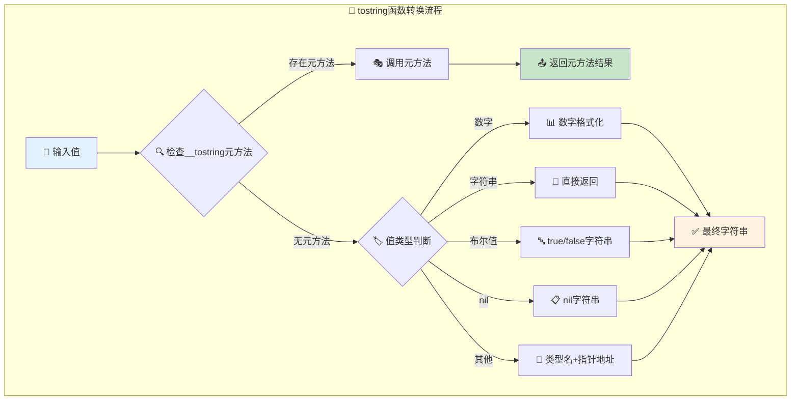

#### 🏷️ type函数的简洁哲学
```c
/* 🏷️ 类型检查的极致简洁 */
static int luaB_type (lua_State *L) {
  /*
  type函数体现了Lua的简洁哲学：
  
  1. 🎯 单一职责：只做类型检查，不做其他处理
  2. ⚡ 高效实现：直接调用内部类型检查函数
  3. 🔤 标准输出：返回标准类型名字符串
  4. 💾 零开销：无额外内存分配或复杂逻辑
  */
  
  luaL_checkany(L, 1);                    // 🔍 确保至少有一个参数
  lua_pushstring(L, luaL_typename(L, 1)); // 🏷️ 推入类型名字符串
  return 1;                               // 📤 返回一个结果
}

/*
🎯 实现亮点：
- 📏 代码极简：仅3行代码完成核心功能
- ⚡ 性能最优：直接复用VM内部的类型检查
- 🔤 标准化：返回Lua标准规定的类型名
- 🛡️ 安全检查：确保参数存在，避免栈访问错误
*/
```

### 📤 输出调试函数详解

#### 📤 print函数的精巧设计
```c
/* 📤 打印函数的全面实现 */
static int luaB_print (lua_State *L) {
  /*
  print函数设计精髓：
  
  1. 📊 多参数支持：可以同时打印任意数量的值
  2. 🔄 统一格式化：通过tostring保证输出一致性
  3. 📋 清晰分隔：使用制表符分隔多个值
  4. 🚨 错误安全：处理tostring可能的失败情况
  */
  
  int n = lua_gettop(L);                 // 📊 获取参数数量
  int i;
  lua_getglobal(L, "tostring");          // 🔧 获取tostring函数
  
  for (i=1; i<=n; i++) {
    const char *s;
    lua_pushvalue(L, -1);                // 📋 复制tostring函数
    lua_pushvalue(L, i);                 // 🎯 推入要打印的参数
    lua_call(L, 1, 1);                   // 🔄 调用tostring转换
    s = lua_tostring(L, -1);             // 📝 获取字符串结果
    
    if (s == NULL)                       // 🚨 tostring返回非字符串？
      return luaL_error(L, LUA_QL("tostring") " must return a string to "
                           LUA_QL("print"));
    
    if (i>1) fputs("\t", stdout);        // 📋 添加制表符分隔
    fputs(s, stdout);                    // 📤 输出字符串
    lua_pop(L, 1);                       // 🧹 清理栈
  }
  fputs("\n", stdout);                   // ↩️ 添加换行符
  return 0;                              // 🔚 无返回值
}

/*
🎨 设计精妙之处：
- 🔄 统一转换：所有值都通过tostring转换，确保输出一致
- 📊 批量处理：一次调用处理多个参数，提高效率
- 🎯 格式控制：制表符分隔 + 换行结束，输出格式清晰
- 🚨 健壮性：检查tostring返回值，防止异常情况
*/
```

### 🚨 错误处理机制深度分析

#### 🚨 error函数的层次化设计
```c
/* 🚨 错误抛出的智能实现 */
static int luaB_error (lua_State *L) {
  /*
  error函数的层次化错误处理：
  
  1. 📍 位置信息：自动添加错误发生的位置信息
  2. 🎚️ 级别控制：通过level参数控制错误报告级别
  3. 📝 消息处理：智能处理错误消息的格式化
  4. 🚨 异常抛出：使用VM的异常机制抛出错误
  */
  
  int level = luaL_optint(L, 2, 1);      // 🎚️ 获取错误级别，默认为1
  lua_settop(L, 1);                      // 📊 只保留错误消息
  
  if (lua_isstring(L, 1) && level > 0) { /* 📍 需要添加位置信息？ */
    luaL_where(L, level);                // 📍 获取错误位置信息
    lua_pushvalue(L, 1);                 // 📝 推入错误消息
    lua_concat(L, 2);                    // 🔗 连接位置和消息
  }
  return lua_error(L);                   // 🚨 抛出错误，永不返回
}

/*
📍 级别控制的巧妙设计：
- level = 1: 错误指向调用error的位置（默认）
- level = 2: 错误指向调用者的调用者
- level = 0: 不添加位置信息
- level > 栈深度: 指向栈底
*/
```

#### 🛡️ assert函数的简洁哲学
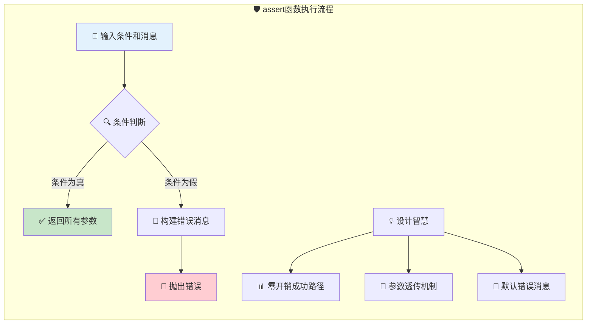

#### 🔒 保护调用机制深度解析

保护调用是Lua错误处理的核心机制，提供了安全执行代码的能力：

##### 🛡️ pcall函数实现解析
```c
/* 🔒 保护调用的核心实现 */
static int luaB_pcall (lua_State *L) {
  /*
  pcall的保护机制设计：
  
  1. 🛡️ 异常捕获：捕获被调用函数可能抛出的任何错误
  2. 📊 状态返回：第一个返回值表示执行是否成功
  3. 🔄 结果透传：成功时返回所有结果，失败时返回错误信息
  4. ⚡ 性能友好：无错误时几乎零开销
  */
  
  int status;
  luaL_checkany(L, 1);                   // 🔍 确保有被调用的函数
  status = lua_pcall(L, lua_gettop(L) - 1, LUA_MULTRET, 0);
  /*
  参数解析：
  - 参数数量: lua_gettop(L) - 1 (减去函数本身)  
  - 返回值数量: LUA_MULTRET (不限制返回值数量)
  - 错误处理函数: 0 (不使用错误处理函数)
  */
  
  lua_pushboolean(L, (status == 0));     // 📊 推入成功/失败状态
  lua_insert(L, 1);                      // 🔄 将状态插入到结果最前面
  return lua_gettop(L);                  // 📤 返回状态 + 所有结果/错误信息
}

/*
🎯 pcall返回值分析：
- 成功情况: true, result1, result2, ...
- 失败情况: false, error_message
*/
```

##### 🔧 xpcall扩展保护调用
```c
/* 🔧 带错误处理器的保护调用 */
static int luaB_xpcall (lua_State *L) {
  /*
  xpcall的增强特性：
  
  1. 🎯 自定义错误处理：可以指定错误处理函数
  2. 📊 错误信息增强：错误处理函数可以添加额外信息
  3. 🔍 调试友好：支持获取调用栈等调试信息
  4. 🛡️ 双重保护：错误处理函数本身也是保护执行的
  */
  
  int status;
  luaL_checkany(L, 2);                   // 🔍 需要函数和错误处理器
  lua_settop(L, 2);                      // 📊 只保留函数和错误处理器
  lua_insert(L, 1);                      // 🔄 将错误处理器放在函数下面
  
  /* 
  栈布局变化：
  原始: [func, error_handler]  
  调整后: [error_handler, func]
  */
  
  status = lua_pcall(L, 0, LUA_MULTRET, 1);  // 🛡️ 使用索引1的错误处理器
  lua_pushboolean(L, (status == 0));     // 📊 推入执行状态
  lua_replace(L, 1);                      // 🔄 替换错误处理器位置
  return lua_gettop(L);                   // 📤 返回所有结果
}

/*
💡 xpcall vs pcall对比：
- pcall: 简单保护，直接返回错误消息
- xpcall: 高级保护，可自定义错误消息格式和内容
- 使用场景: xpcall适合需要详细调试信息的场合
*/
```

#### 📊 错误处理机制对比分析

| 函数 | 错误检测 | 错误响应 | 返回值 | 适用场景 |
|------|----------|----------|--------|----------|
| `error` | ❌ 直接抛出 | 🚨 中断执行 | 永不返回 | 主动抛出异常 |
| `assert` | ✅ 条件检查 | 🚨 条件失败时中断 | 透传参数 | 前置条件验证 |
| `pcall` | ✅ 异常捕获 | 🛡️ 返回状态标识 | 状态+结果 | 安全函数调用 |
| `xpcall` | ✅ 异常捕获 | 🔧 自定义处理 | 状态+处理结果 | 高级错误处理 |

#### 🎯 错误处理最佳实践
```lua
-- 🛡️ 简单保护调用
local success, result = pcall(risky_function, arg1, arg2)
if success then
    print("Success:", result)
else
    print("Error:", result)  -- result是错误消息
end

-- 🔧 高级错误处理
local function error_handler(err)
    return debug.traceback("Error occurred: " .. tostring(err), 2)
end

local success, result = xpcall(risky_function, error_handler, arg1, arg2)
if not success then
    print(result)  -- 包含完整调用栈的错误信息
end

-- 🎯 断言验证
local function divide(a, b)
    assert(b ~= 0, "Division by zero")  -- 前置条件检查
    return a / b
end
```

### ⚡ 函数性能特征分析

#### 📊 核心函数性能对比
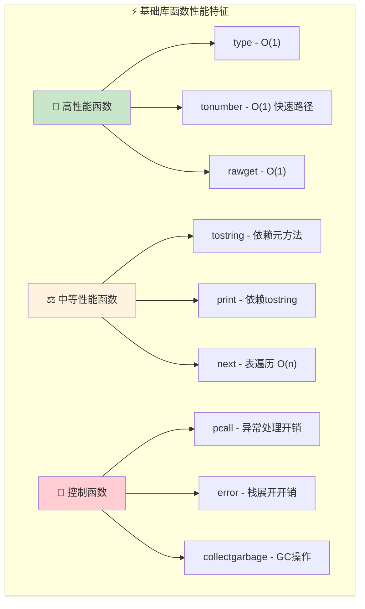

### 🔁 迭代器函数深度实现

#### 🔍 next函数的核心机制
```c
/* 🔍 表遍历的基础实现 */
static int luaB_next (lua_State *L) {
  /*
  next函数的遍历机制：
  
  1. 🎯 表遍历基础：提供表的键值对遍历功能
  2. 📊 状态维护：通过键来维护遍历状态  
  3. 🔚 结束检测：返回nil表示遍历结束
  4. ⚡ 高效实现：直接调用VM内部遍历函数
  */
  
  luaL_checktype(L, 1, LUA_TTABLE);      // 🔍 确保第一个参数是表
  lua_settop(L, 2);                      // 📊 创建第二个参数位置(如果不存在)
  
  if (lua_next(L, 1))                    // 🔄 VM内部next实现
    return 2;                            // 📤 返回键值对
  else {
    lua_pushnil(L);                      // 🔚 遍历结束，返回nil
    return 1;
  }
}

/*
🧠 next函数工作原理：
1. 第一次调用: next(table, nil) -> 返回第一个键值对
2. 后续调用: next(table, key) -> 返回下一个键值对  
3. 结束标志: next(table, last_key) -> 返回nil
*/
```

#### 🔄 pairs函数的闭包设计
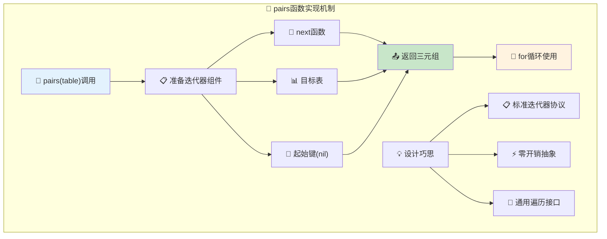

```c
/* 🔄 键值对迭代器的实现 */  
static int luaB_pairs (lua_State *L) {
  /*
  pairs函数的巧妙设计：
  
  1. 🔧 迭代器函数：返回next函数作为迭代器
  2. 📊 状态对象：返回表本身作为状态
  3. 🔑 初始值：返回nil作为起始键
  4. 📋 标准协议：符合Lua for循环的迭代器协议
  */
  
  luaL_checktype(L, 1, LUA_TTABLE);      // 🔍 确保参数是表
  lua_pushvalue(L, lua_upvalueindex(1)); // 🔧 推入next函数(upvalue)
  lua_pushvalue(L, 1);                   // 📊 推入表
  lua_pushnil(L);                        // 🔑 推入起始键(nil)
  return 3;                              // 📤 返回迭代器三元组
}

/*
🎯 迭代器协议说明：
for key, value in pairs(table) do
    -- Lua内部展开为：
    -- local iter, state, initial = pairs(table)
    -- local key, value = initial, nil
    -- while true do
    --     key, value = iter(state, key)
    --     if key == nil then break end
    --     -- 循环体
    -- end
end
*/
```

#### 📋 ipairs数组迭代器
```c
/* 📊 数组索引迭代器的实现 */
static int ipairsaux (lua_State *L) {
  /*
  ipairs辅助函数设计：
  
  1. 📈 索引递增：每次调用索引加1
  2. 🔍 边界检查：检查数组长度边界
  3. 📊 整数索引：只处理正整数索引
  4. ⚡ 高效访问：直接数组索引访问
  */
  
  int i = luaL_checkint(L, 2);           // 🔢 获取当前索引
  luaL_checktype(L, 1, LUA_TTABLE);      // 🔍 确保是表
  i++;                                   // 📈 索引递增
  lua_pushinteger(L, i);                 // 📊 推入新索引
  lua_rawgeti(L, 1, i);                  // 🔍 获取对应值
  return (lua_isnil(L, -1)) ? 0 : 2;     // 📤 值为nil则结束，否则返回索引值对
}

static int luaB_ipairs (lua_State *L) {
  /*
  ipairs主函数：
  - 返回ipairsaux作为迭代器函数
  - 返回表作为状态
  - 返回0作为起始索引
  */
  
  luaL_checktype(L, 1, LUA_TTABLE);      // 🔍 确保参数是表
  lua_pushvalue(L, lua_upvalueindex(1)); // 🔧 推入ipairsaux函数
  lua_pushvalue(L, 1);                   // 📊 推入表
  lua_pushinteger(L, 0);                 // 🔢 推入起始索引
  return 3;                              // 📤 返回迭代器三元组
}
```

### 📋 实用工具函数详解

#### 📋 select函数的多态设计
```c
/* 📋 参数选择函数的实现 */
static int luaB_select (lua_State *L) {
  /*
  select函数的多功能设计：
  
  1. 📊 参数计数：select('#', ...) 返回参数数量
  2. 📋 参数选择：select(n, ...) 返回第n个及之后的参数
  3. 🔢 负数索引：支持从末尾开始的索引
  4. ⚡ 零拷贝：不复制参数，直接调整栈指针
  */
  
  int n = lua_gettop(L);                 // 📊 获取总参数数量
  
  if (lua_type(L, 1) == LUA_TSTRING && *lua_tostring(L, 1) == '#') {
    /* 📊 参数计数模式 */
    lua_pushinteger(L, n-1);             // 📋 返回参数数量(不包括'#')
    return 1;
  }
  else {
    /* 📋 参数选择模式 */
    int i = luaL_checkint(L, 1);         // 🔢 获取起始索引
    if (i < 0) i = n + i;                // 🔄 处理负数索引
    else if (i > n) i = n;               // 🔍 处理超界索引
    luaL_argcheck(L, 1 <= i, 1, "index out of range");
    return n - i;                        // 📤 返回从i开始的参数数量
  }
}

/*
💡 select函数应用场景：
- 处理可变参数函数中的参数
- 获取参数数量而无需table.pack
- 从参数列表中提取子集
*/
```

#### 📦 unpack函数的展开机制
```c
/* 📦 数组展开函数的实现 */
static int luaB_unpack (lua_State *L) {
  /*
  unpack函数的展开策略：
  
  1. 📊 范围控制：支持指定起始和结束索引
  2. 📋 默认范围：默认展开整个数组部分
  3. ⚡ 批量推入：高效地将数组元素推入栈
  4. 🔍 边界安全：处理各种边界情况
  */
  
  int i, e, n;
  luaL_checktype(L, 1, LUA_TTABLE);      // 🔍 确保第一个参数是表
  i = luaL_optint(L, 2, 1);              // 📊 获取起始索引，默认为1
  e = luaL_opt(L, luaL_checkint, 3, luaL_getn(L, 1)); // 📋 获取结束索引
  
  if (i > e) return 0;                   // 🔍 范围检查：起始索引大于结束索引
  n = e - i + 1;                         // 📊 计算元素数量
  
  if (n <= 0 || !lua_checkstack(L, n))  // 🔍 栈空间检查
    return luaL_error(L, "too many results to unpack");
    
  for (; i<=e; i++) {                    // 🔄 批量展开元素
    lua_rawgeti(L, 1, i);                // 📋 推入表中索引i的值
  }
  return n;                              // 📤 返回展开的元素数量
}

/*
🎯 unpack使用示例：
local t = {10, 20, 30, 40, 50}
print(unpack(t))        -- 输出: 10 20 30 40 50  
print(unpack(t, 2, 4))  -- 输出: 20 30 40
*/
```

### 🎭 高级函数特性分析

#### 📊 函数复杂度对比
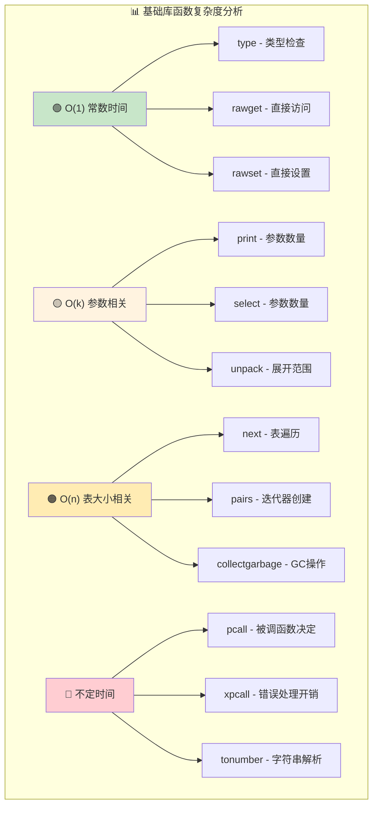

## 🎭 元编程机制深度解析

### 🎯 元表操作核心机制

元表(Metatable)是Lua元编程的核心，它允许程序在运行时修改对象的行为：

#### 📋 getmetatable函数的安全设计
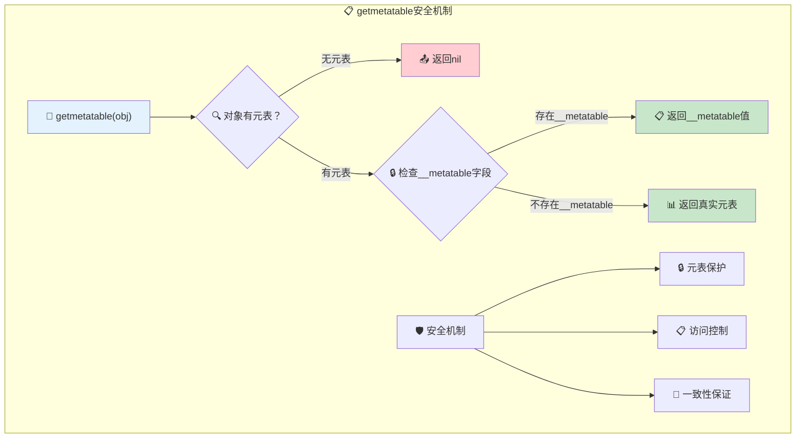

```c
/* 📋 获取元表的安全实现 */
static int luaB_getmetatable (lua_State *L) {
  /*
  getmetatable的安全设计：
  
  1. 🔍 通用检查：支持所有类型的对象
  2. 🔒 保护机制：通过__metatable字段控制访问
  3. 📋 统一接口：为不同类型提供一致的元表访问
  4. 🛡️ 安全返回：确保返回值的安全性
  */
  
  luaL_checkany(L, 1);                   // 🔍 确保至少有一个参数
  
  if (!lua_getmetatable(L, 1)) {         // 🔍 尝试获取元表
    lua_pushnil(L);                      // 📋 无元表时返回nil
    return 1;
  }
  
  luaL_getmetafield(L, 1, "__metatable"); // 🔒 检查保护字段
  return 1;  /* 📤 返回__metatable字段值或元表本身 */
}

/*
🔒 元表保护机制说明：
- __metatable字段存在: 返回__metatable的值，隐藏真实元表
- __metatable字段不存在: 返回真实元表
- 这种设计允许库作者保护元表不被意外修改
*/
```

#### 📝 setmetatable函数的保护机制
```c
/* 📝 设置元表的安全实现 */
static int luaB_setmetatable (lua_State *L) {
  /*
  setmetatable的保护策略：
  
  1. 🎯 类型限制：只能为表设置元表
  2. 🔒 保护检查：检查现有元表的保护状态
  3. 📋 参数验证：确保元表参数的有效性
  4. 🔄 操作原子：设置操作要么成功要么失败
  */
  
  int t = lua_type(L, 2);                // 🔍 获取第二个参数类型
  
  luaL_checktype(L, 1, LUA_TTABLE);      // 🎯 确保第一个参数是表
  luaL_argcheck(L, t == LUA_TNIL || t == LUA_TTABLE, 2,
                    "nil or table expected");  // 📋 验证元表参数
  
  if (luaL_getmetafield(L, 1, "__metatable")) // 🔒 检查保护字段
    luaL_error(L, "cannot change a protected metatable");
  
  lua_settop(L, 2);                      // 📊 只保留表和元表参数
  lua_setmetatable(L, 1);                // 📝 设置元表
  return 1;                              // 📤 返回表本身
}

/*
🛡️ 保护机制要点：
- 只有表可以设置元表（在基础库中）
- 检查__metatable保护字段，防止修改受保护的元表
- 参数类型严格验证：元表必须是table或nil
- 返回表本身，支持链式调用
*/
```

### 🔄 原始操作函数详解

原始操作(Raw Operations)绕过元方法直接操作对象，是元编程的重要工具：

#### 🔄 rawget/rawset实现原理
```c
/* 🔄 原始获取操作 */
static int luaB_rawget (lua_State *L) {
  /*
  rawget的直接访问机制：
  
  1. 🎯 绕过元方法：直接访问表，不触发__index
  2. 📊 类型检查：确保操作对象是表
  3. ⚡ 高效访问：直接调用VM内部函数
  4. 🔍 完整性：支持任意类型的键
  */
  
  luaL_checktype(L, 1, LUA_TTABLE);      // 🎯 确保第一个参数是表
  luaL_checkany(L, 2);                   // 🔍 确保有键参数
  lua_settop(L, 2);                      // 📊 只保留表和键
  lua_rawget(L, 1);                      // 🔄 原始获取操作
  return 1;                              // 📤 返回获取的值
}

/* 🔄 原始设置操作 */
static int luaB_rawset (lua_State *L) {
  /*
  rawset的直接设置机制：
  - 绕过__newindex元方法
  - 直接在表中设置键值对
  - 支持任意类型的键和值
  */
  
  luaL_checktype(L, 1, LUA_TTABLE);      // 🎯 确保第一个参数是表
  luaL_checkany(L, 2);                   // 🔍 确保有键参数
  luaL_checkany(L, 3);                   // 🔍 确保有值参数
  lua_settop(L, 3);                      // 📊 只保留表、键和值
  lua_rawset(L, 1);                      // 🔄 原始设置操作
  return 1;                              // 📤 返回表本身
}

/* 🔄 原始相等比较 */
static int luaB_rawequal (lua_State *L) {
  /*
  rawequal的直接比较：
  - 绕过__eq元方法
  - 使用VM内部的相等比较
  - 比较对象的原始值和引用
  */
  
  luaL_checkany(L, 1);                   // 🔍 确保有第一个参数
  luaL_checkany(L, 2);                   // 🔍 确保有第二个参数
  lua_pushboolean(L, lua_rawequal(L, 1, 2)); // 🔄 原始相等比较
  return 1;                              // 📤 返回布尔结果
}
```

#### 🎯 原始操作应用场景
```lua
-- 🎭 元表操作示例
local proxy = {}
local data = {x = 10, y = 20}

setmetatable(proxy, {
  __index = function(t, k)
    print("Accessing:", k)
    return rawget(data, k)  -- 🔄 绕过递归调用
  end,
  
  __newindex = function(t, k, v)
    print("Setting:", k, "=", v)
    rawset(data, k, v)      -- 🔄 直接设置，避免无限递归
  end
})

print(proxy.x)        -- 触发__index，输出"Accessing: x"，然后输出10
proxy.z = 30          -- 触发__newindex，设置data.z = 30
```

### 🌍 环境管理机制深度解析

环境(Environment)控制函数的全局变量访问，是Lua沙箱和模块系统的基础：

#### 🌍 getfenv函数的环境获取
```c
/* 🌍 获取函数环境 */
static int luaB_getfenv (lua_State *L) {
  /*
  getfenv的环境访问机制：
  
  1. 🎯 函数定位：支持多种函数指定方式
  2. 🔍 类型区分：C函数和Lua函数的不同处理
  3. 🌍 环境返回：返回函数的执行环境
  4. 🛡️ 安全检查：确保操作的合法性
  */
  
  getfunc(L);                            // 🔍 获取函数对象
  
  if (lua_iscfunction(L, -1))            // 🔍 是C函数？
    lua_pushvalue(L, LUA_GLOBALSINDEX);  // 🌍 返回全局环境
  else
    lua_getfenv(L, -1);                  // 🎯 获取Lua函数的环境
    
  return 1;                              // 📤 返回环境表
}

/* 🔍 辅助函数：获取函数对象 */
static void getfunc (lua_State *L) {
  /*
  函数定位策略：
  1. 无参数或nil: 获取调用者函数
  2. 数字: 获取指定栈级别的函数  
  3. 函数对象: 直接使用该函数
  */
  
  if (lua_isnoneornil(L, 1))             // 🔍 无参数？
    lua_pushvalue(L, lua_upvalueindex(1)); // 🎯 获取调用者
  else if (lua_isnumber(L, 1)) {         // 🔢 数字参数？
    lua_Debug ar;
    int level = (int)lua_tointeger(L, 1);
    luaL_argcheck(L, level >= 0, 1, "level must be non-negative");
    if (lua_getstack(L, level, &ar) == 0)
      luaL_argerror(L, 1, "invalid level");
    lua_getinfo(L, "f", &ar);            // 📊 获取指定级别的函数
  }
  else {                                 // 🔧 函数对象
    luaL_checktype(L, 1, LUA_TFUNCTION);
    lua_pushvalue(L, 1);                  // 📋 直接使用该函数
  }
}
```

#### 📝 setfenv函数的环境设置
```c
/* 📝 设置函数环境 */
static int luaB_setfenv (lua_State *L) {
  /*
  setfenv的环境控制机制：
  
  1. 🎯 环境验证：确保新环境是有效的表
  2. 🔍 对象定位：支持函数和线程的环境设置
  3. 🛡️ 权限检查：某些对象不允许环境修改
  4. 🔄 原子操作：环境设置要么成功要么失败
  */
  
  luaL_checktype(L, 2, LUA_TTABLE);      // 🎯 确保新环境是表
  getfunc(L);                            // 🔍 获取目标函数
  lua_pushvalue(L, 2);                   // 📋 推入新环境
  
  if (lua_isnumber(L, 1) && lua_tonumber(L, 1) == 0) {
    /* 🎯 特殊情况：设置当前线程的环境 */
    lua_pushthread(L);                   // 📊 推入当前线程
    lua_insert(L, -2);                   // 🔄 调整栈顺序
    lua_setfenv(L, -2);                  // 🌍 设置线程环境
    return 0;                            // 🔚 无返回值
  }
  else if (lua_iscfunction(L, -2) ||     // 🔍 C函数或设置失败？
           lua_setfenv(L, -2) == 0)
    luaL_error(L,
          LUA_QL("setfenv") " cannot change environment of given object");
          
  return 1;                              // 📤 返回函数对象
}
```

### 🎭 元编程高级应用模式

#### 🏗️ 代理模式实现
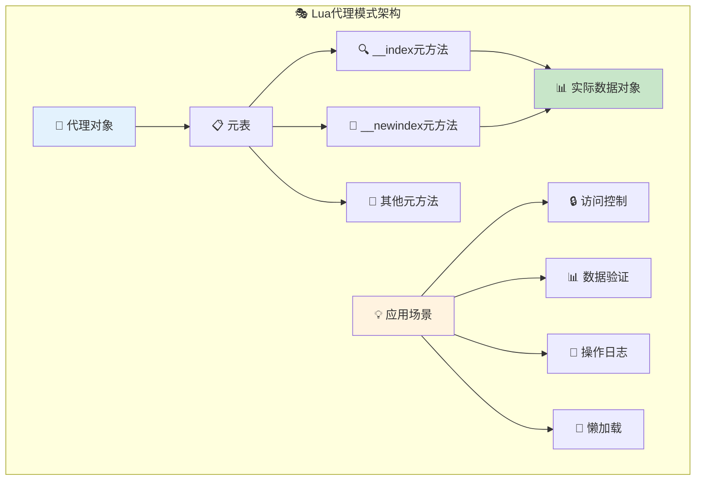

#### 🛠️ 实际应用示例
```lua
-- 🎭 创建一个属性验证代理
function create_validated_object(schema)
    local data = {}
    local proxy = {}
    
    setmetatable(proxy, {
        __index = function(t, k)
            return rawget(data, k)
        end,
        
        __newindex = function(t, k, v)
            -- 🔍 验证属性
            if schema[k] then
                local validator = schema[k]
                if type(validator) == "function" then
                    if not validator(v) then
                        error("Invalid value for " .. k)
                    end
                elseif type(validator) == "string" then
                    if type(v) ~= validator then
                        error("Expected " .. validator .. " for " .. k)
                    end
                end
            end
            rawset(data, k, v)
        end
    })
    
    return proxy
end

-- 使用示例
local person_schema = {
    name = "string",
    age = function(v) return type(v) == "number" and v > 0 end
}

local person = create_validated_object(person_schema)
person.name = "Alice"  -- ✅ 成功
person.age = 25        -- ✅ 成功
-- person.age = -5     -- ❌ 错误：Invalid value for age
```

## ⚡ 性能优化与高级应用

### 🗑️ 垃圾回收控制机制

垃圾回收控制是Lua性能调优的关键工具，`collectgarbage`函数提供了精细的GC控制能力：

#### 🗑️ collectgarbage函数深度解析
```c
/* 🗑️ 垃圾回收控制的完整实现 */
static int luaB_collectgarbage (lua_State *L) {
  /*
  collectgarbage的控制策略：
  
  1. 🎚️ 多模式支持：提供多种GC控制选项
  2. 📊 状态查询：支持内存使用量查询
  3. 🔧 参数调节：允许调整GC参数
  4. ⚡ 性能控制：精确控制垃圾回收时机
  */
  
  static const char *const opts[] = {
    "stop", "restart", "collect", "count", "step", 
    "setpause", "setstepmul", NULL
  };
  static const int optsnum[] = {
    LUA_GCSTOP, LUA_GCRESTART, LUA_GCCOLLECT,
    LUA_GCCOUNT, LUA_GCSTEP, LUA_GCSETPAUSE, LUA_GCSETSTEPMUL
  };
  
  int o = luaL_checkoption(L, 1, "collect", opts);  // 🎯 获取操作选项
  int ex = luaL_optint(L, 2, 0);                   // 📊 获取额外参数
  int res = lua_gc(L, optsnum[o], ex);             // 🔧 执行GC操作
  
  switch (optsnum[o]) {
    case LUA_GCCOUNT: {
      /* 📊 内存统计：返回KB为单位的内存使用量 */
      int b = lua_gc(L, LUA_GCCOUNTB, 0);          // 🔍 获取字节部分
      lua_pushnumber(L, res + ((lua_Number)b/1024)); // 📋 合并KB和字节
      return 1;
    }
    case LUA_GCSTEP: {
      /* 🔄 步进式GC：返回是否完成一个回收周期 */
      lua_pushboolean(L, res);
      return 1;
    }
    default: {
      /* 🔧 其他操作：返回整数结果 */
      lua_pushinteger(L, res);
      return 1;
    }
  }
}
```

#### 🎛️ GC控制选项详解
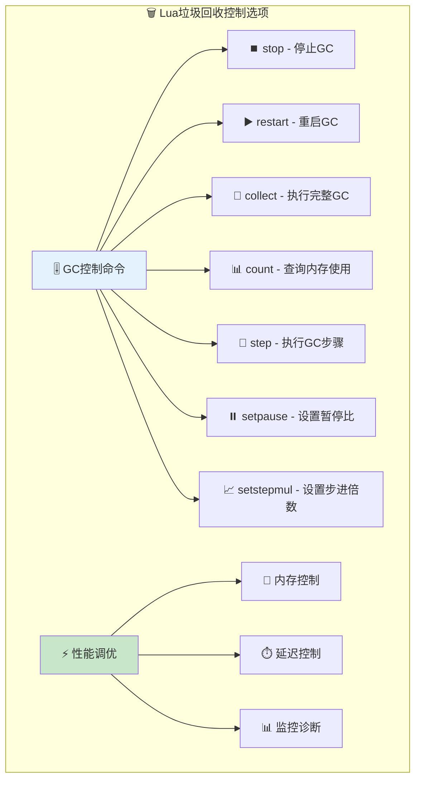

#### 🎯 GC性能调优策略
```lua
-- 🎛️ 垃圾回收性能调优示例

-- 📊 监控内存使用
function monitor_memory()
    local before = collectgarbage("count")
    print(string.format("Memory usage: %.2f KB", before))
    return before
end

-- ⚡ 高性能场景的GC策略
function performance_critical_section()
    -- 🛑 临时停止GC，避免延迟
    collectgarbage("stop")
    
    -- 🚀 执行性能关键代码
    for i = 1, 1000000 do
        -- 大量计算...
    end
    
    -- ▶️ 重启GC并执行一次完整回收
    collectgarbage("restart")
    collectgarbage("collect")
end

-- 🎚️ 游戏循环中的GC管理
function game_loop()
    local frame_count = 0
    
    while running do
        -- 🎮 游戏逻辑
        update_game()
        render_frame()
        
        frame_count = frame_count + 1
        
        -- 📊 定期执行增量GC
        if frame_count % 60 == 0 then  -- 每秒一次
            collectgarbage("step", 200)  -- 执行少量GC工作
        end
        
        -- 🔄 关卡结束时完整回收
        if level_completed then
            collectgarbage("collect")
        end
    end
end

-- 🔧 动态GC参数调整
function optimize_gc_for_workload(memory_pressure)
    if memory_pressure == "high" then
        -- 🔴 高内存压力：更激进的GC
        collectgarbage("setpause", 100)     -- 暂停比100%
        collectgarbage("setstepmul", 300)   -- 步进倍数300%
    elseif memory_pressure == "low" then
        -- 🟢 低内存压力：更宽松的GC
        collectgarbage("setpause", 200)     -- 暂停比200%
        collectgarbage("setstepmul", 200)   -- 步进倍数200%
    else
        -- 🟡 默认设置
        collectgarbage("setpause", 200)
        collectgarbage("setstepmul", 200)
    end
end
```

### 📊 性能优化实践指南

#### ⚡ 基础库函数性能对比
```c
/* 📊 性能测试基准函数 */
static void benchmark_base_functions() {
    /*
    基础库函数性能特征：
    
    🟢 高性能函数（微秒级）：
    - type(): 直接类型检查，无额外开销
    - rawget/rawset(): 直接表操作，绕过元方法
    - rawequal(): 直接值比较，无元方法调用
    
    🟡 中等性能函数（毫秒级）：
    - tostring(): 可能调用元方法，字符串创建开销
    - tonumber(): 字符串解析开销，进制转换计算
    - next/pairs(): 表遍历开销，迭代器创建
    
    🔴 潜在高开销函数：
    - print(): I/O操作，格式化开销
    - pcall/xpcall(): 异常处理机制开销
    - collectgarbage(): GC操作，内存管理开销
    */
}
```

#### 🎯 性能优化最佳实践
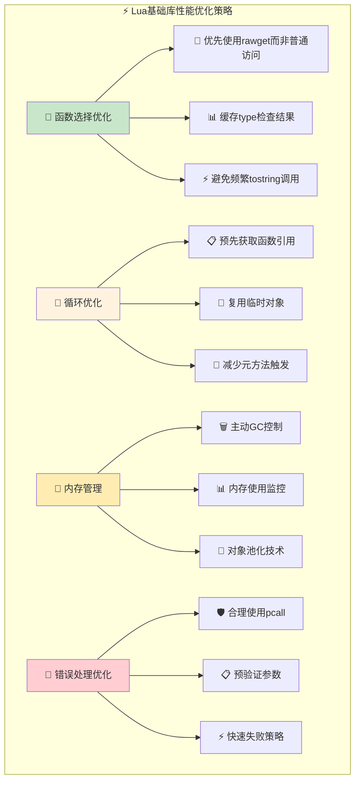

### 🏗️ 实战应用模式

#### 🎭 高级元编程模式
```lua
-- 🏗️ 创建一个功能完整的OOP系统
local Class = {}
Class.__index = Class

function Class:new(...)
    local instance = setmetatable({}, self)
    if instance.init then
        instance:init(...)
    end
    return instance
end

function Class:extend()
    local subclass = setmetatable({}, {__index = self})
    subclass.__index = subclass
    return subclass
end

-- 使用示例
local Animal = Class:extend()

function Animal:init(name)
    self.name = name
end

function Animal:speak()
    print(self.name .. " makes a sound")
end

local Dog = Animal:extend()

function Dog:speak()
    print(self.name .. " barks")
end

local dog = Dog:new("Buddy")
dog:speak()  -- 输出: Buddy barks
```

#### 🔒 安全沙箱实现
```lua
-- 🔒 创建安全的代码执行环境
function create_sandbox()
    local sandbox_env = {
        -- 🟢 允许的安全函数
        print = print,
        type = type,
        tostring = tostring,
        tonumber = tonumber,
        pairs = pairs,
        ipairs = ipairs,
        next = next,
        
        -- 📊 受限的数学和字符串库
        math = {
            abs = math.abs, ceil = math.ceil, floor = math.floor,
            max = math.max, min = math.min, sqrt = math.sqrt
        },
        string = {
            len = string.len, sub = string.sub, 
            upper = string.upper, lower = string.lower
        },
        
        -- 🚫 禁止的危险函数被移除
        -- os, io, debug, loadstring, dofile, loadfile 等
    }
    
    return sandbox_env
end

-- 🛡️ 安全执行用户代码
function safe_execute(code, timeout)
    local sandbox = create_sandbox()
    
    -- 📝 编译代码
    local func, err = loadstring(code)
    if not func then
        return false, "Compilation error: " .. err
    end
    
    -- 🌍 设置安全环境
    setfenv(func, sandbox)
    
    -- ⏰ 超时保护执行
    local success, result = pcall(func)
    
    if success then
        return true, result
    else
        return false, "Runtime error: " .. result
    end
end
```

#### 📊 性能监控工具
```lua
-- 📊 基础库函数性能分析器
local Profiler = {}

function Profiler:new()
    return setmetatable({
        stats = {},
        start_time = nil
    }, {__index = self})
end

function Profiler:start_timing(name)
    self.start_time = os.clock()
    if not self.stats[name] then
        self.stats[name] = {count = 0, total_time = 0}
    end
end

function Profiler:end_timing(name)
    if self.start_time then
        local elapsed = os.clock() - self.start_time
        local stat = self.stats[name]
        stat.count = stat.count + 1
        stat.total_time = stat.total_time + elapsed
        self.start_time = nil
    end
end

function Profiler:report()
    print("Performance Report:")
    print("Function\t\tCount\tTotal(s)\tAvg(ms)")
    for name, stat in pairs(self.stats) do
        local avg_ms = (stat.total_time / stat.count) * 1000
        print(string.format("%-20s\t%d\t%.4f\t\t%.2f", 
              name, stat.count, stat.total_time, avg_ms))
    end
end

-- 使用示例
local profiler = Profiler:new()

profiler:start_timing("type_check")
for i = 1, 100000 do
    local t = type(i)
end
profiler:end_timing("type_check")

profiler:start_timing("tostring_convert")
for i = 1, 100000 do
    local s = tostring(i)
end
profiler:end_timing("tostring_convert")

profiler:report()
```

## 🌟 实战应用与扩展开发

### 🎓 技能发展路径

#### 🌱 初学者路径 (⏱️ 6-8小时)
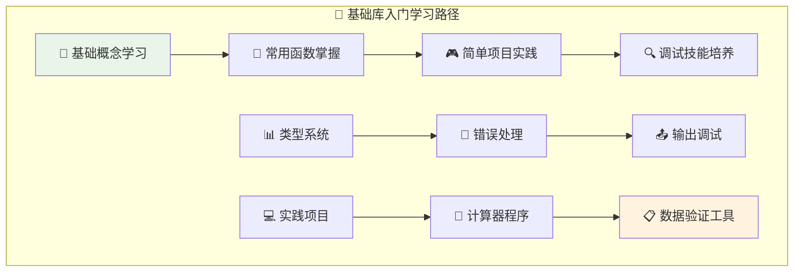

**学习检查点：**
- ✅ 熟练使用type、tostring、tonumber等基础函数
- ✅ 掌握print调试和assert验证技巧
- ✅ 理解pcall错误处理的重要性
- ✅ 能够编写简单的数据处理程序

#### 🚀 中级开发路径 (⏱️ 12-15小时)
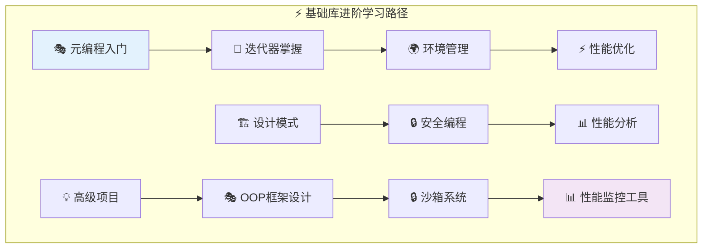

**能力检查点：**
- ✅ 掌握元表和元方法的使用
- ✅ 理解rawget/rawset的应用场景
- ✅ 能够实现复杂的迭代器模式
- ✅ 具备性能调优和内存管理能力

#### 🏆 专家级路径 (⏱️ 20-25小时)
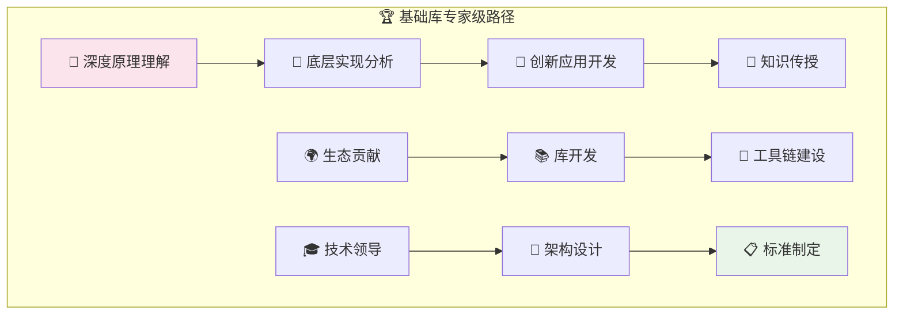

### 🔗 文档交叉引用

#### 📋 相关核心文档
- 🎯 **[Lua执行流程分析](wiki_execution_optimized.md)** - 理解基础库在执行流程中的作用
- 🔤 **[词法分析器详解](wiki_lexer_optimized.md)** - 了解类型系统的底层支持
- 🔧 **[函数系统深度解析](wiki_function_optimized.md)** - 深入理解函数环境和闭包
- 🗄️ **[内存管理机制](wiki_memory.md)** - 垃圾回收控制的底层原理
- 📝 **[字符串库详解](wiki_lib_string.md)** - tostring函数的扩展应用

#### 🎯 学习建议序列
1. **前置知识**：先学习 `wiki_execution_optimized.md` 了解Lua整体架构
2. **并行学习**：可以同时学习 `wiki_function_optimized.md` 理解函数机制
3. **深化理解**：结合 `wiki_memory.md` 理解GC控制原理
4. **扩展应用**：通过 `wiki_lib_string.md` 了解库设计模式

### 🛠️ 实践练习项目

#### 🎮 项目1：智能调试工具 (难度：⭐⭐)
**目标**：创建一个增强版的调试输出工具

**技术要求**：
- 支持分级日志输出
- 自动类型检查和格式化
- 性能监控功能

**核心代码结构**：
```lua
-- 🛠️ 智能调试工具实现
local Debug = {
    levels = {ERROR = 1, WARN = 2, INFO = 3, DEBUG = 4},
    current_level = 3,
    stats = {}
}

function Debug:log(level, ...)
    if self.levels[level] <= self.current_level then
        local args = {...}
        local formatted = {}
        
        for i, v in ipairs(args) do
            table.insert(formatted, tostring(v) .. " (" .. type(v) .. ")")
        end
        
        print("[" .. level .. "]", table.concat(formatted, " "))
        
        -- 统计记录
        self.stats[level] = (self.stats[level] or 0) + 1
    end
end

-- 使用示例
Debug:log("INFO", "Processing data:", {x=1, y=2}, 42)
-- 输出: [INFO] Processing data: table: 0x... (table) 42 (number)
```

**评估标准**：
- ✅ 实现完整的分级日志功能
- ✅ 自动类型识别和格式化
- ✅ 性能统计和监控

#### ⚡ 项目2：高性能对象池 (难度：⭐⭐⭐)
**目标**：实现一个基于基础库的高性能对象池系统

**技术要求**：
- 使用rawset/rawget优化性能
- 集成垃圾回收控制
- 提供详细的使用统计

**核心设计**：
```lua
-- ⚡ 高性能对象池实现
local ObjectPool = {}

function ObjectPool:new(factory, reset_func, initial_size)
    local pool = {
        factory = factory or function() return {} end,
        reset = reset_func or function(obj) 
            -- 清理对象状态
            for k in pairs(obj) do rawset(obj, k, nil) end
        end,
        available = {},
        in_use = {},
        stats = {created = 0, reused = 0, peak_usage = 0}
    }
    
    -- 预填充池
    for i = 1, (initial_size or 10) do
        local obj = pool.factory()
        table.insert(pool.available, obj)
        pool.stats.created = pool.stats.created + 1
    end
    
    return setmetatable(pool, {__index = self})
end

function ObjectPool:acquire()
    local obj
    if #self.available > 0 then
        obj = table.remove(self.available)
        self.stats.reused = self.stats.reused + 1
    else
        obj = self.factory()
        self.stats.created = self.stats.created + 1
    end
    
    rawset(self.in_use, obj, true)
    local current_usage = 0
    for _ in pairs(self.in_use) do current_usage = current_usage + 1 end
    self.stats.peak_usage = math.max(self.stats.peak_usage, current_usage)
    
    return obj
end

function ObjectPool:release(obj)
    if rawget(self.in_use, obj) then
        rawset(self.in_use, obj, nil)
        self.reset(obj)
        table.insert(self.available, obj)
        return true
    end
    return false
end
```

**评估标准**：
- ✅ 显著的性能提升（相比直接创建对象）
- ✅ 准确的使用统计和监控
- ✅ 良好的内存管理和GC友好性

#### 🏆 项目3：元编程DSL框架 (难度：⭐⭐⭐⭐)
**目标**：创建一个基于元表的领域特定语言框架

**技术要求**：
- 深度使用元表和环境管理
- 实现类似SQL的声明式语法
- 提供完整的错误处理和调试支持

**设计示例**：
```lua
-- 🏆 DSL查询语言实现
local QueryBuilder = {}

function QueryBuilder:new(data)
    local builder = {
        _data = data,
        _conditions = {},
        _transforms = {}
    }
    
    return setmetatable(builder, {
        __index = function(t, k)
            -- 动态方法生成
            if k:match("^where_") then
                local field = k:sub(7)  -- 移除"where_"前缀
                return function(self, value)
                    table.insert(self._conditions, {field, "=", value})
                    return self
                end
            elseif k:match("^select_") then
                local field = k:sub(8)  -- 移除"select_"前缀  
                return function(self)
                    table.insert(self._transforms, function(row) return row[field] end)
                    return self
                end
            else
                return rawget(QueryBuilder, k)
            end
        end
    })
end

-- 使用示例
local users = {
    {name = "Alice", age = 25, city = "NYC"},
    {name = "Bob", age = 30, city = "LA"},
    {name = "Charlie", age = 25, city = "NYC"}
}

local result = QueryBuilder:new(users)
    :where_age(25)
    :where_city("NYC")
    :select_name()
    :execute()
-- 结果: {"Alice", "Charlie"}
```

### 📊 学习评估体系

#### 🎯 理论知识测试
**基础概念** (总分30分)
- 基础库函数分类和用途 (8分)
- 类型系统和转换机制 (7分)  
- 错误处理和调试技巧 (8分)
- 性能特征和优化策略 (7分)

**高级理解** (总分30分)
- 元编程机制和应用 (10分)
- 环境管理和安全性 (10分)
- 垃圾回收控制原理 (10分)

#### 💻 实践能力评估
**编程实现** (总分25分)
- 代码质量和设计 (8分)
- 功能完整性 (8分)
- 性能优化效果 (9分)

**问题解决** (总分15分)
- 调试和诊断能力 (8分)
- 创新应用设计 (7分)

### 🌟 进阶学习方向

#### 🔬 Lua内核开发
- **源码贡献**：参与Lua官方源码开发和维护
- **C扩展开发**：编写高性能的C扩展库
- **虚拟机优化**：深入研究Lua VM性能优化

#### 🎯 DSL设计与实现
- **配置语言**：设计应用特定的配置DSL
- **模板引擎**：基于Lua的模板处理系统
- **规则引擎**：业务规则的声明式表达

#### 🚀 高性能应用
- **游戏脚本**：高性能游戏逻辑脚本系统
- **Web开发**：基于Lua的高并发Web框架
- **嵌入式系统**：资源受限环境下的Lua应用

---

## 🎉 总结与展望

Lua基础库虽然简洁，但蕴含着深刻的设计智慧。从精巧的类型转换机制，到强大的元编程能力，再到精细的垃圾回收控制，每个函数都体现了"简洁而强大"的设计哲学。

通过深入学习基础库，你不仅能掌握Lua编程的核心技能，更能培养出色的系统设计思维。记住，技术的精进来自不断的实践和思考，而基础库正是这个过程中最可靠的伙伴。

### 📚 核心收获总结

1. **🔧 函数掌握**：全面掌握25+个基础库函数的用法和原理
2. **🎭 元编程技能**：深入理解元表、环境管理等高级特性  
3. **⚡ 性能调优**：掌握垃圾回收控制和性能优化技巧
4. **🏗️ 设计模式**：学会运用基础库构建复杂的应用架构
5. **🛡️ 安全意识**：了解沙箱实现和安全编程最佳实践

### 🚀 持续学习建议

- 📝 **实践为王**：通过实际项目巩固理论知识
- 🔍 **源码阅读**：深入研究Lua官方实现
- 🌍 **社区参与**：分享经验，学习他人的最佳实践
- 💡 **创新应用**：尝试将基础库应用到新的领域

愿这份文档成为你Lua学习路上的得力助手，开启更广阔的编程视野！

### 📧 反馈与改进

如果你在学习过程中有任何疑问或建议，欢迎：
- 📝 提交学习心得和项目案例
- 🐛 报告文档中的问题或错误  
- 💡 分享创新的应用思路
- 🤝 参与开源项目和技术讨论

**编程路上，基础为本，创新为翼！** 🚀

---