# Lua 5.1 指令集深度解析

## 📖 概述

Lua 5.1 虚拟机是**基于寄存器的虚拟机**，使用字节码指令执行。本文档详细分析了 Lua 5.1 的所有指令集，包括指令格式、操作语义和实现细节。

### 🎯 核心特性

- ✅ **基于寄存器** - 相比基于栈的VM，减少指令数量和数据移动
- 📦 **37条指令** - 精简而完整的指令集
- 🔢 **32位指令** - 固定长度指令，简化解码
- ⚡ **高效执行** - 直接解释执行，无需JIT即有良好性能
- 🎨 **元方法支持** - 算术、比较、表操作都支持元方法
- 🔄 **尾调用优化** - 真正的尾递归，避免栈溢出

### 🏗️ 虚拟机架构图

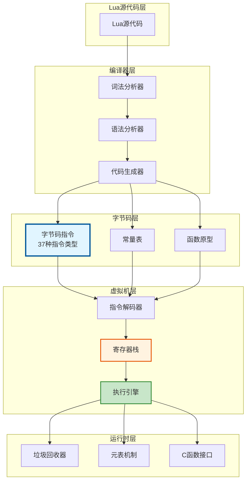

### 📊 指令分类概览

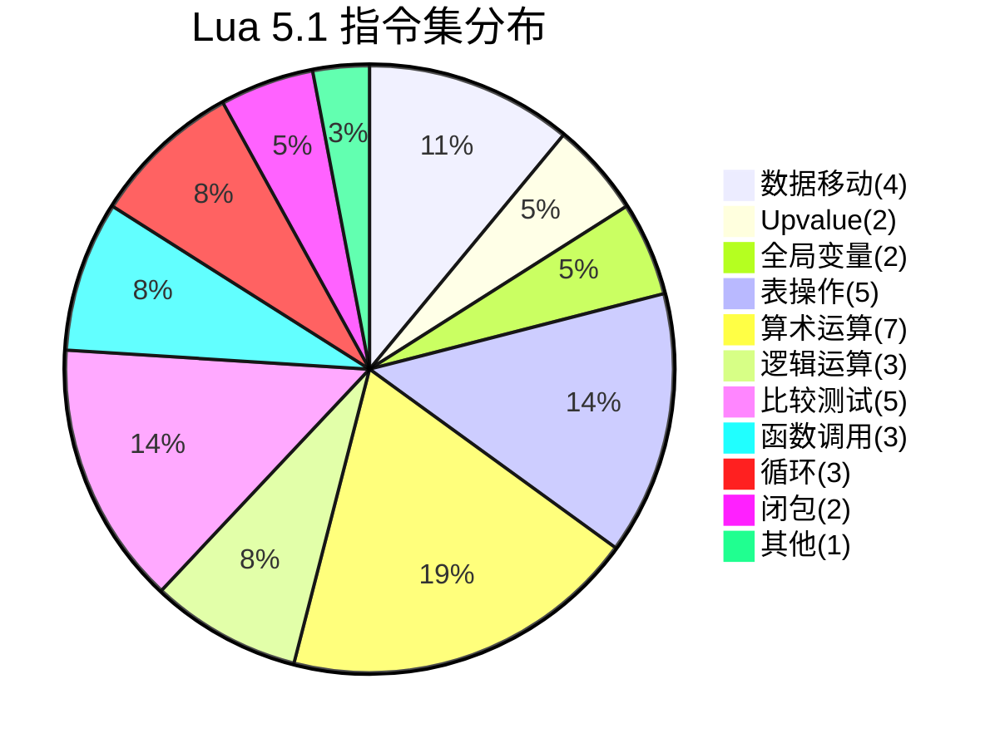

## 🔧 指令格式

Lua 5.1 的指令是32位无符号整数，采用三种编码格式：

### 📐 格式类型

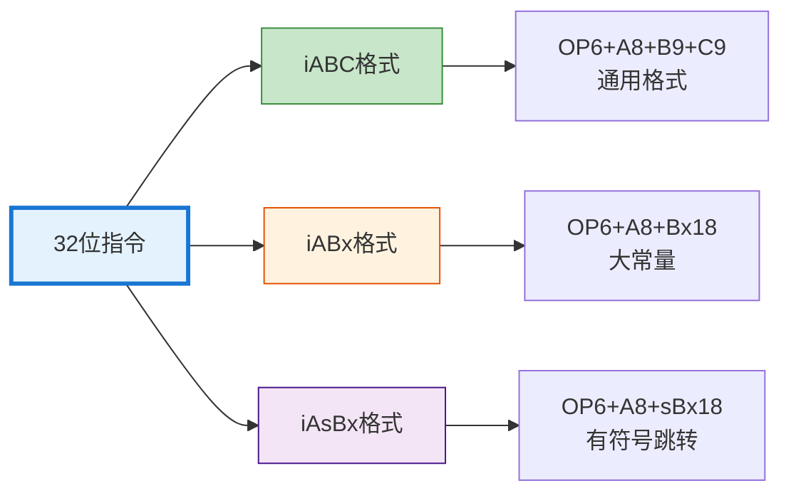

### 📋 指令编码表

```
指令格式 (32位):
┌────────┬────────┬──────────┬──────────┐
│ OP(6)  │ A(8)   │   B(9)   │  C(9)    │  iABC格式
├────────┼────────┴──────────┴──────────┤
│ 0-5位  │ 6-13位 │  14-22位 │ 23-31位  │
└────────┴────────┴──────────┴──────────┘

┌────────┬────────┬─────────────────────┐
│ OP(6)  │ A(8)   │     Bx(18)          │  iABx格式
├────────┼────────┼─────────────────────┤
│ 0-5位  │ 6-13位 │     14-31位         │
└────────┴────────┴─────────────────────┘

┌────────┬────────┬─────────────────────┐
│ OP(6)  │ A(8)   │    sBx(18)          │  iAsBx格式
├────────┼────────┼─────────────────────┤
│ 0-5位  │ 6-13位 │ 14-31位(有符号偏移)  │
└────────┴────────┴─────────────────────┘
```

### 📖 字段说明

| 字段 | 位数 | 范围 | 说明 |
|------|------|------|------|
| **OP** | 6位 | 0-63 | 操作码，实际使用37条 |
| **A** | 8位 | 0-255 | 目标寄存器或参数 |
| **B** | 9位 | 0-511 | 源寄存器/立即数 |
| **C** | 9位 | 0-511 | 源寄存器/立即数 |
| **Bx** | 18位 | 0-262143 | 大立即数（无符号） |
| **sBx** | 18位 | -131071~131071 | 有符号立即数（偏移-131071） |

### 🔑 寄存器/常量编码 (RK)

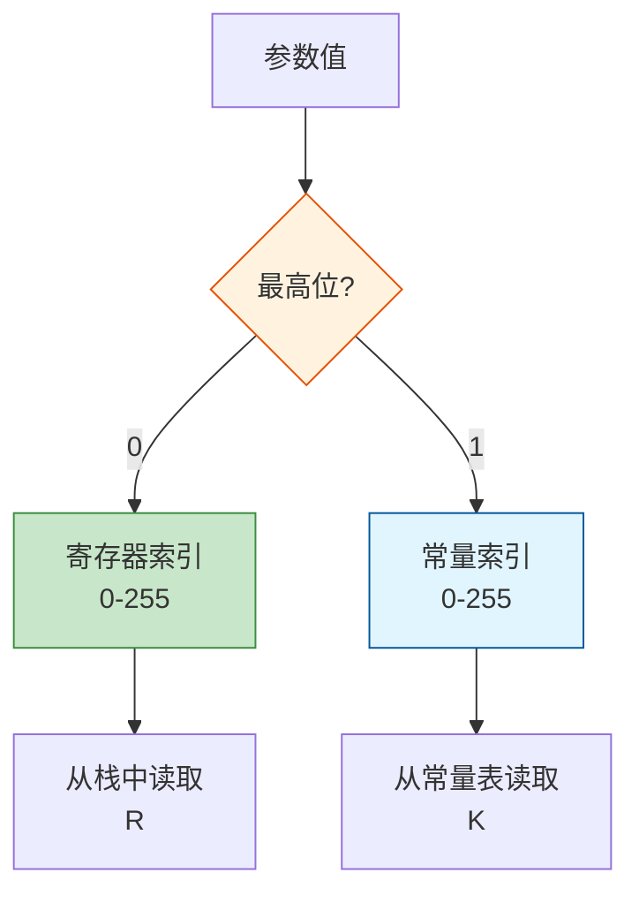

**编码规则**:
- `BITRK = 256` (第9位，即 1<<8)
- 如果 `value & BITRK` 为真，则为常量表索引：`index = value - BITRK`
- 如果 `value & BITRK` 为假，则为寄存器索引：`index = value`

**示例**:
```c
// 寄存器 R(5)
value = 5        // 0b000000101

// 常量 K(5)
value = 261      // 0b100000101 = 256 + 5
```

## 📚 指令分类

### 1. 数据移动指令

#### OP_MOVE (0)
```
格式: MOVE A B     (iABC)
操作: R(A) := R(B)
描述: 将寄存器B的值复制到寄存器A
```

**🔄 执行流程**:


**📖 使用示例**:
```lua
-- Lua代码
local a = 10
local b = a

-- 对应字节码
LOADK    0 0    ; R(0) = K(0) = 10
MOVE     1 0    ; R(1) = R(0)  --> b = a
```

#### OP_LOADK (1)
```
格式: LOADK A Bx   (iABx)
操作: R(A) := Kst(Bx)
描述: 将常量表中索引为Bx的常量加载到寄存器A
```

**🔄 执行流程**:


**📖 使用示例**:
```lua
-- Lua代码
local x = 42
local s = "hello"

-- 对应字节码
LOADK    0 0    ; R(0) = K(0) = 42
LOADK    1 1    ; R(1) = K(1) = "hello"
```

#### OP_LOADBOOL (2)
```
格式: LOADBOOL A B C  (iABC)
操作: R(A) := (Bool)B; if (C) pc++
描述: 将布尔值B加载到寄存器A，如果C非零则跳过下一条指令
应用: 实现短路逻辑运算
```

**🔄 执行流程**:
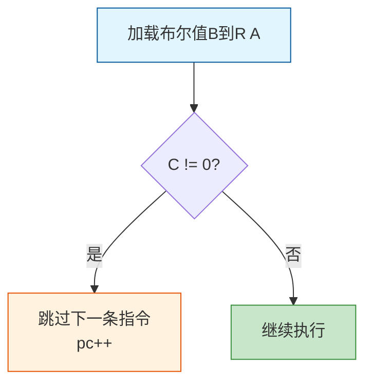

**📖 使用示例**:
```lua
-- Lua代码
local a = true or false  -- 短路求值

-- 对应字节码
LOADBOOL  0 1 1   ; R(0) = true, skip next
JMP       0 1     ; (被跳过)
LOADBOOL  0 0 0   ; R(0) = false
```

#### OP_LOADNIL (3)
```
格式: LOADNIL A B  (iABC)
操作: R(A) := ... := R(B) := nil
描述: 将寄存器A到B（包含）设置为nil
```

**📖 使用示例**:
```lua
-- Lua代码
local a, b, c

-- 对应字节码
LOADNIL   0 2    ; R(0) = R(1) = R(2) = nil
```

### 2. Upvalue操作指令

#### OP_GETUPVAL (4)
```
格式: GETUPVAL A B  (iABC)
操作: R(A) := UpValue[B]
描述: 获取第B个upvalue的值到寄存器A
```

#### OP_SETUPVAL (8)
```
格式: SETUPVAL A B  (iABC)
操作: UpValue[B] := R(A)
描述: 设置第B个upvalue为寄存器A的值
```

### 3. 全局变量操作指令

#### OP_GETGLOBAL (5) - 读取全局变量

```
格式: GETGLOBAL A Bx  (iABx)
操作: R(A) := Gbl[Kst(Bx)]
描述: 从全局表中获取名为Kst(Bx)的变量到寄存器A
实现: 实际上是 R(A) := _ENV[Kst(Bx)]
```

**📖 使用示例**:
```lua
-- Lua代码
print("hello")
local x = math.pi

-- 对应字节码
GETGLOBAL 0 0        ; R(0) = _G["print"]
LOADK     1 1        ; R(1) = "hello"
CALL      0 2 1      ; print("hello")

GETGLOBAL 1 2        ; R(1) = _G["math"]
GETTABLE  0 1 258    ; R(0) = R(1)["pi"]
```

#### OP_SETGLOBAL (7) - 写入全局变量

```
格式: SETGLOBAL A Bx  (iABx)
操作: Gbl[Kst(Bx)] := R(A)
描述: 将寄存器A的值设置到全局变量Kst(Bx)
实现: 实际上是 _ENV[Kst(Bx)] := R(A)
```

**🔄 全局变量访问流程**:


**📖 使用示例**:
```lua
-- Lua代码
globalVar = 42
local y = globalVar

-- 对应字节码
LOADK     0 0        ; R(0) = 42
SETGLOBAL 0 1        ; _G["globalVar"] = R(0)
GETGLOBAL 0 1        ; R(0) = _G["globalVar"]
```

**🎯 性能提示**:
- 全局变量访问比局部变量慢（需要表查找）
- 频繁访问的全局变量应缓存到局部变量
```lua
-- 优化前
for i = 1, 1000000 do
    math.sin(i)  -- 每次循环都查找_G["math"]
end

-- 优化后
local sin = math.sin
for i = 1, 1000000 do
    sin(i)  -- 直接使用局部变量
end
```

### 4. 表操作指令

#### OP_GETTABLE (6)
```
格式: GETTABLE A B C  (iABC)
操作: R(A) := R(B)[RK(C)]
描述: 获取表R(B)中键为RK(C)的值到寄存器A
元方法: 支持__index元方法
```

**🔄 执行流程**:
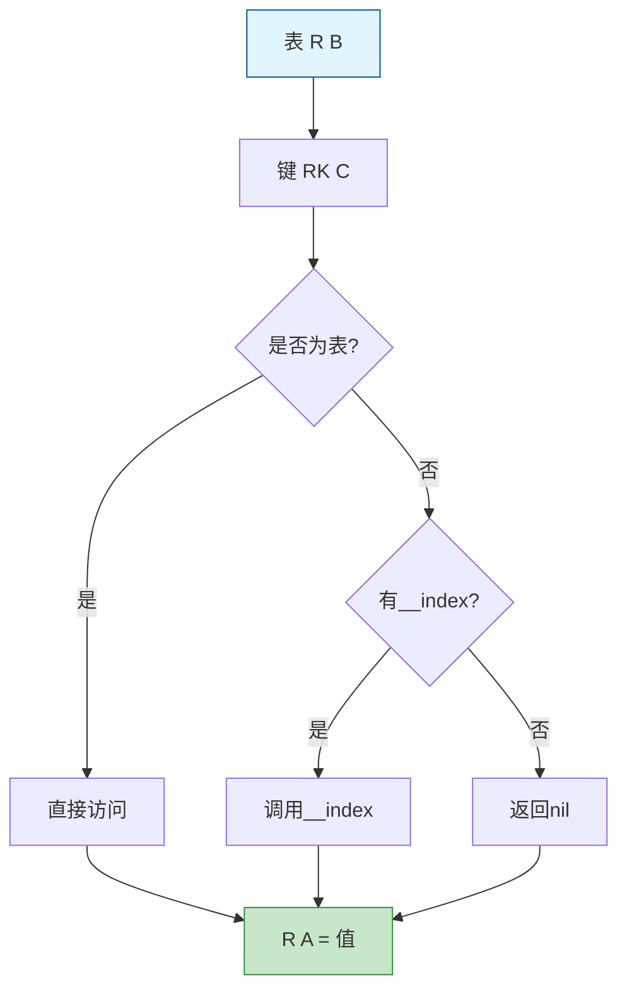

**📖 使用示例**:
```lua
-- Lua代码
local t = {x = 10, y = 20}
local a = t.x
local b = t["y"]

-- 对应字节码
NEWTABLE  0 2 0       ; R(0) = {}
SETTABLE  0 256 257   ; R(0)["x"] = 10
SETTABLE  0 258 259   ; R(0)["y"] = 20
GETTABLE  1 0 256     ; R(1) = R(0)["x"]
GETTABLE  2 0 258     ; R(2) = R(0)["y"]
```

#### OP_SETTABLE (9)
```
格式: SETTABLE A B C  (iABC)
操作: R(A)[RK(B)] := RK(C)
描述: 设置表R(A)中键为RK(B)的值为RK(C)
元方法: 支持__newindex元方法
```

**🔄 执行流程**:
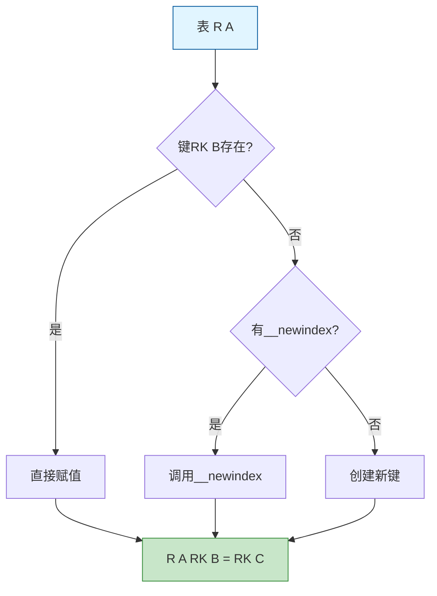

#### OP_NEWTABLE (10)
```
格式: NEWTABLE A B C  (iABC)
操作: R(A) := {} (size = B,C)
描述: 创建新表，数组部分大小为B，散列部分大小为C
实现: B和C使用浮点字节编码(floating point byte)
```

**📖 使用示例**:
```lua
-- Lua代码
local t = {}           -- 空表
local t2 = {1, 2, 3}   -- 数组部分
local t3 = {a=1, b=2}  -- 散列部分

-- 对应字节码
NEWTABLE  0 0 0     ; R(0) = {} (空表)
NEWTABLE  1 3 0     ; R(1) = {} (预留3个数组元素)
NEWTABLE  2 0 2     ; R(2) = {} (预留2个散列元素)
```

#### OP_SETLIST (33)
```
格式: SETLIST A B C  (iABC)
操作: R(A)[(C-1)*FPF+i] := R(A+i), 1 <= i <= B
描述: 批量设置表的数组部分
FPF: LFIELDS_PER_FLUSH = 50
注意: 如果C=0，则真实的C值在下一条指令中
```

**📖 使用示例**:
```lua
-- Lua代码
local t = {1, 2, 3, 4, 5}

-- 对应字节码
NEWTABLE  0 5 0      ; R(0) = {}
LOADK     1 0        ; R(1) = 1
LOADK     2 1        ; R(2) = 2
LOADK     3 2        ; R(3) = 3
LOADK     4 3        ; R(4) = 4
LOADK     5 4        ; R(5) = 5
SETLIST   0 5 1      ; R(0)[1..5] = R(1..5)
```

### 5. 算术运算指令

所有算术运算指令都遵循相同的模式，支持元方法机制。

#### 算术指令一览表

| 指令 | 操作码 | 操作 | 元方法 |
|------|--------|------|--------|
| **OP_ADD** | 12 | `R(A) := RK(B) + RK(C)` | `__add` |
| **OP_SUB** | 13 | `R(A) := RK(B) - RK(C)` | `__sub` |
| **OP_MUL** | 14 | `R(A) := RK(B) * RK(C)` | `__mul` |
| **OP_DIV** | 15 | `R(A) := RK(B) / RK(C)` | `__div` |
| **OP_MOD** | 16 | `R(A) := RK(B) % RK(C)` | `__mod` |
| **OP_POW** | 17 | `R(A) := RK(B) ^ RK(C)` | `__pow` |
| **OP_UNM** | 18 | `R(A) := -R(B)` | `__unm` |

**🔄 算术运算执行流程**:

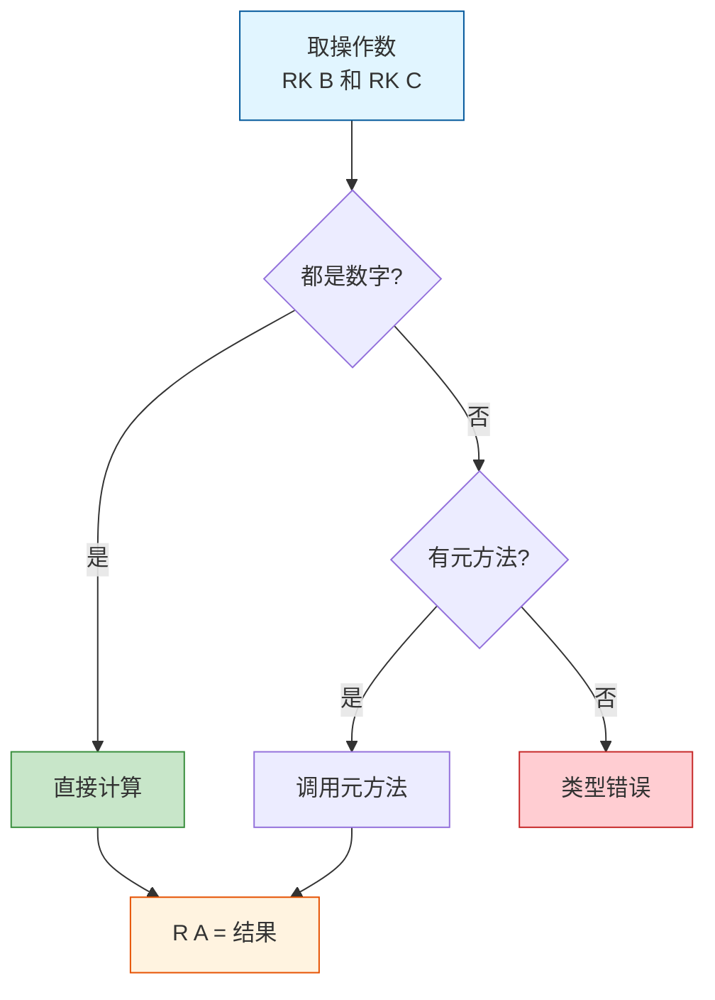

**📖 使用示例**:
```lua
-- Lua代码
local a = 10 + 20
local b = 5 * 3
local c = 2 ^ 8
local d = -a

-- 对应字节码
ADD      0 256 257  ; R(0) = K(0) + K(1) = 10 + 20
MUL      1 258 259  ; R(1) = K(2) * K(3) = 5 * 3
POW      2 260 261  ; R(2) = K(4) ^ K(5) = 2 ^ 8
UNM      3 0        ; R(3) = -R(0)
```

**🎭 元方法示例**:
```lua
-- Lua代码：自定义加法
local mt = {
    __add = function(a, b)
        return {x = a.x + b.x, y = a.y + b.y}
    end
}

local v1 = setmetatable({x=1, y=2}, mt)
local v2 = setmetatable({x=3, y=4}, mt)
local v3 = v1 + v2  -- 调用__add元方法

-- 字节码会生成 ADD 指令，运行时检测到元表并调用__add
```

### 6. 逻辑运算指令

#### OP_NOT (19) - 逻辑非

```
格式: NOT A B  (iABC)
操作: R(A) := not R(B)
描述: 逻辑非运算，false和nil为假，其他为真
```

**🔄 NOT 执行流程**:

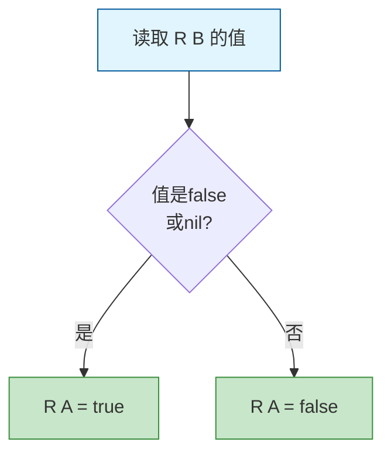

**📖 使用示例**:
```lua
-- Lua代码
local a = not true      -- false
local b = not false     -- true
local c = not nil       -- true
local d = not 0         -- false (0是真值!)

-- 对应字节码
LOADBOOL 0 1 0    ; R(0) = true
NOT      1 0      ; R(1) = not R(0) = false
LOADBOOL 2 0 0    ; R(2) = false
NOT      3 2      ; R(3) = not R(2) = true
```

#### OP_LEN (20) - 取长度

```
格式: LEN A B  (iABC)
操作: R(A) := length of R(B)
描述: 获取字符串或表的长度
元方法: 支持__len元方法（5.2+）
```

**🔄 LEN 执行流程**:

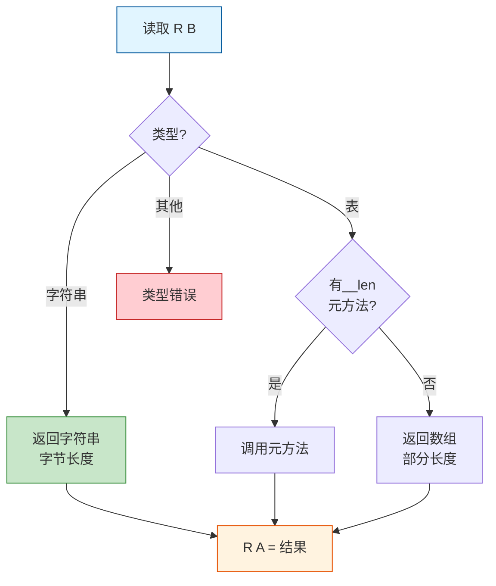

**📖 使用示例**:
```lua
-- Lua代码
local s = "hello"
local t = {1, 2, 3}
local len_s = #s      -- 5
local len_t = #t      -- 3

-- 对应字节码
LOADK    0 -1      ; R(0) = K(0) = "hello"
NEWTABLE 1 3 0     ; R(1) = {}
LOADK    2 -2      ; R(2) = K(1) = 1
SETTABLE 1 257 2   ; R(1)[1] = R(2)
...
LEN      2 0       ; R(2) = #R(0) = 5
LEN      3 1       ; R(3) = #R(1) = 3
```

### 7. 字符串操作指令

#### OP_CONCAT (21) - 字符串连接

```
格式: CONCAT A B C  (iABC)
操作: R(A) := R(B).. ... ..R(C)
描述: 连接B到C之间的所有寄存器值为字符串
元方法: 支持__concat元方法
```

**🔄 CONCAT 执行流程**:

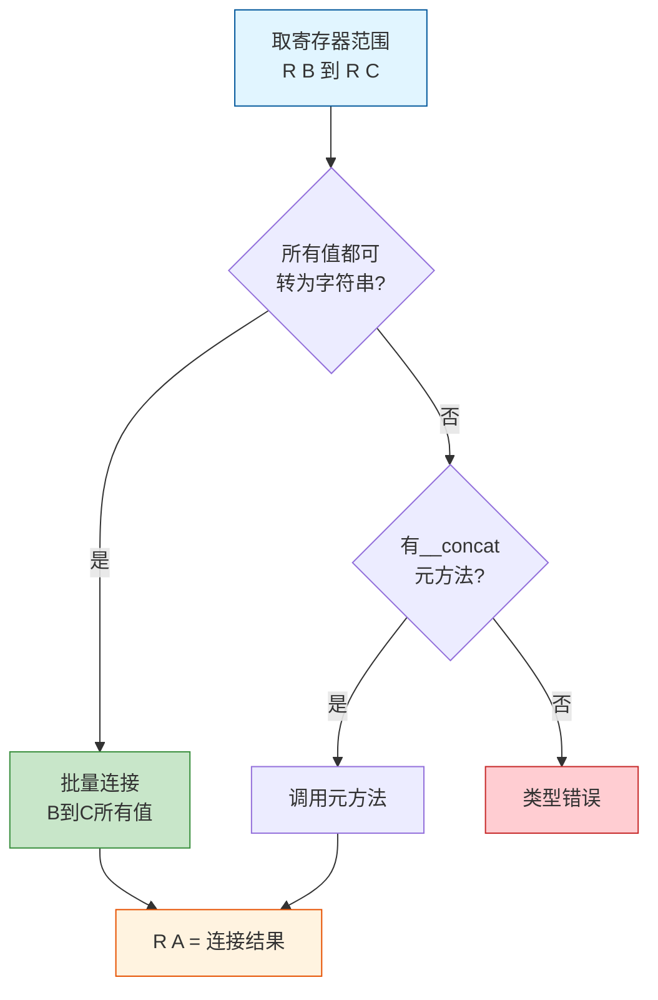

**📖 使用示例**:
```lua
-- Lua代码
local s = "Hello" .. " " .. "World"
local t = "Answer: " .. 42

-- 对应字节码
LOADK    0 -1      ; R(0) = K(0) = "Hello"
LOADK    1 -2      ; R(1) = K(1) = " "
LOADK    2 -3      ; R(2) = K(2) = "World"
CONCAT   0 0 2     ; R(0) = R(0)..R(1)..R(2)

LOADK    3 -4      ; R(3) = K(3) = "Answer: "
LOADK    4 -5      ; R(4) = K(4) = 42
CONCAT   3 3 4     ; R(3) = R(3)..R(4)
```

**⚡ 性能提示**:
- `CONCAT` 可以一次连接多个值（从B到C），避免多次分配
- 示例：`a..b..c..d` 生成单个 `CONCAT A B D` 指令，而不是三个独立的连接操作

### 8. 跳转与比较指令

#### OP_JMP (22) - 无条件跳转

```
格式: JMP sBx  (iAsBx)
操作: pc += sBx
描述: 无条件跳转，sBx是有符号偏移量
范围: sBx为有符号18位，支持±131071的跳转距离
```

**🔄 跳转类型**:

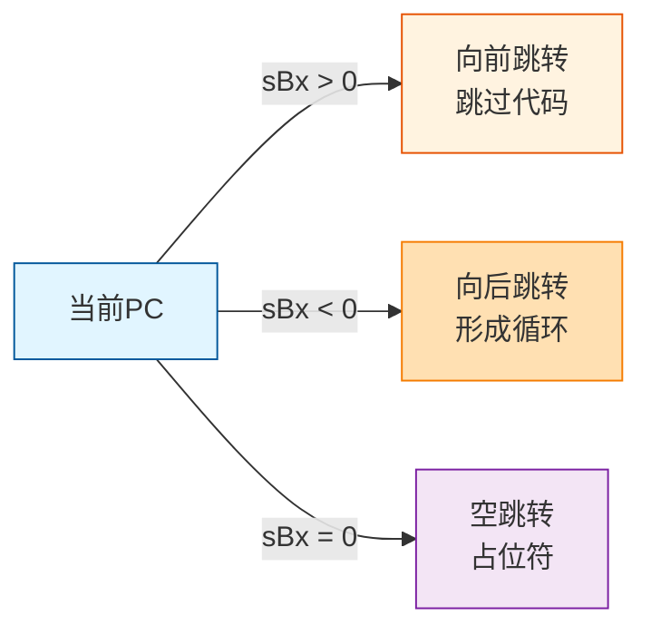

**📖 使用示例**:
```lua
-- Lua代码
while true do
    print("loop")
    break
end

-- 对应字节码
[1] LOADK     0 -1    ; R(0) = K(0) = print
[2] LOADK     1 -2    ; R(1) = K(1) = "loop"
[3] CALL      0 2 1   ; print("loop")
[4] JMP       0 1     ; 跳转到[6]，跳出循环
[5] JMP       0 -4    ; 向后跳转到[2]，继续循环
```

### 9. 比较指令

所有比较指令都遵循相同的模式：如果比较结果与A匹配，则跳过下一条指令（通常是JMP）。

| 指令 | 操作码 | 操作 | 元方法 |
|------|--------|------|--------|
| **OP_EQ** | 23 | `if ((RK(B) == RK(C)) ~= A) then pc++` | `__eq` |
| **OP_LT** | 24 | `if ((RK(B) < RK(C)) ~= A) then pc++` | `__lt` |
| **OP_LE** | 25 | `if ((RK(B) <= RK(C)) ~= A) then pc++` | `__le` |

**🔄 比较指令执行流程**:

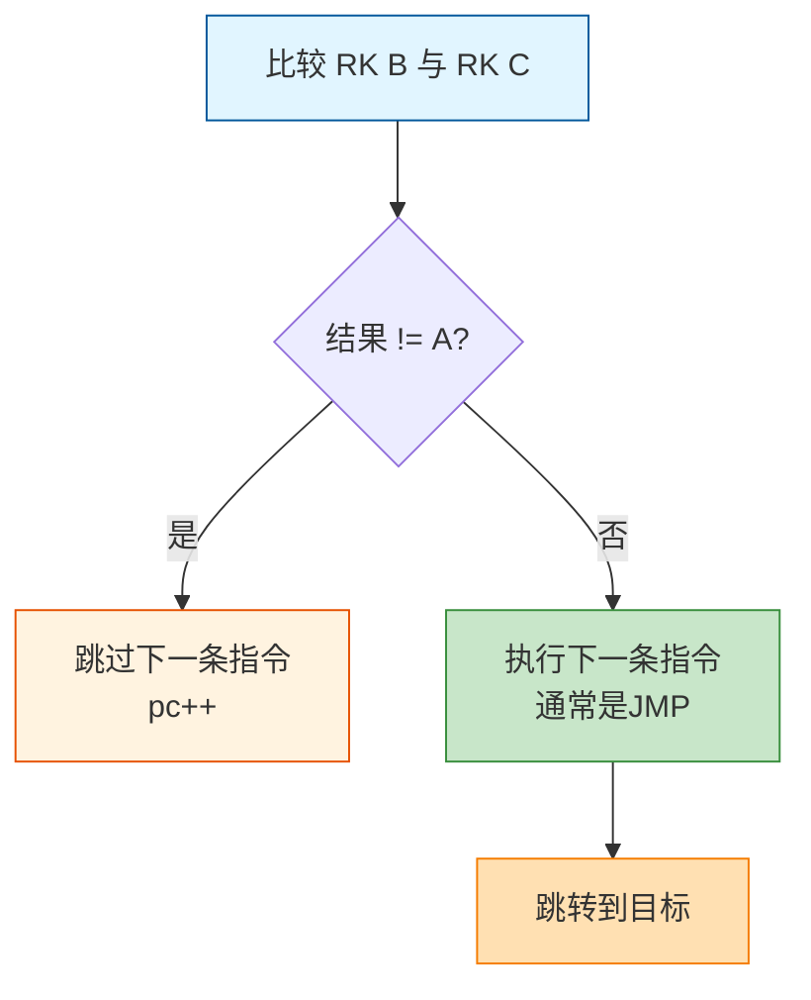

**📖 使用示例**:
```lua
-- Lua代码
if x == 10 then
    print("equal")
else
    print("not equal")
end

-- 对应字节码
[1] EQ        1 0 256  ; if R(0) ~= K(0) then pc++
[2] JMP       0 3      ; 跳转到 else 分支
[3] LOADK     1 -2     ; R(1) = K(1) = print
[4] LOADK     2 -3     ; R(2) = K(2) = "equal"
[5] CALL      1 2 1    ; print("equal")
[6] JMP       0 3      ; 跳过 else
[7] LOADK     1 -2     ; R(1) = print
[8] LOADK     2 -4     ; R(2) = "not equal"
[9] CALL      1 2 1    ; print("not equal")
```

**🎯 比较指令的A参数说明**:
- `A = 0`: 如果条件为 **false** 则跳过下一条指令
- `A = 1`: 如果条件为 **true** 则跳过下一条指令

```lua
-- 示例：不同A值的效果
if a < b then ... end  -- LT 0 ...  (false时跳过JMP)
if not (a < b) then ... end  -- LT 1 ...  (true时跳过JMP)
```

### 10. 测试指令

#### OP_TEST (26) - 布尔测试

```
格式: TEST A C  (iABC)
操作: if not (R(A) <=> C) then pc++
描述: 测试寄存器A的布尔值是否与C匹配
应用: 实现条件跳转和短路逻辑
```

**🔄 TEST 执行流程**:

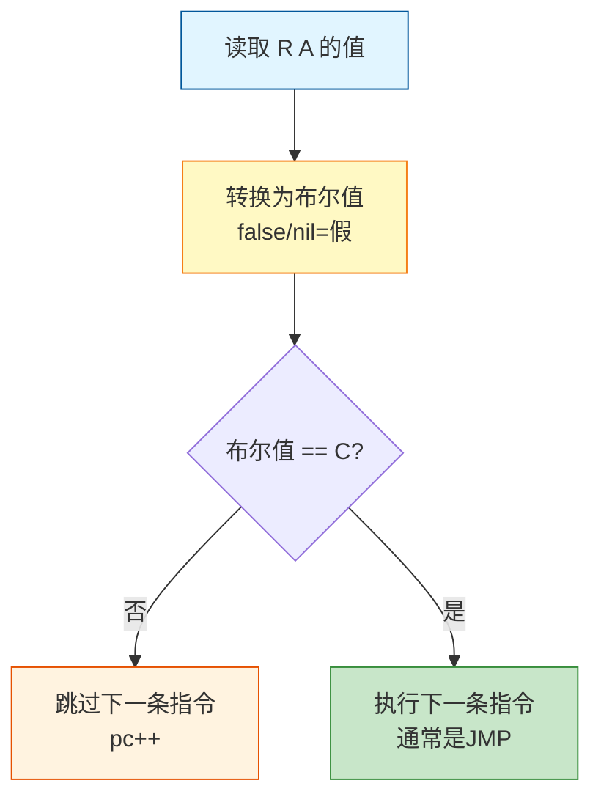

**📖 使用示例**:
```lua
-- Lua代码
if x then
    print("true")
end

-- 对应字节码
TEST      0 0       ; if not R(0) then pc++
JMP       0 3       ; 跳过then分支
LOADK     1 -1      ; R(1) = print
LOADK     2 -2      ; R(2) = "true"
CALL      1 2 1     ; print("true")
```

#### OP_TESTSET (27) - 测试并设置

```
格式: TESTSET A B C  (iABC)
操作: if (R(B) <=> C) then R(A) := R(B) else pc++
描述: 如果R(B)的布尔值与C匹配，则复制到R(A)；否则跳过下一条指令
应用: 实现逻辑运算符 and 和 or 的短路特性
```

**🔄 TESTSET 执行流程**:

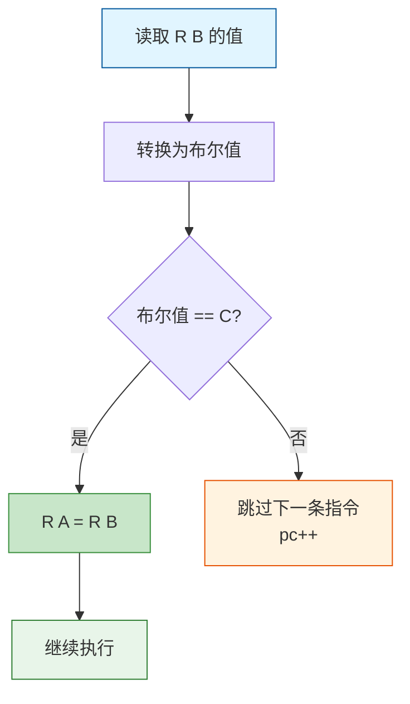

**📖 使用示例**:
```lua
-- Lua代码
local a = x or "default"  -- 如果x为真，用x；否则用"default"

-- 对应字节码
TESTSET   0 1 0      ; if R(1) then R(0) = R(1) else pc++
JMP       0 2        ; 跳转到加载默认值
LOADK     0 -1       ; R(0) = "default"

-- 另一个示例：and运算
local b = x and y

-- 对应字节码
TESTSET   0 1 1      ; if not R(1) then R(0) = R(1) else pc++
JMP       0 1        ; 跳过赋值y
MOVE      0 2        ; R(0) = R(2) = y
```

**🎯 TESTSET的C参数**:
- `C = 0`: 用于 `or` 运算（值为真时赋值）
- `C = 1`: 用于 `and` 运算（值为假时赋值）

### 11. 函数调用与返回指令

#### OP_CALL (28) - 函数调用

```
格式: CALL A B C  (iABC)
操作: R(A), ... ,R(A+C-2) := R(A)(R(A+1), ... ,R(A+B-1))
描述: 调用函数
参数:
  - A: 函数所在寄存器
  - B: 参数个数+1 (0表示使用栈顶，支持可变参数)
  - C: 返回值个数+1 (0表示保留所有返回值)
```

**🔄 CALL 执行流程**:

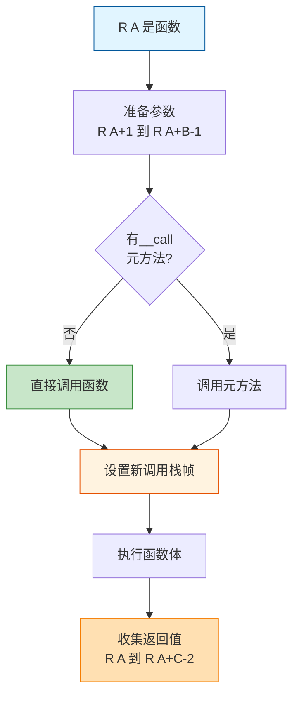

**📖 使用示例**:
```lua
-- Lua代码
local function add(a, b)
    return a + b
end

local result = add(10, 20)

-- 对应字节码
CLOSURE   0 0        ; R(0) = closure(Proto[0])
MOVE      1 0        ; R(1) = R(0) = add
LOADK     2 0        ; R(2) = K(0) = 10
LOADK     3 1        ; R(3) = K(1) = 20
CALL      1 3 2      ; R(1) = R(1)(R(2), R(3))，1个返回值
MOVE      0 1        ; result = R(1)
```

**🎯 特殊情况**:

```lua
-- 可变参数调用 (B = 0)
print(unpack(t))
-- CALL  func 0 1  ; 使用栈顶的所有值作为参数

-- 保留所有返回值 (C = 0)
return func(a, b, c)
-- CALL  func 4 0  ; 保留所有返回值用于return
```

#### OP_TAILCALL (29) - 尾调用优化

```
格式: TAILCALL A B C  (iABC)
操作: return R(A)(R(A+1), ... ,R(A+B-1))
描述: 尾调用，复用当前栈帧，避免栈增长
优化: 实现真正的尾递归，防止栈溢出
```

**🔄 TAILCALL vs CALL 对比**:

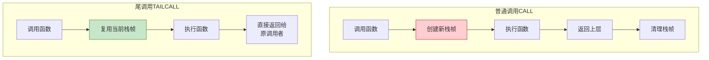

**📖 使用示例**:
```lua
-- Lua代码：尾递归
local function factorial(n, acc)
    if n == 0 then
        return acc
    end
    return factorial(n - 1, n * acc)  -- 尾调用!
end

-- 对应字节码
EQ        1 0 256     ; if n ~= 0 then pc++
JMP       0 2
RETURN    1 2         ; return acc
JMP       0 0

GETGLOBAL 2 0         ; R(2) = factorial
SUB       3 0 257     ; R(3) = n - 1
MUL       4 0 1       ; R(4) = n * acc
TAILCALL  2 3 0       ; return factorial(R(3), R(4))
RETURN    2 0         ; 配合TAILCALL使用
```

**⚡ 尾调用优化的条件**:
1. 函数调用是 `return` 语句的唯一表达式
2. 调用结果直接返回，不进行任何额外计算
3. 示例：`return f(x)` ✅  vs  `return f(x) + 1` ❌

#### OP_RETURN (30) - 函数返回

```
格式: RETURN A B  (iABC)
操作: return R(A), ... ,R(A+B-2)
描述: 从函数返回
参数:
  - A: 第一个返回值的寄存器
  - B: 返回值个数+1 (0表示返回栈顶所有值)
```

**🔄 RETURN 执行流程**:

```mermaid
flowchart TD
    A[收集返回值<br/>R A 到 R A+B-2 ] --> B[恢复调用者栈帧]
    B --> C[将返回值复制到<br/>调用者栈]
    C --> D[继续执行<br/>调用者代码]
    
    style A fill:#e1f5ff,stroke:#01579b
    style B fill:#fff3e0,stroke:#e65100
    style C fill:#c8e6c9,stroke:#388e3c
    style D fill:#e8f5e9,stroke:#2e7d32
```

**📖 使用示例**:
```lua
-- Lua代码
function multi_return()
    return 1, 2, 3
end

function no_return()
    -- 隐式返回
end

-- 对应字节码
-- multi_return
LOADK     0 0        ; R(0) = 1
LOADK     1 1        ; R(1) = 2
LOADK     2 2        ; R(2) = 3
RETURN    0 4        ; return R(0), R(1), R(2) (3个值)

-- no_return
RETURN    0 1        ; return (0个值)
```
  - A: 第一个返回值所在寄存器
  - B: 返回值个数+1 (0表示返回到top)
```

### 12. 方法调用指令

#### OP_SELF (11)
```
格式: SELF A B C  (iABC)
操作: R(A+1) := R(B); R(A) := R(B)[RK(C)]
描述: 为方法调用准备self参数
实现: table:method() 语法糖的底层实现
```

### 12. 循环指令

#### OP_FORLOOP (31) & OP_FORPREP (32) - 数值for循环

```
FORPREP A sBx  (iAsBx)
操作: R(A) -= R(A+2); pc += sBx
描述: 数值for循环的初始化，预减步长

FORLOOP A sBx  (iAsBx)
操作: R(A) += R(A+2); if R(A) <?= R(A+1) then { pc += sBx; R(A+3) = R(A) }
描述: 数值for循环的迭代和检测

寄存器布局:
  - R(A): 内部计数器 (index)
  - R(A+1): 限制值 (limit)
  - R(A+2): 步长 (step)
  - R(A+3): 用户循环变量
```

**🔄 数值for循环执行流程**:

```mermaid
flowchart TD
    A[初始化:<br/>index, limit, step] --> B[FORPREP<br/>index -= step]
    B --> C[跳转到循环入口]
    C --> D[FORLOOP<br/>index += step]
    D --> E{step>0?<br/>index<=limit<br/>or<br/>step<0?<br/>index>=limit}
    E -->|是| F[循环变量=index<br/>执行循环体]
    E -->|否| G[退出循环]
    F --> D
    
    style A fill:#e1f5ff,stroke:#01579b
    style B fill:#fff3e0,stroke:#e65100
    style D fill:#ffe0b2,stroke:#f57c00
    style F fill:#c8e6c9,stroke:#388e3c
    style G fill:#ffcdd2,stroke:#c62828
```

**📖 使用示例**:
```lua
-- Lua代码
for i = 1, 10, 2 do
    print(i)
end

-- 对应字节码
[1] LOADK     0 0        ; R(0) = 1 (初始值)
[2] LOADK     1 1        ; R(1) = 10 (限制值)
[3] LOADK     2 2        ; R(2) = 2 (步长)
[4] FORPREP   0 3        ; R(0) = 1-2 = -1; 跳转到[8]
[5] GETGLOBAL 4 0        ; R(4) = print
[6] MOVE      5 3        ; R(5) = R(3) = i
[7] CALL      4 2 1      ; print(i)
[8] FORLOOP   0 -4       ; R(0) += 2; if R(0) <= 10 then 跳转到[5]
```

**🎯 为什么要FORPREP预减？**
- 确保第一次 `FORLOOP` 时 `index + step` 等于初始值
- 统一循环检测逻辑，简化VM实现

#### OP_TFORLOOP (34) - 泛型for循环

```
格式: TFORLOOP A C  (iABC)
操作: R(A+3), ... ,R(A+2+C) := R(A)(R(A+1), R(A+2))
      if R(A+3) ~= nil then R(A+2) = R(A+3) else pc++
描述: 调用迭代器函数，更新状态和循环变量

寄存器布局:
  - R(A): 迭代器函数 (iterator function)
  - R(A+1): 不变状态 (invariant state)
  - R(A+2): 控制变量 (control variable)
  - R(A+3)...R(A+2+C): 循环变量
```

**🔄 泛型for循环执行流程**:

```mermaid
flowchart TD
    A[设置迭代器三元组:<br/>func, state, var] --> B[TFORLOOP<br/>调用迭代器]
    B --> C[func state, var]
    C --> D{返回值<br/>!= nil?}
    D -->|是| E[更新控制变量<br/>执行循环体]
    D -->|否| F[跳过JMP<br/>退出循环]
    E --> G[JMP跳回TFORLOOP]
    G --> B
    
    style A fill:#e1f5ff,stroke:#01579b
    style B fill:#fff3e0,stroke:#e65100
    style C fill:#ffe0b2,stroke:#f57c00
    style E fill:#c8e6c9,stroke:#388e3c
    style F fill:#ffcdd2,stroke:#c62828
```

**📖 使用示例**:
```lua
-- Lua代码
for k, v in pairs(t) do
    print(k, v)
end

-- 对应字节码
GETGLOBAL 0 0        ; R(0) = pairs
MOVE      1 2        ; R(1) = t
CALL      0 2 4      ; R(0), R(1), R(2) = pairs(t)
JMP       0 4        ; 跳转到TFORLOOP
GETGLOBAL 5 1        ; R(5) = print
MOVE      6 3        ; R(6) = k
MOVE      7 4        ; R(7) = v
CALL      5 3 1      ; print(k, v)
TFORLOOP  0 2        ; k, v = next(state, ctrl_var)
JMP       0 -5       ; 跳回循环体
```

**🎯 迭代器三元组**:
1. **迭代器函数**: 每次迭代调用，返回下一个值
2. **不变状态**: 通常是表本身
3. **控制变量**: 当前迭代的键/索引
格式: TFORLOOP A C  (iABC)
操作: R(A+3), ... ,R(A+2+C) := R(A)(R(A+1), R(A+2));
      if R(A+3) ~= nil then R(A+2) = R(A+3) else pc++
描述: 通用for循环 (for k,v in pairs(t))
寄存器布局:
  - R(A): 迭代器函数
  - R(A+1): 状态
  - R(A+2): 控制变量
  - R(A+3+): 循环变量
```

### 13. 闭包与Upvalue指令

#### OP_CLOSURE (36) - 创建闭包

```
格式: CLOSURE A Bx  (iABx)
操作: R(A) := closure(KPROTO[Bx], R(A), ... ,R(A+n))
描述: 根据函数原型创建闭包对象
实现: 后续紧跟的MOVE/GETUPVAL指令指定upvalue的来源
```

**🔄 闭包创建流程**:

```mermaid
flowchart TD
    A[获取函数原型<br/>KPROTO Bx ] --> B[创建新闭包对象]
    B --> C[处理后续指令<br/>绑定upvalue]
    C --> D{upvalue<br/>类型?}
    D -->|在栈上| E[MOVE指令<br/>标记需关闭]
    D -->|已关闭| F[GETUPVAL指令<br/>引用外层upvalue]
    E --> G[R A = 闭包]
    F --> G
    
    style A fill:#e1f5ff,stroke:#01579b
    style B fill:#fff3e0,stroke:#e65100
    style C fill:#ffe0b2,stroke:#f57c00
    style G fill:#c8e6c9,stroke:#388e3c
```

**📖 使用示例**:
```lua
-- Lua代码：简单闭包
local function outer(x)
    return function(y)
        return x + y
    end
end

-- 对应字节码 (outer函数)
LOADK     0 0        ; R(0) = x
CLOSURE   1 0        ; R(1) = closure(inner函数)
MOVE      0 0        ; upvalue[0] = R(0) (捕获x)
RETURN    1 2        ; return R(1)

-- 内层函数字节码
GETUPVAL  0 0        ; R(0) = upvalue[0] = x
ADD       0 0 1      ; R(0) = x + y
RETURN    0 2        ; return R(0)
```

**🎯 多级嵌套闭包**:
```lua
-- Lua代码：三级嵌套
local function f1(a)
    return function f2(b)
        return function f3(c)
            return a + b + c
        end
    end
end

-- f1捕获: 无
-- f2捕获: a (来自f1的局部变量)
-- f3捕获: a (来自f2的upvalue), b (来自f2的局部变量)
```

#### OP_GETUPVAL (4) - 读取Upvalue

```
格式: GETUPVAL A B  (iABC)
操作: R(A) := UpValue[B]
描述: 将upvalue的值加载到寄存器
```

**📖 使用示例**:
```lua
-- 见上面闭包示例中的 GETUPVAL 0 0
```

#### OP_SETUPVAL (9) - 设置Upvalue

```
格式: SETUPVAL A B  (iABC)
操作: UpValue[B] := R(A)
描述: 将寄存器的值存储到upvalue
```

**📖 使用示例**:
```lua
-- Lua代码
local function counter()
    local count = 0
    return function()
        count = count + 1
        return count
    end
end

-- 内层函数字节码
GETUPVAL  0 0        ; R(0) = count
ADD       0 0 256    ; R(0) = count + 1
SETUPVAL  0 0        ; count = R(0)
RETURN    0 2        ; return R(0)
```

#### OP_CLOSE (35) - 关闭Upvalue

```
格式: CLOSE A  (iABC)
操作: close all variables in the stack up to (>=) R(A)
描述: 将栈上的局部变量关闭为upvalue
触发: 离开作用域时自动插入
```

**🔄 Upvalue关闭流程**:

```mermaid
flowchart TD
    A[局部变量在栈上] --> B{被闭包<br/>捕获?}
    B -->|是| C[CLOSE指令]
    B -->|否| D[直接释放]
    C --> E[分配upvalue对象]
    E --> F[复制变量值]
    F --> G[更新闭包引用]
    G --> H[栈上变量失效]
    
    style A fill:#e1f5ff,stroke:#01579b
    style C fill:#fff3e0,stroke:#e65100
    style E fill:#ffe0b2,stroke:#f57c00
    style G fill:#c8e6c9,stroke:#388e3c
```

**📖 使用示例**:
```lua
-- Lua代码
do
    local x = 10
    f = function() return x end
end  -- 此处插入CLOSE指令

-- 对应字节码
LOADK     0 0        ; R(0) = 10
CLOSURE   1 0        ; f = closure(...)
MOVE      0 0        ; upvalue[0] = R(0)
SETGLOBAL 1 0        ; _G["f"] = R(1)
CLOSE     0          ; 关闭R(0)及以上的局部变量
```

### 14. 方法调用与可变参数指令

#### OP_SELF (11) - 方法调用准备

```
格式: SELF A B C  (iABC)
操作: R(A+1) := R(B); R(A) := R(B)[RK(C)]
描述: 为方法调用准备self参数
实现: table:method() 语法糖的底层实现
```

**🔄 SELF 执行流程**:

```mermaid
flowchart TD
    A[读取对象 R B ] --> B[R A+1 = R B <br/>保存对象作为self]
    B --> C[R A = R B RK C <br/>获取方法]
    C --> D[准备调用:<br/>R A R A+1, ... ]
    
    style A fill:#e1f5ff,stroke:#01579b
    style B fill:#fff3e0,stroke:#e65100
    style C fill:#ffe0b2,stroke:#f57c00
    style D fill:#c8e6c9,stroke:#388e3c
```

**📖 使用示例**:
```lua
-- Lua代码
obj:method(arg1, arg2)

-- 等价于
obj.method(obj, arg1, arg2)

-- 对应字节码
SELF      0 1 256    ; R(1) = obj; R(0) = obj["method"]
LOADK     2 0        ; R(2) = arg1
LOADK     3 1        ; R(3) = arg2
CALL      0 4 1      ; R(0)(R(1), R(2), R(3))
```

#### OP_VARARG (37) - 可变参数展开

```
格式: VARARG A B  (iABC)
操作: R(A), R(A+1), ..., R(A+B-2) = vararg
描述: 展开可变参数 (...)
参数:
  - A: 目标寄存器起始位置
  - B: 展开的参数个数+1 (0表示展开所有)
```

**📖 使用示例**:
```lua
-- Lua代码
local function vararg_func(...)
    local a, b, c = ...
    return ...
end

-- 对应字节码
VARARG    0 4        ; R(0), R(1), R(2) = ... (3个值)
VARARG    3 0        ; R(3)... = ... (所有值)
RETURN    3 0        ; return R(3)...
```

**🎯 VARARG参数B的含义**:
- `B = n+1`: 展开n个参数
- `B = 0`: 展开所有可变参数（数量未知）

```lua
-- 示例：固定数量 vs 全部展开
function f1(...)
    local a = ...         -- VARARG A 2 (1个值)
    local b, c = ...      -- VARARG A 3 (2个值)
    return ...            -- VARARG A 0 (所有值)
end
```

## 🎯 综合示例：完整函数编译

让我们通过一个包含多种指令的完整示例来理解字节码生成：

```lua
-- Lua源代码
local function fibonacci(n)
    if n <= 1 then
        return n
    else
        return fibonacci(n - 1) + fibonacci(n - 2)
    end
end

local result = fibonacci(10)
print(result)
```

**📊 完整字节码分析**:

```
; fibonacci函数字节码
function <test.lua:1,7> (9 instructions at 0x...)
0 params, 2 slots, 0 upvalues, 1 local, 2 constants, 0 functions
    1 [2] LE        1 0 257    ; if not (R(0) <= K(1)=1) then pc++
    2 [2] JMP       0 1        ; 跳转到else分支
    3 [3] RETURN    0 2        ; return n
    4 [2] JMP       0 5        ; 跳过else分支
    5 [5] GETGLOBAL 1 0        ; R(1) = _G["fibonacci"]
    6 [5] SUB       2 0 257    ; R(2) = n - 1
    7 [5] CALL      1 2 2      ; R(1) = fibonacci(R(2))
    8 [5] GETGLOBAL 2 0        ; R(2) = _G["fibonacci"]
    9 [5] SUB       3 0 258    ; R(3) = n - 2
   10 [5] CALL      2 2 2      ; R(2) = fibonacci(R(3))
   11 [5] ADD       1 1 2      ; R(1) = R(1) + R(2)
   12 [5] RETURN    1 2        ; return R(1)
   13 [7] RETURN    0 1        ; 隐式return

; 主代码块字节码
main <test.lua:0,0> (7 instructions at 0x...)
0 params, 4 slots, 0 upvalues, 2 locals, 3 constants, 1 function
    1 [7] CLOSURE   0 0        ; R(0) = closure(fibonacci函数)
    2 [7] SETGLOBAL 0 0        ; _G["fibonacci"] = R(0)
    3 [9] GETGLOBAL 0 0        ; R(0) = _G["fibonacci"]
    4 [9] LOADK     1 1        ; R(1) = K(1) = 10
    5 [9] CALL      0 2 2      ; R(0) = fibonacci(10)
    6 [9] MOVE      1 0        ; result = R(0)
    7 [10] GETGLOBAL 2 2       ; R(2) = _G["print"]
    8 [10] MOVE      3 1       ; R(3) = result
    9 [10] CALL      2 2 1     ; print(result)
   10 [10] RETURN    0 1       ; 程序结束
```

**🔄 执行流程可视化**:

```mermaid
flowchart TD
    A[主程序开始] --> B[CLOSURE<br/>创建fibonacci闭包]
    B --> C[SETGLOBAL<br/>设为全局函数]
    C --> D[GETGLOBAL<br/>获取fibonacci]
    D --> E[LOADK<br/>加载参数10]
    E --> F[CALL<br/>调用fibonacci 10 ]
    
    F --> G[fibonacci内部]
    G --> H{LE 比较<br/>n <= 1?}
    H -->|是| I[RETURN n]
    H -->|否| J[递归调用]
    J --> K[fibonacci n-1]
    J --> L[fibonacci n-2]
    K --> M[ADD<br/>相加结果]
    L --> M
    M --> N[RETURN 结果]
    
    N --> O[主程序继续]
    O --> P[GETGLOBAL print]
    P --> Q[CALL print]
    Q --> R[程序结束]
    
    style A fill:#e1f5ff,stroke:#01579b
    style F fill:#fff3e0,stroke:#e65100
    style H fill:#ffe0b2,stroke:#f57c00
    style M fill:#c8e6c9,stroke:#388e3c
    style R fill:#ffcdd2,stroke:#c62828
```

## 📋 指令模式和属性

每个指令都有相关的模式信息，存储在 `luaP_opmodes` 数组中：

```c
// 位域定义
bits 0-1: 指令格式 (iABC, iABx, iAsBx)
bits 2-3: C参数模式 (OpArgN, OpArgU, OpArgR, OpArgK)
bits 4-5: B参数模式 (OpArgN, OpArgU, OpArgR, OpArgK)
bit 6:    是否设置寄存器A
bit 7:    是否为测试指令
```

### 参数模式说明
- **OpArgN**: 参数未使用
- **OpArgU**: 参数被使用但不是寄存器/常量
- **OpArgR**: 参数是寄存器或跳转偏移
- **OpArgK**: 参数是常量或寄存器/常量(RK)

### 指令分类表

| 类别 | 指令列表 | 特点 |
|------|----------|------|
| **数据移动** | MOVE, LOADK, LOADBOOL, LOADNIL | 纯数据传输，无副作用 |
| **全局变量** | GETGLOBAL, SETGLOBAL | 访问全局环境表 |
| **表操作** | GETTABLE, SETTABLE, NEWTABLE, SETLIST, SELF | 支持元方法 |
| **Upvalue** | GETUPVAL, SETUPVAL, CLOSE | 闭包支持 |
| **算术运算** | ADD, SUB, MUL, DIV, MOD, POW, UNM | 支持元方法 |
| **逻辑运算** | NOT, LEN, CONCAT | 类型转换 |
| **比较跳转** | EQ, LT, LE, TEST, TESTSET | 条件执行 |
| **跳转** | JMP | 控制流 |
| **函数调用** | CALL, TAILCALL, RETURN | 栈帧管理 |
| **循环** | FORLOOP, FORPREP, TFORLOOP | 迭代控制 |
| **闭包** | CLOSURE | 函数创建 |
| **可变参数** | VARARG | 参数展开 |

## ⚡ 虚拟机执行流程

### 主循环结构
```c
void luaV_execute(lua_State *L, int nexeccalls) {
  // 初始化执行环境
  LClosure *cl = &clvalue(L->ci->func)->l;
  StkId base = L->base;           // 当前栈基址
  TValue *k = cl->p->k;           // 常量表
  const Instruction *pc = L->savedpc; // 程序计数器
  
  // 主执行循环
  for (;;) {
    const Instruction i = *pc++;   // 取指令并递增PC
    StkId ra = RA(i);             // 计算寄存器A的地址
    
    switch (GET_OPCODE(i)) {
      case OP_MOVE: /* ... */ break;
      // ... 其他指令处理
    }
  }
}
```

### 关键宏定义
```c
#define RA(i)   (base+GETARG_A(i))        // 寄存器A地址
#define RB(i)   (base+GETARG_B(i))        // 寄存器B地址  
#define RC(i)   (base+GETARG_C(i))        // 寄存器C地址
#define RKB(i)  (ISK(B) ? k+INDEXK(B) : base+B)  // B参数(寄存器或常量)
#define RKC(i)  (ISK(C) ? k+INDEXK(C) : base+C)  // C参数(寄存器或常量)
#define KBx(i)  (k+GETARG_Bx(i))          // 常量表索引Bx
```

## 🚀 指令优化技术

### 1. 常量折叠
编译器在生成字节码时会进行常量折叠优化，将编译时可确定的表达式直接计算为常量。

### 2. 跳转优化
- 使用有符号偏移量，支持向前和向后跳转
- 条件跳转指令通常与无条件跳转配合使用

### 3. 寄存器重用
Lua编译器会尽可能重用寄存器，减少栈空间占用。

### 4. 尾调用优化
`OP_TAILCALL` 指令实现真正的尾调用优化，避免栈溢出。

## 元方法支持

许多指令支持元方法机制：

### 算术运算元方法
- `__add`, `__sub`, `__mul`, `__div`, `__mod`, `__pow`, `__unm`

### 比较运算元方法  
- `__eq`, `__lt`, `__le`

### 表操作元方法
- `__index`, `__newindex`, `__len`

### 字符串操作元方法
- `__concat`

## 指令执行的错误处理

许多指令使用 `Protect` 宏来处理可能的错误：

```c
#define Protect(x) { L->savedpc = pc; {x;}; base = L->base; }
```

这个宏确保：
1. 保存当前PC位置

```lua
-- 优化前
local x = 10 + 20 * 3

-- 对应字节码（未优化）
LOADK  0 0   ; R(0) = 10
LOADK  1 1   ; R(1) = 20
LOADK  2 2   ; R(2) = 3
MUL    1 1 2 ; R(1) = 20 * 3
ADD    0 0 1 ; R(0) = 10 + R(1)

-- 对应字节码（已优化）
LOADK  0 0   ; R(0) = 70 (编译时已计算)
```

### 2. 短路求值优化

```lua
-- Lua代码
local result = x or "default"

-- 对应字节码（使用TESTSET实现短路）
TESTSET   0 1 0   ; if R(1) then R(0) = R(1) else pc++
JMP       0 2     ; 跳转到加载默认值
LOADK     0 -1    ; R(0) = "default"
```

### 3. 尾调用优化

```lua
-- 尾递归函数会被优化为TAILCALL
-- 复用栈帧，防止栈溢出
local function factorial(n, acc)
    if n == 0 then return acc end
    return factorial(n - 1, n * acc)  -- 尾调用!
end
```

### 4. 批量指令优化

**CONCAT多值连接**:
```lua
s = a .. b .. c .. d  -- 生成单个CONCAT指令，而非多次连接
```

**SETLIST批量初始化**:
```lua
t = {1,2,3,4,5}  -- 使用SETLIST一次设置多个数组元素
```

## 🎓 调试与分析工具

### 使用luac查看字节码

```bash
# 编译Lua脚本并查看字节码
$ luac -l script.lua

# 查看带注释的详细字节码
$ luac -l -l script.lua
```

### 字节码输出格式解读

```
[line] OPCODE  A B C  ; 注释说明
```

- **[line]**: 源代码行号
- **OPCODE**: 指令名称
- **A B C**: 指令参数
- **注释**: 指令操作说明

**示例输出**:
```
1 [2] LOADK     0 -1   ; R(0) = K(0) = 10
2 [2] LOADK     1 -2   ; R(1) = K(1) = 20
3 [2] ADD       0 0 1  ; R(0) = R(0) + R(1)
4 [2] RETURN    0 2    ; return R(0)
5 [3] RETURN    0 1    ; 
```

## 📊 性能考虑

### 1. 基于寄存器的优势

**栈式VM vs 寄存器式VM**:

```mermaid
flowchart LR
    subgraph 栈式VM
    A1[PUSH 10] --> B1[PUSH 20]
    B1 --> C1[ADD]
    C1 --> D1[POP结果]
    end
    
    subgraph 寄存器式VM
    A2[LOADK R0, 10] --> B2[LOADK R1, 20]
    B2 --> C2[ADD R0, R0, R1]
    end
    
    style C1 fill:#ffcdd2,stroke:#c62828
    style C2 fill:#c8e6c9,stroke:#388e3c
```

**优势**:
- ✅ 减少数据移动（无需频繁push/pop）
- ✅ 指令数量更少（栈式需4条，寄存器式3条）
- ✅ 局部性更好（寄存器直接引用）

### 2. 指令密度优化

**32位指令格式平衡**:
- 6位操作码：支持64种指令（实际使用38种）
- 8位A参数：256个寄存器
- 9位B/C参数 或 18位Bx参数：足够常量表索引

### 3. 元方法性能开销

```lua
-- 无元方法：直接运算
local a = 10 + 20  -- 快速路径

-- 有元方法：函数调用开销
local mt = {__add = function(a, b) return a.v + b.v end}
local obj1 = setmetatable({v=10}, mt)
local obj2 = setmetatable({v=20}, mt)
local c = obj1 + obj2  -- 慢速路径（需调用__add）
```

### 4. 局部变量 vs 全局变量

**性能对比**:

| 操作 | 指令 | 性能 |
|------|------|------|
| 局部变量读取 | `MOVE` | ⚡ 极快（直接寄存器访问） |
| 全局变量读取 | `GETGLOBAL` + 表查找 | 🐌 较慢（哈希表查找） |
| Upvalue读取 | `GETUPVAL` | ⚡⚡ 快（间接访问） |

**优化建议**:
```lua
-- 缓存频繁访问的全局变量
local sin, cos = math.sin, math.cos
for i = 1, 1000000 do
    sin(i)  -- 快！使用局部变量
    cos(i)
end
```

## 🔍 常见模式识别

### 1. if-else 模式

```lua
if condition then
    action1()
else
    action2()
end
```

**字节码模式**:
```
TEST/EQ/LT/LE  ; 测试条件
JMP  skip_then ; 不满足则跳过then分支
...            ; then分支代码
JMP  skip_else ; 跳过else分支
...            ; else分支代码
```

### 2. while循环模式

```lua
while condition do
    body()
end
```

**字节码模式**:
```
[loop_start]
TEST       ; 测试条件
JMP  exit  ; 不满足则退出
...        ; 循环体
JMP  loop_start  ; 跳回开始
[exit]
```

### 3. 数值for循环模式

```lua
for i = start, limit, step do
    body(i)
end
```

**字节码模式**:
```
LOADK      ; 加载start, limit, step
FORPREP    ; 初始化（预减）
[loop_body]
...        ; 循环体
FORLOOP    ; 递增并检测
```

## 📝 总结

### 指令集特点

Lua 5.1的指令集设计简洁而高效，包含**38条指令**，涵盖了：

| 类别 | 数量 | 代表指令 |
|------|------|----------|
| 🔄 **数据移动** | 4条 | MOVE, LOADK, LOADBOOL, LOADNIL |
| 🌐 **全局/Upvalue** | 4条 | GETGLOBAL, SETGLOBAL, GETUPVAL, SETUPVAL |
| 📊 **表操作** | 5条 | GETTABLE, SETTABLE, NEWTABLE, SELF, SETLIST |
| ➕ **算术运算** | 7条 | ADD, SUB, MUL, DIV, MOD, POW, UNM |
| 🔤 **字符串/逻辑** | 3条 | NOT, LEN, CONCAT |
| 🔀 **比较跳转** | 6条 | EQ, LT, LE, TEST, TESTSET, JMP |
| 📞 **函数调用** | 3条 | CALL, TAILCALL, RETURN |
| 🔁 **循环** | 3条 | FORLOOP, FORPREP, TFORLOOP |
| 📦 **闭包** | 2条 | CLOSURE, CLOSE |
| ⚙️ **可变参数** | 1条 | VARARG |

### 设计原则

1. **简洁性**: 仅38条指令，易于实现和优化
2. **高效性**: 基于寄存器，减少数据移动
3. **灵活性**: RK参数机制，一条指令支持寄存器/常量
4. **完备性**: 覆盖所有Lua语言特性
5. **可扩展**: 元方法机制提供无限扩展能力

### 性能要点

- ✅ **局部变量优于全局变量** - 直接寄存器访问
- ✅ **缓存全局函数** - 避免重复查表
- ✅ **尾调用优化** - 防止栈溢出
- ✅ **避免元方法热路径** - 函数调用开销大
- ✅ **批量操作** - CONCAT, SETLIST利用批量指令

### 学习建议

1. **使用luac -l** - 查看实际生成的字节码
2. **对比源码** - 理解编译器如何翻译语法
3. **测试边界情况** - 可变参数、多返回值等
4. **阅读VM源码** - `lvm.c`中的指令实现
5. **性能测试** - 对比不同写法的字节码差异

---

**参考资料**:
- 📖 Lua 5.1 Reference Manual
- 🔧 lopcodes.h - 指令定义
- 🖥️ lvm.c - 虚拟机实现
- 📘 "A No-Frills Introduction to Lua 5.1 VM Instructions" by Kein-Hong Man
