# 📊 Lua 5.1.5 表实现机制深度解析 (ltable.c)

> **学习目标**：掌握Lua表的混合数据结构设计，理解数组+哈希的优化策略，深入分析动态扩容算法和性能特征。

## 🎯 模块概述

Lua 的表 (Table) 是整个语言中**最核心的数据结构**，它巧妙地将数组和哈希表的优点结合在一起，实现了一种**混合式数据结构**。这种设计使得表既能提供数组的高效顺序访问，又能支持哈希表的灵活键值映射。

### 🏗️ 核心设计理念

1. **混合架构**：数组部分处理整数索引，哈希部分处理任意键值
2. **动态优化**：根据使用模式自动调整数组和哈希的大小比例
3. **内存效率**：最小化内存占用，最大化访问性能
4. **缓存友好**：数据布局优化，提高CPU缓存命中率

### 📊 表的混合架构可视化

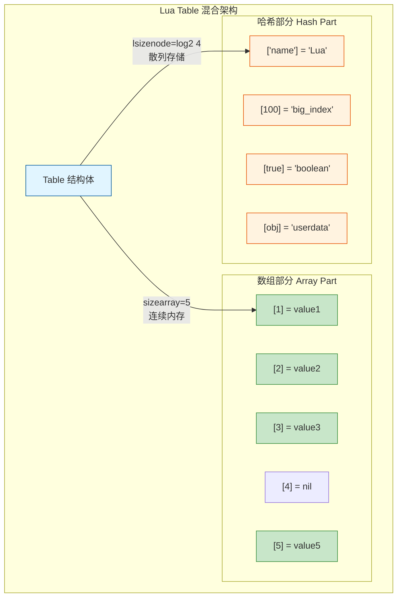

### 🎯 键值分配策略

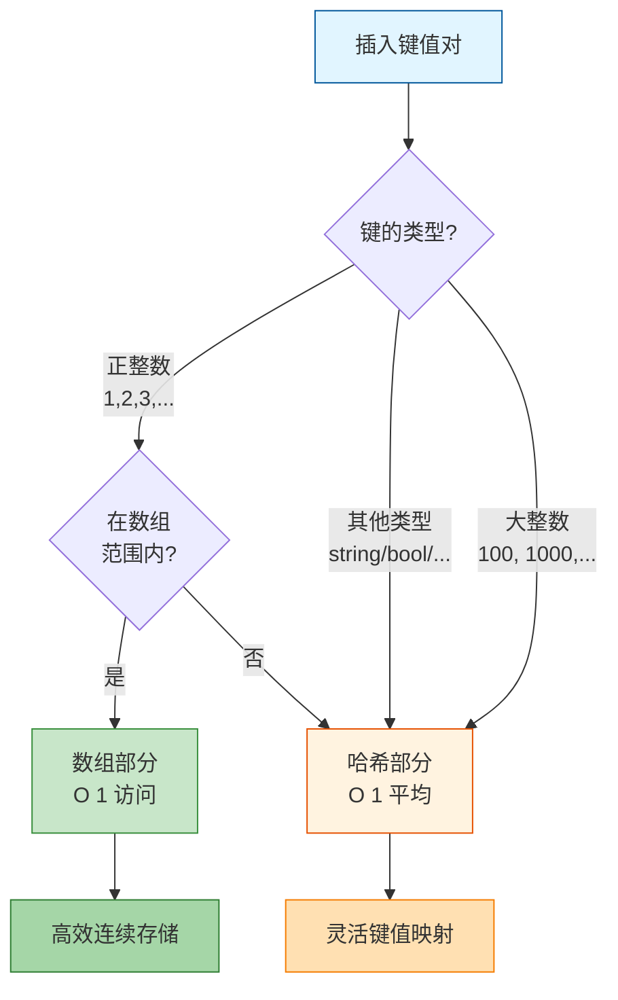

**📖 实际示例**:
```lua
-- 创建混合表
local t = {
    -- 数组部分：正整数索引 [1, 2, 3, 4, 5]
    "apple",      -- t[1]
    "banana",     -- t[2]
    "cherry",     -- t[3]
    nil,          -- t[4] (空洞)
    "elderberry", -- t[5]
    
    -- 哈希部分：非整数键
    name = "fruit_basket",  -- 字符串键
    [100] = "large_index",  -- 大整数
    [true] = "boolean_key", -- 布尔键
}

-- 内存布局：
-- array[5]:   ["apple", "banana", "cherry", nil, "elderberry"]
-- hash[?]:    {"name"="fruit_basket", 100="large_index", true="boolean_key"}
```

### 📋 Table 数据结构详解

```c
typedef struct Table {
    CommonHeader;              // GC对象通用头部 (marked, tt, next)
    lu_byte flags;             // 元方法缓存标志位 (8位，每位对应一个元方法)
    lu_byte lsizenode;         // 哈希部分大小的log2值 (实际大小 = 2^lsizenode)
    struct Table *metatable;   // 元表指针
    TValue *array;             // 数组部分指针 (连续内存块)
    Node *node;                // 哈希部分指针 (Node数组)
    Node *lastfree;            // 最后一个空闲哈希节点 (用于快速分配)
    GCObject *gclist;          // GC链表指针
    int sizearray;             // 数组部分大小 (实际元素数量)
} Table;
```

**🔍 关键字段解析**：

| 字段 | 类型 | 用途 | 特点 |
|------|------|------|------|
| **flags** | `lu_byte` | 元方法缓存 | 位i=1表示元方法i不存在 |
| **lsizenode** | `lu_byte` | 哈希大小log | 实际大小=2^lsizenode，范围0-30 |
| **array** | `TValue*` | 数组存储 | 连续内存，正整数索引[1..n] |
| **node** | `Node*` | 哈希存储 | 开放寻址，处理冲突用链表 |
| **lastfree** | `Node*` | 空闲节点指针 | 从后向前分配，加速插入 |
| **sizearray** | `int` | 数组容量 | 必须是2的幂次(0,1,2,4,8...) |

**📐 Table 内存布局可视化**:

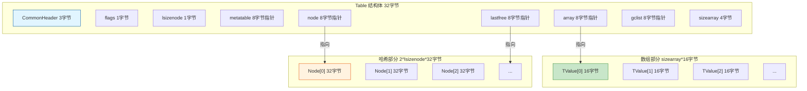

### 🔗 Node 结构 (哈希表节点)

```c
typedef struct Node {
  TValue i_val;           // 存储的值 (16字节)
  TKey i_key;             // 键信息 (16字节)
} Node;  // 总大小：32字节

typedef union TKey {
  struct {
    TValuefields;         // 键的值和类型 (12字节：Value+GCObject*+tt)
    struct Node *next;    // 冲突链表指针 (4字节，用于开放寻址)
  } nk;
  TValue tvk;             // 作为 TValue 访问 (16字节对齐)
} TKey;
```

**🔄 Node 冲突链表可视化**:

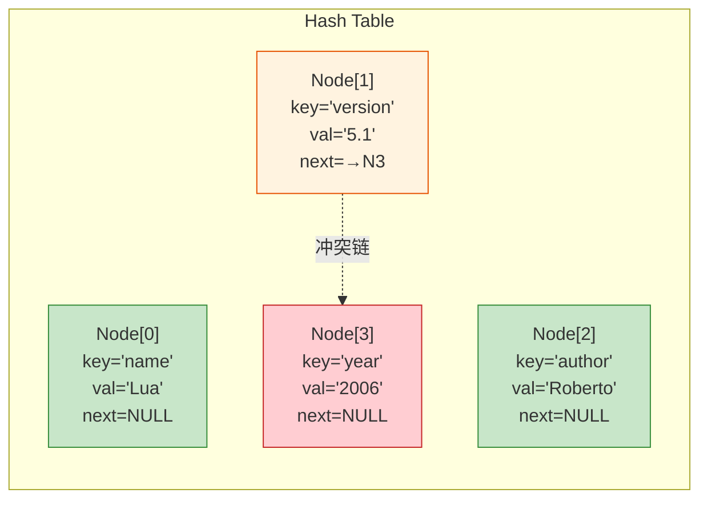

**📝 说明**:
- **冲突处理**: Node[1]的主位置被占用，通过next指针链接到Node[3]
- **Brent变种**: 优化冲突节点位置，减少查找跳数
- **lastfree**: 从数组末尾向前分配空闲节点

### 🎭 元方法缓存机制 (flags字段)

**flags位标志详解**:

| 位 | 元方法 | flags=1时 | 用途 |
|----|----|--------|------|
| 0 | `__index` | 不存在 | 表索引 |
| 1 | `__newindex` | 不存在 | 表赋值 |
| 2 | `__gc` | 不存在 | 垃圾回收 |
| 3 | `__mode` | 不存在 | 弱表模式 |
| 4 | `__eq` | 不存在 | 相等比较 |
| 5 | `__add` | 不存在 | 加法 |
| 6 | `__sub` | 不存在 | 减法 |
| 7 | `__mul` | 不存在 | 乘法 |

```c
// flags 字段缓存元方法信息
#define gfasttm(g,et,e) ((et) == NULL ? NULL : \
  ((et)->flags & (1u<<(e))) ? NULL : luaT_gettm(et, e, (g)->tmname[e]))
```

**🔄 元方法查找流程**:

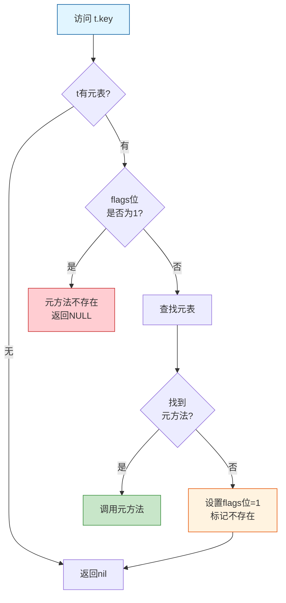

**📖 使用示例**:
```lua
-- 创建带元表的表
local t = {x = 10}
local mt = {
    __index = function(t, k)
        print("Accessing key:", k)
        return 0
    end
}
setmetatable(t, mt)

-- 第一次访问t.y
local a = t.y  -- 查找元表，调用__index，flags[__index]=0

-- 第二次访问t.z  
local b = t.z  -- 直接使用缓存，不再查找元表

-- 当t的元表改变时
t.flags = 0    -- 清除所有缓存标志，强制重新查找
```

## 💡 设计原理

### 混合存储策略

Lua 表采用混合存储策略，将数据分为两部分：

1. **数组部分** (`array`):
   - 存储非负整数键的元素 `[1, 2, 3, ..., n]`
   - 连续存储，访问效率高 O(1)
   - 大小为 2 的幂次 (1, 2, 4, 8, 16, 32, ...)
   - 占用内存: `sizearray * sizeof(TValue)` = `n * 16字节`

2. **哈希部分** (`node`):
   - 存储其他类型的键 (字符串、浮点数、大整数、对象)
   - 使用开放寻址法处理冲突
   - 采用 Brent 变种算法优化查找路径
   - 占用内存: `2^lsizenode * sizeof(Node)` = `2^n * 32字节`

**📊 存储策略对比**:

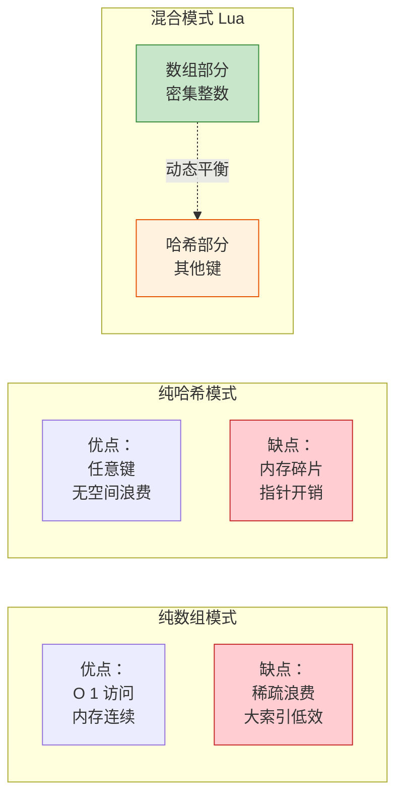

### 数组大小的确定

**🎯 核心原则**: 数组大小 `n` 应该是**最大的 2 的幂次**，使得数组中**至少一半的位置被使用**。

**数学表达**:
```
对于数组大小 n = 2^k，满足：
使用率 = count(非nil元素) / n >= 50%
```

**🔄 计算流程可视化**:

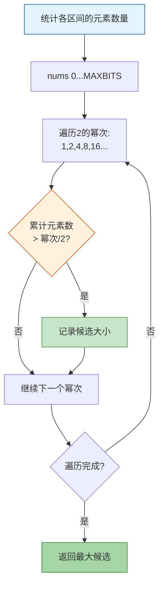

```c
// 数组大小计算逻辑
static int computesizes (int nums[], int *narray) {
  int i;
  int twotoi;  // 2^i (当前检查的数组大小)
  int a = 0;   // 累计的元素数量
  int na = 0;  // 最优的数组大小
  int n = 0;   // 候选的数组大小
  
  // 遍历所有2的幂次: 1, 2, 4, 8, 16, 32, ...
  for (i = 0, twotoi = 1; twotoi/2 < *narray; i++, twotoi *= 2) {
    if (nums[i] > 0) {
      a += nums[i];              // 累加该区间的元素数量
      if (a > twotoi/2) {        // 如果超过一半被使用
        n = twotoi;              // 记录这个大小
        na = a;                  // 记录使用的元素数
      }
    }
  }
  
  *narray = n;
  lua_assert(na <= *narray && *narray <= 2*na);  // 使用率在50%-100%之间
  return na;
}
```

**📖 实际示例**:

```lua
-- 示例1：密集数组
local t1 = {[1]=1, [2]=2, [3]=3, [4]=4, [5]=5}
-- 统计：nums[0-1]=5 (区间[1,2]有2个，区间[3,4]有2个，区间[5,8]有1个)
-- 计算：
--   n=2: 使用2/2=1 ✓ → 候选
--   n=4: 使用4/4=1 ✓ → 候选  
--   n=8: 使用5/8<1 ✗
-- 结果：sizearray=4 (使用率=5/4>50%，需要8才能容纳)
-- 实际：sizearray=8 (因为5>4，需要下一个幂次)

-- 示例2：稀疏数组
local t2 = {[1]=1, [100]=2}
-- 统计：nums[0-1]=1, nums[64-128]=1
-- 计算：
--   n=1: 使用1/1=1 ✓
--   n=2: 使用1/2<1 ✗
--   ...
--   n=128: 使用2/128<1 ✗
-- 结果：sizearray=1, 其余进哈希部分

-- 示例3：连续但有空洞
local t3 = {[1]=1, [2]=2, [3]=nil, [4]=4, [5]=5}
-- 统计：nums[0-1]=2, nums[2-4]=2 (不计nil)
-- 计算：
--   n=2: 使用2/2=1 ✓
--   n=4: 使用4/4=1 ✓
--   n=8: 使用4/8<1 ✗
-- 结果：sizearray=4 (使用率=4/4=100%)
```

**⚡ 优化效果**:

| 场景 | 数组大小 | 使用率 | 内存开销 |
|------|----------|--------|----------|
| 密集数组 [1-100] | 128 | 78% | 2KB (128*16) |
| 稀疏数组 [1,1000] | 1 | 100% | 16B (1*16) + 哈希 |
| 带空洞 [1-100除50] | 128 | 77% | 2KB |

## 🔐 哈希算法

### 主位置计算

不同类型的键使用不同的哈希函数，确保均匀分布：

```c
static Node *mainposition (const Table *t, const TValue *key) {
  switch (ttype(key)) {
    case LUA_TNUMBER:
      return hashnum(t, nvalue(key));      // 数字哈希
    case LUA_TSTRING:
      return hashstr(t, rawtsvalue(key));  // 字符串哈希
    case LUA_TBOOLEAN:
      return hashboolean(t, bvalue(key));  // 布尔哈希
    case LUA_TLIGHTUSERDATA:
      return hashpointer(t, pvalue(key));  // 指针哈希
    default:
      return hashpointer(t, gcvalue(key)); // GC对象哈希
  }
}
```

**🔄 主位置计算流程**:

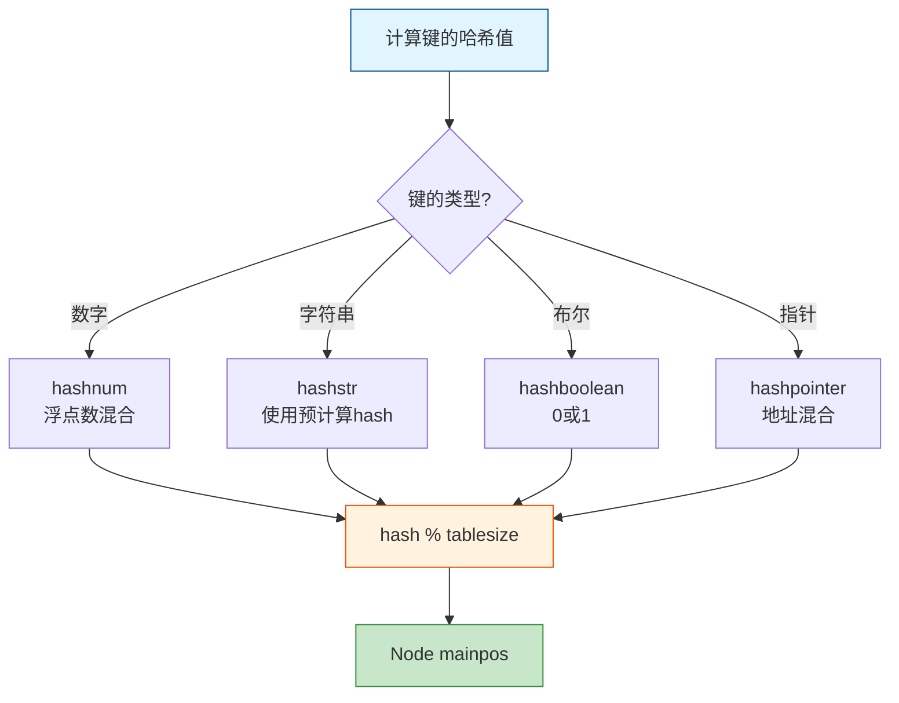

### 数字哈希算法

```c
static Node *hashnum (const Table *t, lua_Number n) {
  unsigned int a[numints];  // numints = sizeof(lua_Number)/sizeof(int)
  int i;
  n += 1;  // 规范化数字（避免 -0 和 +0 的差异）
  
  // 将浮点数的字节表示复制到整数数组
  memcpy(a, &n, sizeof(a));
  
  // 混合所有整数部分
  for (i = 1; i < numints; i++) 
    a[0] += a[i];
    
  return hashmod(t, a[0]);
}

#define hashmod(t,n) (gnode(t, ((n) % ((sizenode(t)-1)|1))))
```

**📖 哈希示例**:
```lua
-- 数字键的哈希计算
local t = {}
t[3.14] = "pi"      -- hashnum(3.14) → 将浮点数字节混合
t[42] = "answer"    -- hashnum(42.0) → 整数也按浮点处理
t[-0] = "neg_zero"  -- n+1规范化 → 与+0相同

-- 字符串键的哈希
t["name"] = "Lua"   -- 使用字符串预计算的hash字段
t[""] = "empty"     -- 空字符串也有hash值

-- 布尔键的哈希
t[true] = 1         -- hashboolean(1) → 简单映射
t[false] = 0        -- hashboolean(0)
```

### 冲突解决 - Brent变种算法

Lua 使用**开放寻址法**的 **Brent 变种**来解决哈希冲突：

**🎯 核心思想**:
1. 新键优先放在主位置
2. 如果主位置被占用，检查占用者是否在其主位置
3. 如果占用者不在主位置，将其移动到空闲位置
4. 新键占据主位置

**🔄 Brent算法流程可视化**:

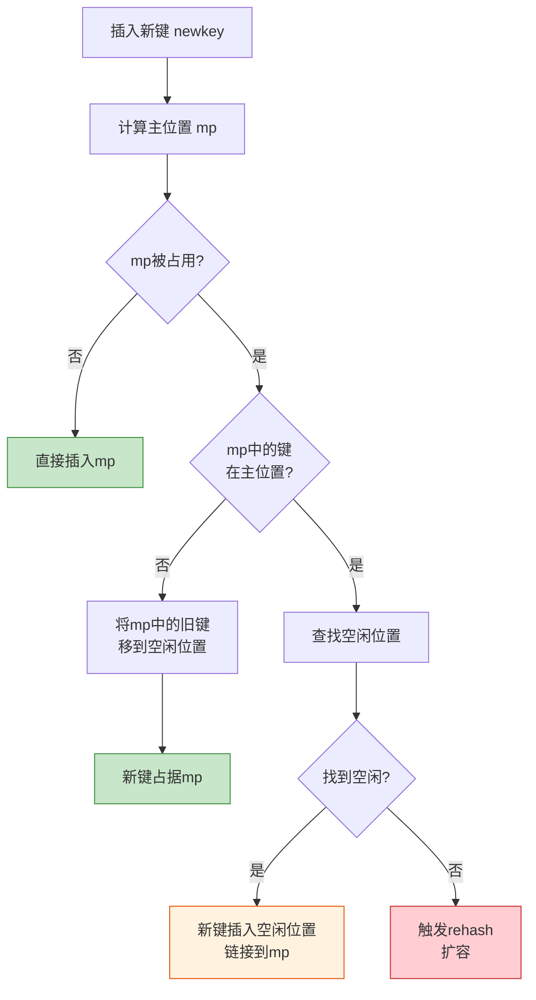

**📖 冲突解决示例**:

```
初始状态: 哈希表大小=4
Node[0]: empty
Node[1]: empty  
Node[2]: empty
Node[3]: empty
lastfree → Node[3]

步骤1: 插入 key1 (主位置=1)
Node[0]: empty
Node[1]: {key1, val1, next=NULL}  ← 直接插入
Node[2]: empty
Node[3]: empty

步骤2: 插入 key2 (主位置=1，冲突!)
Node[0]: empty
Node[1]: {key1, val1, next=→3}
Node[2]: empty
Node[3]: {key2, val2, next=NULL}  ← 链接到Node[1]
lastfree → Node[2]

步骤3: 插入 key3 (主位置=1，冲突!)
检查：key1在主位置? 是
检查：key2在主位置? 否 (主位置=1，实际在3)
操作：将key2移到Node[2]，key3占据Node[3]

Node[0]: empty
Node[1]: {key1, val1, next=→2}
Node[2]: {key2, val2, next=→3}  ← key2被移动
Node[3]: {key3, val3, next=NULL} ← key3占据主位置
```

**⚡ Brent算法优势**:
- ✅ **减少链长** - 优先让新键占据主位置
- ✅ **查找更快** - 平均链长更短
- ✅ **缓存友好** - 减少跳转次数

### 空闲位置分配 (getfreepos)

```c
static Node *getfreepos (Table *t) {
  while (t->lastfree-- > t->node) {
    if (ttisnil(gkey(t->lastfree)))
      return t->lastfree;  // 找到空闲位置
  }
  return NULL;  // 没有空闲位置
}
```

**🔄 lastfree指针移动**:

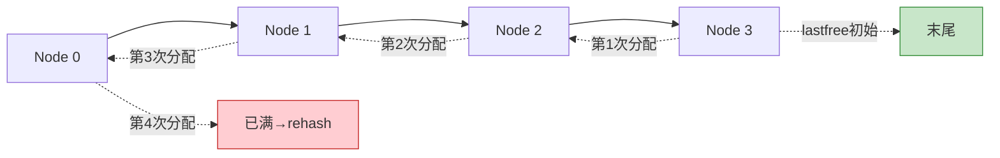

**💡 设计巧妙之处**:
- **从后向前**: 避免干扰已有的冲突链
- **懒惰分配**: 只在需要时才查找
- **O(1)均摊**: 每个位置最多被检查一次

## ⚙️ 关键操作实现

### 1. 获取操作 (luaH_get)

```c
const TValue *luaH_get (Table *t, const TValue *key) {
  switch (ttype(key)) {
    case LUA_TNIL: 
      return luaO_nilobject;  // nil键返回nil
      
    case LUA_TSTRING: 
      return luaH_getstr(t, rawtsvalue(key));  // 字符串专用优化
      
    case LUA_TNUMBER: {
      int k;
      lua_Number n = nvalue(key);
      lua_number2int(k, n);  // 尝试转为整数
      if (luai_numeq(cast_num(k), nvalue(key)))
        return luaH_getnum(t, k);  // 整数键，尝试数组部分
      // 否则进入哈希部分
    }
    
    default: {
      Node *n = mainposition(t, key);  // 计算主位置
      do {  // 沿着冲突链查找
        if (luaO_rawequalObj(key2tval(n), key))
          return gval(n);  // 找到匹配的键
        else n = gnext(n);
      } while (n);
      return luaO_nilobject;  // 未找到
    }
  }
}
```

**🔄 luaH_get执行流程**:

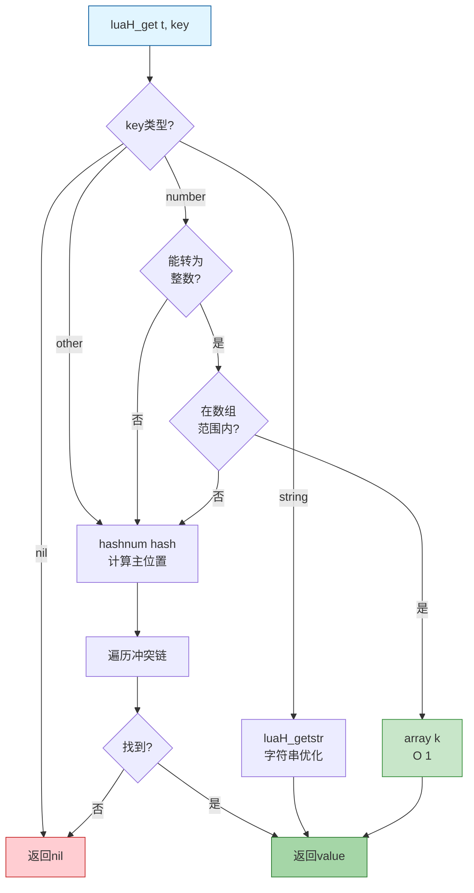

**📖 使用示例**:
```lua
local t = {
    [1] = "a",         -- 数组部分
    [2] = "b",         -- 数组部分
    ["name"] = "Lua",  -- 哈希部分
    [100] = "big"      -- 哈希部分
}

-- 访问数组部分 - 快速路径
local v1 = t[1]    -- luaH_getnum(t, 1) → array[0]

-- 访问哈希部分 - 字符串优化
local v2 = t["name"]  -- luaH_getstr(t, "name")

-- 访问哈希部分 - 大整数
local v3 = t[100]  -- mainposition → 遍历链表

-- 访问不存在的键
local v4 = t["missing"]  -- 返回 nil
```

### 2. 设置操作 (luaH_set)

```c
TValue *luaH_set (lua_State *L, Table *t, const TValue *key) {
  const TValue *p = luaH_get(t, key);  // 先尝试查找
  t->flags = 0;  // 清除元方法缓存标志
  
  if (p != luaO_nilobject)
    return cast(TValue *, p);  // 键已存在，返回value位置
  else {
    if (ttisnil(key)) 
      luaG_runerror(L, "table index is nil");  // 不允许nil键
    return newkey(L, t, key);  // 插入新键
  }
}
```

**🔄 luaH_set执行流程**:

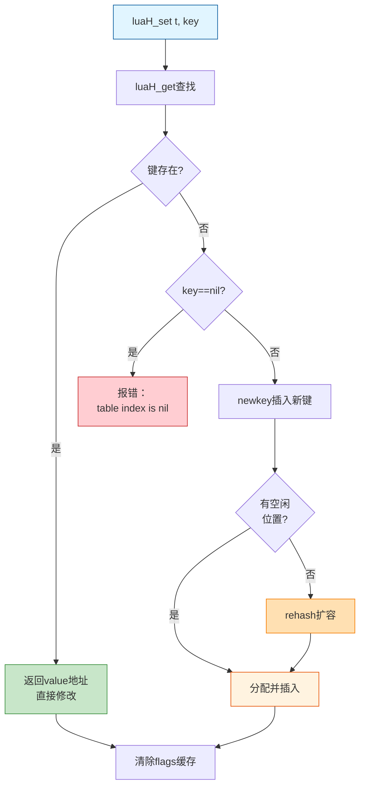

**📖 使用示例**:
```lua
local t = {}

-- 情况1：新键插入
t[1] = "a"         -- newkey → 数组部分
t["name"] = "Lua"  -- newkey → 哈希部分

-- 情况2：已存在键，直接修改
t[1] = "A"         -- 直接修改 array[0]
t["name"] = "Lua 5.1"  -- 直接修改哈希节点

-- 情况3：错误 - nil键
t[nil] = "error"   -- 运行时错误！

-- 情况4：触发rehash
for i = 1, 100 do
    t[i] = i       -- 当空间不足时自动扩容
end
```

### 3. 插入新键 (newkey)

```c
static TValue *newkey (lua_State *L, Table *t, const TValue *key) {
  Node *mp = mainposition(t, key);  // 计算主位置
  
  if (!ttisnil(gval(mp)) || mp == dummynode) {
    Node *othern;
    Node *n = getfreepos(t);  // 获取空闲位置
    
    if (n == NULL) {  // 没有空闲位置
      rehash(L, t, key);  // 扩展表
      return luaH_set(L, t, key);  // 重新插入
    }
    
    // Brent算法：处理冲突
    othern = mainposition(t, key2tval(mp));  // 占用者的主位置
    if (othern != mp) {  // 占用者不在主位置
      // 将占用者移到空闲位置
      while (gnext(othern) != mp) othern = gnext(othern);
      gnext(othern) = n;
      *n = *mp;
      gnext(mp) = NULL;
      setnilvalue(gval(mp));
    }
    else {  // 占用者在主位置，新键放到空闲位置
      gnext(n) = gnext(mp);
      gnext(mp) = n;
      mp = n;
    }
  }
  
  setobj2t(L, gkey(mp), key);
  luaC_barriert(L, t, key);
  return gval(mp);
}
```

**🔄 newkey插入策略可视化**:

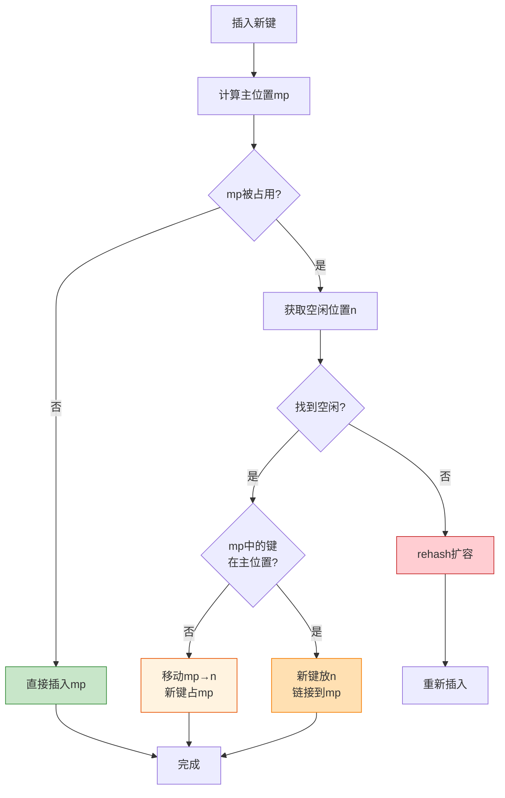

**📖 详细示例**:

```
场景1：主位置空闲
mp = Node[2] (empty)
操作：直接插入
结果：Node[2] = {key, value, next=NULL}

场景2：主位置被占用，占用者在主位置
mp = Node[2] = {key1, val1, next=NULL}
newkey = key2 (主位置也是2)
空闲 = Node[5]

操作：key2放Node[5]，链接到mp
结果：
  Node[2] = {key1, val1, next=→5}
  Node[5] = {key2, val2, next=NULL}

场景3：主位置被占用，占用者不在主位置 (Brent优化)
mp = Node[2] = {key1, val1, next=→4}  # key1主位置是1
newkey = key2 (主位置是2)
空闲 = Node[5]

操作：将key1移到Node[5]，key2占据Node[2]
结果：
  Node[1] = {key0, val0, next=→5}  # 更新链表
  Node[2] = {key2, val2, next=→4}  # key2占据主位置
  Node[5] = {key1, val1, next=→4}  # key1被移动
```

## 🔄 表的重哈希 (rehash)

当表空间不足时，Lua 会进行重哈希操作，重新分配数组和哈希部分的大小。

### 触发条件

1. **空间耗尽**: `getfreepos()` 返回 NULL
2. **插入新键**: 需要空闲位置但哈希表已满
3. **动态优化**: 根据使用模式调整数组/哈希比例

**🔄 Rehash完整流程**:

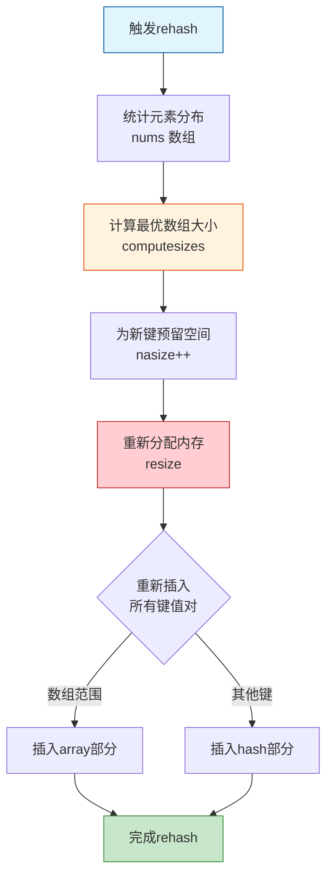

```c
static void rehash (lua_State *L, Table *t, const TValue *ek) {
  int nasize, na;
  int nums[MAXBITS+1];  // 统计各区间的元素数量
  int i;
  int totaluse;
  
  // 1. 初始化统计数组
  for (i=0; i<=MAXBITS; i++) nums[i] = 0;
  
  // 2. 统计数组部分的元素分布
  nasize = numusearray(t, nums);  // 返回数组中非nil元素数量
  totaluse = nasize;
  
  // 3. 统计哈希部分的整数键
  totaluse += numusehash(t, nums, &nasize);
  
  // 4. 为新键预留空间
  nasize++;
  totaluse++;
  
  // 5. 计算新的数组大小（满足>=50%使用率）
  na = computesizes(nums, &nasize);
  
  // 6. 重新分配并插入
  resize(L, t, nasize, totaluse - na);
}
```

### 元素统计函数

```c
// 统计数组部分的元素数量
static int numusearray (const Table *t, int *nums) {
  int lg;
  int ttlg;  // 2^lg
  int ause = 0;  // 使用的元素数量
  int i = 1;  // 数组索引从1开始
  
  // 按2的幂次统计: [1,2], [3,4], [5,8], [9,16], ...
  for (lg=0, ttlg=1; lg<=MAXBITS; lg++, ttlg*=2) {
    int lc = 0;  // 当前区间的计数
    int lim = ttlg;
    if (lim > t->sizearray) {
      lim = t->sizearray;
      if (i > lim) break;
    }
    // 统计区间[i, lim]的非nil元素
    for (; i <= lim; i++) {
      if (!ttisnil(&t->array[i-1]))
        lc++;
    }
    nums[lg] += lc;
    ause += lc;
  }
  return ause;
}
```

**📊 统计示例**:

```lua
-- 示例：t = {[1]=a, [2]=b, [5]=c, [10]=d}
-- nums数组统计：
-- nums[0-1]: 区间[1,2] → 2个元素 (a, b)
-- nums[2-4]: 区间[3,4] → 0个元素
-- nums[3-8]: 区间[5,8] → 1个元素 (c)
-- nums[4-16]: 区间[9,16] → 1个元素 (d)

-- 计算最优数组大小：
--   n=2: 使用2/2=100% ✓
--   n=4: 使用2/4=50% ✓
--   n=8: 使用3/8=37.5% ✗
-- 结果：sizearray=4

-- 实际需要16才能容纳[10]，但使用率<50%
-- 最终：sizearray=4, [10]进入哈希部分
```

### Resize操作

```c
static void resize (lua_State *L, Table *t, int nasize, int nhsize) {
  int i;
  int oldasize = t->sizearray;
  int oldhsize = t->lsizenode;
  Node *nold = t->node;  // 保存旧哈希表
  
  // 1. 调整数组大小
  if (nasize > oldasize)  // 扩大数组
    setarrayvector(L, t, nasize);
    
  // 2. 创建新哈希表
  setnodevector(L, t, nhsize);
  
  // 3. 缩小数组（将多余元素移到哈希部分）
  if (nasize < oldasize) {
    t->sizearray = nasize;
    for (i=nasize; i<oldasize; i++) {
      if (!ttisnil(&t->array[i]))
        setobjt2t(L, luaH_setnum(L, t, i+1), &t->array[i]);
    }
    luaM_reallocvector(L, t->array, oldasize, nasize, TValue);
  }
  
  // 4. 重新插入旧哈希表的所有元素
  for (i = twoto(oldhsize) - 1; i >= 0; i--) {
    Node *old = nold+i;
    if (!ttisnil(gval(old)))
      setobjt2t(L, luaH_set(L, t, key2tval(old)), gval(old));
  }
  
  // 5. 释放旧哈希表
  if (nold != dummynode)
    luaM_freearray(L, nold, twoto(oldhsize), Node);
}
```

**📊 Rehash前后对比**:

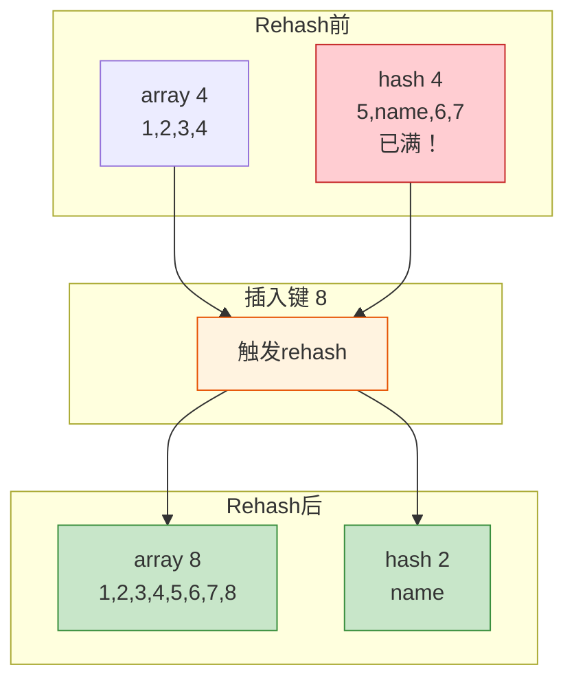

**📖 完整示例**:

```lua
-- 创建表并观察rehash
local t = {}

-- 阶段1：初始状态
-- array=0, hash=0

-- 阶段2：插入整数键
for i = 1, 4 do
    t[i] = i  
end
-- array=4, hash=0

-- 阶段3：插入字符串键
t["name"] = "Lua"
-- array=4, hash=1 (最小哈希大小)

-- 阶段4：继续插入整数，触发rehash
for i = 5, 8 do
    t[i] = i
end
-- 第一次rehash: array=8, hash=1

-- 阶段5：大量插入，多次rehash
for i = 9, 100 do
    t[i] = i
end
-- 多次rehash后: array=128, hash=1
-- 使用率: 100/128 = 78% (满足>=50%)
```

### ⚡ 性能影响分析

| 场景 | Rehash频率 | 时间复杂度 | 优化建议 |
|------|------------|------------|----------|
| **顺序插入** [1-n] | 低 | O(n) 均摊 | 预分配大小 |
| **稀疏插入** [1,100,200] | 中等 | O(n) | 使用哈希部分 |
| **混合插入** 整数+字符串 | 低 | O(n) | 无需优化 |
| **删除后插入** | 不触发 | O(1) | Rehash不回收空间 |

**💡 优化技巧**:

```lua
-- 技巧1：预分配数组大小
local t = {[100] = nil}  -- 创建大数组
for i = 1, 100 do
    t[i] = i  -- 不会触发rehash
end

-- 技巧2：避免稀疏数组
-- 不好：{[1]=a, [1000]=b}  → 浪费内存
-- 更好：{[1]=a, index_1000=b}  → 使用哈希

-- 技巧3：批量操作
-- 不好：逐个插入触发多次rehash
-- 更好：table.move() 或预知大小
```

## 📈 性能特性

### 时间复杂度

| 操作 | 数组部分 | 哈希部分 | 最坏情况 |
|------|----------|----------|----------|
| **访问** | O(1) | O(1) 平均 | O(n) 全冲突 |
| **插入** | O(1)* | O(1) 平均 | O(n) rehash |
| **删除** | O(1) | O(1) 平均 | O(n) 遍历链 |
| **重哈希** | O(n) | O(n) | O(n) |
| **遍历** | O(n) | O(n) | O(n) |

_*注：可能触发O(n)的rehash_

### 空间优化

**📊 内存占用对比**:

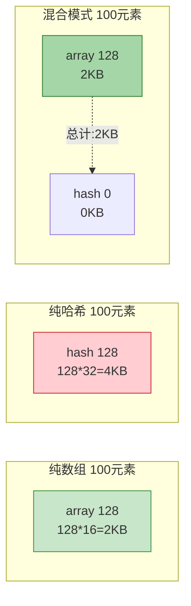

**内存使用详解**:

| 存储方式 | 每元素开销 | 100个元素 | 1000个元素 |
|----------|------------|-----------|------------|
| **纯数组** | 16字节 (TValue) | 2KB | 20KB |
| **纯哈希** | 32字节 (Node) | 4KB | 40KB |
| **混合(90%数组)** | ~17字节 | 2.2KB | 21KB |

### 使用场景对比

```lua
-- 场景1：稠密数组 (最优)
local array = {}
for i = 1, 1000 do
    array[i] = i
end
-- 内存：1024*16 = 16KB (数组)
-- 访问：O(1) 直接索引

-- 场景2：稀疏数组 (次优)
local sparse = {[1]=a, [1000]=b}
-- 内存：1*16 + 1*32 = 48B (数组+哈希)
-- Lua智能分配：不为中间空洞浪费空间

-- 场景3：字典 (哈希)
local dict = {name="Lua", version=5.1}
-- 内存：4*32 = 128B (最小哈希大小)
-- 访问：O(1) 平均

-- 场景4：混合 (灵活)
local mixed = {
    "a", "b", "c",        -- [1-3] 数组
    name = "Lua",          -- 哈希
    version = 5.1,         -- 哈希
    [100] = "large_index"  -- 哈希 (超出数组合理范围)
}
-- 内存：4*16 + 8*32 = 320B
```

## 🎯 最佳实践

### 1. 预分配数组大小

```lua
-- ❌ 不好：多次rehash
local t = {}
for i = 1, 10000 do
    t[i] = i  -- 触发多次rehash: 1→2→4→8→...→16384
end

-- ✅ 更好：预分配
local t = {}
t[10000] = nil  -- 创建大小为16384的数组
for i = 1, 10000 do
    t[i] = i  -- 不触发rehash
end
```

### 2. 避免稀疏数组

```lua
-- ❌ 不好：浪费内存
local t = {
    [1] = "a",
    [1000000] = "b"  -- 会尝试创建大数组
}
-- 实际：使用哈希，但计算过程浪费

-- ✅ 更好：显式使用哈希
local t = {
    ["key_1"] = "a",
    ["key_1000000"] = "b"
}
```

### 3. 混合使用时的顺序

```lua
-- ✅ 推荐：先插入数组，再插入哈希
local t = {}
-- 1. 数组元素
for i = 1, 100 do
    t[i] = i
end
-- 2. 哈希元素
t.name = "Lua"
t.version = 5.1

-- 原因：避免先分配大哈希后又转移到数组
```

### 4. 删除不会释放内存

```lua
-- 注意：删除元素不会缩小表
local t = {}
for i = 1, 10000 do
    t[i] = i
end
-- 内存：16KB

for i = 1, 10000 do
    t[i] = nil  -- 删除所有元素
end
-- 内存：仍然16KB (不会rehash缩小)

-- 如需释放内存，创建新表
t = {}  -- 旧表会被GC回收
```

### 5. 元表的性能影响

```lua
-- 元表会影响访问性能
local t = setmetatable({}, {
    __index = function(t, k)
        return 0  -- 默认值
    end
})

-- 访问不存在的键会调用__index
local v = t.missing  -- 触发元方法调用

-- 优化：缓存结果
t.missing = t.missing  -- 第一次计算后缓存
```

## 🔍 调试和工具函数

### 1. 获取表长度 (luaH_getn)

```c
int luaH_getn (Table *t) {
  int j = t->sizearray;
  if (j > 0 && ttisnil(&t->array[j - 1])) {
    // 存在空洞，需要二分查找
    int i = 0;
    while (j - i > 1) {
      int m = (i+j)/2;
      if (ttisnil(&t->array[m - 1])) j = m;
      else i = m;
    }
    return i;
  }
  else if (t->node != dummynode) {
    // 检查哈希部分是否有更大的整数键
    int i = 0;
    while (!ttisnil(luaH_getnum(t, j + 1 + i))) i++;
    return j + i;
  }
  else return j;
}
```

**📖 #运算符示例**:

```lua
-- 情况1：无空洞
local t1 = {1, 2, 3, 4, 5}
print(#t1)  -- 5 (直接返回sizearray)

-- 情况2：有空洞
local t2 = {1, 2, nil, 4, 5}
print(#t2)  -- 不确定！可能是2或5
-- Lua使用二分查找，结果未定义

-- 情况3：哈希部分有整数键
local t3 = {1, 2, 3}
t3[10] = 10
print(#t3)  -- 10 (检查哈希部分)

-- 情况4：纯哈希
local t4 = {name="Lua"}
print(#t4)  -- 0 (没有数组部分)
```

### 2. 下一个键值对 (luaH_next)

```c
int luaH_next (lua_State *L, Table *t, StkId key) {
  int i = findindex(L, t, key);  // 找到当前键的位置
  
  // 尝试数组部分
  for (i++; i < t->sizearray; i++) {
    if (!ttisnil(&t->array[i])) {
      setnvalue(key, cast_num(i+1));
      setobj2s(L, key+1, &t->array[i]);
      return 1;
    }
  }
  
  // 继续在哈希部分查找
  for (i -= t->sizearray; i < sizenode(t); i++) {
    if (!ttisnil(gval(gnode(t, i)))) {
      setobj2s(L, key, key2tval(gnode(t, i)));
      setobj2s(L, key+1, gval(gnode(t, i)));
      return 1;
    }
  }
  
  return 0;  // 没有更多元素
}
```

**📖 pairs遍历示例**:

```lua
local t = {
    [1] = "a",
    [2] = "b",
    name = "Lua",
    version = 5.1
}

-- pairs遍历顺序：
-- 1. 数组部分按顺序: 1, 2
-- 2. 哈希部分无序: name, version (或 version, name)

for k, v in pairs(t) do
    print(k, v)
end
-- 输出：
-- 1    a
-- 2    b
-- name    Lua
-- version    5.1
```

## 📚 总结

Lua 表的实现是一个精心设计的数据结构，通过以下特性实现了优异的性能：

### 🎯 核心特点

1. **混合存储** 🔀
   - 数组和哈希表的完美结合
   - 针对不同访问模式自动优化
   - 整数键用数组，其他键用哈希

2. **动态调整** 📊
   - 根据使用情况自动rehash
   - 50%使用率原则平衡空间和性能
   - 智能判断数组/哈希比例

3. **高效哈希** ⚡
   - Brent变种算法优化冲突链
   - 不同类型键使用专用哈希函数
   - lastfree指针加速空闲位置查找

4. **元方法缓存** 🎭
   - flags位图避免重复元表查找
   - 8个常用元方法的快速判断
   - 显著提升访问性能

5. **内存优化** 💾
   - 只在需要时分配哈希部分
   - 数组部分连续存储，缓存友好
   - 每个数组元素16字节，哈希节点32字节

### 📊 性能总览

| 特性 | 数组部分 | 哈希部分 |
|------|----------|----------|
| **访问速度** | O(1) 极快 | O(1) 平均快 |
| **内存开销** | 16B/元素 | 32B/元素 |
| **适用场景** | 密集整数索引 | 任意键类型 |
| **扩容策略** | 2的幂次增长 | 2的幂次增长 |
| **使用率要求** | ≥50% | 按需分配 |

### 🚀 使用建议

**DO ✅**:
- 使用连续整数键创建数组
- 预分配已知大小的表
- 混合使用时先插入数组元素
- 利用局部变量缓存表字段

**DON'T ❌**:
- 避免创建超大稀疏数组
- 避免nil键（会报错）
- 不要期望删除操作释放内存
- 不要依赖#运算符处理带空洞的数组

### 🔬 典型使用模式

```lua
-- 1. 数组（最高效）
local array = {1, 2, 3, 4, 5}

-- 2. 字典（常用）
local dict = {name="Lua", version=5.1}

-- 3. 对象（OOP风格）
local obj = {x=10, y=20}
function obj:move(dx, dy)
    self.x = self.x + dx
    self.y = self.y + dy
end

-- 4. 混合（灵活）
local data = {
    "item1", "item2",  -- 数组部分
    count = 2,          -- 哈希部分
    config = {...}      -- 嵌套表
}
```

### 🧩 设计哲学

Lua表体现了以下设计原则：

1. **简单性** - 单一数据结构实现多种用途
2. **高效性** - O(1)访问，智能内存管理
3. **灵活性** - 可作为数组、字典、对象、模块
4. **透明性** - 用户无需关心内部实现
5. **优雅性** - 最小化概念，最大化功能

这种设计使得 Lua 表在各种使用场景下都能保持高效，无论是作为数组、字典还是对象使用，都能提供一致且优秀的性能表现。这正是Lua被广泛应用于游戏开发、嵌入式系统和脚本编程的重要原因之一。

---

**🔗 相关文档**:
- 📖 [函数系统 (wiki_function.md)](wiki_function.md) - 了解函数和闭包的实现
- 🖥️ [虚拟机执行 (wiki_vm.md)](wiki_vm.md) - 了解表操作的字节码
- 🗑️ [垃圾回收器 (wiki_gc.md)](wiki_gc.md) - 了解表的内存管理
- 📝 [对象模型 (wiki_object.md)](wiki_object.md) - 了解TValue和类型系统

**📚 进阶阅读**:
- 《Lua程序设计（第4版）》第3章 - 表的使用
- Lua 5.1源码 `ltable.c` - 表的完整实现
- "The Implementation of Lua 5.0" 论文 - 表的设计思想
- Lua-users wiki: TablesTutorial - 表的最佳实践