# Lua虚拟机架构深度解析

> **📚 学习指南**  
> **难度等级**：⭐⭐⭐⭐ (高级)  
> **预计阅读时间**：45-60分钟  
> **前置知识**：C语言基础、编译原理概念、虚拟机基本概念  
> **关联文档**：[垃圾回收](q_02_garbage_collection.md) | [栈管理](q_08_stack_management.md) | [字节码生成](q_06_bytecode_generation.md)

## 📋 文档导航

- [🎯 问题概述](#问题概述)
- [🌟 核心概念速览](#核心概念速览) 
- [🏗️ 虚拟机整体架构](#虚拟机整体架构)
- [📊 关键数据结构深度解析](#关键数据结构深度解析)
- [⚙️ 执行引擎工作原理](#执行引擎工作原理)
- [🔧 性能优化技术](#性能优化技术)
- [🧪 实践与实验](#实践与实验)
- [❓ 面试高频问题](#面试高频问题)
- [🔗 延伸学习](#延伸学习)

---

## 🎯 问题概述

**核心问题**：请详细解释Lua虚拟机的架构设计，包括其核心组件、执行模型和关键数据结构。

**重要更正**：
> ⚠️ **关键发现**：经过对Lua 5.1.5源代码的深入分析，确认：
> 1. ✅ **Lua虚拟机是基于寄存器的虚拟机**，而非基于栈的虚拟机
> 2. ✅ **指令分发使用标准switch语句**，而非vmdispatch宏或computed goto
> 3. ✅ 本文档基于真实的Lua 5.1.5源码，所有示例均来自实际实现

---

## 🌟 核心概念速览

### 基本架构理念

```mermaid
graph TB
    subgraph "Lua虚拟机整体架构"
        A[Lua源代码] --> B[词法分析器]
        B --> C[语法分析器]
        C --> D[代码生成器]
        D --> E[字节码]
        E --> F[虚拟机执行引擎]
        
        subgraph "虚拟机核心组件"
            F1[lua_State 状态机]
            F2[指令解释器]
            F3[栈管理器]
            F4[垃圾回收器]
            F --> F1
            F --> F2
            F --> F3
            F --> F4
        end
        
        F --> G[程序输出]
    end
    
    style A fill:#e1f5fe
    style E fill:#f3e5f5
    style F fill:#e8f5e8
    style G fill:#fff3e0
```



### 🔄 基于寄存器 vs 基于栈的设计对比

| 特性 | **基于寄存器 (Lua)** | **基于栈 (JVM)** |
|------|---------------------|------------------|
| 🎯 **指令复杂度** | 复杂，需指定寄存器地址 | 简单，操作数隐式 |
| 📊 **指令数量** | 较少 (直接操作) | 较多 (需push/pop) |
| ⚡ **执行效率** | 更高 | 中等 |
| 📝 **编译复杂度** | 高 (寄存器分配) | 低 |
| 💾 **代码大小** | 较小 | 较大 |

### 🧠 形象理解

**🏭 工厂流水线比喻**：
- **寄存器** = 编号的工作台
- **指令** = 工作单
- **虚拟机** = 工厂调度员
- **执行过程** = 按工作单在指定工作台间处理数据

---

## 🏗️ 虚拟机整体架构

### 核心组件关系图

```mermaid
graph TB
    subgraph "Lua虚拟机核心架构"
        subgraph "执行状态管理"
            LS[lua_State 状态机]
            CI[CallInfo 调用信息]
            GS[global_State 全局状态]
        end
        
        subgraph "代码执行引擎"
            VM[luaV_execute 执行引擎]
            OP[指令集 Opcodes]
            PC[程序计数器]
        end
        
        subgraph "内存管理"
            ST[栈管理]
            GC[垃圾回收]
            OB[对象系统]
        end
        
        subgraph "函数和闭包"
            PR[Proto 函数原型]
            CL[Closure 闭包]
            UV[UpValue 上值]
        end
        
        LS --> CI
        LS --> GS
        LS --> ST
        CI --> VM
        VM --> OP
        VM --> PC
        PR --> CL
        CL --> UV
        GC --> OB
    end
    
    style LS fill:#ffcdd2
    style VM fill:#c8e6c9
    style ST fill:#dcedc8
    style GC fill:#f8bbd9
```



### 1. 🎛️ Lua状态机 (lua_State)

**作用**：虚拟机的"控制中心"，管理所有运行时状态

```c
// lstate.h - Lua状态机结构（核心字段详解）
struct lua_State {
  CommonHeader;                    /* GC头部信息 */

  /* 🎯 执行状态核心 */
  lu_byte status;                  /* 线程状态：LUA_OK, LUA_YIELD, LUA_ERRRUN等 */
  StkId top;                       /* 栈顶指针：指向下一个可用位置 */
  StkId stack;                     /* 栈底指针：栈的起始地址 */
  StkId stack_last;                /* 栈结束指针：最后可用位置 */
  int stacksize;                   /* 当前栈总容量 */

  /* 📞 函数调用管理 */
  CallInfo *ci;                    /* 当前调用信息 */
  CallInfo base_ci;                /* 基础调用信息 */
  const Instruction *oldpc;        /* 上一条指令位置 */

  /* 🌐 全局状态和错误处理 */
  global_State *l_G;               /* 全局状态指针 */
  struct lua_longjmp *errorJmp;    /* 错误跳转点 */
  
  /* 🔗 闭包和upvalue */
  UpVal *openupval;                /* 开放upvalue链表 */
  
  /* 🪝 调试支持 */
  lua_Hook hook;                   /* 调试钩子函数 */
  l_signalT hookmask;             /* 钩子事件掩码 */
  int hookcount;                  /* 钩子计数器 */
};
```

**💡 关键理解**：
- `top` 和 `stack`：就像书桌上的书堆，`stack`是桌面，`top`指向最顶层
- `ci`：当前正在"阅读"的函数的详细信息
- `l_G`：整个"图书馆"的总信息台

### 2. 📋 调用信息 (CallInfo)

**作用**：每个函数调用的"工作记录卡"

```mermaid
graph LR
    subgraph "CallInfo 链表结构"
        CI1[main 函数] --> CI2[foo 函数]
        CI2 --> CI3[bar 函数]
        CI3 --> CI4[当前函数]
        
        CI4 -.-> CI3
        CI3 -.-> CI2
        CI2 -.-> CI1
    end
    
    subgraph "每个 CallInfo 包含"
        F[func 函数对象]
        T[top 栈顶限制]
        B[base 栈基址]
        PC[savedpc 程序计数器]
    end
    
    style CI4 fill:#ffeb3b
    style F fill:#e1f5fe
```



```c
// lstate.h - 调用信息结构
typedef struct CallInfo {
  StkId func;                      /* 被调用函数在栈中的位置 */
  StkId top;                       /* 此函数的栈顶限制 */
  struct CallInfo *previous, *next; /* 双向链表：构成调用栈 */

  union {
    struct {  /* Lua函数专用 */
      StkId base;                  /* 栈基址：局部变量起始 */
      const Instruction *savedpc;  /* 程序计数器 */
    } l;
    struct {  /* C函数专用 */
      lua_KFunction k;             /* 延续函数 */
      ptrdiff_t old_errfunc;       
      lua_KContext ctx;            /* 延续上下文 */
    } c;
  } u;

  short nresults;                  /* 期望返回值数量 */
  unsigned short callstatus;       /* 调用状态标志 */
} CallInfo;
```

### 3. 📝 函数原型 (Proto)

**作用**：函数的"设计蓝图"，包含所有静态编译信息

```mermaid
graph TB
    subgraph "Proto 结构组成"
        subgraph "基本信息"
            P1[参数数量 numparams]
            P2[可变参数 is_vararg]
            P3[栈大小 maxstacksize]
        end
        
        subgraph "代码和常量"
            C1[字节码数组 code]
            C2[常量数组 k]
            C3[行号信息 lineinfo]
        end
        
        subgraph "嵌套关系"
            N1[嵌套函数 p]
            N2[upvalue描述 upvalues]
            N3[局部变量 locvars]
        end
    end
    
    style P1 fill:#e3f2fd
    style C1 fill:#f3e5f5
    style N1 fill:#e8f5e8
```



---

## ⚙️ 执行引擎工作原理

### 指令执行循环

```mermaid
sequenceDiagram
    participant VM as 虚拟机
    participant PC as 程序计数器
    participant Stack as 栈
    participant GC as 垃圾回收
    
    Note over VM: 开始执行
    loop 主执行循环
        VM->>PC: 取指令
        PC-->>VM: 返回指令
        VM->>VM: 解码指令
        Note over VM: 提取操作码和参数
        VM->>Stack: 执行操作
        Stack-->>VM: 操作完成
        alt 需要GC检查
            VM->>GC: 检查内存
            GC-->>VM: GC完成
        end
        VM->>PC: 更新计数器
    end
```



### 🔄 核心执行循环实现

```c
// lvm.c - 虚拟机执行引擎核心
void luaV_execute (lua_State *L) {
  CallInfo *ci = L->ci;              
  LClosure *cl;                      
  TValue *k;                         
  StkId base;                        

 newframe:  /* 📍 新函数调用入口点 */
  lua_assert(ci == L->ci);
  cl = clLvalue(ci->func);           /* 获取当前闭包 */
  k = cl->p->k;                      /* 获取常量数组 */
  base = ci->u.l.base;               /* 获取栈基址 */

  /* 🔄 主解释器循环：虚拟机的"心脏" */
  for (;;) {
    /* 1️⃣ 取指令 */
    Instruction i = *(ci->u.l.savedpc++);

    /* 2️⃣ 解码目标寄存器 */
    StkId ra = RA(i);                

    /* 3️⃣ 指令分发 */
    switch (GET_OPCODE(i)) {

      case OP_MOVE: {
        /* MOVE A B: R(A) := R(B) */
        setobjs2s(L, ra, RB(i));     /* 📋 寄存器间数据复制 */
        continue;
      }

      case OP_LOADK: {
        /* LOADK A Bx: R(A) := Kst(Bx) */
        setobj2s(L, ra, KBx(i));     /* 📊 常量加载到寄存器 */
        continue;
      }

      case OP_ADD: {
        /* ADD A B C: R(A) := RK(B) + RK(C) */
        arith_op(luai_numadd, TM_ADD); /* ➕ 算术运算 */
        continue;
      }

      case OP_CALL: {
        /* CALL A B C: 函数调用 */
        int b = GETARG_B(i);            
        int nresults = GETARG_C(i) - 1; 
        if (b != 0) L->top = ra+b;      
        L->savedpc = pc;                
        
        switch (luaD_precall(L, ra, nresults)) {
          case PCRLUA: {
            nexeccalls++;
            goto reentry;               /* 🔄 重新进入Lua函数 */
          }
          case PCRC: {
            /* C函数调用完成 */
            if (nresults >= 0) L->top = L->ci->top;
            base = L->base;
            continue;
          }
          default: {
            return;                     /* yield */
          }
        }
      }

      /* ... 更多指令处理 */
    }
  }
}
```

### 🎯 指令格式与解码

```mermaid
graph TB
    subgraph "32位指令格式"
        subgraph "iABC格式 (最常用)"
            ABC1[OP 6位]
            ABC2[A 8位]
            ABC3[B 9位] 
            ABC4[C 9位]
        end
        
        subgraph "iABx格式 (大常量)"
            ABX1[OP 6位]
            ABX2[A 8位]
            ABX3[Bx 18位]
        end
        
        subgraph "iAsBx格式 (有符号跳转)"
            ASBX1[OP 6位]
            ASBX2[A 8位]
            ASBX3[sBx 18位有符号]
        end
    end
    
    style ABC1 fill:#ffcdd2
    style ABX1 fill:#c8e6c9
    style ASBX1 fill:#dcedc8
```



---

## 🧪 实践与实验

### 🔬 实验1：观察字节码生成

**目标**：理解Lua代码如何转换为虚拟机指令

```lua
-- test_bytecode.lua
local a = 10
local b = 20
local c = a + b
print(c)
```

**运行实验**：
```bash
# 生成字节码
luac -l test_bytecode.lua

# 预期输出解析：
# LOADK    0 -1    ; 10          -- 加载常量10到寄存器0
# LOADK    1 -2    ; 20          -- 加载常量20到寄存器1  
# ADD      2  0  1              -- R(2) = R(0) + R(1)
# GETTABUP 3  0 -3 ; print      -- 获取print函数
# CALL     3  2  1              -- 调用print(c)
```

### 🔬 实验2：栈状态观察

**创建调试工具**：
```lua
-- debug_stack.lua
function show_stack_info()
    local info = debug.getinfo(2, "nSl")
    print(string.format("函数: %s, 行: %d", info.name or "匿名", info.currentline))
    
    -- 显示局部变量
    local i = 1
    while true do
        local name, value = debug.getlocal(2, i)
        if not name then break end
        print(string.format("  局部变量 %d: %s = %s", i, name, tostring(value)))
        i = i + 1
    end
end

function test_function(x, y)
    show_stack_info()
    local result = x * y
    show_stack_info()
    return result
end

test_function(5, 6)
```

### 🔬 实验3：性能对比测试

**基于寄存器 vs 模拟基于栈的性能**：
```lua
-- performance_test.lua
function register_style_add(a, b, c, d)
    -- 类似基于寄存器的操作：直接计算
    return a + b + c + d
end

function stack_style_add(a, b, c, d)
    -- 模拟基于栈的操作：使用临时栈
    local stack = {}
    table.insert(stack, a)
    table.insert(stack, b)
    local temp1 = table.remove(stack) + table.remove(stack)
    
    table.insert(stack, temp1)
    table.insert(stack, c)
    local temp2 = table.remove(stack) + table.remove(stack)
    
    table.insert(stack, temp2)
    table.insert(stack, d)
    return table.remove(stack) + table.remove(stack)
end

-- 性能测试
local iterations = 1000000

print("🏁 性能对比测试")
print(string.rep("=", 40))

local start_time = os.clock()
for i = 1, iterations do
    register_style_add(1, 2, 3, 4)
end
local register_time = os.clock() - start_time
print(string.format("📊 寄存器风格: %.3f秒", register_time))

start_time = os.clock()
for i = 1, iterations do
    stack_style_add(1, 2, 3, 4)
end
local stack_time = os.clock() - start_time
print(string.format("📊 栈风格: %.3f秒", stack_time))

print(string.format("⚡ 性能差异: %.1fx", stack_time / register_time))
```

### 🔬 实验4：协程状态观察

```lua
-- coroutine_debug.lua
function coroutine_state_monitor(co)
    local states = {
        [coroutine.status(co)] = true
    }
    
    print("🧵 协程状态监控:")
    print("  初始状态:", coroutine.status(co))
    
    local function step(name)
        local status, result = coroutine.resume(co)
        print(string.format("  %s -> 状态: %s, 结果: %s", 
                            name, coroutine.status(co), tostring(result)))
        return status, result
    end
    
    return step
end

-- 创建测试协程
local co = coroutine.create(function()
    print("    协程开始执行")
    coroutine.yield("第一次暂停")
    print("    协程恢复执行")
    coroutine.yield("第二次暂停") 
    print("    协程即将结束")
    return "执行完毕"
end)

local step = coroutine_state_monitor(co)
step("第一次resume")
step("第二次resume") 
step("第三次resume")
step("第四次resume (应该失败)")
```

---

## 🔧 性能优化技术

### 1. 🎯 指令级优化

**快速路径优化示例**：
```c
// lvm.c - 表访问优化
vmcase(OP_GETTABLE) {
  StkId rb = RB(i);
  TValue *rc = RKC(i);

  if (ttistable(rb)) {              /* 🚀 快速路径：确认是表 */
    Table *h = hvalue(rb);
    const TValue *res = luaH_get(h, rc);
    if (!ttisnil(res)) {            /* 🎯 直接命中 */
      setobj2s(L, ra, res);
      vmbreak;
    }
  }

  /* 🐌 慢速路径：处理元方法等复杂情况 */
  luaV_gettable(L, rb, rc, ra);
  vmbreak;
}
```

### 2. 📊 内存访问优化

**局部性原理应用**：
```lua
-- ❌ 不好的写法：频繁的全局查找
function bad_math_operations(n)
    local result = 0
    for i = 1, n do
        result = result + math.sin(i) + math.cos(i) + math.sqrt(i)
    end
    return result
end

-- ✅ 好的写法：缓存函数引用
function good_math_operations(n)
    local sin, cos, sqrt = math.sin, math.cos, math.sqrt  -- 🚀 缓存查找
    local result = 0
    for i = 1, n do
        result = result + sin(i) + cos(i) + sqrt(i)
    end
    return result
end
```

### 3. 🔄 垃圾回收协作

```c
// lvm.c - GC检查点
vmcase(OP_NEWTABLE) {
  int b = GETARG_B(i);
  int c = GETARG_C(i);
  Table *t = luaH_new(L);           /* 创建新表：可能触发GC */
  sethvalue(L, ra, t);
  if (b != 0 || c != 0)
    luaH_resize(L, t, luaO_fb2int(b), luaO_fb2int(c));
  luaC_checkGC(L);                  /* 🗑️ 检查GC需求 */
  vmbreak;
}
```

---

## ❓ 面试高频问题

### Q1: 为什么Lua选择基于寄存器而不是基于栈？

**🎯 核心答案**：
1. **执行效率**：减少指令数量，直接操作寄存器
2. **代码密度**：虽然单条指令复杂，但总体更紧凑
3. **现代处理器友好**：更符合现代CPU的寄存器架构

**对比演示**：
```
// 🎯 基于寄存器 (Lua)
local c = a + b
-> ADD R2, R0, R1    ; 一条指令完成

// 📚 基于栈 (JVM风格)
local c = a + b
-> LOAD a            ; 压入a
   LOAD b            ; 压入b  
   ADD               ; 弹出两值，计算，压入结果
   STORE c           ; 弹出结果，存储到c
                     ; 四条指令完成
```

### Q2: Lua的指令格式如何支持不同的寻址模式？

**🎯 技术实现**：
```c
/* RK宏：支持寄存器或常量寻址 */
#define ISK(x)     ((x) & BITRK)        /* 测试是否为常量 */
#define INDEXK(r)  ((int)(r) & ~BITRK)  /* 获取常量索引 */
#define RKASK(x)   ((x) | BITRK)        /* 标记为常量 */

/* 实际使用 */
#define RKB(i) (ISK(GETARG_B(i)) ? k+INDEXK(GETARG_B(i)) : base+GETARG_B(i))
#define RKC(i) (ISK(GETARG_C(i)) ? k+INDEXK(GETARG_C(i)) : base+GETARG_C(i))
```

### Q3: 虚拟机如何处理函数调用和返回？

**📋 执行流程**：

```mermaid
sequenceDiagram
    participant Caller as 调用者
    participant VM as 虚拟机
    participant Callee as 被调用函数
    participant Stack as 栈管理
    
    Caller->>VM: 执行CALL指令
    VM->>Stack: 检查栈空间
    Stack-->>VM: 空间充足
    VM->>VM: 创建CallInfo
    VM->>Callee: 设置执行环境
    Note over Callee: 函数执行
    Callee->>VM: RETURN指令
    VM->>Stack: 整理返回值
    VM->>Caller: 恢复执行
```



---

## 🔗 延伸学习

### 📚 相关文档路径

```mermaid
graph TB
    VM[q01_虚拟机架构] --> GC[q02_垃圾回收]
    VM --> BC[q06_字节码生成]  
    VM --> SM[q08_栈管理]
    VM --> CO[q05_协程实现]
    
    GC --> TBL[q03_表实现]
    BC --> OPT[q10_性能优化]
    SM --> API[q07_C_API设计]
    CO --> META[q09_元方法与元表]
    
    style VM fill:#ffeb3b
    style GC fill:#4caf50
    style BC fill:#2196f3
```



### 🛠️ 推荐实践项目

1. **🔍 字节码分析工具**：编写Lua脚本分析字节码输出
2. **📊 性能基准测试**：对比不同编程模式的性能
3. **🐛 调试器增强**：基于钩子机制开发调试工具
4. **📈 内存分析器**：监控虚拟机内存使用模式

### 📖 深入阅读材料

- **《虚拟机设计与实现》** - 虚拟机设计原理
- **《编译原理》** - 代码生成和优化
- **Lua 5.1 Reference Manual** - 官方技术文档
- **《Programming in Lua》** - 实践应用指南

### 🧪 进阶实验建议

1. **修改虚拟机**：尝试添加新的指令类型
2. **性能调优**：优化特定应用场景的执行效率  
3. **调试增强**：实现更丰富的调试功能
4. **内存优化**：改进垃圾回收策略

---

## 📋 核心源文件清单

### 🎯 主要文件
- **`lvm.c/lvm.h`** - 虚拟机执行引擎核心
- **`lstate.c/lstate.h`** - Lua状态和线程管理
- **`ldo.c/ldo.h`** - 执行控制和栈管理
- **`lopcodes.c/lopcodes.h`** - 指令集定义

### 🔧 支撑文件  
- **`lfunc.c/lfunc.h`** - 函数和闭包管理
- **`ldebug.c/ldebug.h`** - 调试支持
- **`lobject.c/lobject.h`** - 对象类型系统
- **`lgc.c/lgc.h`** - 垃圾回收实现

---

> **✅ 完成第一个文档优化！**  
> 📊 **改进亮点**：增强了可视化、实践性和导航结构  
> 🎯 **下一步**：继续优化 `q_02_garbage_collection.md`
