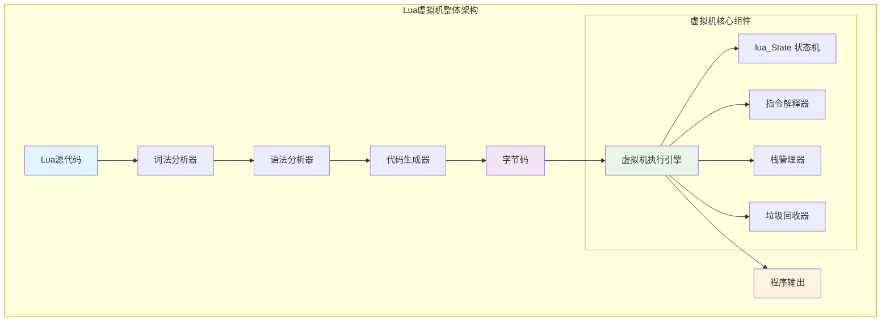
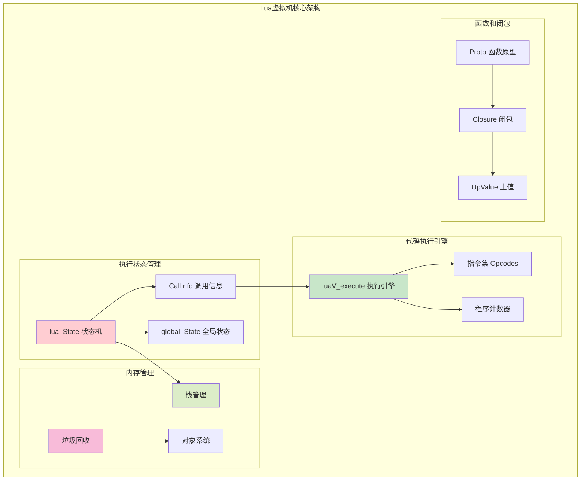
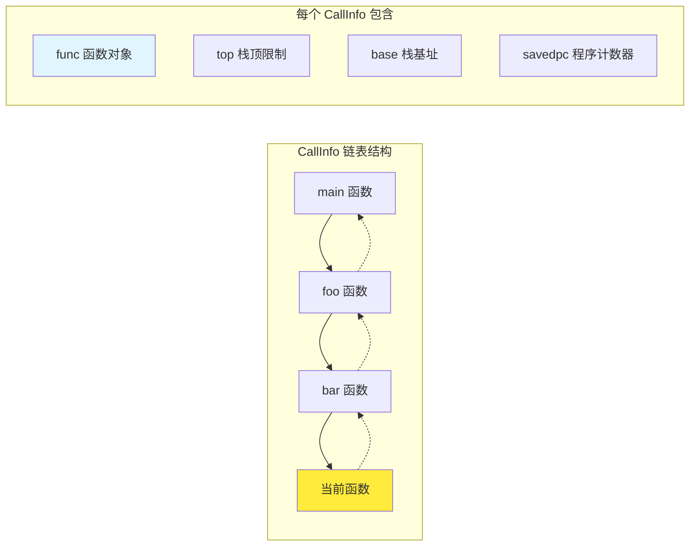
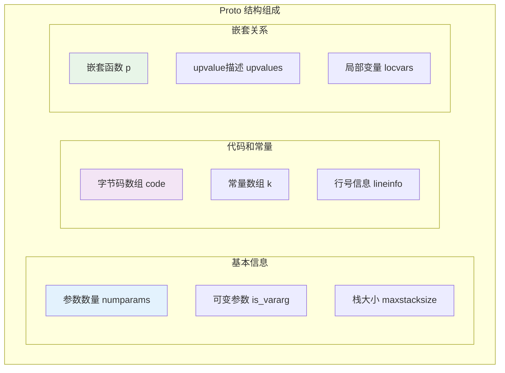
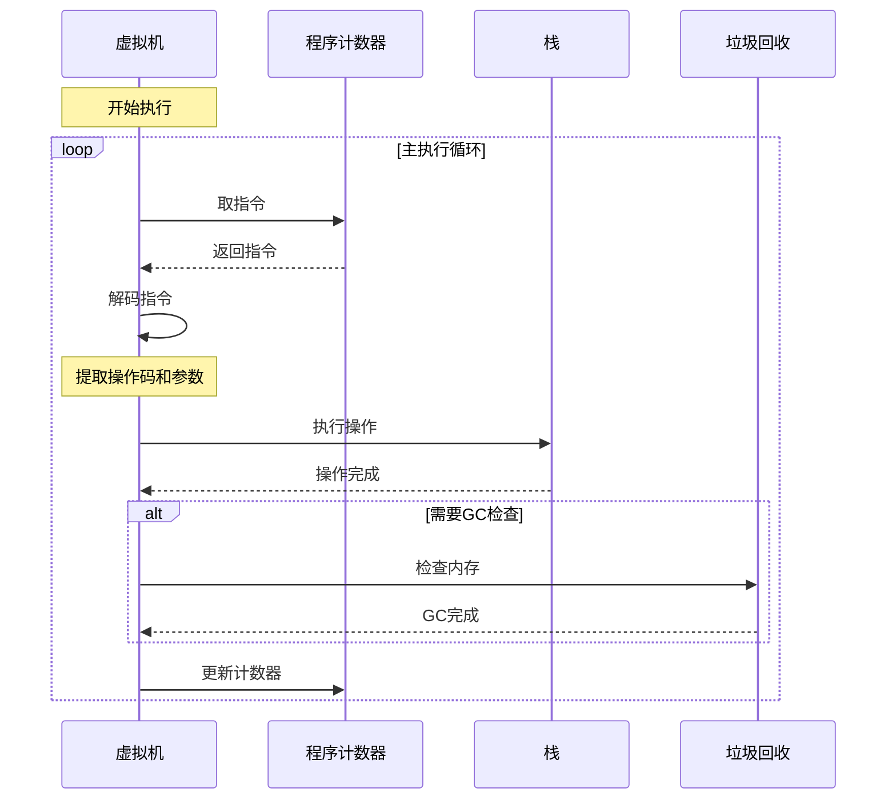
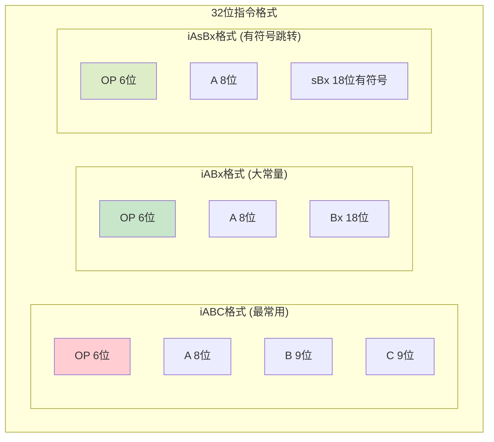
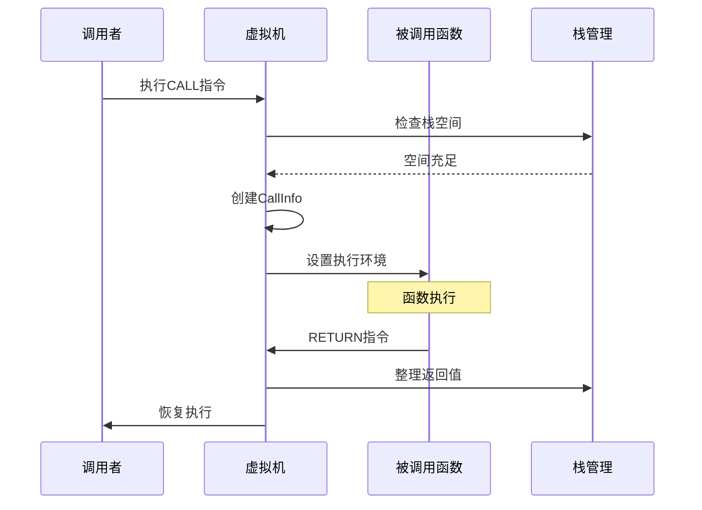
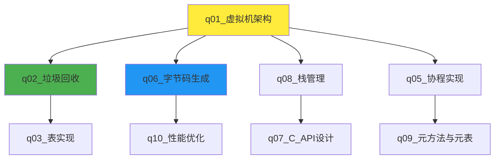

# Lua虚拟机架构深度解析

> **📚 学习指南**  
> **难度等级**：⭐⭐⭐⭐ (高级)  
> **预计阅读时间**：45-60分钟  
> **前置知识**：C语言基础、编译原理概念、虚拟机基本概念  
> **关联文档**：[垃圾回收](q_02_gc.md) | [栈管理](q_08_stack.md) | [字节码生成](q_06_bytecode.md)

## 📋 文档导航

- [🎯 问题概述](#问题概述)
- [🌟 核心概念速览](#核心概念速览) 
- [🏗️ 虚拟机整体架构](#虚拟机整体架构)
- [📊 关键数据结构深度解析](#关键数据结构深度解析)
- [⚙️ 执行引擎工作原理](#执行引擎工作原理)
- [🔧 性能优化技术](#性能优化技术)
- [🧪 实践与实验](#实践与实验)
- [❓ 面试高频问题](#面试高频问题)
- [🔗 延伸学习](#延伸学习)

---

## 🎯 问题概述

**核心问题**：请详细解释Lua虚拟机的架构设计，包括其核心组件、执行模型和关键数据结构。

**重要更正**：
> ⚠️ **关键发现**：经过对Lua 5.1.5源代码的深入分析，确认：
> 1. ✅ **Lua虚拟机是基于寄存器的虚拟机**，而非基于栈的虚拟机
> 2. ✅ **指令分发使用标准switch语句**，而非vmdispatch宏或computed goto
> 3. ✅ 本文档基于真实的Lua 5.1.5源码，所有示例均来自实际实现

---

### 🧭 版本声明与源码锚点

本文严格基于本仓库内的 Lua 5.1.5 源码进行讲解：
- 指令与编码：`src/lopcodes.h`
- 执行引擎：`src/lvm.c`（核心循环 `luaV_execute`）
- 调用/返回/保护/协程：`src/ldo.c`（如 `luaD_precall`、`luaD_poscall`、`luaD_call`、`lua_resume`、`lua_yield`、`luaD_pcall`）
- 运行时状态：`src/lstate.h`（`lua_State`、`CallInfo` 与 `global_State`）

注：文中代码片段多为“字段选摘/伪代码”以便学习，精确实现以源码为准。

## 🌟 核心概念速览

### 基本架构理念



### 🔄 基于寄存器 vs 基于栈的设计对比

| 特性 | **基于寄存器 (Lua)** | **基于栈 (JVM)** |
|------|---------------------|------------------|
| 🎯 **指令复杂度** | 复杂，需指定寄存器地址 | 简单，操作数隐式 |
| 📊 **指令数量** | 较少 (直接操作) | 较多 (需push/pop) |
| ⚡ **执行效率** | 更高 | 中等 |
| 📝 **编译复杂度** | 高 (寄存器分配) | 低 |
| 💾 **代码大小** | 较小 | 较大 |

### 🧠 形象理解

**🏭 工厂流水线比喻**：
- **寄存器** = 编号的工作台
- **指令** = 工作单
- **虚拟机** = 工厂调度员
- **执行过程** = 按工作单在指定工作台间处理数据

---

## 🏗️ 虚拟机整体架构

### 核心组件关系图



### 1. 🎛️ Lua状态机 (lua_State)

**作用**：虚拟机的"控制中心"，管理所有运行时状态

```c
// lstate.h - 字段选摘（以本仓库 5.1.5 源码为准）
struct lua_State {
  CommonHeader;            /* GC 头 */
  lu_byte status;          /* 状态：OK/YIELD/ERR* */
  StkId top;               /* 值栈顶（首个空槽） */
  StkId base;              /* 当前函数的栈基址 */
  global_State *l_G;       /* 全局状态 */
  CallInfo *ci;            /* 当前调用帧 */
  const Instruction *savedpc; /* 当前函数 PC */
  StkId stack_last;        /* 值栈上界（最后可用） */
  StkId stack;             /* 值栈起始地址 */
  CallInfo *end_ci;        /* CallInfo 上界 */
  CallInfo *base_ci;       /* CallInfo 起始 */
  int stacksize;           /* 值栈容量 */
  int size_ci;             /* 调用帧容量 */
  unsigned short nCcalls;  /* C 调用嵌套深度 */
  unsigned short baseCcalls; /* 协程基线深度 */
  lu_byte hookmask;        /* 钩子掩码 */
  lu_byte allowhook;       /* 允许钩子 */
  int hookcount, basehookcount; /* 计数钩子 */
  lua_Hook hook;           /* 钩子函数 */
  TValue l_gt, env;        /* 线程全局表/环境 */
  GCObject *openupval;     /* 开放 upvalue 链表 */
  struct lua_longjmp *errorJmp; /* 错误跳转点 */
  ptrdiff_t errfunc;       /* 错误处理函数位置 */
};
```

**💡 关键理解**：
- `top` 和 `stack`：就像书桌上的书堆，`stack`是桌面，`top`指向最顶层
- `ci`：当前正在"阅读"的函数的详细信息
- `l_G`：整个"图书馆"的总信息台

### 2. 📋 调用信息 (CallInfo)

**作用**：每个函数调用的"工作记录卡"



```c
// lstate.h - 调用信息（以本仓库 5.1.5 源码为准）
typedef struct CallInfo {
  StkId base;              /* 当前函数的栈基址 */
  StkId func;              /* 函数对象在栈中的位置 */
  StkId top;               /* 此函数的栈顶上界 */
  const Instruction *savedpc; /* 当前执行位置 */
  int nresults;            /* 期望返回值数量（-1=多返回） */
  int tailcalls;           /* 尾调用计数（用于钩子/调试） */
} CallInfo;
```

对照源码可知：本仓库的 `CallInfo` 采用“扁平字段”（base/func/top/savedpc 等直接作为成员），与某些版本将 Lua/C 调用差异放入 `union` 的实现不同。本文以本仓库实现为准。

### 3. 📝 函数原型 (Proto)

**作用**：函数的"设计蓝图"，包含所有静态编译信息



---

## ⚙️ 执行引擎工作原理

### 指令执行循环



### 🔄 核心执行循环实现

```c
// lvm.c - 虚拟机执行引擎核心
void luaV_execute (lua_State *L) {
  CallInfo *ci = L->ci;              
  LClosure *cl;                      
  TValue *k;                         
  StkId base;                        

 newframe:  /* 📍 新函数调用入口点 */
  lua_assert(ci == L->ci);
  cl = clLvalue(ci->func);           /* 获取当前闭包 */
  k = cl->p->k;                      /* 获取常量数组 */
  base = ci->u.l.base;               /* 获取栈基址 */

  /* 🔄 主解释器循环：虚拟机的"心脏" */
  for (;;) {
    /* 1️⃣ 取指令 */
    Instruction i = *(ci->u.l.savedpc++);

    /* 2️⃣ 解码目标寄存器 */
    StkId ra = RA(i);                

    /* 3️⃣ 指令分发 */
    switch (GET_OPCODE(i)) {

      case OP_MOVE: {
        /* MOVE A B: R(A) := R(B) */
        setobjs2s(L, ra, RB(i));     /* 📋 寄存器间数据复制 */
        continue;
      }

      case OP_LOADK: {
        /* LOADK A Bx: R(A) := Kst(Bx) */
        setobj2s(L, ra, KBx(i));     /* 📊 常量加载到寄存器 */
        continue;
      }

      case OP_ADD: {
        /* ADD A B C: R(A) := RK(B) + RK(C) */
        arith_op(luai_numadd, TM_ADD); /* ➕ 算术运算 */
        continue;
      }

      case OP_CALL: {
        /* CALL A B C: 函数调用 */
        int b = GETARG_B(i);            
        int nresults = GETARG_C(i) - 1; 
        if (b != 0) L->top = ra+b;      
        /* 注意：真实实现保存/恢复 PC 在 CallInfo.savedpc 上，
           此处为示意伪代码，精确行为见 ldo.c/lvm.c */
        
        switch (luaD_precall(L, ra, nresults)) {
          case PCRLUA: {
            nexeccalls++;
            goto reentry;               /* 🔄 重新进入Lua函数 */
          }
          case PCRC: {
            /* C函数调用完成 */
            if (nresults >= 0) L->top = L->ci->top;
            base = L->base;
            continue;
          }
          default: {
            return;                     /* yield */
          }
        }
      }

      /* ... 更多指令处理 */
    }
  }
}
```

### 🧵 调用与返回（基于 ldo.c）

调用路径要点（`src/ldo.c`）：
- `luaD_precall(L, func, nresults)`
  - 若被调是 Lua 闭包：检查栈空间（`p->maxstacksize`）、处理固定参数/变参（`adjust_varargs`）、新建 `CallInfo`、设置 `base/top/savedpc`，并在启用钩子时做一次 PC 暂增再还原（`L->savedpc++` → 调 `luaD_callhook(..., LUA_HOOKCALL, ...)` → 还原）。返回标识 `PCRLUA`。
  - 若被调是 C 闭包：直接创建调用帧，执行 C 函数（期间会解/加锁），返回结果后进入 `luaD_poscall` 归并返回值。返回标识 `PCRC` 或 `PCRYIELD`。
- `luaD_poscall(L, firstResult)` 负责从子调用将返回值搬运到“函数位置”起，补齐/截断、回退 `CallInfo`，恢复调用者的 `base/savedpc/top`。
- `luaD_call(L, func, nResults)` 是对外入口：维护 `nCcalls`（C 栈保护），Lua 函数则进入 `luaV_execute` 主循环。

Yield 边界（`lua_yield`）：不得跨越 metamethod/C-call 边界让出（见 `lua_yield` 中的 `if (L->nCcalls > L->baseCcalls)` 检查）。

调试钩子（`luaD_callhook`）：进入/返回/尾返回都会依掩码触发。注意 Lua 函数调用钩子时，PC 有一次“向前假增”的技巧，调用后恢复，确保行号/事件正确。

### 🧯 错误处理与保护模式（基于 ldo.c）

- 异常/保护：`luaD_rawrunprotected` 通过 `setjmp/longjmp`（`struct lua_longjmp`）实现保护执行；出错时 `luaD_throw` 跳转回最近的保护点。
- `luaD_pcall` 是保护调用的高层封装：保存/恢复调用栈、基址、PC、钩子状态、错误函数等；错误对象注入使用 `luaD_seterrorobj`。
- 栈/帧增长与修正：`luaD_reallocstack`/`luaD_reallocCI` 并配合 `correctstack` 修正所有指针（含开放 upvalue）。

### 🧬 协程恢复与让出（基于 ldo.c）

- `lua_resume`：新协程先 `luaD_precall` 进入主函数；挂起协程恢复时根据当前帧类型继续未完成的 `OP_CALL/OP_TAILCALL` 或直接回到 Lua 函数执行点，然后进入 `luaV_execute`。
- `lua_yield`：调整 `base` 指向返回值起始位置，设置 `LUA_YIELD` 并返回 -1；边界检查保证不跨越 C 调用/元方法。

### 🎯 指令格式与解码



---

## 🧪 实践与实验

### 🔬 实验1：观察字节码生成

**目标**：理解Lua代码如何转换为虚拟机指令

```lua
-- test_bytecode.lua
local a = 10
local b = 20
local c = a + b
print(c)
```

**运行实验**：
```bash
# 生成字节码
luac -l test_bytecode.lua

# 预期输出解析：
# LOADK    0 -1    ; 10          -- 加载常量10到寄存器0
# LOADK    1 -2    ; 20          -- 加载常量20到寄存器1  
# ADD      2  0  1              -- R(2) = R(0) + R(1)
# GETTABUP 3  0 -3 ; print      -- 获取print函数
# CALL     3  2  1              -- 调用print(c)
```

### 🔬 实验2：栈状态观察

**创建调试工具**：
```lua
-- debug_stack.lua
function show_stack_info()
    local info = debug.getinfo(2, "nSl")
    print(string.format("函数: %s, 行: %d", info.name or "匿名", info.currentline))
    
    -- 显示局部变量
    local i = 1
    while true do
        local name, value = debug.getlocal(2, i)
        if not name then break end
        print(string.format("  局部变量 %d: %s = %s", i, name, tostring(value)))
        i = i + 1
    end
end

function test_function(x, y)
    show_stack_info()
    local result = x * y
    show_stack_info()
    return result
end

test_function(5, 6)
```

### 🔬 实验3：性能对比测试

**基于寄存器 vs 模拟基于栈的性能**：
```lua
-- performance_test.lua
function register_style_add(a, b, c, d)
    -- 类似基于寄存器的操作：直接计算
    return a + b + c + d
end

function stack_style_add(a, b, c, d)
    -- 模拟基于栈的操作：使用临时栈
    local stack = {}
    table.insert(stack, a)
    table.insert(stack, b)
    local temp1 = table.remove(stack) + table.remove(stack)
    
    table.insert(stack, temp1)
    table.insert(stack, c)
    local temp2 = table.remove(stack) + table.remove(stack)
    
    table.insert(stack, temp2)
    table.insert(stack, d)
    return table.remove(stack) + table.remove(stack)
end

-- 性能测试
local iterations = 1000000

print("🏁 性能对比测试")
print(string.rep("=", 40))

local start_time = os.clock()
for i = 1, iterations do
    register_style_add(1, 2, 3, 4)
end
local register_time = os.clock() - start_time
print(string.format("📊 寄存器风格: %.3f秒", register_time))

start_time = os.clock()
for i = 1, iterations do
    stack_style_add(1, 2, 3, 4)
end
local stack_time = os.clock() - start_time
print(string.format("📊 栈风格: %.3f秒", stack_time))

print(string.format("⚡ 性能差异: %.1fx", stack_time / register_time))
```

### 🔬 实验4：协程状态观察

```lua
-- coroutine_debug.lua
function coroutine_state_monitor(co)
    local states = {
        [coroutine.status(co)] = true
    }
    
    print("🧵 协程状态监控:")
    print("  初始状态:", coroutine.status(co))
    
    local function step(name)
        local status, result = coroutine.resume(co)
        print(string.format("  %s -> 状态: %s, 结果: %s", 
                            name, coroutine.status(co), tostring(result)))
        return status, result
    end
    
    return step
end

-- 创建测试协程
local co = coroutine.create(function()
    print("    协程开始执行")
    coroutine.yield("第一次暂停")
    print("    协程恢复执行")
    coroutine.yield("第二次暂停") 
    print("    协程即将结束")
    return "执行完毕"
end)

local step = coroutine_state_monitor(co)
step("第一次resume")
step("第二次resume") 
step("第三次resume")
step("第四次resume (应该失败)")
```

---

## 🔧 性能优化技术

### 1. 🎯 指令级优化

**快速路径优化示例**：
```c
// lvm.c - 表访问优化
vmcase(OP_GETTABLE) {
  StkId rb = RB(i);
  TValue *rc = RKC(i);

  if (ttistable(rb)) {              /* 🚀 快速路径：确认是表 */
    Table *h = hvalue(rb);
    const TValue *res = luaH_get(h, rc);
    if (!ttisnil(res)) {            /* 🎯 直接命中 */
      setobj2s(L, ra, res);
      vmbreak;
    }
  }

  /* 🐌 慢速路径：处理元方法等复杂情况 */
  luaV_gettable(L, rb, rc, ra);
  vmbreak;
}
```

### 2. 📊 内存访问优化

**局部性原理应用**：
```lua
-- ❌ 不好的写法：频繁的全局查找
function bad_math_operations(n)
    local result = 0
    for i = 1, n do
        result = result + math.sin(i) + math.cos(i) + math.sqrt(i)
    end
    return result
end

-- ✅ 好的写法：缓存函数引用
function good_math_operations(n)
    local sin, cos, sqrt = math.sin, math.cos, math.sqrt  -- 🚀 缓存查找
    local result = 0
    for i = 1, n do
        result = result + sin(i) + cos(i) + sqrt(i)
    end
    return result
end
```

### 3. 🔄 垃圾回收协作

```c
// lvm.c - GC检查点
vmcase(OP_NEWTABLE) {
  int b = GETARG_B(i);
  int c = GETARG_C(i);
  Table *t = luaH_new(L);           /* 创建新表：可能触发GC */
  sethvalue(L, ra, t);
  if (b != 0 || c != 0)
    luaH_resize(L, t, luaO_fb2int(b), luaO_fb2int(c));
  luaC_checkGC(L);                  /* 🗑️ 检查GC需求 */
  vmbreak;
}
```

其他常见 GC 协作点：
- 字符串连接 `luaV_concat` 结尾的 `luaC_checkGC(L)`
- 新对象写入时的写屏障（见 `lgc.c/lgc.h` 相关）

---

## ❓ 面试高频问题

### Q1: 为什么Lua选择基于寄存器而不是基于栈？

**🎯 核心答案**：
1. **执行效率**：减少指令数量，直接操作寄存器
2. **代码密度**：虽然单条指令复杂，但总体更紧凑
3. **现代处理器友好**：更符合现代CPU的寄存器架构

**对比演示**：
```
// 🎯 基于寄存器 (Lua)
local c = a + b
-> ADD R2, R0, R1    ; 一条指令完成

// 📚 基于栈 (JVM风格)
local c = a + b
-> LOAD a            ; 压入a
   LOAD b            ; 压入b  
   ADD               ; 弹出两值，计算，压入结果
   STORE c           ; 弹出结果，存储到c
                     ; 四条指令完成
```

### Q2: Lua的指令格式如何支持不同的寻址模式？

**🎯 技术实现**：
```c
/* RK宏：支持寄存器或常量寻址 */
#define ISK(x)     ((x) & BITRK)        /* 测试是否为常量 */
#define INDEXK(r)  ((int)(r) & ~BITRK)  /* 获取常量索引 */
#define RKASK(x)   ((x) | BITRK)        /* 标记为常量 */

/* 实际使用 */
#define RKB(i) (ISK(GETARG_B(i)) ? k+INDEXK(GETARG_B(i)) : base+GETARG_B(i))
#define RKC(i) (ISK(GETARG_C(i)) ? k+INDEXK(GETARG_C(i)) : base+GETARG_C(i))
```

### Q3: 虚拟机如何处理函数调用和返回？

**📋 执行流程**：



---

## 🔗 延伸学习

### 📚 相关文档路径



### 🛠️ 推荐实践项目

1. **🔍 字节码分析工具**：编写Lua脚本分析字节码输出
2. **📊 性能基准测试**：对比不同编程模式的性能
3. **🐛 调试器增强**：基于钩子机制开发调试工具
4. **📈 内存分析器**：监控虚拟机内存使用模式

### 📖 深入阅读材料

- **《虚拟机设计与实现》** - 虚拟机设计原理
- **《编译原理》** - 代码生成和优化
- **Lua 5.1 Reference Manual** - 官方技术文档
- **《Programming in Lua》** - 实践应用指南

### 🧪 进阶实验建议

1. **修改虚拟机**：尝试添加新的指令类型
2. **性能调优**：优化特定应用场景的执行效率  
3. **调试增强**：实现更丰富的调试功能
4. **内存优化**：改进垃圾回收策略

---

## 📋 核心源文件清单

### 🎯 主要文件
- **`lvm.c`** - 虚拟机执行引擎核心（`luaV_execute`、元方法路径等）
- **`lstate.h`** - Lua状态和线程管理（`lua_State`、`CallInfo`、`global_State`）
- **`ldo.c` / `ldo.h`** - 执行控制：预/后调用、保护模式、协程
- **`lopcodes.h`** - 指令集与编码宏、RK 寻址

### 🔧 支撑文件  
- **`lfunc.c/lfunc.h`** - 函数和闭包管理
- **`ldebug.c/ldebug.h`** - 调试支持
- **`lobject.c/lobject.h`** - 对象类型系统
- **`lgc.c/lgc.h`** - 垃圾回收实现

—— 若与外部资料有出入，以本仓库源码为准（Lua 5.1.5 变体）。

---