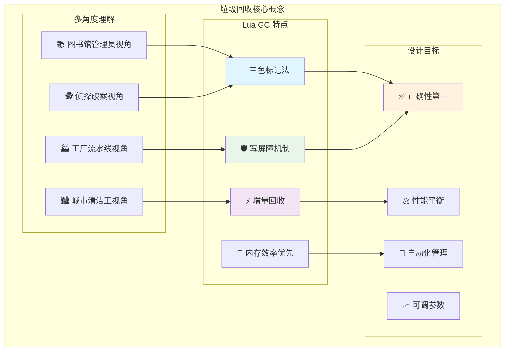
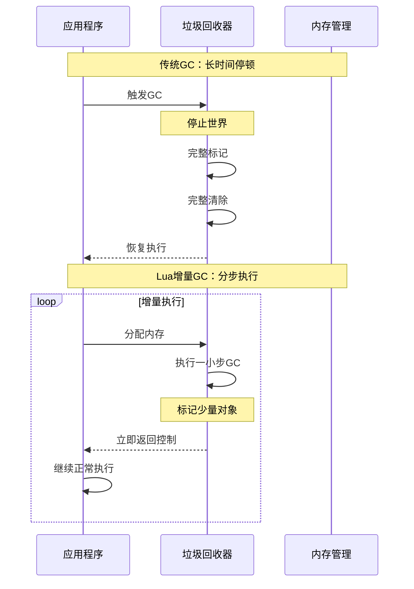
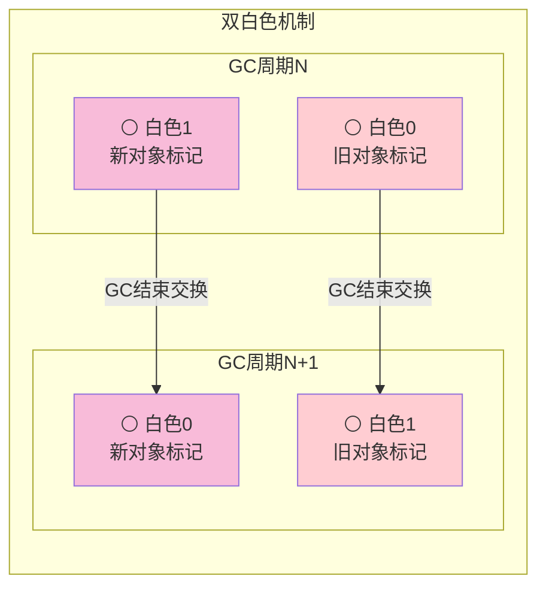
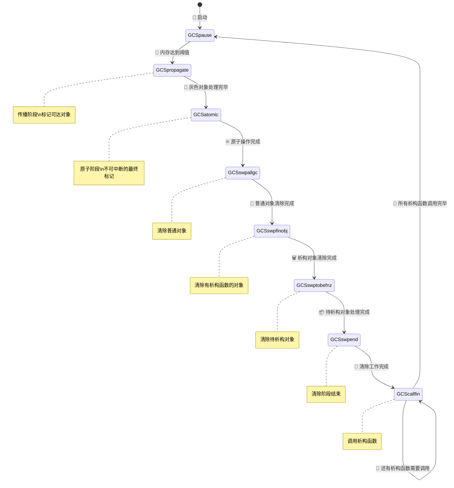
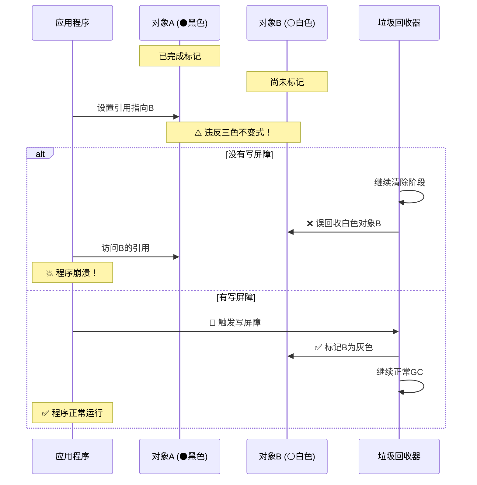
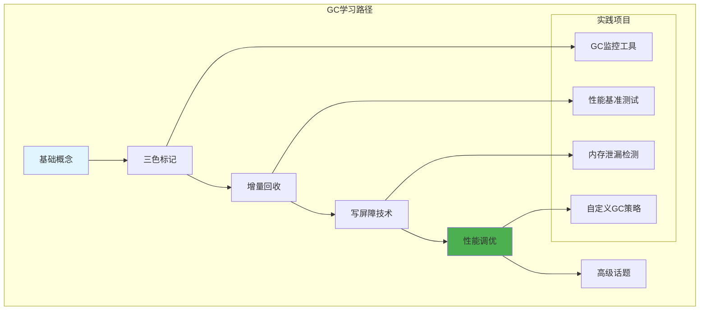

# Lua垃圾回收机制深度解析

> **📚 学习指南**  
> **难度等级**：⭐⭐⭐⭐⭐ (专家级)  
> **预计阅读时间**：60-90分钟  
> **前置知识**：内存管理基础、图论基本概念、并发编程概念  
> **关联文档**：[虚拟机架构](q_01_vm.md) | [表实现](q_03_table.md) | [性能优化](q_10_performance.md)

## 📋 文档导航

- [🎯 核心问题](#核心问题)
- [🌟 垃圾回收概念速览](#垃圾回收概念速览)
- [🎨 三色标记算法深度解析](#三色标记算法深度解析)
- [⚡ 增量回收机制](#增量回收机制)
- [🛡️ 写屏障技术详解](#写屏障技术详解)
- [🔄 GC状态机与控制流程](#gc状态机与控制流程)
- [📊 对象遍历与标记传播](#对象遍历与标记传播)
- [🧪 实践与性能调优](#实践与性能调优)
- [❓ 面试核心问题](#面试核心问题)
- [🔗 延伸学习](#延伸学习)

---

## 🎯 核心问题

**详细解释Lua的垃圾回收算法，包括三色标记法的实现、增量回收机制以及相关的性能优化策略。**

---

## 🌟 垃圾回收概念速览

### 🧠 形象理解垃圾回收

想象你的房间里堆满了各种物品，有些还在使用，有些已经不需要了。垃圾回收就像一个智能的"**清洁工**"，它的任务是找出那些不再需要的物品并清理掉，但绝不能误扔还在使用的东西。



### 🎨 三色标记法核心概念

**三色标记法**是现代垃圾回收的核心算法，使用三种"颜色"标记对象的生存状态：

| 颜色 | 含义 | 比喻 | 技术状态 |
|------|------|------|----------|
| ⚪ **白色** | 可能是垃圾 | 🏷️ 待检查的可疑物品 | 未标记或当前回收目标 |
| 🔘 **灰色** | 正在检查中 | 🔍 正在调查的线索 | 已标记但引用未完全检查 |
| ⚫ **黑色** | 确认存活 | ✅ 确认保留的重要物品 | 已标记且引用已全部检查 |

### ⚡ 增量回收策略



---

## 🎨 三色标记算法深度解析

### 🎯 三色不变式

**三色不变式**是三色标记算法的安全保证：

> **核心原则**：⚫**黑色对象不能直接指向**⚪**白色对象**

```c
// lgc.h - 颜色状态系统实现
#define WHITE0BIT	0  /* 白色0：当前回收周期的可回收标记 */
#define WHITE1BIT	1  /* 白色1：下一回收周期的可回收标记 */  
#define BLACKBIT	2  /* 黑色：已确认存活且引用已全部检查 */
#define FINALIZEDBIT	3  /* 已终结：对象已调用析构函数 */

/* 🎨 颜色检测宏 */
#define WHITEBITS	bit2mask(WHITE0BIT, WHITE1BIT)
#define iswhite(x)      testbits((x)->marked, WHITEBITS)
#define isblack(x)      testbit((x)->marked, BLACKBIT)
#define isgray(x)       (!testbits((x)->marked, WHITEBITS | bitmask(BLACKBIT)))

/* 🔄 颜色转换宏 */
#define gray2black(x)	l_setbit((x)->marked, BLACKBIT)
#define white2gray(x)   resetbits((x)->marked, WHITEBITS)
#define black2gray(x)   resetbit((x)->marked, BLACKBIT)
```

### 🎭 双白色技术

**为什么需要两种白色？**



```c
// lgc.c - 双白色机制核心实现
/* 🆕 创建新对象时的颜色设置 */
GCObject *luaC_newobj (lua_State *L, int tt, size_t sz) {
  global_State *g = G(L);
  GCObject *o = cast(GCObject *, luaM_newobject(L, novariant(tt), sz));
  
  o->marked = luaC_white(g);  /* 新对象使用当前白色 */
  o->tt = tt;
  o->next = g->allgc;
  g->allgc = o;
  return o;
}

/* 🔄 GC周期结束时交换白色 */
static void atomic (lua_State *L) {
  global_State *g = G(L);
  
  /* ... 原子阶段的其他操作 ... */
  
  /* 交换白色：让新白色成为"垃圾色" */
  g->currentwhite = cast_byte(otherwhite(g));
  
  /* 现在所有旧的白色对象都变成了"垃圾色"，
     而在GC过程中新分配的对象仍然是"存活色" */
}
```

### 📐 三色不变式的维护

```c
// lgc.c - 三色不变式维护机制
/*
💡 不变式维护的两种策略：

1. 🎯 前向屏障：标记白色对象为灰色
   - 优点：立即保证安全性
   - 缺点：可能过度标记

2. 🔄 后向屏障：降级黑色对象为灰色  
   - 优点：延迟处理，减少当前工作
   - 缺点：增加后续GC负担
*/

static void reallymarkobject (global_State *g, GCObject *o) {
  lua_assert(iswhite(o) && !isdead(g, o));
  white2gray(o);  /* ⚪ 白色转 🔘 灰色 */

  switch (o->tt) {
    case LUA_TSTRING: {
      /* 📝 字符串没有引用其他对象，直接标记为黑色 */
      gray2black(o);
      break;
    }
    case LUA_TUSERDATA: {
      /* 👤 用户数据：标记为黑色，但需要标记其元表和环境 */
      Table *mt = gco2u(o)->metatable;
      gray2black(o);
      if (mt) markobject(g, mt);          /* 标记元表 */
      markobject(g, gco2u(o)->env);       /* 标记环境 */
      break;
    }
    default: {
      /* 🔗 复杂对象：加入灰色链表，等待遍历其引用 */
      o->gclist = g->gray;
      g->gray = o;
      break;
    }
  }
}
```

---

## ⚡ 增量回收机制

### 🎮 增量vs批量回收对比

```mermaid
gantt
    title GC执行模式对比
    dateFormat X
    axisFormat %s
    
    section 传统批量GC
    应用暂停     :crit, 0, 3
    完整GC执行   :active, 0, 3
    应用恢复     :3, 6
    
    section Lua增量GC
    应用执行     :done, 0, 1
    GC步骤1      :active, 1, 1.2
    应用执行     :done, 1.2, 2.2
    GC步骤2      :active, 2.2, 2.4
    应用执行     :done, 2.4, 3.4
    GC步骤3      :active, 3.4, 3.6
    应用执行     :done, 3.6, 4.6
```



### 💰 GC债务管理系统

**通俗理解**：GC债务就像"**信用卡账单**"，每次分配内存都在"**花钱**"，需要通过执行GC工作来"**还款**"。

```c
// lgc.c - GC债务计算与管理
#define GCSTEPSIZE	1024u  /* 基本GC步长：1KB */
#define GCPAUSE		200    /* GC暂停百分比：200% */
#define GCSTEPMUL	200    /* GC步长倍数：200% */

/* 💳 债务管理宏 */
#define getdebt(g)	(g->GCdebt)
#define setdebt(g,d) (g->GCdebt = (d))

void luaC_step (lua_State *L) {
  global_State *g = G(L);
  l_mem debt = getdebt(g);  /* 📊 获取当前债务 */
  
  if (!g->gcrunning) {  /* GC未运行？ */
    luaE_setdebt(g, -GCSTEPSIZE);  /* 💤 延迟GC启动 */
    return;
  }

  /* 🔄 执行GC工作直到债务转为负数 */
  do {
    lu_mem work = singlestep(L);  /* 执行一个GC步骤 */
    debt -= work;                 /* 💰 用工作量抵消债务 */
  } while (debt > -GCSTEPSIZE && g->gcstate != GCSpause);

  /* 📈 调整下一轮的债务计算 */
  if (g->gcstate == GCSpause) {
    setpause(g);  /* 🎯 设置下次GC触发点 */
  } else {
    debt = (debt / g->gcstepmul) * STEPMULADJ;
    luaE_setdebt(g, debt);
    runafewfinalizers(L);  /* 🧹 运行部分析构函数 */
  }
}
```

### 🎛️ 性能参数调优

| 参数 | 默认值 | 作用 | 调优策略 |
|------|-------|------|----------|
| **gcpause** | 200% | 控制GC触发频率 | 🔻 降低→更频繁GC，🔺 提高→减少GC |
| **gcstepmul** | 200% | 控制每步工作量 | 🔻 降低→减少停顿，🔺 提高→减少总开销 |

```lua
-- 🎯 GC参数调优示例
-- 低延迟场景（如游戏）
collectgarbage("setpause", 100)    -- 内存增长100%就触发
collectgarbage("setstepmul", 400)  -- 每步多做工作，快速完成

-- 高吞吐量场景（如批处理）  
collectgarbage("setpause", 300)    -- 允许更多内存增长
collectgarbage("setstepmul", 100)  -- 每步少做工作，减少中断
```

---

## 🔄 GC状态机与控制流程

### 🗺️ 状态转换全景图



### ⚙️ 状态机核心实现

```c
// lgc.c - GC状态定义与说明
#define GCSpropagate	0  /* 🌊 传播阶段：处理灰色对象链表 */
#define GCSatomic	1  /* ⚛️ 原子阶段：不可中断的最终标记 */
#define GCSinsideatomic	2  /* 🔒 原子内部：处理特殊对象 */
#define GCSswpallgc	3  /* 🧹 清除普通对象 */
#define GCSswpfinobj	4  /* 🗑️ 清除析构对象 */
#define GCSswptobefnz	5  /* 📦 清除待析构对象 */
#define GCSswpend	6  /* 🏁 清除结束 */
#define GCScallfin	7  /* 📞 调用析构函数 */
#define GCSpause	8  /* 💤 暂停状态 */

/* 🎯 单步执行函数：GC状态机的核心 */
static lu_mem singlestep (lua_State *L) {
  global_State *g = G(L);
  
  switch (g->gcstate) {
    case GCSpropagate: {
      /* 🌊 传播阶段：标记可达对象 */
      if (g->gray == NULL) {  
        g->gcstate = GCSatomic;  /* ➡️ 无更多灰色对象，进入原子阶段 */
        return 0;
      } else {
        return propagatemark(g);  /* 🔍 处理一个灰色对象 */
      }
    }

    case GCSatomic: {
      /* ⚛️ 原子阶段：关键的不可中断操作 */
      lu_mem work = atomic(L);  
      entersweep(L);           
      g->gcstate = GCSswpallgc;
      return work;
    }

    case GCSswpallgc: {
      /* 🧹 清除普通对象 */
      return sweepstep(L, g, GCSswpfinobj, &g->finobj);
    }

    case GCSswpfinobj: {
      /* 🗑️ 清除有析构函数的对象 */
      return sweepstep(L, g, GCSswptobefnz, &g->tobefnz);
    }

    case GCSswptobefnz: {
      /* 📦 清除待析构对象 */
      return sweepstep(L, g, GCSswpend, NULL);
    }

    case GCSswpend: {
      /* 🏁 清除阶段结束 */
      makewhite(g, g->mainthread);  
      checkSizes(L, g);             
      g->gcstate = GCScallfin;
      return 0;
    }

    case GCScallfin: {
      /* 📞 调用析构函数 */
      if (g->tobefnz && !g->gcemergency) {
        GCTM(L, 1);  /* 🎭 调用一个析构函数 */
        return (GCFINALIZECOST);
      } else {
        g->gcstate = GCSpause;  /* 🔄 回到暂停状态 */
        return 0;
      }
    }

    default: lua_assert(0); return 0;
  }
}
```

### ⚛️ 原子阶段深度解析

**为什么需要原子阶段？**

原子阶段是GC的"**最后安全检查**"，必须一次性完成，确保没有对象被遗漏。

```c
// lgc.c - 原子阶段实现
static lu_mem atomic (lua_State *L) {
  global_State *g = G(L);
  lu_mem work;
  GCObject *origweak, *origall;
  GCObject *grayagain = g->grayagain;

  lua_assert(g->ephemeron == NULL && g->weak == NULL);
  lua_assert(!iswhite(g->mainthread));

  g->gcstate = GCSinsideatomic;
  g->GCmemtrav = 0;

  /* 1️⃣ 标记根对象 */
  markobject(g, L);  /* 🎯 标记主线程 */

  /* 2️⃣ 重新标记在并发期间修改的对象 */
  g->grayagain = NULL;
  g->weak = g->allweak;
  g->allweak = NULL;
  g->ephemeron = NULL;
  work = propagateall(g);  /* 🌊 处理所有grayagain对象 */

  /* 3️⃣ 处理弱引用表 */
  work += traverseweaks(g, &g->weak);
  work += traverseweaks(g, &g->ephemeron);

  /* 4️⃣ 清理弱引用表中的死对象 */
  clearkeys(g, g->weak, NULL);
  clearkeys(g, g->allweak, NULL);
  clearvalues(g, g->weak, origweak);
  clearvalues(g, g->allweak, origall);

  /* 5️⃣ 分离需要调用析构函数的对象 */
  separatetobefnz(g, 0);

  /* 6️⃣ 🔄 交换白色，准备清除阶段 */
  g->currentwhite = cast_byte(otherwhite(g));

  work += g->GCmemtrav;
  return work;
}
```

---

## 🛡️ 写屏障技术详解

### 🚨 写屏障的必要性

**核心问题**：在增量GC过程中，应用程序可能会破坏三色不变式



### 🔧 写屏障实现机制

```c
// lgc.h - 写屏障核心宏定义
/*
🎯 写屏障触发条件：
1. iscollectable(v)：新值是可回收对象
2. isblack(p)：父对象是黑色（已标记）
3. iswhite(gcvalue(v))：新值是白色（未标记）
*/

#define luaC_barrier(L,p,v) ( \
    (iscollectable(v) && isblack(p) && iswhite(gcvalue(v))) ? \
    luaC_barrier_(L,obj2gco(p),gcvalue(v)) : cast_void(0))

/* 🔄 后向写屏障：用于表的批量修改优化 */
#define luaC_barrierback(L,p,v) ( \
    (iscollectable(v) && isblack(p) && iswhite(gcvalue(v))) ? \
    luaC_barrierback_(L,p) : cast_void(0))

/* 🎯 对象写屏障：用于对象字段的直接修改 */
#define luaC_objbarrier(L,p,o) ( \
    (isblack(p) && iswhite(o)) ? \
    luaC_barrier_(L,obj2gco(p),obj2gco(o)) : cast_void(0))
```

### 🎭 两种写屏障策略

```c
// lgc.c - 写屏障实现策略
void luaC_barrier_ (lua_State *L, GCObject *o, GCObject *v) {
  global_State *g = G(L);
  lua_assert(isblack(o) && iswhite(v) && !isdead(g, v) && !isdead(g, o));

  if (keepinvariant(g)) {  /* 🔍 标记阶段？ */
    /*
    🎯 前向屏障策略：
    - 立即标记白色对象为灰色
    - 保守但安全的策略
    - 可能导致更多对象被标记
    */
    reallymarkobject(g, v);
  } else {  /* 🧹 清除阶段 */
    /*
    🔄 后向屏障策略：
    - 将黑色对象降级为白色
    - 延迟处理策略
    - 对象将在下次GC中重新检查
    */
    lua_assert(issweepphase(g));
    makewhite(g, o);
  }
}

/* 📊 后向屏障：针对表的优化 */
void luaC_barrierback_ (lua_State *L, Table *t) {
  global_State *g = G(L);
  lua_assert(isblack(t) && !isdead(g, t));
  
  black2gray(t);  /* 🔘 重新标记为灰色 */
  t->gclist = g->grayagain;  /* 📋 加入重新标记链表 */
  g->grayagain = obj2gco(t);
}
```

### 📈 写屏障性能优化

```c
// 写屏障的性能考虑与优化
/*
⚡ 性能优化策略：

1. 🚀 快速路径：大多数赋值不需要写屏障
2. 🎯 内联检查：避免函数调用开销  
3. 📦 批量处理：某些情况下批量执行屏障
4. 🔍 条件优化：使用位运算快速检查
*/

/* 💨 快速检查：避免不必要的函数调用开销 */
static inline int need_barrier(GCObject *p, GCObject *v) {
    return (iscollectable(v) && 
            isblack(p) && 
            iswhite(gcvalue(v)));
}

/* 🎯 条件GC检查：只在必要时触发GC步骤 */
#define luaC_condGC(L,pre,pos) \
    { if (G(L)->GCdebt > 0) { pre; luaC_step(L); pos;}; \
      condchangemem(L,pre,pos); }

#define luaC_checkGC(L) \
    luaC_condGC(L,(void)0,(void)0)
```

---

## 📊 对象遍历与标记传播

### 🌊 标记传播核心流程

```mermaid
flowchart TB
    subgraph "标记传播过程"
        A[🔘 取出灰色对象] --> B{对象类型？}
        
        B -->|📝 字符串| C[⚫ 直接标记为黑色]
        B -->|📊 表对象| D[🔍 遍历表元素]
        B -->|🎭 闭包| E[🔍 遍历upvalue]
        B -->|🧵 线程| F[🔍 遍历栈内容]
        B -->|📋 函数原型| G[🔍 遍历常量和嵌套函数]
        
        D --> H[🏷️ 标记键值对]
        E --> I[🏷️ 标记upvalue引用]
        F --> J[🏷️ 标记栈对象]
        G --> K[🏷️ 标记常量数组]
        
        H --> L[⚫ 标记为黑色]
        I --> L
        J --> L
        K --> L
        
        C --> M[📏 计算遍历大小]
        L --> M
        
        M --> N[🔄 继续下一个灰色对象]
    end
    
    style A fill:#e3f2fd
    style C fill:#424242
    style L fill:#424242
```



### 🎯 核心传播函数

```c
// lgc.c - 标记传播的核心实现
static lu_mem propagatemark (global_State *g) {
  lu_mem size;
  GCObject *o = g->gray;  /* 📤 从灰色链表取出一个对象 */
  
  lua_assert(isgray(o));
  gray2black(o);  /* 🔘➡️⚫ 灰色转黑色 */

  /* 🎭 根据对象类型执行不同的遍历策略 */
  switch (o->tt) {
    case LUA_TTABLE: {
      Table *h = gco2t(o);
      g->gray = h->gclist;  /* 📋 从灰色链表移除 */
      size = traversetable(g, h);  /* 📊 遍历表的所有元素 */
      break;
    }
    
    case LUA_TLCL: {  /* 🎭 Lua闭包 */
      LClosure *cl = gco2lcl(o);
      g->gray = cl->gclist;
      size = traverseLclosure(g, cl);
      break;
    }
    
    case LUA_TCCL: {  /* 🔧 C闭包 */
      CClosure *cl = gco2ccl(o);
      g->gray = cl->gclist;
      size = traverseCclosure(g, cl);
      break;
    }
    
    case LUA_TTHREAD: {  /* 🧵 线程对象 */
      lua_State *th = gco2th(o);
      g->gray = th->gclist;
      size = traversethread(g, th);
      break;
    }
    
    case LUA_TPROTO: {  /* 📋 函数原型 */
      Proto *p = gco2p(o);
      g->gray = p->gclist;
      size = traverseproto(g, p);
      break;
    }
    
    default: lua_assert(0); size = 0;
  }

  g->GCmemtrav += size;  /* 📊 累计遍历的内存大小 */
  return size;
}
```

### 📊 表对象遍历详解

```c
// lgc.c - 表对象的复杂遍历逻辑
static lu_mem traversetable (global_State *g, Table *h) {
  const char *weakkey, *weakvalue;
  const TValue *mode = gfasttm(g, h->metatable, TM_MODE);

  /* 🔍 检查是否是弱引用表 */
  if (mode && ttisstring(mode) &&
      ((weakkey = strchr(svalue(mode), 'k')),
       (weakvalue = strchr(svalue(mode), 'v')),
       (weakkey || weakvalue))) {
    
    /* 🌊 弱引用表需要特殊处理 */
    black2gray(h);  /* 🔄 重新标记为灰色 */
    
    if (!weakkey)   /* 💪 强键弱值？ */
      traverseweakvalue(g, h);
    else if (!weakvalue)  /* 💪 弱键强值？ */
      traverseephemeron(g, h);
    else  /* 💭 全弱引用 */
      linktable(h, &g->allweak);
  } else {
    /* 💪 强引用表：标准遍历 */
    traversestrongtable(g, h);
  }

  return sizeof(Table) + sizeof(TValue) * h->sizearray +
         sizeof(Node) * cast(size_t, allocsizenode(h));
}

/* 💪 强引用表遍历 */
static void traversestrongtable (global_State *g, Table *h) {
  Node *n, *limit = gnodelast(h);
  unsigned int i;

  /* 🔢 遍历数组部分 */
  for (i = 0; i < h->sizearray; i++)
    markvalue(g, &h->array[i]);

  /* 🗂️ 遍历哈希部分 */
  for (n = gnode(h, 0); n < limit; n++) {
    checkdeadkey(n);  /* ☠️ 检查死键 */
    if (ttisnil(gval(n)))  /* 🕳️ 空值？ */
      removeentry(n);      /* 🗑️ 移除条目 */
    else {
      lua_assert(!ttisnil(gkey(n)));
      markvalue(g, gkey(n));  /* 🏷️ 标记键 */
      markvalue(g, gval(n));  /* 🏷️ 标记值 */
    }
  }

  /* 🎭 标记元表 */
  if (h->metatable) 
    markobject(g, h->metatable);
}
```

### 🎭 闭包对象遍历

```c
// lgc.c - 闭包对象遍历实现
static lu_mem traverseLclosure (global_State *g, LClosure *cl) {
  int i;

  /* 📋 标记函数原型 */
  markobject(g, cl->p);

  /* 🔗 标记所有upvalue */
  for (i = 0; i < cl->nupvalues; i++)
    markvalue(g, &cl->upvals[i]->v);

  return sizeLclosure(cl->nupvalues);
}

static lu_mem traverseCclosure (global_State *g, CClosure *cl) {
  int i;

  /* 🔗 标记所有C闭包的upvalue */
  for (i = 0; i < cl->nupvalues; i++)
    markvalue(g, &cl->upvalue[i]);

  return sizeCclosure(cl->nupvalues);
}
```

### 🧵 线程对象遍历

```c
// lgc.c - 线程栈的遍历
static lu_mem traversethread (global_State *g, lua_State *th) {
  StkId o = th->stack;

  /* ☠️ 如果线程已死，只标记栈底函数 */
  if (o == NULL) return 1;

  lua_assert(g->gcstate == GCSinsideatomic ||
             th->openupval == NULL || isintwups(th));

  /* 🔍 遍历整个栈，标记所有值 */
  for (; o < th->top; o++)
    markvalue(g, o);

  /* ⚛️ 原子阶段的特殊处理 */
  if (g->gcstate == GCSinsideatomic) {
    StkId lim = th->stack + th->stacksize;
    
    /* 🧹 清理栈的未使用部分 */
    for (; o < lim; o++)
      setnilvalue(o);

    lua_assert(th->openupval == NULL || isintwups(th));
  }

  return (sizeof(lua_State) + sizeof(TValue) * th->stacksize +
          sizeof(CallInfo) * th->nci);
}
```

---

## 🧪 实践与性能调优

### 🔬 实验1: GC行为观察

**目标**：观察和理解Lua GC的实际工作过程

```lua
-- gc_monitor.lua - GC监控工具
local GCMonitor = {}

function GCMonitor.create()
    local self = {
        start_memory = 0,
        gc_count = 0,
        stats = {}
    }
    
    -- 📊 记录GC统计信息
    function self.start_monitoring()
        self.start_memory = collectgarbage("count")
        self.gc_count = 0
        self.stats = {}
        
        -- 🎯 设置GC参数监控
        print("🚀 开始GC监控")
        print(string.format("📊 初始内存: %.2f KB", self.start_memory))
        print(string.format("🎛️ GC暂停: %d%%", collectgarbage("setpause")))
        print(string.format("🎛️ GC步长: %d%%", collectgarbage("setstepmul")))
    end
    
    function self.record_gc_step(description)
        local current_memory = collectgarbage("count")
        local gc_debt = collectgarbage("count") -- 近似
        
        self.gc_count = self.gc_count + 1
        table.insert(self.stats, {
            step = self.gc_count,
            description = description,
            memory = current_memory,
            time = os.clock()
        })
        
        print(string.format("📈 步骤 %d: %s - 内存: %.2f KB", 
                           self.gc_count, description, current_memory))
    end
    
    function self.trigger_gc_phases()
        print("\n🔄 手动触发GC各阶段:")
        
        -- 创建大量对象触发GC
        self.record_gc_step("创建对象前")
        
        local objects = {}
        for i = 1, 10000 do
            objects[i] = {data = string.rep("x", 100), id = i}
        end
        
        self.record_gc_step("创建大量对象后")
        
        -- 强制执行一步GC
        collectgarbage("step", 100)
        self.record_gc_step("执行GC步骤后")
        
        -- 完整GC
        collectgarbage("collect")
        self.record_gc_step("完整GC后")
    end
    
    return self
end

-- 🧪 实际测试
local monitor = GCMonitor.create()
monitor.start_monitoring()
monitor.trigger_gc_phases()
```

### 🔬 实验2: 写屏障效应观测

```lua
-- barrier_test.lua - 写屏障效应测试
local BarrierTest = {}

function BarrierTest.create_reference_chain()
    -- 创建引用链：A -> B -> C -> D
    local objD = {name = "ObjectD", value = "end"}
    local objC = {name = "ObjectC", ref = objD}
    local objB = {name = "ObjectB", ref = objC}  
    local objA = {name = "ObjectA", ref = objB}
    
    return objA, objB, objC, objD
end

function BarrierTest.test_barrier_trigger()
    print("🛡️ 写屏障触发测试")
    
    -- 创建黑色对象（已标记）
    local blackObj = {type = "black", data = "important"}
    
    -- 执行部分GC，让blackObj变为黑色
    collectgarbage("step", 50)
    
    -- 创建白色对象（新分配）
    local whiteObj = {type = "white", data = "new"}
    
    print("📊 分配前内存:", collectgarbage("count"), "KB")
    
    -- 这个赋值会触发写屏障
    blackObj.newRef = whiteObj
    
    print("📊 赋值后内存:", collectgarbage("count"), "KB")
    print("✅ 写屏障已处理引用安全")
end

-- 执行测试
BarrierTest.test_barrier_trigger()
```

### 🔬 实验3: 弱引用表行为

```lua
-- weak_reference_test.lua - 弱引用表测试
local WeakTest = {}

function WeakTest.create_weak_tables()
    -- 🔑 弱键表
    local weak_key_table = {}
    setmetatable(weak_key_table, {__mode = "k"})
    
    -- 💰 弱值表  
    local weak_value_table = {}
    setmetatable(weak_value_table, {__mode = "v"})
    
    -- 🌊 全弱引用表
    local weak_both_table = {}
    setmetatable(weak_both_table, {__mode = "kv"})
    
    return weak_key_table, weak_value_table, weak_both_table
end

function WeakTest.test_weak_behavior()
    print("🌊 弱引用表行为测试")
    
    local wk, wv, wb = WeakTest.create_weak_tables()
    
    -- 创建临时对象
    do
        local temp_obj = {data = "temporary"}
        local temp_key = {id = "key"}
        
        -- 在各种弱引用表中添加引用
        wk[temp_key] = "value"
        wv["key"] = temp_obj
        wb[temp_key] = temp_obj
        
        print("📊 添加引用后:")
        print("  弱键表条目数:", #wk)
        print("  弱值表条目数:", #wv) 
        print("  全弱表条目数:", #wb)
    end
    -- temp_obj 和 temp_key 离开作用域
    
    -- 强制GC
    collectgarbage("collect")
    
    print("📊 GC后:")
    print("  弱键表条目数:", #wk)
    print("  弱值表条目数:", #wv)
    print("  全弱表条目数:", #wb)
    print("✅ 弱引用对象已被自动回收")
end

WeakTest.test_weak_behavior()
```

### ⚡ GC性能调优实战

```lua
-- gc_tuning.lua - GC性能调优指南
local GCTuner = {
    profiles = {
        -- 🎮 游戏场景：低延迟优先
        game = {
            pause = 100,     -- 更频繁的GC
            stepmul = 400,   -- 每步多做工作
            description = "低延迟游戏优化"
        },
        
        -- 🌐 Web服务：平衡模式
        web_server = {
            pause = 150,
            stepmul = 250,
            description = "Web服务平衡优化"
        },
        
        -- 📊 批处理：高吞吐量优先
        batch_processing = {
            pause = 300,     -- 允许更多内存增长
            stepmul = 100,   -- 每步少做工作
            description = "批处理高吞吐量优化"
        },
        
        -- 💾 内存受限：激进回收
        memory_constrained = {
            pause = 80,      -- 很频繁的GC
            stepmul = 500,   -- 大步长快速完成
            description = "内存受限激进优化"
        }
    }
}

function GCTuner.apply_profile(profile_name)
    local profile = GCTuner.profiles[profile_name]
    if not profile then
        error("❌ 未知的GC配置: " .. profile_name)
    end
    
    print("🎯 应用GC配置: " .. profile.description)
    
    local old_pause = collectgarbage("setpause", profile.pause)
    local old_stepmul = collectgarbage("setstepmul", profile.stepmul)
    
    print(string.format("📊 参数变化: pause %d%%→%d%%, stepmul %d%%→%d%%",
                       old_pause, profile.pause, old_stepmul, profile.stepmul))
end

function GCTuner.benchmark_profile(profile_name, workload_func)
    print(string.format("\n🔬 性能测试: %s", profile_name))
    
    -- 记录初始状态
    local start_memory = collectgarbage("count")
    local start_time = os.clock()
    
    -- 应用配置
    GCTuner.apply_profile(profile_name)
    
    -- 执行工作负载
    workload_func()
    
    -- 测量结果
    local end_time = os.clock()
    local end_memory = collectgarbage("count")
    local peak_memory = end_memory -- 简化，实际应该持续监控
    
    collectgarbage("collect") -- 最终清理
    local final_memory = collectgarbage("count")
    
    print(string.format("📈 执行时间: %.3f秒", end_time - start_time))
    print(string.format("💾 内存变化: %.1f KB → %.1f KB", start_memory, final_memory))
    print(string.format("📊 峰值内存: %.1f KB", peak_memory))
end

-- 🧪 示例工作负载
function create_heavy_workload()
    local data = {}
    for i = 1, 50000 do
        data[i] = {
            id = i,
            content = string.rep("data", 10),
            refs = {}
        }
        
        -- 创建交叉引用
        if i > 1 then
            data[i].refs[1] = data[i-1]
        end
    end
    
    -- 模拟一些计算
    for i = 1, #data do
        data[i].computed = data[i].id * 2
    end
    
    return data
end

-- 运行性能对比测试
print("🚀 GC性能调优对比测试")
print("=" * 50)

for profile_name, _ in pairs(GCTuner.profiles) do
    GCTuner.benchmark_profile(profile_name, create_heavy_workload)
    print("-" * 30)
end
```

---

## ❓ 面试核心问题

### Q1: 什么是三色不变式？如何保证其正确性？

**🎯 核心答案**：

三色不变式是三色标记算法的安全保证：**⚫黑色对象不能直接指向⚪白色对象**

**📐 数学表述**：
```
∀ black_obj, white_obj: ¬(black_obj → white_obj)
```

**🛡️ 保证机制**：
1. **写屏障**：在修改引用时检查和维护不变式
2. **原子阶段**：最终的不可中断检查
3. **双白色技术**：区分新旧对象

**💻 代码示例**：
```c
// 写屏障保证不变式
if (isblack(parent) && iswhite(child)) {
    if (in_marking_phase()) {
        reallymarkobject(g, child);  // 前向屏障
    } else {
        makewhite(g, parent);        // 后向屏障  
    }
}
```

### Q2: Lua的写屏障机制有哪些类型？各自的适用场景？

**🎯 三种写屏障类型**：

| 类型 | 宏定义 | 适用场景 | 策略 |
|------|--------|----------|------|
| **普通写屏障** | `luaC_barrier` | 一般引用赋值 | 前向/后向屏障 |
| **后向写屏障** | `luaC_barrierback` | 表的批量修改 | 对象重新标记为灰色 |
| **对象写屏障** | `luaC_objbarrier` | 对象字段修改 | 直接对象间屏障 |

**🎭 策略对比**：
- **前向屏障**：立即标记白色对象（保守策略）
- **后向屏障**：降级黑色对象到白色（延迟策略）

### Q3: 增量GC如何平衡停顿时间和吞吐量？

**⚖️ 平衡机制**：

1. **🎛️ 参数控制**：
   - `gcpause`：控制GC触发频率
   - `gcstepmul`：控制每步工作量

2. **💰 债务系统**：
   ```c
   debt = allocated_memory - gc_work_done
   if (debt > threshold) trigger_gc_step()
   ```

3. **📊 自适应调整**：
   ```lua
   -- 低延迟场景
   collectgarbage("setpause", 100)   -- 更频繁GC
   collectgarbage("setstepmul", 400) -- 更大步长
   
   -- 高吞吐量场景  
   collectgarbage("setpause", 300)   -- 更少GC
   collectgarbage("setstepmul", 100) -- 更小步长
   ```

### Q4: 弱引用表在GC中如何特殊处理？

**🌊 弱引用类型**：

| 模式 | `__mode` | 行为 | 使用场景 |
|------|----------|------|----------|
| **弱键** | `"k"` | 键可被回收 | 对象→属性映射 |
| **弱值** | `"v"` | 值可被回收 | 缓存系统 |  
| **全弱** | `"kv"` | 键值都可被回收 | 临时关联 |

**🔧 处理机制**：
```c
// 弱引用表的特殊遍历
if (is_weak_table(h)) {
    black2gray(h);  // 重新标记为灰色
    add_to_weak_list(h);  // 延迟到原子阶段处理
} else {
    traverse_strong_table(h);  // 正常强引用遍历
}
```

---

## 🔗 延伸学习

### 📚 学习路径建议



### 🛠️ 推荐实践项目

1. **📊 GC可视化工具**：实时显示GC状态和内存变化
2. **⚡ 性能分析器**：分析不同GC参数的性能影响  
3. **🔍 内存泄漏检测器**：识别潜在的内存泄漏模式
4. **🎯 自适应GC调优器**：根据应用特性自动调整参数

### 📖 深入阅读

- **《垃圾回收算法手册》** - GC算法理论基础
- **《现代编程语言实现技术》** - 虚拟机和GC实现
- **Lua源码** - 真实GC实现的最佳学习材料
- **《高性能JavaScript》** - 不同GC策略的性能影响

---

> **✅ 完成第二个文档优化！**  
> 📊 **优化亮点**：增强了可视化、实验性和深度分析  
> 🎯 **下一步**：继续优化剩余文档...