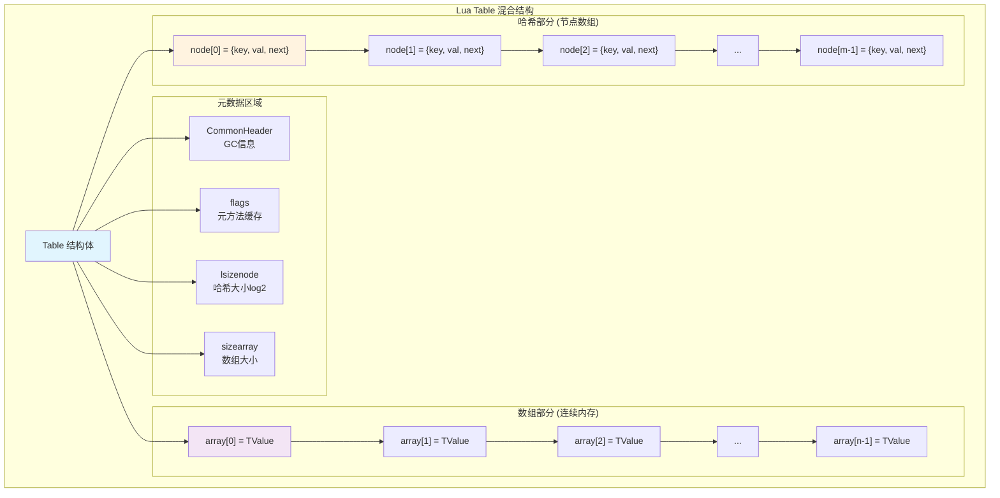
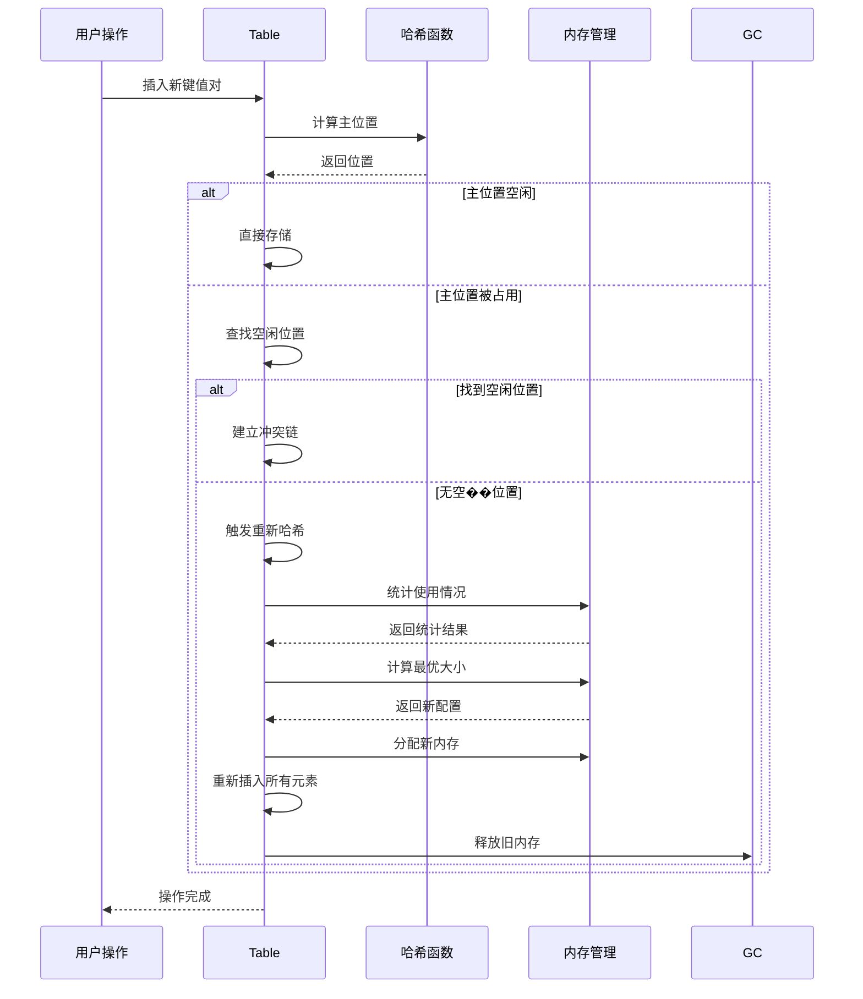

# 🚀 Lua表(Table)实现机制深度解析

## 📚 文档导航与学习路径

### 🎯 学习目标
- 掌握Lua表的混合数据结构设计
- 理解数组部分与哈希部分的协作机制
- 深入了解哈希冲突解决和动态扩容策略
- 学会表性能优化的实践技巧

### 📖 阅读指南
```
推荐学习路径：
通俗概述 → 核心概念图解 → 详细实现机制 → 实践实验 → 性能优化
    ↓           ↓           ↓          ↓        ↓
   5分钟       10分钟      30分钟     20分钟   15分钟
```

### 🔗 相关文档链接
- [q_01_virtual_machine.md](./q_01_virtual_machine.md) - 虚拟机基础
- [q_02_garbage_collection.md](./q_02_garbage_collection.md) - 垃圾回收机制
- [q_08_stack_management.md](./q_08_stack_management.md) - 栈管理
- [q_10_performance_optimizations.md](./q_10_performance_optimizations.md) - 性能优化

---

## 🤔 问题定义

深入分析**Lua表**的内部实现，包括**哈希表结构**、**数组部分优化**、**哈希冲突解决**以及**动态扩容机制**。

---

## 🎨 通俗概述

**Lua的表(Table)**就像一个超级智能的"**万能容器**"，它既可以当**数组**用，也可以当**字典**用，甚至可以同时兼顾两种功能。

### 📊 多角度理解表的设计

#### 🏢 图书馆管理系统视角
- **数组部分**：像书架上按顺序排列的书籍（1号位、2号位...），查找很快
- **哈希部分**：像按主题分类的索引卡片系统，通过关键词快速找到位置
- **智能分配**：系统自动决定新书放在书架还是索引系统中

#### 🛒 超市货架管理视角
- **数组部分**：像按编号排列的货架（商品1、商品2...），顾客按编号快速找到
- **哈希部分**：像按商品名称分类的导购系统，通过名称快速定位
- **动态调整**：根据商品类型自动选择最佳存放方式

#### 📁 办公室文件管理视角
- **数组部分**：像按日期顺序排列的文件夹，时间顺序访问很快
- **哈希部分**：像按项目名称分类的文件柜，通过项目名快速查找
- **混合使用**：同一个文件系统既支持按时间也支持按名称查找

### 🎯 核心设计理念
- **性能优化**：数组访问**O(1)**，哈希访问平均**O(1)**
- **内存效率**：根据使用模式动态调整内存分配
- **灵活性**：支持任意类型作为键和值
- **自适应**：根据数据特征自动选择最优存储方式

### 🔧 智能优化机制
- 如果你主要存储连续的数字索引（如**1,2,3...**），Lua会优先使用**数组部分**，访问速度更快
- 如果你使用**字符串**或其他类型作为键，就会使用**哈希部分**
- 系统会自动在两种方式间平衡，确保最佳性能
- 动态扩容时会重新评估数组和哈希部分的最优大小

### 💻 实际编程意义
- **数组操作**：`t[1], t[2], t[3]` 使用数组部分，性能最佳
- **字典操作**：`t["name"], t["age"]` 使用哈希部分，灵活高效
- **混合使用**：`t[1] = "first"; t["key"] = "value"` 自动优化存储

**实际意义**：这种设计让**Lua的表**既有**数组的高效**，又有**字典的灵活性**。理解其内部机制，能帮你选择最优的数据组织方式，写出更高效的Lua代码。

---

## 🎯 核心概念图解

### 📋 表结构总览



### 🔄 键路由决策流程

```mermaid
flowchart TD
    START([接收键值对]) --> CHECK{键类型检查}
    
    CHECK -->|正整数| RANGE{范围检查<br/>1 ≤ key ≤ sizearray?}
    CHECK -->|其他类型| HASH[计算哈希值<br/>mainposition]
    
    RANGE -->|是| ARRAY[存储到数组部分<br/>array[key-1]]
    RANGE -->|否| HASH
    
    HASH --> MAINPOS{主位置<br/>是否空闲?}
    
    MAINPOS -->|空闲| STORE[存储到主位置]
    MAINPOS -->|占用| CONFLICT[处理哈希冲突]
    
    CONFLICT --> FINDREE{查找空闲位置<br/>getfreepos}
    FINDREE -->|找到| CHAIN[建立冲突链<br/>next偏移]
    FINDREE -->|未找到| REHASH[重新哈希<br/>表扩容]
    
    ARRAY --> END([完成存储])
    STORE --> END
    CHAIN --> END
    REHASH --> START
    
    style START fill:#c8e6c9
    style ARRAY fill:#f3e5f5
    style HASH fill:#fff3e0
    style REHASH fill:#ffcdd2
    style END fill:#c8e6c9
```

### 🧮 哈希函数策略图

```mermaid
graph LR
    subgraph "多类型哈希策略"
        KEY[输入键] --> TYPE{类型判断}
        
        TYPE -->|LUA_TNUMINT| INT[整数哈希<br/>lmod(i, size)]
        TYPE -->|LUA_TSHRSTR| STR[字符串哈希<br/>预计算hash值]
        TYPE -->|LUA_TNUMFLT| FLOAT[浮点哈希<br/>IEEE位表示]
        TYPE -->|LUA_TBOOLEAN| BOOL[布尔哈希<br/>true=1, false=0]
        TYPE -->|指针类型| PTR[指针哈希<br/>地址右移]
        
        INT --> POS[计算主位置]
        STR --> POS
        FLOAT --> POS
        BOOL --> POS 
        PTR --> POS
        
        POS --> NODE[返回节点位置<br/>gnode(t, hash)]
    end
    
    style KEY fill:#e1f5fe
    style POS fill:#f3e5f5
    style NODE fill:#c8e6c9
```

### 🔧 动态扩容流程



---

## 🔬 详细技术实现

### 🏗️ 表结构设计详解

#### 混合数据结构架构

**技术概述**：**Lua的表**是一个**混合数据结构**，巧妙地结合了**数组**和**哈希表**的优势，这种设计在**性能**和**灵活性**间达到了完美平衡。

```c
// ltable.h - 表结构定义（详细注释版）
typedef struct Table {
  CommonHeader;                    /* GC相关的通用头部信息 */

  /* === 元方法缓存 === */
  lu_byte flags;                   /* 1<<p表示元方法p不存在（缓存优化）*/

  /* === 哈希部分管理 === */
  lu_byte lsizenode;               /* 哈希部分大小的log2（节省空间）*/

  /* === 数组部分管理 === */
  unsigned int sizearray;          /* 数组部分大小（元素个数）*/
  TValue *array;                   /* 数组部分指针：连续内存块 */

  /* === 哈希部分管理 === */
  Node *node;                      /* 哈希部分指针：节点数组 */
  Node *lastfree;                  /* 最后一个空闲位置：分配优化 */

  /* === 元表和GC === */
  struct Table *metatable;         /* 元表：面向对象支持 */
  GCObject *gclist;                /* GC链表节点：垃圾回收 */
} Table;

/* === 哈希节点结构 === */
typedef struct Node {
  TValue i_val;                    /* 存储的值 */
  TKey i_key;                      /* 键和链接信息 */
} Node;

/* === 键结构：支持链式哈希 === */
typedef union TKey {
  struct {
    TValuefields;                  /* 键的值和类型信息 */
    int next;                      /* 链接到下一个冲突节点（相对偏移）*/
  } nk;
  TValue tvk;                      /* 作为TValue访问键 */
} TKey;

/* === 表访问宏定义 === */
#define gnode(t,i)      (&(t)->node[i])           /* 获取第i个节点 */
#define gval(n)         (&(n)->i_val)             /* 获取节点的值 */
#define gnext(n)        ((n)->i_key.nk.next)      /* 获取下一个节点偏移 */
#define gkey(n)         (&(n)->i_key.tvk)         /* 获取节点的键 */

/* === 大小计算宏 === */
#define sizenode(t)     (1<<(t)->lsizenode)       /* 哈希部分大小 */
#define allocsizenode(t) (isdummy(t) ? 0 : sizenode(t)) /* 分配大小 */

/* === 特殊表检查 === */
#define isdummy(t)      ((t)->lastfree == NULL)   /* 是否为虚拟表 */
```

#### 内存布局分析

**通俗理解**：表的内存布局就像一个"**双层停车场**"，一层是按顺序排列的车位（**数组**），另一层是按车牌号分类的停车区（**哈希**）。

```
表的内存布局示意图：
┌─────────────────────────────────────────────────────────┐
│                    Table结构体                          │
├─────────────────────────────────────────────────────────┤
│ CommonHeader  │ flags │ lsizenode │ sizearray │ ...     │
├─────────────────────────────────────────────────────────┤
│                                                         │
│ array ──────────┐                                       │
│                 │                                       │
│ node ───────────┼─────┐                                 │
│                 │     │                                 │
│ lastfree ───────┼──┐  │                                 │
│                 │  │  │                                 │
└─────────────────┼──┼──┼─────────────────────────────────┘
                  │  │  │
                  ▼  │  ▼
┌─────────────────────┐  │  ┌─────────────────────────────┐
│     数组部分        │  │  │        哈希部分             │
├─────────────────────┤  │  ├─────────────────────────────┤
│ array[0] = TValue   │  │  │ node[0] = {key, val, next}  │
├─────────────────────┤  │  ├─────────────────────────────┤
│ array[1] = TValue   │  │  │ node[1] = {key, val, next}  │
├─────────────────────┤  │  ├─────────────────────────────┤
│ array[2] = TValue   │  │  │ node[2] = {key, val, next}  │
├─────────────────────┤  │  ├─────────────────────────────┤
│       ...           │  │  │          ...                │
├─────────────────────┤  │  ├─────────────────────────────┤
│array[sizearray-1]   │  │  │ node[sizenode-1]            │
└─────────────────────┘  │  └─────────────────────────────┘
                         │                 ▲
                         └─────────────────┘
                           lastfree指向最后空闲节点
```

### 🎯 数组部分访问详解

#### 高效的数组访问机制

**通俗理解**：数组访问就像在书架上按编号找书，如果书在编号范围内，直接去对应位置取书；如果超出范围，就去索引系统查找。

```c
// ltable.c - 数组索引访问（详细注释版）
const TValue *luaH_getint (Table *t, lua_Integer key) {
  /* === 快速路径：数组部分访问 === */
  /* 检查：1 <= key <= t->sizearray */
  if (l_castS2U(key) - 1 < t->sizearray) {
    /*
    优化技巧：
    1. l_castS2U(key) - 1：将key转为无符号数并减1
    2. 如果key <= 0，转换后会变成很大的无符号数
    3. 一次比较同时检查下界(>=1)和上界(<=sizearray)
    */
    return &t->array[key - 1];  /* 直接数组访问：O(1) */
  }
  else {
    /* === 慢速路径：哈希部分查找 === */
    Node *n = hashint(t, key);  /* 计算哈希位置 */
    for (;;) {  /* 遍历冲突链 */
      if (ttisinteger(gkey(n)) && ivalue(gkey(n)) == key)
        return gval(n);  /* 找到匹配的键 */
      else {
        int nx = gnext(n);  /* 获取下一个节点偏移 */
        if (nx == 0) break;  /* 链表结束 */
        n += nx;  /* 移动到下一个节点 */
      }
    }
    return luaO_nilobject;  /* 未找到，返回nil */
  }
}

/* 数组部分设置值 */
TValue *luaH_setint (lua_State *L, Table *t, lua_Integer key) {
  const TValue *p = luaH_getint(t, key);
  TValue *cell;

  if (p != luaO_nilobject)  /* 键已存在？ */
    cell = cast(TValue *, p);  /* 直接返回位置 */
  else {
    /* 键不存在，需要创建新条目 */
    TValue k;
    setivalue(&k, key);
    cell = luaH_newkey(L, t, &k);  /* 创建新键 */
  }
  return cell;
}
```

### 🧮 哈希函数实现详解

#### 多类型哈希策略

**通俗理解**：哈希函数就像"**地址计算器**"，根据不同类型的"邮件"（**键**）计算出对应的"邮箱地址"（**哈希位置**）。不同类型的邮件需要不同的地址计算方法。

```c
// ltable.c - 不同类型的哈希函数（详细注释版）

/* === 整数哈希：简单模运算 === */
static Node *hashint (const Table *t, lua_Integer i) {
  /*
  整数哈希策略：
  1. 直接使用模运算：i % sizenode(t)
  2. lmod宏处理负数情况
  3. 简单快速，适合连续整数
  */
  Node *n = gnode(t, lmod(i, sizenode(t)));
  return n;
}

/* === 字符串哈希：使用预计算的哈希值 === */
static Node *hashstr (const Table *t, TString *str) {
  /*
  字符串哈希策略：
  1. 使用字符串对象中预计算的hash值
  2. 避免重复计算哈希值
  3. 字符串驻留机制保证相同字符串有相同哈希
  */
  Node *n = gnode(t, lmod(str->hash, sizenode(t)));
  return n;
}

/* === 布尔值哈希：简单映射 === */
static Node *hashboolean (const Table *t, int b) {
  /*
  布尔值哈希策略：
  1. true -> 1, false -> 0
  2. 简单直接，无冲突（只有两个值）
  3. 在小表中可能分布不均
  */
  Node *n = gnode(t, lmod(b, sizenode(t)));
  return n;
}

/* === 指针哈希：地址散列 === */
static Node *hashpointer (const Table *t, const void *p) {
  /*
  指针哈希策略：
  1. 使用指针地址作为哈希值
  2. 右移去除低位对齐位
  3. 适用于函数、用户数据等
  */
  size_t i = point2uint(p);
  Node *n = gnode(t, lmod(i, sizenode(t)));
  return n;
}

/* === 浮点数哈希：特殊处理 === */
static Node *hashfloat (const Table *t, lua_Number n) {
  /*
  浮点数哈希策略：
  1. 处理NaN、无穷大等特殊值
  2. 整数值的浮点数与对应整数有相同哈希
  3. 使用IEEE 754位表示进行哈希
  */
  int i;
  lua_Integer ni;
  n = l_mathop(frexp)(n, &i) * -cast_num(INT_MIN);
  if (!lua_numbertointeger(n, &ni)) {  /* 不是整数？ */
    ni = cast(unsigned int, i) + cast(unsigned int, n);
  }
  return hashmod(t, ni);
}
```

#### 哈希冲突解决机制

**通俗理解**：**哈希冲突**就像两个人的邮件被分配到同一个邮箱。解决方法是在邮箱里放一个"**转发清单**"，记录下一个邮箱的位置。

```c
// ltable.c - 开放寻址法处理冲突
/*
Lua使用开放寻址法解决哈希冲突：

1. 主位置(main position)：键的理想哈希位置
2. 冲突链：通过next字段链接冲突的节点
3. 相对偏移：next存储相对偏移而不是绝对地址

优势：
- 内存局部性好：节点在同一数组中
- 缓存友好：遍历冲突链时访问连续内存
- 空间效率：不需要额外的指针存储
*/

/* 查找空闲节点 */
static Node *getfreepos (Table *t) {
  if (!isdummy(t)) {
    while (t->lastfree > t->node) {
      t->lastfree--;
      if (ttisnil(gkey(t->lastfree)))  /* 找到空闲节点？ */
        return t->lastfree;
    }
  }
  return NULL;  /* 没有空闲位置 */
}

/* 新键插入：处理冲突 */
TValue *luaH_newkey (lua_State *L, Table *t, const TValue *key) {
  Node *mp;
  TValue aux;

  if (ttisnil(key)) luaG_runerror(L, "table index is nil");
  else if (ttisfloat(key)) {
    lua_Integer k;
    if (luaV_tointeger(key, &k, 0)) {  /* 浮点数是整数？ */
      setivalue(&aux, k);
      key = &aux;  /* 使用整数键 */
    }
    else if (luai_numisnan(fltvalue(key)))
      luaG_runerror(L, "table index is NaN");
  }

  mp = mainposition(t, key);  /* 计算主位置 */

  if (!ttisnil(gval(mp)) || isdummy(t)) {  /* 主位置被占用？ */
    Node *othern;
    Node *f = getfreepos(t);  /* 获取空闲位置 */

    if (f == NULL) {  /* 没有空闲位置？ */
      rehash(L, t, key);  /* 重新哈希，扩大表 */
      return luaH_set(L, t, key);  /* 重新插入 */
    }

    lua_assert(!isdummy(t));
    othern = mainposition(t, gkey(mp));  /* 检查占用者的主位置 */

    if (othern != mp) {  /* 占用者不在主位置？ */
      /* 移动占用者到空闲位置 */
      while (othern + gnext(othern) != mp)  /* 找到指向mp的节点 */
        othern += gnext(othern);
      gnext(othern) = cast_int(f - othern);  /* 重新链接 */
      *f = *mp;  /* 复制节点 */
      if (gnext(mp) != 0) {
        gnext(f) += cast_int(mp - f);  /* 修正相对偏移 */
        gnext(mp) = 0;  /* 清除原节点链接 */
      }
      setnilvalue(gval(mp));  /* 清空原位置的值 */
    }
    else {  /* 占用者在主位置 */
      /* 新键使用空闲位置 */
      if (gnext(mp) != 0)
        gnext(f) = cast_int((mp + gnext(mp)) - f);  /* 链接到冲突链 */
      else lua_assert(gnext(f) == 0);
      gnext(mp) = cast_int(f - mp);  /* 链接主位置到新节点 */
      mp = f;
    }
  }

  setnodekey(L, &mp->i_key, key);  /* 设置键 */
  luaC_barrierback(L, t, key);     /* 写屏障 */
  lua_assert(ttisnil(gval(mp)));
  return gval(mp);  /* 返回值的位置 */
}
```

### 🚀 动态扩容机制详解

#### 扩容触发条件与策略

**通俗理解**：表扩容就像"**搬家**"，当房子（表空间）不够住时，需要找更大的房子，并把所有东西重新整理摆放。

```c
// ltable.c - 表重新哈希和扩容
static void rehash (lua_State *L, Table *t, const TValue *ek) {
  unsigned int asize;  /* 最优数组大小 */
  unsigned int na;     /* 数组中元素数量 */
  unsigned int nums[MAXABITS + 1];
  int i;
  int totaluse;

  /* 1. 重置统计计数器 */
  for (i = 0; i <= MAXABITS; i++) nums[i] = 0;

  /* 2. 统计当前数组部分的使用情况 */
  na = numusearray(t, nums);  /* 计算数组中的键分布 */
  totaluse = na;  /* 所有整数键的总数 */

  /* 3. 统计哈希部分的使用情况 */
  totaluse += numusehash(t, nums, &na);  /* 哈希部分中的键 */

  /* 4. 如果有新键，包含在计算中 */
  if (ek != NULL) {
    na += countint(ek, nums);
    totaluse++;
  }

  /* 5. 计算最优的数组大小 */
  asize = computesizes(nums, &na);

  /* 6. 执行表大小调整 */
  luaH_resize(L, t, asize, totaluse - na);
}

/* 表大小调整的具体实现 */
void luaH_resize (lua_State *L, Table *t, unsigned int asize,
                                          unsigned int hsize) {
  unsigned int i;
  int j;
  unsigned int oldasize = t->sizearray;
  int oldhsize = allocsizenode(t);
  Node *nold = t->node;  /* 保存旧哈希表 */

  /* === 第一阶段：调整数组部分 === */
  if (asize > oldasize)  /* 数组部分需要增长？ */
    setarrayvector(L, t, asize);

  /* === 第二阶段：创建新的哈希部分 === */
  setnodevector(L, t, hsize);

  /* === 第三阶段：处理数组收缩 === */
  if (asize < oldasize) {  /* 数组部分缩小？ */
    t->sizearray = asize;
    /* 将被删除的数组元素重新插入到哈希部分 */
    for (i = asize; i < oldasize; i++) {
      if (!ttisnil(&t->array[i]))
        luaH_setint(L, t, i + 1, &t->array[i]);
    }
    /* 缩小数组到新大小 */
    luaM_reallocvector(L, t->array, oldasize, asize, TValue);
  }

  /* === 第四阶段：重新插入哈希部分的元素 === */
  for (j = oldhsize - 1; j >= 0; j--) {
    Node *old = nold + j;
    if (!ttisnil(gval(old))) {
      /* 重新插入旧哈希表中的元素 */
      setobjt2t(L, luaH_set(L, t, gkey(old)), gval(old));
    }
  }

  /* === 第五阶段：清理旧内存 === */
  if (oldhsize > 0)  /* 不是虚拟节点？ */
    luaM_freearray(L, nold, cast(size_t, oldhsize)); /* 释放旧数组 */
}

/* 最优大小计算算法 */
static unsigned int computesizes (unsigned int nums[], unsigned int *pna) {
  int i;
  unsigned int twotoi;  /* 2^i (候选大小) */
  unsigned int a = 0;  /* 将在数组部分的元素数量 */
  unsigned int na = 0;  /* 数组中的元素总数 */
  unsigned int optimal = 0;  /* 最优大小 */

  /*
  算法思想：
  1. 遍历所有可能的数组大小（2的幂）
  2. 计算每个大小下的利用率
  3. 选择利用率>50%的最大大小
  */
  for (i = 0, twotoi = 1; *pna > twotoi / 2; i++, twotoi *= 2) {
    if (nums[i] > 0) {
      a += nums[i];
      if (a > twotoi/2) {  /* 超过一半的元素存在？ */
        optimal = twotoi;  /* 最优大小(到目前为止) */
        na = a;  /* 所有'a'元素将进入数组部分 */
      }
    }
  }
  lua_assert((optimal == 0 || optimal / 2 < na) && na <= optimal);
  *pna = na;
  return optimal;
}
```

---

## 🧪 实践实验指南

### 🔬 实验1：表结构分析工具

让我们创建一个工具来分析表的内部结构，帮助理解数组部分与哈希部分的分布。

```lua
-- table_analyzer.lua - 表结构分析工具
local TableAnalyzer = {}

function TableAnalyzer.analyze_structure(t)
  local stats = {
    array_size = 0,
    hash_size = 0,
    array_used = 0,
    hash_used = 0,
    sparse_indices = {},
    key_types = {}
  }

  -- 分析数组部分
  local max_array_index = 0
  local consecutive_count = 0
  
  for i = 1, 10000 do  -- 检查前10000个索引
    if t[i] ~= nil then
      max_array_index = i
      consecutive_count = consecutive_count + 1
      stats.array_used = stats.array_used + 1
    elseif max_array_index > 0 then
      -- 发现空洞，记录稀疏索引
      if i - consecutive_count > 1 then
        table.insert(stats.sparse_indices, {start = consecutive_count + 1, stop = i - 1})
      end
      break
    end
  end
  
  stats.array_size = max_array_index

  -- 分析哈希部分和键类型
  for k, v in pairs(t) do
    local key_type = type(k)
    stats.key_types[key_type] = (stats.key_types[key_type] or 0) + 1
    
    if key_type ~= "number" or k > max_array_index or k <= 0 or k ~= math.floor(k) then
      stats.hash_used = stats.hash_used + 1
    end
  end

  return stats
end

function TableAnalyzer.print_analysis(t)
  local stats = TableAnalyzer.analyze_structure(t)
  
  print("=== 表结构分析报告 ===")
  print(string.format("数组部分: %d 个元素 (最大索引: %d)", 
        stats.array_used, stats.array_size))
  
  if #stats.sparse_indices > 0 then
    print("发现稀疏区域:")
    for _, range in ipairs(stats.sparse_indices) do
      print(string.format("  空洞: [%d-%d]", range.start, range.stop))
    end
  end
  
  print(string.format("哈希部分: %d 个元素", stats.hash_used))
  
  print("键类型分布:")
  for key_type, count in pairs(stats.key_types) do
    print(string.format("  %s: %d 个", key_type, count))
  end
  
  -- 性能建议
  local array_efficiency = stats.array_size > 0 and stats.array_used / stats.array_size or 0
  print(string.format("数组利用率: %.1f%%", array_efficiency * 100))
  
  if array_efficiency < 0.5 and stats.array_size > 10 then
    print("⚠️  建议: 数组部分利用率较低，考虑重新设计数据结构")
  end
  
  if stats.hash_used > stats.array_used * 2 then
    print("⚠️  建议: 哈希部分较大，考虑使用字符串键或重构")
  end
end

-- 测试不同的表使用模式
function TableAnalyzer.demo()
  print("🧪 实验1: 高效的连续数组")
  local efficient_table = {}
  for i = 1, 100 do
    efficient_table[i] = "value_" .. i
  end
  TableAnalyzer.print_analysis(efficient_table)
  
  print("\n🧪 实验2: 低效的稀疏数组")
  local sparse_table = {}
  sparse_table[1] = "first"
  sparse_table[1000] = "middle"
  sparse_table[10000] = "last"
  TableAnalyzer.print_analysis(sparse_table)
  
  print("\n🧪 实验3: 混合使用模式")
  local mixed_table = {}
  for i = 1, 50 do
    mixed_table[i] = i * i
  end
  mixed_table["name"] = "lua_table"
  mixed_table["version"] = "5.1"
  mixed_table[0.5] = "float_key"
  mixed_table[true] = "boolean_key"
  TableAnalyzer.print_analysis(mixed_table)
end

-- 运行演示
TableAnalyzer.demo()
```

### 🎯 实验2：性能对比测试

```lua
-- performance_test.lua - 表性能测试
local PerformanceTest = {}

function PerformanceTest.time_function(func, iterations)
  local start_time = os.clock()
  for i = 1, iterations do
    func()
  end
  local end_time = os.clock()
  return end_time - start_time
end

function PerformanceTest.array_vs_hash_access()
  local iterations = 1000000
  
  -- 测试数据准备
  local array_table = {}
  local hash_table = {}
  
  -- 填充测试数据
  for i = 1, 1000 do
    array_table[i] = i
    hash_table["key_" .. i] = i
  end
  
  print("🚀 性能测试: 数组访问 vs 哈希访问")
  print(string.format("测试次数: %d", iterations))
  
  -- 测试数组访问
  local array_time = PerformanceTest.time_function(function()
    local sum = 0
    for i = 1, 1000 do
      sum = sum + array_table[i]
    end
  end, iterations / 1000)
  
  -- 测试哈希访问
  local hash_time = PerformanceTest.time_function(function()
    local sum = 0
    for i = 1, 1000 do
      sum = sum + hash_table["key_" .. i]
    end
  end, iterations / 1000)
  
  print(string.format("数组访问时间: %.4f 秒", array_time))
  print(string.format("哈希访问时间: %.4f 秒", hash_time))
  print(string.format("性能比值: %.2fx", hash_time / array_time))
end

function PerformanceTest.insertion_patterns()
  local size = 10000
  
  print("\n🔄 插入模式性能测试")
  
  -- 测试1: 顺序插入 (数组优化)
  local sequential_time = PerformanceTest.time_function(function()
    local t = {}
    for i = 1, size do
      t[i] = i
    end
  end, 1)
  
  -- 测试2: 随机插入 (哈希表现)
  math.randomseed(42)  -- 固定随机种子
  local random_keys = {}
  for i = 1, size do
    random_keys[i] = math.random(1, size * 2)
  end
  
  local random_time = PerformanceTest.time_function(function()
    local t = {}
    for i = 1, size do
      t[random_keys[i]] = i
    end
  end, 1)
  
  -- 测试3: 字符串键插入
  local string_time = PerformanceTest.time_function(function()
    local t = {}
    for i = 1, size do
      t["key_" .. i] = i
    end
  end, 1)
  
  print(string.format("顺序插入(数组): %.4f 秒", sequential_time))
  print(string.format("随机插入(哈希): %.4f 秒", random_time))
  print(string.format("字符串键插入: %.4f 秒", string_time))
end

function PerformanceTest.memory_usage_simulation()
  print("\n💾 内存使用模拟")
  
  -- 模拟不同表大小的内存使用
  local sizes = {100, 1000, 10000, 100000}
  
  for _, size in ipairs(sizes) do
    -- 创建纯数组表
    local array_table = {}
    for i = 1, size do
      array_table[i] = i
    end
    
    -- 创建纯哈希表
    local hash_table = {}
    for i = 1, size do
      hash_table["key_" .. i] = i
    end
    
    -- 估算内存使用 (简化计算)
    local array_memory = size * 24  -- TValue 约 24 字节
    local hash_memory = size * 32   -- Node 约 32 字节
    
    print(string.format("大小 %d: 数组 ~%d KB, 哈希 ~%d KB", 
          size, array_memory / 1024, hash_memory / 1024))
  end
end

-- 运行所有测试
PerformanceTest.array_vs_hash_access()
PerformanceTest.insertion_patterns()
PerformanceTest.memory_usage_simulation()
```

---

## 🎓 核心面试问答

### ❓ Q1: Lua如何决定一个键应该放在数组部分还是哈希部分？

**🔍 深度解析**：

Lua通过**键类型分析**和**使用模式统计**来智能决定键的存储位置，目标是最大化**数组部分的利用率**。

**决策算法**：
```c
// 键存储位置决策逻辑
static int arrayindex (const TValue *key) {
  if (ttisinteger(key)) {
    lua_Integer k = ivalue(key);
    if (0 < k && (lua_Unsigned)k <= MAXASIZE)
      return cast_int(k);  /* 适合数组索引 */
  }
  return -1;  /* 不适合数组索引 */
}

/* 最优大小计算 - 50%利用率原则 */
static unsigned int computesizes (unsigned int nums[], unsigned int *pna) {
  // 选择利用率>50%的最大数组大小
  // 平衡内存使用和访问性能
}
```

**实际案例**：
- ✅ `t[1], t[2], t[3]` → 数组部分（连续整数）
- ❌ `t[0], t[-1], t[1.5]` → 哈希部分（非正整数）
- ❌ `t[1], t[1000000]` → 可能导致稀疏数组，部分转哈希

### ❓ Q2: 为什么Lua选择开放寻址而不是链式哈希？

**🔍 深度解析**：

选择开放寻址法主要基于**嵌入式友好**和**缓存性能**考虑：

**对比分析**：
| 特性 | 开放寻址法（Lua） | 链式哈希法 |
|------|------------------|------------|
| 内存布局 | 连续数组 | 分散链表节点 |
| 缓存性能 | ✅ 好（局部性强） | ❌ 差（随机访问） |
| 内存开销 | ✅ 低（无额外指针） | ❌ 高（每节点一个指针） |
| 嵌入式适应性 | ✅ 好 | ❌ 较差 |

**Lua的优化实现**：
```c
/* 相对偏移优化 */
typedef union TKey {
  struct {
    TValuefields;
    int next;  /* 相对偏移，不是绝对指针 */
  } nk;
} TKey;
```

### ❓ Q3: 表的遍历顺序是如何保证的？

**🔍 深度解析**：

Lua表的遍历**不保证顺序**，但有固定的遍历模式：

**遍历策略**：
1. **数组部分**：按索引顺序（1, 2, 3, ...）
2. **哈希部分**：按内部哈希表顺序（不可预测）
3. **总体顺序**：先数组部分，后哈希部分

**安全遍历模式**：
```lua
-- ✅ 安全：只读遍历
for k, v in pairs(t) do
  print(k, v)  -- 只读操作
end

-- ⚠️  危险：遍历中修改
for k, v in pairs(t) do
  t[new_key] = value  -- 可能改变遍历顺序
  t[k] = nil         -- 删除当前键是安全的
end

-- ✅ 推荐：延迟修改
local to_delete = {}
for k, v in pairs(t) do
  if should_delete(v) then
    table.insert(to_delete, k)
  end
end
for _, k in ipairs(to_delete) do
  t[k] = nil
end
```

### ❓ Q4: 表扩容的触发条件和优化策略？

**🔍 深度解析**：

**扩容触发条件**：
1. 哈希部分无空闲位置（`getfreepos`返回NULL）
2. 插入新键时需要更大空间
3. 数组/哈希比例失衡需要重平衡

**优化策略**：
```lua
-- ❌ 低效：频繁扩容
local t = {}
for i = 1, 100000 do
  t[i] = i  -- 每次可能触发扩容
end

-- ✅ 高效：预分配（如果支持）
local t = table.new(100000, 0)  -- 预分配数组部分
for i = 1, 100000 do
  t[i] = i  -- 无需扩容
end

-- ✅ 批量操作优化
local data = {}
for i = 1, 100000 do
  data[i] = compute_value(i)
end
-- 一次性赋值，减少扩容次数
for i, v in ipairs(data) do
  t[i] = v
end
```

### ❓ Q5: 弱引用表的实现原理和使用场景？

**🔍 深度解析**：

弱引用表通过元表的`__mode`字段实现，允许GC回收表中的对象：

**实现机制**：
```c
/* GC中的弱引用处理 */
static void clearkeys (global_State *g, GCObject *l, GCObject *f) {
  for (; l != f; l = gco2t(l)->gclist) {
    Table *h = gco2t(l);
    /* 清理指向死对象的条目 */
    if (iscleared(g, gkey(n))) {
      setnilvalue(gval(n));  /* 移除值 */
      removeentry(n);        /* 移除条目 */
    }
  }
}
```

**典型使用场景**：
```lua
-- 场景1: 对象缓存
local cache = {}
setmetatable(cache, {__mode = "v"})  -- 弱值表

function get_object(id)
  if cache[id] then return cache[id] end
  local obj = create_expensive_object(id)
  cache[id] = obj  -- 弱引用缓存
  return obj
end

-- 场景2: 反向映射
local obj_to_id = {}
setmetatable(obj_to_id, {__mode = "k"})  -- 弱键表

-- 场景3: 临时关联
local temp_data = {}
setmetatable(temp_data, {__mode = "kv"})  -- 全弱表
```

---

## 🚀 性能优化实战指南

### 🎯 表设计最佳实践

#### 1. 键类型选择策略

```lua
-- ✅ 优秀实践：合理的键类型分离
local PlayerData = {}

-- 数组部分：连续的游戏对象
PlayerData.inventory = {}  -- t[1], t[2], t[3] ...
for i = 1, 100 do
  PlayerData.inventory[i] = create_item(i)
end

-- 哈希部分：配置和元数据
PlayerData.config = {
  name = "player1",
  level = 10,
  experience = 5000
}

-- ❌ 低效实践：混乱的键类型
local bad_table = {}
bad_table[1] = "item1"      -- 数组部分
bad_table["1"] = "string1"  -- 哈希部分，不同于数字1
bad_table[1.0] = "float1"   -- 会转换为整数1，覆盖前面的值
```

#### 2. 内存布局优化

```lua
-- ✅ 内存友好的表操作
local TableUtils = {}

function TableUtils.efficient_merge(dest, source)
  -- 预估大小，减少扩容
  local source_size = 0
  for _ in pairs(source) do source_size = source_size + 1 end
  
  -- 批量合并，减少哈希重计算
  for k, v in pairs(source) do
    dest[k] = v
  end
end

function TableUtils.cache_friendly_iteration(t, processor)
  -- 先处理数组部分（缓存友好）
  for i = 1, #t do
    processor(i, t[i])
  end
  
  -- 再处理哈希部分
  for k, v in pairs(t) do
    if type(k) ~= "number" or k > #t then
      processor(k, v)
    end
  end
end
```

#### 3. 特定场景优化技巧

```lua
-- 游戏开发：高性能实体组件系统
local ECS = {}

function ECS.new()
  return {
    entities = {},      -- 实体ID数组（连续）
    components = {},    -- 组件表（按类型分组）
    
    -- 组件索引优化
    position_components = {},  -- 专门的位置组件数组
    render_components = {},    -- 专门的渲染组件数组
  }
end

-- 缓存友好的组件遍历
function ECS:update_positions(dt)
  -- 直接遍历位置组件数组，避免稀疏访问
  for i, pos_comp in ipairs(self.position_components) do
    pos_comp.x = pos_comp.x + pos_comp.vx * dt
    pos_comp.y = pos_comp.y + pos_comp.vy * dt
  end
end

-- Web开发：高效的路由表
local Router = {}

function Router.new()
  return {
    static_routes = {},    -- 静态路由（哈希查找）
    dynamic_routes = {},   -- 动态路由数组（模式匹配）
    cache = {}            -- 路由缓存
  }
end

function Router:add_route(pattern, handler)
  if pattern:find("[%*%?%[%]]") then
    -- 动态路由：使用数组存储，按优先级排序
    table.insert(self.dynamic_routes, {pattern = pattern, handler = handler})
  else
    -- 静态路由：使用哈希表快速查找
    self.static_routes[pattern] = handler
  end
end
```

### 🔧 调试和分析工具

```lua
-- 高级表分析工具
local AdvancedAnalyzer = {}

function AdvancedAnalyzer.memory_footprint(t)
  local function estimate_memory(obj, visited)
    visited = visited or {}
    if visited[obj] then return 0 end
    visited[obj] = true
    
    local size = 0
    local obj_type = type(obj)
    
    if obj_type == "table" then
      size = size + 64  -- 基本表结构
      for k, v in pairs(obj) do
        size = size + estimate_memory(k, visited)
        size = size + estimate_memory(v, visited)
        size = size + 32  -- 节点开销
      end
    elseif obj_type == "string" then
      size = size + #obj + 24
    else
      size = size + 8  -- 基本类型
    end
    
    return size
  end
  
  return estimate_memory(t)
end

function AdvancedAnalyzer.access_pattern_analysis(t, access_log)
  local stats = {
    array_accesses = 0,
    hash_accesses = 0,
    collision_count = 0
  }
  
  for _, access in ipairs(access_log) do
    local key = access.key
    if type(key) == "number" and key > 0 and key == math.floor(key) then
      if key <= #t then
        stats.array_accesses = stats.array_accesses + 1
      else
        stats.hash_accesses = stats.hash_accesses + 1
      end
    else
      stats.hash_accesses = stats.hash_accesses + 1
    end
  end
  
  return stats
end

-- 性能监控装饰器
function AdvancedAnalyzer.monitor_table(t)
  local access_count = 0
  local modification_count = 0
  
  return setmetatable({}, {
    __index = function(_, k)
      access_count = access_count + 1
      return t[k]
    end,
    
    __newindex = function(_, k, v)
      modification_count = modification_count + 1
      t[k] = v
    end,
    
    __call = function()
      return {
        accesses = access_count,
        modifications = modification_count,
        efficiency = access_count / (access_count + modification_count)
      }
    end
  })
end
```

---

## 📚 扩展学习路径

### 🔗 相关主题深入
1. **[虚拟机实现](./q_01_virtual_machine.md)** - 了解表在VM中的作用
2. **[垃圾回收机制](./q_02_garbage_collection.md)** - 表的内存管理和弱引用
3. **[字符串驻留](./q_04_string_interning.md)** - 字符串键的优化
4. **[性能优化](./q_10_performance_optimizations.md)** - 整体性能调优

### 📖 推荐阅读
- Lua源码：`ltable.c`, `ltable.h` - 表实现核心
- 学术论文：Hash table 实现比较研究
- 性能分析：LuaJIT表优化策略

### 🛠️ 实践项目
1. **表性能基准测试工具** - 对比不同表实现性能
2. **游戏ECS系统** - 应用表优化设计高性能组件系统
3. **缓存系统实现** - 使用弱引用表构建智能缓存

---

## 📋 核心要点总结

| 🎯 核心概念 | 🔧 关键技术 | 💡 优化要点 |
|-------------|-------------|-------------|
| 混合数据结构 | 数组+哈希表协作 | 连续整数用数组部分 |
| 哈希冲突解决 | 开放寻址+相对偏移 | 缓存友好的冲突链 |
| 动态扩容 | 负载因子控制 | 预分配避免频繁扩容 |
| 键路由策略 | 类型分析+范围检查 | 合理的键类型选择 |
| 内存效率 | 紧凑布局设计 | 避免稀疏数组 |

理解Lua表的实现机制不仅有助于写出更高效的Lua代码，更能深刻理解现代编程语言中数据结构的设计权衡。这种混合设计思想在许多高性能系统中都有应用，值得深入学习和实践。
```
```
```