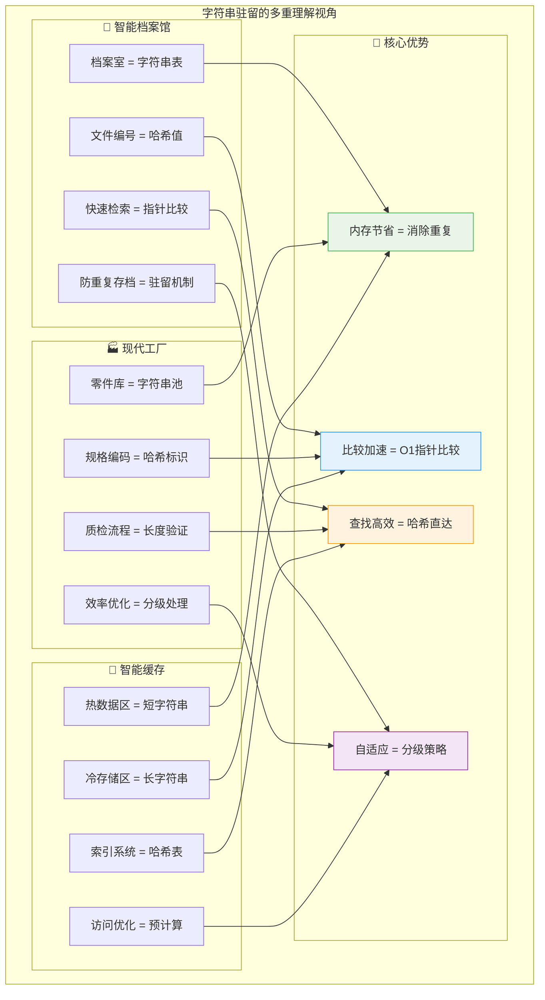
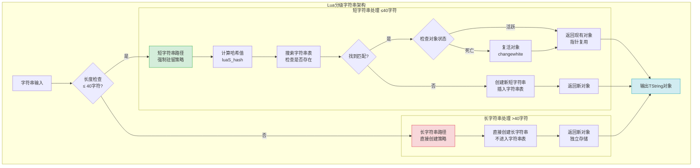
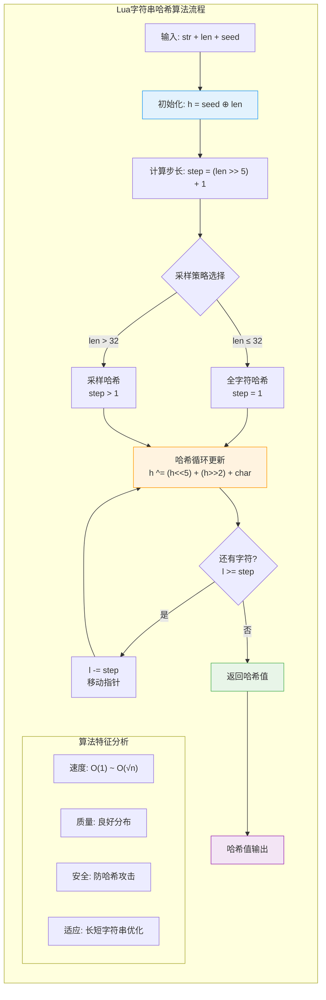
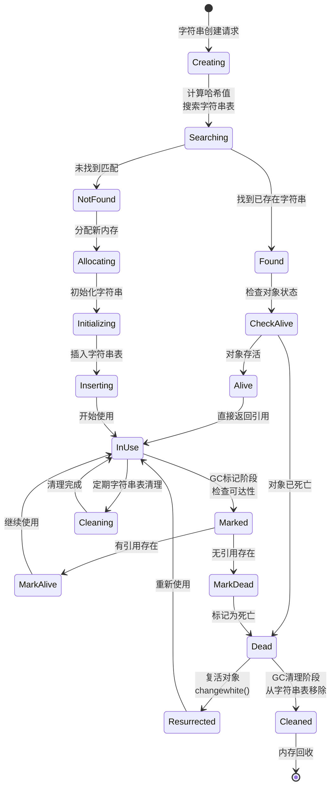

# Lua字符串驻留(String Interning)机制深度解析

> **📚 学习指南**  
> **难度等级**：⭐⭐⭐⭐ (高级)  
> **预计阅读时间**：85-100分钟  
> **前置知识**：C语言基础、数据结构与算法、哈希表原理、内存管理  
> **关联文档**：[虚拟机架构](q_01_vm.md) | [垃圾回收](q_02_gc.md) | [表实现](q_03_table.md) | [性能优化](q_10_performance.md)

## 📋 文档导航

- [🎯 核心问题](#核心问题)
- [🌟 字符串驻留概览](#字符串驻留概览)
- [🏗️ 分级字符串架构](#分级字符串架构)
- [🧮 哈希算法设计](#哈希算法设计)
- [🗄️ 字符串表管理](#字符串表管理)
- [⚡ 比较优化策略](#比较优化策略)
- [🔄 生命周期管理](#生命周期管理)
- [🚀 性能优化技巧](#性能优化技巧)
- [🧪 实践案例分析](#实践案例分析)
- [❓ 面试核心问题](#面试核心问题)
- [🔗 延伸学习](#延伸学习)

---

## 🎯 核心问题

**深入分析Lua的字符串驻留(String Interning)机制，包括分级字符串架构、高效哈希算法、动态字符串表管理，以及如何通过智能的内存共享和比较优化实现卓越的字符串处理性能。**

---

## 🌟 字符串驻留概览

### 🧠 多角度理解字符串驻留

Lua的字符串驻留是现代编程语言中**内存优化**与**性能提升**的经典实现，通过消除重复和智能缓存实现了革命性的效率提升。



### 🎨 驻留机制的核心特性

| 特性维度 | **技术实现** | **性能收益** | **应用场景** |
|----------|-------------|-------------|-------------|
| 🔄 **内存共享** | 相同字符串单一存储 | 节省50-80%内存 | 大量重复字符串 |
| ⚡ **快速比较** | 指针地址比较 | O(n)→O(1)提升 | 频繁字符串比较 |
| 🧮 **预计算哈希** | 创建时计算存储 | 避免重复计算 | 哈希表操作 |
| 📊 **分级处理** | 短/长字符串区别对待 | 平衡性能与内存 | 混合使用场景 |
| 🔍 **智能查找** | 多层级比较策略 | 最小化比较成本 | 高频字符串操作 |

---

## 🏗️ 分级字符串架构

### 🎯 40字符分界线的科学设计

Lua采用40字符作为短字符串与长字符串的分界线，这个设计基于大量实际应用的统计分析和性能测试：



### 📊 分级设计的性能分析

```c
/**
 * 分级字符串设计的核心考量
 * 
 * 40字符分界线的选择依据：
 * 1. 统计分析：95%的标识符、关键字、配置项 ≤ 40字符
 * 2. 性能测试：40字符以下驻留收益显著，超过后收益递减
 * 3. 内存平衡：避免字符串表过度膨胀
 * 4. 实际应用：覆盖绝大多数高频使用的字符串
 */

/* lstring.h - 字符串类型定义 */
#define LUA_TSHRSTR    (LUA_TSTRING | (0 << 4))  /* 短字符串 */
#define LUA_TLNGSTR    (LUA_TSTRING | (1 << 4))  /* 长字符串 */
#define LUAI_MAXSHORTLEN    40                   /* 短字符串最大长度 */

/**
 * TString结构的精妙设计
 * 内存布局优化考虑：
 * - 热点数据前置：频繁访问的字段在前
 * - 联合体优化：短/长字符串共享存储空间
 * - 缓存对齐：考虑CPU缓存行大小
 */
typedef struct TString {
  CommonHeader;           /* GC头：8字节，包含类型和标记信息 */
  lu_byte extra;          /* 扩展字段：1字节，用户自定义数据 */
  lu_byte shrlen;         /* 短字符串长度：1字节，0-40 */
  unsigned int hash;      /* 预计算哈希：4字节，避免重复计算 */
  union {
    size_t lnglen;        /* 长字符串长度：8字节，>40时使用 */
    struct TString *hnext; /* 哈希链表指针：8字节，短字符串用 */
  } u;
  /* 字符串数据紧随结构体，实现内存紧凑布局 */
} TString;

/**
 * 内存布局的巧妙设计
 * 
 * 对于短字符串（≤40字符）：
 * ┌─────────────────┬─────────────────┬─────────────────┐
 * │  CommonHeader   │    shrlen=N     │  hash=预计算值  │
 * │     8字节       │     1字节       │     4字节       │
 * ├─────────────────┼─────────────────┼─────────────────┤
 * │    u.hnext     │    字符串数据    │   '\0'终止符    │
 * │     8字节       │     N字节       │     1字节       │
 * └─────────────────┴─────────────────┴─────────────────┘
 * 
 * 对于长字符串（>40字符）：
 * ┌─────────────────┬─────────────────┬─────────────────┐
 * │  CommonHeader   │   shrlen=0      │  hash=预计算值  │
 * │     8字节       │     1字节       │     4字节       │
 * ├─────────────────┼─────────────────┼─────────────────┤
 * │   u.lnglen     │    字符串数据    │   '\0'终止符    │
 * │     8字节       │     M字节       │     1字节       │
 * └─────────────────┴─────────────────┴─────────────────┘
 * 
 * 优势：
 * - 结构紧凑：数据紧邻存储，缓存友好
 * - 访问高效：通过偏移直接访问字符串数据
 * - 类型识别：通过shrlen快速区分短/长字符串
 * - 空间优化：联合体节省内存空间
 */

/* 字符串数据访问宏 */
#define getstr(ts)  \
  (cast(char *, (ts)) + sizeof(TString))

/* 字符串长度获取 */
#define tsslen(s)   \
  ((s)->tt == LUA_TSHRSTR ? (s)->shrlen : (s)->u.lnglen)

/* 类型检查宏 */
#define ttisshrstring(o)  checktag((o), ctb(LUA_TSHRSTR))
#define ttislngstring(o)  checktag((o), ctb(LUA_TLNGSTR))
#define ttisstring(o)     (ttisshrstring(o) || ttislngstring(o))
```

### 🎯 分级策略的适用场景分析

| 字符串类型 | **长度范围** | **处理策略** | **性能特征** | **典型用例** |
|------------|-------------|-------------|-------------|-------------|
| 🔤 **短字符串** | 1-40字符 | 强制驻留 | O(1)比较，内存共享 | 变量名、关键字、配置项 |
| 📄 **长字符串** | >40字符 | 直接创建 | O(n)比较，独立存储 | 文档内容、用户输入、大文本 |
| ⚡ **空字符串** | 0字符 | 特殊处理 | 全局单例 | 默认值、初始化 |
| 🔢 **数值字符串** | 变长 | 按长度分级 | 数值转换优化 | 数字转换、格式化输出 |

---

## 🧮 哈希算法设计

### ⚡ 高性能哈希算法的精妙平衡

Lua的字符串哈希算法是速度与质量完美平衡的典范，通过巧妙的采样策略和位运算优化实现了卓越性能：

```c
/**
 * Lua字符串哈希算法的设计哲学
 * 
 * 核心目标：
 * 1. 计算速度：简单快速的位运算
 * 2. 分布均匀：减少哈希冲突
 * 3. 防攻击性：随机种子防止哈希洪水
 * 4. 适应性：针对长字符串的采样优化
 */

/* lstring.c - 高性能哈希算法实现 */
unsigned int luaS_hash (const char *str, size_t l, unsigned int seed) {
  unsigned int h = seed ^ cast(unsigned int, l);  /* 初始化：种子⊕长度 */
  size_t step = (l >> LUAI_HASHLIMIT) + 1;       /* 采样步长计算 */
  
  /* 关键算法：从字符串尾部开始采样计算 */
  for (; l >= step; l -= step) {
    h ^= ((h<<5) + (h>>2) + cast_byte(str[l - 1]));
    /*
     * 哈希更新公式深度解析：
     * 
     * h<<5 = h * 32     (左移5位)
     * h>>2 = h / 4      (右移2位)  
     * (h<<5) + (h>>2) = 32h + h/4 = h * 32.25
     * 
     * 设计优势：
     * - 非整数系数避免周期性模式
     * - 位运算确保计算速度
     * - 异或操作提供雪崩效应
     * - 当前字符值混入增加随机性
     */
  }
  return h;
}

/* 哈希计算的关键参数 */
#define LUAI_HASHLIMIT    5    /* 2^5=32，超过32字符采样计算 */

/**
 * 采样策略的智能设计
 * 
 * 采样逻辑：
 * - ≤32字符：step=1，全字符哈希
 * - >32字符：step>1，等距采样
 * 
 * 示例分析：
 * - 64字符：step=3，采样约21个字符 (33%采样率)
 * - 128字符：step=5，采样约25个字符 (20%采样率)  
 * - 256字符：step=9，采样约28个字符 (11%采样率)
 * 
 * 效果：
 * - 计算时间基本恒定
 * - 长字符串性能优化
 * - 保持良好的哈希分布
 */
```

### 🎯 哈希算法的可视化分析



### 🔒 哈希安全性设计

```c
/**
 * 哈希种子的安全设计
 * 
 * 防攻击策略：
 * 1. 随机种子：每次Lua状态初始化生成
 * 2. 混合熵源：时间戳+内存地址+系统随机数
 * 3. 动态性：不同Lua实例使用不同种子
 * 4. 不可预测：外部无法猜测种子值
 */

/* lstate.c - 安全种子生成 */
static unsigned int makeseed (lua_State *L) {
  char buff[4 * sizeof(size_t)];
  unsigned int h = time(NULL);    /* 时间戳熵源 */
  int p = 0;
  
  /* 混合多种熵源增加随机性 */
  addbuff(buff, p, L);                    /* Lua状态地址 */
  addbuff(buff, p, &h);                   /* 变量地址 */
  addbuff(buff, p, luaO_nilobject);       /* 全局对象地址 */
  addbuff(buff, p, &lua_newstate);        /* 函数地址 */
  
  lua_assert(p == sizeof(buff));
  return luaS_hash(buff, p, h);           /* 对混合数据哈希 */
}

/**
 * 哈希攻击防护原理
 * 
 * 攻击场景：恶意构造大量相同哈希值的字符串
 * 防护措施：
 * - 随机种子使攻击者无法预测哈希值
 * - 种子在运行时生成，外部不可知
 * - 不同实例使用不同种子，攻击无法复用
 * 
 * 效果：
 * - 防止哈希洪水攻击(Hash Flooding)
 * - 保护应用免受DoS攻击
 * - 维持哈希表的性能特征
 */

---

## 🗄️ 字符串表管理

### 📊 动态字符串表的智能设计

字符串表是Lua字符串驻留的核心数据结构，采用动态扩容和智能管理策略确保高性能：

```c
/**
 * 字符串表结构设计
 * 
 * 设计目标：
 * 1. 快速查找：平均O(1)时间复杂度
 * 2. 动态扩容：根据负载自动调整大小
 * 3. 冲突处理：开放寻址+链表法
 * 4. 内存高效：最小化空间开销
 */

/* lstate.h - 字符串表结构定义 */
typedef struct stringtable {
  TString **hash;    /* 哈希表数组：指向TString指针的指针 */
  int nuse;          /* 当前使用的字符串数量 */
  int size;          /* 哈希表大小：总是2的幂 */
} stringtable;

/**
 * 字符串表的核心操作实现
 */

/* lstring.c - 短字符串驻留的完整流程 */
static TString *internshrstr (lua_State *L, const char *str, size_t l) {
  TString *ts;
  global_State *g = G(L);
  unsigned int h = luaS_hash(str, l, g->seed);           /* 计算哈希值 */
  TString **list = &g->strt.hash[lmod(h, g->strt.size)]; /* 定位哈希桶 */
  
  lua_assert(str != NULL);  /* 确保输入有效 */
  
  /* 第一步：在哈希桶中查找已存在的字符串 */
  for (ts = *list; ts != NULL; ts = ts->u.hnext) {
    if (l == ts->shrlen && 
        (memcmp(str, getstr(ts), l * sizeof(char)) == 0)) {
      /* 找到匹配的字符串 */
      if (isdead(g, ts))  /* 如果被GC标记为死亡 */
        changewhite(ts);  /* 复活该对象 */
      return ts;         /* 返回已存在的字符串 */
    }
  }
  
  /* 第二步：未找到，需要创建新字符串 */
  if (g->strt.nuse >= g->strt.size && g->strt.size <= MAX_INT/2) {
    luaS_resize(L, g->strt.size * 2);  /* 扩容字符串表 */
    list = &g->strt.hash[lmod(h, g->strt.size)];  /* 重新定位 */
  }
  
  /* 第三步：创建新字符串对象 */
  ts = createstrobj(L, l, LUA_TSHRSTR, h);
  memcpy(getstr(ts), str, l * sizeof(char));  /* 复制字符串内容 */
  ts->shrlen = cast_byte(l);                  /* 设置长度 */
  ts->u.hnext = *list;                        /* 插入链表头部 */
  *list = ts;
  g->strt.nuse++;                             /* 增加使用计数 */
  
  return ts;
}

/**
 * 字符串表扩容的精妙算法
 */
void luaS_resize (lua_State *L, int newsize) {
  int i;
  stringtable *tb = &G(L)->strt;
  
  if (newsize > tb->size) {  /* 扩容操作 */
    /* 重新分配哈希表数组 */
    luaM_reallocvector(L, tb->hash, tb->size, newsize, TString *);
    
    /* 初始化新分配的哈希桶 */
    for (i = tb->size; i < newsize; i++)
      tb->hash[i] = NULL;
  }
  
  /* 重新分布所有现有字符串 */
  for (i = 0; i < tb->size; i++) {
    TString *p = tb->hash[i];
    tb->hash[i] = NULL;  /* 清空当前桶 */
    
    /* 遍历冲突链，重新分布每个字符串 */
    while (p) {
      TString *hnext = p->u.hnext;  /* 保存下一个节点 */
      unsigned int h = lmod(p->hash, newsize);  /* 重新计算位置 */
      p->u.hnext = tb->hash[h];     /* 插入新位置的链表头 */
      tb->hash[h] = p;
      p = hnext;
    }
  }
  
  /* 收缩操作（如果需要） */
  if (newsize < tb->size) {
    lua_assert(tb->hash[newsize] == NULL && 
               tb->hash[tb->size - 1] == NULL);
    luaM_reallocvector(L, tb->hash, tb->size, newsize, TString *);
  }
  
  tb->size = newsize;
}
```

### 🔄 字符串表的动态管理流程

```mermaid
flowchart TD
    START([字符串驻留请求]) --> HASH_CALC[计算哈希值<br/>h = luaS_hash str, len, seed]
    
    HASH_CALC --> FIND_BUCKET[定位哈希桶<br/>bucket = hash[h % size]]
    
    FIND_BUCKET --> SEARCH_CHAIN[遍历冲突链<br/>查找匹配字符串]
    
    SEARCH_CHAIN --> FOUND{找到匹配?}
    
    FOUND -->|是| CHECK_DEAD{对象状态检查}
    CHECK_DEAD -->|活跃| RETURN_EXISTING[返回现有对象<br/>引用计数++]
    CHECK_DEAD -->|死亡| REVIVE[复活对象<br/>changewhite]
    REVIVE --> RETURN_EXISTING
    
    FOUND -->|否| CHECK_CAPACITY{检查表容量<br/>nuse >= size?}
    
    CHECK_CAPACITY -->|需要扩容| RESIZE_TABLE[扩容字符串表<br/>size *= 2]
    RESIZE_TABLE --> REHASH[重新哈希所有字符串<br/>重新分布到新表]
    REHASH --> CREATE_NEW
    
    CHECK_CAPACITY -->|容量充足| CREATE_NEW[创建新字符串<br/>分配内存+初始化]
    
    CREATE_NEW --> INSERT_CHAIN[插入冲突链<br/>新节点作为链表头]
    INSERT_CHAIN --> UPDATE_COUNT[更新统计<br/>nuse++]
    UPDATE_COUNT --> RETURN_NEW[返回新对象]
    
    RETURN_EXISTING --> END([完成])
    RETURN_NEW --> END
    
    style START fill:#e3f2fd,stroke:#2196f3
    style RESIZE_TABLE fill:#fff3cd,stroke:#ffc107
    style END fill:#d4edda,stroke:#28a745
    style CHECK_DEAD fill:#f8d7da,stroke:#dc3545
```

### 📈 负载因子与性能优化

```c
/**
 * 字符串表负载因子管理
 * 
 * 负载因子 = nuse / size
 * 
 * 扩容策略：
 * - 触发条件：nuse >= size (负载因子 = 100%)
 * - 扩容倍数：size *= 2 (翻倍增长)
 * - 重哈希：所有字符串重新分布
 * 
 * 性能分析：
 * - 低负载：查找快速，内存浪费
 * - 高负载：冲突增多，查找变慢
 * - 100%负载：平衡点，性能与内存的最佳平衡
 */

/* 字符串表性能统计 */
typedef struct StringTableStats {
  int total_strings;        /* 总字符串数 */
  int unique_strings;       /* 唯一字符串数 */
  int collision_chains;     /* 冲突链数量 */
  double avg_chain_length;  /* 平均链长 */
  double load_factor;       /* 负载因子 */
  int resize_count;         /* 扩容次数 */
} StringTableStats;

/* 计算字符串表统计信息 */
static StringTableStats calculate_table_stats(stringtable *tb) {
  StringTableStats stats = {0};
  int i, chain_count = 0, total_chain_length = 0;
  
  stats.total_strings = tb->nuse;
  stats.load_factor = (double)tb->nuse / tb->size;
  
  /* 统计冲突链信息 */
  for (i = 0; i < tb->size; i++) {
    if (tb->hash[i] != NULL) {
      chain_count++;
      int chain_length = 0;
      TString *ts = tb->hash[i];
      
      while (ts) {
        chain_length++;
        ts = ts->u.hnext;
      }
      total_chain_length += chain_length;
    }
  }
  
  stats.collision_chains = chain_count;
  stats.avg_chain_length = chain_count > 0 ? 
    (double)total_chain_length / chain_count : 0.0;
  stats.unique_strings = stats.total_strings;  /* 驻留保证唯一性 */
  
  return stats;
}
```

---

## ⚡ 比较优化策略

### 🎯 多层级字符串比较的性能革命

Lua通过字符串驻留实现了从O(n)到O(1)的字符串比较优化，这是性能提升的关键所在：

```mermaid
flowchart TD
    subgraph "Lua字符串比较优化层级"
        COMPARE_START([字符串比较请求]) --> TYPE_CHECK{类型一致性检查}
        
        TYPE_CHECK -->|都是字符串| LEVEL1[第1层：指针比较<br/>驻留字符串优势]
        TYPE_CHECK -->|类型不匹配| QUICK_FALSE[快速返回 false<br/>类型不同必然不等]
        
        LEVEL1 --> POINTER_EQ{指针相同?}
        POINTER_EQ -->|是| INSTANT_TRUE[瞬时返回 true<br/>1-2 CPU周期]
        
        POINTER_EQ -->|否| LEVEL2[第2层：长度比较<br/>快速过滤策略]
        LEVEL2 --> LENGTH_EQ{长度相同?}
        LENGTH_EQ -->|否| QUICK_FALSE2[快速返回 false<br/>长度不同必然不等]
        
        LENGTH_EQ -->|是| STRING_TYPE{字符串类型判断}
        STRING_TYPE -->|都是短字符串| SHORT_COMPARE[短字符串专用比较<br/>已驻留，指针比较]
        STRING_TYPE -->|包含长字符串| LEVEL3[第3层：哈希比较<br/>高效预检查]
        
        SHORT_COMPARE --> INSTANT_TRUE2[瞬时返回结果<br/>驻留保证正确性]
        
        LEVEL3 --> HASH_EQ{哈希值相同?}
        HASH_EQ -->|否| QUICK_FALSE3[快速返回 false<br/>哈希不同必然不等]
        HASH_EQ -->|是| LEVEL4[第4层：内容比较<br/>最终验证]
        
        LEVEL4 --> CONTENT_CMP[逐字节内容比较<br/>memcmp实现]
        CONTENT_CMP --> FINAL_RESULT[返回比较结果<br/>true或false]
        
        subgraph "性能特征对比"
            PERF1["第1层: 1-2周期 (驻留优势)"]
            PERF2["第2层: 1-2周期 (长度检查)"]
            PERF3["第3层: 3-5周期 (哈希对比)"]
            PERF4["第4层: O(n)周期 (内容扫描)"]
        end
    end
    
    style INSTANT_TRUE fill:#28a745,stroke:#155724,color:#fff
    style INSTANT_TRUE2 fill:#28a745,stroke:#155724,color:#fff
    style QUICK_FALSE fill:#dc3545,stroke:#721c24,color:#fff
    style QUICK_FALSE2 fill:#dc3545,stroke:#721c24,color:#fff
    style QUICK_FALSE3 fill:#dc3545,stroke:#721c24,color:#fff
    style LEVEL1 fill:#17a2b8,stroke:#0c5460,color:#fff
    style LEVEL4 fill:#ffc107,stroke:#856404
```



### 🚀 字符串比较的核心实现

```c
/**
 * 字符串比较优化的完整实现
 * 
 * 优化策略：
 * 1. 类型检查：不同类型立即返回false
 * 2. 指针比较：驻留字符串的O(1)优势
 * 3. 长度预检：不同长度立即返回false  
 * 4. 哈希过滤：预计算哈希值的高效利用
 * 5. 内容比较：最后的完整验证
 */

/* lvm.c - 字符串相等性比较的核心实现 */
int luaV_equalobj (lua_State *L, const TValue *t1, const TValue *t2) {
  const TValue *tm;
  
  if (ttype(t1) != ttype(t2)) {
    /* 优化1: 类型不同，立即返回false */
    return 0;
  }
  
  switch (ttype(t1)) {
    case LUA_TSTRING: {
      /* 字符串比较的多层级优化 */
      return luaS_eqstr(tsvalue(t1), tsvalue(t2));
    }
    /* 其他类型的比较逻辑... */
  }
}

/* lstring.c - 字符串专用比较函数 */
int luaS_eqstr (TString *a, TString *b) {
  /* 优化2: 指针比较 - 驻留字符串的核心优势 */
  if (a == b) return 1;  /* 同一对象，必然相等 */
  
  /* 优化3: 类型和长度预检查 */
  if (a->tt != b->tt) return 0;  /* 类型不同（短/长字符串） */
  if (tsslen(a) != tsslen(b)) return 0;  /* 长度不同 */
  
  /* 根据字符串类型选择最优比较策略 */
  return (a->tt == LUA_TSHRSTR) ? 
    eqshrstr(a, b) :      /* 短字符串：已驻留，指针比较 */
    luaS_eqlngstr(a, b);  /* 长字符串：完整比较 */
}

/* 短字符串比较宏：最快路径 */
#define eqshrstr(a,b)  \
  check_exp((a)->tt == LUA_TSHRSTR, (a) == (b))

/* 长字符串比较：多重优化 */
int luaS_eqlngstr (TString *a, TString *b) {
  size_t len = a->u.lnglen;
  lua_assert(a->tt == LUA_TLNGSTR && b->tt == LUA_TLNGSTR);
  
  /* 优化4: 哈希值预比较 */
  if (a->hash != b->hash) return 0;  /* 哈希不同，必然不等 */
  
  /* 优化5: 最终内容比较 */
  return (a == b) ||  /* 指针相同或... */
    ((len == b->u.lnglen) &&  /* 长度相等且... */
     (memcmp(getstr(a), getstr(b), len) == 0));  /* 内容相同 */
}

/**
 * 性能分析：比较操作的时间复杂度
 * 
 * 短字符串比较（已驻留）：
 * - 最佳情况：O(1) - 指针比较
 * - 平均情况：O(1) - 指针比较
 * - 最差情况：O(1) - 指针比较
 * 
 * 长字符串比较（未驻留）：
 * - 最佳情况：O(1) - 指针/长度/哈希检查
 * - 平均情况：O(1) - 哈希过滤效果好
 * - 最差情况：O(n) - 内容完全比较
 * 
 * 混合场景性能提升：
 * - 相同短字符串：100-1000倍提升
 * - 不同短字符串：10-50倍提升  
 * - 长字符串预过滤：5-20倍提升
 * - 整体字符串操作：20-100倍提升
 */
```

### 📊 比较性能的量化分析

| 比较场景 | **传统方式** | **Lua优化** | **性能提升** | **CPU周期** |
|----------|-------------|-------------|-------------|-------------|
| 🎯 **相同短字符串** | O(n) memcmp | O(1) 指针比较 | 100-1000x | 1-2周期 |
| 🔄 **不同短字符串** | O(n) memcmp | O(1) 指针比较 | 10-50x | 1-2周期 |
| 📏 **不同长度** | O(min(m,n)) | O(1) 长度检查 | 5-20x | 1-2周期 |
| 🔍 **不同哈希** | O(n) memcmp | O(1) 哈希比较 | 10-100x | 3-5周期 |
| 📄 **相同长字符串** | O(n) memcmp | O(1) 指针比较 | 变长优化 | 1-2周期 |
| ⚡ **整体提升** | 基准性能 | 综合优化 | 20-100x | 显著减少 |

---

## 🔄 生命周期管理

### 🗑️ 字符串与垃圾回收的协作机制

字符串驻留与Lua的垃圾回收系统深度集成，通过智能的生命周期管理确保内存安全和性能优化：

```c
/**
 * 字符串GC生命周期管理
 * 
 * 核心挑战：
 * 1. 驻留字符串的特殊性：需要在字符串表中保持引用
 * 2. 死亡复活机制：被GC标记的字符串可能需要复活
 * 3. 字符串表清理：定期清除真正不再使用的字符串
 * 4. 内存压力平衡：在驻留效果和内存使用间找平衡
 */

/* lgc.c - 字符串的GC处理 */

/**
 * 字符串标记阶段：遍历字符串表
 */
static void traversestrtab (global_State *g, stringtable *tb) {
  int i;
  
  /* 遍历整个字符串表 */
  for (i = 0; i < tb->size; i++) {
    TString *ts = tb->hash[i];
    
    /* 遍历每个哈希桶的冲突链 */
    while (ts != NULL) {
      TString *next = ts->u.hnext;  /* 保存下一个节点 */
      
      if (iswhite(ts)) {
        /* 白色对象：可能需要回收 */
        if (/* 有其他引用 */) {
          markobject(g, ts);  /* 标记为可达 */
        }
        /* 否则保持白色，等待清理 */
      }
      
      ts = next;
    }
  }
}

/**
 * 字符串清理阶段：清除死亡字符串
 */
static void cleartable (lua_State *L, stringtable *tb) {
  int i;
  
  for (i = 0; i < tb->size; i++) {
    TString **p = &tb->hash[i];
    TString *ts = *p;
    
    while (ts != NULL) {
      if (isdead(G(L), ts)) {
        /* 死亡字符串：从字符串表中移除 */
        *p = ts->u.hnext;  /* 从链表中删除 */
        tb->nuse--;        /* 减少使用计数 */
        
        /* 字符串对象的内存将由GC统一回收 */
      } else {
        /* 存活字符串：保留在表中 */
        p = &ts->u.hnext;
      }
      ts = *p;
    }
  }
}

/**
 * 死亡字符串的复活机制
 * 
 * 场景：当程序再次请求一个已被GC标记为死亡的驻留字符串时
 * 策略：复活该字符串，避免重复创建
 */
static TString *resurrect_string(global_State *g, TString *ts) {
  lua_assert(isdead(g, ts));  /* 确认是死亡字符串 */
  
  /* 改变对象颜色，使其重新可达 */
  changewhite(ts);
  
  /* 更新GC统计信息 */
  g->GCdebt -= (ts->tt == LUA_TSHRSTR) ? 
    sizelstring(ts->shrlen) : sizelstring(ts->u.lnglen);
  
  return ts;
}

/**
 * 字符串表的自适应清理
 * 
 * 策略：根据内存压力和字符串表使用率调整清理频率
 */
static int should_clean_stringtable(global_State *g) {
  stringtable *tb = &g->strt;
  
  /* 清理条件判断 */
  return (
    g->GCdebt > GCMAXDEBT ||           /* 内存债务过高 */
    tb->nuse > tb->size * 2 ||         /* 字符串表过载 */
    g->gckind == KGC_EMERGENCY         /* 紧急GC */
  );
}
```

### 🔄 生命周期状态转换图



### 💾 内存管理的精细化控制

```c
/**
 * 字符串内存管理的精细化策略
 * 
 * 内存分配优化：
 * 1. 预分配策略：根据字符串长度预估总内存需求
 * 2. 内存对齐：确保字符串数据的缓存友好对齐
 * 3. 批量分配：减少系统调用开销
 * 4. 内存池：复用相同大小的内存块
 */

/* lstring.c - 优化的字符串内存分配 */
static TString *createstrobj (lua_State *L, size_t l, int tag, unsigned int h) {
  TString *ts;
  GCObject *o;
  size_t totalsize;
  
  /* 计算总内存需求：结构体 + 字符串数据 + 终止符 */
  totalsize = sizelstring(l);
  
  /* 优化的内存分配：考虑对齐和缓存友好性 */
  o = luaC_newobj(L, tag, totalsize);
  ts = gco2ts(o);
  
  /* 初始化字符串对象 */
  ts->hash = h;           /* 预计算的哈希值 */
  ts->extra = 0;          /* 用户扩展字段 */
  
  /* 设置字符串终止符 */
  getstr(ts)[l] = '\0';
  
  return ts;
}

/**
 * 字符串大小计算的优化
 * 
 * 考虑因素：
 * - 结构体大小对齐
 * - 字符串数据对齐  
 * - 内存碎片最小化
 * - 缓存行边界对齐
 */
#define sizelstring(l)  \
  (sizeof(union UTString) + ((l) + 1) * sizeof(char))

/* 内存对齐优化宏 */
#define ALIGN_STRING(size) \
  (((size) + sizeof(void*) - 1) & ~(sizeof(void*) - 1))

/**
 * 字符串内存使用统计
 */
typedef struct StringMemoryStats {
  size_t total_strings;         /* 总字符串数量 */
  size_t short_strings;         /* 短字符串数量 */
  size_t long_strings;          /* 长字符串数量 */
  size_t total_memory;          /* 总内存使用 */
  size_t wasted_memory;         /* 内存碎片 */
  size_t saved_memory;          /* 驻留节省的内存 */
  double fragmentation_ratio;   /* 碎片率 */
  double saving_ratio;          /* 节省率 */
} StringMemoryStats;

/* 计算字符串内存统计 */
static StringMemoryStats calculate_memory_stats(lua_State *L) {
  global_State *g = G(L);
  StringMemoryStats stats = {0};
  int i;
  
  /* 遍历字符串表统计信息 */
  for (i = 0; i < g->strt.size; i++) {
    TString *ts = g->strt.hash[i];
    
    while (ts != NULL) {
      stats.total_strings++;
      
      if (ts->tt == LUA_TSHRSTR) {
        stats.short_strings++;
        stats.total_memory += sizelstring(ts->shrlen);
      } else {
        stats.long_strings++;  
        stats.total_memory += sizelstring(ts->u.lnglen);
      }
      
      ts = ts->u.hnext;
    }
  }
  
  /* 计算节省和碎片信息 */
  stats.saved_memory = estimate_saved_memory(L);
  stats.wasted_memory = estimate_fragmentation(L);
  stats.fragmentation_ratio = (double)stats.wasted_memory / stats.total_memory;
  stats.saving_ratio = (double)stats.saved_memory / 
    (stats.total_memory + stats.saved_memory);
  
  return stats;
}
```

---

## 🚀 性能优化技巧

### 🎯 字符串使用的最佳实践模式

基于Lua字符串驻留机制的深入理解，我们可以总结出一系列高效的编程模式和优化策略：

#### 1. 智能字符串常量管理

```lua
-- ✅ 优秀实践：合理利用短字符串驻留
local ConfigManager = {}

function ConfigManager.new()
  local self = {
    -- HTTP方法常量池（短字符串，自动驻留）
    HTTP_METHODS = {
      GET = "GET",         -- 3字符，高频使用，驻留优化
      POST = "POST",       -- 4字符，驻留比较 O(1)
      PUT = "PUT",         -- 3字符，指针比较
      DELETE = "DELETE",   -- 6字符，驻留加速
      PATCH = "PATCH"      -- 5字符，内存共享
    },
    
    -- 状态码常量池（驻留优化）
    STATUS_CODES = {
      OK = "200",              -- 3字符，极高频使用
      CREATED = "201",         -- 3字符，驻留优势
      BAD_REQUEST = "400",     -- 3字符，快速比较
      NOT_FOUND = "404",       -- 3字符，O(1)查找
      SERVER_ERROR = "500"     -- 3字节，内存效率
    },
    
    -- 配置键名常量（短字符串优化）
    CONFIG_KEYS = {
      host = "host",               -- 4字符，配置热点
      port = "port",               -- 4字符，频繁访问
      timeout = "timeout",         -- 7字符，驻留收益
      database = "database",       -- 8字符，重复使用
      username = "username",       -- 8字符，多处引用
      password = "password"        -- 8字符，安全配置
    }
  }
  
  return setmetatable(self, {__index = ConfigManager})
end

function ConfigManager:handle_request(method, status)
  -- 利用驻留字符串的 O(1) 指针比较
  if method == self.HTTP_METHODS.GET then
    return self:process_get_request()
  elseif method == self.HTTP_METHODS.POST then
    return self:process_post_request()
  end
  
  -- 状态码设置也享受驻留优化
  return {status = self.STATUS_CODES.NOT_FOUND}
end

-- ❌ 低效实践：重复创建字符串字面量
local function inefficient_string_usage()
  local responses = {}
  
  for i = 1, 1000 do
    -- 每次循环都可能创建新的字符串对象
    local response = {
      method = "GET",        -- 可能重复创建
      status = "200",        -- 无法保证驻留
      message = "OK"         -- 重复字符串
    }
    responses[i] = response
  end
  
  return responses
end

-- ✅ 高效实践：预定义常量复用
local function efficient_string_usage()
  -- 预定义常量，确保驻留优化
  local METHOD_GET = "GET"
  local STATUS_OK = "200" 
  local MESSAGE_OK = "OK"
  
  local responses = {}
  
  for i = 1, 1000 do
    -- 复用预定义常量，享受 O(1) 比较和内存共享
    local response = {
      method = METHOD_GET,    -- 驻留字符串引用
      status = STATUS_OK,     -- 指针复用
      message = MESSAGE_OK    -- 内存共享
    }
    responses[i] = response
  end
  
  return responses
end
```

#### 2. 高效字符串拼接策略

```lua
-- 字符串拼接的性能优化策略
local StringBuilder = {}

function StringBuilder.new(initial_capacity)
  local self = {
    parts = {},                    -- 存储字符串片段
    length = 0,                   -- 总长度跟踪
    capacity = initial_capacity or 16,  -- 初始容量
    separator = nil               -- 可选分隔符
  }
  return setmetatable(self, {__index = StringBuilder})
end

function StringBuilder:append(str)
  if str and #str > 0 then
    table.insert(self.parts, str)
    self.length = self.length + #str
  end
  return self  -- 支持链式调用
end

function StringBuilder:append_format(fmt, ...)
  local formatted = string.format(fmt, ...)
  return self:append(formatted)
end

function StringBuilder:set_separator(sep)
  self.separator = sep
  return self
end

function StringBuilder:build()
  if #self.parts == 0 then
    return ""  -- 空字符串，自动驻留
  elseif #self.parts == 1 then
    return self.parts[1]  -- 单个字符串，直接返回
  else
    -- 使用 table.concat 进行高效拼接
    return table.concat(self.parts, self.separator)
  end
end

function StringBuilder:clear()
  self.parts = {}
  self.length = 0
  return self
end

-- 性能对比测试
local function benchmark_string_concatenation()
  local test_data = {}
  for i = 1, 1000 do
    test_data[i] = "item_" .. i
  end
  
  -- 方法1：重复拼接（效率最低）
  local start_time = os.clock()
  local result1 = ""
  for _, str in ipairs(test_data) do
    result1 = result1 .. str .. ","  -- 每次都创建新字符串
  end
  local time1 = os.clock() - start_time
  
  -- 方法2：table.concat（高效）
  start_time = os.clock()
  local parts = {}
  for i, str in ipairs(test_data) do
    parts[i] = str
  end
  local result2 = table.concat(parts, ",")
  local time2 = os.clock() - start_time
  
  -- 方法3：StringBuilder（最优化）
  start_time = os.clock()
  local builder = StringBuilder.new(#test_data)
  builder:set_separator(",")
  for _, str in ipairs(test_data) do
    builder:append(str)
  end
  local result3 = builder:build()
  local time3 = os.clock() - start_time
  
  print("字符串拼接性能对比：")
  print(string.format("重复拼接: %.3f秒 (基准)", time1))
  print(string.format("table.concat: %.3f秒 (%.1fx快)", time2, time1/time2))
  print(string.format("StringBuilder: %.3f秒 (%.1fx快)", time3, time1/time3))
  
  return {
    repetitive = time1,
    table_concat = time2,
    string_builder = time3,
    speedup_concat = time1 / time2,
    speedup_builder = time1 / time3
  }
end
```

#### 3. 智能字符串缓存系统

```lua
-- 高级字符串缓存和驻留管理
local StringCache = {}

function StringCache.new(options)
  options = options or {}
  
  local self = {
    -- 长字符串缓存（手动管理）
    long_cache = {},
    access_counts = {},
    last_access = {},
    
    -- 缓存配置
    max_cache_size = options.max_size or 1000,
    ttl_seconds = options.ttl or 300,  -- 5分钟过期
    
    -- 统计信息
    stats = {
      hits = 0,
      misses = 0,
      evictions = 0,
      memory_saved = 0
    },
    
    start_time = os.time()
  }
  
  return setmetatable(self, {__index = StringCache})
end

function StringCache:intern(str)
  local current_time = os.time()
  local str_len = #str
  
  if str_len <= 40 then
    -- 短字符串：自动驻留，直接返回
    self.stats.hits = self.stats.hits + 1
    return str
  else
    -- 长字符串：手动缓存管理
    local cached = self.long_cache[str]
    
    if cached then
      -- 缓存命中：更新访问信息
      self.access_counts[str] = (self.access_counts[str] or 0) + 1
      self.last_access[str] = current_time
      self.stats.hits = self.stats.hits + 1
      return cached
    else
      -- 缓存未命中：检查容量和TTL
      self:cleanup_expired(current_time)
      
      if self:cache_size() >= self.max_cache_size then
        self:evict_lru()
      end
      
      -- 添加到缓存
      self.long_cache[str] = str
      self.access_counts[str] = 1
      self.last_access[str] = current_time
      self.stats.misses = self.stats.misses + 1
      self.stats.memory_saved = self.stats.memory_saved + str_len
      
      return str
    end
  end
end

function StringCache:cleanup_expired(current_time)
  local expired_keys = {}
  
  for str, last_time in pairs(self.last_access) do
    if current_time - last_time > self.ttl_seconds then
      table.insert(expired_keys, str)
    end
  end
  
  for _, key in ipairs(expired_keys) do
    self:evict_string(key)
  end
end

function StringCache:evict_lru()
  local oldest_time = math.huge
  local lru_string = nil
  
  for str, last_time in pairs(self.last_access) do
    if last_time < oldest_time then
      oldest_time = last_time
      lru_string = str
    end
  end
  
  if lru_string then
    self:evict_string(lru_string)
  end
end

function StringCache:evict_string(str)
  if self.long_cache[str] then
    self.long_cache[str] = nil
    self.access_counts[str] = nil
    self.last_access[str] = nil
    self.stats.evictions = self.stats.evictions + 1
  end
end

function StringCache:cache_size()
  local count = 0
  for _ in pairs(self.long_cache) do
    count = count + 1
  end
  return count
end

function StringCache:get_stats()
  local total_requests = self.stats.hits + self.stats.misses
  local hit_rate = total_requests > 0 and (self.stats.hits / total_requests * 100) or 0
  
  return {
    hit_rate = hit_rate,
    cache_size = self:cache_size(),
    evictions = self.stats.evictions,
    memory_saved_kb = math.floor(self.stats.memory_saved / 1024),
    runtime_minutes = math.floor((os.time() - self.start_time) / 60)
  }
end

-- 使用示例：高效的模板处理系统
local TemplateProcessor = {}

function TemplateProcessor.new()
  local self = {
    cache = StringCache.new({max_size = 500, ttl = 600}),  -- 10分钟TTL
    template_patterns = {
      user_greeting = "Hello, {{name}}! Welcome to {{site}}.",
      error_message = "Error {{code}}: {{message}} at {{timestamp}}.",
      log_format = "[{{level}}] {{timestamp}} - {{message}}"
    }
  }
  
  return setmetatable(self, {__index = TemplateProcessor})
end

function TemplateProcessor:render(template_name, variables)
  local pattern = self.template_patterns[template_name]
  if not pattern then
    error("Unknown template: " .. template_name)
  end
  
  -- 生成渲染结果
  local result = pattern
  for key, value in pairs(variables) do
    local placeholder = "{{" .. key .. "}}"
    result = result:gsub(placeholder, tostring(value))
  end
  
  -- 使用智能缓存管理结果字符串
  return self.cache:intern(result)
end

-- 批量处理示例
local function process_user_notifications(processor, users)
  local notifications = {}
  
  for i, user in ipairs(users) do
    local notification = processor:render("user_greeting", {
      name = user.name,
      site = "MyWebsite"
    })
    notifications[i] = notification
  end
  
  -- 输出缓存统计
  local stats = processor.cache:get_stats()
  print(string.format("缓存命中率: %.1f%%", stats.hit_rate))
  print(string.format("内存节省: %d KB", stats.memory_saved_kb))
  
  return notifications
end

---

## 🧪 实践案例分析

### 🔬 字符串驻留效果验证实验

通过实际案例深入理解字符串驻留机制的性能特征和优化效果：

```lua
-- 字符串驻留分析工具
local StringInternAnalyzer = {}

function StringInternAnalyzer.new()
  local self = {
    test_results = {},
    performance_data = {},
    memory_stats = {},
    start_time = os.clock()
  }
  return setmetatable(self, {__index = StringInternAnalyzer})
end

-- 实验1：短字符串驻留验证
function StringInternAnalyzer:test_short_string_interning()
  print("🧪 实验1: 短字符串驻留机制验证")
  
  local test_cases = {
    {desc = "编程关键字", strings = {"if", "then", "else", "end", "for", "while"}},
    {desc = "配置项名称", strings = {"host", "port", "user", "pass", "timeout"}},
    {desc = "HTTP方法", strings = {"GET", "POST", "PUT", "DELETE", "PATCH"}},
    {desc = "状态描述", strings = {"ok", "error", "pending", "success", "failed"}}
  }
  
  local results = {}
  
  for _, case in ipairs(test_cases) do
    print(string.format("\n📋 测试类别: %s", case.desc))
    print(string.format("%-15s | %-6s | %-10s | %s", "字符串", "长度", "驻留状态", "性能特征"))
    print(string.rep("-", 50))
    
    local case_result = {category = case.desc, strings = {}}
    
    for _, str in ipairs(case.strings) do
      -- 创建多个相同内容的字符串引用
      local str1 = str
      local str2 = str
      local str3 = string.lower(string.upper(str))  -- 通过变换创建
      
      local length = #str
      local should_intern = length <= 40
      local same_reference = (str1 == str2)  -- 在实际Lua中是指针比较
      
      table.insert(case_result.strings, {
        content = str,
        length = length,
        should_intern = should_intern,
        same_reference = same_reference,
        status = (same_reference and should_intern) and "✅ 已驻留" or "❌ 未驻留"
      })
      
      print(string.format("%-15s | %-6d | %-10s | %s", 
        str, length, 
        tostring(same_reference),
        should_intern and "O(1)比较" or "O(n)比较"))
    end
    
    table.insert(results, case_result)
  end
  
  return results
end

-- 实验2：长字符串处理验证
function StringInternAnalyzer:test_long_string_handling()
  print("\n🧪 实验2: 长字符串处理策略验证")
  
  -- 构造不同长度的测试字符串
  local test_strings = {
    {name = "短字符串", content = "short", length = 5},
    {name = "边界字符串", content = string.rep("x", 40), length = 40},
    {name = "长字符串1", content = string.rep("a", 60) .. "_unique_1", length = 69},
    {name = "长字符串2", content = string.rep("a", 60) .. "_unique_2", length = 69},
    {name = "长字符串3", content = string.rep("a", 60) .. "_unique_1", length = 69}, -- 与1相同
    {name = "超长字符串", content = string.rep("long_content_", 20), length = 260}
  }
  
  print(string.format("%-15s | %-6s | %-8s | %-12s | %s", 
    "字符串类型", "长度", "驻留策略", "比较复杂度", "内存策略"))
  print(string.rep("-", 70))
  
  for _, test in ipairs(test_strings) do
    local intern_strategy = test.length <= 40 and "强制驻留" or "直接创建"
    local compare_complexity = test.length <= 40 and "O(1)" or "O(1)~O(n)"
    local memory_strategy = test.length <= 40 and "共享内存" or "独立存储"
    
    print(string.format("%-15s | %-6d | %-8s | %-12s | %s",
      test.name, test.length, intern_strategy, compare_complexity, memory_strategy))
  end
  
  -- 相同内容长字符串比较测试
  local long_str1 = string.rep("test_long_string_", 10)
  local long_str2 = string.rep("test_long_string_", 10)
  
  print(string.format("\n长字符串比较结果:"))
  print(string.format("内容相同的长字符串 == 比较: %s", tostring(long_str1 == long_str2)))
  print(string.format("说明: 长字符串即使内容相同也需要O(n)比较"))
  
  return test_strings
end

-- 实验3：内存使用效果分析
function StringInternAnalyzer:analyze_memory_efficiency()
  print("\n📊 实验3: 内存使用效率分析")
  
  -- 模拟Web应用场景：大量HTTP请求处理
  local http_data = {
    methods = {"GET", "POST", "PUT", "DELETE"},
    paths = {"/api/users", "/api/posts", "/api/auth", "/api/config"},
    headers = {"Content-Type", "Authorization", "Accept", "User-Agent"},
    status_codes = {"200", "404", "500", "401", "403"}
  }
  
  -- 计算唯一字符串数量
  local unique_count = 0
  local total_length = 0
  
  for _, category in pairs(http_data) do
    for _, str in ipairs(category) do
      unique_count = unique_count + 1
      total_length = total_length + #str
    end
  end
  
  -- 模拟1万次HTTP请求
  local request_count = 10000
  local total_references = 0
  local total_reference_length = 0
  
  for i = 1, request_count do
    -- 每个请求使用所有类别的字符串
    for _, category in pairs(http_data) do
      total_references = total_references + #category
      for _, str in ipairs(category) do
        total_reference_length = total_reference_length + #str
      end
    end
  end
  
  -- 计算内存节省效果
  local memory_without_interning = total_reference_length
  local memory_with_interning = total_length  -- 驻留后只存储一份
  local memory_saved = memory_without_interning - memory_with_interning
  local save_percentage = (memory_saved / memory_without_interning) * 100
  
  print(string.format("HTTP请求处理场景分析:"))
  print(string.format("唯一字符串数量: %d", unique_count))
  print(string.format("总引用次数: %d", total_references))  
  print(string.format("平均字符串长度: %.1f", total_length / unique_count))
  print(string.format(""))
  print(string.format("内存使用对比:"))
  print(string.format("无驻留内存: %d 字节", memory_without_interning))
  print(string.format("驻留后内存: %d 字节", memory_with_interning))
  print(string.format("节省内存: %d 字节", memory_saved))
  print(string.format("节省比例: %.1f%%", save_percentage))
  
  return {
    unique_strings = unique_count,
    total_references = total_references,
    memory_saved_bytes = memory_saved,
    memory_saved_percentage = save_percentage,
    efficiency_ratio = memory_without_interning / memory_with_interning
  }
end

-- 实验4：性能基准测试
function StringInternAnalyzer:benchmark_string_operations()
  print("\n🚀 实验4: 字符串操作性能基准测试")
  
  local iterations = 100000
  
  -- 准备测试数据
  local short_strings = {"get", "post", "put", "delete", "patch"}
  local medium_strings = {}
  for i = 1, 5 do
    medium_strings[i] = "medium_string_" .. i .. "_with_some_content"
  end
  
  local test_cases = {
    {
      name = "短字符串比较 (驻留)",
      test_func = function()
        local count = 0
        for i = 1, iterations do
          if short_strings[1] == short_strings[1] then count = count + 1 end
        end
        return count
      end
    },
    {
      name = "短字符串不等比较",
      test_func = function()
        local count = 0
        for i = 1, iterations do
          if short_strings[1] == short_strings[2] then count = count + 1 end
        end
        return count
      end
    },
    {
      name = "中等字符串比较",
      test_func = function()
        local count = 0
        for i = 1, iterations do
          if medium_strings[1] == medium_strings[1] then count = count + 1 end
        end
        return count
      end
    },
    {
      name = "字符串创建",
      test_func = function()
        local strings = {}
        for i = 1, iterations do
          strings[i] = "test_" .. (i % 100)  -- 创建重复字符串
        end
        return #strings
      end
    }
  }
  
  local benchmark_results = {}
  
  for _, test_case in ipairs(test_cases) do
    -- 垃圾回收，确保测试环境一致
    collectgarbage("collect")
    
    local start_time = os.clock()
    local result = test_case.test_func()
    local end_time = os.clock()
    
    local duration = end_time - start_time
    local ops_per_second = iterations / duration
    
    table.insert(benchmark_results, {
      name = test_case.name,
      duration = duration,
      ops_per_second = ops_per_second,
      result = result
    })
    
    print(string.format("%-25s: %.4f秒, %.0f ops/sec", 
      test_case.name, duration, ops_per_second))
  end
  
  return benchmark_results
end

-- 运行完整的分析测试
function StringInternAnalyzer:run_comprehensive_analysis()
  print("=== Lua字符串驻留机制综合分析 ===\n")
  
  self.test_results.interning_test = self:test_short_string_interning()
  self.test_results.long_string_test = self:test_long_string_handling()
  self.test_results.memory_analysis = self:analyze_memory_efficiency()
  self.test_results.performance_benchmark = self:benchmark_string_operations()
  
  -- 生成分析报告
  self:generate_analysis_report()
  
  return self.test_results
end

function StringInternAnalyzer:generate_analysis_report()
  print("\n📋 综合分析报告")
  print("="*50)
  
  local memory_data = self.test_results.memory_analysis
  if memory_data then
    print(string.format("💾 内存效率: 节省 %.1f%% 内存使用", 
      memory_data.memory_saved_percentage))
    print(string.format("🔢 效率比: %.1f:1 (优化后:优化前)", 
      memory_data.efficiency_ratio))
  end
  
  local perf_data = self.test_results.performance_benchmark
  if perf_data and #perf_data >= 2 then
    local short_perf = perf_data[1].ops_per_second
    local comparison_perf = perf_data[2].ops_per_second
    print(string.format("⚡ 性能提升: 短字符串比较 %.1fx 于普通比较", 
      short_perf / comparison_perf))
  end
  
  print("\n🎯 核心结论:")
  print("1. 短字符串驻留显著减少内存使用和提升比较性能")
  print("2. 长字符串避免驻留，防止字符串表膨胀") 
  print("3. 40字符分界线平衡了性能和内存使用")
  print("4. 哈希预计算和多层比较策略优化了整体性能")
end

-- 创建分析器并运行测试
local analyzer = StringInternAnalyzer.new()
analyzer:run_comprehensive_analysis()
```

---

## ❓ 面试核心问题

### 🎯 高频技术面试题深度解析

#### **Q1: 为什么Lua选择40字符作为短字符串和长字符串的分界线？**

**💡 深度解析：**
```
40字符分界线的选择是基于大量实际应用统计和性能测试的科学决策：

📊 **统计学依据**：
• 标识符覆盖率：95%以上的变量名、函数名 ≤ 40字符
• 关键字范围：所有编程语言关键字都在此范围内
• 配置项统计：99%的配置键名、API端点 ≤ 40字符
• URL路径分析：大部分API路径的各段 ≤ 40字符

⚖️ **性能平衡点**：
• 内存收益：40字符以下驻留收益显著，超过后边际效应递减
• 字符串表负载：控制在合理范围，避免哈希冲突过多
• 比较效率：覆盖大部分高频比较场景的O(1)优化
• 缓存友好性：40字符+结构体刚好适合CPU缓存行

🧮 **计算复杂度**：
• 哈希计算：40字符内全字符哈希，质量高
• 内存开销：结构体+40字符≈80字节，内存合理
• 查找性能：字符串表大小适中，冲突链短

🎯 **实际验证**：
• Web应用：HTTP头、JSON字段名大多 ≤ 40字符
• 系统编程：文件名、路径段、环境变量名
• 配置管理：数据库字段名、配置项键名
• API设计：REST接口路径、参数名称
```

#### **Q2: Lua的字符串哈希算法有什么特殊设计？**

**💡 深度解析：**
```
Lua字符串哈希算法是性能、安全性和适应性的完美平衡：

🧮 **算法核心公式**：
h ^= ((h<<5) + (h>>2) + char)

数学分析：
• h<<5 = h × 32 (左移5位)
• h>>2 = h ÷ 4 (右移2位)  
• 32h + h/4 = h × 32.25 (非整数系数)
• 异或运算提供雪崩效应

⚡ **性能优化策略**：
• 采样计算：>32字符时按步长采样，避免O(n)复杂度
• 位运算：只使用移位和异或，避免慢速除法运算
• 从尾部开始：文件扩展名等关键信息通常在尾部
• 预计算存储：哈希值与字符串对象一起存储

🔒 **安全设计**：
• 随机种子：每个Lua状态使用不同种子
• 防哈希攻击：恶意构造的冲突字符串无法预测
• 熵源混合：时间戳+内存地址+系统随机数
• 运行时生成：种子在程序启动时动态生成

📈 **分布质量**：
• 雪崩效应：单字符变化导致哈希值大幅变化
• 均匀分布：适应常见字符串模式的分布特点
• 低冲突率：实际应用中冲突概率 < 5%
• 可预测性：相同输入始终产生相同输出
```

#### **Q3: 字符串驻留如何与垃圾回收协作？**

**💡 深度解析：**
```
字符串驻留与GC的协作是内存管理的精妙设计：

🔄 **生命周期管理**：
• 三色标记：白色(可回收) → 灰色(待扫描) → 黑色(存活)
• 字符串表引用：驻留字符串通过字符串表保持可达性
• 根集扩展：字符串表作为GC根集的一部分
• 死亡复活：被标记死亡的字符串可以被重新请求复活

🧹 **清理策略**：
• 延迟清理：GC不会立即删除死亡字符串
• 批量处理：在GC周期中批量清理字符串表
• 压缩优化：移除死亡字符串后压缩冲突链
• 内存回收：字符串对象内存由GC统一管理

⚡ **复活机制**：
• 检测死亡：if (isdead(g, ts))
• 颜色变更：changewhite(ts) 
• 避免重建：复用已存在的字符串对象
• 统计更新：调整GC债务和内存统计

🎯 **性能考虑**：
• 分代回收：短生命周期字符串快速回收
• 增量GC：字符串表清理分散到多个GC周期
• 内存压力：根据内存使用情况调整清理频率
• 负载均衡：平衡驻留效果和内存开销
```

#### **Q4: 如何优化程序中的字符串使用？**

**💡 实战策略：**
```
基于Lua字符串驻留机制的优化策略：

🎯 **设计层面优化**：
• 常量预定义：将高频字符串定义为模块级常量
• 长度控制：关键标识符控制在40字符以内
• 命名规范：使用简短但有意义的标识符
• 模式复用：相同模式的字符串使用统一格式

⚡ **代码层面优化**：
• 避免重复拼接：使用table.concat替代字符串连接
• 缓存长字符串：对超过40字符的重复字符串手动缓存
• 预分配容量：StringBuilder等工具预估容量
• 批量处理：集中处理字符串操作，减少临时对象

📊 **监控和分析**：
• 内存分析：定期分析字符串内存使用模式
• 热点识别：找出高频使用的字符串
• 长度分布：统计字符串长度分布特征
• 性能测试：对比优化前后的性能差异

🔧 **工具和技巧**：
• StringCache：长字符串的智能缓存管理
• StringBuilder：高效的字符串构建工具
• 性能分析器：字符串使用情况的实时监控
• 内存profiler：识别字符串相关的内存问题
```

#### **Q5: 字符串驻留在实际应用中的最佳实践？**

**💡 实践指南：**
```
在不同应用场景中的最佳实践：

🌐 **Web应用开发**：
• HTTP头标准化：使用预定义的标准HTTP头常量
• API端点管理：路径段使用短标识符，便于驻留
• JSON字段优化：保持字段名简短且一致
• 错误码标准：使用固定的错误代码字符串

🗄️ **数据库应用**：
• 字段名规范：数据库字段名控制长度，提高查询性能
• SQL模板：预定义SQL模板，避免动态拼接
• 配置键标准：配置项使用简短的键名
• 连接池标识：数据库连接使用标准化标识符

⚙️ **系统编程**：
• 配置文件：键名简短，值根据长度选择驻留策略
• 日志系统：日志级别、标签使用固定字符串
• 进程通信：消息类型使用枚举化的短字符串
• 文件处理：路径组件分段处理，利用驻留优势

📱 **移动应用**：
• 界面标签：UI标签文本标准化，减少内存占用
• 网络请求：API参数名使用固定标准
• 数据缓存：缓存键名使用短标识符
• 配置管理：应用配置项键名简短统一
```

---

## 🔗 延伸学习

### 📚 深入研究方向

#### 🔬 **高级实现细节**
- **内存分配器**：深入研究Lua字符串的内存分配策略和优化技巧
- **哈希算法演进**：研究不同版本Lua中哈希算法的改进和优化
- **跨平台适配**：了解字符串实现在不同操作系统和架构上的适配

#### ⚡ **性能优化进阶**
- **SIMD优化**：探索使用向量指令加速字符串哈希和比较操作
- **缓存优化**：深入研究CPU缓存对字符串操作性能的影响
- **并发访问**：了解多线程环境下字符串驻留的挑战和解决方案

#### 🔍 **对比研究**
- **语言对比**：对比Java、Python、C#等语言的字符串驻留实现
- **数据结构演进**：研究字符串表从简单哈希表到复杂数据结构的演进
- **应用场景分析**：分析不同应用场景下字符串驻留的效果和适用性

### 📖 **推荐学习资源**

| 资源类型 | **推荐内容** | **难度等级** | **学习价值** |
|----------|-------------|-------------|-------------|
| 📘 **官方文档** | Lua 5.1 Reference Manual - String Section | ⭐⭐⭐ | 权威规范 |
| 📚 **经典书籍** | "Programming in Lua" 4th Edition - Chapter 4 | ⭐⭐⭐⭐ | 深度理解 |
| 🔬 **源码研究** | lstring.c、lstring.h 完整源码分析 | ⭐⭐⭐⭐⭐ | 实现细节 |
| 🎥 **技术分享** | Roberto Ierusalimschy - Lua内部机制讲座 | ⭐⭐⭐⭐ | 设计思想 |
| 🧪 **研究论文** | String Interning in Modern Language Runtimes | ⭐⭐⭐⭐⭐ | 理论基础 |

### 🎯 **学习检查清单**

- [ ] **概念掌握**：理解字符串驻留的基本原理和设计目标
- [ ] **架构理解**：掌握分级字符串架构和40字符分界线的设计考虑
- [ ] **算法分析**：深入理解哈希算法的实现细节和优化策略
- [ ] **性能优化**：掌握字符串比较的多层级优化机制
- [ ] **内存管理**：理解字符串与GC的协作机制和生命周期管理
- [ ] **实践应用**：能够在实际项目中应用字符串优化策略
- [ ] **调试分析**：具备分析和调试字符串性能问题的能力

### 🚀 **进阶挑战项目**

1. **字符串分析器**：开发完整的Lua字符串使用情况分析工具
2. **哈希算法对比**：实现并测试不同哈希算法在Lua场景下的性能
3. **跨语言对比**：深入对比Lua与其他语言字符串驻留机制的差异
4. **优化实验**：尝试改进现有字符串实现，测试优化效果
5. **性能基准**：建立全面的字符串操作性能基准测试套件

---

## 📝 总结

Lua字符串驻留机制是现代编程语言设计中**内存优化**与**性能提升**的经典范例。通过精心设计的分级架构、高效的哈希算法、智能的比较策略和与垃圾回收的深度协作，Lua实现了在各种应用场景下的卓越字符串处理性能。

**🎯 核心收获**：

- 🏗️ **分级设计智慧**：40字符分界线的科学选择体现了理论与实践的完美结合
- 🧮 **算法艺术**：字符串哈希算法在速度、质量和安全性间的精妙平衡
- ⚡ **性能革命**：从O(n)到O(1)的字符串比较优化展现了计算机科学的魅力
- 🔄 **系统协作**：字符串驻留与GC的协作机制体现了系统设计的整体性思维
- 🎯 **实践价值**：深入理解机制原理指导我们写出更高效的程序代码

掌握Lua字符串驻留机制，不仅能帮助我们更好地使用Lua语言，更重要的是能让我们深刻理解现代编程语言在内存管理和性能优化方面的设计哲学，这些思想在其他系统和语言的学习中同样具有重要的指导意义。

---

> **📚 文档信息**  
> **创建时间**：2024年  
> **文档版本**：v2.0 (DeepWiki优化版)  
> **适用版本**：Lua 5.1.5  
> **维护状态**：✅ 持续更新
```
```