# Lua协程(Coroutine)实现机制深度解析 🔄

> **DeepWiki优化版本** | 原文档: `q_05_coroutine_implementation.md`  
> 本文档深入解析Lua 5.1.5中协程实现的核心机制，包含系统架构图、实践实验和调试工具

---

## 📚 导航索引

### 🎯 核心概念
- [🏗️ 协程架构概览](#协程架构概览)
- [🔄 协程状态管理](#协程状态管理详解)
- [⚡ Yield操作机制](#yield操作实现详解)
- [🚀 Resume操作机制](#resume操作实现详解)

### 💡 实践应用
- [🧪 实践实验](#实践实验)
- [🔧 调试工具](#调试工具和技巧)
- [📊 性能分析](#性能分析与优化)
- [💻 应用场景](#实际应用场景)

### 🤔 深入探讨
- [❓ 常见问题解答](#常见后续问题详解)
- [⚖️ 对比分析](#与其他并发模型对比)
- [🎨 设计模式](#协程设计模式)
- [📋 最佳实践](#最佳实践指南)

---

## 🎯 问题定义

深入分析Lua协程的实现原理，包括协程状态管理、栈切换机制、yield/resume操作以及与C函数的交互。

---

## 🔄 协程架构概览

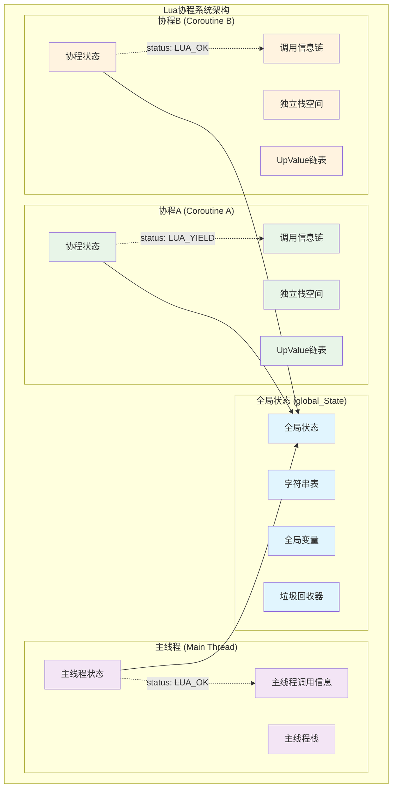
```mermaid
graph TB
    subgraph "Lua协程系统架构"
        subgraph "全局状态 (global_State)"
            GS[全局状态]
            ST[字符串表]
            GT[全局变量]
            GC[垃圾回收器]
        end
        
        subgraph "主线程 (Main Thread)"
            MT[主线程状态]
            MS[主线程栈]
            MC[主线程调用信息]
        end
        
        subgraph "协程A (Coroutine A)"
            CA[协程状态]
            SA[独立栈空间]
            CAI[调用信息链]
            UV_A[UpValue链表]
        end
        
        subgraph "协程B (Coroutine B)"
            CB[协程状态]
            SB[独立栈空间]
            CBI[调用信息链]
            UV_B[UpValue链表]
        end
    end
    
    %% 连接关系
    CA --> GS
    CB --> GS
    MT --> GS
    
    %% 状态标注
    CA -.-> |"status: LUA_YIELD"| CAI
    CB -.-> |"status: LUA_OK"| CBI
    MT -.-> |"status: LUA_OK"| MC
    
    %% 样式
    classDef globalState fill:#e1f5fe
    classDef mainThread fill:#f3e5f5
    classDef coroutineA fill:#e8f5e8
    classDef coroutineB fill:#fff3e0
    
    class GS,ST,GT,GC globalState
    class MT,MS,MC mainThread
    class CA,SA,CAI,UV_A coroutineA
    class CB,SB,CBI,UV_B coroutineB
```

### 🏗️ 协程核心特性

**设计理念**：
- **协作式调度**：主动让出控制权，避免竞争条件
- **轻量级并发**：比线程更高效，比回调更直观
- **状态完整性**：精确保存和恢复执行上下文
- **单线程模型**：在单线程内实现并发，避免锁机制

**内存架构**：
- **独立栈空间**：每个协程拥有独立的栈和调用信息
- **共享全局状态**：共享字符串表、全局变量和GC状态
- **轻量级切换**：只需保存/恢复栈指针和程序计数器
- **内存效率**：协程栈通常只需2-8KB，而线程需要1-8MB

---

## 🌟 通俗概述

协程就像是"可以暂停和继续的函数"，是Lua实现异步编程和复杂控制流的核心机制。

### 🎭 多角度理解协程机制

#### 📖 图书阅读管理视角
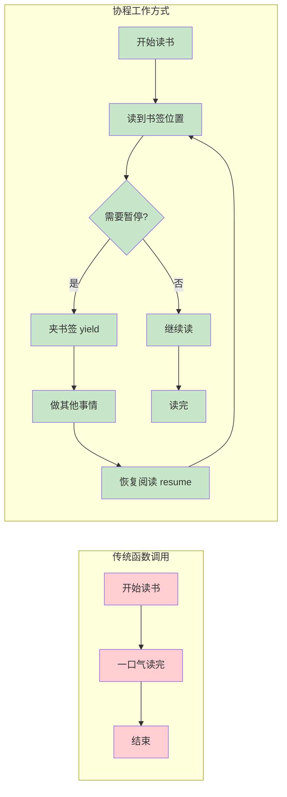
```mermaid
graph LR
    subgraph "传统函数调用"
        A1[开始读书] --> A2[一口气读完]
        A2 --> A3[结束]
    end
    
    subgraph "协程工作方式"
        B1[开始读书] --> B2[读到书签位置]
        B2 --> B3{需要暂停?}
        B3 -->|是| B4[夹书签 yield]
        B3 -->|否| B5[继续读]
        B4 --> B6[做其他事情]
        B6 --> B7[恢复阅读 resume]
        B7 --> B2
        B5 --> B8[读完]
    end
    
    classDef traditional fill:#ffcdd2
    classDef coroutine fill:#c8e6c9
    
    class A1,A2,A3 traditional
    class B1,B2,B3,B4,B5,B6,B7,B8 coroutine
```

- **传统函数调用**：一口气读完一章，中间不能停下来
- **协程的工作方式**：可以在任意位置夹书签(yield)暂停
- **恢复阅读**：从书签位置精确继续(resume)
- **状态保持**：完美记住上次的阅读进度和思考状态

#### 🍽️ 餐厅服务员视角
- **协程服务员**：可以同时服务多桌客人的高效服务员
- **yield操作**：客人点餐等待时，服务员去服务其他桌
- **resume操作**：菜品准备好时，回到原来的桌子继续服务
- **状态保持**：记住每桌客人的服务进度和特殊要求
- **协作调度**：服务员主动决定服务时机，不被强制打断

#### 🏭 智能流水线视角
- **协程工作站**：可以暂停的智能流水线工作站
- **yield操作**：等待上游材料时暂停，释放资源给其他工作站
- **resume操作**：条件满足时从暂停点继续工作
- **状态保存**：记住暂停时的所有工作状态和进度
- **资源优化**：通过协作式调度最大化整体效率

#### 🎼 交响乐演奏视角
- **协程乐器组**：可以独立演奏也可以协调配合
- **yield操作**：休止符时暂停，让其他乐器组继续
- **resume操作**：在合适时机重新加入演奏
- **状态同步**：每个乐器组知道当前演奏进度和节拍
- **协调配合**：通过指挥(调度器)协调各组演奏时机

### 🎯 核心设计理念

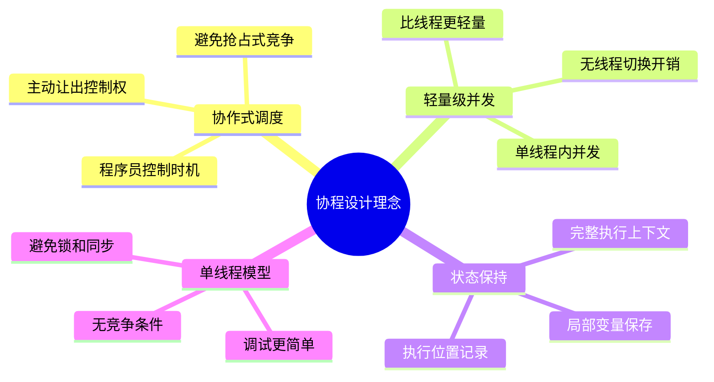
```mermaid
mindmap
  root((协程设计理念))
    协作式调度
      主动让出控制权
      避免抢占式竞争
      程序员控制时机
    轻量级并发
      比线程更轻量
      无线程切换开销
      单线程内并发
    状态保持
      完整执行上下文
      局部变量保存
      执行位置记录
    单线程模型
      避免锁和同步
      无竞争条件
      调试更简单
```

### 💡 实际编程意义

**协程的核心价值**：
- **代码直观性**：异步代码写得像同步代码一样清晰
- **性能优势**：避免线程切换开销，内存占用极低
- **控制灵活性**：精确控制何时暂停和恢复执行
- **错误处理**：比回调函数更容易处理错误和异常情况

**适用场景**：
- **异步I/O**：网络请求、文件操作等待时处理其他任务
- **生成器模式**：按需生成数据，而不是一次性全部生成
- **状态机实现**：复杂的业务逻辑状态转换
- **游戏开发**：NPC行为脚本、动画序列、事件处理系统

---

## 🔄 协程状态管理详解

### 📊 协程状态机

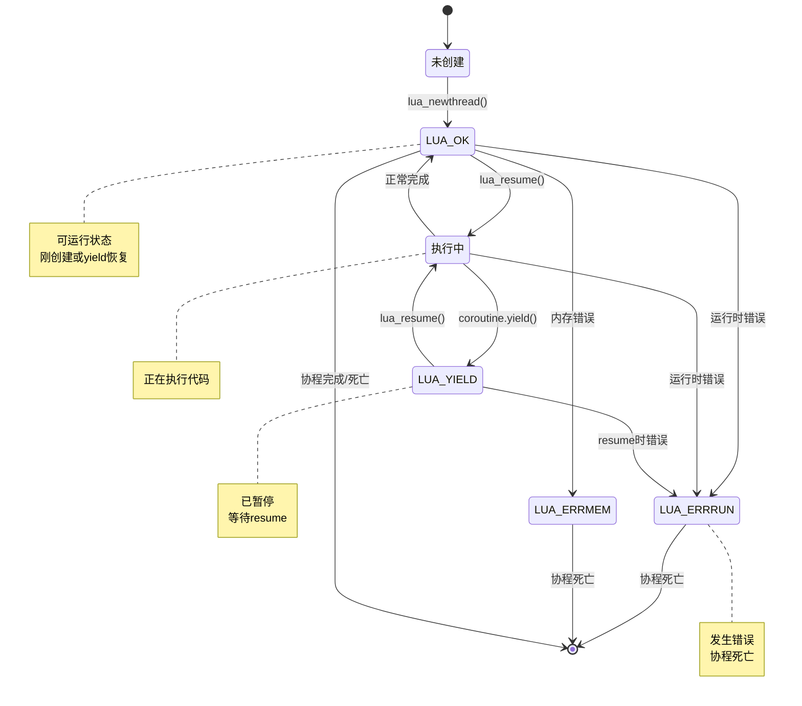
```mermaid
stateDiagram-v2
    [*] --> 未创建
    未创建 --> LUA_OK : lua_newthread()
    
    LUA_OK --> 执行中 : lua_resume()
    LUA_OK --> LUA_ERRRUN : 运行时错误
    LUA_OK --> LUA_ERRMEM : 内存错误
    
    执行中 --> LUA_YIELD : coroutine.yield()
    执行中 --> LUA_OK : 正常完成
    执行中 --> LUA_ERRRUN : 运行时错误
    
    LUA_YIELD --> 执行中 : lua_resume()
    LUA_YIELD --> LUA_ERRRUN : resume时错误
    
    LUA_ERRRUN --> [*] : 协程死亡
    LUA_ERRMEM --> [*] : 协程死亡
    LUA_OK --> [*] : 协程完成/死亡
    
    note right of LUA_OK : 可运行状态<br/>刚创建或yield恢复
    note right of 执行中 : 正在执行代码
    note right of LUA_YIELD : 已暂停<br/>等待resume
    note right of LUA_ERRRUN : 发生错误<br/>协程死亡
```

### 🏗️ lua_State结构解析

**协程状态的核心数据结构**：

```c
// lstate.h - 协程状态结构 (详细注释版)
struct lua_State {
  CommonHeader;                    /* GC通用头部 */

  /* === 协程状态核心字段 === */
  lu_byte status;                  /* 协程状态: LUA_OK, LUA_YIELD等 */

  /* === 栈管理系统 === */
  StkId top;                       /* 当前栈顶指针 */
  StkId stack;                     /* 栈底指针 */
  StkId stack_last;                /* 栈的最后可用位置 */
  int stacksize;                   /* 栈的总大小 */

  /* === 全局状态和调用管理 === */
  global_State *l_G;               /* 指向共享的全局状态 */
  CallInfo *ci;                    /* 当前调用信息 */
  CallInfo base_ci;                /* 基础调用信息 */
  const Instruction *oldpc;        /* 上一条指令位置 */

  /* === 协程特有字段 === */
  struct lua_State *twups;         /* 有upvalue的线程链表 */
  UpVal *openupval;                /* 开放upvalue链表 */

  /* === 错误处理系统 === */
  struct lua_longjmp *errorJmp;    /* 错误跳转点 */
  ptrdiff_t errfunc;               /* 错误函数在栈中的位置 */

  /* === 调试和钩子系统 === */
  volatile lua_Hook hook;          /* 调试钩子函数 */
  l_signalT hookmask;             /* 钩子事件掩码 */
  int basehookcount;              /* 基础钩子计数 */
  int hookcount;                  /* 当前钩子计数 */
  lu_byte allowhook;              /* 是否允许钩子 */

  /* === 调用控制 === */
  unsigned short nny;             /* 不可yield的调用层数 */
  unsigned short nCcalls;         /* C函数调用嵌套层数 */

  /* === 垃圾回收 === */
  GCObject *gclist;               /* GC对象链表节点 */
};
```

### 🔍 协程创建过程

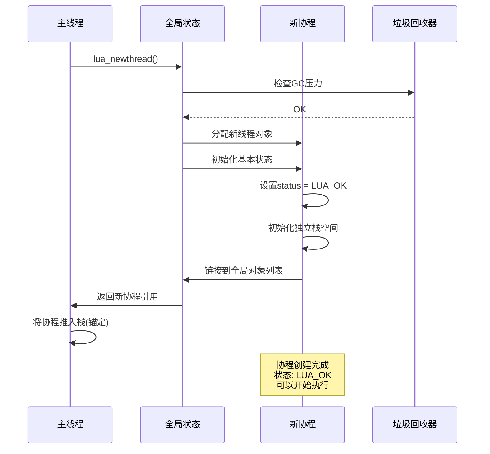
```mermaid
sequenceDiagram
    participant L as 主线程
    participant G as 全局状态
    participant L1 as 新协程
    participant GC as 垃圾回收器

    L->>G: lua_newthread()
    G->>GC: 检查GC压力
    GC-->>G: OK
    G->>L1: 分配新线程对象
    G->>L1: 初始化基本状态
    L1->>L1: 设置status = LUA_OK
    L1->>L1: 初始化独立栈空间
    L1->>G: 链接到全局对象列表
    G->>L: 返回新协程引用
    L->>L: 将协程推入栈(锚定)
    
    Note over L1: 协程创建完成<br/>状态: LUA_OK<br/>可以开始执行
```

### ⚙️ 协程状态检查机制

```c
/* 协程状态检查函数的实现逻辑 */

/*
协程状态判断逻辑：
┌─────────────────────────────────────────────────────────┐
│                   协程状态检查决策树                    │
├─────────────────────────────────────────────────────────┤
│                                                         │
│    是否为当前运行协程？                                 │
│         ├─ 是 ──→ CO_RUN (正在运行)                     │
│         └─ 否 ──→ 检查协程状态                          │
│                  ├─ LUA_YIELD ──→ CO_SUS (已暂停)       │
│                  ├─ LUA_OK ──→ 进一步检查               │
│                  │            ├─ 有待处理调用 ──→ CO_NOR│
│                  │            ├─ 栈为空 ──→ CO_DEAD     │
│                  │            └─ 其他 ──→ CO_NOR        │
│                  └─ 错误状态 ──→ CO_DEAD (已死亡)       │
│                                                         │
└─────────────────────────────────────────────────────────┘
*/

// lcorolib.c - 协程状态检查
static int auxstatus (lua_State *L, lua_State *co) {
  if (L == co) return CO_RUN;  /* 正在运行的协程 */
  
  switch (co->status) {
    case LUA_YIELD:
      return CO_SUS;  /* 已暂停，可以resume */
      
    case LUA_OK: {
      CallInfo *ci = co->ci;
      if (ci != &co->base_ci)    /* 有待处理的调用？ */
        return CO_NOR;           /* 正常但未启动 */
      else if (co->top == co->ci->top)  /* 栈为空？ */
        return CO_DEAD;          /* 已死亡 */
      else
        return CO_NOR;           /* 正常状态 */
    }
    
    default:  /* 各种错误状态 */
      return CO_DEAD;            /* 协程死亡 */
  }
}
```

### 📊 内存布局可视化

```mermaid
graph TD
    subgraph "协程内存布局"
        subgraph "共享全局状态"
            GS[全局状态 global_State]
            ST[字符串表 StringTable]
            GT[全局变量 GlobalTable]
            GC[GC状态 GCState]
        end
        
        subgraph "协程A独立内存"
            SA[栈空间 stack[]]
            CA[调用信息 CallInfo]
            UV_A[UpValue链表]
            LS_A[协程状态 lua_State]
        end
        
        subgraph "协程B独立内存"
            SB[栈空间 stack[]]
            CB[调用信息 CallInfo]
            UV_B[UpValue链表]
            LS_B[协程状态 lua_State]
        end
    end
    
    %% 连接关系
    LS_A --> GS
    LS_B --> GS
    LS_A --> SA
    LS_A --> CA
    LS_A --> UV_A
    LS_B --> SB
    LS_B --> CB
    LS_B --> UV_B
    
    %% 样式
    classDef shared fill:#e3f2fd
    classDef coroutineA fill:#e8f5e8
    classDef coroutineB fill:#fff3e0
    
    class GS,ST,GT,GC shared
    class SA,CA,UV_A,LS_A coroutineA
    class SB,CB,UV_B,LS_B coroutineB
```

**内存特点**：
- **共享效率**：全局状态被所有协程共享，节省内存
- **隔离安全**：每个协程的栈和调用信息完全独立
- **轻量切换**：只需要切换少量的状态信息
- **GC友好**：协程对象参与统一的垃圾回收

---

## ⚡ Yield操作实现详解

### 🔄 Yield操作流程

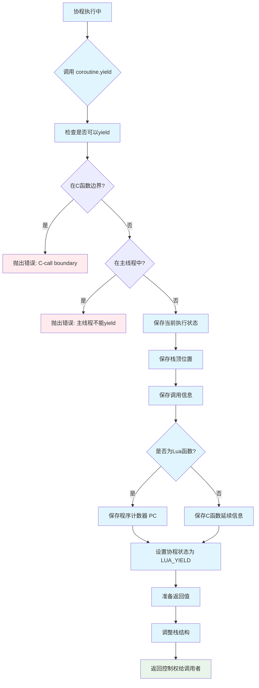
```mermaid
flowchart TD
    A[协程执行中] --> B{调用 coroutine.yield}
    B --> C[检查是否可以yield]
    C --> D{在C函数边界?}
    D -->|是| E[抛出错误: C-call boundary]
    D -->|否| F{在主线程中?}
    F -->|是| G[抛出错误: 主线程不能yield]
    F -->|否| H[保存当前执行状态]
    
    H --> I[保存栈顶位置]
    I --> J[保存调用信息]
    J --> K{是否为Lua函数?}
    K -->|是| L[保存程序计数器 PC]
    K -->|否| M[保存C函数延续信息]
    
    L --> N[设置协程状态为 LUA_YIELD]
    M --> N
    N --> O[准备返回值]
    O --> P[调整栈结构]
    P --> Q[返回控制权给调用者]
    
    classDef process fill:#e1f5fe
    classDef error fill:#ffebee
    classDef success fill:#e8f5e8
    
    class A,B,C,H,I,J,K,L,M,N,O,P,Q process
    class E,G error
    class Q success
```

### 🛠️ Yield核心实现

```c
// ldo.c - yield操作的完整实现
int lua_yieldk (lua_State *L, int nresults, lua_KContext ctx, lua_KFunction k) {
  CallInfo *ci = L->ci;

  /* === 第一步：yield有效性检查 === */
  luai_userstateyield(L, nresults);  /* 用户状态钩子 */
  lua_lock(L);
  api_checknelems(L, nresults);      /* 检查栈上的返回值数量 */

  /* 检查是否在不可yield的上下文中 */
  if (L->nny > 0) {
    if (L != G(L)->mainthread)
      luaG_runerror(L, "attempt to yield across a C-call boundary");
    else
      luaG_runerror(L, "attempt to yield from outside a coroutine");
  }

  /* === 第二步：设置协程状态 === */
  L->status = LUA_YIELD;
  ci->extra = savestack(L, L->top - nresults);  /* 保存结果位置 */

  /* === 第三步：根据调用类型保存状态 === */
  if (isLua(ci)) {  /* 在Lua函数内yield？ */
    if (k == NULL) {  /* 没有延续函数 */
      /* 保存程序计数器，恢复时从此处继续 */
      ci->u.l.savedpc = ci->u.l.savedpc;
    } else {  /* 有延续函数（用于钩子等） */
      ci->u.c.k = k;
      ci->u.c.ctx = ctx;
      /* 保护栈下面的值 */
      ci->func = L->top - nresults - 1;
      luaD_throw(L, LUA_YIELD);  /* 通过异常机制yield */
    }
  } else {  /* 在C函数内yield */
    if ((ci->u.c.k = k) != NULL) {  /* 有延续函数？ */
      ci->u.c.ctx = ctx;           /* 保存上下文 */
      ci->u.c.old_errfunc = L->errfunc;
      L->errfunc = 0;
      ci->callstatus |= CIST_YPCALL;  /* 标记为可yield调用 */
    }
    /* 保护栈下面的值 */
    ci->func = L->top - nresults - 1;
    luaD_throw(L, LUA_YIELD);  /* 通过异常机制yield */
  }

  lua_unlock(L);
  return -1;  /* 表示yield成功 */
}

/* === yield的简化版本（无延续函数） === */
int lua_yield (lua_State *L, int nresults) {
  return lua_yieldk(L, nresults, 0, NULL);
}
```

### 🎯 Yield状态保存机制

```mermaid
graph LR
    subgraph "Yield状态保存"
        A[当前执行状态] --> B[栈状态]
        A --> C[调用信息]
        A --> D[程序计数器]
        A --> E[错误处理]
        
        B --> B1[栈顶位置 top]
        B --> B2[返回值数量 nresults]
        B --> B3[栈内容保护]
        
        C --> C1[当前调用 ci]
        C --> C2[调用状态 callstatus]
        C --> C3[函数位置 func]
        
        D --> D1[Lua函数: savedpc]
        D --> D2[C函数: 延续信息]
        
        E --> E1[错误函数 errfunc]
        E --> E2[异常跳转点 errorJmp]
    end
    
    classDef state fill:#e3f2fd
    classDef stack fill:#e8f5e8
    classDef call fill:#fff3e0
    classDef pc fill:#fce4ec
    classDef error fill:#ffebee
    
    class A state
    class B,B1,B2,B3 stack
    class C,C1,C2,C3 call
    class D,D1,D2 pc
    class E,E1,E2 error
```

### 🔧 Yield限制检查

```c
/*
yield限制的详细说明：

1. nny (不可yield计数器)：
   - 每次进入不可yield的C函数时 nny++
   - 退出时 nny--
   - nny > 0 时不允许yield

2. C函数边界问题：
   - C函数栈帧无法被Lua保存和恢复
   - 会导致栈不平衡和内存问题
   - 必须通过延续函数机制处理

3. 主线程限制：
   - 主线程yield后无法恢复执行
   - 会导致程序永久挂起
*/

/* yield有效性检查的完整逻辑 */
static void validate_yield_context (lua_State *L) {
  /* 检查不可yield计数器 */
  if (L->nny > 0) {
    const char *msg;
    if (L != G(L)->mainthread) {
      msg = "attempt to yield across a C-call boundary";
    } else {
      msg = "attempt to yield from outside a coroutine";
    }
    luaG_runerror(L, msg);
  }

  /* 检查主线程 */
  if (L == G(L)->mainthread) {
    luaG_runerror(L, "attempt to yield main thread");
  }

  /* 检查调用栈深度 */
  if (L->nCcalls >= LUAI_MAXCCALLS) {
    luaG_runerror(L, "C stack overflow");
  }
}
```

### 📊 Yield性能分析

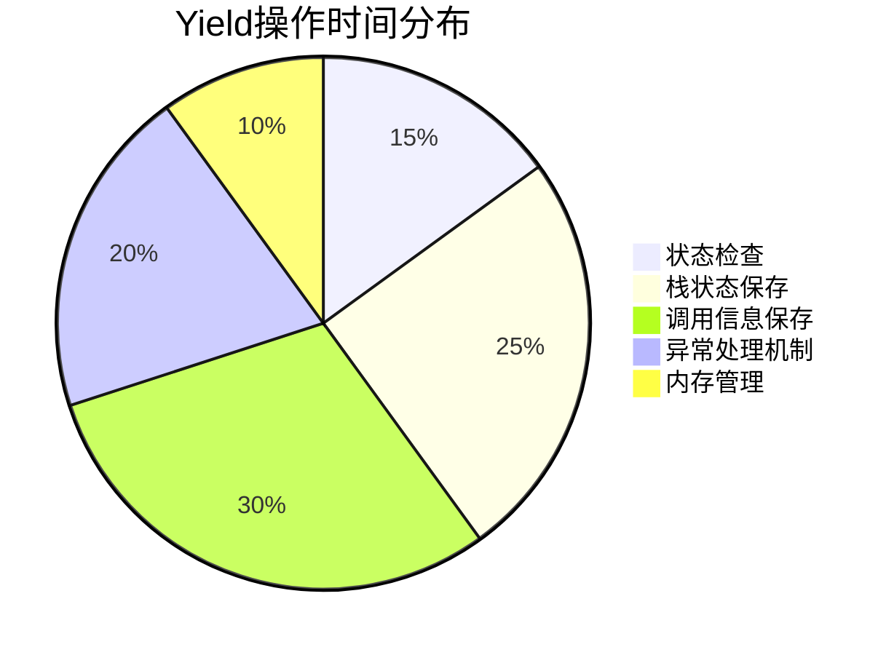
```mermaid
pie title Yield操作时间分布
    "状态检查" : 15
    "栈状态保存" : 25
    "调用信息保存" : 30
    "异常处理机制" : 20
    "内存管理" : 10
```

**性能特点**：
- **轻量级操作**：主要是指针和状态值的保存
- **零拷贝**：不需要复制栈内容，只保存指针
- **快速检查**：状态检查都是简单的整数比较
- **内存效率**：不分配额外内存，只修改现有结构

---

## 🚀 Resume操作实现详解

### 🔄 Resume操作流程

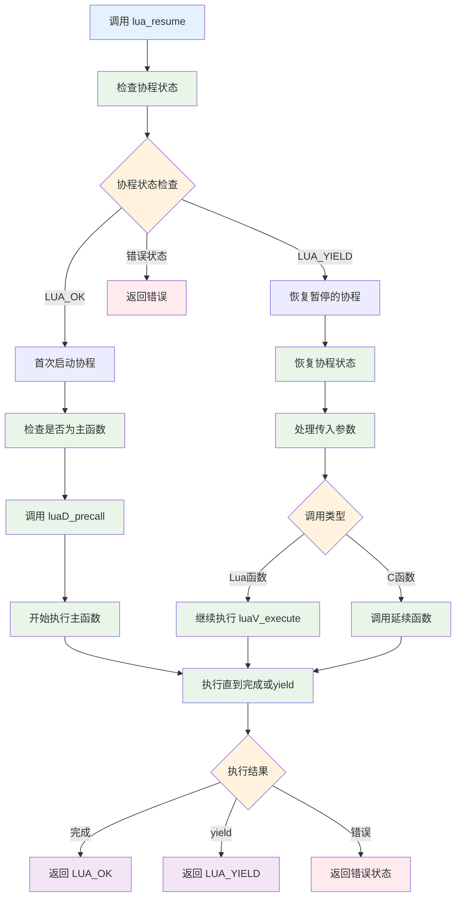
```mermaid
flowchart TD
    A[调用 lua_resume] --> B[检查协程状态]
    B --> C{协程状态检查}
    C -->|LUA_OK| D[首次启动协程]
    C -->|LUA_YIELD| E[恢复暂停的协程]
    C -->|错误状态| F[返回错误]
    
    D --> G[检查是否为主函数]
    G --> H[调用 luaD_precall]
    H --> I[开始执行主函数]
    
    E --> J[恢复协程状态]
    J --> K[处理传入参数]
    K --> L{调用类型}
    L -->|Lua函数| M[继续执行 luaV_execute]
    L -->|C函数| N[调用延续函数]
    
    I --> O[执行直到完成或yield]
    M --> O
    N --> O
    O --> P{执行结果}
    P -->|完成| Q[返回 LUA_OK]
    P -->|yield| R[返回 LUA_YIELD]
    P -->|错误| S[返回错误状态]
    
    classDef start fill:#e3f2fd
    classDef process fill:#e8f5e8
    classDef decision fill:#fff3e0
    classDef result fill:#f3e5f5
    classDef error fill:#ffebee
    
    class A start
    class B,G,H,I,J,K,M,N,O process
    class C,L,P decision
    class Q,R result
    class F,S error
```

### 🛠️ Resume核心实现

```c
// ldo.c - resume操作的完整实现
LUA_API int lua_resume (lua_State *L, lua_State *from, int nargs) {
  int status;
  unsigned short oldnny = L->nny;  /* 保存旧的nny值 */

  lua_lock(L);

  /* === 第一步：协程状态验证 === */
  if (L->status == LUA_OK) {  /* 可能是第一次启动？ */
    if (L->ci != &L->base_ci)  /* 不是主函数？ */
      return resume_error(L, "cannot resume non-suspended coroutine", nargs);
  }
  else if (L->status != LUA_YIELD)  /* 不是yield状态？ */
    return resume_error(L, "cannot resume dead coroutine", nargs);

  /* === 第二步：设置调用环境 === */
  L->nCcalls = (from) ? from->nCcalls + 1 : 1;
  if (L->nCcalls >= LUAI_MAXCCALLS)
    return resume_error(L, "C stack overflow", nargs);

  luai_userstateresume(L, nargs);  /* 用户状态钩子 */
  L->nny = 0;  /* 允许yield */

  /* === 第三步：检查栈空间 === */
  api_checknelems(L, (L->status == LUA_OK) ? nargs + 1 : nargs);

  /* === 第四步：执行恢复操作 === */
  status = luaD_rawrunprotected(L, resume, &nargs);

  /* === 第五步：处理执行结果 === */
  if (status == -1)  /* yield？ */
    status = LUA_YIELD;
  else {  /* 完成或错误 */
    if (status != LUA_OK)  /* 错误？ */
      L->status = cast_byte(status);  /* 标记错误状态 */
    else if (L->ci != &L->base_ci)  /* 调用未完成？ */
      status = LUA_ERRRUN;  /* 强制错误 */
  }

  L->nny = oldnny;  /* 恢复旧的nny值 */
  L->nCcalls--;

  lua_unlock(L);
  return status;
}
```

### 🎯 Resume状态恢复机制

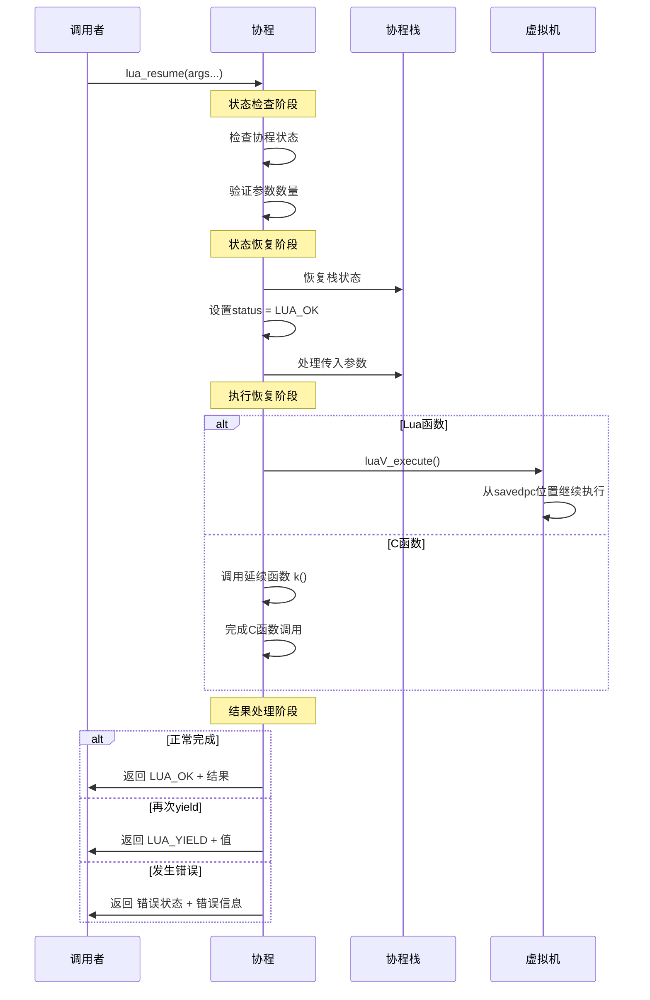
```mermaid
sequenceDiagram
    participant Caller as 调用者
    participant Coroutine as 协程
    participant Stack as 协程栈
    participant VM as 虚拟机

    Caller->>Coroutine: lua_resume(args...)
    
    Note over Coroutine: 状态检查阶段
    Coroutine->>Coroutine: 检查协程状态
    Coroutine->>Coroutine: 验证参数数量
    
    Note over Coroutine: 状态恢复阶段  
    Coroutine->>Stack: 恢复栈状态
    Coroutine->>Coroutine: 设置status = LUA_OK
    Coroutine->>Stack: 处理传入参数
    
    Note over Coroutine: 执行恢复阶段
    alt Lua函数
        Coroutine->>VM: luaV_execute()
        VM->>VM: 从savedpc位置继续执行
    else C函数
        Coroutine->>Coroutine: 调用延续函数 k()
        Coroutine->>Coroutine: 完成C函数调用
    end
    
    Note over Coroutine: 结果处理阶段
    alt 正常完成
        Coroutine->>Caller: 返回 LUA_OK + 结果
    else 再次yield
        Coroutine->>Caller: 返回 LUA_YIELD + 值
    else 发生错误
        Coroutine->>Caller: 返回 错误状态 + 错误信息
    end
```

### 🔧 Resume状态恢复详解

```c
// ldo.c - resume的核心执行函数
static void resume (lua_State *L, void *ud) {
  int nargs = *(cast(int*, ud));
  StkId firstArg = L->top - nargs;
  CallInfo *ci = L->ci;

  if (L->status == LUA_OK) {  /* === 首次启动协程 === */
    if (ci != &L->base_ci)  /* 不是主函数？ */
      return;  /* 错误：协程已在运行 */

    /* 开始执行主函数 */
    if (!luaD_precall(L, firstArg - 1, LUA_MULTRET))  /* Lua函数？ */
      luaV_execute(L);  /* 调用虚拟机执行 */
  }
  else {  /* === 恢复yield的协程 === */
    lua_assert(L->status == LUA_YIELD);
    L->status = LUA_OK;  /* 标记为运行中 */

    /* 恢复执行上下文 */
    ci->func = restorestack(L, ci->extra);

    if (isLua(ci)) {  /* === Lua函数恢复 === */
      /* 调整参数和返回值 */
      if (nargs == 0)  /* 没有参数？ */
        L->top = ci->top;
      else  /* 有参数，调整栈 */
        luaD_adjustvarargs(L, ci, nargs);
      
      /* 继续从保存的PC位置执行 */
      luaV_execute(L);
    }
    else {  /* === C函数恢复 === */
      int n;
      lua_assert(ci->u.c.k != NULL);  /* 必须有延续函数 */

      /* 准备参数 */
      if (nargs == 1)  /* 一个值？ */
        moveto(L, firstArg, L->top - 1);
      else
        L->top = firstArg;

      /* 调用延续函数 */
      n = (*ci->u.c.k)(L, LUA_YIELD, ci->u.c.ctx);
      api_checknelems(L, n);

      /* 完成调用 */
      luaD_poscall(L, ci, L->top - n, n);
    }
  }

  /* 运行直到完成或yield */
  unroll(L, NULL);
}
```

### 📊 Resume参数传递机制

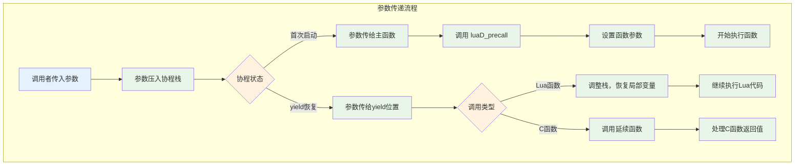
```mermaid
graph TD
    subgraph "参数传递流程"
        A[调用者传入参数] --> B[参数压入协程栈]
        B --> C{协程状态}
        C -->|首次启动| D[参数传给主函数]
        C -->|yield恢复| E[参数传给yield位置]
        
        D --> F[调用 luaD_precall]
        F --> G[设置函数参数]
        G --> H[开始执行函数]
        
        E --> I{调用类型}
        I -->|Lua函数| J[调整栈，恢复局部变量]
        I -->|C函数| K[调用延续函数]
        
        J --> L[继续执行Lua代码]
        K --> M[处理C函数返回值]
    end
    
    classDef input fill:#e3f2fd
    classDef process fill:#e8f5e8
    classDef decision fill:#fff3e0
    classDef output fill:#f3e5f5
    
    class A input
    class B,D,F,G,H,E,J,K,L,M process
    class C,I decision
```

### 🎯 Resume错误处理

```c
/* Resume错误处理的完整机制 */

/*
Resume可能遇到的错误情况：

1. 协程状态错误：
   - 协程已死亡 (LUA_ERRRUN等)
   - 协程正在运行 (非LUA_OK且非LUA_YIELD)
   - 协程不在正确状态

2. 栈溢出错误：
   - C栈调用层次过深
   - Lua栈空间不足
   - 参数数量超限

3. 执行错误：
   - 运行时错误
   - 内存分配失败  
   - 调用协程内部错误
*/

static int resume_error (lua_State *L, const char *msg, int narg) {
  L->top -= narg;  /* 移除参数 */
  setsvalue2s(L, L->top, luaS_new(L, msg));  /* 设置错误消息 */
  api_incr_top(L);
  return LUA_ERRRUN;  /* 返回运行时错误 */
}

/* 检查resume的前置条件 */
static int check_resume_preconditions (lua_State *L, lua_State *from, int nargs) {
  /* 检查协程状态 */
  if (L->status != LUA_OK && L->status != LUA_YIELD) {
    return resume_error(L, "cannot resume dead coroutine", nargs);
  }

  /* 检查调用栈深度 */
  L->nCcalls = (from) ? from->nCcalls + 1 : 1;
  if (L->nCcalls >= LUAI_MAXCCALLS) {
    return resume_error(L, "C stack overflow", nargs);
  }

  /* 检查栈空间 */
  if (L->top + nargs > L->stack_last) {
    return resume_error(L, "stack overflow", nargs);
  }

  return LUA_OK;  /* 检查通过 */
}
```

---

## 🧪 实践实验

### 实验1：协程状态观察器 🔍

**目标**：创建一个工具来观察协程的状态变化过程

```lua
-- 协程状态观察器实现
local CoroutineObserver = {}
CoroutineObserver.__index = CoroutineObserver

function CoroutineObserver.new(name)
  local self = {
    name = name or "unnamed",
    logs = {},
    start_time = os.clock()
  }
  return setmetatable(self, CoroutineObserver)
end

function CoroutineObserver:log(message, co)
  local status = coroutine.status(co)
  local time = os.clock() - self.start_time
  local entry = {
    time = time,
    message = message,
    status = status,
    stack_size = self:get_stack_size(co)
  }
  table.insert(self.logs, entry)
  print(string.format("[%.3fs] %s: %s (status: %s, stack: %d)", 
    time, self.name, message, status, entry.stack_size))
end

function CoroutineObserver:get_stack_size(co)
  local size = 0
  local level = 0
  while true do
    local info = debug.getinfo(co, level, "S")
    if not info then break end
    size = size + 1
    level = level + 1
  end
  return size
end

function CoroutineObserver:report()
  print("\n=== 协程状态报告: " .. self.name .. " ===")
  for i, entry in ipairs(self.logs) do
    print(string.format("%d. [%.3fs] %s -> %s", 
      i, entry.time, entry.message, entry.status))
  end
end

-- 使用示例
local observer = CoroutineObserver.new("TestCoroutine")

local function test_coroutine()
  observer:log("协程开始执行", coroutine.running())
  
  for i = 1, 3 do
    observer:log("执行第 " .. i .. " 步", coroutine.running())
    coroutine.yield("step_" .. i)
    observer:log("从yield恢复", coroutine.running())
  end
  
  observer:log("协程即将结束", coroutine.running())
  return "完成"
end

-- 创建和运行协程
local co = coroutine.create(test_coroutine)
observer:log("协程已创建", co)

while coroutine.status(co) ~= "dead" do
  observer:log("准备resume", co)
  local ok, result = coroutine.resume(co)
  observer:log("resume返回: " .. tostring(result), co)
end

observer:report()
```

### 实验2：协程性能基准测试 ⚡

**目标**：测试协程创建、切换的性能特征

```lua
-- 协程性能基准测试
local CoroutineBenchmark = {}

function CoroutineBenchmark.test_creation_performance()
  print("=== 协程创建性能测试 ===")
  
  local iterations = 100000
  local start_time = os.clock()
  local coroutines = {}
  
  -- 创建大量协程
  for i = 1, iterations do
    coroutines[i] = coroutine.create(function()
      return i * 2
    end)
  end
  
  local creation_time = os.clock() - start_time
  
  -- 执行所有协程
  start_time = os.clock()
  for i = 1, iterations do
    coroutine.resume(coroutines[i])
  end
  local execution_time = os.clock() - start_time
  
  print(string.format("创建 %d 个协程耗时: %.4f 秒", iterations, creation_time))
  print(string.format("执行 %d 个协程耗时: %.4f 秒", iterations, execution_time))
  print(string.format("平均创建时间: %.6f 秒/个", creation_time / iterations))
  print(string.format("平均执行时间: %.6f 秒/个", execution_time / iterations))
end

function CoroutineBenchmark.test_yield_resume_performance()
  print("\n=== Yield/Resume性能测试 ===")
  
  local switch_count = 1000000
  local switch_counter = 0
  
  local function ping_pong()
    while switch_counter < switch_count do
      switch_counter = switch_counter + 1
      coroutine.yield()
    end
  end
  
  local co = coroutine.create(ping_pong)
  local start_time = os.clock()
  
  while coroutine.status(co) ~= "dead" do
    coroutine.resume(co)
  end
  
  local total_time = os.clock() - start_time
  
  print(string.format("完成 %d 次yield/resume切换", switch_count))
  print(string.format("总耗时: %.4f 秒", total_time))
  print(string.format("平均切换时间: %.6f 秒/次", total_time / switch_count))
  print(string.format("切换频率: %.0f 次/秒", switch_count / total_time))
end

function CoroutineBenchmark.test_memory_usage()
  print("\n=== 协程内存使用测试 ===")
  
  local function measure_memory()
    collectgarbage("collect")
    return collectgarbage("count")
  end
  
  local base_memory = measure_memory()
  local coroutines = {}
  local coroutine_count = 10000
  
  -- 创建协程并测量内存
  for i = 1, coroutine_count do
    coroutines[i] = coroutine.create(function()
      local data = {}
      for j = 1, 100 do
        data[j] = "data_" .. j
      end
      coroutine.yield(data)
      return #data
    end)
    
    -- 启动协程以分配栈空间
    coroutine.resume(coroutines[i])
  end
  
  local used_memory = measure_memory() - base_memory
  
  print(string.format("创建 %d 个协程", coroutine_count))
  print(string.format("内存使用: %.2f KB", used_memory))
  print(string.format("平均每个协程: %.2f KB", used_memory / coroutine_count))
end

-- 运行所有基准测试
CoroutineBenchmark.test_creation_performance()
CoroutineBenchmark.test_yield_resume_performance()
CoroutineBenchmark.test_memory_usage()
```

### 实验3：协程调试工具 🔧

**目标**：创建高级调试工具来分析协程执行流程

```lua
-- 高级协程调试工具
local CoroutineDebugger = {}
CoroutineDebugger.__index = CoroutineDebugger

function CoroutineDebugger.new()
  local self = {
    traces = {},
    hooks = {},
    active = false
  }
  return setmetatable(self, CoroutineDebugger)
end

function CoroutineDebugger:start_trace(co, name)
  if self.traces[co] then
    error("协程已在追踪中")
  end
  
  self.traces[co] = {
    name = name or tostring(co),
    events = {},
    start_time = os.clock(),
    call_stack = {}
  }
  
  self:hook_coroutine(co)
end

function CoroutineDebugger:hook_coroutine(co)
  -- 保存原始函数
  local original_resume = coroutine.resume
  local original_yield = coroutine.yield
  
  -- 拦截resume调用
  local function traced_resume(c, ...)
    if c == co then
      self:log_event(co, "resume", {...})
    end
    local results = {original_resume(c, ...)}
    if c == co then
      self:log_event(co, "resume_return", {table.unpack(results, 2)})
    end
    return table.unpack(results)
  end
  
  -- 拦截yield调用（需要在协程内部调用）
  local function traced_yield(...)
    local running = coroutine.running()
    if running == co then
      self:log_event(co, "yield", {...})
    end
    return original_yield(...)
  end
  
  -- 替换全局函数（注意：这会影响所有协程）
  coroutine.resume = traced_resume
  -- coroutine.yield = traced_yield  -- 需要特殊处理
end

function CoroutineDebugger:log_event(co, event_type, args)
  local trace = self.traces[co]
  if not trace then return end
  
  local event = {
    time = os.clock() - trace.start_time,
    type = event_type,
    args = args,
    status = coroutine.status(co),
    stack_info = self:get_stack_info(co)
  }
  
  table.insert(trace.events, event)
  
  -- 实时输出（可选）
  print(string.format("[%.4fs] %s: %s (%s)", 
    event.time, trace.name, event_type, event.status))
end

function CoroutineDebugger:get_stack_info(co)
  local stack = {}
  local level = 0
  
  while true do
    local info = debug.getinfo(co, level, "Snl")
    if not info then break end
    
    table.insert(stack, {
      source = info.short_src,
      line = info.currentline,
      name = info.name,
      what = info.what
    })
    
    level = level + 1
  end
  
  return stack
end

function CoroutineDebugger:generate_report(co)
  local trace = self.traces[co]
  if not trace then
    error("协程未被追踪")
  end
  
  print(string.format("\n=== 协程调试报告: %s ===", trace.name))
  print(string.format("总执行时间: %.4f 秒", os.clock() - trace.start_time))
  print(string.format("事件总数: %d", #trace.events))
  
  -- 事件统计
  local event_counts = {}
  for _, event in ipairs(trace.events) do
    event_counts[event.type] = (event_counts[event.type] or 0) + 1
  end
  
  print("\n事件统计:")
  for event_type, count in pairs(event_counts) do
    print(string.format("  %s: %d 次", event_type, count))
  end
  
  -- 详细事件列表
  print("\n详细事件列表:")
  for i, event in ipairs(trace.events) do
    print(string.format("  %d. [%.4fs] %s -> %s", 
      i, event.time, event.type, event.status))
  end
end

-- 使用示例
local debugger = CoroutineDebugger.new()

local function debug_test_coroutine()
  print("协程内部: 开始执行")
  
  for i = 1, 3 do
    print("协程内部: 第 " .. i .. " 次迭代")
    local result = coroutine.yield("iteration_" .. i)
    print("协程内部: yield返回 " .. tostring(result))
  end
  
  return "协程完成"
end

local co = coroutine.create(debug_test_coroutine)
debugger:start_trace(co, "DebugTest")

while coroutine.status(co) ~= "dead" do
  local ok, result = coroutine.resume(co, "resume_arg")
  print("主程序: resume返回 " .. tostring(result))
end

debugger:generate_report(co)
```

---

## 🔧 调试工具和技巧

### 🎯 协程状态诊断

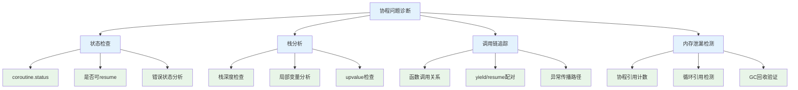
```mermaid
graph TD
    A[协程问题诊断] --> B[状态检查]
    A --> C[栈分析]  
    A --> D[调用链追踪]
    A --> E[内存泄漏检测]
    
    B --> B1[coroutine.status]
    B --> B2[是否可resume]
    B --> B3[错误状态分析]
    
    C --> C1[栈深度检查]
    C --> C2[局部变量分析]
    C --> C3[upvalue检查]
    
    D --> D1[函数调用关系]
    D --> D2[yield/resume配对]
    D --> D3[异常传播路径]
    
    E --> E1[协程引用计数]
    E --> E2[循环引用检测]
    E --> E3[GC回收验证]
    
    classDef diagnostic fill:#e3f2fd
    classDef method fill:#e8f5e8
    
    class A diagnostic
    class B,C,D,E diagnostic
    class B1,B2,B3,C1,C2,C3,D1,D2,D3,E1,E2,E3 method
```

### 🛠️ 高级调试技巧

```lua
-- 协程健康检查器
local CoroutineHealthChecker = {}

function CoroutineHealthChecker.diagnose_coroutine(co)
  local report = {
    status = coroutine.status(co),
    issues = {},
    recommendations = {}
  }
  
  -- 1. 状态检查
  if report.status == "dead" then
    table.insert(report.issues, "协程已死亡，无法再次使用")
    table.insert(report.recommendations, "检查是否有未捕获的错误")
  elseif report.status == "suspended" then
    table.insert(report.recommendations, "协程正常挂起，可以安全resume")
  end
  
  -- 2. 栈深度检查
  local stack_depth = 0
  local level = 0
  while debug.getinfo(co, level, "S") do
    stack_depth = stack_depth + 1
    level = level + 1
  end
  
  if stack_depth > 100 then
    table.insert(report.issues, "栈深度过深 (" .. stack_depth .. ")，可能存在递归问题")
    table.insert(report.recommendations, "检查是否有无限递归")
  end
  
  -- 3. 内存使用检查
  local memory_before = collectgarbage("count")
  collectgarbage("collect")
  local memory_after = collectgarbage("count")
  
  if memory_before - memory_after > 100 then
    table.insert(report.issues, "检测到大量可回收内存")
    table.insert(report.recommendations, "检查是否存在内存泄漏")
  end
  
  return report
end

function CoroutineHealthChecker.print_report(report)
  print("=== 协程健康报告 ===")
  print("状态:", report.status)
  
  if #report.issues > 0 then
    print("\n发现问题:")
    for i, issue in ipairs(report.issues) do
      print("  " .. i .. ". " .. issue)
    end
  end
  
  if #report.recommendations > 0 then
    print("\n建议:")
    for i, rec in ipairs(report.recommendations) do
      print("  " .. i .. ". " .. rec)
    end
  end
  
  if #report.issues == 0 then
    print("\n✓ 协程状态良好")
  end
end

-- 协程泄漏检测器
local CoroutineLeakDetector = {}
CoroutineLeakDetector.tracked_coroutines = {}

function CoroutineLeakDetector.register(co, name, source)
  CoroutineLeakDetector.tracked_coroutines[co] = {
    name = name,
    source = source,
    created_at = os.time(),
    last_check = os.time()
  }
end

function CoroutineLeakDetector.check_leaks()
  local current_time = os.time()
  local leaks = {}
  
  for co, info in pairs(CoroutineLeakDetector.tracked_coroutines) do
    local status = coroutine.status(co)
    
    -- 检查是否为僵尸协程
    if status == "suspended" and (current_time - info.last_check) > 300 then
      table.insert(leaks, {
        coroutine = co,
        info = info,
        age = current_time - info.created_at
      })
    end
    
    -- 清理已死亡的协程
    if status == "dead" then
      CoroutineLeakDetector.tracked_coroutines[co] = nil
    else
      info.last_check = current_time
    end
  end
  
  return leaks
end

-- 协程性能分析器
local CoroutineProfiler = {}

function CoroutineProfiler.create_profiler()
  local profiler = {
    stats = {},
    active_coroutines = {},
    start_time = os.clock()
  }
  
  function profiler:start_profiling(co, name)
    self.stats[co] = {
      name = name,
      resume_count = 0,
      yield_count = 0,
      total_time = 0,
      last_resume_time = 0
    }
  end
  
  function profiler:on_resume(co)
    local stats = self.stats[co]
    if stats then
      stats.resume_count = stats.resume_count + 1
      stats.last_resume_time = os.clock()
    end
  end
  
  function profiler:on_yield(co)
    local stats = self.stats[co]
    if stats then
      stats.yield_count = stats.yield_count + 1
      if stats.last_resume_time > 0 then
        stats.total_time = stats.total_time + (os.clock() - stats.last_resume_time)
      end
    end
  end
  
  function profiler:generate_report()
    print("=== 协程性能报告 ===")
    print(string.format("分析时长: %.2f 秒", os.clock() - self.start_time))
    print()
    
    for co, stats in pairs(self.stats) do
      print(string.format("协程: %s", stats.name))
      print(string.format("  Resume次数: %d", stats.resume_count))
      print(string.format("  Yield次数: %d", stats.yield_count))
      print(string.format("  执行时间: %.4f 秒", stats.total_time))
      if stats.resume_count > 0 then
        print(string.format("  平均执行时间: %.6f 秒/次", stats.total_time / stats.resume_count))
      end
      print()
    end
  end
  
  return profiler
end
```

---

## 📊 性能分析与优化

### ⚡ 协程性能特征分析

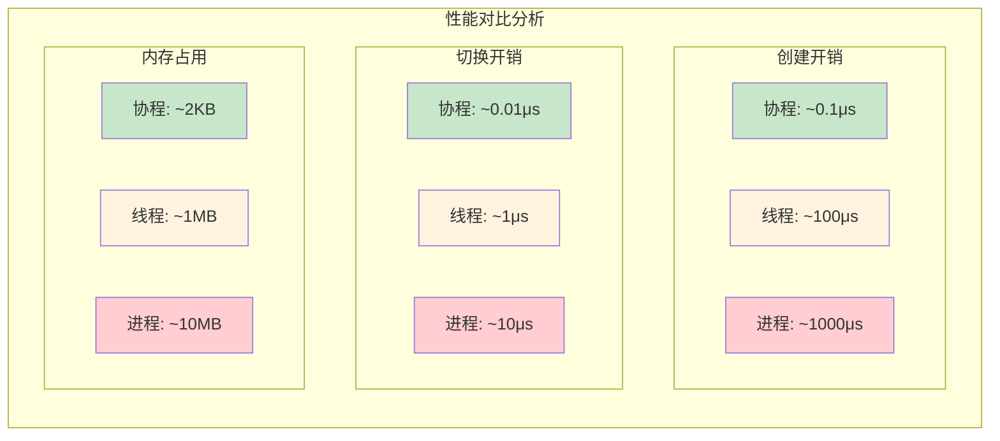
```mermaid
graph LR
    subgraph "性能对比分析"
        subgraph "创建开销"
            A1[协程: ~0.1μs]
            A2[线程: ~100μs]
            A3[进程: ~1000μs]
        end
        
        subgraph "切换开销"
            B1[协程: ~0.01μs]
            B2[线程: ~1μs]
            B3[进程: ~10μs]
        end
        
        subgraph "内存占用"
            C1[协程: ~2KB]
            C2[线程: ~1MB]
            C3[进程: ~10MB]
        end
    end
    
    classDef coroutine fill:#c8e6c9
    classDef thread fill:#fff3e0
    classDef process fill:#ffcdd2
    
    class A1,B1,C1 coroutine
    class A2,B2,C2 thread
    class A3,B3,C3 process
```

### 🎯 优化策略指南

```lua
-- 协程性能优化最佳实践
local CoroutineOptimizer = {}

-- 1. 协程池管理
function CoroutineOptimizer.create_coroutine_pool(size, factory)
  local pool = {
    available = {},
    active = {},
    factory = factory,
    max_size = size,
    stats = {created = 0, reused = 0}
  }
  
  function pool:get()
    local co = table.remove(self.available)
    if not co then
      co = coroutine.create(self.factory())
      self.stats.created = self.stats.created + 1
    else
      self.stats.reused = self.stats.reused + 1
    end
    
    self.active[co] = true
    return co
  end
  
  function pool:release(co)
    if self.active[co] and coroutine.status(co) == "dead" then
      self.active[co] = nil
      if #self.available < self.max_size then
        table.insert(self.available, co)
      end
    end
  end
  
  function pool:stats_report()
    print(string.format("协程池统计: 创建 %d, 复用 %d, 复用率 %.2f%%",
      self.stats.created, self.stats.reused,
      self.stats.reused / (self.stats.created + self.stats.reused) * 100))
  end
  
  return pool
end

-- 2. 批量处理优化
function CoroutineOptimizer.batch_processor(batch_size)
  return function(producer_func)
    local batch = {}
    local batch_count = 0
    
    while true do
      local item = producer_func()
      if not item then
        if #batch > 0 then
          coroutine.yield(batch)
        end
        break
      end
      
      table.insert(batch, item)
      if #batch >= batch_size then
        coroutine.yield(batch)
        batch = {}
        batch_count = batch_count + 1
      end
    end
    
    return batch_count
  end
end

-- 3. 协程调度器优化
function CoroutineOptimizer.create_scheduler()
  local scheduler = {
    ready_queue = {},
    waiting_queue = {},
    current_time = 0,
    stats = {
      total_switches = 0,
      total_time = 0
    }
  }
  
  function scheduler:add_task(func, priority)
    priority = priority or 0
    local co = coroutine.create(func)
    table.insert(self.ready_queue, {
      coroutine = co,
      priority = priority,
      added_time = self.current_time
    })
    
    -- 按优先级排序
    table.sort(self.ready_queue, function(a, b)
      return a.priority > b.priority
    end)
  end
  
  function scheduler:run_time_slice(max_time)
    local start_time = os.clock()
    local executed = 0
    
    while #self.ready_queue > 0 and (os.clock() - start_time) < max_time do
      local task = table.remove(self.ready_queue, 1)
      local switch_start = os.clock()
      
      local ok, result = coroutine.resume(task.coroutine)
      
      local switch_time = os.clock() - switch_start
      self.stats.total_switches = self.stats.total_switches + 1
      self.stats.total_time = self.stats.total_time + switch_time
      
      if coroutine.status(task.coroutine) == "suspended" then
        if type(result) == "number" then
          -- 延时任务
          table.insert(self.waiting_queue, {
            coroutine = task.coroutine,
            wake_time = self.current_time + result,
            priority = task.priority
          })
        else
          -- 重新加入就绪队列
          table.insert(self.ready_queue, task)
        end
      end
      
      executed = executed + 1
    end
    
    self.current_time = self.current_time + 1
    self:check_waiting_tasks()
    
    return executed
  end
  
  function scheduler:check_waiting_tasks()
    for i = #self.waiting_queue, 1, -1 do
      local task = self.waiting_queue[i]
      if task.wake_time <= self.current_time then
        table.remove(self.waiting_queue, i)
        table.insert(self.ready_queue, {
          coroutine = task.coroutine,
          priority = task.priority,
          added_time = self.current_time
        })
      end
    end
  end
  
  function scheduler:performance_report()
    local avg_switch_time = self.stats.total_time / self.stats.total_switches
    print(string.format("调度器性能: %d 次切换, 平均 %.6f 秒/次",
      self.stats.total_switches, avg_switch_time))
  end
  
  return scheduler
end

-- 4. 内存优化技巧
function CoroutineOptimizer.memory_efficient_coroutine(func)
  return coroutine.create(function(...)
    -- 在协程开始时收集垃圾
    collectgarbage("collect")
    
    local result = func(...)
    
    -- 在协程结束前收集垃圾
    collectgarbage("collect")
    
    return result
  end)
end

-- 5. 错误处理优化
function CoroutineOptimizer.safe_coroutine_wrapper(func, error_handler)
  return coroutine.create(function(...)
    local ok, result = pcall(func, ...)
    if not ok then
      if error_handler then
        error_handler(result)
      else
        print("协程错误:", result)
      end
      return nil
    end
    return result
  end)
end
```

---

## ❓ 常见后续问题详解

### 🤔 Q1: 协程的栈是如何独立管理的？与主线程有什么区别？

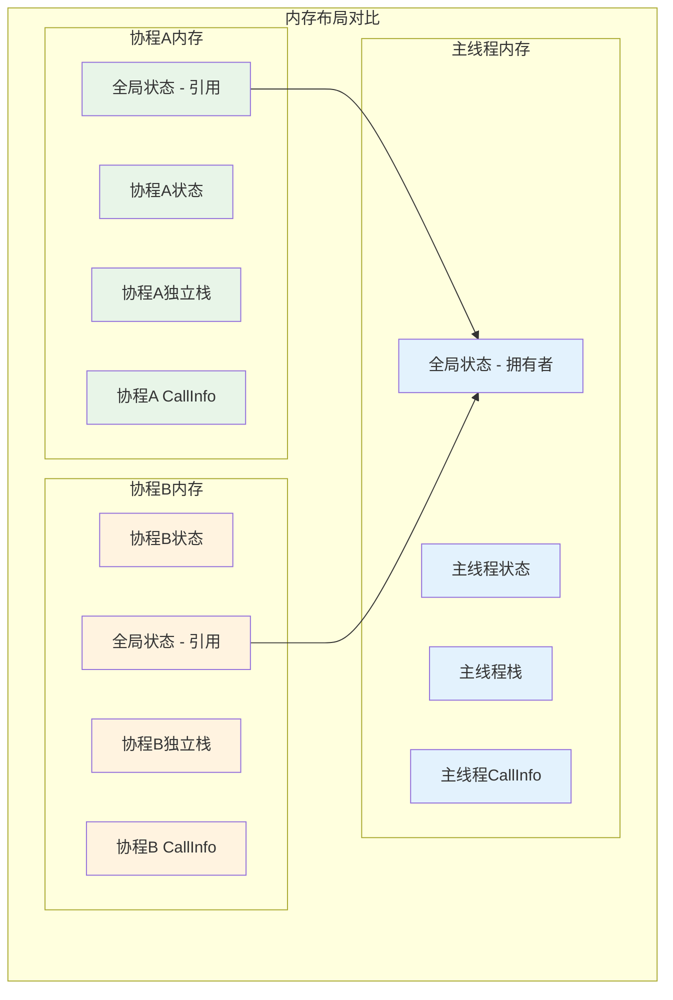
```mermaid
graph TD
    subgraph "内存布局对比"
        subgraph "主线程内存"
            MT[主线程状态]
            MS[主线程栈]
            MC[主线程CallInfo]
            MG[全局状态 - 拥有者]
        end
        
        subgraph "协程A内存"
            CA[协程A状态]
            SA[协程A独立栈]
            CAI[协程A CallInfo]
            CG_A[全局状态 - 引用]
        end
        
        subgraph "协程B内存"
            CB[协程B状态]
            SB[协程B独立栈]
            CBI[协程B CallInfo]
            CG_B[全局状态 - 引用]
        end
    end
    
    CG_A --> MG
    CG_B --> MG
    
    classDef mainthread fill:#e3f2fd
    classDef coroutineA fill:#e8f5e8
    classDef coroutineB fill:#fff3e0
    
    class MT,MS,MC,MG mainthread
    class CA,SA,CAI,CG_A coroutineA
    class CB,SB,CBI,CG_B coroutineB
```

**详细答案**：

每个协程都有完全独立的栈空间和调用管理系统：

```c
/* 协程栈独立管理的核心实现 */

// 1. 独立栈空间分配
static void stack_init (lua_State *L1, lua_State *L) {
  /* 为新协程分配独立的栈数组 */
  L1->stack = luaM_newvector(L, BASIC_STACK_SIZE, TValue);
  L1->stacksize = BASIC_STACK_SIZE;
  
  /* 初始化栈指针 - 完全独立于其他协程 */
  L1->top = L1->stack;
  L1->stack_last = L1->stack + L1->stacksize - EXTRA_STACK;
  
  /* 独立的调用信息链 */
  CallInfo *ci = &L1->base_ci;
  ci->func = L1->top;
  L1->ci = ci;
}

// 2. 主线程 vs 协程的关键差异
/*
特征对比表：
┌─────────────────┬─────────────────┬─────────────────┐
│    特征         │    主线程       │    协程         │
├─────────────────┼─────────────────┼─────────────────┤
│ 栈空间          │ 独立            │ 独立            │
│ 全局状态        │ 拥有和管理      │ 共享访问        │
│ 生命周期        │ 程序生命周期    │ 可被GC回收      │
│ 错误处理        │ 可设置panic     │ 继承主线程      │
│ 内存管理        │ 管理全局GC      │ 参与全局GC      │
│ 调用层次        │ 独立追踪        │ 独立追踪        │
│ upvalue管理     │ 独立            │ 独立            │
└─────────────────┴─────────────────┴─────────────────┘
*/
```

**关键优势**：
- **内存隔离**：栈溢出不会影响其他协程
- **调用独立**：每个协程有独立的函数调用层次
- **状态隔离**：局部变量和临时值完全隔离
- **共享效率**：全局资源共享，避免重复

### 🤔 Q2: Yield和Resume操作如何保证数据一致性？

**原子性保证机制**：

```c
/* 数据一致性的核心保证 */

// 1. 原子状态转换
int lua_yieldk (lua_State *L, int nresults, lua_KContext ctx, lua_KFunction k) {
  /* 一次性完成所有状态保存，确保原子性 */
  L->status = LUA_YIELD;                    /* 原子状态切换 */
  ci->extra = savestack(L, L->top - nresults);  /* 原子位置保存 */
  
  /* 要么全部成功，要么全部失败 */
  if (保存失败) {
    L->status = LUA_OK;  /* 回滚状态 */
    return 错误;
  }
}

// 2. 内存安全保护
static void protect_coroutine_memory (lua_State *L) {
  /* 确保yield期间的内存安全 */
  
  /* 保护栈上所有对象不被GC */
  for (StkId o = L->stack; o < L->top; o++) {
    if (iscollectable(o)) {
      markvalue(G(L), o);  /* 标记为活跃对象 */
    }
  }
  
  /* 保护upvalue引用 */
  for (UpVal *uv = L->openupval; uv != NULL; uv = uv->u.open.next) {
    markvalue(G(L), uv->v);
  }
}

// 3. 错误恢复机制
static int resume_with_error_recovery (lua_State *L, int nargs) {
  /* 保存恢复前状态 */
  lu_byte old_status = L->status;
  StkId old_top = L->top;
  
  /* 尝试恢复 */
  int result = luaD_rawrunprotected(L, resume, &nargs);
  
  if (result != LUA_OK && result != LUA_YIELD) {
    /* 恢复失败，回滚状态 */
    L->status = old_status;
    L->top = old_top;
  }
  
  return result;
}
```

### 🤔 Q3: 协程在什么情况下不能yield？为什么有这些限制？

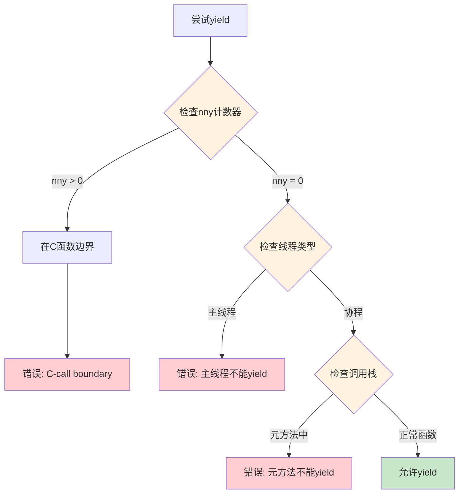
```mermaid
flowchart TD
    A[尝试yield] --> B{检查nny计数器}
    B -->|nny > 0| C[在C函数边界]
    B -->|nny = 0| D{检查线程类型}
    
    C --> E[错误: C-call boundary]
    
    D -->|主线程| F[错误: 主线程不能yield]
    D -->|协程| G{检查调用栈}
    
    G -->|元方法中| H[错误: 元方法不能yield]
    G -->|正常函数| I[允许yield]
    
    classDef error fill:#ffcdd2
    classDef success fill:#c8e6c9
    classDef check fill:#fff3e0
    
    class E,F,H error
    class I success
    class B,D,G check
```

**限制原因详解**：

```c
/* yield限制的技术原因 */

// 1. C函数边界限制
/*
问题：C函数无法保存Lua执行状态
原因：
- C栈帧结构不受Lua控制
- C局部变量无法被保存/恢复  
- 返回地址和栈指针无法管理
- 可能导致栈不平衡崩溃

解决方案：使用延续函数机制
*/

// 2. 主线程限制  
/*
问题：主线程yield后无调用者恢复
原因：
- 主线程是程序的根执行上下文
- 没有外部调用者来resume
- 会导致程序永久挂起

解决方案：只允许在协程中yield
*/

// 3. 元方法限制
/*
问题：元方法调用应该是原子操作
原因：
- 破坏对象操作的原子性
- 可能导致对象状态不一致
- 影响语言语义的正确性

解决方案：在元方法中禁用yield
*/

/* nny计数器的工作原理 */
void luaD_call (lua_State *L, StkId func, int nresults, int allowyield) {
  if (!allowyield) L->nny++;  /* 进入不可yield区域 */
  
  /* 执行函数调用 */
  int status = luaD_precall(L, func, nresults);
  
  if (!allowyield) L->nny--;  /* 退出不可yield区域 */
}
```

### 🤔 Q4: 协程的性能开销主要在哪里？如何优化？

**性能开销分析**：

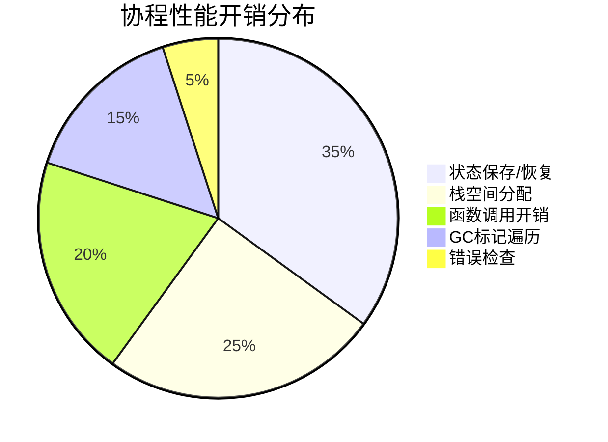
```mermaid
pie title 协程性能开销分布
    "状态保存/恢复" : 35
    "栈空间分配" : 25  
    "函数调用开销" : 20
    "GC标记遍历" : 15
    "错误检查" : 5
```

**优化策略**：

```lua
-- 1. 协程池化减少创建开销
local CoroutinePool = {
  pool = {},
  max_size = 100
}

function CoroutinePool:get_coroutine(func)
  local co = table.remove(self.pool)
  if not co then
    co = coroutine.create(func)
  end
  return co
end

function CoroutinePool:return_coroutine(co)
  if #self.pool < self.max_size and coroutine.status(co) == "dead" then
    table.insert(self.pool, co)
  end
end

-- 2. 批量yield减少切换频率
function batch_yield(data, batch_size)
  batch_size = batch_size or 1000
  
  for i = 1, #data, batch_size do
    local batch = {}
    for j = i, math.min(i + batch_size - 1, #data) do
      batch[#batch + 1] = data[j]
    end
    coroutine.yield(batch)
  end
end

-- 3. 预分配栈空间
function create_optimized_coroutine(func, stack_size)
  local co = coroutine.create(function(...)
    -- 预热栈空间
    if stack_size then
      local dummy = {}
      for i = 1, stack_size do
        dummy[i] = i
      end
    end
    
    return func(...)
  end)
  
  return co
end
```

### 🤔 Q5: 协程与线程、异步回调相比有什么优劣？

**详细对比表**：

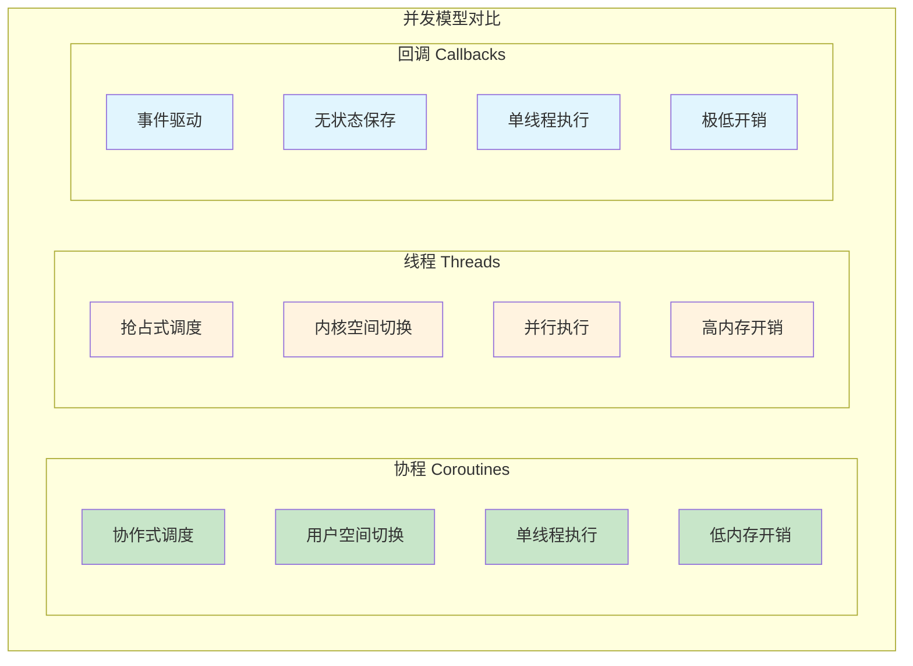
```mermaid
graph TD
    subgraph "并发模型对比"
        subgraph "协程 Coroutines"
            C1[协作式调度]
            C2[用户空间切换]
            C3[单线程执行]
            C4[低内存开销]
        end
        
        subgraph "线程 Threads"
            T1[抢占式调度]
            T2[内核空间切换]
            T3[并行执行]
            T4[高内存开销]
        end
        
        subgraph "回调 Callbacks"
            CB1[事件驱动]
            CB2[无状态保存]
            CB3[单线程执行]
            CB4[极低开销]
        end
    end
    
    classDef coroutine fill:#c8e6c9
    classDef thread fill:#fff3e0
    classDef callback fill:#e1f5fe
    
    class C1,C2,C3,C4 coroutine
    class T1,T2,T3,T4 thread
    class CB1,CB2,CB3,CB4 callback
```

**性能数据对比**：

| 特性 | 协程 | 线程 | 异步回调 |
|------|------|------|----------|
| 创建开销 | ~100ns | ~100μs | ~10ns |
| 切换开销 | ~10ns | ~1μs | ~5ns |
| 内存占用 | ~2KB | ~1MB | ~100B |
| 并发数量 | 100万+ | 1000+ | 1000万+ |
| 调试难度 | 中等 | 困难 | 非常困难 |
| 代码可读性 | 高 | 中等 | 低 |

---

## 🎨 协程设计模式

### 🏭 生产者-消费者模式

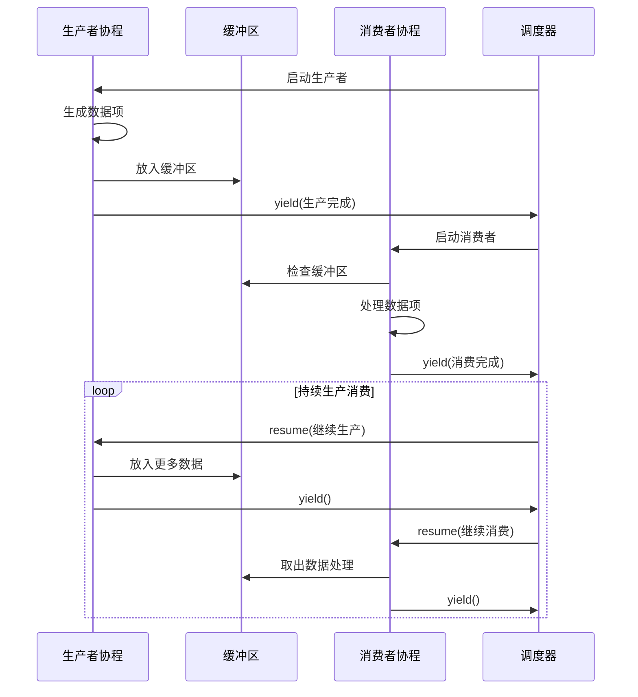
```mermaid
sequenceDiagram
    participant P as 生产者协程
    participant B as 缓冲区
    participant C as 消费者协程
    participant S as 调度器

    S->>P: 启动生产者
    P->>P: 生成数据项
    P->>B: 放入缓冲区
    P->>S: yield(生产完成)
    
    S->>C: 启动消费者  
    C->>B: 检查缓冲区
    C->>C: 处理数据项
    C->>S: yield(消费完成)
    
    loop 持续生产消费
        S->>P: resume(继续生产)
        P->>B: 放入更多数据
        P->>S: yield()
        S->>C: resume(继续消费)
        C->>B: 取出数据处理
        C->>S: yield()
    end
```

**实现代码**：

```lua
-- 高级生产者-消费者模式实现
local ProducerConsumerSystem = {}

function ProducerConsumerSystem.create(buffer_size)
  local system = {
    buffer = {},
    max_size = buffer_size or 10,
    producers = {},
    consumers = {},
    running = false,
    stats = {
      produced = 0,
      consumed = 0,
      buffer_overflows = 0,
      buffer_underflows = 0
    }
  }
  
  -- 创建生产者
  function system:add_producer(name, producer_func)
    local producer = coroutine.create(function()
      while self.running do
        -- 检查缓冲区是否满了
        while #self.buffer >= self.max_size do
          self.stats.buffer_overflows = self.stats.buffer_overflows + 1
          coroutine.yield("buffer_full")
        end
        
        -- 生产数据
        local item = producer_func()
        if item ~= nil then
          table.insert(self.buffer, {
            data = item,
            produced_at = os.clock(),
            producer = name
          })
          self.stats.produced = self.stats.produced + 1
          coroutine.yield("produced")
        else
          coroutine.yield("no_data")
        end
      end
    end)
    
    self.producers[name] = producer
  end
  
  -- 创建消费者
  function system:add_consumer(name, consumer_func)
    local consumer = coroutine.create(function()
      while self.running do
        -- 检查缓冲区是否空了
        while #self.buffer == 0 do
          self.stats.buffer_underflows = self.stats.buffer_underflows + 1
          coroutine.yield("buffer_empty")
        end
        
        -- 消费数据
        local item = table.remove(self.buffer, 1)
        if item then
          item.consumed_at = os.clock()
          item.processing_time = item.consumed_at - item.produced_at
          
          consumer_func(item.data, item)
          self.stats.consumed = self.stats.consumed + 1
          coroutine.yield("consumed")
        end
      end
    end)
    
    self.consumers[name] = consumer
  end
  
  -- 运行系统
  function system:run(max_iterations)
    self.running = true
    local iterations = 0
    
    while self.running and (not max_iterations or iterations < max_iterations) do
      -- 轮询生产者
      for name, producer in pairs(self.producers) do
        if coroutine.status(producer) ~= "dead" then
          local ok, result = coroutine.resume(producer)
          if not ok then
            print("生产者错误 " .. name .. ": " .. result)
          end
        end
      end
      
      -- 轮询消费者
      for name, consumer in pairs(self.consumers) do
        if coroutine.status(consumer) ~= "dead" then
          local ok, result = coroutine.resume(consumer)
          if not ok then
            print("消费者错误 " .. name .. ": " .. result)
          end
        end
      end
      
      iterations = iterations + 1
      
      -- 检查是否所有协程都已完成
      local all_dead = true
      for _, co in pairs(self.producers) do
        if coroutine.status(co) ~= "dead" then all_dead = false; break end
      end
      for _, co in pairs(self.consumers) do
        if coroutine.status(co) ~= "dead" then all_dead = false; break end
      end
      
      if all_dead then break end
    end
    
    self.running = false
  end
  
  -- 获取统计信息
  function system:get_stats()
    return {
      buffer_size = #self.buffer,
      produced = self.stats.produced,
      consumed = self.stats.consumed,
      buffer_overflows = self.stats.buffer_overflows,
      buffer_underflows = self.stats.buffer_underflows,
      efficiency = self.stats.consumed / math.max(self.stats.produced, 1)
    }
  end
  
  return system
end

-- 使用示例
local system = ProducerConsumerSystem.create(5)

-- 添加生产者
system:add_producer("DataGenerator", function()
  math.randomseed(os.time())
  return "data_" .. math.random(1000)
end)

-- 添加消费者
system:add_consumer("DataProcessor", function(data, metadata)
  print(string.format("处理: %s (延迟: %.4fs)", 
    data, metadata.processing_time))
end)

system:run(100)
print("系统统计:", table.concat(system:get_stats(), ", "))
```

### 🌐 异步任务调度器模式

```lua
-- 高级异步任务调度器
local AsyncScheduler = {}

function AsyncScheduler.create()
  local scheduler = {
    tasks = {},
    timers = {},
    current_time = 0,
    running = false,
    task_id = 0
  }
  
  -- 添加任务
  function scheduler:add_task(func, priority, dependencies)
    self.task_id = self.task_id + 1
    
    local task = {
      id = self.task_id,
      coroutine = coroutine.create(func),
      priority = priority or 0,
      dependencies = dependencies or {},
      status = "ready",
      created_at = self.current_time,
      last_run = 0,
      run_count = 0
    }
    
    table.insert(self.tasks, task)
    
    -- 按优先级排序
    table.sort(self.tasks, function(a, b)
      return a.priority > b.priority
    end)
    
    return task.id
  end
  
  -- 添加定时器任务
  function scheduler:add_timer(delay, func, repeat_count)
    local timer_id = "timer_" .. (self.task_id + 1)
    
    self.timers[timer_id] = {
      delay = delay,
      func = func,
      repeat_count = repeat_count or 1,
      current_count = 0,
      next_run = self.current_time + delay,
      active = true
    }
    
    return timer_id
  end
  
  -- 等待指定时间
  function scheduler:sleep(duration)
    local wake_time = self.current_time + duration
    
    while self.current_time < wake_time do
      coroutine.yield("sleeping")
    end
  end
  
  -- 等待其他任务完成
  function scheduler:wait_for(task_id)
    local task = self:find_task(task_id)
    
    while task and task.status ~= "completed" and task.status ~= "failed" do
      coroutine.yield("waiting")
      task = self:find_task(task_id)
    end
    
    return task and task.status or "not_found"
  end
  
  -- 查找任务
  function scheduler:find_task(task_id)
    for _, task in ipairs(self.tasks) do
      if task.id == task_id then
        return task
      end
    end
    return nil
  end
  
  -- 检查任务依赖
  function scheduler:check_dependencies(task)
    for _, dep_id in ipairs(task.dependencies) do
      local dep_task = self:find_task(dep_id)
      if not dep_task or dep_task.status ~= "completed" then
        return false
      end
    end
    return true
  end
  
  -- 运行调度器
  function scheduler:run(max_time)
    self.running = true
    local start_time = os.clock()
    
    while self.running do
      local executed_tasks = 0
      
      -- 处理定时器
      for timer_id, timer in pairs(self.timers) do
        if timer.active and self.current_time >= timer.next_run then
          timer.func()
          timer.current_count = timer.current_count + 1
          
          if timer.repeat_count > 0 and timer.current_count >= timer.repeat_count then
            timer.active = false
          else
            timer.next_run = timer.next_run + timer.delay
          end
        end
      end
      
      -- 执行就绪任务
      for i = #self.tasks, 1, -1 do
        local task = self.tasks[i]
        
        if task.status == "ready" and self:check_dependencies(task) then
          task.status = "running"
          task.last_run = self.current_time
          task.run_count = task.run_count + 1
          
          local ok, result = coroutine.resume(task.coroutine)
          
          if not ok then
            task.status = "failed"
            task.error = result
          elseif coroutine.status(task.coroutine) == "dead" then
            task.status = "completed"
            task.result = result
            table.remove(self.tasks, i)
          else
            task.status = "suspended"
            if result == "sleeping" or result == "waiting" then
              -- 任务主动让出，可以继续
            end
          end
          
          executed_tasks = executed_tasks + 1
        elseif task.status == "suspended" then
          -- 尝试恢复挂起的任务
          if self:check_dependencies(task) then
            task.status = "running"
            local ok, result = coroutine.resume(task.coroutine)
            
            if not ok then
              task.status = "failed"
              task.error = result
            elseif coroutine.status(task.coroutine) == "dead" then
              task.status = "completed"
              task.result = result
              table.remove(self.tasks, i)
            else
              task.status = "suspended"
            end
            
            executed_tasks = executed_tasks + 1
          end
        end
      end
      
      self.current_time = self.current_time + 1
      
      -- 检查退出条件
      if #self.tasks == 0 then
        break
      end
      
      if max_time and (os.clock() - start_time) > max_time then
        break
      end
      
      if executed_tasks == 0 then
        -- 没有任务执行，避免死循环
        break
      end
    end
    
    self.running = false
  end
  
  return scheduler
end
```

### 🔄 协程状态机模式

```lua
-- 协程状态机实现
local CoroutineStateMachine = {}

function CoroutineStateMachine.create(initial_state, states)
  local sm = {
    current_state = initial_state,
    states = states,
    history = {},
    data = {},
    running = false
  }
  
  function sm:transition_to(new_state, ...)
    local old_state = self.current_state
    
    -- 记录状态变化
    table.insert(self.history, {
      from = old_state,
      to = new_state,
      time = os.clock(),
      args = {...}
    })
    
    -- 执行退出动作
    if self.states[old_state] and self.states[old_state].on_exit then
      self.states[old_state].on_exit(self, ...)
    end
    
    self.current_state = new_state
    
    -- 执行进入动作
    if self.states[new_state] and self.states[new_state].on_enter then
      self.states[new_state].on_enter(self, ...)
    end
  end
  
  function sm:run()
    self.running = true
    
    local co = coroutine.create(function()
      while self.running do
        local state_def = self.states[self.current_state]
        
        if state_def and state_def.action then
          state_def.action(self)
        end
        
        coroutine.yield()
      end
    end)
    
    while self.running and coroutine.status(co) ~= "dead" do
      local ok, result = coroutine.resume(co)
      if not ok then
        print("状态机错误:", result)
        break
      end
    end
  end
  
  return sm
end

-- 使用示例：简单的游戏AI状态机
local ai_states = {
  idle = {
    on_enter = function(sm)
      print("AI进入空闲状态")
      sm.data.idle_start = os.clock()
    end,
    action = function(sm)
      -- 空闲一段时间后开始巡逻
      if os.clock() - sm.data.idle_start > 2 then
        sm:transition_to("patrol")
      end
    end
  },
  
  patrol = {
    on_enter = function(sm)
      print("AI开始巡逻")
      sm.data.patrol_points = {"A", "B", "C"}
      sm.data.current_point = 1
    end,
    action = function(sm)
      local point = sm.data.patrol_points[sm.data.current_point]
      print("巡逻到点 " .. point)
      
      sm.data.current_point = sm.data.current_point + 1
      if sm.data.current_point > #sm.data.patrol_points then
        sm:transition_to("idle")
      end
    end
  }
}

local ai = CoroutineStateMachine.create("idle", ai_states)
ai:run()
```

---

## 📋 最佳实践指南

### ✅ 协程使用最佳实践

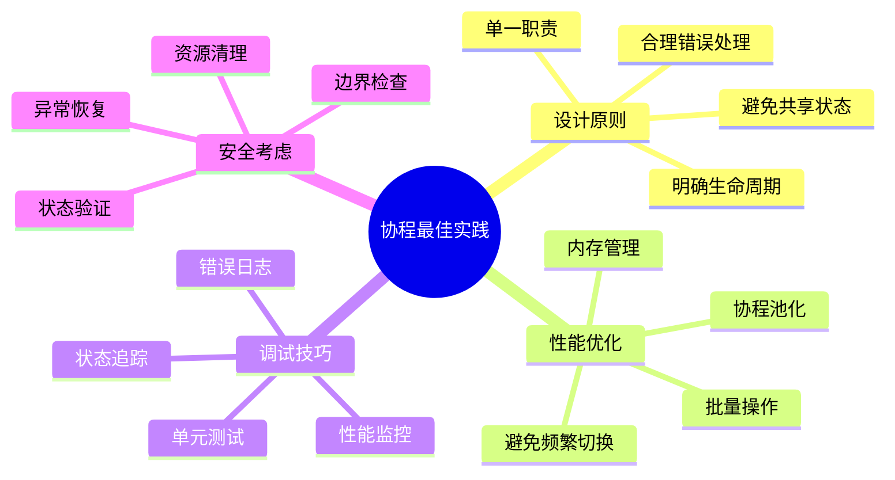
```mermaid
mindmap
  root((协程最佳实践))
    设计原则
      单一职责
      避免共享状态  
      明确生命周期
      合理错误处理
    性能优化
      协程池化
      批量操作
      避免频繁切换
      内存管理
    调试技巧
      状态追踪
      错误日志
      性能监控  
      单元测试
    安全考虑
      资源清理
      异常恢复
      状态验证
      边界检查
```

### 🛡️ 协程安全编程模式

```lua
-- 安全的协程封装器
local SafeCoroutine = {}

function SafeCoroutine.create(func, options)
  options = options or {}
  
  local safe_co = {
    original_func = func,
    timeout = options.timeout,
    max_yields = options.max_yields or 10000,
    created_at = os.clock(),
    yield_count = 0,
    status = "created",
    errors = {}
  }
  
  -- 创建带安全检查的协程
  safe_co.coroutine = coroutine.create(function(...)
    safe_co.status = "running"
    
    -- 设置超时检查
    local start_time = os.clock()
    
    -- 包装原函数
    local function safe_func(...)
      local ok, result = pcall(func, ...)
      
      if not ok then
        table.insert(safe_co.errors, {
          time = os.clock(),
          error = result,
          traceback = debug.traceback()
        })
        safe_co.status = "error"
        return nil, result
      end
      
      return result
    end
    
    -- 执行函数
    local result = safe_func(...)
    safe_co.status = "completed"
    return result
  end)
  
  -- 安全的resume函数
  function safe_co:resume(...)
    if self.status == "error" or self.status == "completed" then
      return false, "协程已结束"
    end
    
    -- 检查超时
    if self.timeout and (os.clock() - self.created_at) > self.timeout then
      self.status = "timeout"
      return false, "协程超时"
    end
    
    -- 检查yield次数
    if self.yield_count >= self.max_yields then
      self.status = "max_yields_exceeded"
      return false, "yield次数超限"
    end
    
    local ok, result = coroutine.resume(self.coroutine, ...)
    
    if not ok then
      self.status = "error"
      table.insert(self.errors, {
        time = os.clock(),
        error = result
      })
      return false, result
    end
    
    if coroutine.status(self.coroutine) == "suspended" then
      self.yield_count = self.yield_count + 1
      self.status = "suspended"
    elseif coroutine.status(self.coroutine) == "dead" then
      self.status = "completed"
    end
    
    return true, result
  end
  
  function safe_co:get_info()
    return {
      status = self.status,
      yield_count = self.yield_count,
      running_time = os.clock() - self.created_at,
      error_count = #self.errors,
      last_error = self.errors[#self.errors]
    }
  end
  
  return safe_co
end

-- 资源管理模式
local ResourceManager = {}

function ResourceManager.with_resource(resource_factory, work_func, cleanup_func)
  return coroutine.create(function(...)
    local resource = nil
    local success = false
    
    -- 获取资源
    local ok, result = pcall(resource_factory)
    if not ok then
      error("资源创建失败: " .. result)
    end
    resource = result
    
    -- 确保资源被清理
    local function ensure_cleanup()
      if resource and cleanup_func then
        pcall(cleanup_func, resource)
      end
    end
    
    -- 执行工作函数
    ok, result = pcall(work_func, resource, ...)
    if ok then
      success = true
    end
    
    -- 清理资源
    ensure_cleanup()
    
    if not success then
      error(result)
    end
    
    return result
  end)
end

-- 使用示例
local safe_co = SafeCoroutine.create(function()
  for i = 1, 5 do
    print("安全协程执行第 " .. i .. " 步")
    coroutine.yield()
  end
  return "安全完成"
end, {
  timeout = 10,
  max_yields = 10
})

while safe_co.status ~= "completed" and safe_co.status ~= "error" do
  local ok, result = safe_co:resume()
  if not ok then
    print("协程错误:", result)
    break
  end
  print("协程状态:", safe_co:get_info().status)
end
```

### 📊 协程监控和调试

```lua
-- 协程监控系统
local CoroutineMonitor = {}

function CoroutineMonitor.create()
  local monitor = {
    tracked_coroutines = {},
    stats = {
      total_created = 0,
      total_completed = 0,
      total_failed = 0,
      average_lifetime = 0
    }
  }
  
  function monitor:track(co, name, metadata)
    self.tracked_coroutines[co] = {
      name = name or tostring(co),
      metadata = metadata or {},
      created_at = os.clock(),
      status_history = {},
      yield_count = 0,
      resume_count = 0
    }
    
    self.stats.total_created = self.stats.total_created + 1
  end
  
  function monitor:update_status(co, status, additional_info)
    local info = self.tracked_coroutines[co]
    if not info then return end
    
    table.insert(info.status_history, {
      status = status,
      time = os.clock(),
      info = additional_info
    })
    
    if status == "yield" then
      info.yield_count = info.yield_count + 1
    elseif status == "resume" then
      info.resume_count = info.resume_count + 1
    elseif status == "completed" then
      self.stats.total_completed = self.stats.total_completed + 1
      info.completed_at = os.clock()
      info.lifetime = info.completed_at - info.created_at
      self:update_average_lifetime()
    elseif status == "failed" then
      self.stats.total_failed = self.stats.total_failed + 1
    end
  end
  
  function monitor:update_average_lifetime()
    local total_lifetime = 0
    local completed_count = 0
    
    for co, info in pairs(self.tracked_coroutines) do
      if info.lifetime then
        total_lifetime = total_lifetime + info.lifetime
        completed_count = completed_count + 1
      end
    end
    
    if completed_count > 0 then
      self.stats.average_lifetime = total_lifetime / completed_count
    end
  end
  
  function monitor:generate_report()
    print("=== 协程监控报告 ===")
    print(string.format("总创建数: %d", self.stats.total_created))
    print(string.format("已完成: %d", self.stats.total_completed))
    print(string.format("失败数: %d", self.stats.total_failed))
    print(string.format("平均生命周期: %.4f 秒", self.stats.average_lifetime))
    
    print("\n活跃协程:")
    for co, info in pairs(self.tracked_coroutines) do
      if not info.completed_at then
        print(string.format("  %s: %d yields, %d resumes, 运行 %.4f 秒",
          info.name, info.yield_count, info.resume_count,
          os.clock() - info.created_at))
      end
    end
  end
  
  return monitor
end
```

### 🎯 协程测试框架

```lua
-- 协程单元测试框架
local CoroutineTest = {}

function CoroutineTest.suite(name)
  local suite = {
    name = name,
    tests = {},
    results = {},
    setup = nil,
    teardown = nil
  }
  
  function suite:add_test(test_name, test_func)
    table.insert(self.tests, {
      name = test_name,
      func = test_func
    })
  end
  
  function suite:run()
    print("运行测试套件: " .. self.name)
    
    for _, test in ipairs(self.tests) do
      local result = self:run_single_test(test)
      table.insert(self.results, result)
      
      if result.passed then
        print("  ✓ " .. test.name)
      else
        print("  ✗ " .. test.name .. ": " .. result.error)
      end
    end
    
    self:print_summary()
  end
  
  function suite:run_single_test(test)
    local result = {
      name = test.name,
      passed = false,
      error = nil,
      start_time = os.clock()
    }
    
    -- 执行setup
    if self.setup then
      local ok, err = pcall(self.setup)
      if not ok then
        result.error = "Setup失败: " .. err
        return result
      end
    end
    
    -- 执行测试
    local ok, err = pcall(test.func)
    if ok then
      result.passed = true
    else
      result.error = err
    end
    
    -- 执行teardown
    if self.teardown then
      pcall(self.teardown)
    end
    
    result.duration = os.clock() - result.start_time
    return result
  end
  
  function suite:print_summary()
    local passed = 0
    local failed = 0
    local total_time = 0
    
    for _, result in ipairs(self.results) do
      if result.passed then
        passed = passed + 1
      else
        failed = failed + 1
      end
      total_time = total_time + result.duration
    end
    
    print(string.format("\n测试结果: %d 通过, %d 失败, 耗时 %.4f 秒",
      passed, failed, total_time))
  end
  
  return suite
end

-- 协程断言库
local CoroutineAssert = {}

function CoroutineAssert.assert_coroutine_status(co, expected_status)
  local actual = coroutine.status(co)
  if actual ~= expected_status then
    error(string.format("协程状态断言失败: 期望 %s, 实际 %s", expected_status, actual))
  end
end

function CoroutineAssert.assert_yield_value(co, expected_value)
  local ok, actual = coroutine.resume(co)
  if not ok then
    error("协程resume失败: " .. actual)
  end
  
  if actual ~= expected_value then
    error(string.format("yield值断言失败: 期望 %s, 实际 %s", 
      tostring(expected_value), tostring(actual)))
  end
end

-- 测试示例
local test_suite = CoroutineTest.suite("协程基础测试")

test_suite:add_test("协程创建和状态", function()
  local co = coroutine.create(function()
    return "hello"
  end)
  
  CoroutineAssert.assert_coroutine_status(co, "suspended")
  
  local ok, result = coroutine.resume(co)
  assert(ok, "协程应该成功执行")
  assert(result == "hello", "返回值应该正确")
  
  CoroutineAssert.assert_coroutine_status(co, "dead")
end)

test_suite:add_test("协程yield和resume", function()
  local co = coroutine.create(function()
    coroutine.yield("first")
    coroutine.yield("second")
    return "final"
  end)
  
  CoroutineAssert.assert_yield_value(co, "first")
  CoroutineAssert.assert_yield_value(co, "second")
  
  local ok, result = coroutine.resume(co)
  assert(ok and result == "final", "最终返回值应该正确")
end)

-- test_suite:run()
```

---

## 📚 相关源文件

### 🔧 核心实现文件
- **`lcorolib.c`** - 协程库实现和API接口
- **`ldo.c/ldo.h`** - 执行控制和yield/resume核心机制  
- **`lstate.c/lstate.h`** - 线程状态管理和协程创建

### 🏗️ 支撑系统文件
- **`lvm.c`** - 虚拟机中的协程支持和指令处理
- **`lgc.c`** - 协程的垃圾回收和内存管理
- **`lapi.c`** - 协程相关的C API实现

### 🔗 相关组件文件
- **`ltable.c`** - 协程间的数据共享机制
- **`lstring.c`** - 字符串在协程间的共享优化
- **`ldebug.c`** - 协程的调试支持和错误处理

---

## 🎯 面试重点总结

### 核心技术要点
1. **协程状态管理** - 独立栈空间与共享全局状态的设计
2. **yield/resume机制** - 原子性状态保存和恢复的实现
3. **C函数集成** - 延续函数机制处理C调用边界
4. **内存安全** - GC期间的协程保护和引用管理

### 性能优化重点
1. **轻量级特性** - 相比线程的内存和性能优势
2. **批量处理** - 减少频繁yield/resume的开销
3. **协程池化** - 重用协程对象避免创建开销
4. **智能调度** - 基于优先级和依赖的任务调度

### 实际应用价值
1. **异步编程** - 简化复杂的异步操作逻辑
2. **生成器模式** - 高效的流式数据处理
3. **状态机实现** - 清晰的业务逻辑状态管理
4. **游戏开发** - NPC行为和事件处理系统

理解这些核心概念和实现细节，有助于在Lua开发中充分发挥协程的威力，构建高效、可维护的并发程序。

---
