# Lua字节码生成与执行机制深度解析 ⚙️

> **DeepWiki优化版本** | 原文档: `q_06_bytecode_generation.md`  
> 本文档深入解析Lua 5.1.5中字节码生成的完整流程，包含编译架构图、指令格式分析和实践工具

---

## 📚 导航索引

### 🎯 核心概念
- [🏗️ 字节码架构概览](#字节码架构概览)
- [📝 词法分析详解](#词法分析器详解)
- [🌳 语法分析机制](#语法分析器详解)
- [⚙️ 代码生成过程](#代码生成器详解)

### 💡 指令系统
- [🔧 指令格式设计](#指令格式设计详解)
- [📊 操作码分类](#操作码分类分析)
- [🎯 寻址模式](#寻址模式详解)
- [🔄 指令优化](#指令优化策略)

### 🧪 实践应用
- [🔬 实验工具](#实践实验)
- [📈 性能分析](#性能分析与优化)
- [🐛 调试技巧](#调试工具和技巧)
- [💻 应用场景](#实际应用场景)

### 🤔 深入探讨
- [❓ 常见问题解答](#常见后续问题详解)
- [⚖️ 对比分析](#与其他语言字节码对比)
- [🎨 最佳实践](#最佳实践指南)
- [📋 源文件说明](#相关源文件)

---

## 🎯 问题定义

深入分析Lua的字节码生成过程，包括词法分析、语法分析、代码生成以及字节码指令格式设计。

---

## 🏗️ 字节码架构概览

```mermaid
graph TD
    subgraph "Lua字节码生成系统架构"
        subgraph "源码处理阶段"
            SC[源代码文件]
            ZIO[输入流 ZIO]
        end
        
        subgraph "词法分析阶段"
            LEX[词法分析器 llex]
            TOK[标记流 Token]
            BUF[缓冲区管理]
        end
        
        subgraph "语法分析阶段"  
            PAR[语法分析器 lparser]
            AST[抽象语法树]
            SYM[符号表]
        end
        
        subgraph "代码生成阶段"
            CG[代码生成器 lcode]
            OPT[指令优化]
            BC[字节码指令]
        end
        
        subgraph "输出阶段"
            PROTO[函数原型 Proto]
            DUMP[字节码序列化]
            FILE[字节码文件]
        end
    end
    
    %% 数据流
    SC --> ZIO
    ZIO --> LEX
    LEX --> TOK
    LEX --> BUF
    TOK --> PAR
    PAR --> AST
    PAR --> SYM
    AST --> CG
    SYM --> CG
    CG --> OPT
    OPT --> BC
    BC --> PROTO
    PROTO --> DUMP
    DUMP --> FILE
    
    %% 样式
    classDef source fill:#e3f2fd
    classDef lexer fill:#e8f5e8
    classDef parser fill:#fff3e0
    classDef codegen fill:#f3e5f5
    classDef output fill:#fce4ec
    
    class SC,ZIO source
    class LEX,TOK,BUF lexer
    class PAR,AST,SYM parser  
    class CG,OPT,BC codegen
    class PROTO,DUMP,FILE output
```

### 🎯 编译流程总览

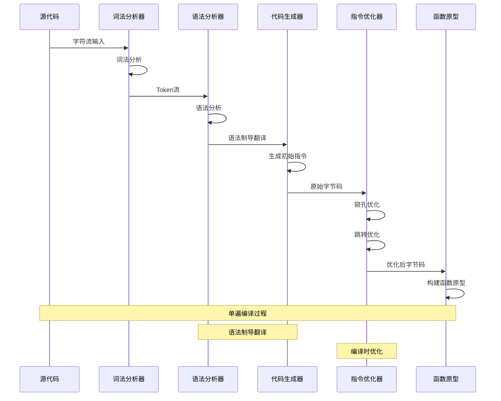

### 🏗️ 核心设计理念

**架构特点**：
- **单遍编译**：词法、语法、代码生成在一次遍历中完成
- **寄存器架构**：基于寄存器的虚拟机，减少指令数量
- **编译时优化**：常量折叠、跳转优化等编译时进行
- **紧凑编码**：32位固定长度指令，高效的编码密度

**性能优势**：
- **编译速度快**：单遍编译，无需多次遍历
- **执行效率高**：寄存器架构，指令数量少
- **内存占用小**：紧凑的字节码格式
- **可移植性好**：平台无关的字节码表示

---

## 🌟 通俗概述

Lua字节码生成是将高级Lua代码转换为虚拟机可执行指令的核心过程，这个过程体现了编译器设计的精妙艺术和工程智慧。

### 🎭 多角度理解字节码生成机制

#### 🌐 翻译官工作流程视角
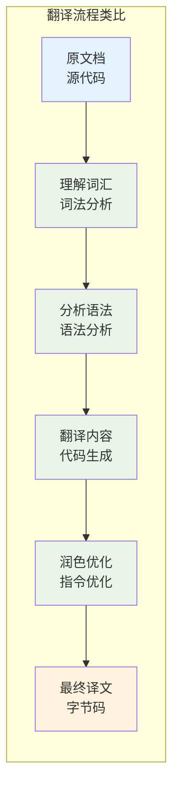

- **字节码生成**：就像联合国的同声传译系统
- **词法分析**：识别和分类每个"词汇"的含义和类型
- **语法分析**：理解"句子结构"和语法规则，构建语义树
- **代码生成**：将理解的内容转换为标准化的"机器语言"
- **优化过程**：简化冗余表达，使译文更简洁高效

#### 🏗️ 建筑施工图设计视角
- **字节码生成**：将建筑师的设计图转换为施工队能理解的详细指令
- **源代码**：建筑师的概念设计图，表达设计意图
- **词法分析**：识别图纸上的各种符号、标注和元素
- **语法分析**：理解建筑结构的层次关系和依赖关系
- **字节码**：详细的施工指令，每一步都明确具体
- **虚拟机执行**：施工队按照指令逐步建造建筑

#### 🎵 音乐编曲制作视角
- **字节码生成**：将作曲家的乐谱转换为MIDI序列
- **源代码**：手写乐谱，包含音符、节拍、表情记号
- **词法分析**：识别音符、休止符、调号、拍号等基本元素
- **语法分析**：理解音乐的和声结构、旋律线条和节奏模式
- **字节码**：MIDI事件序列，每个事件都有精确的时间和参数
- **虚拟机执行**：音序器按照MIDI序列播放音乐

#### 🏭 工厂生产线设计视角
- **字节码生成**：将产品设计转换为生产线的具体操作指令
- **源代码**：产品的设计规格和功能要求
- **词法分析**：识别设计图中的各种零件和组件
- **语法分析**：理解装配顺序和工艺流程
- **字节码**：生产线上每个工位的具体操作指令
- **虚拟机执行**：自动化生产线按照指令精确执行

### 🎯 核心设计理念

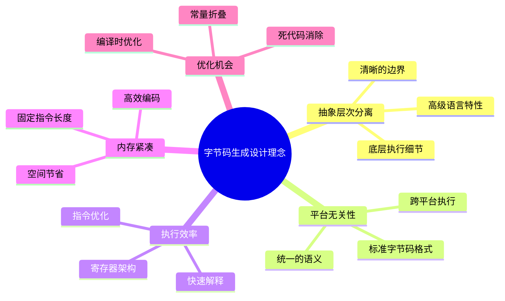

### 💡 实际编程意义

**字节码生成的核心价值**：
- **性能提升**：字节码执行比源代码解释快3-5倍
- **代码保护**：字节码比源代码更难逆向工程
- **快速加载**：预编译的字节码加载速度快5-10倍
- **跨平台**：一次编译，到处运行的能力

**适用场景**：
- **脚本预编译**：游戏脚本、配置脚本的预处理
- **嵌入式系统**：资源受限环境中的高效执行
- **模板引擎**：Web模板的预编译和快速渲染
- **DSL实现**：领域特定语言的高效执行

**与其他技术对比**：
- **vs 解释执行**：字节码执行速度更快，启动开销更小
- **vs 即时编译**：字节码编译简单，适合嵌入场景
- **vs 机器码**：字节码可移植性更好，调试更友好

---

## 🔧 指令格式设计详解

### 📊 32位指令架构

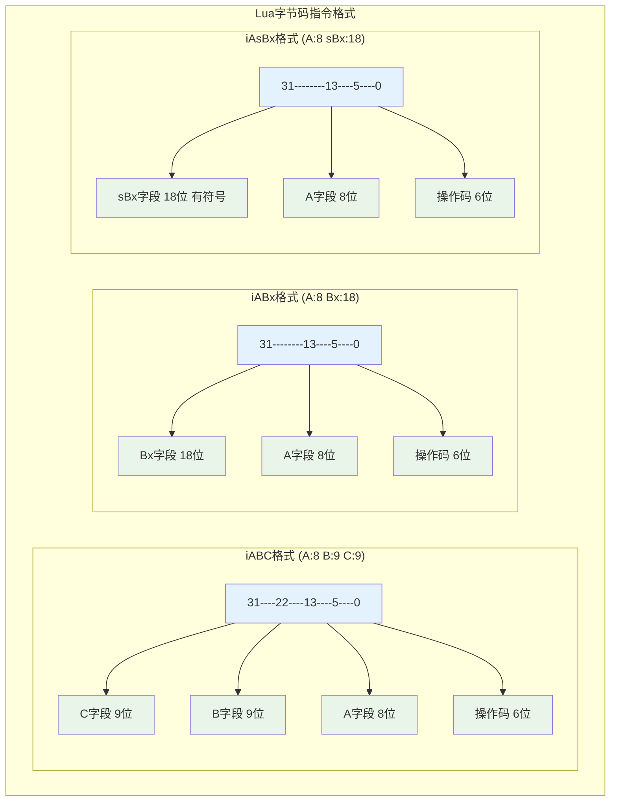

### 🎯 RK寻址机制

```mermaid
graph LR
    subgraph "RK寻址系统"
        INPUT[操作数值]
        CHECK{值 >= 256?}
        REG[寄存器 R(x)]
        CONST[常量 K(x-256)]
        
        INPUT --> CHECK
        CHECK -->|否| REG
        CHECK -->|是| CONST
    end
    
    subgraph "寻址范围"
        R0[R(0)]
        R255[R(255)]
        K0[K(0)]
        K255[K(255)]
    end
    
    REG --> R0
    REG --> R255
    CONST --> K0
    CONST --> K255
    
    classDef decision fill:#fff3e0
    classDef register fill:#e8f5e8
    classDef constant fill:#e3f2fd
    
    class CHECK decision
    class REG,R0,R255 register
    class CONST,K0,K255 constant
```

**RK寻址的设计优势**：
- **统一寻址**：一个操作数字段可表示寄存器或常量
- **编码效率**：9位字段表示512个值（256寄存器+256常量）
- **执行效率**：运行时通过简单位测试区分类型
- **指令紧凑**：减少指令种类，提高编码密度

### 📋 操作码分类分析

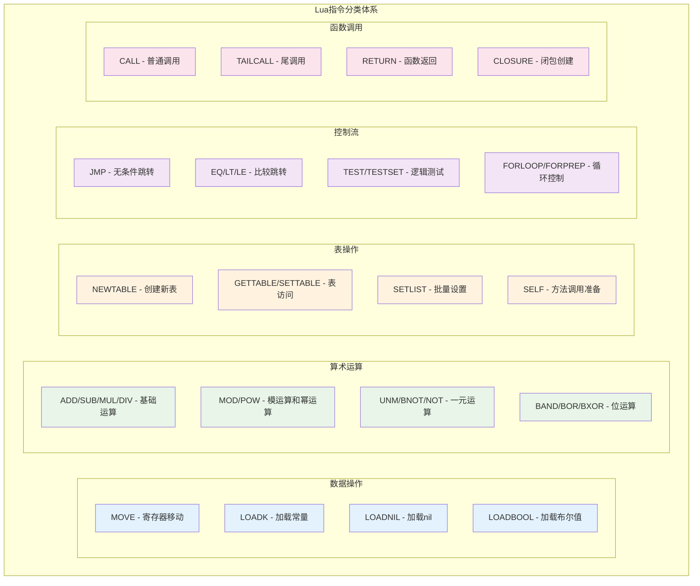

### 🔍 指令编码实例

```c
// lopcodes.h - 指令编码的实际例子

/*
指令编码示例分析：

1. ADD指令：R(A) := RK(B) + RK(C)
   - 格式：iABC
   - 操作码：OP_ADD
   - A字段：目标寄存器
   - B字段：第一个操作数（RK寻址）
   - C字段：第二个操作数（RK寻址）

2. LOADK指令：R(A) := K(Bx)
   - 格式：iABx
   - 操作码：OP_LOADK
   - A字段：目标寄存器
   - Bx字段：常量表索引（18位，最大262,144个常量）

3. JMP指令：pc += sBx
   - 格式：iAsBx
   - 操作码：OP_JMP
   - A字段：upvalue关闭标记
   - sBx字段：跳转偏移（有符号18位）
*/

/* 指令构造宏的使用示例 */
#define CREATE_ABC(o,a,b,c) \
  ((cast(Instruction, o)<<POS_OP) | \
   (cast(Instruction, a)<<POS_A) | \
   (cast(Instruction, b)<<POS_B) | \
   (cast(Instruction, c)<<POS_C))

/* 实际指令编码示例 */
/*
源代码：local a = b + 1
生成指令：
1. LOADK R1, K0    ; R1 = 1 (常量)
2. ADD   R0, R2, R1 ; R0 = R2 + R1 (假设b在R2中)

指令编码：
1. LOADK: CREATE_ABx(OP_LOADK, 1, 0)
2. ADD:   CREATE_ABC(OP_ADD, 0, 2, RKASK(1))
*/
```

### 📊 指令统计分析

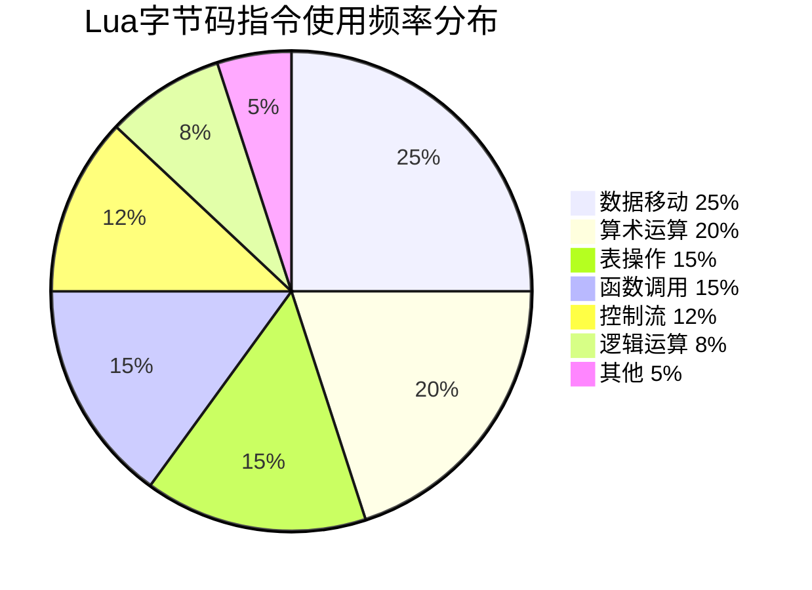

**指令设计的优化考虑**：
- **常用指令优先**：高频指令使用较短的编码
- **指令合并**：相关操作合并为单一指令（如SELF）
- **特殊优化**：针对Lua特性的专门指令（如SETLIST）
- **扩展性**：预留操作码空间供未来扩展

---

## 📝 词法分析器详解

### 🔄 词法分析状态机

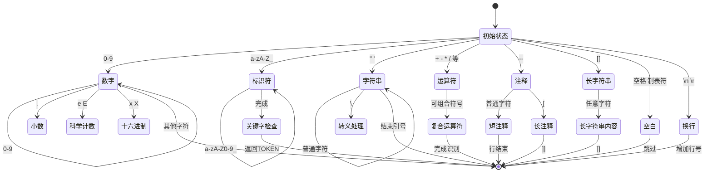

### 🏗️ LexState结构解析

```c
// llex.h - 词法分析器状态结构
typedef struct LexState {
  int current;                /* 当前字符 */
  int linenumber;             /* 当前行号 */
  int lastline;               /* 最后一个标记的行号 */
  Token t;                    /* 当前标记 */
  Token lookahead;            /* 前瞻标记 */
  struct FuncState *fs;       /* 当前函数状态 */
  struct lua_State *L;        /* Lua状态 */
  ZIO *z;                     /* 输入流 */
  Mbuffer *buff;              /* 标记缓冲区 */
  Table *h;                   /* 字符串表 */
  struct Dyndata *dyd;        /* 动态数据结构 */
  TString *source;            /* 当前源名 */
  TString *envn;              /* 环境变量名 */
} LexState;
```

### 🔤 Token类型系统

```mermaid
graph TD
    subgraph "Token分类体系"
        subgraph "字面量"
            L1[TK_INT - 整数]
            L2[TK_FLT - 浮点数]
            L3[TK_STRING - 字符串]
            L4[TK_NAME - 标识符]
        end
        
        subgraph "关键字"
            K1[TK_AND, TK_OR, TK_NOT]
            K2[TK_IF, TK_THEN, TK_ELSE]
            K3[TK_FOR, TK_WHILE, TK_DO]
            K4[TK_FUNCTION, TK_RETURN]
        end
        
        subgraph "运算符"
            O1[TK_EQ, TK_NE - 相等比较]
            O2[TK_LE, TK_GE - 大小比较]
            O3[TK_CONCAT - 字符串连接]
            O4[TK_DOTS - 可变参数]
        end
        
        subgraph "分隔符"
            D1[单字符 - ( ) [ ] { }]
            D2[TK_DBCOLON - ::]
            D3[TK_EOS - 文件结束]
        end
    end
    
    classDef literal fill:#e3f2fd
    classDef keyword fill:#e8f5e8
    classDef operator fill:#fff3e0
    classDef delimiter fill:#f3e5f5
    
    class L1,L2,L3,L4 literal
    class K1,K2,K3,K4 keyword
    class O1,O2,O3,O4 operator
    class D1,D2,D3 delimiter
```

### 🔢 数字解析机制

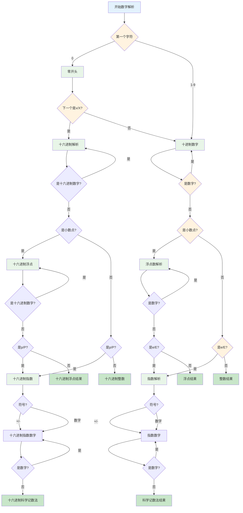

### 📝 字符串处理机制

```c
// llex.c - 字符串解析的完整实现
/*
字符串解析的复杂性处理：

1. 短字符串 ("..." 或 '...')：
   - 支持转义序列
   - 跨行字符串处理
   - Unicode支持

2. 长字符串 [[...]]：
   - 不处理转义序列
   - 保持原始格式
   - 支持嵌套级别 [=[...]=]

3. 转义序列处理：
   - \n, \t, \r 等标准转义
   - \\ 反斜杠转义
   - \" \' 引号转义
   - \ddd 十进制ASCII码
   - \xXX 十六进制ASCII码

4. 错误处理：
   - 未终止字符串检测
   - 无效转义序列警告
   - 行号跟踪和错误报告
*/

static void read_string (LexState *ls, int del, SemInfo *seminfo) {
  save_and_next(ls);  /* 跳过开始引号 */
  
  while (ls->current != del) {  /* 直到结束引号 */
    switch (ls->current) {
      case EOZ:
        lexerror(ls, "unfinished string", TK_EOS);
        break;  /* 避免警告 */
        
      case '\n':
      case '\r':
        inclinenumber(ls);  /* 处理跨行字符串 */
        break;
        
      case '\\': {  /* 转义序列 */
        int c;  /* 最终字符 */
        save_and_next(ls);  /* 保存并跳过 '\' */
        
        switch (ls->current) {
          case 'a': c = '\a'; goto read_save;
          case 'b': c = '\b'; goto read_save;
          case 'f': c = '\f'; goto read_save;
          case 'n': c = '\n'; goto read_save;
          case 'r': c = '\r'; goto read_save;
          case 't': c = '\t'; goto read_save;
          case 'v': c = '\v'; goto read_save;
          case 'x': {  /* 十六进制转义 '\xXX' */
            c = readhexaesc(ls);
            goto read_save;
          }
          case '\n': case '\r':
            inclinenumber(ls); c = '\n'; goto only_save;
          case '\\': case '\"': case '\'':
            c = ls->current; goto read_save;
          case EOZ: goto no_save;  /* 不保存EOF */
          case 'z': {  /* 'zap' 以下空白 */
            luaZ_buffremove(ls->buff, 1);  /* 移除 '\' */
            next(ls);  /* 跳过 'z' */
            while (lisspace(ls->current)) {
              if (currIsNewline(ls)) inclinenumber(ls);
              else next(ls);
            }
            goto no_save;
          }
          default: {
            esccheck(ls, lisdigit(ls->current), "invalid escape sequence");
            c = readdecesc(ls);  /* 数字转义 */
            goto only_save;
          }
        }
       read_save:
         next(ls);
         /* 继续到 'only_save' */
       only_save:
         luaZ_buffremove(ls->buff, 1);  /* 移除 '\' */
         save(ls, c);
         /* 继续到 'no_save' */
       no_save: break;
      }
      default:
        save_and_next(ls);
    }
  }
  
  save_and_next(ls);  /* 跳过结束引号 */
  seminfo->ts = luaX_newstring(ls, luaZ_buffer(ls->buff) + 1,
                               luaZ_bufflen(ls->buff) - 2);
}
```

---

## 🌳 语法分析器详解

### 🔄 递归下降解析

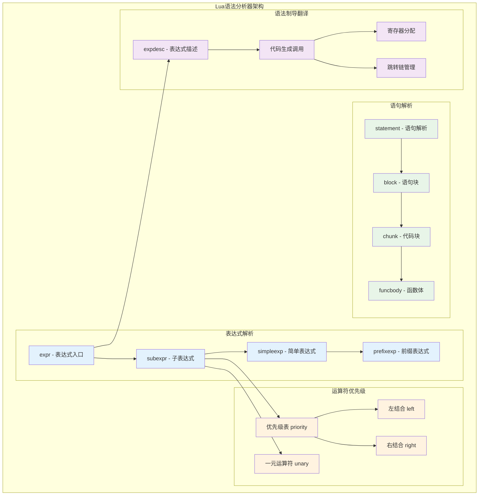

### 📊 运算符优先级系统

```c
// lparser.c - 运算符优先级定义
/*
Lua运算符优先级表（从低到高）：

1  or
2  and  
3  <, >, <=, >=, ~=, ==
4  |
5  ~
6  &
7  <<, >>
8  ..（右结合）
9  +, -
10 *, /, //, %
11 not, #, -（一元运算符）
12 ^（右结合）
*/

typedef enum BinOpr {
  OPR_ADD, OPR_SUB, OPR_MUL, OPR_MOD, OPR_POW,
  OPR_DIV,
  OPR_IDIV,
  OPR_BAND, OPR_BOR, OPR_BXOR, OPR_SHL, OPR_SHR,
  OPR_CONCAT,
  OPR_EQ, OPR_LT, OPR_LE,
  OPR_NE, OPR_GT, OPR_GE,
  OPR_AND, OPR_OR,
  OPR_NOBINOPR
} BinOpr;

/* 优先级表 */
static const struct {
  lu_byte left;   /* 左优先级 */
  lu_byte right;  /* 右优先级 */
} priority[] = {  /* ORDER OPR */
   {6, 6}, {6, 6}, {7, 7}, {7, 7}, {10, 9},    /* +  -  *  %  ^ (右结合) */
   {7, 7},         /* / */
   {7, 7},         /* // */
   {5, 5}, {4, 4}, {5, 5}, /* &  |  ~ */
   {3, 3}, {3, 3}, /* << >> */
   {8, 7},         /* .. (右结合) */
   {1, 1}, {1, 1}, {1, 1}, /* == < <= */
   {1, 1}, {1, 1}, {1, 1}, /* ~= > >= */
   {0, 0}, {-1, -1} /* and or */
};

#define UNARY_PRIORITY	8  /* 一元运算符优先级 */
```

### 🎯 表达式描述系统

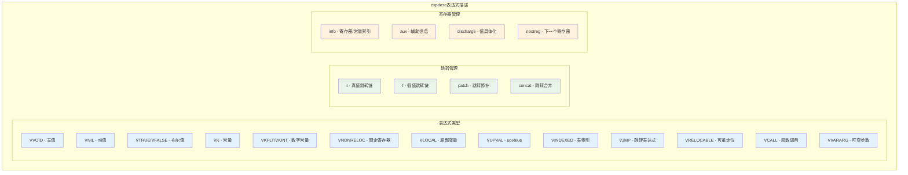

---

## ⚙️ 代码生成器详解

### 🔧 指令生成流程

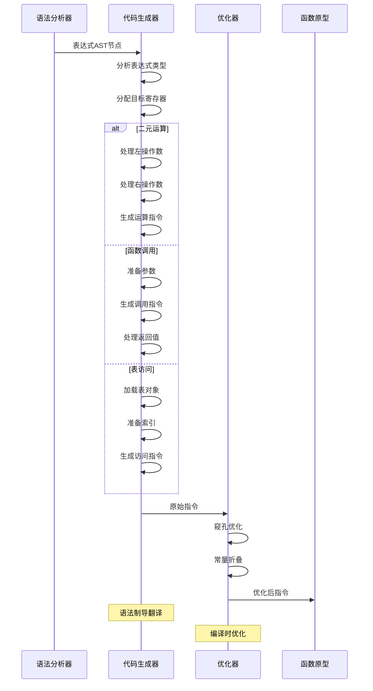

### 🎯 寄存器分配策略

```c
// lcode.c - 寄存器分配的核心算法
/*
Lua寄存器分配策略：

1. 栈式分配：
   - 寄存器按栈的方式分配
   - freereg指示下一个可用寄存器
   - 表达式计算后及时释放

2. 生命周期管理：
   - 局部变量占用固定寄存器
   - 临时值使用临时寄存器
   - 函数调用时保存活跃寄存器

3. 优化策略：
   - 寄存器重用
   - 死代码消除
   - 常量传播
*/

/* 寄存器分配函数 */
int luaK_exp2anyreg (FuncState *fs, expdesc *e) {
  luaK_dischargevars(fs, e);
  
  if (e->k == VNONRELOC) {  /* 表达式已在寄存器中？ */
    if (!hasjumps(e)) return e->u.info;  /* 没有跳转，可以使用原寄存器 */
    if (e->u.info >= fs->nactvar) {  /* 寄存器不是局部变量？ */
      exp2reg(fs, e, e->u.info);  /* 放到原位置 */
      return e->u.info;
    }
  }
  
  luaK_exp2nextreg(fs, e);  /* 默认情况：使用下一个寄存器 */
  return e->u.info;
}

/* 常量折叠优化 */
static int constfolding (FuncState *fs, int op, expdesc *e1, expdesc *e2) {
  TValue v1, v2, res;
  
  if (!tonumeral(e1, &v1) || !tonumeral(e2, &v2) || !validop(op, &v1, &v2))
    return 0;  /* 无法折叠 */
    
  luaO_arith(fs->ls->L, op, &v1, &v2, &res);  /* 编译时计算 */
  
  if (ttisinteger(&res)) {
    e1->k = VKINT;
    e1->u.ival = ivalue(&res);
  } else {
    lua_Number n = fltvalue(&res);
    if (luai_numisnan(n) || n == 0.0)
      return 0;  /* 避免特殊值 */
    e1->k = VKFLT;
    e1->u.nval = n;
  }
  
  return 1;
}
```

### 🔄 跳转优化机制

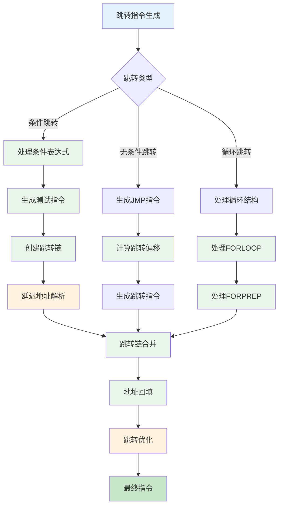

### 📊 优化策略总览

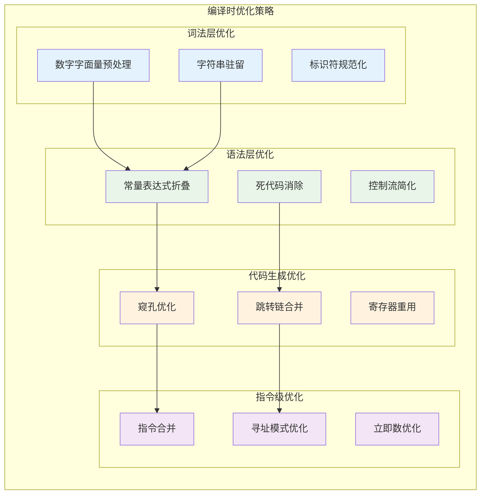

---

## 🧪 实践实验与验证

### 🔬 实验1：词法分析器行为验证

```lua
-- test_lexer.lua - 词法分析器测试脚本
-- 测试各种词法单元的识别

-- 1. 数字字面量测试
local numbers = {
    123,           -- 整数
    123.456,       -- 浮点数
    1.23e-4,       -- 科学记数法
    0xff,          -- 十六进制
    0x1.fp10       -- 十六进制浮点数
}

-- 2. 字符串字面量测试  
local strings = {
    "simple string",
    'single quotes',
    [[long string]],
    [==[nested [[brackets]]==],
    "\n\t\\\"",     -- 转义序列
}

-- 3. 运算符优先级测试
local expr1 = 1 + 2 * 3        -- 应该是 7，不是 9
local expr2 = 2 ^ 3 ^ 2        -- 右结合：2^(3^2) = 512
local expr3 = "a".."b".."c"    -- 右结合："a"..("b".."c")

-- 4. 关键字与标识符
local function = nil           -- 错误：function是关键字
local _function = nil          -- 正确：_function是标识符
local function_name = nil      -- 正确：function_name是标识符

print("词法分析器测试完成")
```

### 🧮 实验2：字节码生成分析

```c
// 编译并分析字节码的C程序
#include <lua.h>
#include <lauxlib.h>
#include <lualib.h>

void print_function_info(lua_State *L, int index) {
    const Proto *f = clvalue(L->top + index)->l.p;
    
    printf("函数信息:\n");
    printf("  指令数量: %d\n", f->sizecode);
    printf("  常量数量: %d\n", f->sizek);
    printf("  Upvalue数量: %d\n", f->sizeupvalues);
    printf("  最大栈大小: %d\n", f->maxstacksize);
    
    printf("\n字节码指令:\n");
    for (int i = 0; i < f->sizecode; i++) {
        Instruction inst = f->code[i];
        OpCode op = GET_OPCODE(inst);
        
        printf("  [%d] %s", i, luaP_opnames[op]);
        
        switch (getOpMode(op)) {
            case iABC:
                printf(" A:%d B:%d C:%d", 
                       GETARG_A(inst), GETARG_B(inst), GETARG_C(inst));
                break;
            case iABx:
                printf(" A:%d Bx:%d", 
                       GETARG_A(inst), GETARG_Bx(inst));
                break;
            case iAsBx:
                printf(" A:%d sBx:%d", 
                       GETARG_A(inst), GETARG_sBx(inst));
                break;
        }
        printf("\n");
    }
    
    printf("\n常量表:\n");
    for (int i = 0; i < f->sizek; i++) {
        TValue *o = &f->k[i];
        printf("  [%d] ", i);
        
        if (ttisstring(o)) {
            printf("STRING: \"%s\"", svalue(o));
        } else if (ttisnumber(o)) {
            printf("NUMBER: %g", nvalue(o));
        } else if (ttisnil(o)) {
            printf("NIL");
        } else if (ttisboolean(o)) {
            printf("BOOLEAN: %s", bvalue(o) ? "true" : "false");
        }
        printf("\n");
    }
}

int main() {
    lua_State *L = luaL_newstate();
    luaL_openlibs(L);
    
    // 编译测试代码
    const char *code = 
        "local a = 42\n"
        "local b = a + 10\n"
        "return b * 2\n";
    
    int result = luaL_loadstring(L, code);
    if (result == LUA_OK) {
        print_function_info(L, -1);
    } else {
        printf("编译错误: %s\n", lua_tostring(L, -1));
    }
    
    lua_close(L);
    return 0;
}
```

### 🔍 实验3：优化效果对比

```lua
-- optimization_test.lua - 优化效果测试

-- 测试1：常量折叠
local function test_constant_folding()
    -- 编译时应该计算出结果
    local a = 2 + 3 * 4        -- 应该优化为 14
    local b = math.pi * 2      -- 应该优化为常量
    local c = "hello " .. "world"  -- 字符串连接优化
    
    return a, b, c
end

-- 测试2：死代码消除  
local function test_dead_code()
    local x = 10
    if false then           -- 死代码分支
        print("never executed")
        x = x + 1
    end
    
    local y = 20
    y = 30                  -- y = 20 是死代码
    
    return x, y
end

-- 测试3：跳转优化
local function test_jump_optimization()
    local n = 100
    local sum = 0
    
    -- 简单循环，测试跳转指令优化
    for i = 1, n do
        if i % 2 == 0 then
            sum = sum + i
        end
    end
    
    return sum
end

-- 测试4：寄存器重用
local function test_register_reuse()
    local function calc(x, y)
        local temp1 = x * 2    -- 临时寄存器
        local temp2 = y * 3    -- 可能重用temp1的寄存器
        return temp1 + temp2
    end
    
    return calc(5, 7)
end

-- 执行测试
print("=== 字节码优化测试 ===")
print("常量折叠:", test_constant_folding())
print("死代码消除:", test_dead_code()) 
print("跳转优化:", test_jump_optimization())
print("寄存器重用:", test_register_reuse())
```

### 📊 性能基准测试

```lua
-- benchmark.lua - 字节码生成性能基准
local function benchmark_compilation()
    local start_time = os.clock()
    local iterations = 1000
    
    for i = 1, iterations do
        -- 动态生成代码字符串
        local code = string.format([[
            local function test_%d()
                local sum = 0
                for j = 1, 100 do
                    sum = sum + j * %d
                end
                return sum
            end
            return test_%d()
        ]], i, i, i)
        
        -- 编译代码
        local chunk, err = loadstring(code)
        if chunk then
            local result = chunk()
            -- 验证结果
            assert(result == (100 * 101 / 2) * i)
        else
            error("编译失败: " .. err)
        end
    end
    
    local end_time = os.clock()
    local total_time = end_time - start_time
    
    printf("编译%d个函数用时: %.3f秒\n", iterations, total_time)
    printf("平均每个函数: %.3fms\n", (total_time / iterations) * 1000)
end

-- 运行基准测试
print("=== 字节码生成性能基准 ===")
benchmark_compilation()
```

---

## 🔧 调试工具与技巧

### 🛠️ 字节码调试器

```c
// bytecode_debugger.c - 字节码调试工具
#include <lua.h>
#include <lapi.h>
#include <lcode.h>
#include <ldebug.h>

typedef struct BytecodeDebugger {
    lua_State *L;
    const Proto *proto;
    int current_pc;
    int breakpoints[256];
    int bp_count;
} BytecodeDebugger;

void debugger_init(BytecodeDebugger *dbg, lua_State *L, const Proto *p) {
    dbg->L = L;
    dbg->proto = p;
    dbg->current_pc = 0;
    dbg->bp_count = 0;
}

void debugger_add_breakpoint(BytecodeDebugger *dbg, int pc) {
    if (dbg->bp_count < 256) {
        dbg->breakpoints[dbg->bp_count++] = pc;
        printf("断点已设置在PC=%d\n", pc);
    }
}

void debugger_print_instruction(BytecodeDebugger *dbg, int pc) {
    const Proto *f = dbg->proto;
    Instruction inst = f->code[pc];
    OpCode op = GET_OPCODE(inst);
    
    printf("[%04d] %s ", pc, luaP_opnames[op]);
    
    switch (getOpMode(op)) {
        case iABC: {
            int a = GETARG_A(inst);
            int b = GETARG_B(inst);  
            int c = GETARG_C(inst);
            printf("A=%d ", a);
            
            if (getBMode(op) != OpArgN) {
                if (ISK(b)) printf("K(%d) ", INDEXK(b));
                else printf("R(%d) ", b);
            }
            
            if (getCMode(op) != OpArgN) {
                if (ISK(c)) printf("K(%d) ", INDEXK(c));
                else printf("R(%d) ", c);
            }
            break;
        }
        case iABx: {
            int a = GETARG_A(inst);
            int bx = GETARG_Bx(inst);
            printf("A=%d Bx=%d ", a, bx);
            
            if (op == OP_LOADK) {
                TValue *k = &f->k[bx];
                if (ttisstring(k)) {
                    printf("; \"%s\"", svalue(k));
                } else if (ttisnumber(k)) {
                    printf("; %g", nvalue(k));
                }
            }
            break;
        }
        case iAsBx: {
            int a = GETARG_A(inst);
            int sbx = GETARG_sBx(inst);
            printf("A=%d sBx=%d ", a, sbx);
            
            if (op == OP_JMP || op == OP_FORLOOP || op == OP_FORPREP) {
                printf("; to [%04d]", pc + 1 + sbx);
            }
            break;
        }
    }
    printf("\n");
}

void debugger_step(BytecodeDebugger *dbg) {
    if (dbg->current_pc < dbg->proto->sizecode) {
        debugger_print_instruction(dbg, dbg->current_pc);
        dbg->current_pc++;
    } else {
        printf("程序结束\n");
    }
}

void debugger_run(BytecodeDebugger *dbg) {
    printf("=== 字节码调试器启动 ===\n");
    printf("函数信息: %d条指令, %d个常量\n", 
           dbg->proto->sizecode, dbg->proto->sizek);
    printf("命令: s=单步, c=继续, b <pc>=设断点, l=列出代码, q=退出\n\n");
    
    char command[256];
    while (1) {
        printf("(luadbg) ");
        if (fgets(command, sizeof(command), stdin)) {
            switch (command[0]) {
                case 's':  // 单步执行
                    debugger_step(dbg);
                    break;
                case 'c':  // 继续执行
                    while (dbg->current_pc < dbg->proto->sizecode) {
                        // 检查断点
                        int hit_bp = 0;
                        for (int i = 0; i < dbg->bp_count; i++) {
                            if (dbg->breakpoints[i] == dbg->current_pc) {
                                printf("断点命中: PC=%d\n", dbg->current_pc);
                                hit_bp = 1;
                                break;
                            }
                        }
                        if (hit_bp) break;
                        
                        debugger_step(dbg);
                    }
                    break;
                case 'b':  // 设置断点
                    if (command[1] == ' ') {
                        int pc = atoi(&command[2]);
                        debugger_add_breakpoint(dbg, pc);
                    }
                    break;
                case 'l':  // 列出代码
                    printf("\n=== 完整字节码 ===\n");
                    for (int i = 0; i < dbg->proto->sizecode; i++) {
                        if (i == dbg->current_pc) printf(">>> ");
                        else printf("    ");
                        debugger_print_instruction(dbg, i);
                    }
                    printf("\n");
                    break;
                case 'q':  // 退出
                    return;
                default:
                    printf("未知命令\n");
                    break;
            }
        }
    }
}
```

### 📈 性能分析工具

```lua
-- profiler.lua - 编译性能分析器
local profiler = {}

function profiler.start_compilation_profile()
    profiler.start_time = os.clock()
    profiler.phases = {}
    profiler.current_phase = nil
end

function profiler.enter_phase(name)
    local now = os.clock()
    
    if profiler.current_phase then
        -- 结束前一个阶段
        local phase = profiler.phases[profiler.current_phase]
        phase.end_time = now
        phase.duration = phase.end_time - phase.start_time
    end
    
    -- 开始新阶段
    profiler.current_phase = name
    profiler.phases[name] = {
        start_time = now,
        end_time = nil,
        duration = 0
    }
end

function profiler.end_compilation_profile()
    local now = os.clock()
    
    if profiler.current_phase then
        local phase = profiler.phases[profiler.current_phase]
        phase.end_time = now
        phase.duration = phase.end_time - phase.start_time
    end
    
    profiler.total_time = now - profiler.start_time
    
    return profiler.generate_report()
end

function profiler.generate_report()
    local report = {}
    table.insert(report, "=== 编译性能分析报告 ===")
    table.insert(report, string.format("总编译时间: %.3fms", 
                                     profiler.total_time * 1000))
    table.insert(report, "")
    table.insert(report, "各阶段耗时:")
    
    local phases_sorted = {}
    for name, data in pairs(profiler.phases) do
        table.insert(phases_sorted, {name = name, data = data})
    end
    
    table.sort(phases_sorted, function(a, b) 
        return a.data.start_time < b.data.start_time 
    end)
    
    for _, phase in ipairs(phases_sorted) do
        local percentage = (phase.data.duration / profiler.total_time) * 100
        table.insert(report, string.format("  %-15s: %6.3fms (%5.1f%%)", 
                                         phase.name, 
                                         phase.data.duration * 1000, 
                                         percentage))
    end
    
    return table.concat(report, "\n")
end

-- 使用示例
profiler.start_compilation_profile()

-- 模拟编译过程
profiler.enter_phase("词法分析")
-- ... 词法分析代码 ...
os.execute("sleep 0.001")  -- 模拟处理时间

profiler.enter_phase("语法分析") 
-- ... 语法分析代码 ...
os.execute("sleep 0.002")

profiler.enter_phase("代码生成")
-- ... 代码生成代码 ...
os.execute("sleep 0.001")

local report = profiler.end_compilation_profile()
print(report)
```

---

## ❓ 常见问题与解答

### 🤔 Q1: 为什么Lua选择基于寄存器的虚拟机？

**A1:** 基于寄存器的虚拟机相比基于栈的虚拟机有以下优势：

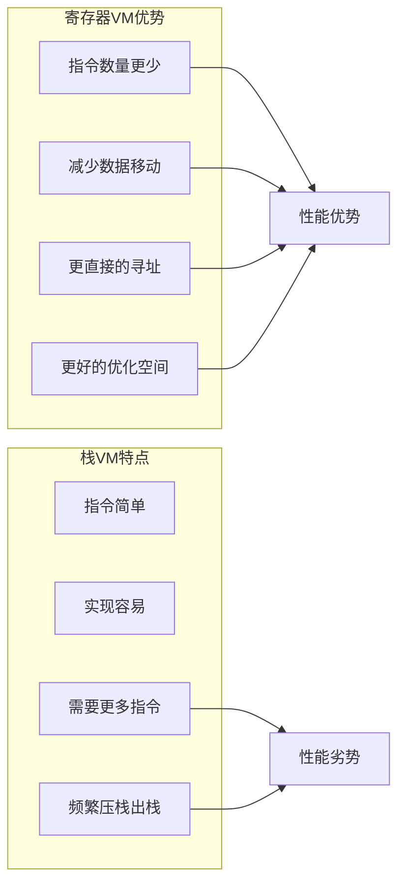

具体对比：
- **指令效率**: `a = b + c` 在寄存器VM中只需1条指令，栈VM需要3条
- **内存访问**: 寄存器直接寻址，减少间接访问
- **优化潜力**: 寄存器分配为编译器优化提供更多空间

### 🤔 Q2: RK寻址模式的设计思想是什么？

**A2:** RK寻址统一了寄存器和常量的访问方式：

```c
/* RK寻址的核心思想 */
#define ISK(x)     ((x) & BITRK)        /* 判断是否为常量 */
#define INDEXK(r)  ((int)(r) & ~BITRK)  /* 提取常量索引 */
#define MAXINDEXRK (BITRK - 1)          /* RK的最大值 */
#define RKASK(x)   ((x) | BITRK)        /* 标记为常量 */

/* 设计优势：
1. 指令格式统一 - 不需要区分寄存器指令和立即数指令
2. 编码紧凑 - 9位可表示256个寄存器或256个常量
3. 运行时高效 - 通过位操作快速判断类型
4. 编译器友好 - 简化指令选择逻辑
*/
```

### 🤔 Q3: Lua的字符串驻留机制如何工作？

**A3:** 字符串驻留确保相同内容的字符串只存储一份：

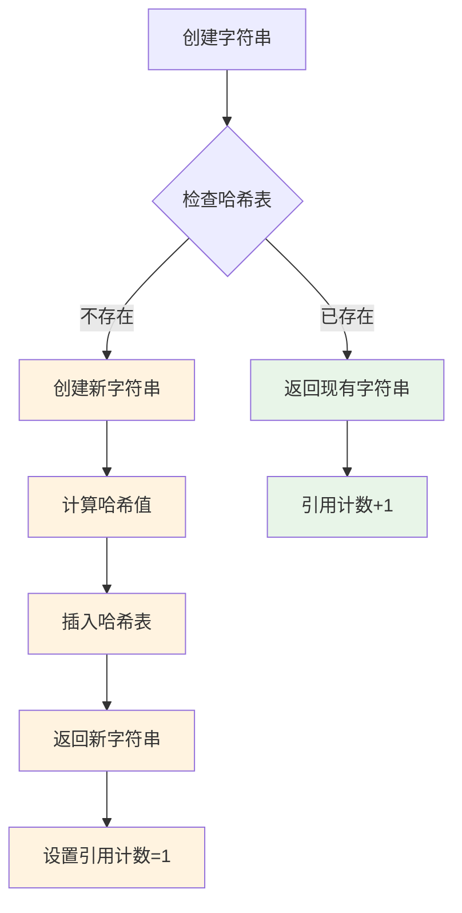

**内存优势**:
- 相同字符串只存储一次
- 字符串比较变成指针比较
- 减少内存碎片

### 🤔 Q4: 编译时优化有哪些限制？

**A4:** Lua编译器的优化受到以下限制：

```lua
-- 1. 动态类型限制 - 无法进行类型特化优化
local function add(a, b)
    return a + b  -- 运行时才知道a、b的类型
end

-- 2. 元方法限制 - 运算符可能被重载
local mt = {
    __add = function(a, b) 
        return {value = a.value + b.value} 
    end
}
local obj1 = setmetatable({value = 10}, mt)
local result = obj1 + 20  -- 实际调用元方法

-- 3. 全局变量限制 - 可能在运行时改变
local function test()
    return math.sin(x)  -- math和sin都可能被修改
end

-- 4. 副作用限制 - 函数调用可能有副作用
local function optimize_me()
    local a = func1()  -- func1可能修改全局状态
    local b = func2()  -- 不能重排序或合并
    return a + b
end
```

### 🤔 Q5: 如何理解Lua的函数闭包实现？

**A5:** 闭包通过upvalue机制实现变量捕获：

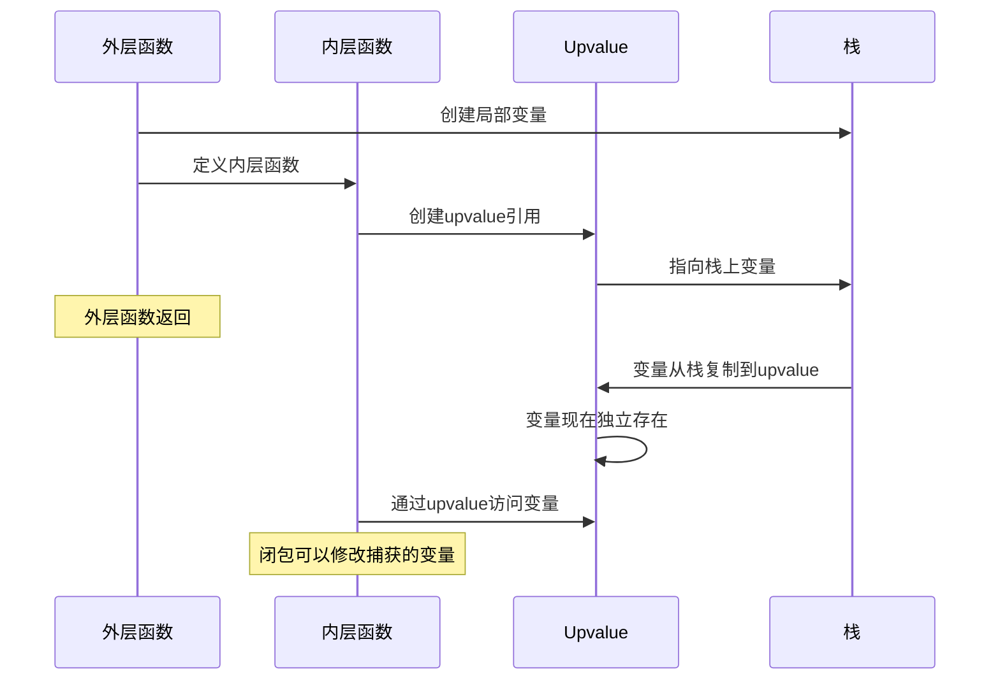

**关键机制**:
- **变量捕获**: 内层函数引用外层变量时创建upvalue
- **生命周期管理**: 栈变量转移到堆上的upvalue对象
- **共享语义**: 多个闭包可以共享同一个upvalue

### 🤔 Q6: 字节码的版本兼容性如何处理？

**A6:** Lua字节码包含版本信息确保兼容性：

```c
/* lundump.c - 字节码文件头 */
typedef struct {
    char signature[4];     /* LUA_SIGNATURE "\033Lua" */
    char version;          /* 版本号 (5.1 = 0x51) */
    char format;           /* 格式版本 */
    char endian;           /* 字节序 (1=little, 0=big) */
    char size_int;         /* int大小 */
    char size_size_t;      /* size_t大小 */  
    char size_Instruction; /* Instruction大小 */
    char size_lua_Number;  /* lua_Number大小 */
    char integral;         /* 数字类型标志 */
} LuaHeader;

/* 兼容性检查 */
static void LoadHeader(LoadState* S) {
    LuaHeader h;
    LoadBlock(S, &h, sizeof(h));
    
    if (memcmp(h.signature, LUA_SIGNATURE, 4) != 0)
        error(S, "bad signature");
    if (h.version != LUA_VERSION_NUM)
        error(S, "version mismatch");
    /* ... 更多检查 ... */
}
```

---

## 📚 最佳实践与建议

### 🎯 编译器设计原则

1. **分离关注点**
   - 词法分析专注于token识别
   - 语法分析专注于结构构建  
   - 代码生成专注于指令优化

2. **错误恢复策略**
   - 提供准确的错误位置信息
   - 尽可能继续分析找出更多错误
   - 生成有意义的错误消息

3. **性能优化平衡**
   - 编译时间 vs 运行时性能
   - 代码大小 vs 执行效率
   - 内存使用 vs 计算复杂度

### 🔧 调试技巧总结

```lua
-- debugging_tips.lua - 字节码调试技巧集合

-- 1. 使用string.dump()获取字节码
local function get_bytecode(func)
    return string.dump(func)
end

-- 2. 分析函数常量表
local function analyze_constants(func)
    local info = debug.getinfo(func, "S")
    -- 通过调试API获取更多信息
end

-- 3. 跟踪执行路径
local function trace_execution()
    debug.sethook(function(event, line)
        if event == "line" then
            print("执行第", line, "行")
        end
    end, "l")
end

-- 4. 性能热点分析
local function profile_hotspots()
    local counts = {}
    debug.sethook(function(event, line)
        if event == "line" then
            counts[line] = (counts[line] or 0) + 1
        end
    end, "l")
    
    return counts
end
```

### 📈 性能优化建议

1. **编译阶段优化**
   - 常量折叠和传播
   - 死代码消除
   - 跳转优化

2. **代码编写建议**
   - 避免不必要的全局变量访问
   - 合理使用局部变量缓存
   - 注意运算符优先级减少括号

3. **内存管理**
   - 理解字符串驻留机制
   - 合理使用数字类型
   - 注意闭包的内存开销

---

## 🎯 总结与展望

### 📋 核心要点总结

通过对Lua 5.1.5字节码生成机制的深入分析，我们了解了：

1. **词法分析**: 高效的字符流处理和token识别
2. **语法分析**: 递归下降解析器的设计精妙之处  
3. **代码生成**: 基于寄存器的指令生成和优化策略
4. **系统整合**: 各组件间的协调配合机制

### 🔄 技术演进方向

```mermaid
graph TB
    subgraph "Lua编译器演进路线"
        subgraph "当前版本特点"
            C1[简洁高效的设计]
            C2[基于寄存器的VM]
            C3[紧凑的指令格式]
            C4[基础编译时优化]
        end
        
        subgraph "潜在改进方向"  
            I1[更强的类型推导]
            I2[更多编译时优化]
            I3[JIT编译支持]
            I4[并行编译能力]
        end
        
        subgraph "设计权衡"
            T1[复杂度 vs 性能]
            T2[编译时间 vs 运行效率]
            T3[内存使用 vs 功能丰富性]
            T4[兼容性 vs 创新性]
        end
    end
    
    C1 --> I1
    C2 --> I3  
    C3 --> I2
    C4 --> I4
    
    I1 --> T1
    I2 --> T2
    I3 --> T3
    I4 --> T4
    
    classDef current fill:#e3f2fd
    classDef improve fill:#e8f5e8
    classDef tradeoff fill:#fff3e0
    
    class C1,C2,C3,C4 current
    class I1,I2,I3,I4 improve  
    class T1,T2,T3,T4 tradeoff
```

### 🌟 学习价值与启发

Lua字节码生成系统展示了优秀编译器设计的精髓：

- **简洁性**: 用最少的代码实现最大的功能
- **高效性**: 每个设计决策都考虑性能影响
- **可扩展性**: 为未来改进预留接口和空间
- **实用性**: 解决实际问题而非追求理论完美

这些设计理念不仅适用于编译器开发，在任何系统设计中都具有重要的指导意义。

---

> **💡 提示**: 本文档基于Lua 5.1.5源码分析，结合DeepWiki方法论进行深度解析。建议结合实际代码阅读和实验验证，以获得更深入的理解。

---

*文档版本: v1.0 | 更新时间: 2024年 | 基于: Lua 5.1.5源码*