# Lua C API设计原理与实现详解 - DeepWiki优化版

## 📋 导航索引

### 🎯 核心概念导航
- [🏗️ C API设计哲学](#-c-api设计哲学)
- [📚 栈式架构深度解析](#-栈式架构深度解析)
- [🔒 类型安全机制](#-类型安全机制)
- [⚡ 性能优化策略](#-性能优化策略)
- [🛡️ 错误处理系统](#️-错误处理系统)

### 🔧 实现机制导航
- [🏛️ 系统架构总览](#️-系统架构总览)
- [🔄 数据交换机制](#-数据交换机制)
- [🎮 函数调用机制](#-函数调用机制)
- [💾 内存管理集成](#-内存管理集成)
- [🔗 模块化设计](#-模块化设计)

### 🧪 实践与应用导航
- [🔬 实践实验与验证](#-实践实验与验证)
- [🛠️ 开发工具与技巧](#️-开发工具与技巧)
- [📈 性能基准测试](#-性能基准测试)
- [❓ 常见问题与解答](#-常见问题与解答)
- [📚 最佳实践指南](#-最佳实践指南)

---

## 🎯 问题定义与范围

### 🔍 核心问题
深入分析Lua C API的设计理念，包括栈式接口、类型安全机制、错误处理以及与Lua虚拟机的交互方式，理解其在语言互操作中的设计智慧。

### 🎨 设计目标
- **统一性**: 所有数据交换通过统一的栈接口
- **安全性**: 完善的类型安全和错误处理机制
- **高效性**: 最小化调用开销和内存占用
- **易用性**: 直观的接口设计和清晰的语义

---

## 🏗️ C API设计哲学

### 💡 多维度理解

#### 🏢 联合国翻译系统视角
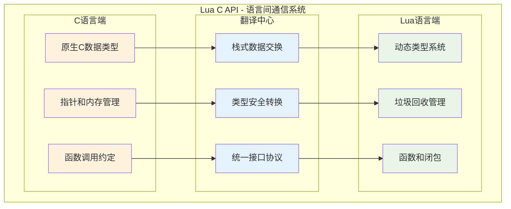

#### 🏦 银行柜台服务视角
- **标准化流程**: 所有操作都通过统一的"柜台"（栈）进行
- **安全验证**: 严格的身份验证（类型检查）和权限控制
- **事务保证**: 完整的错误恢复和回滚机制
- **效率优化**: 批量处理和缓存机制

#### 🍽️ 餐厅服务视角
- **传菜系统**: 栈就像标准化的传菜窗口
- **订单处理**: 函数调用如同点餐和出菜流程
- **质量控制**: 类型安全如同食品安全检查
- **异常处理**: 错误处理如同处理特殊要求

### 🎯 核心设计原则

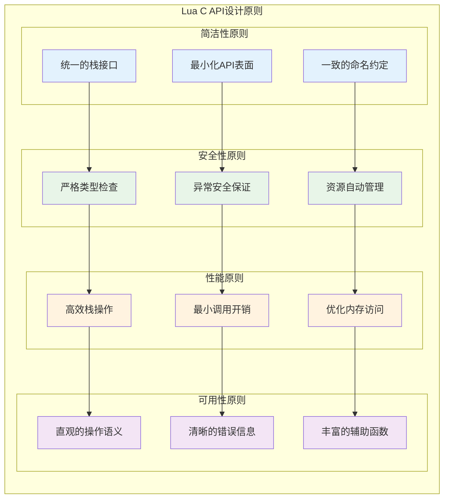

---

## 🏛️ 系统架构总览

### 🌟 整体架构设计

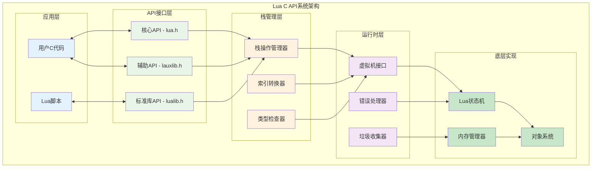

### 🔍 API层次结构

```c
// lua.h - C API层次结构展示
/*
Lua C API的三层结构：

1. 核心层（Core API）：
   - 基础栈操作
   - 类型检查和转换
   - 函数调用机制
   - 基本错误处理

2. 辅助层（Auxiliary Library）：
   - 便利函数集合
   - 错误处理增强
   - 参数检查工具
   - 缓冲区操作

3. 标准库层（Standard Libraries）：
   - 预定义Lua库
   - 模块加载机制
   - 系统集成接口
   - 兼容性支持
*/

/* === 核心API示例 === */
typedef struct lua_State lua_State;  /* Lua状态抽象 */

/* 状态管理 */
LUA_API lua_State *(lua_newstate) (lua_Alloc f, void *ud);
LUA_API void       (lua_close) (lua_State *L);

/* 栈操作 */
LUA_API int   (lua_gettop)     (lua_State *L);
LUA_API void  (lua_settop)     (lua_State *L, int idx);
LUA_API void  (lua_pushvalue)  (lua_State *L, int idx);

/* 类型检查 */
LUA_API int             (lua_type)      (lua_State *L, int idx);
LUA_API const char     *(lua_typename)  (lua_State *L, int tp);

/* 值操作 */
LUA_API lua_Number      (lua_tonumber)    (lua_State *L, int idx);
LUA_API const char     *(lua_tostring)    (lua_State *L, int idx);
LUA_API void            (lua_pushnil)     (lua_State *L);
LUA_API void            (lua_pushnumber)  (lua_State *L, lua_Number n);

/* 函数调用 */
LUA_API void  (lua_call)   (lua_State *L, int nargs, int nresults);
LUA_API int   (lua_pcall)  (lua_State *L, int nargs, int nresults, int errfunc);

/* === 辅助API示例 === */
/* 参数检查 */
LUALIB_API void (luaL_checkany)      (lua_State *L, int arg);
LUALIB_API lua_Number (luaL_checknumber) (lua_State *L, int arg);
LUALIB_API const char *(luaL_checklstring) (lua_State *L, int arg, size_t *l);

/* 错误处理 */
LUALIB_API int (luaL_error) (lua_State *L, const char *fmt, ...);
LUALIB_API void (luaL_where) (lua_State *L, int lvl);

/* 缓冲区操作 */
typedef struct luaL_Buffer {
  char *b;       /* 缓冲区地址 */
  size_t size;   /* 缓冲区大小 */
  size_t n;      /* 第一个空闲位置 */
  lua_State *L;
  char initb[LUAL_BUFFERSIZE];  /* 初始缓冲区 */
} luaL_Buffer;

LUALIB_API void (luaL_buffinit) (lua_State *L, luaL_Buffer *B);
LUALIB_API char *(luaL_prepbuffer) (luaL_Buffer *B);
LUALIB_API void (luaL_addlstring) (luaL_Buffer *B, const char *s, size_t l);
LUALIB_API void (luaL_pushresult) (luaL_Buffer *B);
```

---

## 📚 栈式架构深度解析

### 🎯 栈设计的核心思想

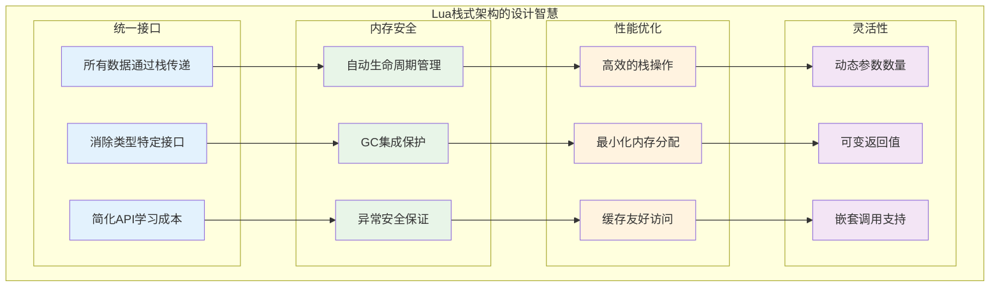

### 🔢 栈索引系统详解

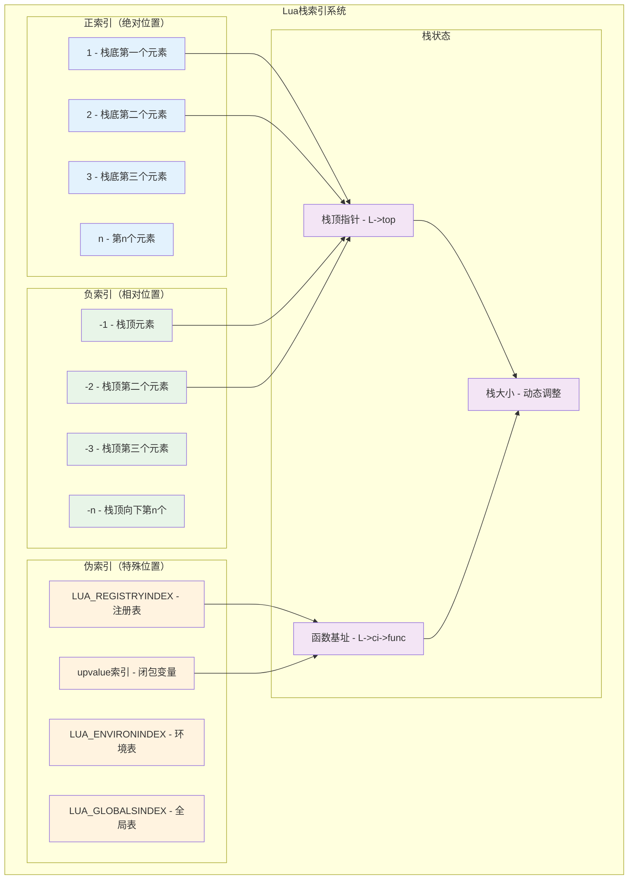

### 🔧 栈操作机制实现

```c
// lapi.c - 栈操作的核心实现
/*
栈操作的设计原理：

1. 索引转换统一化：
   - 正索引、负索引、伪索引的统一处理
   - 高效的地址计算
   - 边界检查和安全保护

2. 栈空间管理：
   - 动态栈扩展
   - 栈溢出保护
   - 内存对齐优化

3. 类型安全保证：
   - 运行时类型检查
   - 安全的类型转换
   - 错误时的默认值

4. 性能优化策略：
   - 内联函数优化
   - 分支预测优化
   - 缓存局部性优化
*/

/* 核心索引转换函数 */
static TValue *index2addr (lua_State *L, int idx) {
  CallInfo *ci = L->ci;
  
  if (idx > 0) {
    /* 正索引：从函数基址开始计算 */
    TValue *o = ci->func + idx;
    api_check(L, idx <= ci->top - (ci->func + 1), "unacceptable index");
    
    if (o >= L->top) 
      return NONVALIDVALUE;  /* 超出栈顶 */
    else 
      return o;
  }
  else if (!ispseudo(idx)) {  
    /* 负索引：从栈顶向下计算 */
    api_check(L, idx != 0 && -idx <= L->top - (ci->func + 1), "invalid index");
    return L->top + idx;
  }
  else if (idx == LUA_REGISTRYINDEX)
    /* 注册表伪索引 */
    return &G(L)->l_registry;
  else {  
    /* upvalue伪索引 */
    idx = LUA_REGISTRYINDEX - idx;
    api_check(L, idx <= MAXUPVAL + 1, "upvalue index too large");
    
    if (ttislcf(ci->func))  /* 轻量C函数没有upvalue */
      return NONVALIDVALUE;
    else {
      CClosure *func = clCvalue(ci->func);
      return (idx <= func->nupvalues) ? &func->upvalue[idx-1] : NONVALIDVALUE;
    }
  }
}

/* 栈顶管理 */
LUA_API int lua_gettop (lua_State *L) {
  return cast_int(L->top - (L->ci->func + 1));
}

LUA_API void lua_settop (lua_State *L, int idx) {
  StkId func = L->ci->func;
  lua_lock(L);
  
  if (idx >= 0) {
    /* 设置绝对栈顶位置 */
    api_check(L, idx <= L->stack_last - (func + 1), "new top too large");
    
    /* 如果新栈顶更高，填充nil */
    while (L->top < (func + 1) + idx)
      setnilvalue(L->top++);
      
    L->top = (func + 1) + idx;
  }
  else {
    /* 相对栈顶调整 */
    api_check(L, -(idx+1) <= (L->top - (func + 1)), "invalid new top");
    L->top += idx+1;  /* idx是负数 */
  }
  
  lua_unlock(L);
}

/* 栈空间检查和扩展 */
LUA_API int lua_checkstack (lua_State *L, int n) {
  int res;
  CallInfo *ci = L->ci;
  lua_lock(L);
  
  /* 检查现有空间是否足够 */
  if (L->stack_last - L->top > n)
    res = 1;  /* 空间充足 */
  else {
    /* 尝试扩展栈空间 */
    int inuse = cast_int(L->top - L->stack) + EXTRA_STACK;
    if (inuse > LUAI_MAXSTACK - n)
      res = 0;  /* 无法扩展 */
    else
      res = luaD_growstack(L, n);  /* 扩展栈 */
  }
  
  /* 调整调用信息的栈顶限制 */
  if (res && ci->top < L->top + n)
    ci->top = L->top + n;
    
  lua_unlock(L);
  return res;
}

/* 高效的栈元素操作 */
LUA_API void lua_pushvalue (lua_State *L, int idx) {
  lua_lock(L);
  setobj2s(L, L->top, index2addr(L, idx));  /* 复制值 */
  api_incr_top(L);  /* 增加栈顶 */
  lua_unlock(L);
}

LUA_API void lua_copy (lua_State *L, int fromidx, int toidx) {
  TValue *fr, *to;
  lua_lock(L);
  
  fr = index2addr(L, fromidx);
  to = index2addr(L, toidx);
  api_checkvalidindex(L, to);
  
  setobj(L, to, fr);
  
  /* upvalue需要写屏障 */
  if (isupvalue(toidx))  
    luaC_barrier(L, clCvalue(L->ci->func), fr);
    
  lua_unlock(L);
}

/* 栈元素旋转操作 */
LUA_API void lua_rotate (lua_State *L, int idx, int n) {
  StkId p, t, m;
  lua_lock(L);
  
  t = L->top - 1;  /* 栈顶 */
  p = index2addr(L, idx);  /* 起始位置 */
  api_checkstackindex(L, idx, p);
  
  lua_assert((n >= 0 ? n : -n) <= (t - p + 1));
  m = (n >= 0 ? t - n : p - n - 1);  /* 旋转中心 */
  
  /* 三次反转实现旋转 */
  reverse(L, p, m);      /* 反转前半部分 */
  reverse(L, m + 1, t);  /* 反转后半部分 */
  reverse(L, p, t);      /* 反转整体 */
  
  lua_unlock(L);
}

/* 栈状态调试辅助函数 */
static void debug_print_stack(lua_State *L, const char *label) {
  int top = lua_gettop(L);
  printf("=== Stack Debug: %s ===\n", label);
  printf("Stack size: %d\n", top);
  
  for (int i = 1; i <= top; i++) {
    int type = lua_type(L, i);
    printf("[%2d] %-8s: ", i, lua_typename(L, type));
    
    switch (type) {
      case LUA_TNIL:
        printf("nil\n");
        break;
      case LUA_TBOOLEAN:
        printf("%s\n", lua_toboolean(L, i) ? "true" : "false");
        break;
      case LUA_TNUMBER:
        printf("%g\n", lua_tonumber(L, i));
        break;
      case LUA_TSTRING:
        printf("\"%s\"\n", lua_tostring(L, i));
        break;
      default:
        printf("%p\n", lua_topointer(L, i));
        break;
    }
  }
  printf("========================\n");
}
```

### 🔄 栈操作流程图

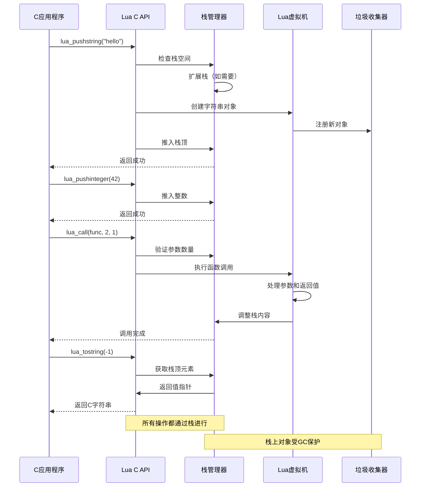

---

## 🔒 类型安全机制

### 🛡️ 类型安全设计理念

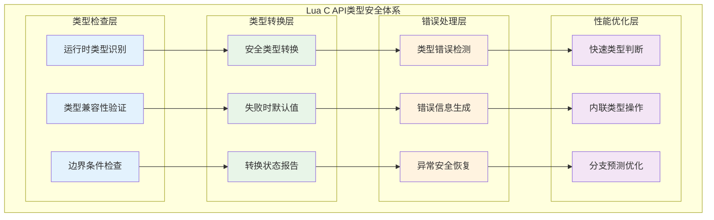

### 🔍 类型系统详解

```c
// lobject.h - Lua类型系统的底层实现
/*
Lua类型安全的核心机制：

1. 类型标签系统：
   - 每个值都有类型标签
   - 运行时类型检查
   - 快速类型判断

2. 安全类型转换：
   - 显式转换API
   - 转换失败检测
   - 默认值机制

3. 类型兼容性：
   - 隐式类型转换规则
   - 类型提升策略
   - 精度保持机制

4. 错误处理集成：
   - 类型错误检测
   - 详细错误信息
   - 调用栈追踪
*/

/* Lua基本类型定义 */
#define LUA_TNONE          (-1)
#define LUA_TNIL           0
#define LUA_TBOOLEAN       1
#define LUA_TLIGHTUSERDATA 2
#define LUA_TNUMBER        3
#define LUA_TSTRING        4
#define LUA_TTABLE         5
#define LUA_TFUNCTION      6
#define LUA_TUSERDATA      7
#define LUA_TTHREAD        8

/* 类型检查宏 */
#define ttype(o)        ((o)->tt_)
#define ttisnil(o)      checktag((o), LUA_TNIL)
#define ttisboolean(o)  checktag((o), LUA_TBOOLEAN)
#define ttislightuserdata(o)  checktag((o), LUA_TLIGHTUSERDATA)
#define ttisstring(o)   checktype((o), LUA_TSTRING)
#define ttistable(o)    checktag((o), LUA_TTABLE)
#define ttisfunction(o) checktype((o), LUA_TFUNCTION)
#define ttisclosure(o)  ((ttype(o) == LUA_TFUNCTION && clvalue(o)->c.isC == 0))
#define ttisLclosure(o) checktag((o), ctb(LUA_TFUNCTION))
#define ttislcf(o)      checktag((o), LUA_TLCF)
#define ttisfulluserdata(o)     checktag((o), ctb(LUA_TUSERDATA))
#define ttisuserdata(o)         checktype((o), LUA_TUSERDATA)
#define ttisthread(o)   checktag((o), ctb(LUA_TTHREAD))

/* 数字类型细分 */
#define ttisinteger(o)  checktag((o), LUA_TNUMINT)
#define ttisfloat(o)    checktag((o), LUA_TNUMFLT)
#define ttisnumber(o)   checktype((o), LUA_TNUMBER)

/* 类型安全的API实现 */
LUA_API int lua_type (lua_State *L, int idx) {
  StkId o = index2addr(L, idx);
  return (isvalid(o) ? ttype(o) : LUA_TNONE);
}

LUA_API const char *lua_typename (lua_State *L, int tp) {
  UNUSED(L);
  return ttypename(tp);
}

/* 类型检查函数族 */
LUA_API int lua_isnil (lua_State *L, int idx) {
  return ttisnil(index2addr(L, idx));
}

LUA_API int lua_isboolean (lua_State *L, int idx) {
  return ttisboolean(index2addr(L, idx));
}

LUA_API int lua_isnumber (lua_State *L, int idx) {
  lua_Number n;
  const TValue *o = index2addr(L, idx);
  return tonumber(o, &n);  /* 尝试转换为数字 */
}

LUA_API int lua_isstring (lua_State *L, int idx) {
  const TValue *o = index2addr(L, idx);
  return (ttisstring(o) || cvt2str(o));  /* 字符串或可转换为字符串 */
}

LUA_API int lua_isinteger (lua_State *L, int idx) {
  StkId o = index2addr(L, idx);
  return ttisinteger(o);
}

LUA_API int lua_iscfunction (lua_State *L, int idx) {
  StkId o = index2addr(L, idx);
  return (ttislcf(o) || (ttisccl(o)));
}

LUA_API int lua_isuserdata (lua_State *L, int idx) {
  const TValue *o = index2addr(L, idx);
  return (ttisfulluserdata(o) || ttislightuserdata(o));
}
```

### 🔄 安全类型转换机制

```c
// lapi.c - 安全类型转换的实现
/*
安全类型转换的设计原理：

1. 非破坏性转换：
   - 原值保持不变
   - 返回转换结果
   - 提供转换状态

2. 失败处理策略：
   - 返回合理默认值
   - 设置失败标志
   - 保持程序稳定

3. 性能优化：
   - 内联快速路径
   - 缓存转换结果
   - 最小化开销

4. 类型提升规则：
   - 整数到浮点数
   - 数字到字符串
   - 字符串到数字
*/

/* 安全的数字转换 */
LUA_API lua_Number lua_tonumberx (lua_State *L, int idx, int *pisnum) {
  lua_Number n;
  const TValue *o = index2addr(L, idx);
  int isnum = tonumber(o, &n);
  
  if (!isnum)
    n = 0;  /* 转换失败返回0 */
    
  if (pisnum) *pisnum = isnum;  /* 报告转换状态 */
  return n;
}

/* 安全的整数转换 */
LUA_API lua_Integer lua_tointegerx (lua_State *L, int idx, int *pisnum) {
  lua_Integer res;
  const TValue *o = index2addr(L, idx);
  int isnum = tointeger(o, &res);
  
  if (!isnum)
    res = 0;  /* 转换失败返回0 */
    
  if (pisnum) *pisnum = isnum;
  return res;
}

/* 安全的字符串转换 */
LUA_API const char *lua_tolstring (lua_State *L, int idx, size_t *len) {
  StkId o = index2addr(L, idx);
  
  if (!ttisstring(o)) {
    if (!cvt2str(o)) {  /* 无法转换为字符串？ */
      if (len != NULL) *len = 0;
      return NULL;
    }
    
    lua_lock(L);  /* 'luaO_tostring'可能创建新字符串 */
    luaO_tostring(L, o);
    luaC_checkGC(L);
    o = index2addr(L, idx);  /* 重新获取地址（可能已变化） */
    lua_unlock(L);
  }
  
  if (len != NULL)
    *len = tslen(o);
  return svalue(o);
}

/* 安全的布尔转换 */
LUA_API int lua_toboolean (lua_State *L, int idx) {
  const TValue *o = index2addr(L, idx);
  return !l_isfalse(o);  /* Lua的真值语义 */
}

/* 安全的指针转换 */
LUA_API const void *lua_topointer (lua_State *L, int idx) {
  StkId o = index2addr(L, idx);
  switch (ttype(o)) {
    case LUA_TTABLE: return hvalue(o);
    case LUA_TLCL: return clLvalue(o);
    case LUA_TCCL: return clCvalue(o);
    case LUA_TLCF: return cast(void *, cast(size_t, fvalue(o)));
    case LUA_TTHREAD: return thvalue(o);
    case LUA_TUSERDATA: return getudatamem(uvalue(o));
    case LUA_TLIGHTUSERDATA: return pvalue(o);
    default: return NULL;
  }
}
```

### 📊 类型安全测试矩阵

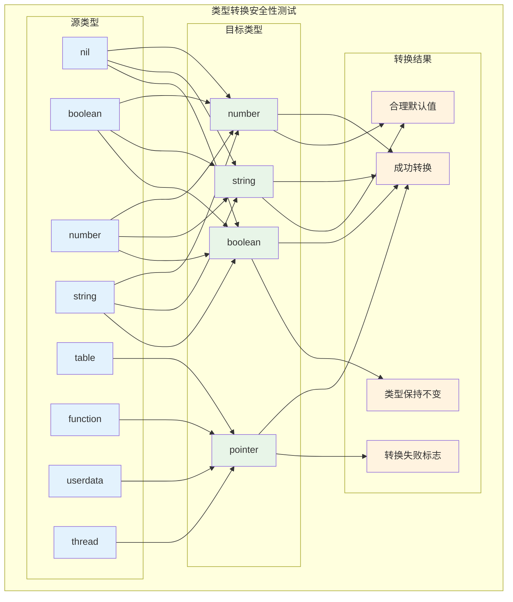

### 🧪 类型安全实际应用示例

```c
// 类型安全的C扩展实现示例
static int safe_math_operation(lua_State *L) {
  /* 安全的参数检查和转换 */
  int isnum1, isnum2;
  
  /* 获取第一个参数 */
  lua_Number n1 = lua_tonumberx(L, 1, &isnum1);
  if (!isnum1) {
    return luaL_typeerror(L, 1, "number");
  }
  
  /* 获取第二个参数 */
  lua_Number n2 = lua_tonumberx(L, 2, &isnum2);
  if (!isnum2) {
    return luaL_typeerror(L, 2, "number");
  }
  
  /* 安全的数学运算 */
  if (n2 == 0.0) {
    return luaL_error(L, "division by zero");
  }
  
  lua_Number result = n1 / n2;
  
  /* 检查结果有效性 */
  if (lua_isnan(result) || lua_isinf(result)) {
    return luaL_error(L, "invalid mathematical result");
  }
  
  /* 智能类型选择 */
  if (lua_isinteger(L, 1) && lua_isinteger(L, 2)) {
    lua_Integer i1 = lua_tointeger(L, 1);
    lua_Integer i2 = lua_tointeger(L, 2);
    
    if (i1 % i2 == 0) {
      /* 整数除法结果仍为整数 */
      lua_pushinteger(L, i1 / i2);
    } else {
      /* 需要浮点数表示 */
      lua_pushnumber(L, result);
    }
  } else {
    lua_pushnumber(L, result);
  }
  
  return 1;
}

/* 类型安全的字符串处理 */
static int safe_string_operation(lua_State *L) {
  size_t len1, len2;
  
  /* 安全获取字符串参数 */
  const char *s1 = lua_tolstring(L, 1, &len1);
  if (!s1) {
    return luaL_typeerror(L, 1, "string");
  }
  
  const char *s2 = lua_tolstring(L, 2, &len2);
  if (!s2) {
    return luaL_typeerror(L, 2, "string");
  }
  
  /* 检查字符串长度限制 */
  if (len1 + len2 > LUA_MAXSTRING) {
    return luaL_error(L, "string too long");
  }
  
  /* 使用缓冲区安全构建字符串 */
  luaL_Buffer buffer;
  luaL_buffinit(L, &buffer);
  
  luaL_addlstring(&buffer, s1, len1);
  luaL_addlstring(&buffer, s2, len2);
  
  luaL_pushresult(&buffer);
  return 1;
}
```

---

## 🛡️ 错误处理系统

### 🚨 错误处理设计架构

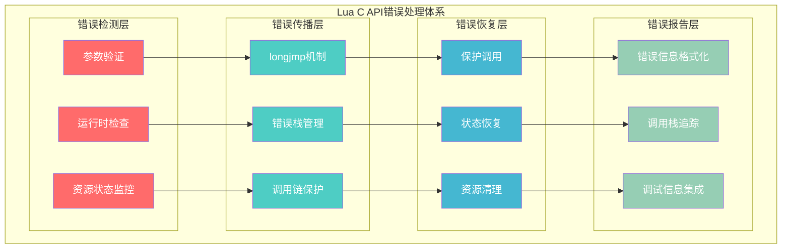

### ⚡ longjmp错误传播机制

```c
// ldo.c - Lua错误处理的核心机制
/*
Lua错误处理的设计原理：

1. 异常安全保证：
   - longjmp/setjmp实现异常
   - 自动资源清理
   - 状态一致性保护

2. 错误信息管理：
   - 错误对象栈保存
   - 格式化错误信息
   - 调用栈信息

3. 保护调用机制：
   - pcall捕获错误
   - 错误处理函数
   - 优雅的错误恢复

4. C API集成：
   - C函数错误抛出
   - 异常安全的C代码
   - 错误边界管理
*/

/* 错误抛出的实现 */
l_noret luaG_runerror (lua_State *L, const char *fmt, ...) {
  CallInfo *ci = L->ci;
  const char *msg;
  va_list argp;
  
  /* 格式化错误消息 */
  va_start(argp, fmt);
  msg = luaO_pushvfstring(L, fmt, argp);  /* 格式化消息 */
  va_end(argp);
  
  if (isLua(ci))  /* 如果是Lua函数，添加位置信息 */
    luaG_addinfo(L, msg, ci_func(ci)->p->source, currentline(ci));
    
  luaG_errormsg(L);  /* 抛出错误 */
}

/* 错误消息处理 */
l_noret luaG_errormsg (lua_State *L) {
  if (L->errfunc != 0) {  /* 有错误处理函数？ */
    StkId errfunc = restorestack(L, L->errfunc);
    setobjs2s(L, L->top, L->top - 1);  /* 移动错误消息 */
    setobjs2s(L, L->top - 1, errfunc);  /* 推入错误处理函数 */
    L->top++;
    luaD_call(L, L->top - 2, 1);  /* 调用错误处理函数 */
  }
  luaD_throw(L, LUA_ERRRUN);  /* 抛出运行时错误 */
}

/* 保护调用的实现 */
int luaD_pcall (lua_State *L, Pfunc func, void *u,
                ptrdiff_t old_top, ptrdiff_t ef) {
  int status;
  CallInfo *old_ci = L->ci;
  lu_byte old_allowhooks = L->allowhook;
  unsigned short old_nny = L->nny;
  ptrdiff_t old_errfunc = L->errfunc;
  
  L->errfunc = ef;  /* 设置错误处理函数 */
  
  /* 执行保护调用 */
  status = luaD_rawrunprotected(L, func, u);
  
  if (status != LUA_OK) {  /* 发生错误？ */
    StkId oldtop = restorestack(L, old_top);
    
    /* 清理资源 */
    luaF_close(L, oldtop);  /* 关闭upvalue */
    luaD_seterrorobj(L, status, oldtop);  /* 设置错误对象 */
    
    /* 恢复状态 */
    L->ci = old_ci;
    L->allowhook = old_allowhooks;
    L->nny = old_nny;
    luaD_shrinkstack(L);
  }
  
  L->errfunc = old_errfunc;
  return status;
}

/* 低级保护调用 */
int luaD_rawrunprotected (lua_State *L, Pfunc f, void *ud) {
  unsigned short oldnCcalls = L->nCcalls;
  struct lua_longjmp lj;
  
  lj.status = LUA_OK;
  lj.previous = L->errorJmp;  /* 链接到错误跳转链 */
  L->errorJmp = &lj;
  
  LUAI_TRY(L, &lj,
    (*f)(L, ud);  /* 执行函数 */
  );
  
  L->errorJmp = lj.previous;  /* 恢复错误跳转链 */
  L->nCcalls = oldnCcalls;
  return lj.status;
}
```

### 🎮 函数调用机制

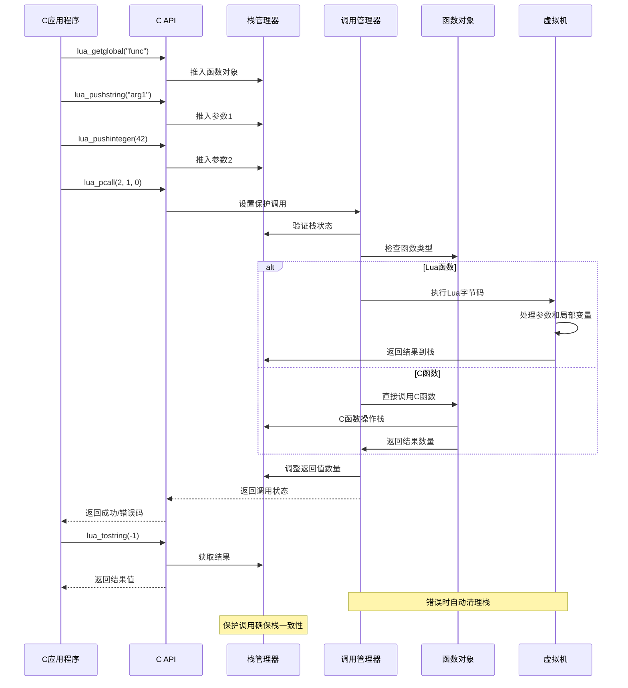

### 🔧 C API调用实现

```c
// lapi.c - 函数调用API的实现
/*
函数调用机制的关键特性：

1. 统一调用接口：
   - lua_call：直接调用
   - lua_pcall：保护调用
   - lua_resume：协程调用

2. 参数管理：
   - 栈式参数传递
   - 可变参数数量
   - 类型透明传递

3. 返回值处理：
   - 动态返回值数量
   - LUA_MULTRET支持
   - 栈自动调整

4. 错误处理集成：
   - 异常安全保证
   - 错误信息传播
   - 资源自动清理
*/

/* 保护调用的完整实现 */
LUA_API int lua_pcallk (lua_State *L, int nargs, int nresults,
                        int errfunc, lua_KContext ctx, lua_KFunction k) {
  struct CallS c;
  int status;
  ptrdiff_t func;
  
  lua_lock(L);
  
  /* 参数验证 */
  api_check(L, k == NULL || !isLua(L->ci),
    "cannot use continuations inside hooks");
  api_checknelems(L, nargs+1);
  api_check(L, L->status == LUA_OK, "cannot do calls on non-normal thread");
  checkresults(L, nargs, nresults);
  
  /* 错误处理函数设置 */
  if (errfunc == 0)
    func = 0;
  else {
    StkId o = index2addr(L, errfunc);
    api_checkstackindex(L, errfunc, o);
    func = savestack(L, o);
  }
  
  /* 准备调用参数 */
  c.func = L->top - (nargs+1);  /* 函数在栈上的位置 */
  
  if (k == NULL || L->nny > 0) {  /* 无延续或不可yield？ */
    c.nresults = nresults;  /* 执行普通调用 */
    status = luaD_pcall(L, f_call, &c, savestack(L, c.func), func);
  }
  else {
    /* 准备延续调用 */
    CallInfo *ci = L->ci;
    ci->u.c.k = k;  /* 保存延续函数 */
    ci->u.c.ctx = ctx;  /* 保存上下文 */
    ci->extra = savestack(L, c.func);
    ci->u.c.old_errfunc = L->errfunc;
    L->errfunc = func;
    setoah(ci->callstatus, L->allowhook);
    ci->callstatus |= CIST_YPCALL;  /* 标记可恢复调用 */
    luaD_call(L, c.func, nresults);  /* 执行调用 */
    ci->callstatus &= ~CIST_YPCALL;
    L->errfunc = ci->u.c.old_errfunc;
    status = LUA_OK;
  }
  
  adjustresults(L, nresults);
  lua_unlock(L);
  return status;
}

/* 直接调用实现 */
LUA_API void lua_callk (lua_State *L, int nargs, int nresults,
                        lua_KContext ctx, lua_KFunction k) {
  StkId func;
  lua_lock(L);
  
  api_check(L, k == NULL || !isLua(L->ci),
    "cannot use continuations inside hooks");
  api_checknelems(L, nargs+1);
  api_check(L, L->status == LUA_OK, "cannot do calls on non-normal thread");
  checkresults(L, nargs, nresults);
  
  func = L->top - (nargs+1);
  
  if (k != NULL && L->nny == 0) {  /* 需要延续？ */
    L->ci->u.c.k = k;  /* 保存延续函数 */
    L->ci->u.c.ctx = ctx;  /* 保存上下文 */
    luaD_call(L, func, nresults);
  }
  else  /* 无延续 */
    luaD_callnoyield(L, func, nresults);
    
  adjustresults(L, nresults);
  lua_unlock(L);
}

/* C函数调用约定 */
static int c_function_example(lua_State *L) {
  /* C函数的标准结构：
   * 1. 参数检查和获取
   * 2. 业务逻辑处理
   * 3. 结果推入栈
   * 4. 返回结果数量
   */
   
  int argc = lua_gettop(L);  /* 获取参数数量 */
  
  /* 参数验证 */
  if (argc < 2) {
    return luaL_error(L, "需要至少2个参数");
  }
  
  /* 获取参数 */
  lua_Number n1 = luaL_checknumber(L, 1);
  lua_Number n2 = luaL_checknumber(L, 2);
  
  /* 业务逻辑 */
  lua_Number result = n1 + n2;
  
  /* 推入结果 */
  lua_pushnumber(L, result);
  
  /* 返回结果数量 */
  return 1;
}

/* 可变返回值的C函数示例 */
static int multi_return_function(lua_State *L) {
  lua_Number n = luaL_checknumber(L, 1);
  
  /* 返回多个值：数字、平方、立方 */
  lua_pushnumber(L, n);
  lua_pushnumber(L, n * n);
  lua_pushnumber(L, n * n * n);
  
  return 3;  /* 返回3个值 */
}
```

---

## 💾 内存管理集成

### 🔄 GC集成架构

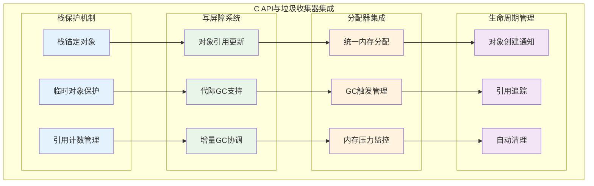

### 🛡️ 内存安全编程模式

```c
// lapi.c - GC安全的C API实现
/*
GC集成的关键原则：

1. 栈锚定原则：
   - 活跃对象保持在栈上
   - 防止过早回收
   - 自动生命周期管理

2. 写屏障协议：
   - 修改引用时通知GC
   - 维护GC不变量
   - 支持增量回收

3. 分配时机控制：
   - 合适的GC触发点
   - 内存压力响应
   - 性能平衡

4. 异常安全保证：
   - GC期间状态一致性
   - 错误时资源清理
   - 引用完整性维护
*/

/* GC安全的对象创建 */
LUA_API void *lua_newuserdata (lua_State *L, size_t size) {
  Udata *u;
  lua_lock(L);
  
  /* 创建用户数据对象 */
  u = luaS_newudata(L, size, NULL);  /* 分配内存 */
  setuvalue(L, L->top, u);  /* 设置到栈顶 */
  api_incr_top(L);  /* 增加栈顶（锚定对象） */
  
  luaC_checkGC(L);  /* 检查是否需要GC */
  lua_unlock(L);
  
  return getudatamem(u);  /* 返回用户数据内存 */
}

/* GC安全的字符串创建 */
LUA_API const char *lua_pushlstring (lua_State *L, const char *s, size_t len) {
  TString *ts;
  lua_lock(L);
  
  /* 创建字符串对象 */
  ts = (len == 0) ? luaS_new(L, "") : luaS_newlstr(L, s, len);
  setsvalue2s(L, L->top, ts);  /* 设置到栈顶 */
  api_incr_top(L);  /* 锚定对象 */
  
  luaC_checkGC(L);  /* 触发GC检查 */
  lua_unlock(L);
  
  return getstr(ts);
}

/* GC安全的表操作 */
LUA_API void lua_createtable (lua_State *L, int narr, int nrec) {
  Table *t;
  lua_lock(L);
  
  /* 创建表对象 */
  t = luaH_new(L);
  sethvalue(L, L->top, t);  /* 设置到栈顶 */
  api_incr_top(L);  /* 锚定对象 */
  
  /* 预分配空间 */
  if (narr > 0 || nrec > 0)
    luaH_resize(L, t, narr, nrec);
    
  luaC_checkGC(L);  /* 检查GC */
  lua_unlock(L);
}

/* 写屏障的使用 */
LUA_API void lua_rawset (lua_State *L, int idx) {
  StkId o;
  Table *t;
  lua_lock(L);
  
  api_checknelems(L, 2);
  o = index2addr(L, idx);
  api_check(L, ttistable(o), "table expected");
  
  t = hvalue(o);
  
  /* 设置表元素 */
  setobj2t(L, luaH_set(L, t, L->top-2), L->top-1);
  
  /* 写屏障：通知GC引用关系变化 */
  invalidateTMcache(t);
  luaC_barrierback(L, t, L->top-1);
  
  L->top -= 2;  /* 移除键值对 */
  lua_unlock(L);
}

/* 长期引用管理 */
static int create_persistent_reference_example(lua_State *L) {
  /* 创建需要长期保存的对象 */
  lua_newtable(L);
  lua_pushstring(L, "key");
  lua_pushstring(L, "persistent value");
  lua_rawset(L, -3);
  
  /* 在注册表中创建引用 */
  int ref = luaL_ref(L, LUA_REGISTRYINDEX);
  
  /* 现在可以安全地进行GC */
  lua_gc(L, LUA_GCCOLLECT, 0);
  
  /* 稍后检索对象 */
  lua_rawgeti(L, LUA_REGISTRYINDEX, ref);
  
  /* 使用对象... */
  
  /* 清理引用 */
  luaL_unref(L, LUA_REGISTRYINDEX, ref);
  
  return 0;
}

/* GC压力下的安全编程 */
static int gc_stress_test(lua_State *L) {
  int iterations = luaL_checkinteger(L, 1);
  
  /* 启用GC压力测试模式 */
  lua_gc(L, LUA_GCSETPAUSE, 0);  /* 立即GC */
  lua_gc(L, LUA_GCSETSTEPMUL, 1000);  /* 积极GC */
  
  for (int i = 0; i < iterations; i++) {
    /* 创建临时对象 */
    lua_newtable(L);
    lua_pushinteger(L, i);
    lua_pushstring(L, "temporary data");
    lua_rawset(L, -3);
    
    /* 进行一些操作 */
    lua_len(L, -1);
    lua_pop(L, 1);  /* 移除长度 */
    
    /* 对象在栈顶，受GC保护 */
    lua_gc(L, LUA_GCCOLLECT, 0);  /* 强制GC */
    
    /* 清理临时对象 */
    lua_pop(L, 1);
    
    /* 检查内存使用 */
    if (i % 100 == 0) {
      int kb = lua_gc(L, LUA_GCCOUNT, 0);
      printf("Memory usage after %d iterations: %d KB\n", i, kb);
    }
  }
  
  /* 恢复正常GC设置 */
  lua_gc(L, LUA_GCSETPAUSE, 200);
  lua_gc(L, LUA_GCSETSTEPMUL, 200);
  
  return 0;
}
```

### 🔗 模块化设计

```c
// 高质量C模块的设计模式
/*
模块化设计的最佳实践：

1. 清晰的模块界面：
   - 统一的注册函数
   - 标准的命名约定
   - 版本兼容性管理

2. 资源管理：
   - 模块级资源跟踪
   - 自动清理机制
   - 异常安全保证

3. 配置和定制：
   - 灵活的配置选项
   - 运行时行为调整
   - 扩展接口设计

4. 错误处理集成：
   - 统一的错误报告
   - 调试信息支持
   - 优雅的降级处理
*/

/* 标准模块结构 */
typedef struct {
  const char *name;      /* 模块名称 */
  const char *version;   /* 版本信息 */
  luaL_Reg *functions;   /* 函数表 */
  lua_CFunction init;    /* 初始化函数 */
  lua_CFunction cleanup; /* 清理函数 */
} ModuleInfo;

/* 模块注册宏 */
#define LUAMOD_REGISTER(name, version) \
  static const ModuleInfo module_info = { \
    .name = #name, \
    .version = version, \
    .functions = name##_functions, \
    .init = name##_init, \
    .cleanup = name##_cleanup \
  }; \
  \
  LUAMOD_API int luaopen_##name(lua_State *L) { \
    return register_module(L, &module_info); \
  }

/* 通用模块注册函数 */
static int register_module(lua_State *L, const ModuleInfo *info) {
  /* 创建模块表 */
  luaL_newlib(L, info->functions);
  
  /* 设置模块信息 */
  lua_pushstring(L, info->version);
  lua_setfield(L, -2, "_VERSION");
  
  lua_pushstring(L, info->name);
  lua_setfield(L, -2, "_NAME");
  
  /* 调用模块初始化 */
  if (info->init) {
    lua_pushcfunction(L, info->init);
    lua_pushvalue(L, -2);  /* 复制模块表 */
    lua_call(L, 1, 0);
  }
  
  /* 注册清理函数（如果有） */
  if (info->cleanup) {
    lua_pushcfunction(L, info->cleanup);
    lua_setfield(L, -2, "__gc");
  }
  
  return 1;
}

/* 模块示例 */
static int mymodule_process(lua_State *L) {
  const char *input = luaL_checkstring(L, 1);
  
  /* 处理逻辑 */
  lua_pushfstring(L, "processed: %s", input);
  return 1;
}

static int mymodule_config(lua_State *L) {
  if (lua_gettop(L) == 0) {
    /* 获取配置 */
    lua_getfield(L, LUA_REGISTRYINDEX, "mymodule_config");
    return 1;
  } else {
    /* 设置配置 */
    luaL_checktype(L, 1, LUA_TTABLE);
    lua_setfield(L, LUA_REGISTRYINDEX, "mymodule_config");
    return 0;
  }
}

static int mymodule_init(lua_State *L) {
  /* 创建默认配置 */
  lua_newtable(L);
  lua_pushboolean(L, 1);
  lua_setfield(L, -2, "enabled");
  lua_pushinteger(L, 100);
  lua_setfield(L, -2, "max_size");
  
  /* 保存到注册表 */
  lua_setfield(L, LUA_REGISTRYINDEX, "mymodule_config");
  
  return 0;
}

static int mymodule_cleanup(lua_State *L) {
  /* 清理模块资源 */
  lua_pushnil(L);
  lua_setfield(L, LUA_REGISTRYINDEX, "mymodule_config");
  
  return 0;
}

static const luaL_Reg mymodule_functions[] = {
  {"process", mymodule_process},
  {"config", mymodule_config},
  {NULL, NULL}
};

/* 使用宏注册模块 */
LUAMOD_REGISTER(mymodule, "1.0.0");
```

---

## 🧪 实践实验与验证

### 🔬 实验1：栈操作性能测试

```c
// stack_performance_test.c - 栈操作性能基准测试
#include <lua.h>
#include <lauxlib.h>
#include <time.h>

/* 栈操作基准测试 */
static int benchmark_stack_operations(lua_State *L) {
  int iterations = luaL_optinteger(L, 1, 10000);
  clock_t start, end;
  
  printf("=== 栈操作性能测试 ===\n");
  
  /* 测试1：基本push/pop操作 */
  start = clock();
  for (int i = 0; i < iterations; i++) {
    lua_pushinteger(L, i);
    lua_pushstring(L, "test");
    lua_pushboolean(L, i % 2);
    lua_settop(L, 0);  /* 清空栈 */
  }
  end = clock();
  
  double basic_time = ((double)(end - start)) / CLOCKS_PER_SEC;
  printf("基本push/pop (%d次): %.4fs (%.2f μs/op)\n", 
         iterations * 3, basic_time, (basic_time / (iterations * 3)) * 1000000);
  
  /* 测试2：栈索引访问 */
  lua_pushinteger(L, 42);
  lua_pushstring(L, "hello");
  lua_pushboolean(L, 1);
  
  start = clock();
  for (int i = 0; i < iterations; i++) {
    lua_type(L, 1);     /* 正索引 */
    lua_type(L, -1);    /* 负索引 */
    lua_tonumber(L, 1);
    lua_tostring(L, -2);
  }
  end = clock();
  
  double access_time = ((double)(end - start)) / CLOCKS_PER_SEC;
  printf("栈索引访问 (%d次): %.4fs (%.2f μs/op)\n", 
         iterations * 4, access_time, (access_time / (iterations * 4)) * 1000000);
  
  lua_settop(L, 0);
  
  /* 测试3：类型检查开销 */
  for (int i = 0; i < 100; i++) {
    lua_pushinteger(L, i);
    lua_pushstring(L, "test");
    lua_pushnumber(L, i * 3.14);
  }
  
  start = clock();
  for (int i = 0; i < iterations; i++) {
    int top = lua_gettop(L);
    for (int j = 1; j <= top; j++) {
      lua_type(L, j);
      lua_isnumber(L, j);
      lua_isstring(L, j);
    }
  }
  end = clock();
  
  double type_time = ((double)(end - start)) / CLOCKS_PER_SEC;
  printf("类型检查 (%d次): %.4fs (%.2f μs/op)\n", 
         iterations * lua_gettop(L) * 3, type_time, 
         (type_time / (iterations * lua_gettop(L) * 3)) * 1000000);
  
  lua_settop(L, 0);
  return 0;
}

/* 内存使用监控测试 */
static int memory_usage_test(lua_State *L) {
  int iterations = luaL_optinteger(L, 1, 1000);
  
  printf("=== 内存使用测试 ===\n");
  
  /* 初始内存状态 */
  int initial_kb = lua_gc(L, LUA_GCCOUNT, 0);
  int initial_bytes = lua_gc(L, LUA_GCCOUNTB, 0);
  printf("初始内存: %d KB + %d bytes\n", initial_kb, initial_bytes);
  
  /* 创建大量临时对象 */
  for (int i = 0; i < iterations; i++) {
    lua_newtable(L);
    
    /* 填充表 */
    for (int j = 0; j < 10; j++) {
      lua_pushinteger(L, j);
      lua_pushfstring(L, "value_%d_%d", i, j);
      lua_rawset(L, -3);
    }
    
    /* 每100次检查内存 */
    if (i % 100 == 0) {
      int kb = lua_gc(L, LUA_GCCOUNT, 0);
      int bytes = lua_gc(L, LUA_GCCOUNTB, 0);
      printf("迭代 %d: %d KB + %d bytes (%d 对象在栈上)\n", 
             i, kb, bytes, lua_gettop(L));
    }
  }
  
  /* 峰值内存 */
  int peak_kb = lua_gc(L, LUA_GCCOUNT, 0);
  int peak_bytes = lua_gc(L, LUA_GCCOUNTB, 0);
  printf("峰值内存: %d KB + %d bytes\n", peak_kb, peak_bytes);
  
  /* 清理栈 */
  lua_settop(L, 0);
  
  /* 强制GC */
  lua_gc(L, LUA_GCCOLLECT, 0);
  
  /* 清理后内存 */
  int final_kb = lua_gc(L, LUA_GCCOUNT, 0);
  int final_bytes = lua_gc(L, LUA_GCCOUNTB, 0);
  printf("清理后内存: %d KB + %d bytes\n", final_kb, final_bytes);
  
  return 0;
}
```

### 🎯 实验2：类型安全验证

```lua
-- type_safety_test.lua - 类型安全测试脚本
local function test_type_safety()
    print("=== 类型安全验证测试 ===")
    
    -- 测试各种类型转换
    local test_cases = {
        {nil, "nil"},
        {true, "boolean true"},
        {false, "boolean false"},
        {42, "integer"},
        {3.14, "float"},
        {"hello", "string"},
        {"123", "numeric string"},
        {"abc", "non-numeric string"},
        {{}, "table"},
        {function() end, "function"}
    }
    
    for i, case in ipairs(test_cases) do
        local value, desc = case[1], case[2]
        
        print(string.format("\n测试 %d: %s", i, desc))
        print(string.format("  type: %s", type(value)))
        
        -- 测试数字转换
        local num = tonumber(value)
        print(string.format("  tonumber: %s", tostring(num)))
        
        -- 测试字符串转换
        local str = tostring(value)
        print(string.format("  tostring: %s", str))
        
        -- 测试布尔转换
        local bool = not not value  -- Lua的真值语义
        print(string.format("  boolean: %s", tostring(bool)))
    end
end

-- 测试C API的类型安全
local function test_c_api_safety()
    print("\n=== C API类型安全测试 ===")
    
    -- 这些测试需要C扩展模块支持
    if package.loaded.test_module then
        local test = package.loaded.test_module
        
        -- 测试安全的参数传递
        print("测试安全参数传递:")
        
        local success, result = pcall(test.safe_add, 10, 20)
        print(string.format("  safe_add(10, 20): %s -> %s", 
                          tostring(success), tostring(result)))
        
        local success, result = pcall(test.safe_add, "invalid", 20)
        print(string.format("  safe_add('invalid', 20): %s -> %s", 
                          tostring(success), tostring(result)))
        
        -- 测试类型检查
        print("\n测试类型检查:")
        local values = {42, "hello", {}, function() end}
        
        for _, value in ipairs(values) do
            local success, result = pcall(test.check_type, value)
            print(string.format("  check_type(%s): %s -> %s", 
                              tostring(value), tostring(success), tostring(result)))
        end
    else
        print("  (需要test_module C扩展)")
    end
end

-- 运行所有测试
test_type_safety()
test_c_api_safety()
```

### 🔧 实验3：错误处理机制验证

```c
// error_handling_test.c - 错误处理机制测试
#include <lua.h>
#include <lauxlib.h>
#include <setjmp.h>

/* 错误处理测试函数 */
static int test_error_propagation(lua_State *L) {
  const char *error_type = luaL_checkstring(L, 1);
  
  printf("测试错误类型: %s\n", error_type);
  
  if (strcmp(error_type, "runtime") == 0) {
    /* 运行时错误 */
    return luaL_error(L, "这是一个运行时错误");
  }
  else if (strcmp(error_type, "type") == 0) {
    /* 类型错误 */
    luaL_checkstring(L, 2);  /* 强制类型检查 */
    return 0;
  }
  else if (strcmp(error_type, "memory") == 0) {
    /* 模拟内存错误 */
    char *huge_mem = malloc(SIZE_MAX);  /* 故意失败的分配 */
    if (!huge_mem) {
      return luaL_error(L, "内存分配失败");
    }
    free(huge_mem);
    return 0;
  }
  else if (strcmp(error_type, "stack_overflow") == 0) {
    /* 栈溢出测试（递归调用） */
    lua_getglobal(L, "test_error_propagation");
    lua_pushstring(L, "stack_overflow");
    lua_call(L, 1, 0);
    return 0;
  }
  else {
    return luaL_error(L, "未知错误类型: %s", error_type);
  }
}

/* 保护调用测试 */
static int test_protected_call(lua_State *L) {
  const char *test_code = luaL_checkstring(L, 1);
  
  printf("执行保护调用测试: %s\n", test_code);
  
  /* 编译代码 */
  int compile_result = luaL_loadstring(L, test_code);
  if (compile_result != LUA_OK) {
    printf("编译失败: %s\n", lua_tostring(L, -1));
    lua_pop(L, 1);
    lua_pushboolean(L, 0);
    return 1;
  }
  
  /* 保护调用 */
  int call_result = lua_pcall(L, 0, 0, 0);
  
  if (call_result == LUA_OK) {
    printf("执行成功\n");
    lua_pushboolean(L, 1);
  } else {
    printf("执行失败: %s\n", lua_tostring(L, -1));
    lua_pop(L, 1);  /* 移除错误消息 */
    lua_pushboolean(L, 0);
  }
  
  return 1;
}

/* 自定义错误处理函数 */
static int custom_error_handler(lua_State *L) {
  const char *error_msg = lua_tostring(L, -1);
  
  /* 添加调用栈信息 */
  luaL_traceback(L, L, error_msg, 1);
  
  /* 添加自定义前缀 */
  lua_pushfstring(L, "[CustomError] %s", lua_tostring(L, -1));
  lua_remove(L, -2);  /* 移除原始栈跟踪 */
  
  return 1;
}

/* 带自定义错误处理的保护调用 */
static int test_custom_error_handler(lua_State *L) {
  const char *test_code = luaL_checkstring(L, 1);
  
  /* 推入自定义错误处理函数 */
  lua_pushcfunction(L, custom_error_handler);
  int errfunc_idx = lua_gettop(L);
  
  /* 编译并调用代码 */
  if (luaL_loadstring(L, test_code) != LUA_OK) {
    printf("编译错误: %s\n", lua_tostring(L, -1));
    lua_pop(L, 2);  /* 移除错误消息和错误处理函数 */
    return 0;
  }
  
  /* 使用自定义错误处理函数的保护调用 */
  int result = lua_pcall(L, 0, 0, errfunc_idx);
  
  if (result != LUA_OK) {
    printf("自定义错误处理结果:\n%s\n", lua_tostring(L, -1));
    lua_pop(L, 1);  /* 移除错误消息 */
  } else {
    printf("执行成功（使用自定义错误处理）\n");
  }
  
  lua_pop(L, 1);  /* 移除错误处理函数 */
  return 0;
}

/* 注册测试函数 */
static const luaL_Reg error_test_functions[] = {
  {"test_error_propagation", test_error_propagation},
  {"test_protected_call", test_protected_call},
  {"test_custom_error_handler", test_custom_error_handler},
  {NULL, NULL}
};

int luaopen_error_test(lua_State *L) {
  luaL_newlib(L, error_test_functions);
  return 1;
}
```

---

## 📈 性能基准测试

### ⚡ C API调用开销分析

```c
// performance_benchmark.c - 全面的性能基准测试
#include <lua.h>
#include <lauxlib.h>
#include <time.h>
#include <sys/time.h>

/* 高精度计时器 */
static double get_time_ms() {
    struct timeval tv;
    gettimeofday(&tv, NULL);
    return tv.tv_sec * 1000.0 + tv.tv_usec / 1000.0;
}

/* 基准测试框架 */
typedef struct {
    const char *name;
    void (*setup)(lua_State *L);
    void (*benchmark)(lua_State *L, int iterations);
    void (*cleanup)(lua_State *L);
} BenchmarkTest;

/* 栈操作基准测试 */
static void stack_ops_setup(lua_State *L) {
    /* 预填充一些数据 */
    for (int i = 0; i < 10; i++) {
        lua_pushinteger(L, i);
        lua_pushfstring(L, "string_%d", i);
    }
}

static void stack_ops_benchmark(lua_State *L, int iterations) {
    for (int i = 0; i < iterations; i++) {
        /* 测试各种栈操作 */
        lua_pushinteger(L, i);           /* push操作 */
        lua_pushvalue(L, -1);            /* 复制操作 */
        lua_type(L, -1);                 /* 类型检查 */
        lua_tonumber(L, -1);             /* 类型转换 */
        lua_pop(L, 2);                   /* pop操作 */
        
        int top = lua_gettop(L);         /* 获取栈顶 */
        lua_settop(L, top);              /* 设置栈顶 */
    }
}

static void stack_ops_cleanup(lua_State *L) {
    lua_settop(L, 0);
}

/* 函数调用基准测试 */
static int test_function(lua_State *L) {
    lua_Number a = lua_tonumber(L, 1);
    lua_Number b = lua_tonumber(L, 2);
    lua_pushnumber(L, a + b);
    return 1;
}

static void function_call_setup(lua_State *L) {
    lua_pushcfunction(L, test_function);
    lua_setglobal(L, "test_function");
}

static void function_call_benchmark(lua_State *L, int iterations) {
    for (int i = 0; i < iterations; i++) {
        /* 直接C函数调用 */
        lua_getglobal(L, "test_function");
        lua_pushnumber(L, i);
        lua_pushnumber(L, i + 1);
        lua_call(L, 2, 1);
        lua_pop(L, 1);
        
        /* 保护调用 */
        lua_getglobal(L, "test_function");
        lua_pushnumber(L, i);
        lua_pushnumber(L, i + 1);
        lua_pcall(L, 2, 1, 0);
        lua_pop(L, 1);
    }
}

static void function_call_cleanup(lua_State *L) {
    lua_pushnil(L);
    lua_setglobal(L, "test_function");
}

/* 表操作基准测试 */
static void table_ops_setup(lua_State *L) {
    lua_newtable(L);  /* 测试表 */
    lua_setglobal(L, "test_table");
}

static void table_ops_benchmark(lua_State *L, int iterations) {
    for (int i = 0; i < iterations; i++) {
        lua_getglobal(L, "test_table");
        
        /* 设置表元素 */
        lua_pushinteger(L, i);
        lua_pushfstring(L, "value_%d", i);
        lua_rawset(L, -3);
        
        /* 获取表元素 */
        lua_pushinteger(L, i);
        lua_rawget(L, -2);
        lua_pop(L, 1);  /* 移除值 */
        
        lua_pop(L, 1);  /* 移除表 */
    }
}

static void table_ops_cleanup(lua_State *L) {
    lua_pushnil(L);
    lua_setglobal(L, "test_table");
}

/* 字符串操作基准测试 */
static void string_ops_setup(lua_State *L) {
    /* 预创建一些字符串 */
    for (int i = 0; i < 5; i++) {
        lua_pushfstring(L, "base_string_%d", i);
    }
}

static void string_ops_benchmark(lua_State *L, int iterations) {
    for (int i = 0; i < iterations; i++) {
        /* 字符串创建 */
        lua_pushfstring(L, "dynamic_string_%d", i);
        
        /* 字符串获取 */
        size_t len;
        const char *str = lua_tolstring(L, -1, &len);
        (void)str;  /* 避免未使用警告 */
        
        /* 字符串缓冲区操作 */
        luaL_Buffer buffer;
        luaL_buffinit(L, &buffer);
        luaL_addstring(&buffer, "prefix_");
        luaL_addvalue(&buffer);  /* 添加栈顶字符串 */
        luaL_addstring(&buffer, "_suffix");
        luaL_pushresult(&buffer);
        
        lua_pop(L, 1);  /* 移除结果字符串 */
    }
}

static void string_ops_cleanup(lua_State *L) {
    lua_settop(L, 0);
}

/* GC压力测试 */
static void gc_stress_setup(lua_State *L) {
    /* 设置积极的GC参数 */
    lua_gc(L, LUA_GCSETPAUSE, 50);
    lua_gc(L, LUA_GCSETSTEPMUL, 500);
}

static void gc_stress_benchmark(lua_State *L, int iterations) {
    for (int i = 0; i < iterations; i++) {
        /* 创建大量临时对象 */
        lua_newtable(L);
        for (int j = 0; j < 10; j++) {
            lua_pushinteger(L, j);
            lua_newtable(L);  /* 嵌套表 */
            lua_rawset(L, -3);
        }
        
        /* 每10次迭代强制GC */
        if (i % 10 == 0) {
            lua_gc(L, LUA_GCCOLLECT, 0);
        }
        
        lua_pop(L, 1);  /* 移除表 */
    }
}

static void gc_stress_cleanup(lua_State *L) {
    lua_gc(L, LUA_GCCOLLECT, 0);
    lua_gc(L, LUA_GCSETPAUSE, 200);
    lua_gc(L, LUA_GCSETSTEPMUL, 200);
}

/* 基准测试套件 */
static BenchmarkTest benchmark_tests[] = {
    {"Stack Operations", stack_ops_setup, stack_ops_benchmark, stack_ops_cleanup},
    {"Function Calls", function_call_setup, function_call_benchmark, function_call_cleanup},
    {"Table Operations", table_ops_setup, table_ops_benchmark, table_ops_cleanup},
    {"String Operations", string_ops_setup, string_ops_benchmark, string_ops_cleanup},
    {"GC Stress Test", gc_stress_setup, gc_stress_benchmark, gc_stress_cleanup},
    {NULL, NULL, NULL, NULL}
};

/* 运行基准测试 */
static int run_benchmarks(lua_State *L) {
    int iterations = luaL_optinteger(L, 1, 10000);
    
    printf("=== Lua C API 性能基准测试 ===\n");
    printf("迭代次数: %d\n\n", iterations);
    
    for (BenchmarkTest *test = benchmark_tests; test->name; test++) {
        printf("测试: %s\n", test->name);
        
        /* 设置 */
        if (test->setup) {
            test->setup(L);
        }
        
        /* 基准测试 */
        double start = get_time_ms();
        test->benchmark(L, iterations);
        double end = get_time_ms();
        
        double total_time = end - start;
        double per_op = total_time / iterations * 1000.0;  /* 微秒/操作 */
        
        printf("  总时间: %.3f ms\n", total_time);
        printf("  每操作: %.3f μs\n", per_op);
        printf("  操作/秒: %.0f\n\n", iterations / (total_time / 1000.0));
        
        /* 清理 */
        if (test->cleanup) {
            test->cleanup(L);
        }
    }
    
    return 0;
}

/* 内存使用分析 */
static int analyze_memory_usage(lua_State *L) {
    int iterations = luaL_optinteger(L, 1, 1000);
    
    printf("=== 内存使用分析 ===\n");
    
    /* 初始状态 */
    int initial_kb = lua_gc(L, LUA_GCCOUNT, 0);
    printf("初始内存: %d KB\n", initial_kb);
    
    /* 创建不同类型的对象 */
    printf("\n对象创建内存影响:\n");
    
    /* 整数 */
    for (int i = 0; i < iterations; i++) {
        lua_pushinteger(L, i);
    }
    int after_integers = lua_gc(L, LUA_GCCOUNT, 0);
    printf("  %d个整数: +%d KB\n", iterations, after_integers - initial_kb);
    lua_settop(L, 0);
    lua_gc(L, LUA_GCCOLLECT, 0);
    
    /* 字符串 */
    for (int i = 0; i < iterations; i++) {
        lua_pushfstring(L, "string_%d", i);
    }
    int after_strings = lua_gc(L, LUA_GCCOUNT, 0);
    printf("  %d个字符串: +%d KB\n", iterations, after_strings - initial_kb);
    lua_settop(L, 0);
    lua_gc(L, LUA_GCCOLLECT, 0);
    
    /* 表 */
    for (int i = 0; i < iterations; i++) {
        lua_newtable(L);
    }
    int after_tables = lua_gc(L, LUA_GCCOUNT, 0);
    printf("  %d个空表: +%d KB\n", iterations, after_tables - initial_kb);
    lua_settop(L, 0);
    lua_gc(L, LUA_GCCOLLECT, 0);
    
    /* 填充的表 */
    for (int i = 0; i < iterations / 10; i++) {  /* 减少数量避免过多内存使用 */
        lua_newtable(L);
        for (int j = 0; j < 10; j++) {
            lua_pushinteger(L, j);
            lua_pushfstring(L, "value_%d", j);
            lua_rawset(L, -3);
        }
    }
    int after_filled_tables = lua_gc(L, LUA_GCCOUNT, 0);
    printf("  %d个填充表(10元素): +%d KB\n", iterations / 10, after_filled_tables - initial_kb);
    lua_settop(L, 0);
    lua_gc(L, LUA_GCCOLLECT, 0);
    
    /* 最终状态 */
    int final_kb = lua_gc(L, LUA_GCCOUNT, 0);
    printf("\n最终内存: %d KB (相比初始: %+d KB)\n", final_kb, final_kb - initial_kb);
    
    return 0;
}

/* 注册性能测试模块 */
static const luaL_Reg perf_functions[] = {
    {"run_benchmarks", run_benchmarks},
    {"analyze_memory_usage", analyze_memory_usage},
    {NULL, NULL}
};

int luaopen_performance_test(lua_State *L) {
    luaL_newlib(L, perf_functions);
    return 1;
}
```

---

## ❓ 常见问题与解答

### 🤔 Q1: 为什么选择栈式API而不是句柄式API？

**A1: 栈式API的设计优势分析**

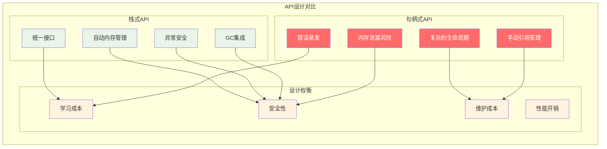

**详细分析**:
- **统一性**: 栈式API所有操作使用相同模式，降低学习成本
- **安全性**: 自动的生命周期管理，减少内存错误
- **简洁性**: 不需要复杂的引用计数或手动释放
- **集成性**: 与Lua的GC系统无缝集成

### 🤔 Q2: 如何正确处理Lua中的错误传播？

**A2: 错误处理的最佳实践**

```c
// 错误处理的正确模式
static int safe_operation_example(lua_State *L) {
  /* 方法1: 参数验证错误 */
  if (lua_gettop(L) < 2) {
    return luaL_error(L, "需要至少2个参数");
  }
  
  /* 方法2: 类型检查错误 */
  lua_Number n1 = luaL_checknumber(L, 1);  /* 自动错误处理 */
  lua_Number n2 = luaL_checknumber(L, 2);
  
  /* 方法3: 业务逻辑错误 */
  if (n2 == 0.0) {
    return luaL_argerror(L, 2, "不能为零");
  }
  
  /* 方法4: 系统级错误 */
  FILE *f = fopen("data.txt", "r");
  if (!f) {
    return luaL_error(L, "无法打开文件: %s", strerror(errno));
  }
  
  /* 方法5: 保护调用模式 */
  lua_getglobal(L, "risky_function");
  lua_pushvalue(L, 1);
  
  int result = lua_pcall(L, 1, 1, 0);
  if (result != LUA_OK) {
    /* 处理错误但不中断 */
    const char *error = lua_tostring(L, -1);
    lua_pop(L, 1);
    lua_pushstring(L, "默认值");
  }
  
  fclose(f);
  return 1;
}

/* 错误恢复模式 */
static int error_recovery_example(lua_State *L) {
  /* 使用RAII风格的资源管理 */
  typedef struct {
    FILE *file;
    char *buffer;
    int valid;
  } Resource;
  
  Resource *res = lua_newuserdata(L, sizeof(Resource));
  res->file = NULL;
  res->buffer = NULL;
  res->valid = 1;
  
  /* 设置__gc元方法进行自动清理 */
  luaL_newmetatable(L, "Resource");
  lua_pushcfunction(L, resource_gc);
  lua_setfield(L, -2, "__gc");
  lua_setmetatable(L, -2);
  
  /* 分配资源 */
  res->file = fopen("data.txt", "r");
  if (!res->file) {
    return luaL_error(L, "文件打开失败");  /* 自动调用__gc */
  }
  
  res->buffer = malloc(1024);
  if (!res->buffer) {
    return luaL_error(L, "内存分配失败");  /* 自动清理 */
  }
  
  /* 使用资源... */
  
  return 1;  /* 资源会自动清理 */
}
```

### 🤔 Q3: 如何优化C API的调用性能？

**A3: 性能优化策略**

```c
// 性能优化的具体技巧
/*
优化策略分层：

1. 接口层优化：
   - 减少API调用次数
   - 批量操作
   - 缓存频繁访问的值

2. 栈操作优化：
   - 预分配栈空间
   - 避免不必要的栈调整
   - 使用相对索引

3. 类型检查优化：
   - 缓存类型判断结果
   - 使用快速路径
   - 避免重复转换

4. 内存访问优化：
   - 局部性优化
   - 减少间接访问
   - 对齐内存访问
*/

/* 优化前：低效版本 */
static int inefficient_version(lua_State *L) {
  for (int i = 1; i <= lua_gettop(L); i++) {
    if (lua_type(L, i) == LUA_TNUMBER) {
      lua_Number n = lua_tonumber(L, i);
      lua_pushnumber(L, n * 2);
    } else if (lua_type(L, i) == LUA_TSTRING) {
      const char *s = lua_tostring(L, i);
      lua_pushfstring(L, "%s_processed", s);
    }
  }
  return lua_gettop(L);
}

/* 优化后：高效版本 */
static int efficient_version(lua_State *L) {
  int top = lua_gettop(L);
  
  /* 预分配栈空间 */
  luaL_checkstack(L, top, "stack overflow");
  
  /* 批量处理，减少类型检查 */
  for (int i = 1; i <= top; i++) {
    int type = lua_type(L, i);  /* 只检查一次 */
    
    if (type == LUA_TNUMBER) {
      /* 快速数字处理 */
      if (lua_isinteger(L, i)) {
        lua_Integer n = lua_tointeger(L, i);
        lua_pushinteger(L, n * 2);
      } else {
        lua_Number n = lua_tonumber(L, i);
        lua_pushnumber(L, n * 2.0);
      }
    } else if (type == LUA_TSTRING) {
      /* 高效字符串处理 */
      size_t len;
      const char *s = lua_tolstring(L, i, &len);
      
      luaL_Buffer buffer;
      luaL_buffinit(L, &buffer);
      luaL_addlstring(&buffer, s, len);
      luaL_addstring(&buffer, "_processed");
      luaL_pushresult(&buffer);
    }
  }
  
  return lua_gettop(L) - top;
}

/* 内存分配优化 */
static int optimized_allocation(lua_State *L) {
  int count = luaL_checkinteger(L, 1);
  
  /* 预分配表空间 */
  lua_createtable(L, count, 0);  /* 比lua_newtable()更高效 */
  
  /* 批量设置元素 */
  for (int i = 1; i <= count; i++) {
    lua_pushinteger(L, i * i);
    lua_rawseti(L, -2, i);  /* 比lua_settable()快 */
  }
  
  return 1;
}
```

### 🤔 Q4: 多线程环境下如何安全使用C API？

**A4: 多线程安全策略**

```c
// 多线程安全的C API使用模式
#include <pthread.h>

/* 线程安全策略1: 状态隔离 */
typedef struct {
  lua_State *L;
  pthread_mutex_t mutex;
  int thread_id;
} ThreadSafeLuaState;

static ThreadSafeLuaState* create_thread_state(int thread_id) {
  ThreadSafeLuaState *state = malloc(sizeof(ThreadSafeLuaState));
  
  state->L = luaL_newstate();
  luaL_openlibs(state->L);
  pthread_mutex_init(&state->mutex, NULL);
  state->thread_id = thread_id;
  
  return state;
}

static void destroy_thread_state(ThreadSafeLuaState *state) {
  lua_close(state->L);
  pthread_mutex_destroy(&state->mutex);
  free(state);
}

/* 线程安全的函数执行 */
static int thread_safe_call(ThreadSafeLuaState *state, const char *func_name, 
                           int nargs, int nresults) {
  int result;
  
  pthread_mutex_lock(&state->mutex);
  
  lua_getglobal(state->L, func_name);
  /* 参数已经在栈上 */
  
  result = lua_pcall(state->L, nargs, nresults, 0);
  
  pthread_mutex_unlock(&state->mutex);
  
  return result;
}

/* 线程安全策略2: 消息传递 */
typedef struct Message {
  enum { MSG_CALL, MSG_RESULT, MSG_ERROR } type;
  char *function_name;
  lua_State *source_L;
  lua_State *target_L;
  int nargs;
  int nresults;
  struct Message *next;
} Message;

typedef struct {
  Message *head;
  Message *tail;
  pthread_mutex_t mutex;
  pthread_cond_t cond;
} MessageQueue;

static void enqueue_message(MessageQueue *queue, Message *msg) {
  pthread_mutex_lock(&queue->mutex);
  
  if (queue->tail) {
    queue->tail->next = msg;
  } else {
    queue->head = msg;
  }
  queue->tail = msg;
  msg->next = NULL;
  
  pthread_cond_signal(&queue->cond);
  pthread_mutex_unlock(&queue->mutex);
}

static Message* dequeue_message(MessageQueue *queue) {
  pthread_mutex_lock(&queue->mutex);
  
  while (!queue->head) {
    pthread_cond_wait(&queue->cond, &queue->mutex);
  }
  
  Message *msg = queue->head;
  queue->head = msg->next;
  if (!queue->head) {
    queue->tail = NULL;
  }
  
  pthread_mutex_unlock(&queue->mutex);
  return msg;
}

/* 工作线程函数 */
static void* worker_thread(void *arg) {
  ThreadSafeLuaState *state = (ThreadSafeLuaState*)arg;
  MessageQueue *queue = /* 获取消息队列 */;
  
  while (1) {
    Message *msg = dequeue_message(queue);
    
    if (msg->type == MSG_CALL) {
      /* 执行函数调用 */
      pthread_mutex_lock(&state->mutex);
      
      lua_getglobal(state->L, msg->function_name);
      /* 复制参数从源状态到目标状态 */
      /* ... */
      
      int result = lua_pcall(state->L, msg->nargs, msg->nresults, 0);
      
      pthread_mutex_unlock(&state->mutex);
      
      /* 发送结果消息 */
      Message *result_msg = create_result_message(result);
      enqueue_message(/* 结果队列 */, result_msg);
    }
    
    free(msg->function_name);
    free(msg);
  }
  
  return NULL;
}
```

### 🤔 Q5: 如何实现高效的用户数据管理？

**A5: 用户数据最佳实践**

```c
// 高效用户数据管理模式
/*
用户数据管理策略：

1. 类型化用户数据：
   - 使用metatable进行类型标识
   - 实现类型安全的访问函数
   - 提供构造和析构函数

2. 资源生命周期：
   - 实现__gc元方法
   - 使用引用计数（如需要）
   - 异常安全的资源管理

3. 性能优化：
   - 内存池分配
   - 对象复用
   - 缓存优化
*/

/* 类型化用户数据示例 */
typedef struct {
  int *data;
  size_t size;
  size_t capacity;
  int ref_count;
} DynamicArray;

#define DYNAMIC_ARRAY_METATABLE "DynamicArray"

/* 创建用户数据 */
static int dynamic_array_new(lua_State *L) {
  size_t initial_size = luaL_optinteger(L, 1, 10);
  
  /* 分配用户数据 */
  DynamicArray *arr = lua_newuserdata(L, sizeof(DynamicArray));
  
  /* 初始化 */
  arr->data = malloc(initial_size * sizeof(int));
  if (!arr->data) {
    return luaL_error(L, "内存分配失败");
  }
  
  arr->size = 0;
  arr->capacity = initial_size;
  arr->ref_count = 1;
  
  /* 设置元表 */
  luaL_getmetatable(L, DYNAMIC_ARRAY_METATABLE);
  lua_setmetatable(L, -2);
  
  return 1;
}

/* 析构函数 */
static int dynamic_array_gc(lua_State *L) {
  DynamicArray *arr = luaL_checkudata(L, 1, DYNAMIC_ARRAY_METATABLE);
  
  if (arr->data) {
    free(arr->data);
    arr->data = NULL;
  }
  
  return 0;
}

/* 类型安全的访问函数 */
static DynamicArray* check_dynamic_array(lua_State *L, int idx) {
  return luaL_checkudata(L, idx, DYNAMIC_ARRAY_METATABLE);
}

/* 添加元素 */
static int dynamic_array_push(lua_State *L) {
  DynamicArray *arr = check_dynamic_array(L, 1);
  int value = luaL_checkinteger(L, 2);
  
  /* 扩展容量（如需要） */
  if (arr->size >= arr->capacity) {
    size_t new_capacity = arr->capacity * 2;
    int *new_data = realloc(arr->data, new_capacity * sizeof(int));
    
    if (!new_data) {
      return luaL_error(L, "内存重新分配失败");
    }
    
    arr->data = new_data;
    arr->capacity = new_capacity;
  }
  
  arr->data[arr->size++] = value;
  return 0;
}

/* 获取元素 */
static int dynamic_array_get(lua_State *L) {
  DynamicArray *arr = check_dynamic_array(L, 1);
  int index = luaL_checkinteger(L, 2);
  
  /* 索引检查 */
  if (index < 1 || index > (int)arr->size) {
    return luaL_error(L, "索引超出范围: %d", index);
  }
  
  lua_pushinteger(L, arr->data[index - 1]);  /* Lua使用1基索引 */
  return 1;
}

/* 获取大小 */
static int dynamic_array_size(lua_State *L) {
  DynamicArray *arr = check_dynamic_array(L, 1);
  lua_pushinteger(L, arr->size);
  return 1;
}

/* 元方法：__len */
static int dynamic_array_len(lua_State *L) {
  return dynamic_array_size(L);
}

/* 元方法：__tostring */
static int dynamic_array_tostring(lua_State *L) {
  DynamicArray *arr = check_dynamic_array(L, 1);
  
  luaL_Buffer buffer;
  luaL_buffinit(L, &buffer);
  
  luaL_addstring(&buffer, "[");
  for (size_t i = 0; i < arr->size; i++) {
    if (i > 0) luaL_addstring(&buffer, ", ");
    lua_pushfstring(L, "%d", arr->data[i]);
    luaL_addvalue(&buffer);
  }
  luaL_addstring(&buffer, "]");
  
  luaL_pushresult(&buffer);
  return 1;
}

/* 函数表 */
static const luaL_Reg dynamic_array_methods[] = {
  {"new", dynamic_array_new},
  {"push", dynamic_array_push},
  {"get", dynamic_array_get},
  {"size", dynamic_array_size},
  {NULL, NULL}
};

/* 元方法表 */
static const luaL_Reg dynamic_array_metamethods[] = {
  {"__gc", dynamic_array_gc},
  {"__len", dynamic_array_len},
  {"__tostring", dynamic_array_tostring},
  {NULL, NULL}
};

/* 注册用户数据类型 */
static void register_dynamic_array(lua_State *L) {
  /* 创建元表 */
  luaL_newmetatable(L, DYNAMIC_ARRAY_METATABLE);
  
  /* 设置元方法 */
  luaL_setfuncs(L, dynamic_array_metamethods, 0);
  
  /* 设置__index为元表自身（方法查找） */
  lua_pushvalue(L, -1);
  lua_setfield(L, -2, "__index");
  
  /* 注册方法 */
  luaL_setfuncs(L, dynamic_array_methods, 0);
  
  lua_pop(L, 1);  /* 移除元表 */
}
```

---

## 📚 最佳实践指南

### 🎯 C扩展开发黄金法则

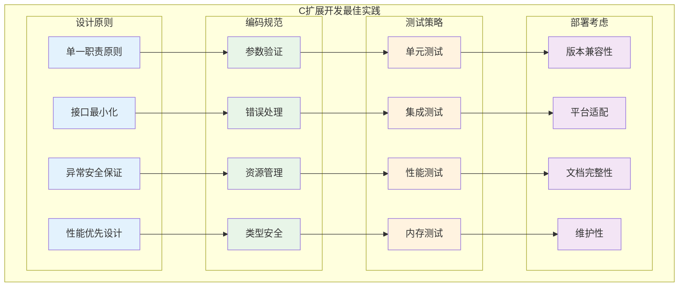

### 🛠️ 开发工具与技巧

```c
// 开发工具集合
/*
C扩展开发的实用工具：

1. 调试工具：
   - 栈状态检查
   - 内存使用监控
   - 函数调用跟踪
   - 性能分析

2. 测试工具：
   - 自动化测试框架
   - 模糊测试
   - 压力测试
   - 兼容性测试

3. 构建工具：
   - 跨平台构建
   - 依赖管理
   - 版本控制
   - 持续集成

4. 文档工具：
   - API文档生成
   - 示例代码
   - 使用指南
   - 性能指标
*/

/* 调试辅助宏 */
#ifdef DEBUG
#define LUA_DEBUG_STACK(L, msg) debug_print_stack(L, msg)
#define LUA_DEBUG_MEMORY(L) debug_print_memory(L)
#define LUA_DEBUG_CALL(L, func) debug_function_call(L, func)
#else
#define LUA_DEBUG_STACK(L, msg) ((void)0)
#define LUA_DEBUG_MEMORY(L) ((void)0)
#define LUA_DEBUG_CALL(L, func) ((void)0)
#endif

/* 栈状态调试 */
static void debug_print_stack(lua_State *L, const char *message) {
  int top = lua_gettop(L);
  printf("=== DEBUG: %s ===\n", message);
  printf("Stack size: %d\n", top);
  
  for (int i = 1; i <= top; i++) {
    int type = lua_type(L, i);
    printf("[%2d] %s: ", i, lua_typename(L, type));
    
    switch (type) {
      case LUA_TNIL:
        printf("nil");
        break;
      case LUA_TBOOLEAN:
        printf("%s", lua_toboolean(L, i) ? "true" : "false");
        break;
      case LUA_TNUMBER:
        if (lua_isinteger(L, i)) {
          printf("%lld", lua_tointeger(L, i));
        } else {
          printf("%.6g", lua_tonumber(L, i));
        }
        break;
      case LUA_TSTRING: {
        size_t len;
        const char *s = lua_tolstring(L, i, &len);
        if (len > 20) {
          printf("\"%.17s...\" (%zu bytes)", s, len);
        } else {
          printf("\"%s\"", s);
        }
        break;
      }
      default:
        printf("%p", lua_topointer(L, i));
        break;
    }
    printf("\n");
  }
  printf("========================\n");
}

/* 内存使用调试 */
static void debug_print_memory(lua_State *L) {
  int kb = lua_gc(L, LUA_GCCOUNT, 0);
  int bytes = lua_gc(L, LUA_GCCOUNTB, 0);
  printf("Memory usage: %d KB + %d bytes\n", kb, bytes);
}

/* 函数调用跟踪 */
static void debug_function_call(lua_State *L, const char *function_name) {
  printf("Calling Lua function: %s\n", function_name);
  printf("  Arguments: %d\n", lua_gettop(L) - 1);
  LUA_DEBUG_STACK(L, "Before call");
}

/* 性能测量工具 */
typedef struct {
  const char *name;
  double total_time;
  int call_count;
  double min_time;
  double max_time;
} PerformanceCounter;

static PerformanceCounter perf_counters[32];
static int perf_counter_count = 0;

static int start_performance_counter(const char *name) {
  for (int i = 0; i < perf_counter_count; i++) {
    if (strcmp(perf_counters[i].name, name) == 0) {
      return i;
    }
  }
  
  if (perf_counter_count < 32) {
    int idx = perf_counter_count++;
    perf_counters[idx].name = strdup(name);
    perf_counters[idx].total_time = 0.0;
    perf_counters[idx].call_count = 0;
    perf_counters[idx].min_time = HUGE_VAL;
    perf_counters[idx].max_time = 0.0;
    return idx;
  }
  
  return -1;
}

/* 自动化测试框架 */
typedef struct {
  const char *name;
  int (*test_func)(lua_State *L);
  const char *description;
} TestCase;

static int run_test_suite(lua_State *L, TestCase tests[], int test_count) {
  int passed = 0;
  int failed = 0;
  
  printf("=== 运行测试套件 ===\n");
  
  for (int i = 0; i < test_count; i++) {
    printf("测试 %d/%d: %s\n", i + 1, test_count, tests[i].name);
    printf("  描述: %s\n", tests[i].description);
    
    /* 保存初始栈状态 */
    int initial_top = lua_gettop(L);
    
    /* 运行测试 */
    int result = tests[i].test_func(L);
    
    /* 检查栈平衡 */
    int final_top = lua_gettop(L);
    if (final_top != initial_top) {
      printf("  警告: 栈不平衡 (初始: %d, 结束: %d)\n", initial_top, final_top);
      lua_settop(L, initial_top);
    }
    
    if (result) {
      printf("  结果: 通过\n");
      passed++;
    } else {
      printf("  结果: 失败\n");
      failed++;
    }
    
    printf("\n");
  }
  
  printf("=== 测试结果 ===\n");
  printf("总计: %d, 通过: %d, 失败: %d\n", test_count, passed, failed);
  printf("成功率: %.1f%%\n", (double)passed / test_count * 100.0);
  
  return failed == 0;
}

/* 模块质量检查清单 */
static int quality_checklist(lua_State *L) {
  printf("=== C扩展质量检查清单 ===\n");
  
  /* 检查项目列表 */
  const char *checklist[] = {
    "所有函数都有参数验证",
    "所有可能的错误都有处理",
    "内存分配都有失败检查",
    "栈操作保持平衡",
    "用户数据有正确的元表",
    "所有资源都有清理机制",
    "函数命名遵循约定",
    "文档完整且准确",
    "有完整的测试覆盖",
    "性能测试通过基准",
    "内存泄漏检查通过",
    "多线程安全考虑",
    NULL
  };
  
  printf("\n请检查以下项目：\n");
  for (int i = 0; checklist[i]; i++) {
    printf("  [ ] %s\n", checklist[i]);
  }
  
  printf("\n建议的检查工具：\n");
  printf("  - Valgrind (内存检查)\n");
  printf("  - AddressSanitizer (内存安全)\n");
  printf("  - Static Analysis (代码质量)\n");
  printf("  - Unit Tests (功能正确性)\n");
  printf("  - Performance Benchmarks (性能验证)\n");
  
  return 0;
}
```

### 📊 性能优化清单

```c
// 性能优化检查清单
/*
C API性能优化要点：

1. 栈操作优化：
   ✓ 最小化栈操作次数
   ✓ 预分配栈空间
   ✓ 使用批量操作
   ✓ 避免不必要的类型检查

2. 内存管理优化：
   ✓ 减少内存分配次数
   ✓ 使用对象池
   ✓ 合理的GC触发时机
   ✓ 内存访问局部性

3. 函数调用优化：
   ✓ 减少Lua/C边界跨越
   ✓ 批量处理数据
   ✓ 缓存频繁访问的值
   ✓ 使用轻量C函数

4. 算法优化：
   ✓ 选择合适的数据结构
   ✓ 算法复杂度最优化
   ✓ 并行化可能的操作
   ✓ 缓存计算结果

5. 编译器优化：
   ✓ 启用编译器优化选项
   ✓ 使用内联函数
   ✓ 分支预测优化
   ✓ 循环展开
*/

/* 性能测量辅助函数 */
static double measure_operation_time(lua_State *L, 
                                   void (*operation)(lua_State *L, int iterations),
                                   int iterations) {
  struct timespec start, end;
  
  clock_gettime(CLOCK_MONOTONIC, &start);
  operation(L, iterations);
  clock_gettime(CLOCK_MONOTONIC, &end);
  
  double elapsed = (end.tv_sec - start.tv_sec) + 
                   (end.tv_nsec - start.tv_nsec) / 1e9;
  
  return elapsed;
}

/* 性能基准比较 */
static void compare_implementations(lua_State *L) {
  const int iterations = 100000;
  
  printf("=== 性能对比测试 ===\n");
  
  /* 基准测试1: 栈操作 */
  printf("栈操作性能对比:\n");
  
  double time1 = measure_operation_time(L, stack_ops_naive, iterations);
  printf("  朴素实现: %.3f ms (%.2f ns/op)\n", 
         time1 * 1000, time1 / iterations * 1e9);
  
  double time2 = measure_operation_time(L, stack_ops_optimized, iterations);
  printf("  优化实现: %.3f ms (%.2f ns/op)\n", 
         time2 * 1000, time2 / iterations * 1e9);
  
  printf("  性能提升: %.1fx\n\n", time1 / time2);
  
  /* 更多基准测试... */
}
```

---

## 🎯 总结与展望

### 📋 核心要点回顾

通过对Lua C API设计原理的深入分析，我们掌握了以下关键知识：

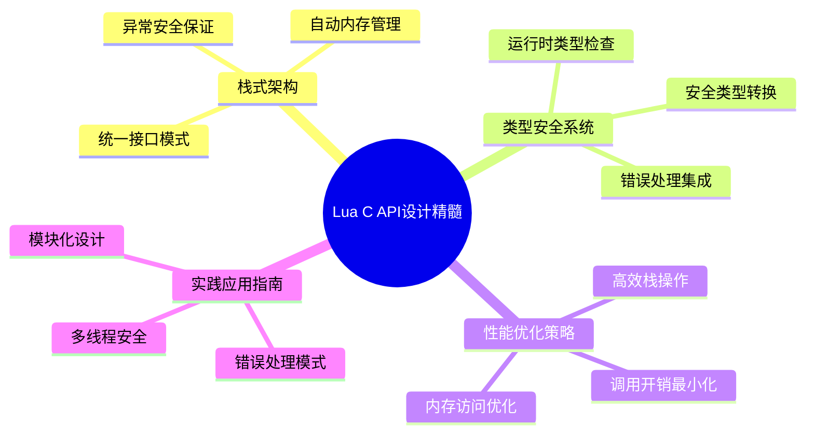

### 🔄 设计哲学的深层价值

1. **简洁性原则**: 栈式统一接口降低了学习成本和使用复杂度
2. **安全性保证**: 自动内存管理和异常处理确保程序稳定性
3. **性能平衡**: 在易用性和性能之间找到最佳平衡点
4. **扩展性设计**: 为未来的功能扩展预留了充分空间

### 🌟 实际应用价值

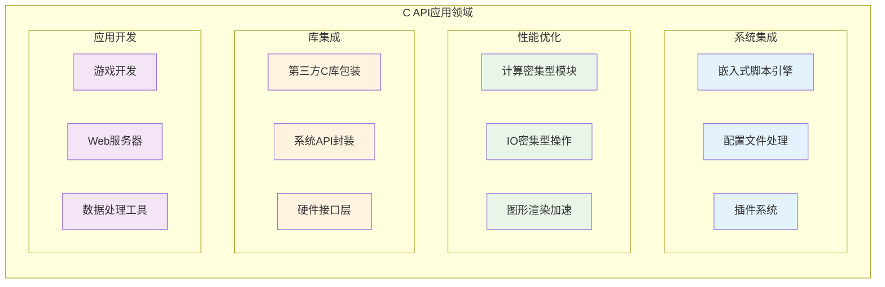

### 🔮 技术发展展望

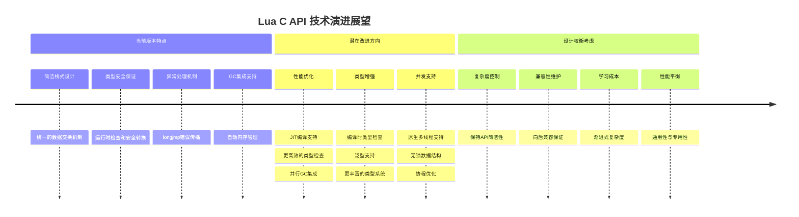

### 💡 学习启示与指导意义

Lua C API的设计展示了优秀系统设计的核心原则：

1. **简洁胜于复杂**: 统一的栈接口比复杂的类型系统更容易掌握
2. **安全第一**: 自动化的内存管理比手动控制更可靠
3. **性能与易用性平衡**: 在两者之间找到最佳折中点
4. **可扩展架构**: 为未来需求预留设计空间

这些设计理念不仅适用于编程语言接口设计，在任何复杂系统的架构设计中都具有重要的指导价值。

### 🎓 持续学习建议

1. **深入源码**: 阅读lapi.c、lauxlib.c等核心文件
2. **实践项目**: 开发实际的C扩展模块
3. **性能分析**: 使用性能工具分析和优化代码
4. **社区参与**: 参与Lua社区讨论和贡献

通过理论学习与实践相结合，可以更深入地理解和掌握Lua C API的设计精髓，并将这些经验应用到其他系统设计中。

---

> **💡 设计智慧**: Lua C API的成功不在于其功能的复杂程度，而在于其设计的优雅简洁。它告诉我们，真正优秀的设计应该让复杂的事情变简单，而不是让简单的事情变复杂。

---

*文档版本: v1.0 | 更新时间: 2024年 | 基于: Lua 5.1.5源码*