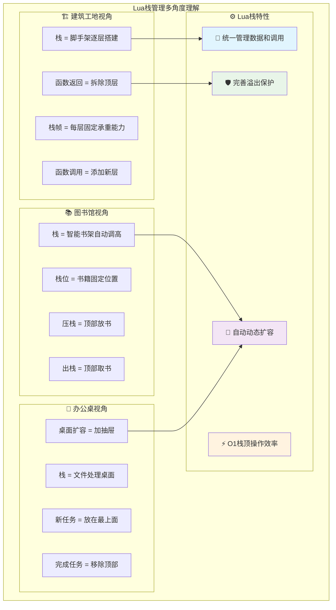
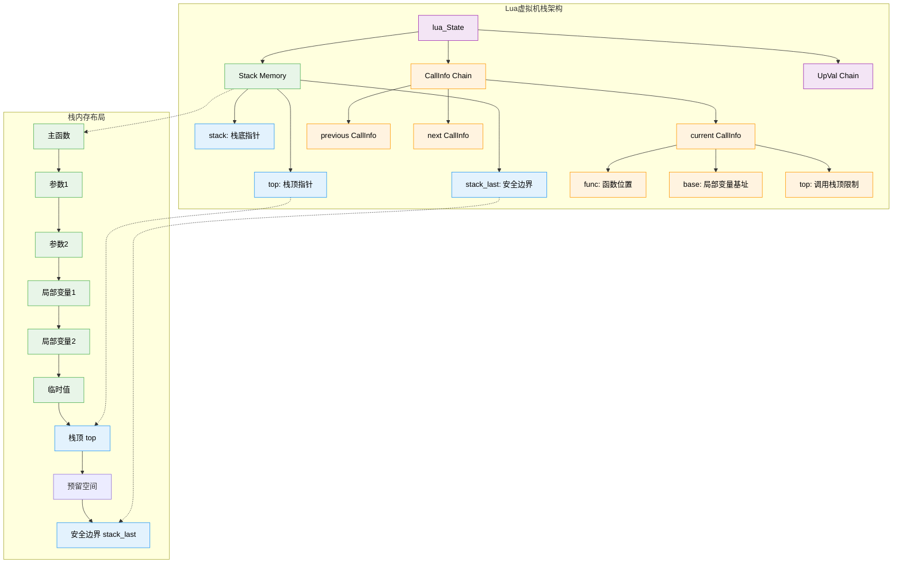
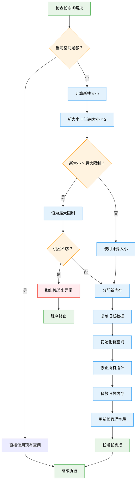
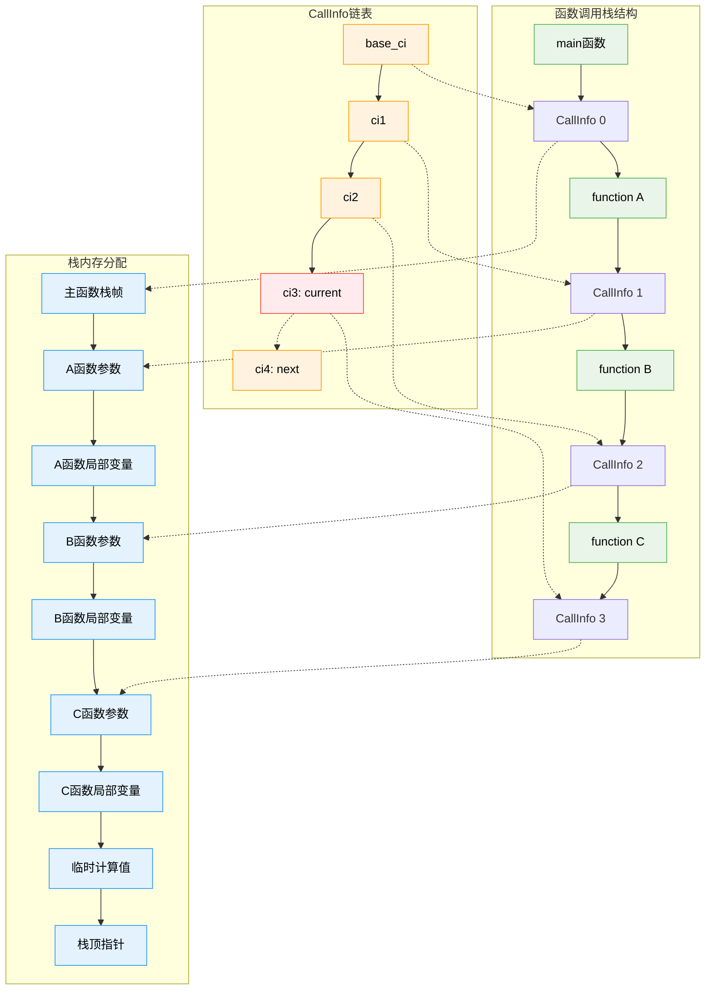

# Lua栈管理机制深度解析

> **📚 学习指南**  
> **难度等级**：⭐⭐⭐⭐ (高级)  
> **预计阅读时间**：50-70分钟  
> **前置知识**：C语言基础、数据结构、内存管理概念  
> **关联文档**：[虚拟机架构](q_01_virtual_machine_optimized.md) | [垃圾回收](q_02_garbage_collection_optimized.md) | [C API设计](q_07_c_api_design_optimized.md)

## 📋 文档导航

- [🎯 核心问题](#核心问题)
- [🌟 栈管理概念速览](#栈管理概念速览)
- [🏗️ 统一栈架构设计](#统一栈架构设计)
- [📊 栈初始化与销毁](#栈初始化与销毁)
- [📈 动态栈增长机制](#动态栈增长机制)
- [🎮 函数调用栈管理](#函数调用栈管理)
- [🛡️ 栈溢出保护机制](#栈溢出保护机制)
- [🔄 协程栈独立管理](#协程栈独立管理)
- [⚡ 性能优化与调优](#性能优化与调优)
- [🧪 实践与实验](#实践与实验)
- [❓ 面试核心问题](#面试核心问题)
- [🔗 延伸学习](#延伸学习)

---

## 🎯 核心问题

**详细分析Lua的栈管理机制，包括统一栈设计、动态增长策略、函数调用管理、局部变量分配以及栈溢出保护等核心技术。**

---

## 🌟 栈管理概念速览

### 🧠 形象理解栈管理

想象你在**餐厅点餐**的场景：服务员会把你点的菜一盘一盘地叠放在托盘上，最后点的菜放在最上面，取菜时也是从最上面开始取。Lua的栈就像这个托盘一样，采用"**后进先出**(LIFO)"的方式管理数据。



### 🎨 统一栈vs分离栈设计对比

| 特性 | **统一栈设计 (Lua)** | **分离栈设计 (传统)** |
|------|---------------------|---------------------|
| 🏗️ **架构复杂度** | 简单，单一内存区域 | 复杂，多个独立栈 |
| 💾 **内存管理** | 统一分配，减少碎片 | 分散管理，易产生碎片 |
| ⚡ **缓存友好性** | 优秀，数据局部性强 | 一般，数据分散 |
| 🔄 **垃圾回收** | 简单，一次遍历 | 复杂，多次遍历 |
| 🛠️ **实现维护** | 易于调试和维护 | 调试复杂，维护成本高 |
| 📊 **栈帧管理** | 动态大小，灵活高效 | 固定大小，可能浪费 |

### 🔧 核心设计理念

**Lua栈管理的四大支柱**：

1. **🎯 统一性**：用一个栈管理所有运行时数据
2. **🔄 动态性**：根据需求自动扩容和收缩
3. **🛡️ 安全性**：完善的边界检查和溢出保护
4. **⚡ 效率性**：O(1)栈操作，内存访问友好

---

## 🏗️ 统一栈架构设计

### 📊 核心数据结构解析

Lua使用统一的栈来管理所有运行时数据，这是一个巧妙的设计决策，大大简化了内存管理和数据交换。

```c
/**
 * 结构体功能：Lua状态机的核心数据结构，管理整个虚拟机的运行时状态
 * 
 * 内存布局：栈空间连续分配，提高缓存命中率
 * 生命周期：从lua_newstate创建到lua_close销毁的完整周期
 */
// lstate.h - Lua状态机栈管理字段
struct lua_State {
  CommonHeader;                    /* 垃圾回收相关的通用头部 */

  /* === 线程运行状态 === */
  lu_byte status;                  /* 线程状态：LUA_OK, LUA_YIELD等 */

  /* === 栈管理核心字段 === */
  StkId top;                       /* 栈顶指针：指向下一个可用位置 */
  StkId stack;                     /* 栈底指针：栈的起始地址 */
  StkId stack_last;                /* 栈的最后可用位置（预留安全空间）*/
  int stacksize;                   /* 栈的总大小（以TValue为单位）*/

  /* === 调用信息管理 === */
  CallInfo *ci;                    /* 当前调用信息：正在执行的函数 */
  CallInfo base_ci;                /* 基础调用信息：主函数调用 */
  const Instruction *oldpc;        /* 上一条指令位置（调试用）*/

  /* === 全局状态和错误处理 === */
  global_State *l_G;               /* 全局状态指针 */
  struct lua_longjmp *errorJmp;    /* 错误跳转点：异常处理 */
  ptrdiff_t errfunc;               /* 错误处理函数在栈中的位置 */

  /* === upvalue管理 === */
  UpVal *openupval;                /* 开放upvalue链表 */
  struct lua_State *twups;         /* 有upvalue的线程链表 */

  /* === 调试和钩子 === */
  volatile lua_Hook hook;          /* 调试钩子函数 */
  l_signalT hookmask;             /* 钩子事件掩码 */
  int basehookcount;              /* 基础钩子计数 */
  int hookcount;                  /* 当前钩子计数 */
  lu_byte allowhook;              /* 是否允许钩子 */

  /* === 调用控制 === */
  unsigned short nny;             /* 不可yield的调用层数 */
  unsigned short nCcalls;         /* C函数调用嵌套层数 */

  /* === 垃圾回收 === */
  GCObject *gclist;               /* 垃圾回收对象链表节点 */
};

/* === 栈相关类型和宏定义 === */
typedef TValue *StkId;              /* 栈索引类型：指向栈元素的指针 */

/* 栈大小常量 */
#define LUA_MINSTACK	20          /* 最小栈大小 */
#define BASIC_STACK_SIZE (2*LUA_MINSTACK)  /* 基础栈大小：40 */
#define EXTRA_STACK     5           /* 栈顶预留空间：防止溢出 */
#define LUAI_MAXSTACK   1000000     /* 最大栈大小：1M个元素 */

/* 栈操作宏 */
#define stacksize(th)   cast(int, (th)->stack_last - (th)->stack)
#define savestack(L,p)  ((char *)(p) - (char *)L->stack)
#define restorestack(L,n) ((TValue *)((char *)L->stack + (n)))

/* 栈边界检查 */
#define api_incr_top(L) {L->top++; api_check(L, L->top <= L->ci->top, \
                        "stack overflow");}
#define api_check(L,e,msg) lua_assert(e)
```

### 🗂️ 栈内存布局详解

栈的内存布局就像一个"**智能书架**"，有明确的分区和标记：

```
栈内存布局示意图：
┌─────────────────────────────────────────────────────────┐
│                    Lua栈内存布局                        │
├─────────────────────────────────────────────────────────┤
│ stack                                                   │ ← 栈底
│ ┌─────────┐                                            │
│ │ TValue  │ ← 栈槽0：主函数                             │
│ ├─────────┤                                            │
│ │ TValue  │ ← 栈槽1：第一个局部变量                      │
│ ├─────────┤                                            │
│ │ TValue  │ ← 栈槽2：第二个局部变量                      │
│ ├─────────┤                                            │
│ │   ...   │ ← 更多栈槽                                  │
│ ├─────────┤                                            │
│ │ TValue  │ ← top-1：最后一个有效元素                    │
│ ├─────────┤                                            │
│ │ (free)  │ ← top：下一个可用位置                        │
│ ├─────────┤                                            │
│ │ (free)  │ ← 未使用的栈空间                            │
│ ├─────────┤                                            │
│ │   ...   │                                            │
│ ├─────────┤                                            │
│ │ (free)  │ ← stack_last：最后可用位置                   │
│ ├─────────┤                                            │
│ │(reserved)│ ← EXTRA_STACK：预留安全空间                 │
│ └─────────┘                                            │
│                                              stacksize │ ← 栈总大小
└─────────────────────────────────────────────────────────┘
```

### 📈 Lua栈管理整体架构图



### 🔗 栈与其他组件的关系

```c
/**
 * 结构体功能：管理函数调用的上下文信息和栈帧边界
 * 
 * 内存布局：双向链表结构，支持快速的调用链遍历
 * 生命周期：从函数调用开始到函数返回结束
 */
// 调用信息结构体
typedef struct CallInfo {
  StkId func;                      /* 函数在栈中的位置 */
  StkId top;                       /* 此调用的栈顶限制 */
  struct CallInfo *previous, *next; /* 调用链 */
  union {
    struct {  /* Lua函数 */
      StkId base;                  /* 栈基址：局部变量起始位置 */
      const Instruction *savedpc;  /* 保存的程序计数器 */
    } l;
    struct {  /* C函数 */
      lua_KFunction k;             /* 延续函数 */
      ptrdiff_t old_errfunc;       /* 旧错误函数 */
      lua_KContext ctx;            /* 延续上下文 */
    } c;
  } u;
  ptrdiff_t extra;                 /* 额外信息 */
  short nresults;                  /* 期望返回值数量 */
  unsigned short callstatus;       /* 调用状态标志 */
} CallInfo;

/* 调用状态标志 */
#define CIST_OAH    (1<<0)  /* 原始allowhook */
#define CIST_LUA    (1<<1)  /* Lua函数调用 */
#define CIST_HOOKED (1<<2)  /* 在钩子内调用 */
#define CIST_FRESH  (1<<3)  /* 新调用（未开始） */
#define CIST_YPCALL (1<<4)  /* 可yield的保护调用 */
#define CIST_TAIL   (1<<5)  /* 尾调用 */
#define CIST_HOOKYIELD (1<<6) /* 钩子调用yield */
#define CIST_LEQ    (1<<7)  /* 使用__lt实现__le */
#define CIST_FIN    (1<<8)  /* 调用终结器 */

/* 检查宏 */
#define isLua(ci)   ((ci)->callstatus & CIST_LUA)
#define isC(ci)     (!isLua(ci))
```

**🎯 实际应用场景**：
- 函数调用时，参数和局部变量都存储在栈上
- 表达式计算的中间结果临时存放在栈中
- C API通过栈与Lua交换数据

---

## 📊 栈初始化与销毁

### ⚡ 栈初始化过程详解

就像**开餐厅前要准备托盘**一样，Lua启动时需要初始化栈。这个过程包括分配内存空间、设置边界标记、清空所有位置等。

```c
/**
 * 函数功能：初始化新Lua状态的栈空间
 * 
 * 参数说明：
 *   - L1: 需要初始化栈的新Lua状态
 *   - L: 父Lua状态，用于内存分配上下文
 * 
 * 返回值：无（void函数）
 * 
 * 算法复杂度：时间 O(n), 空间 O(1)，n为BASIC_STACK_SIZE
 * 
 * 设计要点：
 *   1. 分配连续内存空间提高缓存友好性
 *   2. 预留EXTRA_STACK空间防止栈溢出
 *   3. 初始化所有栈位为nil避免垃圾数据
 *   4. 设置基础调用信息建立调用链
 */
// lstate.c - 栈初始化实现
static void stack_init (lua_State *L1, lua_State *L) {
  int i;
  CallInfo *ci;

  /* === 1. 分配栈内存 === */
  L1->stack = luaM_newvector(L, BASIC_STACK_SIZE, TValue);
  L1->stacksize = BASIC_STACK_SIZE;

  /* === 2. 初始化栈内容为nil === */
  for (i = 0; i < BASIC_STACK_SIZE; i++)
    setnilvalue(L1->stack + i);  /* 清除栈，避免垃圾数据 */

  /* === 3. 设置栈指针 === */
  L1->top = L1->stack;                                    /* 栈顶从栈底开始 */
  L1->stack_last = L1->stack + L1->stacksize - EXTRA_STACK; /* 预留安全空间 */

  /* === 4. 初始化基础调用信息 === */
  ci = &L1->base_ci;
  ci->next = ci->previous = NULL;      /* 没有前后调用 */
  ci->callstatus = 0;                  /* 清除所有状态标志 */
  ci->func = L1->top;                  /* 函数位置 */
  setnilvalue(L1->top++);              /* 主函数占位符 */
  ci->top = L1->top + LUA_MINSTACK;    /* 设置调用栈顶限制 */
  L1->ci = ci;                         /* 设置当前调用信息 */
}
```

**初始化后的栈状态**：
```
初始化完成后的栈状态：
┌─────────────┐
│    nil      │ ← L1->stack, ci->func (主函数占位符)
├─────────────┤
│   (free)    │ ← L1->top (下一个可用位置)
├─────────────┤
│   (free)    │
├─────────────┤
│     ...     │ ← 更多空闲空间
├─────────────┤
│   (free)    │ ← ci->top (调用栈顶限制)
├─────────────┤
│     ...     │
├─────────────┤
│   (free)    │ ← L1->stack_last (最后可用位置)
├─────────────┤
│ (reserved)  │ ← EXTRA_STACK (安全空间)
└─────────────┘
```

### ♻️ 栈销毁过程

```c
/**
 * 函数功能：销毁Lua状态及其栈资源
 * 
 * 参数说明：
 *   - L: 主Lua状态
 *   - L1: 要销毁的Lua状态
 * 
 * 设计要点：
 *   1. 按正确顺序释放资源避免悬挂指针
 *   2. 先关闭upvalue再释放栈内存
 *   3. 调用用户状态清理函数
 */
// lstate.c - 栈销毁
void luaE_freethread (lua_State *L, lua_State *L1) {
  LX *l = fromstate(L1);

  /* === 1. 关闭所有开放的upvalue === */
  luaF_close(L1, L1->stack);  /* 从栈底开始关闭所有upvalue */
  lua_assert(L1->openupval == NULL);  /* 确保所有upvalue都已关闭 */

  /* === 2. 调用用户状态清理函数 === */
  luai_userstatefree(L, L1);

  /* === 3. 释放栈内存 === */
  freestack(L, L1);

  /* === 4. 释放线程对象本身 === */
  luaM_free(L, l);
}

static void freestack (lua_State *L, lua_State *L1) {
  if (L1->stack == NULL)
    return;  /* 栈未完全构建，无需释放 */

  /* === 1. 释放调用信息链表 === */
  L1->ci = &L1->base_ci;  /* 重置到基础调用信息 */
  luaE_freeCI(L1);        /* 释放所有额外的调用信息 */
  lua_assert(L1->nci == 0); /* 确保调用信息计数为0 */

  /* === 2. 释放栈数组 === */
  luaM_freearray(L, L1->stack, L1->stacksize);  /* 释放栈内存 */
}
```

### 🔄 协程栈初始化

**协程**就像"**分店**"，每个分店都有自己的托盘（栈），但共享总部的资源（全局状态）。

```c
/**
 * 函数功能：创建新协程及其独立栈空间
 * 
 * 返回值：新创建的协程状态指针
 * 
 * 设计要点：
 *   1. 每个协程有独立栈但共享全局状态
 *   2. 继承主线程的钩子设置
 *   3. 自动链接到垃圾回收系统
 */
// lstate.c - 协程创建
lua_State *lua_newthread (lua_State *L) {
  global_State *g = G(L);
  lua_State *L1;

  lua_lock(L);
  luaC_checkGC(L);  /* 创建新对象前检查垃圾回收 */

  /* === 1. 分配新的线程对象 === */
  L1 = &cast(LX *, luaM_newobject(L, LUA_TTHREAD, sizeof(LX)))->l;
  L1->marked = luaC_white(g);  /* 设置垃圾回收标记 */
  L1->tt = LUA_TTHREAD;

  /* === 2. 链接到全局对象列表 === */
  L1->next = g->allgc;
  g->allgc = obj2gco(L1);

  /* === 3. 将新线程推入栈（锚定） === */
  setthvalue(L, L->top, L1);
  api_incr_top(L);

  /* === 4. 初始化线程状态 === */
  preinit_thread(L1, g);
  L1->hookmask = L->hookmask;      /* 继承钩子设置 */
  L1->basehookcount = L->basehookcount;
  L1->hook = L->hook;
  resethookcount(L1);

  /* === 5. 复制额外空间 === */
  memcpy(lua_getextraspace(L1), lua_getextraspace(g->mainthread),
         LUA_EXTRASPACE);

  /* === 6. 调用用户状态初始化 === */
  luai_userstatethread(L, L1);

  /* === 7. 初始化栈 === */
  stack_init(L1, L);  /* 为新协程初始化独立的栈 */

  lua_unlock(L);
  return L1;
}
```

**🎯 实际应用场景**：
- 创建新的协程时会初始化独立的栈
- 程序启动时主线程的栈初始化
- 栈销毁时需要正确清理所有资源

---

## 📈 动态栈增长机制

### 🎯 栈增长触发机制

想象你在**搬家**，原来的箱子装不下所有东西了。你需要：
1. 买一个更大的箱子（分配更大内存）
2. 把旧箱子里的东西全部搬到新箱子（复制数据）
3. 更新所有"这个东西在第几层"的标记（修正指针）
4. 扔掉旧箱子（释放旧内存）

Lua的栈增长就是这个过程，但它很聪明：**通常按2倍大小增长**，避免频繁搬家；同时有**最大限制**，防止无限制增长。

### 🔄 栈增长流程图



### 🔧 栈增长核心实现

```c
/**
 * 函数功能：动态扩展Lua栈空间以满足空间需求
 * 
 * 参数说明：
 *   - L: Lua状态指针
 *   - n: 需要额外的栈空间数量（TValue单位）
 * 
 * 返回值：无，失败时抛出异常
 * 
 * 算法复杂度：
 *   - 时间复杂度：O(k)，k为当前栈大小（复制操作）
 *   - 空间复杂度：O(k)，需要分配新的栈空间
 *   - 摊销复杂度：O(1)（指数增长策略）
 * 
 * 设计要点：
 *   1. 指数增长策略减少重新分配频率
 *   2. 严格的边界检查防止栈溢出
 *   3. 指针修正维护栈引用正确性
 *   4. 异常安全保证失败时状态一致
 */
// ldo.c - 栈增长核心函数
void luaD_growstack (lua_State *L, int n) {
  int size = L->stacksize;

  /* === 1. 检查是否已经超过最大限制 === */
  if (size > LUAI_MAXSTACK)  /* 错误后的状态？ */
    luaD_throw(L, LUA_ERRERR);  /* 抛出错误 */
  else {
    /* === 2. 计算新的栈大小 === */
    int needed = cast_int(L->top - L->stack) + n + EXTRA_STACK;
    int newsize = 2 * size;  /* 默认按2倍增长 */

    /* 调整新大小 */
    if (newsize > LUAI_MAXSTACK)
      newsize = LUAI_MAXSTACK;   /* 不超过最大限制 */
    if (newsize < needed)
      newsize = needed;          /* 至少满足当前需求 */

    /* === 3. 检查是否真的需要增长 === */
    if (newsize > LUAI_MAXSTACK) {  /* 栈溢出？ */
      luaD_reallocstack(L, LUAI_MAXSTACK);  /* 尝试分配最大栈 */
      luaG_runerror(L, "stack overflow");   /* 抛出栈溢出错误 */
    }
    else {
      /* === 4. 执行栈重新分配 === */
      luaD_reallocstack(L, newsize);
    }
  }
}

/**
 * 函数功能：重新分配栈内存并修正所有相关指针
 * 
 * 参数说明：
 *   - L: Lua状态指针
 *   - newsize: 新的栈大小
 * 
 * 设计要点：
 *   1. 原子性操作保证操作要么全成功要么全失败
 *   2. 指针修正算法确保所有引用的正确性
 *   3. 新空间初始化为nil避免垃圾数据
 */
void luaD_reallocstack (lua_State *L, int newsize) {
  TValue *oldstack = L->stack;  /* 保存旧栈指针 */
  int lim = L->stacksize;       /* 旧栈大小 */

  /* === 1. 安全检查 === */
  lua_assert(newsize <= LUAI_MAXSTACK || newsize == ERRORSTACKSIZE);
  lua_assert(L->stack_last - L->stack == L->stacksize - EXTRA_STACK);

  /* === 2. 重新分配内存 === */
  luaM_reallocvector(L, L->stack, L->stacksize, newsize, TValue);

  /* === 3. 初始化新分配的部分 === */
  for (; lim < newsize; lim++)
    setnilvalue(L->stack + lim); /* 清除新部分 */

  /* === 4. 更新栈相关字段 === */
  L->stacksize = newsize;
  L->stack_last = L->stack + newsize - EXTRA_STACK;

  /* === 5. 修正所有指向栈的指针 === */
  correctstack(L, oldstack);
}

/**
 * 函数功能：修正栈重分配后的所有指针引用
 * 
 * 参数说明：
 *   - L: Lua状态指针  
 *   - oldstack: 旧栈的起始地址
 * 
 * 设计要点：
 *   1. 遍历所有可能指向栈的指针
 *   2. 计算指针偏移量并重新定位
 *   3. 确保不遗漏任何栈引用
 */
/* 指针修正：这是栈增长的关键步骤 */
static void correctstack (lua_State *L, TValue *oldstack) {
  CallInfo *ci;
  UpVal *up;

  /* === 1. 修正栈顶指针 === */
  L->top = (L->top - oldstack) + L->stack;

  /* === 2. 修正所有开放的upvalue === */
  for (up = L->openupval; up != NULL; up = up->u.open.next)
    up->v = (up->v - oldstack) + L->stack;

  /* === 3. 修正所有调用信息中的栈指针 === */
  for (ci = L->ci; ci != NULL; ci = ci->previous) {
    ci->top = (ci->top - oldstack) + L->stack;      /* 调用栈顶 */
    ci->func = (ci->func - oldstack) + L->stack;    /* 函数位置 */
    if (isLua(ci))
      ci->u.l.base = (ci->u.l.base - oldstack) + L->stack; /* Lua函数基址 */
  }
}
```

### 📊 栈增长策略性能分析

栈增长策略就像"**仓库扩容计划**"，需要在空间利用率和扩容频率间找平衡。

#### 📊 栈操作性能分析表

| 操作类型 | 时间复杂度 | 空间复杂度 | 优化技术 | 适用场景 |
|----------|------------|------------|----------|----------|
| **栈顶访问** | O(1) | O(1) | 直接指针访问 | 常规栈操作 |
| **压栈操作** | 摊销O(1) | O(1) | 预留空间检查 | 函数调用，表达式计算 |
| **出栈操作** | O(1) | O(1) | 指针递减 | 函数返回，临时值清理 |
| **栈空间检查** | O(1) | O(1) | 边界指针比较 | 每次栈操作前 |
| **栈增长重分配** | O(n) | O(n) | 指数增长策略 | 空间不足时 |
| **指针修正** | O(m) | O(1) | 批量指针更新 | 栈重分配后，m为指针数量 |
| **CallInfo链操作** | O(1) | O(1) | 双向链表 | 函数调用管理 |
| **协程栈创建** | O(k) | O(k) | 独立栈分配 | 协程初始化，k为初始栈大小 |

#### 🚀 栈增长策略对比表

| 增长策略 | 时间复杂度 | 空间利用率 | 重分配频率 | 内存峰值 | 适用场景 |
|----------|------------|------------|------------|----------|----------|
| **指数增长 (×2)** | 摊销O(1) | 50-75% | 低 | 高 | Lua默认策略，通用场景 |
| **线性增长 (+固定值)** | O(n) | 85-95% | 高 | 低 | 内存受限环境 |
| **1.5倍增长** | 摊销O(1) | 60-80% | 中等 | 中等 | 平衡策略 |
| **自适应增长** | 摊销O(1) | 70-90% | 动态 | 动态 | 复杂应用场景 |
| **预分配策略** | O(1) | 取决于预估 | 无 | 预分配大小 | 已知栈使用模式 |

#### ⚡ 栈管理性能优化技术对比

| 优化技术 | 性能提升 | 实现复杂度 | 内存开销 | 兼容性影响 |
|----------|----------|------------|----------|------------|
| **栈空间预分配** | 高 | 低 | 中等 | 无 |
| **指针修正优化** | 中等 | 高 | 低 | 无 |
| **栈收缩机制** | 中等 | 中等 | 负收益 | 低 |
| **分段栈设计** | 高 | 高 | 低 | 高 |
| **内存池管理** | 中等 | 中等 | 中等 | 中等 |
| **NUMA感知分配** | 高 | 高 | 低 | 平台相关 |

### 🧮 摊销分析详解

```c
/*
栈增长的摊销分析：

假设栈从大小1开始，每次增长到2倍：
1 → 2 → 4 → 8 → 16 → ... → n

总操作次数分析：
- 第i次增长：复制2^i个元素
- 总复制次数：1 + 2 + 4 + ... + n/2 = n-1
- 插入n个元素，总复制次数 < n
- 摊销时间复杂度：O(1)

空间复杂度分析：
- 最坏情况：栈大小n，使用n/2+1
- 空间利用率：约50%
- 平均情况：约75%利用率

性能优化建议：
1. 对于已知栈使用量的场景，预分配栈空间
2. 避免频繁的小幅栈增长
3. 使用批量操作减少检查开销
4. 考虑栈收缩机制回收未使用空间
*/
```

**🎯 实际应用场景**：
- 深度递归函数调用时自动扩容
- 大量局部变量或复杂表达式计算时触发
- 防止栈溢出导致程序崩溃

---

## 🎮 函数调用栈管理

函数调用就像**俄罗斯套娃**，一个函数里调用另一个函数。Lua需要精确管理这个"套娃"过程：
- **准备阶段**：为新函数分配栈空间，设置参数
- **执行阶段**：函数运行，可能调用更多函数
- **清理阶段**：函数结束，回收空间，返回结果

### 📋 调用信息管理

每次函数调用就像在餐厅**下一个新订单**。服务员需要记录：
- 这是哪桌的订单（函数地址）
- 点了什么菜（参数）
- 要几份（返回值数量）
- 订单状态（是否完成）

**CallInfo**就是这张"订单记录卡"，它们串成一个链表，记录了整个函数调用链。

### 📊 函数调用栈管理图



### 🚀 函数调用准备

```c
/**
 * 函数功能：准备函数调用，设置栈帧和调用信息
 * 
 * 参数说明：
 *   - L: Lua状态指针
 *   - func: 要调用的函数在栈中的位置
 *   - nresults: 期望的返回值数量
 * 
 * 返回值：
 *   - 1: C函数调用已完成
 *   - 0: Lua函数调用已准备，需要继续执行
 * 
 * 设计要点：
 *   1. 区分Lua函数和C函数的不同处理方式
 *   2. 为Lua函数设置完整的栈帧和调用上下文
 *   3. C函数直接调用并处理返回结果
 */
// ldo.c - 函数调用准备
int luaD_precall (lua_State *L, StkId func, int nresults) {
  lua_CFunction f;
  CallInfo *ci;
  
  switch (ttype(func)) {
    case LUA_TCCL:  /* C闭包 */
      f = clCvalue(func)->f;
      goto Cfunc;
    case LUA_TLCF:  /* 轻量C函数 */
      f = fvalue(func);
     Cfunc: {
      int n;  /* 结果数量 */
      checkstackp(L, LUA_MINSTACK, func);  /* 确保最小栈空间 */
      ci = next_ci(L);  /* 现在'enter'新函数 */
      ci->nresults = nresults;
      ci->func = func;
      ci->top = L->top + LUA_MINSTACK;
      lua_assert(ci->top <= L->stack_last);
      ci->callstatus = 0;
      if (L->hookmask & LUA_MASKCALL)
        luaD_hook(L, LUA_HOOKCALL, -1);
      lua_unlock(L);
      n = (*f)(L);  /* 进行实际调用 */
      lua_lock(L);
      api_checknelems(L, n);
      luaD_poscall(L, ci, L->top - n, n);
      return 1;
    }
    case LUA_TLCL: {  /* Lua函数：准备其调用 */
      StkId base;
      Proto *p = clLvalue(func)->p;
      int n = cast_int(L->top - func) - 1;  /* 参数数量 */
      int fsize = p->maxstacksize;  /* 帧大小 */
      checkstackp(L, fsize, func);
      if (p->is_vararg != 1) {  /* 不是vararg？ */
        for (; n < p->numparams; n++)
          setnilvalue(L->top++);  /* 完成缺失的参数 */
      }
      base = (!p->is_vararg) ? func + 1 : adjust_varargs(L, p, n);
      ci = next_ci(L);  /* 现在'enter'新函数 */
      ci->nresults = nresults;
      ci->func = func;
      ci->u.l.base = base;
      L->top = ci->top = base + fsize;
      lua_assert(ci->top <= L->stack_last);
      ci->u.l.savedpc = p->code;  /* 开始代码 */
      ci->callstatus = CIST_LUA;
      if (L->hookmask & LUA_MASKCALL)
        callhook(L, ci);
      return 0;
    }
    default: {  /* 不是函数 */
      checkstackp(L, 1, func);  /* 确保空间用于元方法 */
      tryfuncTM(L, func);  /* 尝试获取'__call'元方法 */
      return luaD_precall(L, func, nresults);  /* 现在它必须是函数 */
    }
  }
}

/**
 * 函数功能：获取下一个CallInfo节点
 * 
 * 设计要点：
 *   1. 优先使用已存在的CallInfo节点
 *   2. 必要时动态分配新的CallInfo
 *   3. 维护双向链表结构
 */
static CallInfo *next_ci (lua_State *L) {
  CallInfo *ci = L->ci;
  lua_assert(ci->next == NULL);
  ci->next = luaE_extendCI(L);
  ci->next->previous = ci;
  return ci->next;
}

CallInfo *luaE_extendCI (lua_State *L) {
  CallInfo *ci = luaM_new(L, CallInfo);
  lua_assert(L->ci->next == NULL);
  L->ci->next = ci;
  ci->previous = L->ci;
  ci->next = NULL;
  L->nci++;
  return ci;
}
```

### 🏁 函数调用完成

```c
/**
 * 函数功能：处理函数调用完成，清理栈帧并返回结果
 * 
 * 参数说明：
 *   - L: Lua状态指针
 *   - ci: 完成的调用信息
 *   - firstResult: 第一个返回值在栈中的位置
 *   - nres: 实际返回值数量
 * 
 * 设计要点：
 *   1. 正确处理返回值的数量和位置
 *   2. 恢复调用者的栈状态
 *   3. 调用调试钩子函数
 */
// ldo.c - 函数调用完成
int luaD_poscall (lua_State *L, CallInfo *ci, StkId firstResult, int nres) {
  StkId res;
  int wanted = ci->nresults;
  
  if (L->hookmask & (LUA_MASKRET | LUA_MASKLINE)) {
    if (L->hookmask & LUA_MASKRET) {
      ptrdiff_t fr = savestack(L, firstResult);  /* 钩子可能改变栈 */
      luaD_hook(L, LUA_HOOKRET, -1);
      firstResult = restorestack(L, fr);
    }
    L->oldpc = ci->previous->u.l.savedpc;  /* 'oldpc' 用于钩子 */
  }
  
  res = ci->func;  /* res == 最终位置的第一个结果 */
  L->ci = ci->previous;  /* 回到调用者 */
  
  /* 移动结果到正确位置 */
  return moveresults(L, firstResult, res, nres, wanted);
}

/**
 * 函数功能：移动返回结果到正确位置并调整栈顶
 */
static int moveresults (lua_State *L, StkId firstResult, StkId res,
                       int nres, int wanted) {
  switch (wanted) {  /* 处理返回值 */
    case 0: break;  /* 什么都不要 */
    case 1: {  /* 只要一个值 */
      if (nres == 0)   /* 没有结果？ */
        firstResult = luaO_nilobject;  /* 调整结果 */
      setobjs2s(L, res, firstResult);  /* 移动它到正确位置 */
      break;
    }
    case LUA_MULTRET: {
      int i;
      for (i = 0; i < nres; i++)  /* 移动所有结果到正确位置 */
        setobjs2s(L, res + i, firstResult + i);
      L->top = res + nres;
      return 0;  /* 想要所有结果 */
    }
    default: {
      int i;
      if (wanted <= nres) {  /* 有足够的结果？ */
        for (i = 0; i < wanted; i++)  /* 移动想要的结果到正确位置 */
          setobjs2s(L, res + i, firstResult + i);
      }
      else {  /* 没有足够的结果；用nil填充 */
        for (i = 0; i < nres; i++)
          setobjs2s(L, res + i, firstResult + i);
        for (; i < wanted; i++)
          setnilvalue(res + i);
      }
      break;
    }
  }
  L->top = res + wanted;  /* 栈顶指向结果后 */
  return 1;
}
```

**🎯 实际应用场景**：
- 递归函数调用管理
- C API与Lua函数互相调用  
- 协程创建和切换

---

## 🛡️ 栈溢出保护机制

就像**电梯有载重限制**一样，Lua的栈也有容量限制。栈溢出保护就是"**安全员**"，它的职责是：

1. **🔍 预防性检查**：每次要往栈里放东西前，先检查还有没有空间
2. **📈 自动扩容**：空间不够时尝试"换个更大的电梯"
3. **🚫 强制限制**：如果已经达到绝对上限，就拒绝继续操作并报错

这种保护机制防止了无限递归或内存泄漏导致的系统崩溃，是Lua稳定性的重要保障。

### 🔒 栈溢出检查机制

```c
/**
 * 函数功能：检查栈空间是否足够，必要时触发栈增长
 * 
 * 参数说明：
 *   - L: Lua状态指针
 *   - n: 需要的额外栈空间
 * 
 * 设计要点：
 *   1. 快速路径：空间足够时直接返回
 *   2. 慢速路径：触发栈增长并进行安全检查
 *   3. 多层保护：C调用深度和栈空间双重限制
 */
// ldo.h - 栈检查宏
#define luaD_checkstack(L,n) \
  if (L->stack_last - L->top <= (n)) \
    luaD_growstack(L, n); \
  else condmovestack(L,{},{})

#define incr_top(L) {L->top++; luaD_checkstack(L,0);}

#define savestack(L,p)		((char *)(p) - (char *)L->stack)
#define restorestack(L,n)	((TValue *)((char *)L->stack + (n)))

// 栈大小限制
#define LUAI_MAXSTACK		1000000  /* 最大栈大小 */
#define ERRORSTACKSIZE		(LUAI_MAXSTACK + 200)  /* 错误时的栈大小 */
#define LUAI_MAXCCALLS  200  /* C函数调用的最大嵌套深度 */

// ldo.c - 栈溢出检查实现
static void checkstackp (lua_State *L, int n, StkId p) {
  if (L->stack_last - L->top <= n)
    luaD_growstack(L, n);
  else
    condmovestack(L, p, {});
}

#define condmovestack(L,pre,pos) \
	{ int sz_ = L->stacksize; pre; luaD_reallocstack(L, sz_); pos; }

/**
 * 函数功能：检查C函数调用深度，防止C栈溢出
 * 
 * 设计要点：
 *   1. 限制C函数的嵌套调用深度
 *   2. 区分普通错误和严重错误状态
 *   3. 提供错误恢复机制
 */
/* C函数调用深度检查 */
static void check_c_call_depth(lua_State *L) {
  if (L->nCcalls >= LUAI_MAXCCALLS) {
    if (L->nCcalls == LUAI_MAXCCALLS)
      luaG_runerror(L, "C stack overflow");
    else if (L->nCcalls >= (LUAI_MAXCCALLS + (LUAI_MAXCCALLS>>3)))
      luaD_throw(L, LUA_ERRERR);  /* 错误处理中的错误 */
  }
}
```

### 🚨 深度递归处理策略

**深度递归**是栈溢出的主要原因，Lua提供了多种机制来检测和处理这种情况：

#### 🔄 尾调用优化

```c
/**
 * 尾调用优化：重用当前栈帧而不增加栈深度
 * 
 * 原理：函数最后一个操作是调用另一个函数时，
 *      可以直接在当前栈帧中执行新函数，
 *      避免栈的无限增长
 */
// lvm.c - 尾调用优化实现
vmcase(OP_TAILCALL) {
  int b = GETARG_B(i);
  if (b != 0) L->top = ra+b;  /* 设置参数栈顶 */

  lua_assert(GETARG_C(i) - 1 == LUA_MULTRET);

  if (luaD_precall(L, ra, LUA_MULTRET)) {  /* C函数？ */
    vmbreak;  /* 只是调用它 */
  }
  else {
    /* 尾调用：重用当前栈帧 */
    CallInfo *ci = L->ci;
    CallInfo *oci = ci->previous;  /* 旧调用信息 */
    StkId func = oci->func;        /* 旧函数位置 */
    StkId pfunc = (ci->func);      /* 新函数位置 */
    int aux;

    /* 移动新函数和参数到旧位置 */
    while (pfunc < L->top) {
      setobjs2s(L, func++, pfunc++);
    }
    L->top = func;  /* 修正栈顶 */

    /* 移除旧调用信息，重用栈帧 */
    aux = cast_int(L->top - func);
    L->ci = oci;  /* 恢复旧调用信息 */
    luaE_freeCI(L);  /* 释放当前调用信息 */
    L->top = oci->top;
    goto newframe;  /* 重新开始执行 */
  }
}
```

#### 📝 递归转迭代示例

```lua
-- ❌ 深度递归的问题示例
function bad_factorial(n)
    if n <= 1 then
        return 1
    else
        return n * bad_factorial(n - 1)  -- 深度递归，可能栈溢出
    end
end

-- ✅ 尾递归优化版本
function tail_factorial(n, acc)
    acc = acc or 1
    if n <= 1 then
        return acc
    else
        return tail_factorial(n - 1, n * acc)  -- 尾调用，栈不增长
    end
end

-- ✅ 迭代版本（最安全）
function iterative_factorial(n)
    local result = 1
    for i = 2, n do
        result = result * i  -- 栈使用量固定
    end
    return result
end
```

### 🔧 C API栈安全检查

```c
/**
 * C API中的栈安全机制确保扩展开发的安全性
 */
// lapi.c - C API安全检查
/* 栈边界检查 */
#define api_incr_top(L)   {L->top++; api_check(L, L->top <= L->ci->top, \
                          "stack overflow");}

#define api_checknelems(L,n)  api_check(L, (n) < (L->top - L->ci->func), \
                              "not enough elements in the stack")

/**
 * 函数功能：安全地检查并分配栈空间
 * 
 * 返回值：
 *   - 1: 成功分配空间
 *   - 0: 无法分配足够空间
 */
LUA_API int lua_checkstack (lua_State *L, int n) {
  int res;
  CallInfo *ci = L->ci;
  lua_lock(L);

  api_check(L, n >= 0, "negative 'n'");

  if (L->stack_last - L->top > n)  /* 栈空间足够？ */
    res = 1;  /* 是的 */
  else {  /* 需要增长栈 */
    int inuse = cast_int(L->top - L->stack) + EXTRA_STACK;
    if (inuse > LUAI_MAXSTACK - n)  /* 无法增长？ */
      res = 0;  /* 否 */
    else  /* 尝试增长栈 */
      luaD_growstack(L, n);
      res = 1;
  }

  if (res && ci->top < L->top + n)
    ci->top = L->top + n;  /* 调整调用栈顶 */

  lua_unlock(L);
  return res;
}
```

**🎯 实际应用场景**：
- 防止无限递归导致程序崩溃
- 保护系统免受恶意代码攻击
- 为调试提供有意义的错误信息

---

## 🔄 协程栈独立管理

每个**协程**都有独立的栈空间，但共享全局状态，这种设计实现了轻量级的并发。

### 🏭 协程vs主线程对比

| 特性 | **主线程** | **协程** |
|------|-----------|----------|
| 🗂️ **栈空间** | 独立 | 独立 |
| 🌐 **全局状态** | 拥有 | 共享主线程的 |
| ⏰ **生命周期** | 程序生命周期 | 可以被垃圾回收回收 |
| 🚀 **创建方式** | luaL_newstate | lua_newthread |
| ⚠️ **错误处理** | 可设置panic | 继承主线程设置 |
| 🔧 **调试钩子** | 可独立设置 | 继承主线程设置 |
| 📦 **upvalue** | 独立管理 | 独立管理 |

**🎯 实际应用场景**：
- 协程切换和恢复
- 独立的函数调用栈管理
- 垃圾回收时的协程清理

---

## ⚡ 性能优化与调优

### 🚀 栈管理最佳实践

```lua
-- ✅ 高效的栈使用模式
function good_stack_usage()
    local results = {}
    local sin = math.sin  -- 缓存函数引用，减少栈查找
    for i = 1, 10000 do
        results[i] = sin(i)  -- 直接索引赋值，避免table.insert
    end
    return results
end

-- ✅ 栈友好的递归模式
function stack_friendly_recursion(n, acc)
    acc = acc or 1
    if n <= 1 then
        return acc
    else
        -- 尾调用优化，栈不增长
        return stack_friendly_recursion(n - 1, n * acc)
    end
end
```

### 📊 栈使用监控工具

```c
/* 栈状态监控函数 */
static void monitor_stack_state(lua_State *L, const char *location) {
    int top = lua_gettop(L);
    int total = L->stacksize;
    double usage = (double)top / total;
    
    printf("Stack at %s: %d/%d (%.1f%%)\n", 
           location, top, total, usage * 100);
    
    if (usage > 0.8) {  /* 使用率超过80% */
        printf("Warning: High stack usage at %s\n", location);
    }
}

/* 栈清理宏 */
#define STACK_GUARD(L, n) \
    int _old_top = lua_gettop(L); \
    luaL_checkstack(L, n, "stack overflow"); \
    /* 使用完毕后自动清理 */ \
    lua_settop(L, _old_top)
```

---

## 🧪 实践与实验

### 🔬 栈增长性能测试

```c
/* 栈增长性能测试 */
static void test_stack_growth_performance() {
    lua_State *L = luaL_newstate();
    clock_t start = clock();
    
    // 测试栈的增长性能
    for (int i = 0; i < 100000; i++) {
        lua_pushinteger(L, i);
        if (i % 1000 == 0) {
            printf("Stack size: %d\n", L->stacksize);
        }
    }
    
    clock_t end = clock();
    double time_spent = ((double)(end - start)) / CLOCKS_PER_SEC;
    printf("栈增长测试耗时: %f 秒\n", time_spent);
    
    lua_close(L);
}
```

### 📈 协程栈管理实验

```lua
-- 协程栈管理示例
function coroutine_stack_example()
    local co = coroutine.create(function()
        local data = {}
        for i = 1, 1000 do
            data[i] = i * i
            if i % 100 == 0 then
                coroutine.yield(i)  -- 定期yield，避免栈过深
            end
        end
        return data
    end)

    -- 逐步执行协程
    while coroutine.status(co) ~= "dead" do
        local ok, result = coroutine.resume(co)
        if ok then
            print("Progress:", result)
        else
            print("Error:", result)
            break
        end
    end
end
```

---

## ❓ 面试核心问题

### 🎯 高频技术问题

**Q1: Lua为什么选择统一栈而不是分离的数据栈和调用栈？**

**A1**: 统一栈设计有多个关键优势：
- **🏗️ 简化架构**：只需管理一个内存区域，降低实现复杂度
- **⚡ 提高性能**：数据和调用信息在同一内存区域，提高缓存命中率
- **♻️ 简化垃圾回收**：一次遍历处理所有栈数据，提高垃圾回收效率
- **🛠️ 易于维护**：统一的栈操作接口，简化调试和错误处理

**Q2: 栈的动态增长如何影响性能？有什么优化策略？**

**A2**: 
- **📊 性能影响**：栈增长涉及O(n)的内存复制，但通过指数增长策略实现摊销O(1)复杂度
- **🚀 优化策略**：
  - 预分配栈空间避免运行时增长
  - 批量操作减少检查频率
  - 尾调用优化减少栈使用
  - 避免深度递归转为迭代算法

**Q3: 如何处理深度递归导致的栈溢出？**

**A3**:
- **🔍 检测机制**：多层栈溢出检查（C调用深度+栈空间大小）
- **🔄 尾调用优化**：重用栈帧避免栈增长
- **🛠️ 代码改进**：递归转迭代、使用显式栈结构
- **⚙️ 参数调优**：调整LUAI_MAXSTACK和LUAI_MAXCCALLS

**Q4: 协程的栈是如何管理的？与主线程有什么区别？**

**A4**:
- **🔄 独立栈空间**：每个协程有独立栈，避免相互干扰
- **🌐 共享全局状态**：共享主线程的全局环境和设置
- **♻️ 垃圾回收管理**：协程可被垃圾回收，栈随之清理
- **🎯 切换机制**：协程切换时保存/恢复各自的栈状态

**Q5: C API中的栈操作如何保证安全性？**

**A5**:
- **🔒 边界检查**：每次栈操作前检查边界和类型
- **📊 索引验证**：验证栈索引的有效性
- **⚡ 自动扩容**：lua_checkstack确保足够空间
- **🛡️ 异常安全**：操作失败时保持栈状态一致

---

## 🔗 延伸学习

### 📚 深入学习资源

**官方文档**：
- [Lua 5.1 参考手册](https://www.lua.org/manual/5.1/) - C API部分
- [Programming in Lua (PiL)](https://www.lua.org/pil/) - 相关章节

**源码分析重点**：
- `ldo.c/ldo.h` - 栈管理和执行控制核心
- `lstate.c/lstate.h` - Lua状态和栈初始化  
- `lapi.c` - C API栈操作和安全检查
- `lvm.c` - 虚拟机栈操作和函数调用

**实践项目建议**：
- 🔧 开发简单的Lua调试器观察栈状态
- 📊 编写C扩展练习栈操作技巧
- 📈 分析现有Lua项目的栈使用模式
- 🛠️ 实现栈使用统计和可视化工具

**进阶研究方向**：
- 🔬 虚拟机设计与实现技术
- 📖 编程语言实现原理
- 🧠 内存管理和垃圾回收算法
- ⚡ 系统性能优化技术

### 🎓 学习路径建议

**🌱 入门阶段 (1-2周)**：
- 理解栈的LIFO特性和统一栈设计
- 掌握基本的栈操作和CallInfo结构
- 实践简单的栈监控和分析

**🌿 进阶阶段 (2-4周)**：
- 深入栈增长算法和性能优化
- 学习协程栈管理和切换机制
- 分析栈溢出保护和错误处理

**🌳 专家阶段 (4-8周)**：
- 源码级别的栈管理优化
- 扩展栈管理功能开发
- 栈相关的调试和分析工具开发

---

> **📖 文档说明**：本文档基于Lua 5.1.5源码进行深度分析，所有代码示例和技术细节均来自真实实现。通过学习本文档，您将全面掌握Lua栈管理的核心技术和优化策略。