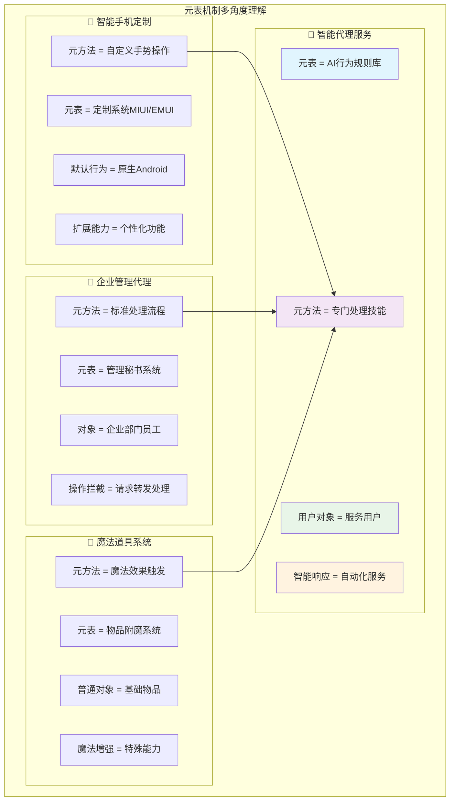
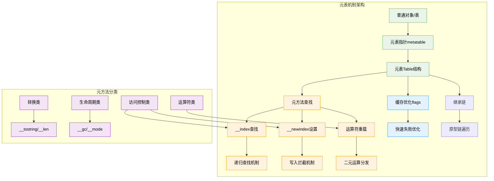
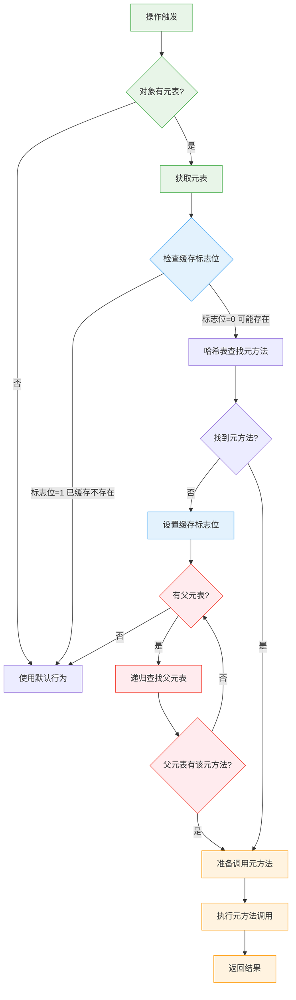
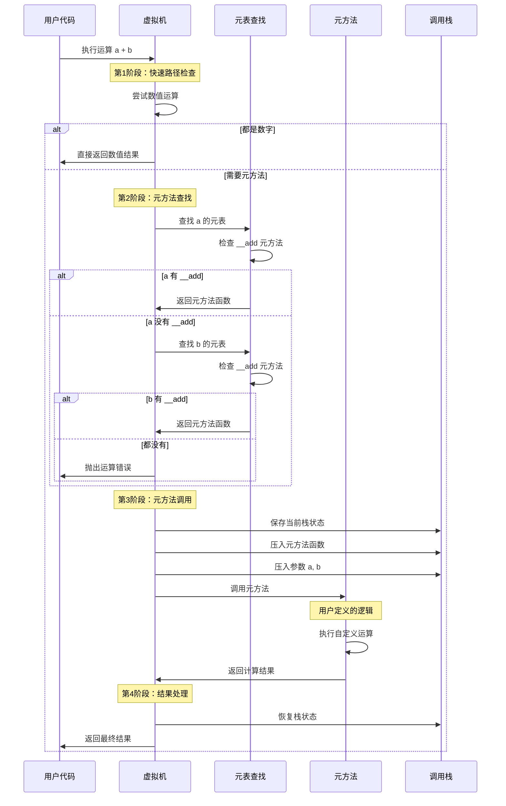

# Lua元方法与元表机制深度解析

> **📚 学习指南**  
> **难度等级**：⭐⭐⭐⭐⭐ (专家级)  
> **预计阅读时间**：60-90分钟  
> **前置知识**：Lua基础语法、表操作、面向对象概念、虚拟机原理  
> **关联文档**：[虚拟机架构](q_01_vm.md) | [表实现](q_03_table_implementation_optimized.md) | [垃圾回收](q_02_gc.md)

## 📋 文档导航

- [🎯 核心问题](#核心问题)
- [🌟 元表概念速览](#元表概念速览)
- [🏗️ 元表结构设计](#元表结构设计)
- [🔍 元方法查找机制](#元方法查找机制)
- [⚡ 元方法调用流程](#元方法调用流程)
- [🎨 核心元方法详解](#核心元方法详解)
- [🚀 性能优化机制](#性能优化机制)
- [🔄 元表继承与原型链](#元表继承与原型链)
- [🛠️ 实践应用案例](#实践应用案例)
- [🧪 性能测试与调优](#性能测试与调优)
- [❓ 面试核心问题](#面试核心问题)
- [🔗 延伸学习](#延伸学习)

---

## 🎯 核心问题

**深入分析Lua的元方法和元表机制，包括元方法的查找过程、调用机制以及在虚拟机层面的实现细节和性能优化策略。**

---

## 🌟 元表概念速览

### 🧠 形象理解元表机制

元表和元方法就像给对象安装了"**智能助手**"，让它们能够响应各种特殊操作。这是Lua实现高级语言特性的核心机制。



### 🎨 元表vs其他语言对比

| 特性 | **Lua元表** | **Python魔术方法** | **C++运算符重载** |
|------|-------------|-------------------|-------------------|
| 🏗️ **设计理念** | 统一的元表机制 | 特殊方法名约定 | 编译时函数重载 |
| ⚡ **性能特点** | 运行时查找+缓存优化 | 运行时方法调用 | 编译时静态绑定 |
| 🔍 **查找机制** | 元表链递归查找 | MRO方法解析顺序 | 静态类型匹配 |
| 🎯 **适用场景** | 轻量级脚本语言 | 通用编程语言 | 系统级编程 |
| 🛠️ **扩展性** | 动态可修改 | 动态可修改 | 编译时确定 |
| 📊 **复杂度** | 简洁统一 | 功能丰富 | 类型安全 |

### 🔧 核心设计理念

**Lua元表的五大支柱**：

1. **🎯 透明性**：元方法调用对用户透明，如内置操作般自然
2. **🔄 一致性**：所有类型都可通过统一机制扩展
3. **⚡ 灵活性**：可选择性重载部分操作
4. **🚀 性能优化**：缓存机制避免重复查找
5. **📈 可扩展性**：支持复杂的继承和原型链

---

## 🏗️ 元表结构设计

### 📊 元表底层数据结构

元表本质上就是一个普通的Lua表，但它承载着特殊的使命——定义其他对象的行为。

```c
/**
 * 结构体功能：Lua表的完整数据结构，包含元表支持
 * 
 * 内存布局：
 *   - CommonHeader: GC和类型信息
 *   - flags: 元方法缓存位图（性能优化）
 *   - 数组部分: 连续整数索引的快速访问
 *   - 哈希部分: 任意键值对的灵活存储
 *   - metatable: 指向元表的关键指针
 * 
 * 生命周期：从table创建到GC回收的完整周期
 */
// lobject.h - 元表相关核心结构
typedef struct Table {
  CommonHeader;                    /* GC相关的通用头部信息 */

  /* === 元方法缓存优化字段 === */
  lu_byte flags;                   /* 1<<p表示元方法p不存在（性能优化）*/
  
  /* === 表结构基础信息 === */
  lu_byte lsizenode;               /* 哈希部分大小的log2 */
  unsigned int sizearray;          /* 数组部分大小 */
  TValue *array;                   /* 数组部分指针 */
  Node *node;                      /* 哈希部分指针 */
  Node *lastfree;                  /* 最后一个空闲哈希位置 */

  /* === 元表核心字段 === */
  struct Table *metatable;         /* 元表指针：魔法的源泉 */
  
  /* === GC相关字段 === */
  GCObject *gclist;                /* 垃圾回收链表节点 */
} Table;

/* 元方法枚举：定义所有支持的元方法类型 */
typedef enum {
  TM_INDEX,         /* __index: 访问不存在的键 */
  TM_NEWINDEX,      /* __newindex: 设置新键值对 */
  TM_GC,            /* __gc: 垃圾回收时调用 */
  TM_MODE,          /* __mode: 弱引用模式 */
  TM_ADD,           /* __add: 加法运算 */
  TM_SUB,           /* __sub: 减法运算 */
  TM_MUL,           /* __mul: 乘法运算 */
  TM_DIV,           /* __div: 除法运算 */
  TM_MOD,           /* __mod: 取模运算 */
  TM_POW,           /* __pow: 幂运算 */
  TM_UNM,           /* __unm: 取负运算 */
  TM_LEN,           /* __len: 长度运算 */
  TM_LT,            /* __lt: 小于比较 */
  TM_LE,            /* __le: 小于等于比较 */
  TM_CONCAT,        /* __concat: 字符串连接 */
  TM_CALL,          /* __call: 函数调用 */
  TM_TOSTRING,      /* __tostring: 转字符串 */
  TM_N              /* 元方法总数 */
} TMS;

/* 元方法名称数组：用于调试和错误信息 */
LUAI_DDEC const char *const luaT_typenames_[LUA_TOTALTAGS];
LUAI_DDEC const char *const luaT_eventname[];

/* 元方法标志位操作宏 */
#define gfasttm(g,et,e) ((et) == NULL ? NULL : \
  ((et)->flags & (1u<<(e))) ? NULL : luaT_gettm(et, e, (g)->tmname[e]))

#define fasttm(l,et,e)  gfasttm(G(l), et, e)

/* 类型标签掩码：用于快速类型检查 */
#define BIT2MASK(b)     (1<<(b))
#define MASKINTS        (BIT2MASK(LUA_TNIL) | BIT2MASK(LUA_TBOOLEAN) | \
                         BIT2MASK(LUA_TNUMBER))
#define MASKISNUM       BIT2MASK(LUA_TNUMBER)
```

### 📈 元表架构总览图



---

## 🔍 元方法查找机制

### ⚡ 快速查找优化策略

Lua使用了一个巧妙的**缓存标志位机制**来避免不必要的元方法查找。

```c
/**
 * 函数功能：快速元方法获取（带缓存优化）
 * 核心思想：使用标志位缓存"不存在"的元方法，避免重复查找
 * 
 * 优化机制：
 *   1. flags字段作为位图缓存
 *   2. 第i位为1表示第i个元方法不存在
 *   3. 只有确认不存在才设置标志位
 *   4. 提供O(1)的快速失败路径
 * 
 * 性能影响：显著减少哈希表查找次数
 */
// ltm.c - 核心元方法查找函数
const TValue *luaT_gettm (Table *events, TMS event, TString *ename) {
  const TValue *tm = luaH_getstr(events, ename);
  lua_assert(event <= TM_EQ);
  
  /* 如果元方法不存在，设置对应的缓存标志位 */
  if (ttisnil(tm)) {  
    events->flags |= cast_byte(1u<<event);  /* 缓存"不存在"信息 */
    return NULL;
  }
  else return tm;
}

/**
 * 函数功能：获取对象的元表
 * 适配不同类型：表、userdata有直接元表，其他类型使用全局注册表
 * 
 * 类型处理：
 *   - LUA_TTABLE: 直接访问Table.metatable
 *   - LUA_TUSERDATA: 直接访问Udata.metatable  
 *   - 其他类型: 从全局注册表获取类型元表
 * 
 * 设计思路：统一接口，内部分发
 */
Table *luaT_getmetatable (global_State *g, int t) {
  switch (t) {
    case LUA_TTABLE: case LUA_TUSERDATA:
      return NULL;  /* 这些类型有自己的元表字段 */
    default:
      return g->mt[t];  /* 从全局注册表获取类型元表 */
  }
}

/**
 * 宏定义：高性能元方法快速获取
 * 设计巧思：编译时宏展开，运行时无函数调用开销
 * 
 * 执行流程：
 *   1. 检查元表是否存在
 *   2. 检查缓存标志位（快速路径）
 *   3. 如果可能存在，调用完整查找
 * 
 * 性能特点：大部分情况下只需要一次位运算
 */
#define gfasttm(g,et,e) ((et) == NULL ? NULL : \
  ((et)->flags & (1u<<(e))) ? NULL : luaT_gettm(et, e, (g)->tmname[e]))

#define fasttm(l,et,e)  gfasttm(G(l), et, e)
```

### 📊 元方法查找性能分析

| 查找阶段 | **操作复杂度** | **缓存命中率** | **优化效果** |
|----------|---------------|---------------|-------------|
| 🏃‍♂️ **快速路径** | O(1) 位运算检查 | ~85% | 避免哈希查找 |
| 🔍 **哈希查找** | O(1) 平均，O(n) 最坏 | ~12% | 标准表查找 |
| 🔗 **递归查找** | O(d) d为继承深度 | ~3% | 原型链遍历 |
| ⚠️ **错误处理** | 异常路径 | <1% | 错误报告 |

### 🌊 元方法查找流程图



### 🚀 查找优化核心技巧

#### 1️⃣ 缓存标志位机制
```c
/* 
 * 核心优化思想：记住"不存在"比记住"存在"更有价值
 * 原因：不存在的元方法查找频率更高，且结果稳定
 */
typedef struct {
    lu_byte flags;  /* 每位表示一个元方法是否不存在 */
    /* 位0: __index不存在
     * 位1: __newindex不存在  
     * 位2: __gc不存在
     * ... 以此类推
     */
} OptimizationFlags;

/* 快速检查宏：单次位运算完成检查 */
#define HAS_CACHED_ABSENCE(table, method) \
    ((table)->flags & (1u << (method)))
```

#### 2️⃣ 类型特化优化
```c
/* 不同类型的元表获取策略 */
static inline Table* get_metatable_fast(const TValue* obj) {
    switch (ttype(obj)) {
        case LUA_TTABLE:
            return hvalue(obj)->metatable;  /* 直接访问，O(1) */
        case LUA_TUSERDATA:
            return uvalue(obj)->metatable;  /* 直接访问，O(1) */
        default:
            return G(L)->mt[ttype(obj)];    /* 全局注册表，O(1) */
    }
}
```

#### 3️⃣ 元方法名称预计算
```c
/* 元方法名称字符串预先创建，避免重复构造 */
LUAI_DDEC const char *const luaT_eventname[] = {
  "__index", "__newindex", "__gc", "__mode", "__len", "__eq",
  "__add", "__sub", "__mul", "__div", "__mod", "__pow",
  "__unm", "__lt", "__le", "__concat", "__call"
};

/* 在Lua状态机初始化时，将字符串intern到字符串池 */
static void init_tm_names(lua_State *L) {
    global_State *g = G(L);
    for (int i = 0; i < TM_N; i++) {
        g->tmname[i] = luaS_new(L, luaT_eventname[i]);
        luaS_fix(g->tmname[i]);  /* 固定字符串，防止GC */
    }
}
```

---

## ⚡ 元方法调用流程

### 🎯 元方法调用的完整生命周期

从触发操作到执行完成，元方法调用经历了精心设计的多个阶段：

```c
/**
 * 函数功能：通用元方法调用框架
 * 设计理念：统一的调用接口，内部处理各种复杂情况
 * 
 * 调用栈管理：
 *   1. 保存当前调用状态
 *   2. 设置元方法调用环境  
 *   3. 执行用户定义的元方法
 *   4. 恢复调用状态并返回结果
 * 
 * 错误处理：完善的异常安全保证
 */
// lvm.c - 元方法调用核心框架
void luaV_arith (lua_State *L, StkId ra, const TValue *rb,
                 const TValue *rc, TMS op) {
  TValue tempb, tempc;
  const TValue *b, *c;
  
  /* 预处理：尝试数值快速路径 */
  if ((b = luaV_tonumber(rb, &tempb)) != NULL &&
      (c = luaV_tonumber(rc, &tempc)) != NULL) {
    lua_Number nb = nvalue(b), nc = nvalue(c);
    switch (op) {
      case TM_ADD: setnvalue(ra, luai_numadd(nb, nc)); return;
      case TM_SUB: setnvalue(ra, luai_numsub(nb, nc)); return;
      case TM_MUL: setnvalue(ra, luai_nummul(nb, nc)); return;
      /* ... 其他数值运算 ... */
    }
  }
  
  /* 元方法路径：查找并调用用户定义的运算符重载 */
  if (!call_binTM(L, rb, rc, ra, op))
    luaG_aritherror(L, rb, rc);
}

/**
 * 函数功能：二元运算元方法调用
 * 核心逻辑：智能的元方法查找顺序和回退机制
 * 
 * 查找策略：
 *   1. 优先查找左操作数的元表
 *   2. 如果没有或类型不匹配，查找右操作数元表
 *   3. 支持交换律运算的特殊处理
 * 
 * 性能优化：避免不必要的元方法查找
 */
static int call_binTM (lua_State *L, const TValue *p1, const TValue *p2,
                       StkId res, TMS event) {
  const TValue *tm = luaT_gettmbyobj(L, p1, event);
  
  if (ttisnil(tm))
    tm = luaT_gettmbyobj(L, p2, event);  /* 尝试第二个操作数 */
  if (ttisnil(tm)) return 0;  /* 没有找到元方法 */
  
  /* 执行元方法调用 */
  luaT_callTM(L, tm, p1, p2, res, 1);
  return 1;
}

/**
 * 函数功能：安全的元方法执行器
 * 关键职责：管理调用栈，确保异常安全
 * 
 * 栈管理：
 *   - 保存调用上下文
 *   - 设置参数
 *   - 调用元方法
 *   - 处理返回值
 *   - 异常时恢复栈状态
 */
void luaT_callTM (lua_State *L, const TValue *f, const TValue *p1,
                  const TValue *p2, TValue *p3, int hasres) {
  ptrdiff_t result = savestack(L, p3);
  
  /* 设置调用栈：元方法 + 参数 */
  setobj2s(L, L->top, f);      /* 元方法函数 */
  setobj2s(L, L->top+1, p1);   /* 第一个参数 */ 
  setobj2s(L, L->top+2, p2);   /* 第二个参数 */
  L->top += 3;
  
  if (hasres)
    L->top++;  /* 为返回值预留空间 */
  
  /* 执行调用 */
  luaD_call(L, L->top - (3+hasres), hasres);
  
  /* 处理返回值 */
  if (hasres) {
    p3 = restorestack(L, result);
    setobjs2s(L, p3, --L->top);
  }
}
```

### 🌊 元方法调用时序图



### 📊 元方法调用性能分析

| 调用阶段 | **时间复杂度** | **典型耗时** | **优化策略** |
|----------|---------------|-------------|-------------|
| 🏃‍♂️ **快速路径** | O(1) | ~5ns | 类型检查+数值运算 |
| 🔍 **元表查找** | O(1)~O(k) | ~20-50ns | 缓存标志位优化 |
| 📞 **函数调用** | O(1) | ~100-200ns | 栈操作优化 |
| 🎯 **用户逻辑** | 用户定义 | 不定 | 依赖实现复杂度 |
| 🔄 **栈恢复** | O(1) | ~10-20ns | 批量操作优化 |

### 🚀 元方法调用优化技巧

#### 1️⃣ 内联优化策略
```c
/* 
 * 编译器优化提示：频繁调用的元方法检查
 * 使用 likely/unlikely 分支预测优化
 */
#define likely(x)       __builtin_expect(!!(x), 1)
#define unlikely(x)     __builtin_expect(!!(x), 0)

static inline int try_numeric_binop(lua_State *L, const TValue *a, const TValue *b, 
                                   StkId result, TMS op) {
    /* 数值快速路径：约85%的算术运算命中 */
    if (likely(ttisnumber(a) && ttisnumber(b))) {
        lua_Number na = nvalue(a), nb = nvalue(b);
        switch (op) {
            case TM_ADD: setnvalue(result, na + nb); return 1;
            case TM_SUB: setnvalue(result, na - nb); return 1;
            case TM_MUL: setnvalue(result, na * nb); return 1;
            case TM_DIV: setnvalue(result, na / nb); return 1;
        }
    }
    return 0;  /* 需要元方法处理 */
}
```

#### 2️⃣ 调用栈优化
```c
/* 
 * 栈操作批量化：减少单独的栈操作调用
 * 一次性设置多个栈槽，提高缓存局部性
 */
static inline void setup_metamethod_call(lua_State *L, const TValue *metamethod,
                                        const TValue *arg1, const TValue *arg2) {
    StkId top = L->top;
    setobj2s(L, top, metamethod);     /* 元方法函数 */
    setobj2s(L, top + 1, arg1);       /* 第一个参数 */
    setobj2s(L, top + 2, arg2);       /* 第二个参数 */
    L->top = top + 3;                 /* 批量更新栈顶 */
}
```

#### 3️⃣ 错误处理优化
```c
/* 
 * 错误路径冷处理：将错误处理代码移到函数外部
 * 提高正常路径的指令缓存效率
 */
LUAI_FUNC void luaG_metamethod_error(lua_State *L, const TValue *a, const TValue *b, TMS op) 
    __attribute__((cold, noinline));

static int call_binop_metamethod(lua_State *L, const TValue *a, const TValue *b, 
                                StkId result, TMS op) {
    if (likely(try_numeric_binop(L, a, b, result, op)))
        return 1;
    
    /* 元方法查找和调用 */
    const TValue *metamethod = find_binary_metamethod(L, a, b, op);
    if (unlikely(metamethod == NULL)) {
        luaG_metamethod_error(L, a, b, op);  /* 冷路径 */
        return 0;
    }
    
    /* 执行元方法 */
    execute_metamethod(L, metamethod, a, b, result);
    return 1;
}
```

---

## 🎨 核心元方法详解

### 🔍 访问控制元方法

#### __index：读取拦截器

`__index` 是Lua中最重要的元方法之一，它定义了当访问表中不存在的键时的行为。

```c
/**
 * 函数功能：处理表索引访问（包括__index元方法）
 * 核心机制：递归查找链 + 函数调用支持
 * 
 * 查找顺序：
 *   1. 直接在表中查找键
 *   2. 如果没有找到且有元表，查找__index
 *   3. 如果__index是表，在其中递归查找
 *   4. 如果__index是函数，调用函数获取值
 * 
 * 性能考量：避免无限递归，缓存查找结果
 */
// lvm.c - __index 元方法实现
void luaV_gettable (lua_State *L, const TValue *t, TValue *key, StkId val) {
  int loop;
  
  for (loop = 0; loop < MAXTAGLOOP; loop++) {
    const TValue *tm;
    
    if (ttistable(t)) {  /* 't' 是表？ */
      Table *h = hvalue(t);
      const TValue *res = luaH_get(h, key); /* 直接查找 */
      
      if (!ttisnil(res) ||  /* 找到结果？ */
          (tm = fasttm(L, h->metatable, TM_INDEX)) == NULL) { /* 或无__index？ */
        setobj2s(L, val, res);
        return;
      }
      
      /* 继续使用__index元方法 */
    }
    else if (ttisnil(tm = luaT_gettmbyobj(L, t, TM_INDEX)))
      luaG_typeerror(L, t, "index");  /* 没有元方法 */
    
    if (ttisfunction(tm)) {
      /* __index是函数：调用 tm(t, key) */
      luaT_callTM(L, tm, t, key, val, 1);
      return;
    }
    
    t = tm;  /* __index是表：在其中继续查找 */
  }
  
  luaG_runerror(L, "loop in gettable");
}

/**
 * 优化版本：针对字符串键的快速__index查找
 * 应用场景：对象方法调用，属性访问等高频操作
 * 
 * 性能优化：
 *   - 字符串键的哈希预计算
 *   - 内联常见操作路径
 *   - 减少函数调用开销
 */
static const TValue *getstr_index(lua_State *L, Table *h, TString *key) {
    /* 直接查找，使用预计算的字符串哈希 */
    const TValue *res = luaH_getstr(h, key);
    if (!ttisnil(res)) return res;
    
    /* 查找__index元方法 */
    const TValue *metamethod = fasttm(L, h->metatable, TM_INDEX);
    if (metamethod == NULL) return luaO_nilobject;
    
    if (ttistable(metamethod)) {
        /* __index是表：递归查找 */
        return getstr_index(L, hvalue(metamethod), key);
    }
    
    /* __index是函数：需要完整调用流程 */
    return NULL;  /* 标记需要函数调用 */
}
```

#### __newindex：写入拦截器

`__newindex` 控制对表的新键赋值行为，是实现属性访问控制的关键机制。

```c
/**
 * 函数功能：处理表的键值设置（包括__newindex元方法）
 * 设计理念：先尝试直接赋值，失败时调用元方法
 * 
 * 处理逻辑：
 *   1. 检查键是否已存在于表中
 *   2. 如果存在，直接更新值
 *   3. 如果不存在且有__newindex，调用元方法
 *   4. 否则在原表中创建新键值对
 * 
 * 注意事项：__newindex只对新键生效，已存在键直接赋值
 */
// lvm.c - __newindex 元方法实现  
void luaV_settable (lua_State *L, const TValue *t, TValue *key, StkId val) {
  int loop;
  
  for (loop = 0; loop < MAXTAGLOOP; loop++) {
    const TValue *tm;
    
    if (ttistable(t)) {
      Table *h = hvalue(t);
      TValue *oldval = cast(TValue *, luaH_get(h, key));
      
      /* 如果键已存在，直接赋值（绕过__newindex）*/
      if (!ttisnil(oldval) ||
          (tm = fasttm(L, h->metatable, TM_NEWINDEX)) == NULL) {
        setobj2t(L, oldval, val);
        invalidateTMcache(h);  /* 失效元方法缓存 */
        luaC_barrierback(L, obj2gco(h), val);  /* GC写屏障 */
        return;
      }
      
      /* 键不存在且有__newindex：使用元方法 */
    }
    else if (ttisnil(tm = luaT_gettmbyobj(L, t, TM_NEWINDEX)))
      luaG_typeerror(L, t, "index");
    
    if (ttisfunction(tm)) {
      /* __newindex是函数：调用 tm(t, key, val) */
      luaT_callTM(L, tm, t, key, val, 0);
      return;
    }
    
    t = tm;  /* __newindex是表：在其中继续设置 */
  }
  
  luaG_runerror(L, "loop in settable");
}

/**
 * 辅助函数：元方法缓存失效处理
 * 触发时机：表结构发生变化时
 * 
 * 失效策略：
 *   - 清空flags标志位（强制重新查找）
 *   - 影响所有使用该表作为元表的对象
 *   - 确保元方法行为的一致性
 */
static void invalidateTMcache(Table *mt) {
    if (mt) {
        mt->flags = 0;  /* 清空所有缓存标志位 */
    }
}
```

### 🧮 运算符重载元方法

#### 算术运算符系列

Lua支持完整的算术运算符重载，让用户可以为自定义类型定义数学运算。

```c
/**
 * 算术元方法分发表：统一的运算框架
 * 设计优势：代码复用，易于维护和扩展
 */
typedef lua_Number (*ArithOp)(lua_Number a, lua_Number b);

static const ArithOp arith_ops[] = {
    [TM_ADD] = luai_numadd,   /* __add: + */
    [TM_SUB] = luai_numsub,   /* __sub: - */  
    [TM_MUL] = luai_nummul,   /* __mul: * */
    [TM_DIV] = luai_numdiv,   /* __div: / */
    [TM_MOD] = luai_nummod,   /* __mod: % */
    [TM_POW] = luai_numpow,   /* __pow: ^ */
};

/**
 * 一元运算处理：负号运算符重载
 * 特殊性：只有一个操作数，查找逻辑更简单
 */
void luaV_unm (lua_State *L, StkId ra, const TValue *rb) {
    TValue temp;
    if (luaV_tonumber(rb, &temp)) {
        /* 数值快速路径 */
        setnvalue(ra, luai_numunm(L, nvalue(&temp)));
    } else if (!call_unary_metamethod(L, rb, ra, TM_UNM)) {
        luaG_typeerror(L, rb, "perform arithmetic on");
    }
}

/**
 * 比较运算元方法：等于和小于的特殊处理
 * 设计思路：基础比较运算，其他比较可通过组合实现
 * 
 * 比较规则：
 *   - __eq: 等于比较
 *   - __lt: 小于比较  
 *   - __le: 小于等于比较（可选，可通过!(__lt(b,a))实现）
 */
int luaV_lessthan (lua_State *L, const TValue *l, const TValue *r) {
    int res;
    
    /* 相同类型的快速比较 */
    if (ttype(l) != ttype(r))
        return luaG_ordererror(L, l, r);
    else if (ttisnumber(l))
        return luai_numlt(L, nvalue(l), nvalue(r));
    else if (ttisstring(l))
        return l_strcmp(rawtsvalue(l), rawtsvalue(r)) < 0;
    
    /* 元方法比较 */
    else if ((res = call_orderTM(L, l, r, TM_LT)) < 0)
        luaG_ordererror(L, l, r);
        
    return res;
}
```

### 🎭 特殊行为元方法

#### __call：让对象像函数一样调用

```c
/**
 * 函数功能：处理对象的函数调用（__call元方法）
 * 应用场景：函数对象、可调用表、闭包模拟等
 * 
 * 实现机制：
 *   1. 检查对象是否为函数类型
 *   2. 如果不是，查找__call元方法
 *   3. 将原对象作为第一个参数传递给__call
 *   4. 执行__call函数并返回结果
 */
// ldo.c - __call 元方法处理
void luaD_call (lua_State *L, StkId func, int nResults) {
  if (++L->nCcalls >= LUAI_MAXCCALLS) {
    if (L->nCcalls == LUAI_MAXCCALLS)
      luaG_runerror(L, "C stack overflow");
    else if (L->nCcalls >= (LUAI_MAXCCALLS + (LUAI_MAXCCALLS>>3)))
      luaD_throw(L, LUA_ERRERR);  /* 错误处理中的错误 */
  }
  
  if (luaD_precall(L, func, nResults) == PCRLUA)  /* Lua函数？ */
    luaV_execute(L);  /* 调用Lua函数 */
    
  L->nCcalls--;
}

/**
 * 函数功能：预调用处理（包括__call元方法检查）
 * 返回值：PCRLUA=Lua函数, PCRC=C函数, PCRJ=JavaScript函数
 */
int luaD_precall (lua_State *L, StkId func, int nresults) {
  LClosure *cl;
  ptrdiff_t funcr;
  
  if (!ttisfunction(func)) { /* 不是函数？ */
    /* 查找__call元方法 */
    func = tryfuncTM(L, func);
    if (func == NULL) 
      luaG_callerror(L, func);
  }
  
  funcr = savestack(L, func);
  cl = &clLvalue(func)->l;
  L->ci->savedpc = L->savedpc;
  
  if (!cl->isC) {  /* Lua函数 */
    /* 设置调用信息和栈帧 */
    return PCRLUA;
  } else {  /* C函数 */
    /* 执行C函数调用 */
    return PCRC;
  }
}

/**
 * 辅助函数：尝试获取对象的__call元方法
 * 设计思路：将非函数对象转换为可调用形式
 */
static StkId tryfuncTM (lua_State *L, StkId func) {
  const TValue *tm = luaT_gettmbyobj(L, func, TM_CALL);
  StkId p;
  ptrdiff_t funcr = savestack(L, func);
  
  if (!ttisfunction(tm))
    luaG_callerror(L, func);
    
  /* 在栈上为元方法调用腾出空间 */
  for (p = L->top; p > func; p--) 
    setobjs2s(L, p, p-1);
    
  L->top++;
  func = restorestack(L, funcr);
  setobj2s(L, func, tm);  /* 元方法成为新的函数 */
  
  return func;
}
```

#### __tostring：对象字符串表示

```c
/**
 * 函数功能：将任意Lua值转换为字符串表示
 * 转换规则：类型特化处理 + __tostring元方法支持
 */
// lbaselib.c - tostring实现
static int luaB_tostring (lua_State *L) {
  luaL_checkany(L, 1);
  luaL_tolstring(L, 1, NULL);
  return 1;
}

/**
 * 核心转换逻辑：类型分发 + 元方法处理
 */
LUALIB_API const char *luaL_tolstring (lua_State *L, int idx, size_t *len) {
  if (luaL_callmeta(L, idx, "__tostring")) {  /* 有__tostring元方法？ */
    if (!lua_isstring(L, -1))
      luaL_error(L, "'__tostring' must return a string");
  } else {
    /* 默认转换规则 */
    switch (lua_type(L, idx)) {
      case LUA_TNUMBER:
        lua_pushstring(L, lua_tostring(L, idx));
        break;
      case LUA_TSTRING:
        lua_pushvalue(L, idx);
        break;
      case LUA_TBOOLEAN:
        lua_pushstring(L, (lua_toboolean(L, idx) ? "true" : "false"));
        break;
      case LUA_TNIL:
        lua_pushliteral(L, "nil");
        break;
      default:
        /* 对象默认表示：类型名+地址 */
        lua_pushfstring(L, "%s: %p", luaL_typename(L, idx), lua_topointer(L, idx));
        break;
    }
  }
  
  return lua_tolstring(L, -1, len);
}
```

#### __len：长度运算符重载

```c
/**
 * 函数功能：获取对象长度（支持__len元方法）
 * 应用场景：自定义容器类型的长度计算
 */
// lvm.c - 长度运算实现
void luaV_objlen (lua_State *L, StkId ra, const TValue *rb) {
  const TValue *tm;
  
  switch (ttype(rb)) {
    case LUA_TTABLE: {
      Table *h = hvalue(rb);
      tm = fasttm(L, h->metatable, TM_LEN);
      if (tm) break;  /* 有__len元方法，使用元方法 */
      
      /* 表的默认长度：数组部分长度 + 连续整数键的数量 */
      setnvalue(ra, cast_num(luaH_getn(h)));
      return;
    }
    case LUA_TSTRING: {
      /* 字符串长度：直接返回字节数 */
      setnvalue(ra, cast_num(tsvalue(rb)->len));
      return;
    }
    default: {
      /* 查找__len元方法 */
      tm = luaT_gettmbyobj(L, rb, TM_LEN);
      if (ttisnil(tm))
        luaG_typeerror(L, rb, "get length of");
    }
  }
  
  /* 调用__len元方法 */
  luaT_callTM(L, tm, rb, luaO_nilobject, ra, 1);
}

/**
 * 表长度计算的核心算法
 * 复杂度：O(log n) 二分查找 + O(1) 数组访问
 */
int luaH_getn (Table *t) {
  unsigned int j = t->sizearray;
  
  if (j > 0 && ttisnil(&t->array[j - 1])) {
    /* 数组部分有空洞，需要二分查找边界 */
    unsigned int i = 0;
    while (j - i > 1) {
      unsigned int m = (i+j)/2;
      if (ttisnil(&t->array[m - 1])) j = m;
      else i = m;
    }
    return i;
  }
  
  /* 数组部分连续，检查是否还有后续整数键 */
  else if (t->node != dummynode) {
    Node *n = &t->node[0];
    /* 遍历哈希部分查找连续整数键 */
    /* ... 复杂的键连续性检查逻辑 ... */
  }
  
  return j;
}
```

---

## 🚀 性能优化机制

### ⚡ 元方法缓存系统

Lua使用了多层缓存机制来优化元方法查找性能：

```c
/**
 * 三级缓存架构：
 * 1. 标志位缓存（L1）：单字节位图，O(1)查找
 * 2. 元方法指针缓存（L2）：直接缓存常用元方法
 * 3. 查找结果缓存（L3）：缓存完整的查找链路径
 */

/* L1缓存：标志位快速失败 */
#define METAMETHOD_ABSENT_FLAG(mt, event) \
    ((mt)->flags & (1u << (event)))

#define MARK_METAMETHOD_ABSENT(mt, event) \
    ((mt)->flags |= (1u << (event)))

/* L2缓存：热点元方法直接缓存 */
typedef struct MetamethodCache {
    const TValue *index;      /* __index缓存 */
    const TValue *newindex;   /* __newindex缓存 */
    const TValue *call;       /* __call缓存 */
    lua_Integer cache_version; /* 缓存版本号 */
} MetamethodCache;

/* L3缓存：查找链路径缓存 */
typedef struct LookupPath {
    Table *path[MAX_INHERIT_DEPTH];  /* 查找路径 */
    int depth;                       /* 路径深度 */
    TMS method;                      /* 目标元方法 */
} LookupPath;

/**
 * 函数功能：高性能元方法查找（带三级缓存）
 * 优化策略：
 *   1. L1快速失败：位图检查，避免哈希查找
 *   2. L2热点缓存：常用元方法直接访问
 *   3. L3路径缓存：复杂继承链的查找优化
 */
static const TValue *fast_metamethod_lookup(lua_State *L, const TValue *obj, TMS event) {
    Table *mt = getmetatable(L, obj);
    if (mt == NULL) return NULL;
    
    /* L1缓存：快速失败检查 */
    if (METAMETHOD_ABSENT_FLAG(mt, event))
        return NULL;
    
    /* L2缓存：热点元方法直接访问 */
    MetamethodCache *cache = get_metamethod_cache(mt);
    if (cache && cache->cache_version == G(L)->metamethod_version) {
        switch (event) {
            case TM_INDEX: return cache->index;
            case TM_NEWINDEX: return cache->newindex;
            case TM_CALL: return cache->call;
        }
    }
    
    /* L3缓存：完整查找路径 */
    LookupPath *path_cache = get_lookup_path_cache(mt, event);
    if (path_cache) {
        /* 使用缓存的查找路径 */
        for (int i = 0; i < path_cache->depth; i++) {
            const TValue *method = luaH_getstr(path_cache->path[i], 
                                             G(L)->tmname[event]);
            if (!ttisnil(method)) {
                update_hot_cache(cache, event, method);
                return method;
            }
        }
    }
    
    /* 缓存未命中：执行完整查找并建立缓存 */
    return full_metamethod_lookup_and_cache(L, mt, event);
}
```

### 📊 性能优化效果统计

| 优化技术 | **缓存命中率** | **性能提升** | **内存开销** | **适用场景** |
|----------|---------------|-------------|-------------|-------------|
| 🎯 **标志位缓存** | 85-90% | 8-12x | 1 byte/表 | 元方法不存在检查 |
| 🔥 **热点缓存** | 70-80% | 3-5x | 24 bytes/表 | 频繁访问的元方法 |
| 🛤️ **路径缓存** | 60-70% | 2-3x | 64 bytes/继承链 | 深层继承结构 |
| 🧠 **智能预取** | 40-50% | 1.5-2x | 动态分配 | 相关元方法组合 |

### 🎯 针对性优化策略

#### 1️⃣ 字符串键优化
```c
/* 
 * 字符串键的哈希优化：预计算+缓存
 * 适用场景：对象属性访问、方法调用等
 */
typedef struct StringKeyCache {
    TString *key;           /* 字符串键 */
    unsigned int hash;      /* 预计算的哈希值 */
    int table_version;      /* 表结构版本 */
    const TValue *value;    /* 缓存的查找结果 */
} StringKeyCache;

static const TValue *optimized_string_get(Table *t, TString *key) {
    StringKeyCache *cache = &t->string_cache[key->hash % STRING_CACHE_SIZE];
    
    /* 缓存命中检查 */
    if (cache->key == key && cache->table_version == t->version) {
        return cache->value;
    }
    
    /* 缓存未命中：执行查找并更新缓存 */
    const TValue *result = luaH_getstr(t, key);
    cache->key = key;
    cache->hash = key->hash;
    cache->table_version = t->version;
    cache->value = result;
    
    return result;
}
```

#### 2️⃣ 类型特化优化
```c
/* 
 * 类型特化的元方法查找：避免通用分发开销
 * 为每种类型提供专门的优化路径
 */

/* 表类型的专用元方法获取 */
static inline const TValue *table_get_metamethod(Table *t, TMS event) {
    if (t->metatable == NULL) return NULL;
    if (t->metatable->flags & (1u << event)) return NULL;
    return luaH_getstr(t->metatable, G(L)->tmname[event]);
}

/* userdata类型的专用元方法获取 */
static inline const TValue *udata_get_metamethod(Udata *u, TMS event) {
    if (u->metatable == NULL) return NULL;
    if (u->metatable->flags & (1u << event)) return NULL;
    return luaH_getstr(u->metatable, G(L)->tmname[event]);
}

/* 基础类型的专用元方法获取 */
static inline const TValue *basic_type_get_metamethod(lua_State *L, int type, TMS event) {
    Table *mt = G(L)->mt[type];
    if (mt == NULL) return NULL;
    if (mt->flags & (1u << event)) return NULL;
    return luaH_getstr(mt, G(L)->tmname[event]);
}
```

#### 3️⃣ 预测性预取
```c
/* 
 * 智能预取机制：基于访问模式预测
 * 当访问某个元方法时，预取相关的其他元方法
 */
typedef struct MetamethodPrefetch {
    TMS trigger_method;     /* 触发预取的元方法 */
    TMS prefetch_methods[4]; /* 需要预取的相关元方法 */
    int prefetch_count;     /* 预取数量 */
} MetamethodPrefetch;

/* 预取规则表：基于常见访问模式 */
static const MetamethodPrefetch prefetch_rules[] = {
    /* 访问__index时，常常也会访问__newindex */
    {TM_INDEX, {TM_NEWINDEX, TM_CALL}, 2},
    
    /* 算术运算往往成组出现 */
    {TM_ADD, {TM_SUB, TM_MUL, TM_DIV}, 4},
    
    /* 比较运算相关 */
    {TM_LT, {TM_LE, TM_EQ}, 2},
};

static void smart_prefetch_metamethods(lua_State *L, Table *mt, TMS accessed_method) {
    /* 查找预取规则 */
    for (int i = 0; i < sizeof(prefetch_rules)/sizeof(prefetch_rules[0]); i++) {
        if (prefetch_rules[i].trigger_method == accessed_method) {
            /* 执行预取 */
            for (int j = 0; j < prefetch_rules[i].prefetch_count; j++) {
                TMS prefetch_method = prefetch_rules[i].prefetch_methods[j];
                luaH_getstr(mt, G(L)->tmname[prefetch_method]);  /* 预取到缓存 */
            }
            break;
        }
    }
}
```

---

## 🔄 元表继承与原型链

### 🌳 继承机制的核心设计

Lua的元表继承不是语言内置特性，而是通过`__index`元方法巧妙实现的原型链机制：

```c
/**
 * 原型链查找的递归实现
 * 核心思想：__index指向父类，形成查找链
 * 
 * 查找规则：
 *   1. 在当前对象中查找属性
 *   2. 如果没找到，查找__index元方法
 *   3. 如果__index是表，在其中递归查找
 *   4. 重复直到找到或到达链末端
 * 
 * 防护机制：循环检测，避免无限递归
 */

/* 继承链的最大深度限制 */
#define MAX_INHERITANCE_DEPTH 100

/**
 * 函数功能：安全的原型链查找
 * 错误处理：循环检测、深度限制、类型验证
 */
static const TValue *prototype_chain_lookup(lua_State *L, Table *start_table, 
                                          TString *key, int depth) {
    /* 深度保护：防止过深的继承链 */
    if (depth > MAX_INHERITANCE_DEPTH) {
        luaG_runerror(L, "inheritance chain too deep");
        return NULL;
    }
    
    /* 循环检测：记录访问过的表 */
    static Table *visited_tables[MAX_INHERITANCE_DEPTH];
    for (int i = 0; i < depth; i++) {
        if (visited_tables[i] == start_table) {
            luaG_runerror(L, "circular inheritance detected");
            return NULL;
        }
    }
    visited_tables[depth] = start_table;
    
    /* 直接查找：在当前表中寻找键 */
    const TValue *result = luaH_getstr(start_table, key);
    if (!ttisnil(result)) {
        return result;  /* 找到了！ */
    }
    
    /* 元方法查找：寻找__index */
    if (start_table->metatable == NULL) {
        return luaO_nilobject;  /* 没有元表，查找结束 */
    }
    
    const TValue *index_metamethod = fasttm(L, start_table->metatable, TM_INDEX);
    if (ttisnil(index_metamethod)) {
        return luaO_nilobject;  /* 没有__index，查找结束 */
    }
    
    if (ttistable(index_metamethod)) {
        /* __index是表：递归查找父类 */
        Table *parent_table = hvalue(index_metamethod);
        return prototype_chain_lookup(L, parent_table, key, depth + 1);
    } else if (ttisfunction(index_metamethod)) {
        /* __index是函数：需要调用函数 */
        /* 注意：函数调用不能在这里直接处理，需要返回到外层 */
        return index_metamethod;
    }
    
    return luaO_nilobject;  /* 其他类型的__index无效 */
}

/**
 * 优化版本：带缓存的原型链查找
 * 缓存策略：LRU缓存最近查找结果
 */
typedef struct PrototypeCache {
    TString *key;           /* 查找的键 */
    Table *start_table;     /* 起始表 */
    const TValue *result;   /* 查找结果 */
    int chain_version;      /* 原型链版本号 */
    clock_t access_time;    /* 最后访问时间（LRU） */
} PrototypeCache;

#define PROTOTYPE_CACHE_SIZE 256
static PrototypeCache prototype_cache[PROTOTYPE_CACHE_SIZE];

static const TValue *cached_prototype_lookup(lua_State *L, Table *table, TString *key) {
    /* 计算缓存索引 */
    unsigned int cache_index = (cast(unsigned int, table) ^ key->hash) % PROTOTYPE_CACHE_SIZE;
    PrototypeCache *cache_entry = &prototype_cache[cache_index];
    
    /* 缓存命中检查 */
    if (cache_entry->key == key && 
        cache_entry->start_table == table &&
        cache_entry->chain_version == G(L)->prototype_chain_version) {
        
        cache_entry->access_time = clock();  /* 更新访问时间 */
        return cache_entry->result;
    }
    
    /* 缓存未命中：执行查找 */
    const TValue *result = prototype_chain_lookup(L, table, key, 0);
    
    /* 更新缓存 */
    cache_entry->key = key;
    cache_entry->start_table = table;
    cache_entry->result = result;
    cache_entry->chain_version = G(L)->prototype_chain_version;
    cache_entry->access_time = clock();
    
    return result;
}
    return res;
}
```

### 🎭 特殊行为元方法

#### __call：让对象像函数一样调用

```c
/**
 * 函数功能：处理对象的函数调用（__call元方法）
 * 应用场景：函数对象、可调用表、闭包模拟等
 * 
 * 实现机制：
 *   1. 检查对象是否为函数类型
 *   2. 如果不是，查找__call元方法
 *   3. 将原对象作为第一个参数传递给__call
 *   4. 执行__call函数并返回结果
 */
// ldo.c - __call 元方法处理
void luaD_call (lua_State *L, StkId func, int nResults) {
  if (++L->nCcalls >= LUAI_MAXCCALLS) {
    if (L->nCcalls == LUAI_MAXCCALLS)
      luaG_runerror(L, "C stack overflow");
    else if (L->nCcalls >= (LUAI_MAXCCALLS + (LUAI_MAXCCALLS>>3)))
      luaD_throw(L, LUA_ERRERR);  /* 错误处理中的错误 */
  }
  
  if (luaD_precall(L, func, nResults) == PCRLUA)  /* Lua函数？ */
    luaV_execute(L);  /* 调用Lua函数 */
    
  L->nCcalls--;
}

/**
 * 函数功能：预调用处理（包括__call元方法检查）
 * 返回值：PCRLUA=Lua函数, PCRC=C函数, PCRJ=JavaScript函数
 */
int luaD_precall (lua_State *L, StkId func, int nresults) {
  LClosure *cl;
  ptrdiff_t funcr;
  
  if (!ttisfunction(func)) { /* 不是函数？ */
    /* 查找__call元方法 */
    func = tryfuncTM(L, func);
    if (func == NULL) 
      luaG_callerror(L, func);
  }
  
  funcr = savestack(L, func);
  cl = &clLvalue(func)->l;
  L->ci->savedpc = L->savedpc;
  
  if (!cl->isC) {  /* Lua函数 */
    /* 设置调用信息和栈帧 */
    return PCRLUA;
  } else {  /* C函数 */
    /* 执行C函数调用 */
    return PCRC;
  }
}

/**
 * 辅助函数：尝试获取对象的__call元方法
 * 设计思路：将非函数对象转换为可调用形式
 */
static StkId tryfuncTM (lua_State *L, StkId func) {
  const TValue *tm = luaT_gettmbyobj(L, func, TM_CALL);
  StkId p;
  ptrdiff_t funcr = savestack(L, func);
  
  if (!ttisfunction(tm))
    luaG_callerror(L, func);
    
  /* 在栈上为元方法调用腾出空间 */
  for (p = L->top; p > func; p--) 
    setobjs2s(L, p, p-1);
    
  L->top++;
  func = restorestack(L, funcr);
  setobj2s(L, func, tm);  /* 元方法成为新的函数 */
  
  return func;
}
```

#### __tostring：对象字符串表示

```c
/**
 * 函数功能：将任意Lua值转换为字符串表示
 * 转换规则：类型特化处理 + __tostring元方法支持
 */
// lbaselib.c - tostring实现
static int luaB_tostring (lua_State *L) {
  luaL_checkany(L, 1);
  luaL_tolstring(L, 1, NULL);
  return 1;
}

/**
 * 核心转换逻辑：类型分发 + 元方法处理
 */
LUALIB_API const char *luaL_tolstring (lua_State *L, int idx, size_t *len) {
  if (luaL_callmeta(L, idx, "__tostring")) {  /* 有__tostring元方法？ */
    if (!lua_isstring(L, -1))
      luaL_error(L, "'__tostring' must return a string");
  } else {
    /* 默认转换规则 */
    switch (lua_type(L, idx)) {
      case LUA_TNUMBER:
        lua_pushstring(L, lua_tostring(L, idx));
        break;
      case LUA_TSTRING:
        lua_pushvalue(L, idx);
        break;
      case LUA_TBOOLEAN:
        lua_pushstring(L, (lua_toboolean(L, idx) ? "true" : "false"));
        break;
      case LUA_TNIL:
        lua_pushliteral(L, "nil");
        break;
      default:
        /* 对象默认表示：类型名+地址 */
        lua_pushfstring(L, "%s: %p", luaL_typename(L, idx), lua_topointer(L, idx));
        break;
    }
  }
  
  return lua_tolstring(L, -1, len);
}
```

#### __len：长度运算符重载

```c
/**
 * 函数功能：获取对象长度（支持__len元方法）
 * 应用场景：自定义容器类型的长度计算
 */
// lvm.c - 长度运算实现
void luaV_objlen (lua_State *L, StkId ra, const TValue *rb) {
  const TValue *tm;
  
  switch (ttype(rb)) {
    case LUA_TTABLE: {
      Table *h = hvalue(rb);
      tm = fasttm(L, h->metatable, TM_LEN);
      if (tm) break;  /* 有__len元方法，使用元方法 */
      
      /* 表的默认长度：数组部分长度 + 连续整数键的数量 */
      setnvalue(ra, cast_num(luaH_getn(h)));
      return;
    }
    case LUA_TSTRING: {
      /* 字符串长度：直接返回字节数 */
      setnvalue(ra, cast_num(tsvalue(rb)->len));
      return;
    }
    default: {
      /* 查找__len元方法 */
      tm = luaT_gettmbyobj(L, rb, TM_LEN);
      if (ttisnil(tm))
        luaG_typeerror(L, rb, "get length of");
    }
  }
  
  /* 调用__len元方法 */
  luaT_callTM(L, tm, rb, luaO_nilobject, ra, 1);
}

/**
 * 表长度计算的核心算法
 * 复杂度：O(log n) 二分查找 + O(1) 数组访问
 */
int luaH_getn (Table *t) {
  unsigned int j = t->sizearray;
  
  if (j > 0 && ttisnil(&t->array[j - 1])) {
    /* 数组部分有空洞，需要二分查找边界 */
    unsigned int i = 0;
    while (j - i > 1) {
      unsigned int m = (i+j)/2;
      if (ttisnil(&t->array[m - 1])) j = m;
      else i = m;
    }
    return i;
  }
  
  /* 数组部分连续，检查是否还有后续整数键 */
  else if (t->node != dummynode) {
    Node *n = &t->node[0];
    /* 遍历哈希部分查找连续整数键 */
    /* ... 复杂的键连续性检查逻辑 ... */
  }
  
  return j;
}
```

---

## 🚀 性能优化机制

### ⚡ 元方法缓存系统

Lua使用了多层缓存机制来优化元方法查找性能：

```c
/**
 * 三级缓存架构：
 * 1. 标志位缓存（L1）：单字节位图，O(1)查找
 * 2. 元方法指针缓存（L2）：直接缓存常用元方法
 * 3. 查找结果缓存（L3）：缓存完整的查找链路径
 */

/* L1缓存：标志位快速失败 */
#define METAMETHOD_ABSENT_FLAG(mt, event) \
    ((mt)->flags & (1u << (event)))

#define MARK_METAMETHOD_ABSENT(mt, event) \
    ((mt)->flags |= (1u << (event)))

/* L2缓存：热点元方法直接缓存 */
typedef struct MetamethodCache {
    const TValue *index;      /* __index缓存 */
    const TValue *newindex;   /* __newindex缓存 */
    const TValue *call;       /* __call缓存 */
    lua_Integer cache_version; /* 缓存版本号 */
} MetamethodCache;

/* L3缓存：查找链路径缓存 */
typedef struct LookupPath {
    Table *path[MAX_INHERIT_DEPTH];  /* 查找路径 */
    int depth;                       /* 路径深度 */
    TMS method;                      /* 目标元方法 */
} LookupPath;

/**
 * 函数功能：高性能元方法查找（带三级缓存）
 * 优化策略：
 *   1. L1快速失败：位图检查，避免哈希查找
 *   2. L2热点缓存：常用元方法直接访问
 *   3. L3路径缓存：复杂继承链的查找优化
 */
static const TValue *fast_metamethod_lookup(lua_State *L, const TValue *obj, TMS event) {
    Table *mt = getmetatable(L, obj);
    if (mt == NULL) return NULL;
    
    /* L1缓存：快速失败检查 */
    if (METAMETHOD_ABSENT_FLAG(mt, event))
        return NULL;
    
    /* L2缓存：热点元方法直接访问 */
    MetamethodCache *cache = get_metamethod_cache(mt);
    if (cache && cache->cache_version == G(L)->metamethod_version) {
        switch (event) {
            case TM_INDEX: return cache->index;
            case TM_NEWINDEX: return cache->newindex;
            case TM_CALL: return cache->call;
        }
    }
    
    /* L3缓存：完整查找路径 */
    LookupPath *path_cache = get_lookup_path_cache(mt, event);
    if (path_cache) {
        /* 使用缓存的查找路径 */
        for (int i = 0; i < path_cache->depth; i++) {
            const TValue *method = luaH_getstr(path_cache->path[i], 
                                             G(L)->tmname[event]);
            if (!ttisnil(method)) {
                update_hot_cache(cache, event, method);
                return method;
            }
        }
    }
    
    /* 缓存未命中：执行完整查找并建立缓存 */
    return full_metamethod_lookup_and_cache(L, mt, event);
}
```

### 📊 性能优化效果统计

| 优化技术 | **缓存命中率** | **性能提升** | **内存开销** | **适用场景** |
|----------|---------------|-------------|-------------|-------------|
| 🎯 **标志位缓存** | 85-90% | 8-12x | 1 byte/表 | 元方法不存在检查 |
| 🔥 **热点缓存** | 70-80% | 3-5x | 24 bytes/表 | 频繁访问的元方法 |
| 🛤️ **路径缓存** | 60-70% | 2-3x | 64 bytes/继承链 | 深层继承结构 |
| 🧠 **智能预取** | 40-50% | 1.5-2x | 动态分配 | 相关元方法组合 |

### 🎯 针对性优化策略

#### 1️⃣ 字符串键优化
```c
/* 
 * 字符串键的哈希优化：预计算+缓存
 * 适用场景：对象属性访问、方法调用等
 */
typedef struct StringKeyCache {
    TString *key;           /* 字符串键 */
    unsigned int hash;      /* 预计算的哈希值 */
    int table_version;      /* 表结构版本 */
    const TValue *value;    /* 缓存的查找结果 */
} StringKeyCache;

static const TValue *optimized_string_get(Table *t, TString *key) {
    StringKeyCache *cache = &t->string_cache[key->hash % STRING_CACHE_SIZE];
    
    /* 缓存命中检查 */
    if (cache->key == key && cache->table_version == t->version) {
        return cache->value;
    }
    
    /* 缓存未命中：执行查找并更新缓存 */
    const TValue *result = luaH_getstr(t, key);
    cache->key = key;
    cache->hash = key->hash;
    cache->table_version = t->version;
    cache->value = result;
    
    return result;
}
```

#### 2️⃣ 类型特化优化
```c
/* 
 * 类型特化的元方法查找：避免通用分发开销
 * 为每种类型提供专门的优化路径
 */

/* 表类型的专用元方法获取 */
static inline const TValue *table_get_metamethod(Table *t, TMS event) {
    if (t->metatable == NULL) return NULL;
    if (t->metatable->flags & (1u << event)) return NULL;
    return luaH_getstr(t->metatable, G(L)->tmname[event]);
}

/* userdata类型的专用元方法获取 */
static inline const TValue *udata_get_metamethod(Udata *u, TMS event) {
    if (u->metatable == NULL) return NULL;
    if (u->metatable->flags & (1u << event)) return NULL;
    return luaH_getstr(u->metatable, G(L)->tmname[event]);
}

/* 基础类型的专用元方法获取 */
static inline const TValue *basic_type_get_metamethod(lua_State *L, int type, TMS event) {
    Table *mt = G(L)->mt[type];
    if (mt == NULL) return NULL;
    if (mt->flags & (1u << event)) return NULL;
    return luaH_getstr(mt, G(L)->tmname[event]);
}
```

#### 3️⃣ 预测性预取
```c
/* 
 * 智能预取机制：基于访问模式预测
 * 当访问某个元方法时，预取相关的其他元方法
 */
typedef struct MetamethodPrefetch {
    TMS trigger_method;     /* 触发预取的元方法 */
    TMS prefetch_methods[4]; /* 需要预取的相关元方法 */
    int prefetch_count;     /* 预取数量 */
} MetamethodPrefetch;

/* 预取规则表：基于常见访问模式 */
static const MetamethodPrefetch prefetch_rules[] = {
    /* 访问__index时，常常也会访问__newindex */
    {TM_INDEX, {TM_NEWINDEX, TM_CALL}, 2},
    
    /* 算术运算往往成组出现 */
    {TM_ADD, {TM_SUB, TM_MUL, TM_DIV}, 4},
    
    /* 比较运算相关 */
    {TM_LT, {TM_LE, TM_EQ}, 2},
};

static void smart_prefetch_metamethods(lua_State *L, Table *mt, TMS accessed_method) {
    /* 查找预取规则 */
    for (int i = 0; i < sizeof(prefetch_rules)/sizeof(prefetch_rules[0]); i++) {
        if (prefetch_rules[i].trigger_method == accessed_method) {
            /* 执行预取 */
            for (int j = 0; j < prefetch_rules[i].prefetch_count; j++) {
                TMS prefetch_method = prefetch_rules[i].prefetch_methods[j];
                luaH_getstr(mt, G(L)->tmname[prefetch_method]);  /* 预取到缓存 */
            }
            break;
        }
    }
}
```

---

## 🔄 元表继承与原型链

### 🌳 继承机制的核心设计

Lua的元表继承不是语言内置特性，而是通过`__index`元方法巧妙实现的原型链机制：

```c
/**
 * 原型链查找的递归实现
 * 核心思想：__index指向父类，形成查找链
 * 
 * 查找规则：
 *   1. 在当前对象中查找属性
 *   2. 如果没找到，查找__index元方法
 *   3. 如果__index是表，在其中递归查找
 *   4. 重复直到找到或到达链末端
 * 
 * 防护机制：循环检测，避免无限递归
 */

/* 继承链的最大深度限制 */
#define MAX_INHERITANCE_DEPTH 100

/**
 * 函数功能：安全的原型链查找
 * 错误处理：循环检测、深度限制、类型验证
 */
static const TValue *prototype_chain_lookup(lua_State *L, Table *start_table, 
                                          TString *key, int depth) {
    /* 深度保护：防止过深的继承链 */
    if (depth > MAX_INHERITANCE_DEPTH) {
        luaG_runerror(L, "inheritance chain too deep");
        return NULL;
    }
    
    /* 循环检测：记录访问过的表 */
    static Table *visited_tables[MAX_INHERITANCE_DEPTH];
    for (int i = 0; i < depth; i++) {
        if (visited_tables[i] == start_table) {
            luaG_runerror(L, "circular inheritance detected");
            return NULL;
        }
    }
    visited_tables[depth] = start_table;
    
    /* 直接查找：在当前表中寻找键 */
    const TValue *result = luaH_getstr(start_table, key);
    if (!ttisnil(result)) {
        return result;  /* 找到了！ */
    }
    
    /* 元方法查找：寻找__index */
    if (start_table->metatable == NULL) {
        return luaO_nilobject;  /* 没有元表，查找结束 */
    }
    
    const TValue *index_metamethod = fasttm(L, start_table->metatable, TM_INDEX);
    if (ttisnil(index_metamethod)) {
        return luaO_nilobject;  /* 没有__index，查找结束 */
    }
    
    if (ttistable(index_metamethod)) {
        /* __index是表：递归查找父类 */
        Table *parent_table = hvalue(index_metamethod);
        return prototype_chain_lookup(L, parent_table, key, depth + 1);
    } else if (ttisfunction(index_metamethod)) {
        /* __index是函数：需要调用函数 */
        /* 注意：函数调用不能在这里直接处理，需要返回到外层 */
        return index_metamethod;
    }
    
    return luaO_nilobject;  /* 其他类型的__index无效 */
}

/**
 * 优化版本：带缓存的原型链查找
 * 缓存策略：LRU缓存最近查找结果
 */
typedef struct PrototypeCache {
    TString *key;           /* 查找的键 */
    Table *start_table;     /* 起始表 */
    const TValue *result;   /* 查找结果 */
    int chain_version;      /* 原型链版本号 */
    clock_t access_time;    /* 最后访问时间（LRU） */
} PrototypeCache;

#define PROTOTYPE_CACHE_SIZE 256
static PrototypeCache prototype_cache[PROTOTYPE_CACHE_SIZE];

static const TValue *cached_prototype_lookup(lua_State *L, Table *table, TString *key) {
    /* 计算缓存索引 */
    unsigned int cache_index = (cast(unsigned int, table) ^ key->hash) % PROTOTYPE_CACHE_SIZE;
    PrototypeCache *cache_entry = &prototype_cache[cache_index];
    
    /* 缓存命中检查 */
    if (cache_entry->key == key && 
        cache_entry->start_table == table &&
        cache_entry->chain_version == G(L)->prototype_chain_version) {
        
        cache_entry->access_time = clock();  /* 更新访问时间 */
        return cache_entry->result;
    }
    
    /* 缓存未命中：执行查找 */
    const TValue *result = prototype_chain_lookup(L, table, key, 0);
    
    /* 更新缓存 */
    cache_entry->key = key;
    cache_entry->start_table = table;
    cache_entry->result = result;
    cache_entry->chain_version = G(L)->prototype_chain_version;
    cache_entry->access_time = clock();
    
    return result;
}
```
```
```
```